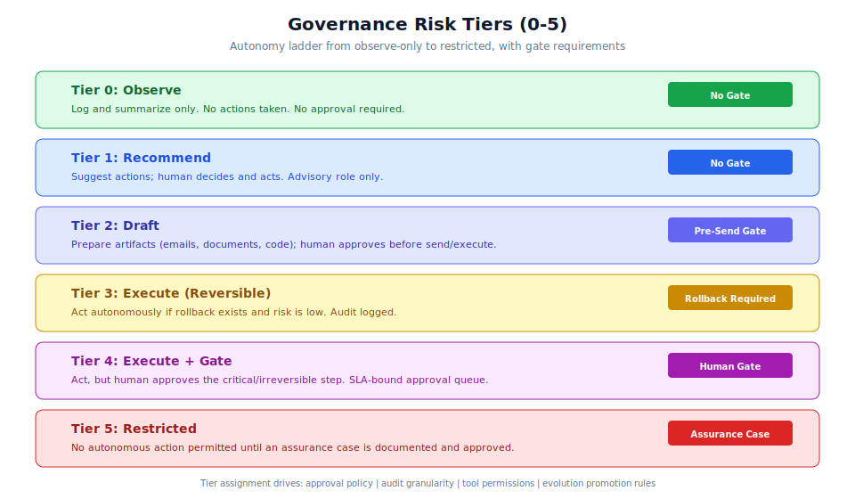

# Chapter 3.4: RBAC and Governance Configuration

## Learning Objectives

By the end of this chapter, you will be able to:

1. Configure and assign risk tiers (0-5) to workflow steps and agents
2. Set up human approval policies with SLA deadlines and escalation paths
3. Configure tool permission controls using least-privilege allow-lists
4. Manage the AI inventory (registered agents, use cases, model cards)
5. Create assurance cases for high-risk (tier 4+) operations
6. Set up audit logging for compliance and incident response
7. Align governance configuration with NIST AI RMF, ISO 42001, and EU AI Act requirements

## Prerequisites

- Completed Chapter 3.3 (Advanced Workflow Automation)
- Admin-level access to the Generic Swarm Ops instance
- Understanding of risk management frameworks
- Familiarity with approval queue operations (Chapter 3.2)
- At least one registered domain pack with active agents

---

## Architecture Overview



Governance in Generic Swarm Ops is built on a layered model: risk tiers define the autonomy ceiling, approval policies define the gate mechanism, tool permissions enforce least privilege, and audit logs provide the trail for compliance verification. The Governance Officer is a runtime component that intercepts workflow execution to enforce these controls.

### Governance Artifacts

The system ships and maintains these governance artifacts under `business/governance/`:

| Artifact | Purpose | Update Cadence |
|----------|---------|----------------|
| AI Inventory | Registered agents and use cases | On agent registration/activation |
| Risk Tier Assignments | Autonomy ladder per step/agent | On workflow creation/modification |
| Human Approval Policy | When gates fire, SLA timings | On policy change |
| Model Card | Flagship orchestrator status and capabilities | Quarterly |
| Assurance Case | Tier 4/5 justification documentation | Before tier assignment |
| Tool Permission Controls | Least-privilege allow-lists per agent | On agent/tool registration |
| Audit Logs | Append-only record of all actions | Continuous (runtime) |

---

## Step-by-Step: Risk Tier Configuration

### Step 1: Understand the Autonomy Ladder

Generic Swarm Ops defines six risk tiers that form an autonomy ladder:

| Tier | Name | Allowed Behavior | Gate Requirement |
|------|------|-----------------|------------------|
| 0 | Observe | Log and summarize only | None |
| 1 | Recommend | Suggest; human acts | None |
| 2 | Draft | Prepare artifacts; human approves before send/execute | Pre-send approval |
| 3 | Execute (reversible) | Act if rollback exists and risk is low | Rollback plan required |
| 4 | Execute + gate | Act, but human approves the critical step | Human gate (SLA-bound) |
| 5 | Restricted | No autonomous action until assurance case exists | Assurance case + approval |

> **Warning:** Tier 5 (Restricted) is the most constrained level. It is used for operations where no autonomous action should occur until a documented assurance case has been reviewed and approved. This is appropriate for clinical decisions, financial transactions above thresholds, or any action with potentially irreversible human impact.

### Step 2: Assign Risk Tiers to Workflow Steps

Each step in a workflow DNA file carries a risk tier assignment:

```yaml
# Example: Configuring risk tiers for a customer onboarding workflow
workflow_id: wf_customer_onboarding_v12
domain: ops
risk_tier: 3  # Overall workflow risk tier (highest of any step)

steps:
  - id: intake
    agent: ops.intake_agent
    action: receive_application
    risk_tier: 0  # Observe only - just logging the incoming request

  - id: kyc_check
    agent: ops.kyc_agent
    action: verify_identity
    risk_tier: 1  # Recommend - suggests verification result, human confirms

  - id: credit_assessment
    agent: ops.credit_agent
    action: assess_creditworthiness
    risk_tier: 2  # Draft - prepares credit report, human reviews before sharing

  - id: account_creation
    agent: ops.account_agent
    action: create_account
    risk_tier: 3  # Execute (reversible) - can create account because it can be deleted
    rollback_action: delete_account

  - id: billing_setup
    agent: ops.billing_agent
    action: setup_billing
    risk_tier: 4  # Execute + gate - irreversible financial action, human approves
    requires_approval: true
    approval_role: billing_reviewer
    approval_sla_minutes: 60
```

### Step 3: Assign Risk Tiers to Agents

Agents also carry a risk tier that acts as a ceiling on their autonomous behavior:

```bash
# Set agent risk tier via API
curl -X PATCH http://127.0.0.1:8000/api/v1/agents/ops.billing_agent \
  -H "Authorization: Bearer admin-token" \
  -H "Content-Type: application/json" \
  -d '{
    "risk_tier": 4,
    "risk_justification": "Handles financial transactions that cannot be reversed after 24h"
  }'
```

> **Note:** If an agent's risk tier is lower than a step's risk tier, the step's tier wins (most restrictive). The agent cannot be assigned to steps that exceed its configured tier without explicit override and assurance case.

### Step 4: Configure Step-Level Tier Overrides

For specific contexts, you may need to override the default tier:

```yaml
steps:
  - id: emergency_override
    agent: ops.account_agent
    action: freeze_account
    risk_tier: 3
    tier_override:
      condition: "customer.fraud_score > 0.95"
      override_tier: 4
      justification: "High fraud score requires human confirmation before freeze"
```

---

## Step-by-Step: Human Approval Policy

### Step 5: Define Approval Policies

Approval policies specify when human gates fire, who can approve, and what SLAs apply:

```json
{
  "policy_id": "approval_policy_onboarding",
  "workflow_id": "wf_customer_onboarding_v12",
  "rules": [
    {
      "trigger": "risk_tier >= 4",
      "approval_required": true,
      "approver_roles": ["billing_reviewer", "admin"],
      "sla_minutes": 60,
      "escalation": {
        "after_minutes": 45,
        "escalate_to": "admin",
        "notification_channels": ["email", "slack"]
      }
    },
    {
      "trigger": "step.id == 'billing_setup' AND payload.amount > 10000",
      "approval_required": true,
      "approver_roles": ["finance_director"],
      "sla_minutes": 120,
      "require_two_approvers": true
    },
    {
      "trigger": "step.external_api_call == true",
      "approval_required": false,
      "audit_level": "detailed",
      "notification": "team@example.com"
    }
  ],
  "default_sla_minutes": 60,
  "business_hours_only": false
}
```

### Step 6: Configure Escalation Paths

When an approval SLA is about to expire, the system escalates:

```json
{
  "escalation_policy": {
    "levels": [
      {
        "level": 1,
        "trigger_minutes": 45,
        "action": "notify",
        "targets": ["original_approver"],
        "channel": "email"
      },
      {
        "level": 2,
        "trigger_minutes": 55,
        "action": "escalate",
        "targets": ["admin"],
        "channel": ["email", "slack"]
      },
      {
        "level": 3,
        "trigger_minutes": 120,
        "action": "auto_reject",
        "reason": "SLA expired without approval",
        "notification": "incident_team@example.com"
      }
    ]
  }
}
```

> **Tip:** Always define a final escalation level that either auto-rejects or notifies an incident team. Indefinitely-pending approvals create operational risk.

### Step 7: Monitor the Approval Queue

```bash
# View all pending approvals with SLA status
curl http://127.0.0.1:8000/api/v1/approvals \
  -H "Authorization: Bearer admin-token"
```

The frontend approval queue is available at `/app/approvals` and shows:
- Pending approval requests sorted by SLA urgency
- Context for each gate (what action, what risk, what data)
- One-click approve/reject with mandatory notes
- SLA countdown and escalation status

---

## Step-by-Step: Tool Permission Controls

### Step 8: Configure Agent Tool Allow-Lists

Tool permissions follow least-privilege principles. Each agent has an explicit list of tools it can access:

```json
{
  "agent_id": "my_domain.analysis_agent",
  "tool_permissions": {
    "allowed": [
      "my_domain.search",
      "my_domain.analyze",
      "knowledge.search",
      "knowledge.graph.query"
    ],
    "denied": [
      "my_domain.delete",
      "admin.*"
    ],
    "scope_restrictions": {
      "my_domain.search": {
        "max_results": 100,
        "allowed_indices": ["domain_docs", "public_knowledge"]
      }
    }
  }
}
```

### Step 9: Enforce Tool Namespaces

Tools are namespaced by domain to prevent cross-pack access:

```yaml
# Tool permission enforcement rules
tool_permissions:
  enforcement: "strict"  # Options: strict, warn, audit
  rules:
    - agents in "video.*" can only access tools in "video.*" and "shared.*"
    - agents in "research.*" can only access tools in "research.*" and "shared.*"
    - no agent can access "admin.*" tools without explicit override
    - wildcards are discouraged and logged as warnings
```

> **Warning:** Tool adapters fail closed. If a tool is not explicitly in the agent's allow-list, the call is denied and logged. This is by design: the system prefers false negatives (blocking legitimate calls) over false positives (allowing unauthorized access).

### Step 10: Verify Tool Permissions

```bash
# Check what tools an agent can access
curl http://127.0.0.1:8000/api/v1/agents/my_domain.analysis_agent \
  -H "Authorization: Bearer admin-token" | jq '.tool_permissions'

# Run security scan on business artifacts
npm run business:security
```

---

## Step-by-Step: AI Inventory Management

### Step 11: View the AI Inventory

The AI inventory tracks all registered agents, their capabilities, risk assignments, and operational status:

```bash
# List all agents in the inventory
curl http://127.0.0.1:8000/api/v1/agents \
  -H "Authorization: Bearer admin-token"
```

**Response:**

```json
{
  "agents": [
    {
      "id": "ops.billing_agent",
      "domain": "ops",
      "status": "active",
      "risk_tier": 4,
      "alc_enabled": true,
      "last_active": "2024-01-15T10:30:00Z",
      "total_runs": 342,
      "tools_assigned": 5,
      "model_card_ref": "governance/model-cards/billing-agent.md"
    }
  ],
  "total": 120,
  "by_status": {"active": 98, "draft": 15, "inactive": 7},
  "by_risk_tier": {"0": 20, "1": 35, "2": 28, "3": 10, "4": 4, "5": 1}
}
```

### Step 12: Create Model Cards

Model cards document agent capabilities, limitations, and intended use:

```markdown
# Model Card: ops.billing_agent

## Overview
- **Agent ID:** ops.billing_agent
- **Domain:** ops (Operations)
- **Risk Tier:** 4 (Execute + Gate)
- **Status:** Active
- **Last Updated:** 2024-01-15

## Intended Use
Automated billing account setup for new customers after all verification steps pass.

## Capabilities
- Create billing accounts in payment processor
- Set up recurring payment schedules
- Configure payment methods

## Limitations
- Cannot process refunds (requires admin action)
- Cannot modify existing billing for amounts > $50,000
- Requires human gate for all irreversible actions

## Ethical Considerations
- Financial transactions require full audit trail
- Customer consent must be verified before any billing action
- No discriminatory pricing decisions

## Performance Metrics
- Accuracy: 99.2% (based on 342 runs)
- Average processing time: 12 seconds
- Escalation rate: 3.5%
```

### Step 13: Create Assurance Cases

For tier 4 and tier 5 operations, an assurance case documents why the operation is safe:

```json
{
  "assurance_case_id": "ac_billing_setup_001",
  "agent_id": "ops.billing_agent",
  "step_id": "billing_setup",
  "risk_tier": 4,
  "created_by": "admin@example.com",
  "created_at": "2024-01-10T09:00:00Z",
  "status": "approved",
  "claims": [
    {
      "claim": "Billing setup is bounded to verified customers only",
      "evidence": [
        "KYC verification passes before billing step (workflow enforced)",
        "Credit check confirms customer identity",
        "Two-step verification on payment method"
      ]
    },
    {
      "claim": "All actions are reversible within 24 hours",
      "evidence": [
        "Billing API supports account deletion within grace period",
        "Rollback action defined in workflow DNA",
        "Automated rollback tested in regression suite"
      ]
    },
    {
      "claim": "Human oversight prevents financial harm",
      "evidence": [
        "Human gate requires reviewer approval before execution",
        "SLA ensures timely review (60 minutes)",
        "Escalation to admin if SLA approaches expiry"
      ]
    }
  ],
  "risks_mitigated": [
    "Unauthorized billing",
    "Incorrect amount charging",
    "Customer identity fraud"
  ],
  "residual_risks": [
    "Payment processor outage (mitigated by retry logic)",
    "Reviewer fatigue on high-volume days (mitigated by escalation)"
  ],
  "review_cadence": "quarterly"
}
```

---

## Step-by-Step: Audit Logging

### Step 14: Understand the Audit Log Structure

Audit logs are append-only and capture all actions, tool calls, approvals, and evolution events:

```json
{
  "log_id": "audit_001",
  "timestamp": "2024-01-15T12:05:30Z",
  "event_type": "tool_execution",
  "agent_id": "ops.billing_agent",
  "run_id": "run_abc123",
  "step_id": "billing_setup",
  "action": "create_billing_account",
  "tool": "ops.billing_create",
  "tool_effects": {
    "type": "create",
    "resource": "billing_account",
    "resource_id": "ba_xyz789",
    "reversible": true,
    "reversal_window_hours": 24
  },
  "risk_tier": 4,
  "approved_by": "reviewer@example.com",
  "approval_id": "appr_xyz789",
  "request_id": "req_f47ac10b",
  "outcome": "success"
}
```

### Step 15: Query Audit Logs

```bash
# View audit logs (accessible at /app/audit-logs in frontend)
curl "http://127.0.0.1:8000/api/v1/audit-logs?run_id=run_abc123" \
  -H "Authorization: Bearer admin-token"

# Filter by event type
curl "http://127.0.0.1:8000/api/v1/audit-logs?event_type=approval&since=24h" \
  -H "Authorization: Bearer admin-token"

# Filter by agent
curl "http://127.0.0.1:8000/api/v1/audit-logs?agent_id=ops.billing_agent&limit=50" \
  -H "Authorization: Bearer admin-token"
```

> **Note:** Audit logs record durable `tool_effects` for every tool execution. This enables after-the-fact analysis of what actions agents took, with enough detail to reconstruct the full execution history.

---

## Regulatory Framework Alignment

### Step 16: NIST AI RMF Mapping

Generic Swarm Ops governance maps to the NIST AI Risk Management Framework:

| NIST Function | GSO Implementation |
|---------------|-------------------|
| **GOVERN** | Risk tier assignments, approval policies, AI inventory |
| **MAP** | Use-case risk tiering, model cards, capability documentation |
| **MEASURE** | Fitness metrics, evaluation corpus, audit logs |
| **MANAGE** | Rollback plans, incident response, escalation policies |

### Step 17: ISO 42001 Alignment

For organizations pursuing ISO 42001 (AI Management Systems) certification:

| ISO 42001 Requirement | GSO Artifact |
|-----------------------|-------------|
| AI policy | Governance configuration + approval policies |
| Risk assessment | Risk tier assignments + assurance cases |
| Organizational objectives | Model cards + capability documentation |
| Competence | Agent specifications + ALC configuration |
| Monitoring and measurement | Audit logs + fitness metrics |
| Internal audit | Evaluation corpus + governance review queue |
| Management review | Population archive + improvement metrics |
| Continual improvement | Evolution pipeline + self-improvement loop |

### Step 18: EU AI Act Considerations

The EU AI Act classifies AI systems by risk level. Key considerations:

| AI Act Category | GSO Mapping | Action Required |
|-----------------|-------------|-----------------|
| Prohibited practices | Not applicable (no social scoring, manipulation) | Document exclusion |
| High-risk (Annex III) | Employment decisions, credit scoring | Tier 4-5 with full assurance case |
| Limited risk | Customer interaction, content generation | Tier 2-3 with transparency notice |
| Minimal risk | Internal logging, summarization | Tier 0-1, standard audit |

> **Note:** If your swarm touches employment-related decisions (recruitment, performance evaluation, task allocation, promotion, or termination), the EU AI Act classifies this as high-risk. This triggers requirements for risk management, data governance, technical documentation, human oversight, and post-market monitoring.

For high-risk AI Act compliance, ensure:
- Full traceability (audit logs cover every decision point)
- Human oversight (tier 4+ gates with SLA-bound approval)
- Technical documentation (model cards + assurance cases)
- Accuracy and robustness testing (evaluation corpus + adversarial tests)
- Record-keeping (append-only audit log, never deleted)

---

## Governance Validation Commands

```bash
# Run governance validation checks
npm run business:governance

# Run security controls check
npm run business:security

# Check evolution compliance
npm run business:evolution:check

# Full business validation (schemas + governance + security)
npm run business:validate
```

---

## Advanced: Audit Log Analysis

### Identifying Governance Gaps

Use audit log queries to identify governance configuration gaps:

```bash
# Find steps executing without approval that should have gates
curl "http://127.0.0.1:8000/api/v1/audit-logs?event_type=tool_execution&risk_tier_min=4&approved_by=null" \
  -H "Authorization: Bearer admin-token"

# Find tool calls that were denied (potential misconfiguration)
curl "http://127.0.0.1:8000/api/v1/audit-logs?event_type=tool_denied&since=7d" \
  -H "Authorization: Bearer admin-token"

# Find escalation events (SLA pressure indicators)
curl "http://127.0.0.1:8000/api/v1/audit-logs?event_type=approval_escalated&since=30d" \
  -H "Authorization: Bearer admin-token"
```

### Audit Log Retention Policy

Different regulatory frameworks require different retention periods:

| Regulation | Minimum Retention | GSO Configuration |
|-----------|-------------------|-------------------|
| SOX (Financial) | 7 years | `data_retention_days: 2555` |
| HIPAA (Healthcare) | 6 years | `data_retention_days: 2190` |
| GDPR (EU Privacy) | As short as possible | `data_retention_days: 365` (or less) |
| PCI-DSS (Payments) | 1 year | `data_retention_days: 365` |
| EU AI Act (High-risk) | Duration of use + 10 years | `data_retention_days: 3650` |
| Internal Compliance | Organization-specific | Configure per policy |

> **Warning:** When multiple regulations apply to the same workflow (e.g., a healthcare billing workflow subject to both HIPAA and PCI-DSS), use the most restrictive (longest) retention period.

### Building Compliance Reports from Audit Data

```bash
# Generate a compliance summary for the last quarter
curl "http://127.0.0.1:8000/api/v1/audit-logs?since=90d&format=summary" \
  -H "Authorization: Bearer admin-token"
```

**Example summary response:**

```json
{
  "period": "2024-Q1",
  "total_events": 15420,
  "by_type": {
    "tool_execution": 8500,
    "approval_granted": 420,
    "approval_denied": 15,
    "tool_denied": 230,
    "evolution_event": 85,
    "login_event": 1200
  },
  "governance_metrics": {
    "approval_sla_compliance": 0.97,
    "mean_approval_time_minutes": 22,
    "escalation_rate": 0.03,
    "unauthorized_tool_attempts": 230,
    "all_blocked": true
  },
  "risk_tier_distribution": {
    "tier_0": 4200,
    "tier_1": 3100,
    "tier_2": 2800,
    "tier_3": 1500,
    "tier_4": 420,
    "tier_5": 0
  }
}
```

---

## Advanced: Incident Response

### AI-Specific Incident Response Runbook

When governance detects an anomaly, follow this runbook:

```markdown
## AI Incident Response Steps

1. **Detect** - Audit log alert fires (unauthorized tool attempt, SLA breach, or anomalous behavior)
2. **Contain** - Immediately elevate the agent's risk tier to 5 (Restricted)
3. **Assess** - Review the full audit trail for the affected agent and run
4. **Remediate** - Fix the root cause (tool permissions, approval policy, or agent configuration)
5. **Verify** - Run adversarial tests against the fix
6. **Restore** - Lower risk tier only after verification passes
7. **Document** - Update the assurance case with incident details and remediation
```

```bash
# Step 2: Emergency containment - restrict the agent
curl -X PATCH http://127.0.0.1:8000/api/v1/agents/my_domain.suspect_agent \
  -H "Authorization: Bearer admin-token" \
  -H "Content-Type: application/json" \
  -d '{"risk_tier": 5, "risk_justification": "INCIDENT-001: Elevated pending investigation"}'

# Step 3: Pull the audit trail
curl "http://127.0.0.1:8000/api/v1/audit-logs?agent_id=my_domain.suspect_agent&since=24h&limit=500" \
  -H "Authorization: Bearer admin-token" > incident_001_audit.json

# Step 5: Run adversarial evaluation
curl -X POST http://127.0.0.1:8000/api/v1/evolution/variants/var_fix/evaluate \
  -H "Authorization: Bearer admin-token"
```

---

## Troubleshooting

### Common Governance Issues

| Issue | Symptoms | Resolution |
|-------|----------|------------|
| Approval gate not firing | Tier 4 step executes without approval | Verify `requires_approval: true` in workflow DNA |
| SLA escalation not triggering | No notifications on approaching deadline | Check escalation policy configuration and notification channels |
| Tool permission too restrictive | Agents cannot complete steps | Review tool allow-list; add necessary tools explicitly |
| Audit log gaps | Missing events for certain operations | Verify audit middleware is active; check for error log entries |
| Assurance case rejected | Cannot activate tier 5 operations | Review claims and evidence; ensure all risks are addressed |
| Role misconfiguration | Users cannot approve/reject | Verify user role assignment matches `approver_roles` in policy |

### Debugging Approval Policy

```bash
# Check which policy applies to a specific step
curl "http://127.0.0.1:8000/api/v1/workflows/wf_customer_onboarding_v12" \
  -H "Authorization: Bearer admin-token" | jq '.steps[] | select(.id == "billing_setup") | {risk_tier, requires_approval, approval_role}'

# Check user roles
curl http://127.0.0.1:8000/api/v1/auth/me \
  -H "Authorization: Bearer admin-token" | jq '.role, .permissions'

# Verify pending approvals are visible to the correct role
curl http://127.0.0.1:8000/api/v1/approvals \
  -H "Authorization: Bearer reviewer-token"
```

---

## Real-World Use Cases

### Use Case 1: Financial Services Compliance

A bank configures governance for loan approval workflows:

```yaml
workflow_id: wf_loan_approval_v3
domain: banking
risk_tier: 4

steps:
  - id: application_review
    risk_tier: 1  # Recommend: suggest eligibility, human decides
    approval_policy:
      trigger: "always"
      approver_roles: ["loan_officer"]

  - id: credit_scoring
    risk_tier: 2  # Draft: prepare credit report
    audit_level: "detailed"
    data_retention_days: 2555  # 7 years for financial regulations

  - id: loan_decision
    risk_tier: 5  # Restricted: no autonomous lending decisions
    assurance_case_required: true
    human_decision_only: true

  - id: disbursement
    risk_tier: 4  # Execute + gate: irreversible financial transfer
    approval_policy:
      approver_roles: ["senior_loan_officer", "compliance_officer"]
      require_two_approvers: true
      sla_minutes: 240
```

Key governance decisions:
- Loan decision is tier 5 (restricted) because autonomous lending decisions are high-risk under EU AI Act
- Disbursement requires two approvers for irreversible financial transfers
- All credit scoring data retained for 7 years (regulatory requirement)
- Detailed audit logging on every step for compliance verification

### Use Case 2: Healthcare Operations Governance

A hospital system configures governance for patient scheduling:

```json
{
  "workflow_id": "wf_patient_scheduling_v1",
  "domain": "healthcare_ops",
  "governance_config": {
    "overall_risk_tier": 3,
    "hipaa_mode": true,
    "data_classification": "phi",
    "steps": {
      "triage": {
        "risk_tier": 1,
        "note": "Advisory only - never makes clinical decisions"
      },
      "schedule_appointment": {
        "risk_tier": 3,
        "rollback_action": "cancel_appointment",
        "note": "Reversible - can always cancel"
      },
      "prescription_reminder": {
        "risk_tier": 4,
        "approval_required": true,
        "note": "Patient communication requires clinician review"
      }
    },
    "audit_config": {
      "retain_days": 2555,
      "phi_redaction": true,
      "access_logging": true
    }
  }
}
```

### Use Case 3: E-commerce with Dynamic Risk Tiers

An online retailer uses conditional risk tiers based on order value:

```yaml
workflow_id: wf_order_fulfillment_v2
domain: ecommerce

steps:
  - id: order_processing
    risk_tier: 3  # Execute (reversible) - can cancel order
    tier_override:
      - condition: "order.total > 5000"
        override_tier: 4
        justification: "High-value orders require human confirmation"
      - condition: "customer.is_new AND order.total > 1000"
        override_tier: 4
        justification: "New customer large orders flagged for fraud review"

  - id: shipping
    risk_tier: 3
    tier_override:
      - condition: "shipping.international == true"
        override_tier: 4
        justification: "International shipping has customs and return complexity"

  - id: refund_processing
    risk_tier: 4  # Always gated - financial reversal
    approval_policy:
      approver_roles: ["customer_service_lead"]
      sla_minutes: 30
```

---

## Best Practices

### Risk Tier Assignment

1. **Start conservative, relax later.** Assign higher risk tiers initially and reduce them only after sufficient evidence from audit logs and evaluation metrics.

2. **The workflow tier should equal the maximum step tier.** Never set an overall workflow risk tier below its highest-risk step.

3. **Document tier justifications.** Every tier 3+ assignment should have a written justification explaining why that level of autonomy is appropriate.

4. **Review tiers quarterly.** As workflows mature and evidence accumulates, risk tiers should be reassessed based on actual performance data.

### Approval Policies

5. **Always define escalation paths.** Every approval gate should have a defined escalation for SLA expiry. Indefinitely-pending approvals are operational failures.

6. **Use two-approver rules for irreversible actions.** For financial transactions, data deletions, or external communications, require independent confirmation from two reviewers.

7. **Set realistic SLAs.** Consider business hours, reviewer availability, and the criticality of the action. Overly-tight SLAs cause approval fatigue.

### Tool Permissions

8. **Deny by default, allow explicitly.** Every tool access should be explicitly granted. Never use wildcards in production.

9. **Scope tool parameters.** Beyond binary allow/deny, restrict parameters (max results, allowed indices, resource limits) to minimize blast radius.

10. **Audit tool usage patterns.** Monitor which tools agents actually use versus what they are allowed. Unused permissions should be revoked.

### Compliance

11. **Map every workflow to a regulatory category.** Before deployment, determine which regulations apply (EU AI Act, HIPAA, PCI-DSS, etc.) and configure accordingly.

12. **Retain audit logs per regulation.** Different regulations have different retention requirements. Configure `data_retention_days` per step based on the most restrictive applicable regulation.

13. **Test governance in the evaluation corpus.** Include governance-specific test scenarios (approval timeouts, escalation triggers, tool denials) in your adversarial test set.

---

## Chapter Summary

In this chapter, you learned how to:

- Configure the six risk tiers (0-5) and understand the autonomy ladder
- Assign risk tiers to both workflow steps and agents
- Build human approval policies with SLA deadlines and escalation paths
- Set up tool permission controls with namespaced allow-lists
- Manage the AI inventory with model cards and agent documentation
- Create assurance cases for tier 4/5 operations
- Configure audit logging for compliance and incident response
- Align governance to NIST AI RMF, ISO 42001, and EU AI Act
- Use governance validation commands to verify configuration

The governance system ensures that increasing autonomy is always bounded by proportional oversight. Low-risk operations (tier 0-1) proceed freely, moderate operations (tier 2-3) have guardrails, and high-risk operations (tier 4-5) require explicit human judgment before execution.

---

## Knowledge Check

1. **List all six risk tiers with their names and gate requirements. What is the key difference between tier 3 and tier 4?**

2. **What happens if an agent with risk tier 3 is assigned to a workflow step with risk tier 4? Which tier wins?**

3. **Describe the escalation policy structure. What are the three typical escalation levels and what action does each take?**

4. **Why do tool adapters "fail closed"? What is the security rationale for preferring false negatives over false positives?**

5. **What is an assurance case? When is one required, and what must it contain?**

6. **How does the audit log structure capture tool effects? Why is `reversible` and `reversal_window_hours` important?**

7. **Map the four NIST AI RMF functions (GOVERN, MAP, MEASURE, MANAGE) to specific GSO artifacts.**

8. **Under the EU AI Act, what types of AI use cases are classified as "high-risk"? What GSO configuration does this require?**

9. **A workflow processes both standard orders (< $100) and premium orders (> $5000). How would you configure dynamic risk tier overrides?**

10. **What governance validation commands should be run before deploying a new workflow? What does each command check?**
