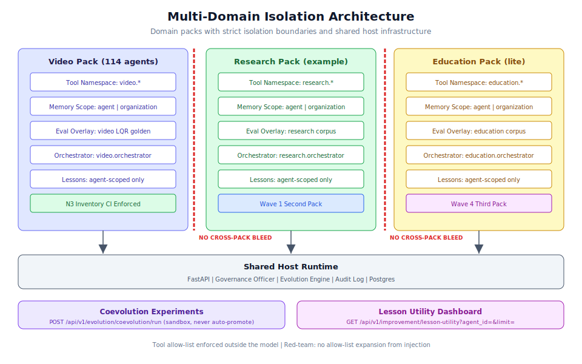

# 第 3.5 章：多領域部署與白標配置

## 學習目標

完成本章後，你將能夠：

1. 在單一主機上同時部署和管理多個 Domain Pack
2. 配置和驗證領域隔離邊界（工具命名空間、記憶體範圍）
3. 跨 Domain Pack 運行共同進化實驗
4. 使用經驗效用儀表板追蹤跨代理學習效能
5. 為不同組織單位實作白標配置
6. 理解和強制執行 video 參考 Pack 的 N3 清單規則
7. 應用 Wave 4 多 Pack 證明模式用於生產部署

## 先決條件

- 已完成第 3.1 至 3.4 章
- 至少兩個已註冊的 Domain Pack（其中一個可以是 `example_research`）
- 理解 Domain Pack 架構和註冊流程
- 熟悉進化沙盒和自我改善迴圈
- Generic Swarm Ops 實例的管理員存取權限

---

## 架構概覽



多領域部署使多個業務領域能夠共享同一 Generic Swarm Ops 主機運行時環境，同時維持嚴格的隔離邊界。每個 Domain Pack 在其自己的命名空間、記憶體範圍和評估覆蓋層中運作，僅透過共享基礎設施層（FastAPI、治理官、進化引擎、Postgres）連接。

### 多 Pack 證明（Wave 4）

Wave 4 驗證系統可以支援多個並行 Domain Pack 並具有完整隔離：

| Pack | 角色 | 規模 |
|------|------|-------|
| `video` | N3 完整名冊，參考實作 | 114 個代理 |
| `example_research` | Wave 1 第二個 Pack，最小化 | 3-5 個代理 |
| `example_education` | Wave 4 第三個精簡 Pack | 3-5 個代理 |

> **備註：** 具有 114 個代理的 video Pack 作為大規模 Domain Pack 的參考實作。它證明架構可以處理複雜的多代理領域而不會出現效能降級或隔離違規。

---

## 逐步指南：多領域部署

### 步驟 1：註冊多個 Domain Pack

獨立註冊每個 Domain Pack。它們共享主機運行時環境但維持獨立的命名空間：

```bash
# Register the research pack
python scripts/business/register_domain.py \
  --manifest business/example_research/manifest.json

# Register the education pack
python scripts/business/register_domain.py \
  --manifest business/example_education/manifest.json

# Verify registration
curl http://127.0.0.1:8000/api/v1/agents?domain=example_research \
  -H "Authorization: Bearer admin-token"

curl http://127.0.0.1:8000/api/v1/agents?domain=example_education \
  -H "Authorization: Bearer admin-token"
```

### 步驟 2：驗證領域隔離

註冊後，驗證隔離邊界是否正確強制執行：

```bash
# Check tool namespace isolation
curl http://127.0.0.1:8000/api/v1/agents/video.editor_agent \
  -H "Authorization: Bearer admin-token" | jq '.tool_permissions.allowed'
# Should only contain "video.*" and "shared.*" tools

curl http://127.0.0.1:8000/api/v1/agents/research.analyst_agent \
  -H "Authorization: Bearer admin-token" | jq '.tool_permissions.allowed'
# Should only contain "research.*" and "shared.*" tools
```

### 步驟 3：驗證記憶體範圍隔離

記憶體範圍防止跨 Pack 資料洩漏：

```bash
# Write memory to video agent scope
curl -X POST http://127.0.0.1:8000/api/v1/memory \
  -H "Authorization: Bearer admin-token" \
  -H "Content-Type: application/json" \
  -d '{
    "agent_id": "video.editor_agent",
    "scope": "agent",
    "content": "Preferred export format: ProRes 4444",
    "category": "preference"
  }'

# Attempt to read from research agent (should return empty)
curl "http://127.0.0.1:8000/api/v1/memory?agent_id=research.analyst_agent&scope=agent" \
  -H "Authorization: Bearer admin-token"
# Response should NOT contain video agent memories
```

> **警告：** 記憶體範圍隔離是關鍵的安全邊界。規則很簡單：無跨 Pack 滲漏。`video` Pack 中的代理無法存取 `research` Pack 中代理寫入的記憶體，反之亦然。這在運行時層面強制執行，而非僅在 API 層面。

### 步驟 4：理解隔離規則

系統強制執行以下隔離規則：

| 邊界 | 規則 | 強制執行 |
|----------|------|-------------|
| **工具命名空間** | `video.*` 代理只能呼叫 `video.*` 工具 | 運行時工具代理 |
| **記憶體範圍** | 代理範圍的記憶體按 Pack 隔離 | `domain_id` 上的查詢篩選器 |
| **編排器** | `business_orchestrator` 與 `video.orchestrator` 不同 | 獨立的代理 ID |
| **評估覆蓋層** | 當 DNA `domain` 相符時載入 `business/<domain>/evals/*` 語料庫 | 評估框架篩選器 |
| **經驗** | 每個領域的代理範圍經驗/片段 | 經驗庫篩選器 |
| **工具允許清單** | 在模型外部強制執行（紅隊驗證） | 注入無法擴展允許清單 |

### 步驟 5：配置每個領域的評估覆蓋層

每個 Domain Pack 有自己的評估語料庫，在領域匹配時自動載入：

```yaml
# Evaluation overlay configuration
# When workflow DNA has domain: "video", only video evals load
# When workflow DNA has domain: "research", only research evals load

# Video pack evaluation (LQR golden tasks)
business/video/evals/
  golden-tasks/
    lqr_quality_task_001.json
    lqr_quality_task_002.json
    ...
  regression/
    codec_compatibility_001.json
  adversarial/
    injection_via_subtitle_001.json

# Research pack evaluation
business/example_research/evals/
  golden-tasks/
    research_quality_001.json
  regression/
    citation_accuracy_001.json
```

---

## 逐步指南：共同進化實驗

### 步驟 6：運行共同進化實驗

共同進化實驗允許領域內的多個代理在沙盒化的多世代學習環境中共同進化：

```bash
curl -X POST http://127.0.0.1:8000/api/v1/evolution/coevolution/run \
  -H "Authorization: Bearer admin-token" \
  -H "Content-Type: application/json" \
  -d '{
    "generations": 5,
    "domain_id": "my_domain",
    "agent_ids": [
      "my_domain.analysis_agent",
      "my_domain.synthesis_agent",
      "my_domain.review_agent"
    ],
    "base_workflow_id": "wf_primary_process_v1",
    "config": {
      "population_size": 3,
      "selection_pressure": "moderate",
      "mutation_rate": 0.2,
      "crossover_enabled": true
    }
  }'
```

**回應：**

```json
{
  "experiment_id": "coevo_001",
  "status": "running",
  "domain_id": "my_domain",
  "generations_total": 5,
  "current_generation": 1,
  "agents_evolving": 3,
  "sandbox_only": true,
  "auto_promote": false
}
```

> **警告：** 共同進化實驗嚴格在沙盒中運作。它們絕不變更生產 DNA 且絕不自動晉升。這與標準進化管線的安全不變量相同。

### 步驟 7：監控共同進化進度

```bash
# Check experiment status
curl http://127.0.0.1:8000/api/v1/evolution/coevolution/coevo_001 \
  -H "Authorization: Bearer admin-token"
```

**回應：**

```json
{
  "experiment_id": "coevo_001",
  "status": "completed",
  "generations_completed": 5,
  "results": {
    "generation_fitness": [0.72, 0.78, 0.81, 0.84, 0.86],
    "best_variant_per_agent": {
      "my_domain.analysis_agent": {"variant_id": "coevo_001_g5_a1", "fitness": 0.89},
      "my_domain.synthesis_agent": {"variant_id": "coevo_001_g5_a2", "fitness": 0.84},
      "my_domain.review_agent": {"variant_id": "coevo_001_g5_a3", "fitness": 0.87}
    },
    "combined_workflow_fitness": 0.86,
    "lessons_generated": 12
  }
}
```

### 步驟 8：晉升共同進化結果

若共同進化產生有前景的變體，透過標準管線晉升：

```bash
# Evaluate best variant against full corpus
curl -X POST http://127.0.0.1:8000/api/v1/evolution/variants/coevo_001_g5_a1/evaluate \
  -H "Authorization: Bearer admin-token"

# If passes, promote via canary (standard pipeline)
curl -X POST http://127.0.0.1:8000/api/v1/evolution/variants/coevo_001_g5_a1/promote \
  -H "Authorization: Bearer admin-token" \
  -H "Content-Type: application/json" \
  -d '{"mode": "canary", "rollback_plan": {"trigger": "fitness below 0.80"}}'
```
---

## 逐步指南：經驗效用儀表板

### 步驟 9：查詢經驗效用

經驗效用儀表板顯示代理重用經驗庫中經驗的有效程度：

```bash
# Get lesson utility for a specific agent
curl "http://127.0.0.1:8000/api/v1/improvement/lesson-utility?agent_id=my_domain.analysis_agent&limit=20" \
  -H "Authorization: Bearer admin-token"
```

**回應：**

```json
{
  "agent_id": "my_domain.analysis_agent",
  "lessons": [
    {
      "lesson_id": "lesson_001",
      "content": "Parallel verification reduces step time by 70%",
      "utility_score": 0.92,
      "times_applied": 15,
      "last_applied": "2024-01-15T10:00:00Z",
      "success_rate_when_applied": 0.93,
      "trend": "stable"
    },
    {
      "lesson_id": "lesson_002",
      "content": "External API timeout at 5KB payload",
      "utility_score": 0.78,
      "times_applied": 8,
      "last_applied": "2024-01-14T16:00:00Z",
      "success_rate_when_applied": 0.88,
      "trend": "improving"
    }
  ],
  "summary": {
    "total_lessons": 15,
    "high_utility_count": 5,
    "low_utility_count": 3,
    "avg_utility_score": 0.72
  }
}
```

### 步驟 10：分析跨代理學習模式

比較領域中各代理的經驗效用：

```bash
# Get metrics for all agents in a domain
for AGENT in analysis_agent synthesis_agent review_agent; do
  echo "=== my_domain.$AGENT ==="
  curl -s "http://127.0.0.1:8000/api/v1/improvement/metrics?agent_id=my_domain.$AGENT" \
    -H "Authorization: Bearer admin-token" | jq '{lesson_reuse_rate, improvement_trend}'
done
```

> **提示：** 前端進化頁面在群體檔案旁邊顯示經驗效用面板。這提供哪些代理正在有效學習以及哪些可能需要額外訓練資料或評估語料庫擴展的視覺概覽。

---

## 逐步指南：N3 清單強制執行

### 步驟 11：理解 N3 規則

N3 規則確保 video 參考 Pack 維持其完整的 114 個代理名冊。這透過 CI 和運行時檢查強制執行：

```bash
# Run inventory check
python scripts/business/inventory_check.py
```

清單檢查在以下情況下失敗：
- 代理目錄不等於 114
- ROSTER、MAP 或 `agent_spec.json` 檔案不完整
- 待命、路由器或流程覆蓋代理缺失
- 必需的 DNA 檔案缺失
- 代理不在 `registered` 或 `active` 狀態

### 步驟 12：透過 API 檢查 N3 狀態

```bash
curl http://127.0.0.1:8000/api/v1/domains/video/n3-status \
  -H "Authorization: Bearer admin-token"
```

**回應：**

```json
{
  "domain_id": "video",
  "n3_complete": true,
  "roster_count": 114,
  "dna_count": 12,
  "orphan_agents": 0,
  "status_breakdown": {
    "active": 108,
    "registered": 6,
    "draft": 0,
    "inactive": 0
  },
  "last_inventory_check": "2024-01-15T06:00:00Z",
  "ci_workflow": ".github/workflows/n3-inventory.yml"
}
```

### 步驟 13：CI 強制執行

N3 清單透過 GitHub Actions 在 CI 中強制執行：

```yaml
# .github/workflows/n3-inventory.yml
name: N3 Inventory Check
on: [push, pull_request]
jobs:
  inventory:
    runs-on: ubuntu-latest
    steps:
      - uses: actions/checkout@v4
      - uses: actions/setup-python@v5
        with:
          python-version: "3.11"
      - run: python scripts/business/inventory_check.py
        # Fails the build if video pack != 114 agents
```

---

## 逐步指南：白標配置

### 步驟 14：配置領域特定品牌

白標允許不同組織單位以其自有品牌呈現 Generic Swarm Ops，同時共享相同基礎設施：

```json
{
  "domain_id": "enterprise_client_a",
  "white_label": {
    "display_name": "Client A Operations Platform",
    "logo_url": "/static/branding/client_a/logo.svg",
    "primary_color": "#1a365d",
    "accent_color": "#2b6cb0",
    "favicon": "/static/branding/client_a/favicon.ico",
    "support_email": "support@client-a.example.com",
    "documentation_url": "https://docs.client-a.example.com",
    "footer_text": "Powered by Generic Swarm Ops"
  }
}
```

### 步驟 15：配置領域特定 UI 元件

Domain Pack 可以在其 `ui/` 目錄中包含自訂 UI 元件：

```text
business/enterprise_client_a/
  ui/
    dashboard/
      DomainDashboard.tsx    # Custom domain landing page
      MetricsPanel.tsx       # Domain-specific KPIs
    workflows/
      CustomWorkflowForm.tsx # Domain-specific workflow creation form
    branding/
      theme.json            # Color scheme and typography overrides
      logo.svg              # Domain logo
```

### 步驟 16：配置每個領域的存取控制

每個白標實例可以有其自己的用戶角色和權限：

```json
{
  "domain_id": "enterprise_client_a",
  "access_control": {
    "roles": [
      {
        "role": "domain_admin",
        "permissions": [
          "workflows:*",
          "runs:*",
          "agents:read",
          "agents:activate",
          "approvals:*",
          "evolution:read",
          "evolution:propose"
        ]
      },
      {
        "role": "domain_operator",
        "permissions": [
          "workflows:read",
          "runs:execute",
          "runs:read",
          "approvals:approve"
        ]
      },
      {
        "role": "domain_viewer",
        "permissions": [
          "workflows:read",
          "runs:read",
          "knowledge:search"
        ]
      }
    ],
    "default_role": "domain_viewer",
    "admin_users": ["admin@client-a.example.com"]
  }
}
```
---

## 逐步指南：安全與紅隊驗證

### 步驟 17：運行紅隊驗證

多領域部署需要額外的安全驗證以確保隔離成立：

```bash
# Run security scan across all domains
npm run business:security

# Check for cross-domain tool access attempts
curl "http://127.0.0.1:8000/api/v1/audit-logs?event_type=tool_denied&since=24h" \
  -H "Authorization: Bearer admin-token"
```

紅隊驗證確認：
- 提示注入無法擴展允許清單
- 工具命名空間邊界在對抗輸入下保持
- 記憶體範圍隔離防止資訊洩漏
- 跨 Pack 代理呼叫被阻止

### 步驟 18：審查安全證據

系統為每個 Wave 維護安全證據：

```bash
# Wave 4 security evidence
cat business/security/red-team-results/wave-4-tool-misuse.json
```

```json
{
  "test_suite": "wave-4-multi-pack-isolation",
  "date": "2024-01-10",
  "results": {
    "tool_namespace_breach_attempts": 15,
    "tool_namespace_breaches": 0,
    "memory_scope_breach_attempts": 12,
    "memory_scope_breaches": 0,
    "injection_via_cross_domain": 8,
    "injection_successes": 0,
    "allow_list_expansion_attempts": 5,
    "allow_list_expansions": 0
  },
  "conclusion": "All isolation boundaries held under adversarial testing",
  "next_review": "2024-04-10"
}
```

---

## 多領域部署清單

在將多個 Domain Pack 部署到生產之前：

```markdown
## Pre-Deployment Checklist

- [ ] All packs registered and schema-validated
- [ ] Tool namespaces unique and non-overlapping
- [ ] Memory scope isolation verified (Wave 1 tests pass)
- [ ] Evaluation overlays configured per domain
- [ ] N3 inventory check passes (if video pack included)
- [ ] Security red-team evidence documented
- [ ] Per-domain access controls configured
- [ ] Audit logging covers all domains
- [ ] Governance review queue accessible to domain admins
- [ ] Coevolution experiments validated in sandbox
- [ ] Rollback plans documented for each domain
- [ ] CI workflows include isolation validation
```

---

## 疑難排解

### 常見多領域問題

| 問題 | 症狀 | 解決方案 |
|-------|----------|------------|
| 跨 Pack 工具存取 | 審計日誌中的 `tool_denied` 事件 | 驗證工具命名空間配置；檢查允許清單中的拼寫錯誤 |
| 領域間記憶體滲漏 | 代理看到另一個 Pack 的記憶體 | 檢查記憶體範圍篩選器；驗證所有記憶體寫入都設定了 `domain_id` |
| 評估覆蓋層載入錯誤語料庫 | 適應度分數不一致 | 驗證工作流程 DNA 中的 `domain` 欄位與 Pack 的 `domain_id` 相符 |
| N3 清單失敗 | CI 建置失敗 | 檢查代理目錄計數；驗證所有 ROSTER 條目都有規格 |
| 共同進化超時 | 實驗卡在第 N 代 | 減少群體大小或世代數；檢查計算資源 |
| 註冊衝突 | `duplicate_domain_id` 錯誤 | 使用唯一的 domain_id 或遞增版本 |

### 除錯隔離違規

```bash
# 1. Check for cross-domain tool access attempts
curl "http://127.0.0.1:8000/api/v1/audit-logs?event_type=tool_denied&since=24h" \
  -H "Authorization: Bearer admin-token" | jq '.events[] | {agent_id, tool_requested, reason}'

# 2. Verify namespace enforcement
curl http://127.0.0.1:8000/api/v1/agents/video.editor_agent \
  -H "Authorization: Bearer admin-token" | jq '.tool_permissions'
# Should only show "video.*" and "shared.*" namespaces

# 3. Check memory scope boundaries
curl "http://127.0.0.1:8000/api/v1/memory?agent_id=video.editor_agent&include_foreign=true" \
  -H "Authorization: Bearer admin-token"
# "include_foreign" should return empty (no cross-domain memories visible)

# 4. Verify domain registration state
curl http://127.0.0.1:8000/api/v1/domains/video/n3-status \
  -H "Authorization: Bearer admin-token" | jq '{n3_complete, roster_count, orphan_agents}'
```

### 多 Pack 部署的效能監控

```bash
# Check per-domain resource utilization
for DOMAIN in video example_research example_education; do
  echo "=== $DOMAIN ==="
  curl -s "http://127.0.0.1:8000/api/v1/agents?domain=$DOMAIN" \
    -H "Authorization: Bearer admin-token" | jq '{
      total_agents: .total,
      active_agents: (.agents | map(select(.status == "active")) | length),
      total_runs_24h: .total_runs_24h
    }'
done

# Monitor database connection usage
curl http://127.0.0.1:8000/api/v1/health/ready \
  -H "Authorization: Bearer admin-token" | jq '.database'
```

---

## 進階：領域生命週期管理

### 向現有部署添加新領域

遵循此順序以安全地向運行中的多領域部署添加 Domain Pack：

```bash
# 1. Validate the new pack in isolation
python scripts/business/register_domain.py \
  --manifest business/new_domain/manifest.json --dry-run

# 2. Run schema validation
npm run business:validate

# 3. Register the pack (creates agents in draft state)
python scripts/business/register_domain.py \
  --manifest business/new_domain/manifest.json

# 4. Verify isolation against all existing packs
python scripts/business/isolation_verify.py \
  --domains video,example_research,new_domain

# 5. Activate agents one by one
for AGENT in $(jq -r '.agents.roster[]' business/new_domain/manifest.json); do
  curl -X PATCH "http://127.0.0.1:8000/api/v1/agents/new_domain.$AGENT" \
    -H "Authorization: Bearer admin-token" \
    -H "Content-Type: application/json" \
    -d '{"status": "active"}'
  echo ""
done

# 6. Run initial evaluation corpus
npm run business:eval

# 7. Monitor for 24 hours before enabling evolution
echo "Monitor for anomalies before proceeding to Wave 2"
```

### 停用 Domain Pack

```bash
# 1. Set all agents to inactive
for AGENT in $(jq -r '.agents.roster[]' business/old_domain/manifest.json); do
  curl -X PATCH "http://127.0.0.1:8000/api/v1/agents/old_domain.$AGENT" \
    -H "Authorization: Bearer admin-token" \
    -H "Content-Type: application/json" \
    -d '{"status": "inactive"}'
done

# 2. Archive lessons and evolution data
curl "http://127.0.0.1:8000/api/v1/improvement/lessons?domain=old_domain" \
  -H "Authorization: Bearer admin-token" > archive/old_domain_lessons.json

curl "http://127.0.0.1:8000/api/v1/evolution/archive?domain=old_domain" \
  -H "Authorization: Bearer admin-token" > archive/old_domain_variants.json

# 3. Verify no active runs reference this domain
curl "http://127.0.0.1:8000/api/v1/runs?domain=old_domain&status=running" \
  -H "Authorization: Bearer admin-token"

# 4. Remove from CI validation (update .github/workflows)
# 5. Archive the domain pack directory
mv business/old_domain/ archive/domains/old_domain_$(date +%Y%m%d)/
```

### Domain Pack 版本升級

```bash
# Upgrade a domain pack from v1.0.0 to v2.0.0
# 1. Update manifest version
jq '.version = "2.0.0"' business/my_domain/manifest.json > tmp.json \
  && mv tmp.json business/my_domain/manifest.json

# 2. Run validation
npm run business:validate

# 3. Re-register (updates version in registry)
python scripts/business/register_domain.py \
  --manifest business/my_domain/manifest.json

# 4. Run full evaluation suite
npm run business:eval

# 5. If new agents added, activate them
curl -X PATCH http://127.0.0.1:8000/api/v1/agents/my_domain.new_agent \
  -H "Authorization: Bearer admin-token" \
  -d '{"status": "active"}'
```
---

## 真實使用案例

### 使用案例 1：企業多部門部署

一家企業為每個業務部門部署獨立的 Domain Pack：

```text
business/
  sales_ops/          # Sales automation (8 agents)
  hr_operations/      # HR workflow automation (12 agents)
  finance_ops/        # Financial processing (6 agents)
  customer_success/   # Customer lifecycle management (10 agents)
```

隔離確保：
- HR 代理無法存取財務資料
- 銷售代理無法查看 HR 記錄
- 客戶成功經驗與內部營運分開
- 每個部門有其自己的評估語料庫和治理政策

配置：

```bash
# Register all divisions
for DOMAIN in sales_ops hr_operations finance_ops customer_success; do
  python scripts/business/register_domain.py \
    --manifest "business/$DOMAIN/manifest.json"
done

# Verify isolation between all pairs
python scripts/business/isolation_verify.py --domains sales_ops,hr_operations,finance_ops,customer_success
```

### 使用案例 2：具有租戶隔離的 SaaS 平台

一個 SaaS 平台使用 Domain Pack 隔離客戶租戶：

```json
{
  "deployment_model": "multi_tenant_saas",
  "tenants": [
    {
      "domain_id": "tenant_acme",
      "display_name": "Acme Corp Instance",
      "white_label": true,
      "max_agents": 20,
      "max_workflows": 10,
      "data_residency": "us-east-1"
    },
    {
      "domain_id": "tenant_globex",
      "display_name": "Globex Corp Instance",
      "white_label": true,
      "max_agents": 50,
      "max_workflows": 25,
      "data_residency": "eu-west-1"
    }
  ],
  "shared_infrastructure": {
    "host_runtime": "single",
    "database": "postgres_with_row_level_security",
    "isolation": "domain_pack_boundaries"
  }
}
```

關鍵架構決策：
- Postgres 中的行級安全在資料庫層面強制執行租戶資料隔離
- Domain Pack 邊界提供應用程式層面的隔離
- 每個租戶的白標品牌用於面向客戶的 UI
- 每個租戶獨立的評估語料庫（無共享黃金任務）
- 透過每個租戶的儲存配置強制執行資料駐留

### 使用案例 3：具有實驗領域的研究實驗室

一個研究實驗室使用多領域部署進行並行實驗：

```bash
# Create experimental domains
for EXP in exp_nlp_v1 exp_vision_v2 exp_multimodal_v1; do
  cp -r business/example_research/ "business/$EXP/"
  # Customize manifest for each experiment
  python scripts/business/register_domain.py \
    --manifest "business/$EXP/manifest.json" --dry-run
done

# Run coevolution across experimental domains
curl -X POST http://127.0.0.1:8000/api/v1/evolution/coevolution/run \
  -H "Authorization: Bearer admin-token" \
  -H "Content-Type: application/json" \
  -d '{
    "generations": 10,
    "domain_id": "exp_nlp_v1",
    "agent_ids": ["exp_nlp_v1.researcher", "exp_nlp_v1.evaluator"],
    "base_workflow_id": "wf_nlp_experiment_v1"
  }'

# Compare lesson utility across experiments
for EXP in exp_nlp_v1 exp_vision_v2 exp_multimodal_v1; do
  echo "=== $EXP ==="
  curl -s "http://127.0.0.1:8000/api/v1/improvement/lesson-utility?domain=$EXP&limit=5" \
    -H "Authorization: Bearer admin-token" | jq '.summary'
done
```

---

## 最佳實踐

### 領域隔離

1. **絕不在領域之間共享工具命名空間。** 即使兩個領域需要類似功能，也在其自己的命名空間下建立獨立的工具適配器。共享工具放在 `shared.*`。

2. **每次部署後驗證隔離。** 將隔離驗證腳本作為 CI 管線的一部分運行，而非僅在設定時運行一次。

3. **監控隔離違規。** 對 `tool_denied` 審計事件設定警報。拒絕次數的激增可能表示配置錯誤或嘗試橫向移動。

4. **對領域學習專用代理範圍的經驗。** 組織範圍的記憶體應僅包含真正通用的知識，而非領域特定的洞察。

### 多 Pack 營運

5. **錯開 Domain Pack 註冊。** 不要同時註冊所有 Pack。註冊一個，驗證隔離，然後添加下一個。這使除錯隔離問題更容易。

6. **在非高峰時段運行共同進化實驗。** 多世代實驗計算密集。在系統有餘裕容量時排程。

7. **保守設定世代限制。** 共同進化從 3-5 代開始。更多世代增加對評估語料庫過擬合的機會。

### 白標

8. **將品牌資源保存在 Domain Pack 中。** 將標誌、主題和自訂元件儲存在 `business/<domain>/ui/` 中，這樣它們隨 Pack 部署。

9. **隔離測試品牌。** 驗證白標主題不會滲漏到其他領域或系統管理員介面。

10. **清晰記錄每個領域的存取控制。** 每個領域應有明確的 RBAC 規格，將角色映射到特定權限。

### 規模規劃

11. **監控每個領域的資源使用。** 追蹤每個領域的代理執行時間、記憶體使用和經驗庫大小以識別資源密集的 Pack。

12. **規劃 N+1 個領域。** 在添加新的 Domain Pack 之前，驗證主機有足夠的資料庫連接、計算容量和記憶體用於額外的代理。

13. **使用 video Pack 作為規模基準。** 若你的部署可以在不降級的情況下在其他領域旁邊運行 video Pack（114 個代理），你就有足夠的餘裕。

---

## 本章摘要

在本章中，你學會了如何：

- 在單一主機上部署具有完整隔離的多個 Domain Pack
- 驗證和強制執行隔離邊界（工具命名空間、記憶體範圍、評估覆蓋層）
- 在領域內跨代理運行共同進化實驗
- 透過經驗效用儀表板監控學習效能
- 透過 CLI、API 和 CI 強制執行 N3 清單規則
- 為不同組織單位配置白標品牌
- 設定每個領域的存取控制和 RBAC
- 透過紅隊測試驗證安全
- 應用多領域環境的生產部署清單

多領域部署是 Domain Pack 架構的集大成。它證明 Generic Swarm Ops 可以作為通用業務作業系統，支援多元領域並具有完整隔離，同時共享相同的治理、進化和安全基礎設施。

---

## 知識檢查

1. **Domain Pack 之間強制執行的五個隔離邊界是甚麼？每個在運行時如何強制執行？**

2. **解釋 N3 規則。`python scripts/business/inventory_check.py` 具體驗證甚麼？**

3. **撰寫啟動共同進化實驗的 API 呼叫。哪些欄位是必填的？系統提供甚麼安全保證？**

4. **評估覆蓋層系統如何運作？若工作流程有 `domain: "video"`，載入哪些語料庫檔案？**

5. **描述經驗效用儀表板回應。它為每個經驗提供哪些指標？**

6. **甚麼是 Wave 4 多 Pack 證明？列出涉及的三個 Pack 及其各自角色。**

7. **你如何為新的組織單位配置白標品牌？需要哪些檔案和配置？**

8. **紅隊安全證據驗證甚麼？檢查哪些零容忍指標？**

9. **在 SaaS 多租戶部署中，Domain Pack 邊界如何與資料庫層面的行級安全結合以實現縱深防禦？**

10. **為甚麼共同進化世代限制應保守設定（3-5）？更高的世代計數增加甚麼風險？**
