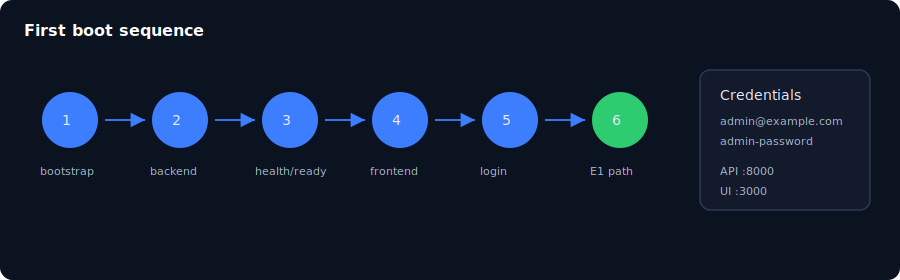

# 第 03 章：安裝與首次開機

> **語言：** 繁體中文（`_hk`）  
> **狀態：** 骨架於 `book/user_guide/` — 請在此擴寫完整內文  
> **程度：** 初學者  
> **部：** 第 I 部 — 基礎  
> **預估時間：** 45–90 分鐘  
> **路徑：** `book/user_guide/chapters/03-install-and-first-boot_hk.md`  
> **英文對照：** [`03-install-and-first-boot.md`](./03-install-and-first-boot.md)

## 插圖

*圖：安裝與首次開機 — 來源 `assets/03-install-boot.svg`*

## 學習目標

- 完成 bootstrap 並通過 doctor
- 啟動後端並打通 health/ready
- 以前端即時 API 啟動（demoMode 關閉）

## 敘事大綱（擴寫為完整正文）

1. 先決條件（OS、Node、Python、pnpm、可選 Docker Postgres）
2. npm run bootstrap / doctor / sync
3. 後端：pip install -e .、uvicorn、.env 與 DATABASE_URL
4. JSON 檔模式 vs Postgres（學習時 degraded 何時可接受）
5. 前端：真實產品路徑時 NEXT_PUBLIC_DEMO_MODE 不可為 true
6. 種子帳號 admin@example.com / admin-password
7. 首次開機疑難（埠口、CORS、PYTHONPATH）

## 實作實驗

- [ ] 實驗 A：後端 health/live/ready
- [ ] 實驗 B：前端登入並進入 Dashboard
- [ ] 實驗 C：故意開 demoMode 看 mock，再改回 false

## 主要來源（未驗證前勿臆造）

- `docs/installation.md`
- `docs/usage.md`
- `backend/docs/postgres-runbook.md`
- `frontend/README.md`
- `frontend/.env.example`

## 撰寫檢查清單（完整稿）

- [ ] 開場一段說明「為何重要」
- [ ] 步驟指令以 Windows PowerShell 為主，必要時附 bash
- [ ] 每個主要實驗含「預期結果」
- [ ] 相關處標明殘留／未宣稱
- [ ] 交叉連結上一章／下一章（`*_hk.md`）
- [ ] SVG 使用 `../assets/`（與英文版共用圖檔）
- [ ] 術語與英文版一致；產品識別碼（dna_id、API 路徑）不翻譯

## 導覽

- 目錄：[../TOC_hk.md](../TOC_hk.md)
- 主檔：[../user_guide_hk.md](../user_guide_hk.md)
- 英文主檔：[../user_guide.md](../user_guide.md)
- 計畫：[../../../planning/user_guide/00_PLAN.md](../../../planning/user_guide/00_PLAN.md)
