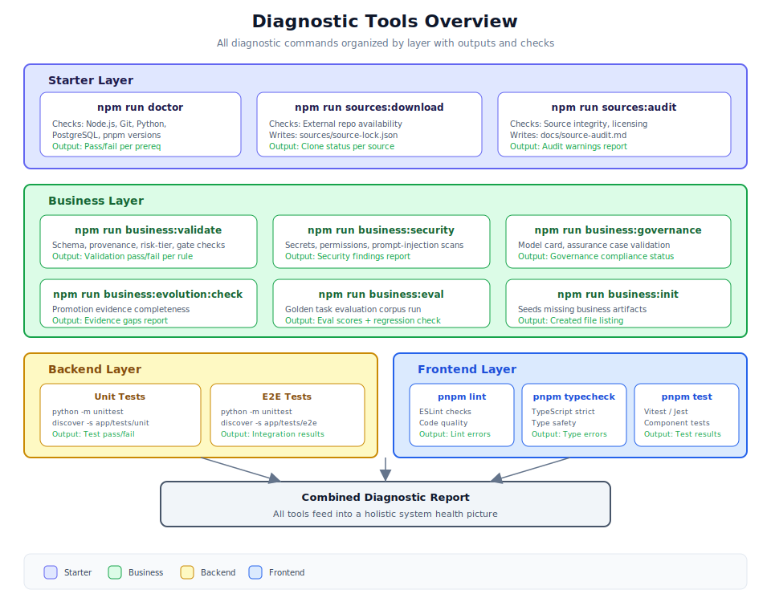

# 第 4.2 章：診斷工具操作指南



## 學習目標

完成本章後，你將能夠：

1. 執行所有診斷命令並理解其用途
2. 正確解讀每個診斷工具的輸出
3. 結合多個診斷結果進行全面的系統評估
4. 建立日常維護的診斷工作流程
5. 將診斷檢查自動化為 CI/CD 管道的一部分

## 先決條件

在開始本章之前，請確保你已：

- 完成安裝（Node.js 20+、Python 3.11+、PostgreSQL 14+、Git、pnpm）
- 至少成功執行過一次 `npm run bootstrap`
- 後端和前端服務可用（用於執行時診斷）
- 熟悉第 4.1 章中的錯誤類別

---

## 1. 診斷工具架構

Generic Swarm Ops 提供按系統層級組織的診斷工具。每個工具檢查系統健康的特定方面並產生可操作的輸出。

| 層級 | 命令 | 用途 |
|------|------|------|
| 啟動器 | `npm run doctor` | 驗證先決條件 |
| 啟動器 | `npm run sources:download` | 取得外部來源 |
| 啟動器 | `npm run sources:audit` | 審計來源完整性 |
| 業務 | `npm run business:init` | 種植所需檔案 |
| 業務 | `npm run business:validate` | Schema/來源追溯/風險/閘門檢查 |
| 業務 | `npm run business:governance` | 治理合規性 |
| 業務 | `npm run business:security` | 安全態勢掃描 |
| 業務 | `npm run business:evolution:check` | 推廣證據 |
| 業務 | `npm run business:eval` | 黃金任務評估 |
| 後端 | 單元測試 | Python 測試套件 |
| 後端 | E2E 測試 | 整合驗證 |
| 前端 | `pnpm lint` | ESLint 程式碼品質 |
| 前端 | `pnpm typecheck` | TypeScript 類型安全 |
| 前端 | `pnpm test` | 元件/單元測試 |

> **提示：** 進行完整系統診斷時，從上到下按順序執行這些工具。較低層級的問題通常源自未解決的較高層級問題。

---

## 2. 啟動器層級診斷

### 2.1 npm run doctor

**用途：** 驗證所有系統先決條件已安裝且版本正確。

**檢查項目：** Node.js 版本（需要 20+）、Git、Python 版本（需要 3.11+）、PostgreSQL（需要 14+）、pnpm。

**執行方式：**

```bash
npm run doctor
```

**解讀輸出：** 成功時顯示所有項目 `[PASS]`，失敗時標識特定問題並指向 `docs/installation.md`。

**失敗時的操作：** 安裝或升級失敗的先決條件，然後重新執行確認。

### 2.2 npm run sources:download

**用途：** 將核准的外部來源儲存庫下載到 `external/sources/`。

**執行方式：**

```bash
npm run sources:download
```

**執行後驗證：**

```bash
cat sources/source-lock.json
```

### 2.3 npm run sources:audit

**用途：** 審計下載的外部來源的授權、完整性和政策合規性。

**執行方式：**

```bash
npm run sources:audit
```

完整報告寫入 `docs/source-audit.md`。

---

## 3. 業務層級診斷

### 3.1 npm run business:validate

**用途：** 驗證所有業務作業系統構件是否符合預期的 schema 和規則。

**檢查項目：**
- **Schema 合規性：** 業務構件匹配其 JSON/YAML schema
- **來源追溯：** 每個構件具有適當的來源歸屬和元資料
- **風險等級對齊：** 宣告的風險級別匹配構件範圍和影響
- **工作流程閘門完整性：** 所有先決條件閘門已正確設定

**執行方式：**

```bash
npm run business:validate
```

> **提示：** 在每次提交涉及業務構件的變更之前執行此命令。它能在變更到達共享分支之前捕獲設定偏差。

### 3.2 npm run business:security

**用途：** 掃描業務構件和設定中的安全問題。

**檢查項目：** 密鑰檢測、權限審計、提示注入覆蓋率。

```bash
npm run business:security
```

### 3.3 npm run business:governance

**用途：** 驗證治理構件，包括模型卡和保證案例。

```bash
npm run business:governance
```

### 3.4 npm run business:evolution:check

**用途：** 驗證沙盒變體推廣證據是否完整。

```bash
npm run business:evolution:check
```

### 3.5 npm run business:eval

**用途：** 對系統或特定變體執行黃金任務評估語料庫。

```bash
# 完整評估
npm run business:eval

# 試執行
npm run business:eval -- --dry-run

# 評估特定變體
npm run business:eval -- --variant <variant_name>
```

---

## 4. 後端診斷

### 4.1 後端單元測試

**用途：** 執行後端服務的 Python 單元測試套件。

```bash
cd backend
export PYTHONPATH=.
python -m unittest discover -s app/tests/unit -p "test_*.py" -v
```

### 4.2 後端 E2E 測試

**用途：** 執行端到端整合測試。

```bash
cd backend
export PYTHONPATH=.
python -m unittest discover -s app/tests/e2e -p "test_*.py" -v
```

**先決條件：** PostgreSQL 必須在執行且可存取。

---

## 5. 前端診斷

### 5.1 pnpm lint

**用途：** 執行 ESLint 檢查程式碼品質和風格合規性。

```bash
cd frontend
pnpm lint
```

### 5.2 pnpm typecheck

**用途：** 以檢查模式執行 TypeScript 編譯器以驗證類型安全。

```bash
cd frontend
pnpm typecheck
```

### 5.3 pnpm test

**用途：** 執行元件和單元測試套件。

```bash
cd frontend
pnpm test
```

---

## 6. 組合診斷工作流程

### 6.1 完整系統診斷

進行全面系統檢查時，按順序執行所有診斷。

### 6.2 每日快速健康檢查

```bash
npm run doctor
npm run business:validate
curl -s http://127.0.0.1:8000/api/v1/health/ready | python -m json.tool
cd frontend && pnpm typecheck
```

### 6.3 預提交診斷

```bash
npm run business:validate
npm run business:security
```

---

## 7. 實際使用案例範例

### 使用案例 1：CI/CD 管道整合

將診斷檢查添加到 CI 管道，確保每次提交都通過所有驗證。

### 使用案例 2：部署後驗證

部署新版本後，驗證健康端點、認證和核心 API 回應。

### 使用案例 3：調查間歇性失敗

使用審計日誌查詢工具執行模式，識別相關性和超時模式。

---

## 8. 最佳實踐

### 診斷排程

| 頻率 | 檢查 |
|------|------|
| 每次提交 | `business:validate`、`business:security`、相關測試套件 |
| 每日 | `npm run doctor`、健康端點、快速後端測試 |
| 每週 | 完整診斷套件，包括 `business:eval` |
| 部署後 | 健康端點、認證、核心 API 冒煙測試 |
| 系統更新後 | 完整 `npm run doctor` + 所有測試套件 |

### 解讀結果

1. **從上到下閱讀錯誤。** 較早的錯誤通常導致後續錯誤。
2. **檢查退出碼。** `0` 表示成功，非零表示失敗。
3. **尋找模式。** 同一類別中的多個失敗暗示共同的根本原因。
4. **與基線比較。** 如果有之前成功執行的記錄，比對輸出差異。
5. **不要忽略警告。** 今天的警告會成為明天的錯誤。

---

## 9. 章節摘要

本章提供了 Generic Swarm Ops 中所有可用診斷工具的全面操作指南：

- **啟動器層級：** `npm run doctor`（先決條件）、`sources:download`（外部儲存庫）、`sources:audit`（完整性）
- **業務層級：** `business:validate`（schema）、`business:security`（掃描）、`business:governance`（合規性）、`business:evolution:check`（推廣）、`business:eval`（黃金任務）
- **後端：** 通過 Python unittest 的單元測試和 E2E 測試
- **前端：** `pnpm lint`（品質）、`pnpm typecheck`（類型）、`pnpm test`（元件）

關鍵要點是這些工具設計為在系統化工作流程中一起使用，從基本先決條件到全面系統驗證。

---

## 10. 知識檢測測驗

**問題 1：** 排除昨天還能正常工作但今天失敗的系統問題時，正確的診斷順序是什麼？

<details>
<summary>答案</summary>

1. `npm run doctor`（檢查先決條件是否改變）
2. `npm run business:validate`（檢查業務構件完整性）
3. 健康端點檢查（驗證後端連線）
4. 顯示錯誤的特定層級的測試套件

從最低層級（先決條件）開始向上排查以隔離斷裂點。

</details>

**問題 2：** `npm run business:validate` 檢查哪四項？

<details>
<summary>答案</summary>

1. Schema 合規性
2. 來源追溯
3. 風險等級對齊
4. 工作流程閘門完整性

</details>

**問題 3：** `npm run business:security` 掃描哪三個類別？

<details>
<summary>答案</summary>

1. 密鑰（硬編碼的 API 金鑰、密碼、權杖）
2. 不安全的權限
3. 提示注入覆蓋率不足

</details>
