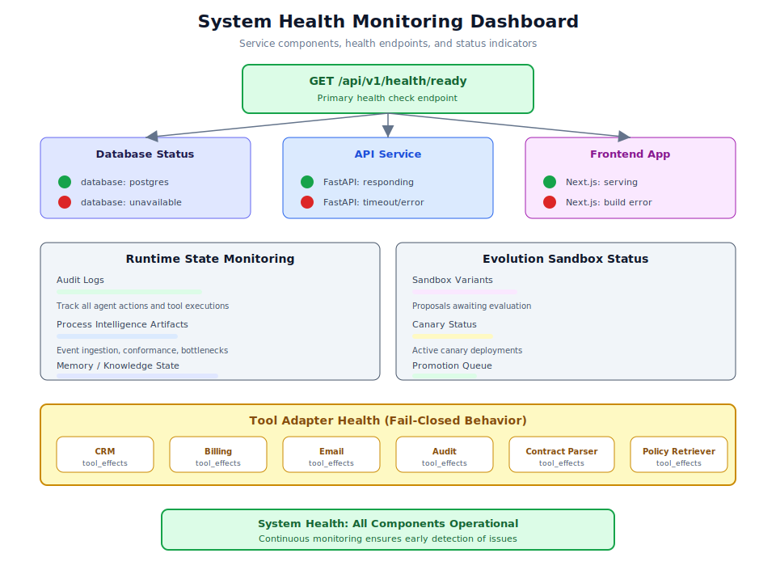

# 第 4.3 章：系統健康監控



## 學習目標

完成本章後，你將能夠：

1. 設定和查詢健康端點以獲取即時系統狀態
2. 監控資料庫連線和執行時狀態
3. 檢查審計日誌以獲取操作情報
4. 追蹤流程智能構件完整性
5. 監控演化沙盒狀態和工具適配器健康
6. 為生產部署設計監控儀表板

## 先決條件

在開始本章之前，請確保你已：

- 後端服務正在執行且已連接 PostgreSQL
- 成功認證（具備管理員憑證）
- 熟悉第 2 章的 API 端點
- 理解第 1.1 章的六層架構

---

## 1. 健康端點基礎

主要健康檢查端點是所有系統監控的基礎：

```
GET /api/v1/health/ready
```

### 1.1 查詢健康端點

```bash
curl -s http://127.0.0.1:8000/api/v1/health/ready
```

**回應：**

```json
{
  "status": "healthy",
  "database": "postgres",
  "timestamp": "2024-01-15T10:30:00Z"
}
```

**關鍵欄位：**
| 欄位 | 健康值 | 不健康值 |
|------|--------|---------|
| `status` | `"healthy"` | `"degraded"` 或 `"unavailable"` |
| `database` | `"postgres"` | `"unavailable"` 或缺失 |
| `timestamp` | 當前時間 | 過時或缺失 |

> **提示：** 如果 `database` 欄位未顯示 `"postgres"`，系統無法可靠地持久化資料。在進行其他監控工作之前先解決此問題。

### 1.2 自動健康輪詢

為持續監控設定週期性健康檢查，使用腳本定期查詢端點並記錄結果。

### 1.3 健康檢查回應碼

| HTTP 狀態 | 含義 | 所需操作 |
|-----------|------|---------|
| 200 | 系統健康 | 無 |
| 503 | 服務不可用 | 檢查 Postgres，重新啟動後端 |
| 連線被拒絕 | 後端未在執行 | 啟動伺服器 |
| 超時 | 後端過載 | 檢查資源使用情況 |

---

## 2. 資料庫連線監控

### 2.1 PostgreSQL 連線驗證

```bash
pg_isready -h localhost -p 5432
```

### 2.2 執行時狀態檢查

```bash
psql "$DATABASE_URL" -c "
  SELECT
    count(*) as total_entries,
    max(updated_at) as last_update
  FROM runtime_state;
"
```

**預期行為：** `total_entries` 隨工作流程執行增長，`last_update` 應該是最近的。

> **警告：** 如果 `last_update` 過時但後端正在執行，這可能表示後端失去了資料庫連線。重新啟動後端服務。

### 2.3 連線池監控

監控連線池健康以識別資源耗盡問題。

---

## 3. 審計日誌監控

### 3.1 查詢審計日誌

```bash
curl -s -b cookies.txt \
  "http://127.0.0.1:8000/api/v1/audit?limit=20" \
  | python -m json.tool
```

### 3.2 關鍵審計事件類型

| 事件類型 | 描述 | 監控項目 |
|---------|------|---------|
| `tool.executed` | 工具適配器執行 | 失敗的執行、意外的工具 |
| `workflow.transition` | 工作流程狀態變更 | 卡住的狀態、意外的轉換 |
| `auth.login` | 使用者認證 | 失敗的嘗試、異常模式 |
| `memory.write` | 記憶體範圍寫入 | 範圍違規、過度寫入 |
| `improvement.reflect` | 自我改進反思 | 反思品質、教訓產生 |
| `evolution.propose` | 提出變體 | 提案頻率、品質 |

### 3.3 異常監控

設定審計日誌的異常檢測，監控失敗的工具執行和認證失敗。

---

## 4. 流程智能構件監控

### 4.1 事件擷取狀態

流程智能依賴持續的事件擷取。監控管道以確保事件日誌正在被寫入。

### 4.2 流程挖掘健康

| 構件 | 預期新鮮度 | 如果...則警報 |
|------|-----------|-------------|
| 事件日誌 | 每次工作流程執行更新 | 活躍使用期間 24 小時無更新 |
| 發現的流程 | 每個分析週期更新 | 缺失或為空 |
| 合規性結果 | 發現後更新 | 過時 |
| 瓶頸分析 | 最少每週更新 | 缺失或為空 |

### 4.3 知識庫完整性

驗證知識庫支援檢索和聯邦操作。

---

## 5. 演化沙盒監控

### 5.1 沙盒狀態概覽

```bash
ls business/distilled/skills/_sandbox/
curl -s -b cookies.txt \
  "http://127.0.0.1:8000/api/v1/evolution/archive" \
  | python -m json.tool
```

### 5.2 演化管道健康

監控自我改進管道階段：反思、提案、評估、金絲雀、推廣/回滾。

### 5.3 教訓庫增長

追蹤教訓庫的增長和品質。

---

## 6. 工具適配器健康

### 6.1 失敗關閉行為監控

工具適配器（crm、billing、email、audit、contract_parser、policy_retriever）使用失敗關閉行為。監控被拒絕的執行。

### 6.2 tool_effects 檢查

每次工具執行都記錄其效果。檢查其正確性。

### 6.3 適配器特定檢查

| 適配器 | 健康指標 | 檢查 |
|--------|---------|------|
| CRM | 記錄建立成功 | 驗證 CRM 條目正在被建立 |
| Billing | 付款處理 | 檢查計費步驟批准完成 |
| Email | 傳送狀態 | 確認電郵傳送已記錄 |
| Audit | 日誌寫入 | 驗證審計條目正在持久化 |
| Contract Parser | 解析成功率 | 檢查解析失敗 |
| Policy Retriever | 檢索準確性 | 驗證返回正確的政策 |

---

## 7. 生產監控設定

### 7.1 監控架構

```
第 1 層：基礎設施（Postgres、容器、網路）
第 2 層：應用程式（健康端點、API 延遲）
第 3 層：業務（工作流程成功、工具執行、演化）
第 4 層：智能（審計模式、異常檢測）
```

### 7.2 關鍵追蹤指標

| 指標 | 來源 | 警報閾值 |
|------|------|---------|
| 健康端點回應時間 | HTTP 探測 | > 2 秒 |
| 資料庫連線數 | pg_stat_activity | > 最大值的 80% |
| 失敗的工具執行 | 審計日誌 | > 5% 失敗率 |
| 工作流程完成率 | 執行時狀態 | < 95% 完成 |
| 認證失敗率 | 審計日誌 | > 10 次失敗/小時 |
| 演化沙盒大小 | 檔案系統 | > 20 個待處理變體 |
| 教訓產生率 | 改進 API | 7 天無新教訓 |
| API 錯誤率 | 後端日誌 | > 1% 的請求 |

---

## 8. 實際使用案例範例

### 使用案例 1：檢測靜默失敗

**場景：** 工作流程似乎完成但客戶報告缺少電郵。

**調查：** 檢查電郵工具適配器成功率，發現 `tool_effects` 顯示 `delivery_status: "queued"` 而非 `"sent"`。外部電郵服務佇列積壓。

### 使用案例 2：性能退化檢測

**場景：** 使用者報告操作控制台緩慢。

**調查：** 檢查健康端點延遲和資料庫連線數，發現長時間執行的查詢阻塞其他連線。

### 使用案例 3：演化管道停滯

**場景：** 30 天內沒有新變體被推廣。

**調查：** 反思正在產生但未呼叫 `auto-propose`，提案存在但無人啟動評估。

---

## 9. 最佳實踐

### 監控原則

1. **從外到內監控。** 從健康端點開始，然後深入元件。
2. **設定有意義的閾值。** 基於實際使用模式設定警報。
3. **跨層級關聯。** 工具失敗通常與資料庫問題或網路問題相關。
4. **保留歷史資料。** 至少保留 30 天的監控資料用於趨勢分析。
5. **測試你的監控。** 定期模擬失敗以驗證警報正確觸發。

---

## 10. 章節摘要

本章涵蓋了 Generic Swarm Ops 的全面系統健康監控：

- **健康端點：** 主要的 `GET /api/v1/health/ready` 端點及其解讀
- **資料庫監控：** PostgreSQL 連線、執行時狀態和連線池健康
- **審計日誌：** 操作事件的查詢、過濾和異常檢測
- **流程智能：** 構件新鮮度和管道完整性
- **演化沙盒：** 變體狀態、管道健康和教訓庫增長
- **工具適配器：** 失敗關閉行為監控和 tool_effects 檢查
- **生產設定：** 指標、警報、儀表板和監控架構

關鍵原則是分層監控：先驗證基礎設施，然後應用程式健康，再業務指標，最後是智能級別模式。

---

## 11. 知識檢測測驗

**問題 1：** 健康端點的什麼回應確認資料庫已正確連接？

<details>
<summary>答案</summary>

回應必須包含 `"database": "postgres"`。這確認後端與 PostgreSQL 主要儲存有活躍連線。

</details>

**問題 2：** 如何通過審計 API 檢查失敗的工具適配器執行？

<details>
<summary>答案</summary>

查詢 `GET /api/v1/audit?event_type=tool.executed` 並過濾 `status` 為 `"failed"` 的條目。

</details>

**問題 3：** Postgres 主要儲存和 JSON 備份有什麼區別？

<details>
<summary>答案</summary>

PostgreSQL 使用 JSONB 欄位是主要執行時儲存。JSON 檔案僅作備份。正常操作期間永遠不要依賴 JSON 檔案作為真實來源。

</details>
