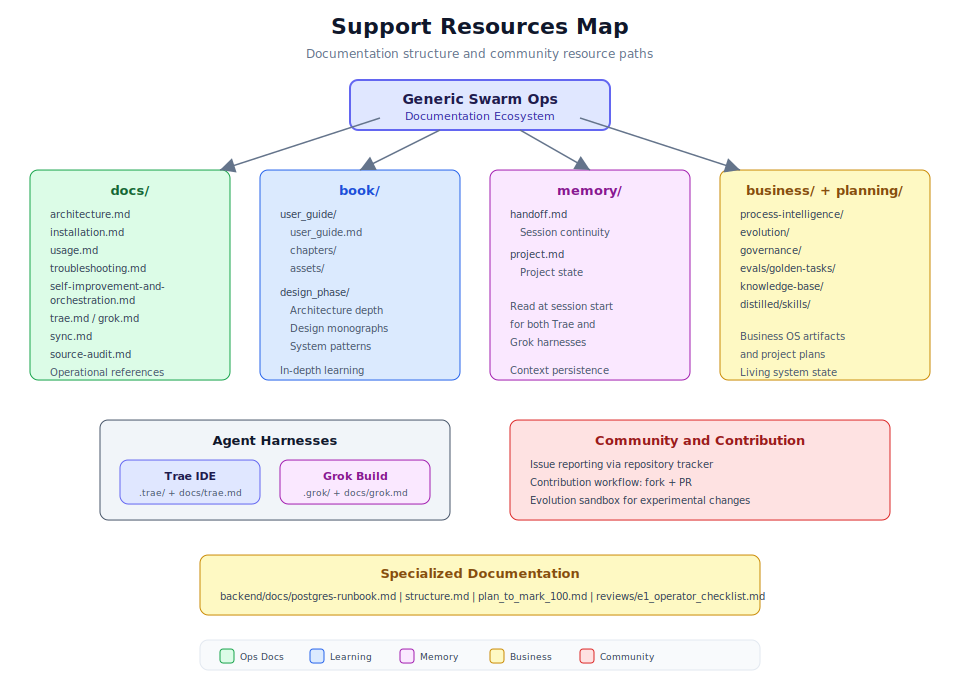

# 第 4.4 章：支援與社群資源



## 學習目標

完成本章後，你將能夠：

1. 高效地導航完整的文件生態系統
2. 使用會話連續性檔案（memory/handoff）維持代理上下文
3. 存取設計階段資源以深入理解架構
4. 遵循貢獻工作流程進行錯誤修正和功能開發
5. 有效地報告問題並提供適當的上下文
6. 利用兩種代理套件（Trae IDE 和 Grok Build）獲取開發支援

## 先決條件

在開始本章之前，請確保你已：

- 在本機複製了 Generic Swarm Ops 儲存庫
- 熟悉基本的 Git 操作
- 理解第 1.1 章的系統架構
- 存取項目的問題追蹤器

---

## 1. 文件生態系統概覽

### 1.1 文件地圖

| 目錄 | 用途 | 使用時機 |
|------|------|---------|
| `docs/` | 操作參考 | 日常開發和故障排除 |
| `book/` | 深度學習 | 理解概念和架構 |
| `memory/` | 會話連續性 | 開始新的開發會話 |
| `business/` | 活動系統構件 | 業務作業系統設定和狀態 |
| `planning/` | 項目計劃 | 理解路線圖和優先事項 |
| `backend/docs/` | 後端特定指南 | 資料庫操作和後端設定 |
| `reviews/` | 評估清單 | 驗證產品完整性 |

---

## 2. 操作參考文件（docs/）

### 2.1 核心參考檔案

- **docs/architecture.md** - 完整分層架構描述
- **docs/installation.md** - 先決條件和完整設定程序
- **docs/usage.md** - 所有可用命令和參考
- **docs/troubleshooting.md** - 錯誤類別和解決步驟
- **docs/self-improvement-and-orchestration.md** - 自我演化管道詳情

### 2.2 套件特定文件

- **docs/trae.md** - Trae IDE 設定和使用
- **docs/grok.md** - Grok Build 設定和使用
- **docs/sync.md** - 套件同步過程

---

## 3. 深度學習資源（book/）

### 3.1 使用者指南（book/user_guide/）

本綜合使用者指南分為五個漸進式章節，從安裝到進階最佳化。

### 3.2 設計階段資源（book/design_phase/）

設計階段目錄包含深度架構分析，幫助理解系統設計的原因。

> **提示：** 設計階段文件比操作文件更偏理論。當你想理解系統背後的「為什麼」而非日常操作的「如何」時閱讀它們。

---

## 4. 會話連續性（memory/）

### 4.1 交接協議

`memory/` 目錄支援人類開發者和 AI 代理的會話連續性：

- **memory/handoff.md** - 當前會話狀態和上下文
- **memory/project.md** - 整體項目狀態

### 4.2 使用交接檔案

**會話開始時：**

```bash
cat memory/handoff.md
cat memory/project.md
```

**會話結束時：** 更新 `memory/handoff.md` 記錄完成的工作、進行中的項目和下一會話需要的上下文。

> **注意：** Trae IDE 和 Grok Build 代理套件都會在會話開始時讀取 `memory/handoff.md` 和 `memory/project.md`。保持這些檔案最新確保 AI 代理無論使用哪個套件都具有完整的上下文。

---

## 5. 項目規劃構件

- **plan_to_mark_100.md** - 產品完成度計劃
- **structure.md** - 架構真實來源
- **structure_scorecard_100.md** - 產品完成度評分標準

---

## 6. 代理套件支援

### 6.1 Trae IDE 套件

生成的設定在 `.trae/` 下，包括設定、代理、命令和規則。

### 6.2 Grok Build 套件

生成的設定在 `.grok/` 下，包括規則、代理、技能和命令。

### 6.3 套件同步

```bash
npm run sync
npm run sync:check
```

**共享來源：** `rules/`、`skills/`、`hooks/`、`mcp-configs/`、`scripts/adapters/shared.mjs`

> **警告：** 永遠不要手動編輯 `.trae/` 或 `.grok/` 中的檔案。這些由 `npm run sync` 從共享來源生成。

---

## 7. 貢獻工作流程

### 7.1 貢獻前

1. 閱讀 `memory/handoff.md` 了解當前項目狀態
2. 檢查開放的問題
3. 查看 `plan_to_mark_100.md` 了解項目優先事項

### 7.2 貢獻過程

1. 建立功能分支
2. 進行變更並驗證
3. 執行相關測試
4. 同步套件（如果更改了共享來源）
5. 更新交接檔案
6. 提交並推送

### 7.3 貢獻指南

| 指南 | 詳情 |
|------|------|
| 分支命名 | `feature/`、`fix/`、`docs/`、`refactor/` 前綴 |
| 提交訊息 | 慣例式提交（feat:、fix:、docs: 等） |
| 測試 | 合併前所有測試必須通過 |
| 驗證 | `business:validate` 和 `business:security` 乾淨 |

---

## 8. 問題報告

### 8.1 有效的問題報告

報告問題時，包含環境資訊、重現步驟、預期行為、實際行為、錯誤輸出和診斷結果。

### 8.2 報告前的資訊收集

```bash
npm run doctor
npm run business:validate 2>&1 | tail -20
curl -s http://127.0.0.1:8000/api/v1/health/ready
git log --oneline -3
git status --short
```

---

## 9. 社群參與

### 9.1 討論主題

架構決策、演化策略、治理自訂、整合模式、性能最佳化、代理設計。

### 9.2 知識分享

記錄解決方案、分享黃金任務、提出改進建議、更新交接檔案。

---

## 10. 快速參考指南

### 基本命令速查表

```bash
npm run bootstrap           # 完整系統設定
npm run doctor              # 檢查先決條件
npm run sync                # 重新產生套件檔案
npm run business:init       # 種植業務檔案
npm run business:validate   # 驗證構件
npm run business:governance # 檢查治理
npm run business:security   # 安全掃描
npm run business:evolution:check  # 演化狀態
npm run business:eval       # 執行評估
```

### API 端點參考

| 端點 | 用途 |
|------|------|
| `GET /api/v1/health/ready` | 健康檢查 |
| `POST /api/v1/auth/login` | 密碼認證 |
| `GET /api/v1/workflows` | 列出工作流程 |
| `POST /api/v1/workflows/{id}/run` | 執行工作流程 |
| `GET /api/v1/audit` | 查詢審計日誌 |
| `POST /api/v1/improvement/reflect/{run_id}` | 反思執行 |
| `GET /api/v1/improvement/lessons` | 查看教訓 |
| `GET /api/v1/evolution/archive` | 演化狀態 |

---

## 11. 章節摘要

本章涵蓋了完整的支援和社群資源生態系統：

- **文件結構：** `docs/`、`book/`、`memory/`、`business/` 和 `planning/` 目錄及其用途
- **會話連續性：** 使用 `memory/handoff.md` 和 `memory/project.md` 維持跨會話的上下文
- **代理套件：** Trae IDE 和 Grok Build 設定、同步和共享真實來源
- **貢獻工作流程：** 從分支建立到驗證到拉取請求
- **問題報告：** 有效的範本、診斷收集和分類
- **社群參與：** 知識分享、討論主題和保持最新

關鍵原則是自給自足：文件生態系統設計為無需外部幫助即可回答大多數問題，當每個人都將解決方案貢獻回來時，社群就會蓬勃發展。

---

## 12. 知識檢測測驗

**問題 1：** 在新開發會話開始時應該閱讀哪兩個檔案？

<details>
<summary>答案</summary>

1. `memory/handoff.md`（當前會話狀態和上下文）
2. `memory/project.md`（整體項目狀態）

</details>

**問題 2：** 更改 `rules/` 目錄中的檔案後必須執行什麼命令？

<details>
<summary>答案</summary>

執行 `npm run sync` 從共享真實來源重新產生 `.trae/` 和 `.grok/` 目錄。然後執行 `npm run sync:check` 驗證。

</details>

**問題 3：** Trae 和 Grok 套件設定的共享真實來源是什麼？

<details>
<summary>答案</summary>

`rules/`（行為規則）、`skills/`（代理技能）、`hooks/`（事件鉤子）、`mcp-configs/`（MCP 伺服器設定）和 `scripts/adapters/shared.mjs`。

</details>
