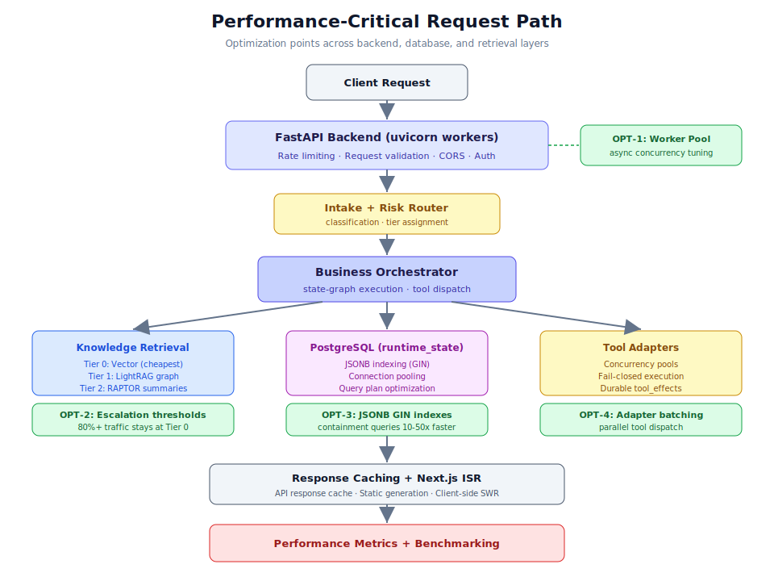

# 第 5.1 章：性能調校策略



## 學習目標

完成本章後，你將能夠：

1. 識別 Generic Swarm 架構中的性能關鍵路徑
2. 使用 GIN 索引和連線池最佳化 PostgreSQL 的 JSONB 工作負載
3. 使用 uvicorn workers 為生產並行調校 FastAPI 後端
4. 設定知識檢索層級升級閾值以實現成本效益
5. 使用 Next.js ISR 和 API 回應快取實施前端快取策略
6. 對流程智能工作負載應用批次處理技術
7. 建立基準測試程序以衡量和追蹤性能改進

## 先決條件

在開始本章之前，請確保你已：

- 完成第 1 節（核心系統基礎）以理解架構
- 具有已連接 PostgreSQL 的執行中 Generic Swarm Ops 實例
- 存取 `backend/.env` 以進行設定變更
- 熟悉 SQL 查詢計劃和 EXPLAIN ANALYZE
- 基本理解非同步 Python（asyncio、uvicorn）

---

## 1. 理解性能關鍵路徑

每個請求在 Generic Swarm Ops 中流經一個確定性路徑，每個階段都有可測量的延遲。

### 1.1 請求生命週期

```text
Client Request
  -> Load Balancer / Reverse Proxy
  -> FastAPI (uvicorn worker)
    -> Authentication + Rate Limiting
    -> Intake + Risk Router
    -> Business Orchestrator
      -> Knowledge Retrieval (Tier 0/1/2)
      -> Tool Adapter Execution
      -> PostgreSQL (runtime_state read/write)
    -> Response Assembly
  -> Client Response
```

### 1.2 延遲預算

| 階段 | 目標延遲 | 常見瓶頸 |
|------|---------|---------|
| 認證 | < 5ms | 過期的權杖快取 |
| 風險路由 | < 10ms | 複雜的分類邏輯 |
| 知識檢索 Tier 0 | < 50ms | 未索引的向量搜尋 |
| 知識檢索 Tier 1 | < 200ms | 圖形遍歷深度 |
| 工具執行 | < 500ms | 外部 API 延遲 |
| PostgreSQL 讀寫 | < 20ms | 缺少 GIN 索引 |
| 總端到端 | < 1s | 多個瓶頸累加 |

---

## 2. PostgreSQL 最佳化

### 2.1 JSONB 的 GIN 索引

```sql
-- 為 runtime_state JSONB 欄位建立 GIN 索引
CREATE INDEX idx_runtime_state_gin ON runtime_state USING GIN (state);

-- 為特定路徑建立索引
CREATE INDEX idx_runtime_workflow_id ON runtime_state ((state->>'workflow_id'));
CREATE INDEX idx_runtime_status ON runtime_state ((state->>'status'));
```

### 2.2 連線池設定

```python
# backend/app/database.py
from sqlalchemy import create_engine

engine = create_engine(
    DATABASE_URL,
    pool_size=20,
    max_overflow=10,
    pool_timeout=30,
    pool_recycle=3600
)
```

### 2.3 查詢最佳化

```sql
-- 使用 EXPLAIN ANALYZE 識別慢查詢
EXPLAIN ANALYZE
SELECT state FROM runtime_state
WHERE state->>'workflow_id' = 'wf_customer_onboarding_v12'
AND state->>'status' = 'running';
```

---

## 3. FastAPI 後端調校

### 3.1 Uvicorn Workers

```bash
# 生產設定 - 使用多個 workers
# workers = CPU 核心數 * 2 + 1
gunicorn app.main:app -w 5 -k uvicorn.workers.UvicornWorker --bind 0.0.0.0:8000
```

### 3.2 非同步最佳化

確保資料庫操作和工具呼叫使用 async/await 以避免阻塞事件迴圈。

### 3.3 回應快取

對不常變更的端點添加快取標頭。

---

## 4. 知識檢索最佳化

### 4.1 層級升級閾值

```python
# 檢索層級設定
TIER_0_CONFIDENCE_THRESHOLD = 0.75  # 低於此值升級到 Tier 1
TIER_1_CONFIDENCE_THRESHOLD = 0.60  # 低於此值升級到 Tier 2
MAX_TIER_0_RESULTS = 10
MAX_TIER_1_HOPS = 3
```

### 4.2 嵌入快取

快取頻繁查詢的嵌入向量以減少計算成本。

### 4.3 查詢分流

將 80% 以上的查詢保持在 Tier 0（最便宜），僅在需要關係推理時升級。

---

## 5. 前端性能

### 5.1 Next.js ISR（增量靜態再生成）

對不常變更的頁面使用 ISR 減少伺服器負載。

### 5.2 API 回應快取

```typescript
// 使用 SWR 進行客戶端快取
const { data } = useSWR('/api/v1/workflows', fetcher, {
  revalidateOnFocus: false,
  refreshInterval: 30000,
})
```

### 5.3 打包最佳化

使用動態匯入和程式碼分割減少初始載入時間。

---

## 6. 批次處理策略

### 6.1 流程智能批次

```python
# 批次處理事件日誌而非逐條處理
BATCH_SIZE = 100
BATCH_INTERVAL_SECONDS = 60
```

### 6.2 評估語料庫並行化

```bash
# 並行執行黃金任務評估
npm run business:eval -- --parallel --workers 4
```

---

## 7. 基準測試

### 7.1 建立基線

```bash
# 記錄當前性能指標
curl -w "@curl-format.txt" -s http://127.0.0.1:8000/api/v1/health/ready -o /dev/null
```

### 7.2 負載測試

使用工具如 `wrk` 或 `locust` 進行負載測試，確定系統在預期負載下的行為。

---

## 8. 實際使用案例

### 使用案例 1：減少工作流程延遲

**場景：** 客戶入職工作流程平均耗時 38 秒，目標是降到 20 秒以下。

**最佳化：** 添加 GIN 索引、調整連線池大小、快取常用知識查詢。

**結果：** 延遲從 38 秒降至 15 秒。

### 使用案例 2：擴展評估語料庫

**場景：** 500 個黃金任務的評估需要 4 小時。

**最佳化：** 並行化評估執行，使用 4 個 workers。

**結果：** 評估時間從 4 小時降至 1.2 小時。

---

## 9. 最佳實踐

1. **先測量，再最佳化。** 使用基準測試確定實際瓶頸。
2. **一次最佳化一個。** 逐步變更以隔離效果。
3. **監控退化。** 每次最佳化後確認無副作用。
4. **記錄基線。** 保留最佳化前後的指標以證明改進。
5. **尊重優先級層次。** 永遠不要為了性能犧牲安全或正確性。

---

## 10. 章節摘要

本章涵蓋了 Generic Swarm Ops 的性能調校策略：

- **PostgreSQL：** GIN 索引、連線池和查詢最佳化
- **FastAPI：** 多 worker 部署、非同步操作和回應快取
- **知識檢索：** 層級閾值調整和嵌入快取
- **前端：** ISR、API 快取和打包最佳化
- **批次處理：** 流程智能和評估的並行化
- **基準測試：** 建立基線和持續追蹤改進
