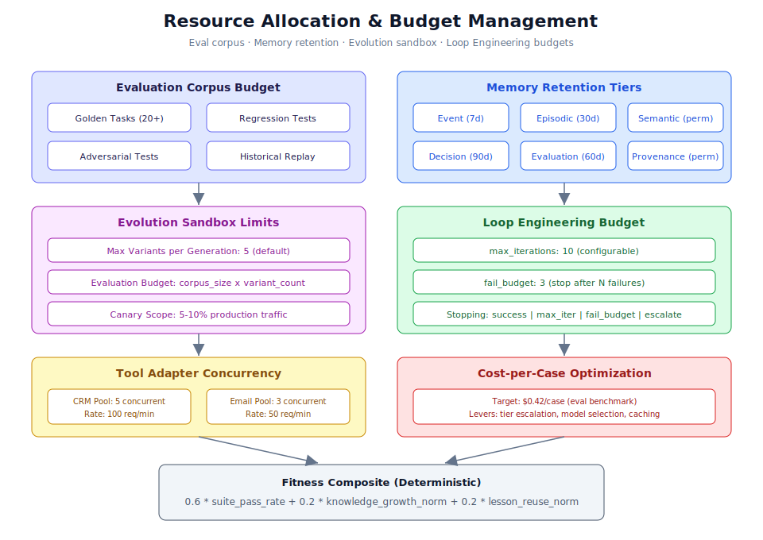

# Chapter 5.2: Resource Allocation & Optimization



## Learning Objectives

By the end of this chapter, you will be able to:

1. Size and manage evaluation corpus budgets for golden tasks, regression, and adversarial tests
2. Configure memory retention policies across all eight memory types
3. Set evolution sandbox resource limits including variant counts and evaluation budgets
4. Optimize tool adapter concurrency pools for throughput and reliability
5. Configure Loop Engineering budget caps (max_iterations, fail_budget, stopping conditions)
6. Implement cost-per-case optimization strategies across all system operations
7. Balance resource allocation between quality, safety, and efficiency

## Prerequisites

Before working through this chapter, ensure you have:

- Completed Chapter 5.1 (Performance Tuning Strategies) for baseline optimization
- Understanding of the evolution sandbox from Chapter 3.1 (Evolution Sandbox)
- Familiarity with the evaluation harness from Chapter 3.2 (Evaluation Harness & Corpus)
- Access to the system with admin privileges for configuration changes
- Knowledge of the eight memory types from Chapter 2.4 (Knowledge & Memory Management)
- Reviewed `docs/self-improvement-and-orchestration.md` for Loop Engineering context

---

## 1. Evaluation Corpus Budget Management

The evaluation corpus is the foundation of quality assurance in Generic Swarm Ops. Every workflow variant, prompt change, and agent configuration must pass through the evaluation harness before promotion. Managing the corpus budget determines how thorough testing is while controlling compute costs.

### 1.1 Golden Tasks Sizing

Golden tasks are the ground-truth examples that define correct behavior. The minimum requirement is 20 golden tasks per workflow, but production systems benefit from larger corpora.

**Step 1:** Assess current golden task coverage:

```bash
# Count golden tasks per workflow domain
find business/evals/golden-tasks -name "*.yaml" | \
  xargs grep -l "domain:" | \
  xargs grep "domain:" | \
  sort | uniq -c | sort -rn
```

**Step 2:** Size the corpus based on workflow complexity:

| Workflow Complexity | Golden Tasks | Regression Tests | Adversarial Tests |
|-------------------|--------------|-----------------|-------------------|
| Simple (3-5 steps) | 20-30 | 50-100 | 10-20 |
| Medium (6-10 steps) | 40-60 | 100-200 | 20-40 |
| Complex (11+ steps) | 80-120 | 200-500 | 40-80 |
| Cross-domain | 100-150 | 300-600 | 60-100 |

**Step 3:** Configure the evaluation budget in the harness:

```yaml
# business/evals/eval-config.yaml
evaluation_budget:
  max_golden_tasks_per_run: 100
  max_regression_tests_per_run: 500
  max_adversarial_tests_per_run: 50
  max_historical_replay_cases: 200
  timeout_per_task_seconds: 120
  parallel_evaluations: 4
  total_budget_per_variant_usd: 5.00
```

> **Tip:** Start with the minimum (20 golden tasks) and grow the corpus based on observed failure patterns. Each production incident should generate at least one new golden task that would have caught it.

### 1.2 Regression Test Coverage

Regression tests prevent previously-fixed issues from reappearing. They accumulate over time as the system evolves.

**Step 1:** Organize regression tests by category:

```text
business/evals/regression-tests/
  functional/          # Core behavior verification
  integration/         # Cross-component interactions
  edge-cases/          # Boundary conditions
  historical-fixes/    # Tests from past incidents
  compliance/          # Regulatory requirement checks
```

**Step 2:** Configure coverage requirements:

```yaml
# Minimum coverage before variant promotion
regression_coverage:
  functional_pass_rate: 1.0      # 100% - no regression allowed
  integration_pass_rate: 0.98    # 98% - minor integration drift tolerated
  edge_case_pass_rate: 0.95      # 95% - some edge cases may change
  compliance_pass_rate: 1.0      # 100% - no compliance regression
```

**Step 3:** Prune obsolete regression tests quarterly:

```bash
# Identify tests that haven't been triggered in 90 days
npm run business:eval -- --identify-unused --days 90

# Review and archive (never delete without review)
npm run business:eval -- --archive-unused --days 90 --dry-run
```

> **Warning:** Never delete regression tests without human review. A test that appears unused may guard against a rare but critical failure mode.

### 1.3 Adversarial Test Budget

Adversarial tests exercise security boundaries (prompt injection, tool misuse, privilege escalation). They are computationally expensive but essential for safety.

```yaml
# Adversarial test configuration
adversarial_budget:
  prompt_injection_variants: 20    # Per workflow
  tool_misuse_scenarios: 10        # Per tool adapter
  privilege_escalation_attempts: 5 # Per role boundary
  memory_poisoning_scenarios: 5    # Per memory scope
  timeout_per_test_seconds: 180    # Higher timeout for adversarial
  fail_threshold: 0                # Zero tolerance for security failures
```

---

## 2. Memory Management and Retention

Generic Swarm Ops maintains eight distinct memory types. Each has different retention characteristics, storage costs, and cleanup requirements.

### 2.1 Retention Policies by Memory Type

Configure retention policies based on the value and cost profile of each memory type:

```yaml
# Memory retention configuration
memory_retention:
  event:
    retention_days: 7
    archive_to: "cold_storage"
    cleanup_schedule: "daily"
    max_entries: 100000
    notes: "Raw operational logs - high volume, short-lived"

  episodic:
    retention_days: 30
    archive_to: "compressed_archive"
    cleanup_schedule: "weekly"
    max_entries: 10000
    notes: "Case narratives - medium volume, medium retention"

  semantic:
    retention_days: null  # Permanent
    review_schedule: "quarterly"
    max_entries: 50000
    notes: "Facts and rules - low volume, high value, permanent"

  procedural:
    retention_days: null  # Permanent
    review_schedule: "quarterly"
    max_entries: 5000
    notes: "Skills and workflows - very low volume, permanent"

  decision:
    retention_days: 90
    archive_to: "audit_archive"
    cleanup_schedule: "monthly"
    max_entries: 25000
    notes: "Decisions + reasons - audit requirement"

  exception:
    retention_days: 180
    archive_to: "knowledge_archive"
    cleanup_schedule: "quarterly"
    max_entries: 5000
    notes: "Edge cases - rare but valuable"

  evaluation:
    retention_days: 60
    archive_to: "metrics_archive"
    cleanup_schedule: "weekly"
    max_entries: 50000
    notes: "Test results - medium retention for trend analysis"

  provenance:
    retention_days: null  # Permanent
    review_schedule: "annual"
    max_entries: null     # No limit
    notes: "Source attribution - mandatory for audit trail"
```

### 2.2 Implementing Retention Cleanup

**Step 1:** Create a cleanup job that respects retention policies:

```python
# scripts/memory_cleanup.py
import asyncio
from datetime import datetime, timedelta

RETENTION_DAYS = {
    "event": 7,
    "episodic": 30,
    "decision": 90,
    "evaluation": 60,
    "exception": 180,
}

async def cleanup_expired_memories():
    """Archive and remove memories past their retention period."""
    for memory_type, days in RETENTION_DAYS.items():
        cutoff = datetime.utcnow() - timedelta(days=days)
        
        # Archive before deletion
        archived = await archive_memories(memory_type, cutoff)
        print(f"Archived {archived} {memory_type} memories older than {days}d")
        
        # Delete archived entries from primary store
        deleted = await delete_memories(memory_type, cutoff)
        print(f"Deleted {deleted} {memory_type} memories from primary store")
```

**Step 2:** Schedule the cleanup:

```bash
# Crontab entry for daily cleanup
0 4 * * * cd /opt/generic-swarm-ops && python scripts/memory_cleanup.py >> logs/cleanup.log 2>&1
```

### 2.3 Provenance Cleanup (Special Case)

Provenance records are permanent but can accumulate orphaned entries when their source documents are deleted. Clean orphans without removing active provenance:

```sql
-- Find orphaned provenance entries (source document no longer exists)
SELECT p.id, p.data->>'source_document_id' AS source
FROM runtime_state p
WHERE p.data @> '{"type": "provenance"}'
  AND NOT EXISTS (
    SELECT 1 FROM runtime_state d
    WHERE d.id = p.data->>'source_document_id'
  );

-- Archive (not delete) orphaned provenance
-- Always keep provenance for audit - move to archive table
INSERT INTO provenance_archive
SELECT * FROM runtime_state
WHERE id IN (/* orphaned IDs from above */);
```

> **Note:** Even orphaned provenance records may be needed for historical audits. Archive them to a separate table rather than deleting them permanently.

---

## 3. Evolution Sandbox Resource Limits

The evolution sandbox generates and evaluates workflow variants. Without resource limits, it can consume unbounded compute and storage.

### 3.1 Variant Count Limits

**Step 1:** Configure maximum variants per generation:

```yaml
# Evolution sandbox configuration
evolution_limits:
  max_variants_per_generation: 5
  max_concurrent_evaluations: 3
  max_active_canaries: 1
  variant_retention_days: 30
  failed_variant_retention_days: 7
  archive_promoted_variants: true
```

**Step 2:** Set limits via environment variables:

```bash
# backend/.env
EVOLUTION_MAX_VARIANTS=5
EVOLUTION_MAX_CONCURRENT_EVALS=3
EVOLUTION_CANARY_MAX_ACTIVE=1
EVOLUTION_VARIANT_TTL_DAYS=30
```

### 3.2 Evaluation Budget per Variant

Each variant must be evaluated against the corpus. The total budget is:

```
evaluation_cost = corpus_size * variant_count * cost_per_evaluation
```

For a typical deployment:
- Golden tasks: 50
- Regression tests: 200
- Adversarial tests: 30
- **Total corpus size:** 280 tasks

With 5 variants per generation and $0.02 per evaluation:
```
5 variants * 280 tasks * $0.02 = $28 per generation
```

**Step 3:** Set budget caps to prevent runaway costs:

```yaml
# Budget caps for evolution
evolution_budget:
  max_cost_per_generation_usd: 50.00
  max_cost_per_day_usd: 200.00
  max_cost_per_month_usd: 3000.00
  alert_threshold_pct: 80
  hard_stop_threshold_pct: 100
```

### 3.3 Canary Scope Configuration

When a variant passes offline evaluation, it enters canary deployment with limited production traffic:

```yaml
# Canary deployment limits
canary_config:
  traffic_percentage: 5          # Start with 5% of production traffic
  max_traffic_percentage: 10     # Never exceed 10% during canary
  min_observations: 100          # Minimum cases before promotion decision
  max_duration_hours: 48         # Auto-rollback after 48h if not promoted
  rollback_triggers:
    error_rate_threshold: 0.05   # Rollback if errors exceed 5%
    latency_p95_threshold_ms: 3000
    compliance_failure: true     # Any compliance failure triggers rollback
    human_escalation_spike: 0.25 # Rollback if escalation rate spikes 25%
```

---

## 4. Tool Adapter Concurrency

Tool adapters execute external actions (CRM updates, email sends, file operations). Each adapter needs concurrency limits to prevent overwhelming downstream systems.

### 4.1 Pool Configuration

```yaml
# Tool adapter concurrency pools
tool_pools:
  crm:
    max_concurrent: 5
    rate_limit_per_minute: 100
    timeout_seconds: 30
    retry_attempts: 3
    retry_backoff_seconds: [1, 5, 15]
    circuit_breaker_threshold: 5   # Open after 5 consecutive failures

  email:
    max_concurrent: 3
    rate_limit_per_minute: 50
    timeout_seconds: 15
    retry_attempts: 2
    retry_backoff_seconds: [2, 10]
    circuit_breaker_threshold: 3

  billing:
    max_concurrent: 2
    rate_limit_per_minute: 30
    timeout_seconds: 45
    retry_attempts: 1
    retry_backoff_seconds: [5]
    circuit_breaker_threshold: 2

  knowledge_search:
    max_concurrent: 10
    rate_limit_per_minute: 200
    timeout_seconds: 10
    retry_attempts: 2
    retry_backoff_seconds: [1, 3]
    circuit_breaker_threshold: 10
```

### 4.2 Circuit Breaker Pattern

Tool adapters use circuit breakers to prevent cascading failures:

```python
# Circuit breaker states
# CLOSED -> normal operation, requests pass through
# OPEN -> all requests fail immediately (fast-fail)
# HALF-OPEN -> allow one test request to check recovery

CIRCUIT_BREAKER_CONFIG = {
    "failure_threshold": 5,        # Failures before opening
    "success_threshold": 3,        # Successes to close from half-open
    "timeout_seconds": 60,         # Time in OPEN before trying HALF-OPEN
    "exclude_exceptions": [        # Don't count these as failures
        "ValidationError",
        "AuthenticationError"
    ]
}
```

### 4.3 Monitoring Adapter Health

```bash
# Check adapter health status
curl -s http://localhost:8000/api/v1/health/ready | python -m json.tool

# Expected output includes tool adapter status:
# {
#   "status": "healthy",
#   "database": "postgres",
#   "adapters": {
#     "crm": {"status": "healthy", "pool_usage": "3/5", "circuit": "closed"},
#     "email": {"status": "healthy", "pool_usage": "1/3", "circuit": "closed"},
#     "billing": {"status": "degraded", "pool_usage": "2/2", "circuit": "half-open"}
#   }
# }
```

---

## 5. Loop Engineering Budget Caps

The Loop Engineering runner controls iterative improvement cycles. Each loop run has a defined budget to prevent unbounded computation.

### 5.1 Loop DNA Configuration

Loop DNA defines the budget for each improvement cycle:

```yaml
# Loop DNA definition
loop_dna:
  id: "loop_customer_onboarding_improvement"
  target_workflow: "wf_customer_onboarding_v12"
  trigger: "api"  # or "schedule"
  
  budget:
    max_iterations: 10          # Maximum improvement cycles
    fail_budget: 3              # Stop after 3 consecutive failures
    timeout_minutes: 60         # Total loop timeout
    cost_cap_usd: 10.00         # Maximum LLM/compute spend per loop

  stopping_conditions:
    - type: "success"
      criteria: "target_metric >= threshold"
    - type: "max_iterations"
      criteria: "iteration_count >= max_iterations"
    - type: "fail_budget"
      criteria: "consecutive_failures >= fail_budget"
    - type: "escalate"
      criteria: "risk_tier >= 4"
    - type: "timeout"
      criteria: "elapsed_minutes >= timeout_minutes"
    - type: "cost_exceeded"
      criteria: "total_cost >= cost_cap_usd"

  escalation:
    on_fail_budget: "notify_ops_owner"
    on_timeout: "save_partial_results"
    on_cost_exceeded: "hard_stop_and_notify"
```

### 5.2 The Eight Loop Components

The Loop Engineering runner has eight components, each with resource implications:

| Component | GSO Implementation | Resource Consideration |
|-----------|-------------------|----------------------|
| Trigger | `POST /api/v1/loops/run` or schedule | API rate limit applies |
| Isolation | Each loop gets unique `loop_run_id` | Separate memory scope per run |
| Generator | Workflow `_execute_run` / agents | LLM token budget |
| Evaluator | Eval harness + step status + stop rules | Corpus evaluation cost |
| State/Memory | Lessons + loop_runs collection | Storage growth |
| Skills/Knowledge | AGENTS.md, SOPs, knowledge search | Retrieval cost per iteration |
| Connectors | Tool adapters (local) | Adapter pool consumption |
| Stopping condition | Budget enforcement | Hard limits prevent runaway |

### 5.3 Starting a Governed Loop

```bash
# Start an improvement loop via API
curl -X POST http://localhost:8000/api/v1/loops/run \
  -H "Content-Type: application/json" \
  -H "Authorization: Bearer $TOKEN" \
  -d '{
    "target_workflow_id": "wf_customer_onboarding_v12",
    "max_iterations": 10,
    "fail_budget": 3,
    "timeout_minutes": 60,
    "cost_cap_usd": 10.00
  }'
```

Monitor loop progress:

```bash
# Check loop status
curl -s http://localhost:8000/api/v1/loops/$LOOP_ID \
  -H "Authorization: Bearer $TOKEN" | python -m json.tool

# Expected response:
# {
#   "id": "loop_abc123",
#   "status": "running",
#   "iteration": 4,
#   "metrics": {
#     "iterations_completed": 3,
#     "consecutive_failures": 0,
#     "elapsed_minutes": 12,
#     "cost_usd": 3.42,
#     "lessons_generated": 2,
#     "variants_proposed": 1
#   }
# }
```

### 5.4 Stopping Condition Behavior

```text
Loop Iteration
  -> Execute workflow run
  -> Observe results (status, metrics, errors)
  -> Evaluate (pass/fail, improvement delta)
  -> Check stopping conditions:
     1. Success? -> Save results, stop
     2. Max iterations? -> Save partial, stop
     3. Fail budget exhausted? -> Escalate, stop
     4. Timeout? -> Save partial, stop
     5. Cost exceeded? -> Hard stop, notify
     6. Risk escalation? -> Escalate to human, pause
  -> If none triggered: iterate (reflect, generate next attempt)
```

> **Warning:** Always set a cost cap on loops. Without one, a loop that never converges will consume unbounded LLM tokens. The default cost cap of $10.00 per loop is appropriate for most workflows.

---

## 6. Cost-per-Case Optimization

The evaluation benchmark target is $0.42 per case (from the evaluation card in `structure.md`). Achieving this requires optimization across multiple cost centers.

### 6.1 Cost Breakdown

Typical cost composition for a workflow execution:

| Component | Typical Cost | Percentage | Optimization Lever |
|-----------|-------------|-----------|-------------------|
| LLM inference | $0.15-0.25 | 40-60% | Model selection, caching |
| Knowledge retrieval | $0.05-0.10 | 12-25% | Tier escalation, caching |
| Tool adapter calls | $0.02-0.08 | 5-20% | Batching, deduplication |
| Database I/O | $0.01-0.03 | 3-7% | Indexing, pooling |
| Evaluation overhead | $0.02-0.05 | 5-12% | Corpus sizing |

### 6.2 Model Selection Strategy

Use different models for different complexity tiers:

```yaml
# Model routing by task complexity
model_routing:
  simple_tasks:
    model: "gpt-3.5-turbo"  # or local model
    max_tokens: 500
    cost_per_1k_tokens: 0.0005
    use_for: ["classification", "simple_extraction", "routing"]

  medium_tasks:
    model: "gpt-4o-mini"
    max_tokens: 2000
    cost_per_1k_tokens: 0.002
    use_for: ["analysis", "decision_support", "draft_generation"]

  complex_tasks:
    model: "gpt-4o"
    max_tokens: 4000
    cost_per_1k_tokens: 0.01
    use_for: ["complex_reasoning", "multi-step_planning", "critical_decisions"]
```

### 6.3 Caching for Cost Reduction

Implement semantic caching for repeated or similar queries:

```python
# Semantic cache configuration
SEMANTIC_CACHE_CONFIG = {
    "enabled": True,
    "similarity_threshold": 0.95,  # Cache hit if 95%+ similar
    "ttl_seconds": 3600,           # Cache entries expire in 1 hour
    "max_entries": 10000,
    "cost_savings_tracking": True
}
```

### 6.4 Tracking Cost per Case

```sql
-- Calculate rolling average cost per case
SELECT
  DATE_TRUNC('day', created_at) AS day,
  COUNT(*) AS cases,
  SUM((data->>'cost_usd')::numeric) AS total_cost,
  ROUND(AVG((data->>'cost_usd')::numeric), 4) AS avg_cost_per_case
FROM runtime_state
WHERE data @> '{"type": "workflow_run", "status": "completed"}'
  AND created_at > NOW() - INTERVAL '30 days'
GROUP BY DATE_TRUNC('day', created_at)
ORDER BY day DESC;
```

---

## 7. Real-World Use Cases

### Use Case 1: Startup with Limited Budget

A 20-person startup needs to run Generic Swarm Ops on a single $50/month VM:

- **Corpus:** 20 golden tasks, 50 regression tests (minimum viable)
- **Memory:** Aggressive retention (event=3d, episodic=14d, decision=30d)
- **Evolution:** 2 variants per generation, $5/day budget cap
- **Loop Engineering:** max_iterations=5, fail_budget=2, cost_cap=$3
- **Tools:** 2 concurrent per adapter, strict rate limits
- **Result:** Functional system at $50/month compute + $80/month LLM costs

### Use Case 2: Mid-Market Compliance-Heavy Organization

A financial services firm with strict audit requirements:

- **Corpus:** 100 golden tasks, 500 regression tests, 80 adversarial tests
- **Memory:** Extended retention for audit (decision=365d, provenance=permanent)
- **Evolution:** 5 variants, $50/day budget, mandatory human gates on promotion
- **Loop Engineering:** max_iterations=10, cost_cap=$15, escalation at tier 3+
- **Tools:** Dedicated pools per system (core banking=2, email=5, reporting=3)
- **Result:** Full compliance coverage at $400/month compute + $600/month LLM costs

### Use Case 3: Enterprise Multi-Domain Deployment

A large enterprise running video (114 agents), research, and education packs:

- **Corpus:** Domain-specific overlays (video=200 golden, research=80, education=50)
- **Memory:** Per-domain retention policies with agent-scoped isolation
- **Evolution:** Coevolution experiments (`POST /api/v1/evolution/coevolution/run`)
- **Fitness composite:** 0.6 * suite_pass_rate + 0.2 * knowledge_growth_norm + 0.2 * lesson_reuse_norm
- **N3 enforcement:** `inventory_check.py` in CI ensures all 114 video agents remain registered
- **Result:** Multi-domain operation at $2,000/month compute + $4,000/month LLM costs

---

## 8. Best Practices

### Resource Allocation Principles

1. **Start conservative, scale up.** Begin with minimum viable budgets and increase based on observed need and ROI.

2. **Separate budgets by purpose.** Evolution, evaluation, and production operations should have independent budget caps to prevent one from starving the others.

3. **Never skip safety tests for budget reasons.** Adversarial and compliance tests have zero-tolerance thresholds regardless of cost pressure.

4. **Monitor cost trends weekly.** Token costs, retrieval costs, and compute costs should all be tracked independently.

5. **Use the fitness composite for prioritization.** When budget is limited, prioritize variants with the highest fitness score (0.6 * suite_pass_rate + 0.2 * knowledge_growth_norm + 0.2 * lesson_reuse_norm).

6. **Set hard stops on all loops.** Every improvement loop must have max_iterations, fail_budget, timeout, AND cost_cap defined.

7. **Retain provenance permanently.** It is the cheapest memory type by volume and the most critical for audit trails.

8. **Prune evaluation corpus quarterly.** Remove duplicate or obsolete tests, but always with human review.

9. **Match retention to regulatory requirements.** Some industries require 7-year retention for decision records.

10. **Plan for growth.** Memory and corpus grow linearly with usage. Budget storage costs accordingly.

### Resource Allocation Anti-Patterns

| Anti-Pattern | Risk | Fix |
|-------------|------|-----|
| No cost cap on loops | Unbounded LLM spend | Always set cost_cap_usd |
| Shared budget pool | One process starves others | Separate budgets per purpose |
| Permanent retention for all types | Storage cost explosion | Apply tiered retention |
| No circuit breaker on adapters | Cascading failures | Configure failure thresholds |
| Auto-promote without budget check | Costly variants reach production | Gate promotion on cost metrics |

---

## 9. Chapter Summary

This chapter covered resource allocation and budget management across all system components:

- **Evaluation corpus budgets** with sizing guidelines for golden tasks, regression, and adversarial tests
- **Memory retention policies** for all eight memory types with cleanup automation
- **Evolution sandbox limits** including variant counts, evaluation budgets, and canary scope
- **Tool adapter concurrency** with pools, rate limits, and circuit breakers
- **Loop Engineering budgets** with max_iterations, fail_budget, and stopping conditions
- **Cost-per-case optimization** through model routing, caching, and tier management

The key principle is that every resource-consuming operation must have explicit budgets and hard limits. Unbounded operations are the primary cause of cost overruns and system instability.

---

## Knowledge Check

1. **What is the minimum number of golden tasks required per workflow?**
   - A) 5
   - B) 10
   - C) 20
   - D) 50

2. **Which memory types have permanent (no expiry) retention by default?**
   - A) Event and episodic
   - B) Semantic, procedural, and provenance
   - C) All memory types
   - D) Only provenance

3. **What is the fitness composite formula used for evolution coevolution experiments?**
   - A) pass_rate * cost_efficiency
   - B) 0.6 * suite_pass_rate + 0.2 * knowledge_growth_norm + 0.2 * lesson_reuse_norm
   - C) quality + safety - cost
   - D) (precision + recall) / 2

4. **What are the four stopping conditions for Loop Engineering?**
   - A) Success, failure, timeout, cancel
   - B) Success, max_iterations, fail_budget, escalate (plus timeout and cost_exceeded)
   - C) Complete, error, manual, auto
   - D) Pass, fail, skip, abort

5. **What is the target cost per case from the evaluation benchmark?**
   - A) $0.10
   - B) $0.25
   - C) $0.42
   - D) $1.00

6. **What happens when a circuit breaker opens on a tool adapter?**
   - A) Requests are queued until the adapter recovers
   - B) All requests fail immediately (fast-fail)
   - C) The adapter retries indefinitely
   - D) The system switches to a backup adapter

7. **Why should adversarial test budgets never be reduced for cost savings?**
   - A) They are the cheapest tests to run
   - B) They have zero tolerance thresholds for security failures
   - C) They run only once per deployment
   - D) They do not use LLM tokens

8. **What is the maximum canary traffic percentage recommended during variant testing?**
   - A) 1%
   - B) 5%
   - C) 10%
   - D) 25%

9. **How should orphaned provenance records be handled?**
   - A) Delete them immediately
   - B) Archive them to a separate table (never permanently delete)
   - C) Leave them in the primary table indefinitely
   - D) Convert them to event memories

10. **What metric determines whether a lesson is retained permanently during archival?**
    - A) Age of the lesson
    - B) Utility score above 0.7 threshold
    - C) Number of times accessed
    - D) Size of the lesson content

**Answers:** 1-C, 2-B, 3-B, 4-B, 5-C, 6-B, 7-B, 8-C, 9-B, 10-B

---

## Appendix: Resource Allocation Quick Reference

### Minimum Viable Configuration

For teams getting started, use these minimum resource allocations:

```yaml
# Minimum viable resource allocation
minimum_config:
  evaluation:
    golden_tasks: 20
    regression_tests: 50
    adversarial_tests: 10
  
  memory_retention:
    event_days: 3
    episodic_days: 14
    decision_days: 30
    evaluation_days: 14
  
  evolution:
    max_variants: 2
    daily_budget_usd: 5
    canary_traffic_pct: 5
  
  loops:
    max_iterations: 5
    fail_budget: 2
    cost_cap_usd: 3
  
  tools:
    default_concurrency: 2
    default_rate_limit: 30
```

### Production Configuration

For production deployments handling significant load:

```yaml
# Production resource allocation
production_config:
  evaluation:
    golden_tasks: 100
    regression_tests: 500
    adversarial_tests: 50
    historical_replay: 200
  
  memory_retention:
    event_days: 7
    episodic_days: 30
    decision_days: 90
    evaluation_days: 60
    exception_days: 180
  
  evolution:
    max_variants: 5
    daily_budget_usd: 50
    monthly_budget_usd: 1000
    canary_traffic_pct: 5
    canary_max_hours: 48
  
  loops:
    max_iterations: 10
    fail_budget: 3
    cost_cap_usd: 15
    timeout_minutes: 60
  
  tools:
    crm_concurrency: 5
    email_concurrency: 3
    billing_concurrency: 2
    knowledge_concurrency: 10
```

### Budget Monitoring Commands

```bash
# Check current resource usage
curl -s http://localhost:8000/api/v1/health/ready \
  -H "Authorization: Bearer $TOKEN" | python -m json.tool

# Check evolution budget consumption
curl -s http://localhost:8000/api/v1/evolution/archive \
  -H "Authorization: Bearer $TOKEN" | python -m json.tool

# Check loop run costs
curl -s "http://localhost:8000/api/v1/loops?status=completed&limit=10" \
  -H "Authorization: Bearer $TOKEN" | python -m json.tool

# Check lesson utility metrics
curl -s "http://localhost:8000/api/v1/improvement/lesson-utility?limit=20" \
  -H "Authorization: Bearer $TOKEN" | python -m json.tool
```
