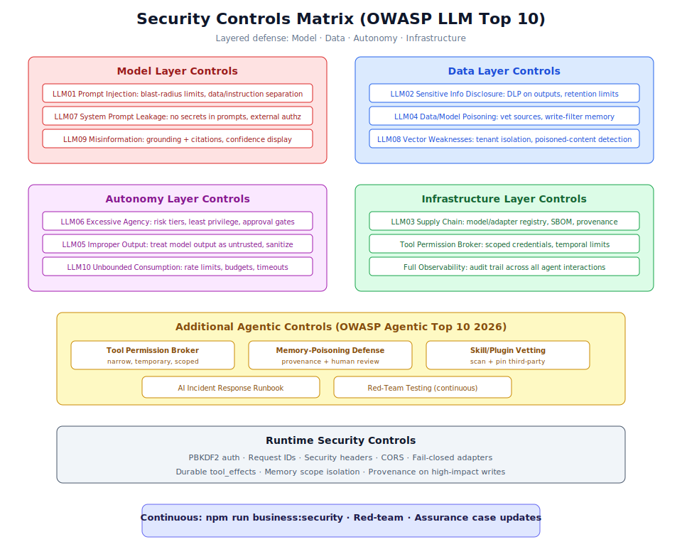

# Chapter 5.4: Security Hardening & Maintenance



## Learning Objectives

By the end of this chapter, you will be able to:

1. Implement the full OWASP LLM Top 10 (2025) control matrix for Generic Swarm Ops
2. Configure agentic security controls including Tool Permission Broker and memory-poisoning defense
3. Run continuous security testing with `npm run business:security` and red-team exercises
4. Defend against prompt injection (direct and indirect) with blast-radius limits
5. Maintain long-term system health through evolution lesson archival and DNA version management
6. Manage audit log retention and assurance case updates for compliance
7. Implement incident response procedures for AI-specific security events

## Prerequisites

Before working through this chapter, ensure you have:

- Completed all previous chapters in Section 5 (Performance, Resources, Deployment)
- Understanding of risk tiers from Chapter 2.3 (Human Gates & Approvals)
- Familiarity with the governance framework from Section 3 (Chapter 3.4)
- Access to admin-level credentials for security configuration
- Read `structure.md` Section 7 (Security) for the complete control matrix
- Read `docs/security.md` for runtime control details

---

## 1. OWASP LLM Top 10 Control Matrix

The OWASP Top 10 for LLM Applications (2025) identifies the most critical security risks for systems that use large language models. Generic Swarm Ops implements controls for each risk category.

### 1.1 LLM01: Prompt Injection

Prompt injection is the single most important threat in agentic systems. After alignment and filtering, assume that prompt injection can still happen. The defense is blast-radius control.

**Controls implemented:**

- All retrieved content and user input treated as untrusted data
- Strict separation between instructions (system prompts) and data (user/retrieved content)
- Blast-radius limits prevent any single agent from accessing resources beyond its scope
- Risk-tiered autonomy ensures high-impact actions require human gates

**Step 1:** Configure blast-radius limits per agent:

```yaml
# Agent blast-radius configuration
agent_security:
  business_orchestrator:
    max_tool_calls_per_request: 10
    allowed_memory_scopes: ["organization"]
    allowed_tool_namespaces: ["ops.*"]
    max_output_tokens: 4000
    cannot_modify: ["governance_policy", "security_config"]

  video_orchestrator:
    max_tool_calls_per_request: 20
    allowed_memory_scopes: ["agent", "organization"]
    allowed_tool_namespaces: ["video.*"]
    max_output_tokens: 8000
    cannot_modify: ["ops.*", "governance_policy"]
```

**Step 2:** Implement input/output separation in prompts:

```python
# CORRECT: Data clearly separated from instructions
SYSTEM_PROMPT = """You are a workflow assistant. Follow these rules:
1. Never execute actions without verification
2. Always cite sources from the knowledge base
3. Refuse requests that violate policy"""

# User content is NEVER mixed into system prompt
USER_DATA_BLOCK = f"""
<user_input type="untrusted">
{user_message}
</user_input>

<retrieved_context type="untrusted">
{retrieval_results}
</retrieved_context>
"""
```

**Step 3:** Test indirect prompt injection resistance:

```bash
# Run the built-in injection test suite
npm run business:security

# Additional targeted injection tests
cd backend
pytest tests/security/test_prompt_injection.py -v
```

> **Warning:** System prompts are NOT security controls. If a secret is in the prompt, it is already compromised. Enforce all security boundaries deterministically outside the LLM.

### 1.2 LLM02: Sensitive Information Disclosure

Prevent the system from leaking sensitive data through model outputs or logs.

**Controls implemented:**

- DLP (Data Loss Prevention) filtering on all model outputs and logs
- Secrets never placed in prompts or stored in model-accessible memory
- Retention limits on sensitive data with automated cleanup
- Output sanitization before displaying to users

**Step 1:** Configure output DLP rules:

```yaml
# DLP configuration
dlp_rules:
  patterns:
    - name: "credit_card"
      regex: '\b\d{4}[\s-]?\d{4}[\s-]?\d{4}[\s-]?\d{4}\b'
      action: "redact"
    - name: "ssn"
      regex: '\b\d{3}-\d{2}-\d{4}\b'
      action: "redact"
    - name: "api_key"
      regex: '\b(sk|pk|api)[-_][a-zA-Z0-9]{20,}\b'
      action: "block_and_alert"
    - name: "database_url"
      regex: 'postgresql://[^\s]+'
      action: "redact"
  
  log_sanitization:
    enabled: true
    redact_fields: ["password", "token", "secret", "key"]
```

### 1.3 LLM03: Supply Chain

Mitigate risks from third-party models, tools, adapters, and agent skills.

**Controls implemented:**

- Model and tool adapter registry with version pinning
- Provenance tracking for all external dependencies
- Dependency scanning and SBOM (Software Bill of Materials) generation
- Skill/plugin vetting before activation

**Step 1:** Maintain the tool adapter registry:

```yaml
# Tool adapter registry (pinned versions)
tool_registry:
  crm_adapter:
    version: "2.1.0"
    hash: "sha256:abc123..."
    last_audit: "2026-07-01"
    risk_tier: 3
    permissions: ["read_contacts", "write_contacts"]

  email_adapter:
    version: "1.4.2"
    hash: "sha256:def456..."
    last_audit: "2026-06-15"
    risk_tier: 2
    permissions: ["send_email", "read_inbox"]
```

**Step 2:** Run dependency scanning in CI:

```bash
# Scan Python dependencies
pip-audit --requirement backend/requirements.txt

# Scan Node.js dependencies
npm audit

# Generate SBOM
npx @cyclonedx/bom -o sbom.json
```

### 1.4 LLM04: Data and Model Poisoning

Prevent corruption of the knowledge base, memory, and any fine-tuned models.

**Controls implemented:**

- All fine-tunes and LoRA adapters vetted before deployment
- Retrieval sources validated with provenance tracking
- Write-filter on memory prevents unauthorized modifications
- High-impact memory writes require human review

**Step 1:** Configure memory write filters:

```yaml
# Memory write security
memory_security:
  high_impact_scopes:
    - "semantic"      # Rules and facts
    - "procedural"    # Skills and workflows
    - "governance"    # Policies
  
  write_controls:
    require_provenance: true
    require_confidence_threshold: 0.7
    human_review_threshold: 0.85  # Very high confidence still needs review for rules
    
  poisoning_detection:
    enabled: true
    contradiction_check: true
    source_reputation_scoring: true
    anomaly_detection: true
```

### 1.5 LLM05: Improper Output Handling

Treat all model output as untrusted input before any execution.

**Controls implemented:**

- Model outputs sanitized before execution or display
- No direct code execution from model output without sandboxing
- Output validation against expected schemas
- HTML/SQL/command injection prevention on model-generated content

```python
# Output sanitization pipeline
def sanitize_model_output(output: str, context: str) -> str:
    """Sanitize model output before any execution or display."""
    # Remove potential command injection
    output = strip_shell_commands(output)
    # Remove potential SQL injection
    output = parameterize_sql_fragments(output)
    # Validate against expected output schema
    validate_output_schema(output, context)
    return output
```

### 1.6 LLM06: Excessive Agency

The primary defense against excessive agency is risk-tiered autonomy.

**Controls implemented:**

- Six risk tiers (0-5) with increasing human oversight
- Least privilege tool access via Tool Permission Broker
- Approval gates for sensitive or irreversible actions
- Maximum action limits per request

```yaml
# Risk tier enforcement
risk_tiers:
  tier_0_observe:
    actions: ["log", "summarize"]
    human_required: false
    tool_access: ["read_only"]
  
  tier_1_recommend:
    actions: ["suggest", "draft"]
    human_required: false
    tool_access: ["read_only", "knowledge_search"]
  
  tier_2_draft:
    actions: ["prepare_artifacts"]
    human_required: true  # Before send/execute
    tool_access: ["read_only", "draft_tools"]
  
  tier_3_execute_reversible:
    actions: ["execute_with_rollback"]
    human_required: false
    tool_access: ["reversible_tools"]
    rollback_required: true
  
  tier_4_execute_with_gate:
    actions: ["execute_critical"]
    human_required: true  # Approve the critical step
    tool_access: ["all_assigned"]
  
  tier_5_restricted:
    actions: []  # No autonomous action
    human_required: true
    tool_access: []
    assurance_case_required: true
```

### 1.7 LLM07: System Prompt Leakage

**Controls implemented:**

- No secrets, credentials, or role-based access information in system prompts
- Authorization enforced externally (backend RBAC), never by prompt instruction
- System prompts do not contain information that would be harmful if disclosed

> **Note:** Assume that any information in a system prompt will eventually be extracted. Design prompts with that assumption.

### 1.8 LLM08: Vector and Embedding Weaknesses

**Controls implemented:**

- Tenant isolation on vector stores (per-domain embedding spaces)
- Poisoned-content detection in the embedding pipeline
- Embedding model version pinning and integrity verification

```sql
-- Tenant-isolated vector search
SELECT id, chunk_text, 1 - (embedding <=> $1) AS similarity
FROM embeddings
WHERE domain_id = $2  -- Tenant isolation
  AND metadata->>'verified' = 'true'  -- Only verified content
ORDER BY embedding <=> $1
LIMIT 10;
```

### 1.9 LLM09: Misinformation

**Controls implemented:**

- All agent outputs grounded with citations to source documents
- Confidence scores displayed to users
- Human review required for high-stakes decisions
- Hallucination rate tracked in evaluation metrics (target: < 1%)

### 1.10 LLM10: Unbounded Consumption

**Controls implemented:**

- Rate limits on all endpoints (especially LLM-calling routes)
- Timeout budgets for every stage of request processing
- Cost caps on improvement loops and evolution runs
- Circuit breakers on tool adapters
- "Denial-of-wallet" defense through budget enforcement

```python
# Unbounded consumption defense
CONSUMPTION_LIMITS = {
    "max_tokens_per_request": 8000,
    "max_tool_calls_per_request": 20,
    "max_retrieval_queries_per_request": 5,
    "request_timeout_seconds": 120,
    "daily_token_budget": 1_000_000,
    "monthly_cost_cap_usd": 5000,
}
```

---

## 2. Agentic Security Controls

Beyond the LLM Top 10, the OWASP Top 10 for Agentic Applications (2026) adds controls specific to autonomous systems.

### 2.1 Tool Permission Broker

The Tool Permission Broker grants narrow, temporary, scoped credentials for each task:

```python
# Tool Permission Broker flow
# 1. Agent requests tool access
# 2. Broker checks: DNA allows tool? RBAC permits? Risk tier acceptable?
# 3. Broker issues scoped, time-limited credential
# 4. Tool adapter validates credential before execution
# 5. Credential expires after task completion or timeout

BROKER_CONFIG = {
    "credential_ttl_seconds": 300,  # 5 minute max
    "max_scope_per_credential": 3,   # Max 3 permissions per credential
    "require_dna_allowlist": True,   # Tool must be in workflow DNA
    "require_rbac_check": True,      # User role must permit
    "audit_all_grants": True,        # Log every credential issuance
}
```

**Step 1:** Configure per-workflow tool allowlists:

```yaml
# Workflow DNA tool restrictions
workflow_dna:
  id: "wf_customer_onboarding_v12"
  tools:
    allowed: ["contract_parser", "policy_retriever", "crm", "billing_system", "email"]
    denied: ["admin_tools", "database_direct", "file_system"]
  
  tool_permission_broker:
    max_concurrent_grants: 3
    require_justification: true
    log_denied_attempts: true
```

### 2.2 Memory-Poisoning Defense

Memory poisoning is a named agentic risk class. An attacker who can write to agent memory can influence all future decisions.

**Step 1:** Configure provenance requirements for memory writes:

```yaml
# Memory poisoning defense
memory_defense:
  write_controls:
    all_writes_require_provenance: true
    high_impact_writes_require_human: true
    
  high_impact_memory_types:
    - "semantic"    # Rules
    - "procedural"  # Workflows
    - "decision"    # Decision patterns
    
  detection:
    contradiction_alert: true     # Alert on contradicting existing knowledge
    rapid_change_alert: true      # Alert if many writes in short period
    source_verification: true     # Verify provenance source exists
    
  response:
    quarantine_suspicious: true   # Hold for review rather than write
    alert_ops_team: true
    log_all_attempts: true
```

### 2.3 Skill and Plugin Vetting

Third-party agent skills are a live supply-chain vector:

```bash
# Vet a new skill before activation
python scripts/security/vet_skill.py \
  --skill-path business/distilled/skills/new_skill.yaml \
  --check-permissions \
  --check-tool-access \
  --check-memory-scope \
  --dry-run

# Output:
# Skill: new_customer_outreach
# Tool access requested: [email, crm]
# Memory scope requested: [agent, organization]
# Risk assessment: MEDIUM
# Recommendation: Approve with monitoring
```

### 2.4 Full Observability

One audit trail across all model calls, tool calls, and agent-to-agent traffic:

```json
{
  "trace_id": "trace_xyz789",
  "request_id": "req_abc123",
  "timestamp": "2026-07-15T14:03:00Z",
  "events": [
    {"type": "model_call", "model": "gpt-4o", "tokens_in": 1200, "tokens_out": 350},
    {"type": "tool_call", "tool": "crm", "action": "read_contact", "status": "success"},
    {"type": "memory_write", "scope": "episodic", "provenance": "run_123"},
    {"type": "agent_call", "from": "orchestrator", "to": "governance_officer"},
    {"type": "human_gate", "decision": "approved", "reviewer": "ops_lead"}
  ]
}
```

### 2.5 AI Incident Response

A defined runbook for GenAI-specific incidents:

**Step 1:** Classify the incident:

| Severity | Example | Response Time |
|----------|---------|---------------|
| Critical | Prompt injection leading to data exfiltration | Immediate |
| High | Unauthorized tool execution | < 1 hour |
| Medium | Memory poisoning attempt detected | < 4 hours |
| Low | Rate limit exceeded, suspicious pattern | < 24 hours |

**Step 2:** Execute the response runbook:

```text
1. CONTAIN: Disable affected agent/workflow (PATCH /agents/{id} status=suspended)
2. ASSESS: Review audit trail for blast radius
3. PRESERVE: Export logs and memory state for forensics
4. REMEDIATE: Apply fix (update permissions, patch vulnerability)
5. VALIDATE: Run adversarial tests to confirm fix
6. RESTORE: Re-enable with monitoring
7. POSTMORTEM: Document root cause, update threat model
8. IMPROVE: Add new adversarial test to corpus
```

---

## 3. Ongoing Security Practices

### 3.1 Running Security Scans

```bash
# Business artifact security scan
npm run business:security

# What it checks:
# - Secrets in business artifacts (API keys, passwords, tokens)
# - Tool permissions for wildcard scopes
# - Prompt injection coverage
# - High-risk workflow steps without human gates
# - Evolution proposals without sandbox flag
# - Self-improvement attempts at host code rewrite
```

### 3.2 Red-Team Testing

Regular red-team exercises test the security controls in realistic scenarios:

```bash
# Run the red-team test suite
cd backend
pytest tests/security/ -v --tb=long

# Categories tested:
# - Prompt injection (direct and indirect)
# - Tool misuse and privilege escalation
# - Memory poisoning attempts
# - Cross-domain data leakage
# - Unbounded consumption attacks
# - Agent behavior hijacking
```

**Schedule red-team exercises:**

| Exercise | Frequency | Focus |
|----------|-----------|-------|
| Automated injection tests | Every CI run | Known injection patterns |
| Manual red-team session | Monthly | Novel attack vectors |
| Cross-domain isolation test | Quarterly | Domain boundary integrity |
| Full adversarial assessment | Semi-annually | End-to-end security posture |

### 3.3 Prompt Injection Defense (Deep Dive)

Indirect prompt injection is especially dangerous because it comes through retrieved content that the system trusts:

```python
# Defense layers against indirect injection
INJECTION_DEFENSES = {
    "input_sanitization": {
        "strip_known_injection_patterns": True,
        "max_input_length": 10000,
        "reject_embedded_instructions": True
    },
    "retrieval_safety": {
        "mark_retrieved_as_untrusted": True,
        "separate_data_from_instructions": True,
        "limit_retrieved_content_influence": True
    },
    "output_validation": {
        "check_output_for_injection_artifacts": True,
        "validate_against_expected_schema": True,
        "block_unexpected_tool_calls": True
    },
    "blast_radius": {
        "per_agent_tool_limits": True,
        "per_request_action_limits": True,
        "scope_boundaries_enforced": True
    }
}
```

> **Tip:** The best defense against prompt injection is not trying to detect it perfectly (which is impossible) but limiting the damage any single injection can cause. Blast-radius control is the key principle.

---

## 4. Long-Term Maintenance

### 4.1 Evolution Lesson Archival

As the system evolves, lessons accumulate. Archive old lessons to prevent unbounded growth while preserving history:

```python
# Lesson archival configuration
LESSON_ARCHIVAL = {
    "active_lesson_max_age_days": 90,
    "archive_schedule": "monthly",
    "archive_format": "jsonl_compressed",
    "archive_location": "business/evolution/lessons-archive/",
    "retain_high_utility_permanently": True,
    "utility_threshold_for_retention": 0.7,
    "index_archived_lessons": True  # Searchable but not in active memory
}
```

**Step 1:** Run the archival process:

```bash
# Archive old lessons (respects utility threshold)
python scripts/maintenance/archive_lessons.py \
  --max-age-days 90 \
  --min-utility 0.7 \
  --dry-run

# Output:
# Lessons to archive: 47
# Lessons retained (high utility): 12
# Estimated storage savings: 3.2 MB
# Run without --dry-run to execute
```

### 4.2 DNA Version Management

Workflow DNA versions accumulate as variants are promoted. Manage the version history:

```bash
# List all DNA versions for a workflow
curl -s http://localhost:8000/api/v1/workflows/wf_customer_onboarding/versions \
  -H "Authorization: Bearer $TOKEN" | python -m json.tool

# Response:
# {
#   "workflow_id": "wf_customer_onboarding",
#   "active_version": "v12",
#   "versions": [
#     {"version": "v12", "status": "active", "promoted": "2026-07-10"},
#     {"version": "v11", "status": "archived", "promoted": "2026-06-15"},
#     {"version": "v10", "status": "archived", "promoted": "2026-05-20"},
#     ...
#   ]
# }
```

**Step 2:** Configure version retention:

```yaml
# DNA version management
dna_version_policy:
  keep_active: 1            # Only one active version
  keep_previous: 3          # Keep 3 previous for rollback
  archive_older: true       # Archive versions beyond keep_previous
  archive_location: "business/evolution/dna-archive/"
  minimum_retention_days: 30  # Never delete within 30 days
```

### 4.3 Audit Log Retention

Audit logs must be retained according to regulatory requirements:

```yaml
# Audit log retention policy
audit_retention:
  # Standard operations
  general_audit:
    retention_days: 365
    storage: "primary_database"
    
  # Security events
  security_audit:
    retention_days: 2555  # 7 years
    storage: "archive_database"
    immutable: true
    
  # Human gate decisions
  approval_audit:
    retention_days: 2555  # 7 years
    storage: "archive_database"
    immutable: true
    
  # Evolution decisions
  evolution_audit:
    retention_days: 1825  # 5 years
    storage: "archive_database"
    
  cleanup:
    schedule: "monthly"
    require_approval: true  # Admin must approve deletions
    export_before_delete: true
```

### 4.4 Assurance Case Updates

Assurance cases document the evidence that the system operates safely. Update them on every significant change:

```yaml
# Assurance case update triggers
assurance_case_triggers:
  - "New workflow DNA promoted to production"
  - "New domain pack registered"
  - "Security incident resolved"
  - "Risk tier boundary changed"
  - "New tool adapter activated"
  - "Governance policy updated"
  - "Regulatory requirement changed"

# Assurance case structure
assurance_case:
  claim: "The system operates within defined safety boundaries"
  evidence:
    - type: "test_results"
      source: "business/evals/regression-tests/"
      last_run: "2026-07-15"
    - type: "security_scan"
      source: "npm run business:security"
      last_run: "2026-07-15"
    - type: "governance_check"
      source: "npm run business:governance"
      last_run: "2026-07-15"
    - type: "incident_history"
      source: "business/security/incident-reports/"
      open_incidents: 0
```

---

## 5. Real-World Use Cases

### Use Case 1: Healthcare AI Operations

A healthcare organization uses Generic Swarm Ops for patient scheduling and referral workflows:

- **OWASP focus:** LLM02 (patient data disclosure) and LLM06 (excessive agency in clinical context)
- **Controls:** All patient identifiers redacted from LLM prompts, tier 4+ gates on any clinical decision, full audit trail for HIPAA compliance
- **Red-team:** Monthly injection tests simulating patient data extraction attempts
- **Retention:** 7-year audit retention (HIPAA requirement), immutable logs
- **Result:** Zero data disclosure incidents in 12 months of operation

### Use Case 2: Financial Services Automation

A bank deploys Generic Swarm Ops for loan processing and compliance checking:

- **OWASP focus:** LLM01 (injection via loan documents), LLM04 (poisoning of credit rules)
- **Controls:** All uploaded documents treated as untrusted, semantic memory writes for credit rules require dual human review, blast-radius limits prevent any agent from approving loans
- **Red-team:** Quarterly external penetration testing with AI-specific scenarios
- **Maintenance:** DNA versions retained for 7 years (regulatory), weekly assurance case reviews
- **Result:** Passed SOX audit and OCC examination with full AI-specific documentation

### Use Case 3: Multi-Tenant SaaS Platform

A SaaS provider runs Generic Swarm Ops for multiple enterprise clients:

- **OWASP focus:** LLM08 (cross-tenant vector leakage), LLM03 (supply chain for tenant plugins)
- **Controls:** Per-tenant vector isolation, per-tenant memory scopes, skill vetting before cross-tenant deployment, separate audit trails per tenant
- **Red-team:** Continuous automated cross-tenant access testing in CI
- **Maintenance:** Monthly lesson archival per tenant, quarterly governance reviews
- **Result:** SOC 2 Type II certification with AI-specific controls documented

---

## 6. Best Practices

### Security Hardening Principles

1. **Assume prompt injection will succeed.** Design for blast-radius containment, not perfect detection.

2. **System prompts are not security controls.** Never rely on prompt instructions for access control or secret keeping.

3. **Enforce security deterministically.** All access control, rate limiting, and scope enforcement must happen outside the LLM in deterministic code.

4. **Defense in depth.** Multiple overlapping controls ensure that failure of one does not compromise the system.

5. **Least privilege everywhere.** Agents, tools, and memory scopes should have the minimum access needed for their task.

6. **Human gates for irreversible actions.** Any action that cannot be rolled back must have human approval.

7. **Provenance on everything.** Every memory write, every decision, every tool call must trace back to its source.

8. **Red-team regularly.** Security controls degrade as the system evolves. Regular adversarial testing validates they still work.

9. **Update assurance cases on every change.** An outdated assurance case is worse than no assurance case.

10. **Retain audit logs immutably.** Once written, audit logs must never be modified or deleted (within retention period).

### Security Anti-Patterns

| Anti-Pattern | Risk | Fix |
|-------------|------|-----|
| Secrets in system prompts | Prompt extraction reveals secrets | Use external auth/config |
| Wildcard tool permissions | Excessive agency | Explicit allowlist per workflow |
| No memory write controls | Memory poisoning | Provenance + human review |
| Single-layer injection defense | Bypass = full compromise | Defense in depth + blast-radius |
| Mutable audit logs | Evidence tampering | Append-only + checksums |
| No incident runbook | Slow response, improvisation | Documented AI incident procedures |

---

## 7. Chapter Summary

This chapter covered the complete security hardening and long-term maintenance strategy:

- **OWASP LLM Top 10 (2025)** control matrix covering all ten risk categories from prompt injection through unbounded consumption
- **Agentic security controls** including Tool Permission Broker, memory-poisoning defense, skill vetting, full observability, and AI incident response
- **Ongoing security practices** with `npm run business:security`, red-team testing schedules, and prompt injection defense layers
- **Long-term maintenance** including evolution lesson archival, DNA version management, audit log retention, and assurance case updates

The fundamental security principle for Generic Swarm Ops is: enforce security deterministically, outside the LLM. Prompt-based controls are insufficient against determined adversaries. Real security comes from code-level enforcement of scope boundaries, rate limits, approval gates, and audit trails.

---

## Knowledge Check

1. **What is the primary defense strategy against prompt injection in agentic systems?**
   - A) Better prompt engineering
   - B) Input filtering
   - C) Blast-radius control (limiting damage even if injection succeeds)
   - D) Model fine-tuning

2. **Which OWASP risk (LLM06) is addressed by the risk tier system?**
   - A) Prompt injection
   - B) Sensitive information disclosure
   - C) Excessive agency
   - D) Supply chain risk

3. **What does the Tool Permission Broker provide?**
   - A) Permanent API keys for tools
   - B) Narrow, temporary, scoped credentials per task
   - C) Admin access to all tools
   - D) Tool installation services

4. **Why should system prompts never contain secrets?**
   - A) They make prompts too long
   - B) They increase token costs
   - C) System prompts can be extracted; they are not security boundaries
   - D) Secrets expire too quickly

5. **What triggers an assurance case update?**
   - A) Only after security incidents
   - B) Any significant change (new DNA, new domain pack, policy update, incident)
   - C) Annual review only
   - D) Only when regulations change

6. **What is the recommended frequency for manual red-team exercises?**
   - A) Daily
   - B) Weekly
   - C) Monthly
   - D) Annually

7. **How long should security audit logs be retained?**
   - A) 30 days
   - B) 1 year
   - C) 7 years (2555 days)
   - D) Permanently

8. **What is the correct response when memory poisoning is detected?**
   - A) Delete all memory immediately
   - B) Quarantine suspicious writes, alert ops team, log the attempt
   - C) Disable the entire system
   - D) Ignore if confidence is above threshold

**Answers:** 1-C, 2-C, 3-B, 4-C, 5-B, 6-C, 7-C, 8-B
