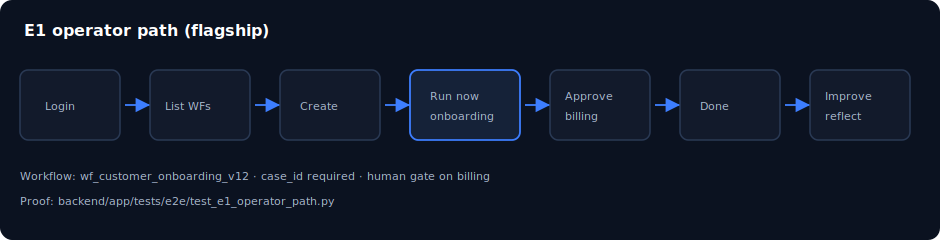

# 第 05 章：第一次工作流執行（E1 路徑）

> **語言：** 繁體中文（`_hk`）  
> **狀態：** 骨架於 `book/user_guide/` — 請在此擴寫完整內文  
> **程度：** 初學者 → 中級  
> **部：** 第 II 部 — 操作核心  
> **預估時間：** 60 分鐘  
> **路徑：** `book/user_guide/chapters/05-first-workflow-run-e1_hk.md`  
> **英文對照：** [`05-first-workflow-run-e1.md`](./05-first-workflow-run-e1.md)

## 插圖

*圖：第一次工作流執行（E1 路徑） — 來源 `assets/05-e1-operator-path.svg`*

## 學習目標

- 端到端完成 E1 路徑
- 為旗艦工作流提供必要 payload（case_id）
- 觀察 run 狀態至完成

## 敘事大綱（擴寫為完整正文）

1. E1 證明什麼（產品門檻）
2. 旗艦工作流 wf_customer_onboarding_v12
3. UI 步驟：list → run → approve → complete → improve
4. 對等 API curl 序列
5. 閱讀 run 事件 / console
6. 常見失敗：缺 case_id、角色錯誤、demoMode mock
7. 自動化證明：test_e1_operator_path.py

## 實作實驗

- [ ] 實驗 E1-UI：瀏覽器完成路徑
- [ ] 實驗 E1-API：以 token 登入並執行
- [ ] 實驗 E1-Test：跑 e2e 並讀 assertion 名稱

## 主要來源（未驗證前勿臆造）

- `docs/usage.md`
- `reviews/e1_operator_checklist.md`
- `backend/app/tests/e2e/test_e1_operator_path.py`
- `EXECUTABLE_PRODUCT.md`

## 撰寫檢查清單（完整稿）

- [ ] 開場一段說明「為何重要」
- [ ] 步驟指令以 Windows PowerShell 為主，必要時附 bash
- [ ] 每個主要實驗含「預期結果」
- [ ] 相關處標明殘留／未宣稱
- [ ] 交叉連結上一章／下一章（`*_hk.md`）
- [ ] SVG 使用 `../assets/`（與英文版共用圖檔）
- [ ] 術語與英文版一致；產品識別碼（dna_id、API 路徑）不翻譯

## 導覽

- 目錄：[../TOC_hk.md](../TOC_hk.md)
- 主檔：[../user_guide_hk.md](../user_guide_hk.md)
- 英文主檔：[../user_guide.md](../user_guide.md)
- 計畫：[../../../planning/user_guide/00_PLAN.md](../../../planning/user_guide/00_PLAN.md)
