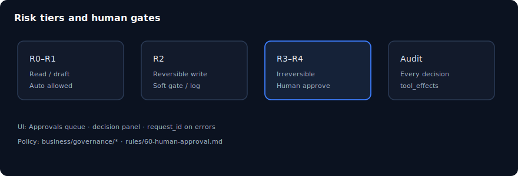

# 第 06 章：核准、風險層級與稽核

> **語言：** 繁體中文（`_hk`）  
> **狀態：** 骨架於 `book/user_guide/` — 請在此擴寫完整內文  
> **程度：** 中級  
> **部：** 第 II 部 — 操作核心  
> **預估時間：** 45 分鐘  
> **路徑：** `book/user_guide/chapters/06-approvals-risk-audit_hk.md`  
> **英文對照：** [`06-approvals-risk-audit.md`](./06-approvals-risk-audit.md)

## 插圖

*圖：核准、風險層級與稽核 — 來源 `assets/06-governance-gates.svg`*

## 學習目標

- 判斷何時需要人工核准
- 核准/駁回並寫理由，找到稽核軌跡
- 把 R0–R4 風險層級對到操作行為

## 敘事大綱（擴寫為完整正文）

1. 風險層級與不可逆動作
2. Approvals 佇列 UX 與決策面板
3. 稽核日誌記錄內容
4. request_id 用於支援 / 除錯
5. business/governance/ 產物
6. 規則：60-human-approval、90-governance-risk

## 實作實驗

- [ ] 觸發 billing 閘門並以 reviewer 核准
- [ ] 找到對應稽核日誌
- [ ] 駁回一次並觀察 run 結果

## 主要來源（未驗證前勿臆造）

- `docs/governance.md`
- `docs/security.md`
- `business/governance/`
- `rules/60-human-approval.md`

## 撰寫檢查清單（完整稿）

- [ ] 開場一段說明「為何重要」
- [ ] 步驟指令以 Windows PowerShell 為主，必要時附 bash
- [ ] 每個主要實驗含「預期結果」
- [ ] 相關處標明殘留／未宣稱
- [ ] 交叉連結上一章／下一章（`*_hk.md`）
- [ ] SVG 使用 `../assets/`（與英文版共用圖檔）
- [ ] 術語與英文版一致；產品識別碼（dna_id、API 路徑）不翻譯

## 導覽

- 目錄：[../TOC_hk.md](../TOC_hk.md)
- 主檔：[../user_guide_hk.md](../user_guide_hk.md)
- 英文主檔：[../user_guide.md](../user_guide.md)
- 計畫：[../../../planning/user_guide/00_PLAN.md](../../../planning/user_guide/00_PLAN.md)
