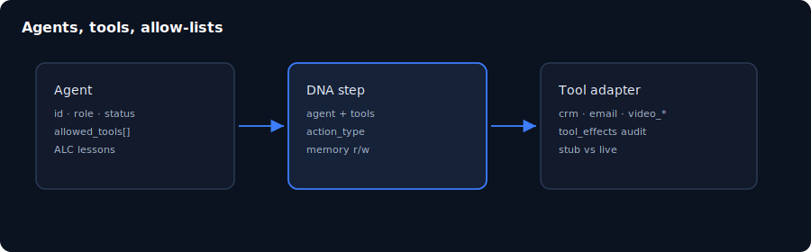

# 第 07 章：代理、工具與 RBAC

> **語言：** 繁體中文（`_hk`）  
> **狀態：** 骨架於 `book/user_guide/` — 請在此擴寫完整內文  
> **程度：** 中級  
> **部：** 第 II 部 — 操作核心  
> **預估時間：** 45 分鐘  
> **路徑：** `book/user_guide/chapters/07-agents-tools-rbac_hk.md`  
> **英文對照：** [`07-agents-tools-rbac.md`](./07-agents-tools-rbac.md)

## 插圖

*圖：代理、工具與 RBAC — 來源 `assets/07-agents-tools.svg`*

## 學習目標

- 建立或檢視含 allowed_tools 的 agent
- 說明 allow-list 外工具為何失敗
- 把角色對到主要畫面權限

## 敘事大綱（擴寫為完整正文）

1. Agent 欄位與狀態
2. 工具適配器目錄（ops + video stub）
3. Runtime allow-list 強制
4. RBAC 權限型別
5. API 金鑰 vs 使用者工作階段
6. ALC / lessons 預覽（見 ch14）

## 實作實驗

- [ ] 以 UI 表單建立 agent（live 模式）
- [ ] 嘗試 allow-list 外工具（預期可控失敗）
- [ ] 比較 admin 與 operator 可見導覽

## 主要來源（未驗證前勿臆造）

- `docs/agents.md`
- `frontend/src/types/permissions.ts`
- `backend/app/infrastructure/tools/`

## 撰寫檢查清單（完整稿）

- [ ] 開場一段說明「為何重要」
- [ ] 步驟指令以 Windows PowerShell 為主，必要時附 bash
- [ ] 每個主要實驗含「預期結果」
- [ ] 相關處標明殘留／未宣稱
- [ ] 交叉連結上一章／下一章（`*_hk.md`）
- [ ] SVG 使用 `../assets/`（與英文版共用圖檔）
- [ ] 術語與英文版一致；產品識別碼（dna_id、API 路徑）不翻譯

## 導覽

- 目錄：[../TOC_hk.md](../TOC_hk.md)
- 主檔：[../user_guide_hk.md](../user_guide_hk.md)
- 英文主檔：[../user_guide.md](../user_guide.md)
- 計畫：[../../../planning/user_guide/00_PLAN.md](../../../planning/user_guide/00_PLAN.md)
