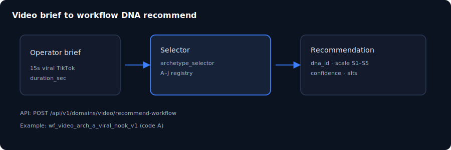

# Chapter 08: Domain packs and recommend workflow

> **Status:** PLAN SCAFFOLD — detailed outline for full prose in `book/user_guide/`  
> **Level:** Intermediate  
> **Part:** Part III — Domains & video pack  
> **Est. time:** 60 min  
> **Final path:** `book/user_guide/chapters/08-domain-packs-and-recommend.md`

## Illustration

*Figure: Domain packs and recommend workflow — source `assets/08-domain-recommend.svg`*

## Learning objectives

- Explain what a domain pack is and where video pack lives
- Submit a free-text brief and read ranked DNA recommendation
- Distinguish selection helper from live media generation

## Narrative outline (to expand into full prose)

1. Domain pack anatomy: manifest, agents, workflows DNA, corpus
2. Video pack inventory (114 agents, A–J archetypes)
3. Recommend API + UI panel walkthrough
4. Scale S1–S5 and confidence interpretation
5. Hitl_confirm_required before launch
6. Run viral-hook DNA after recommend (optional advanced lab)
7. Residuals: production_ready flags, live Sora/Veo not claimed

## Hands-on labs

- [ ] UI: Domains → brief '15s viral TikTok hook' → assert dna_id A
- [ ] CLI: scripts/business/recommend_video_workflow.py same brief
- [ ] API: POST recommend-workflow with auth

## Primary sources (do not invent beyond these without verifying)

- `docs/domain-packs.md`
- `docs/add-domain-pack-runbook.md`
- `business/video/`
- `backend/app/domain/workflows/archetype_selector.py`
- `EXECUTABLE_PRODUCT.md`

## Writing checklist (for full draft)

- [ ] Open with 1-paragraph “why this matters”
- [ ] Step-by-step commands that work on Windows PowerShell and bash where possible
- [ ] At least one “Expected result” block per major lab
- [ ] Explicit residual / non-claim callouts where relevant
- [ ] Cross-links to previous/next chapter
- [ ] Embed final SVG from `book/user_guide/assets/` (copied from this plan)

## Navigation

- 繁體中文：[`08-domain-packs-and-recommend_hk.md`](./08-domain-packs-and-recommend_hk.md)

- TOC: [../TOC.md](../TOC.md)
- Master: [../user_guide.md](../user_guide.md)
- Plan: [../../../planning/user_guide/00_PLAN.md](../../../planning/user_guide/00_PLAN.md)
