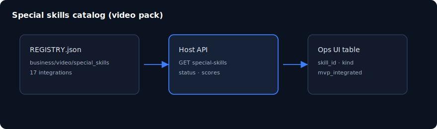

# Chapter 09: Special skills catalog

> **Status:** PLAN SCAFFOLD — detailed outline for full prose in `book/user_guide/`  
> **Level:** Intermediate  
> **Part:** Part III — Domains & video pack  
> **Est. time:** 40 min  
> **Final path:** `book/user_guide/chapters/09-special-skills-catalog.md`

## Illustration

*Figure: Special skills catalog — source `assets/09-special-skills.svg`*

## Learning objectives

- List 17 special skills from real REGISTRY, not demo rows
- Read skill status/score fields from API/UI
- Locate integration.json + SKILL.md on disk

## Narrative outline (to expand into full prose)

1. Why special skills exist (host MVP bind of pack capabilities)
2. REGISTRY.json schema and skill_count=17
3. API GET /domains/video/special-skills
4. UI SpecialSkillsPanel behavior (demo off)
5. Scorecard honesty (harsh scores vs inflated 100s)
6. What 'mvp_integrated' means vs production canary

## Hands-on labs

- [ ] Open Domains special skills table; count rows = 17
- [ ] Pick one skill_id; open business/video/special_skills/<id>/
- [ ] Call GET special-skills with token; compare ids

## Primary sources (do not invent beyond these without verifying)

- `business/video/special_skills/REGISTRY.json`
- `special_skill_impl_score.md`
- `backend/app/runtime.py list_video_special_skills`

## Writing checklist (for full draft)

- [ ] Open with 1-paragraph “why this matters”
- [ ] Step-by-step commands that work on Windows PowerShell and bash where possible
- [ ] At least one “Expected result” block per major lab
- [ ] Explicit residual / non-claim callouts where relevant
- [ ] Cross-links to previous/next chapter
- [ ] Embed final SVG from `book/user_guide/assets/` (copied from this plan)

## Navigation

- 繁體中文：[`09-special-skills-catalog_hk.md`](./09-special-skills-catalog_hk.md)

- TOC: [../TOC.md](../TOC.md)
- Master: [../user_guide.md](../user_guide.md)
- Plan: [../../../planning/user_guide/00_PLAN.md](../../../planning/user_guide/00_PLAN.md)
