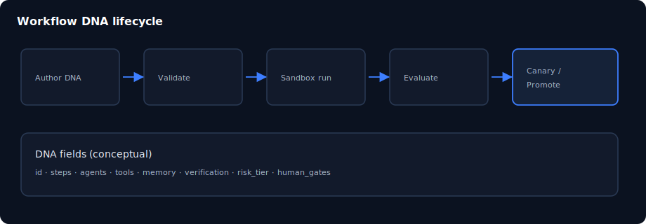

# 第 10 章：工作流 DNA 深入

> **語言：** 繁體中文（`_hk`）  
> **狀態：** 骨架於 `book/user_guide/` — 請在此擴寫完整內文  
> **程度：** 中級 → 進階  
> **部：** 第 III 部 — 領域與 video pack  
> **預估時間：** 60 分鐘  
> **路徑：** `book/user_guide/chapters/10-workflow-dna-deep-dive_hk.md`  
> **英文對照：** [`10-workflow-dna-deep-dive.md`](./10-workflow-dna-deep-dive.md)

## 插圖

*圖：工作流 DNA 深入 — 來源 `assets/10-workflow-dna.svg`*

## 學習目標

- 讀懂 .dna.json 主要欄位
- 描述 sandbox → evaluate → canary → promote
- 定位 viral-hook 與 onboarding DNA

## 敘事大綱（擴寫為完整正文）

1. DNA 是可執行流程圖（非自由聊天）
2. 步驟結構：agent、tools、action_type、memory、verification
3. 人工閘門與風險中繼資料
4. 版本與 promote 規則
5. 驗證命令 business:validate / evolution checks
6. 上線前作者檢查清單

## 實作實驗

- [ ] 比對兩份 DNA（onboarding vs viral-hook）
- [ ] 執行可用的 DNA 驗證測試
- [ ] 在紙上草擬 3 步玩具 DNA

## 主要來源（未驗證前勿臆造）

- `docs/workflow-dna.md`
- `rules/100-evolution-sandbox.md`
- `business/video/workflows/`

## 撰寫檢查清單（完整稿）

- [ ] 開場一段說明「為何重要」
- [ ] 步驟指令以 Windows PowerShell 為主，必要時附 bash
- [ ] 每個主要實驗含「預期結果」
- [ ] 相關處標明殘留／未宣稱
- [ ] 交叉連結上一章／下一章（`*_hk.md`）
- [ ] SVG 使用 `../assets/`（與英文版共用圖檔）
- [ ] 術語與英文版一致；產品識別碼（dna_id、API 路徑）不翻譯

## 導覽

- 目錄：[../TOC_hk.md](../TOC_hk.md)
- 主檔：[../user_guide_hk.md](../user_guide_hk.md)
- 英文主檔：[../user_guide.md](../user_guide.md)
- 計畫：[../../../planning/user_guide/00_PLAN.md](../../../planning/user_guide/00_PLAN.md)
