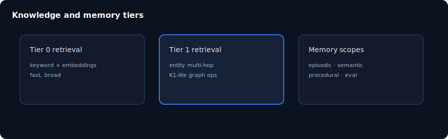

# Chapter 11: Knowledge and memory

> **Status:** PLAN SCAFFOLD — detailed outline for full prose in `book/user_guide/`  
> **Level:** Advanced  
> **Part:** Part IV — Intelligence & improvement  
> **Est. time:** 50 min  
> **Final path:** `book/user_guide/chapters/11-knowledge-and-memory.md`

## Illustration

*Figure: Knowledge and memory — source `assets/11-knowledge-memory.svg`*

## Learning objectives

- Choose Tier 0 vs Tier 1 retrieval for a query
- Browse knowledge and memory surfaces in UI
- Explain provenance and retention concerns

## Narrative outline (to expand into full prose)

1. Tiered retrieval policy
2. K1-lite graph operators and federation export
3. Memory scopes: episodic, semantic, procedural, evaluation
4. UI /app/knowledge and /app/memory
5. APIs knowledge search / graph / federate
6. Provenance and retention policy links

## Hands-on labs

- [ ] Run a knowledge search from UI or API
- [ ] Inspect business/knowledge-base structure
- [ ] Read retrieval-tier-policy.md

## Primary sources (do not invent beyond these without verifying)

- `docs/knowledge-memory.md`
- `business/knowledge-base/`
- `docs/self-improvement-and-orchestration.md`

## Writing checklist (for full draft)

- [ ] Open with 1-paragraph “why this matters”
- [ ] Step-by-step commands that work on Windows PowerShell and bash where possible
- [ ] At least one “Expected result” block per major lab
- [ ] Explicit residual / non-claim callouts where relevant
- [ ] Cross-links to previous/next chapter
- [ ] Embed final SVG from `book/user_guide/assets/` (copied from this plan)

## Navigation

- 繁體中文：[`11-knowledge-and-memory_hk.md`](./11-knowledge-and-memory_hk.md)

- TOC: [../TOC.md](../TOC.md)
- Master: [../user_guide.md](../user_guide.md)
- Plan: [../../../planning/user_guide/00_PLAN.md](../../../planning/user_guide/00_PLAN.md)
