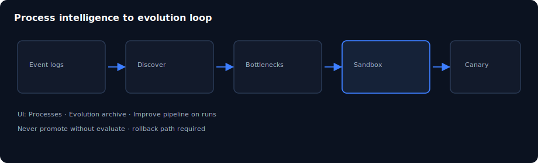

# Chapter 12: Process intelligence

> **Status:** PLAN SCAFFOLD — detailed outline for full prose in `book/user_guide/`  
> **Level:** Advanced  
> **Part:** Part IV — Intelligence & improvement  
> **Est. time:** 45 min  
> **Final path:** `book/user_guide/chapters/12-process-intelligence.md`

## Illustration

*Figure: Process intelligence — source `assets/12-pi-evolution.svg`*

## Learning objectives

- Ingest or view process intelligence artifacts
- Read discovered process, conformance, bottlenecks
- Connect PI findings to improvement hypotheses

## Narrative outline (to expand into full prose)

1. Why PI exists (mine reality, not assumed process)
2. Artifact locations under business/process-intelligence/
3. UI Processes surface
4. APIs under /processes
5. From bottleneck to sandbox variant proposal

## Hands-on labs

- [ ] Open Processes page; note available summaries
- [ ] Inspect a PI JSON artifact on disk
- [ ] Write one causal hypothesis from a bottleneck

## Primary sources (do not invent beyond these without verifying)

- `docs/process-intelligence.md`
- `business/process-intelligence/`
- `rules/80-process-intelligence.md`

## Writing checklist (for full draft)

- [ ] Open with 1-paragraph “why this matters”
- [ ] Step-by-step commands that work on Windows PowerShell and bash where possible
- [ ] At least one “Expected result” block per major lab
- [ ] Explicit residual / non-claim callouts where relevant
- [ ] Cross-links to previous/next chapter
- [ ] Embed final SVG from `book/user_guide/assets/` (copied from this plan)

## Navigation

- 繁體中文：[`12-process-intelligence_hk.md`](./12-process-intelligence_hk.md)

- TOC: [../TOC.md](../TOC.md)
- Master: [../user_guide.md](../user_guide.md)
- Plan: [../../../planning/user_guide/00_PLAN.md](../../../planning/user_guide/00_PLAN.md)
