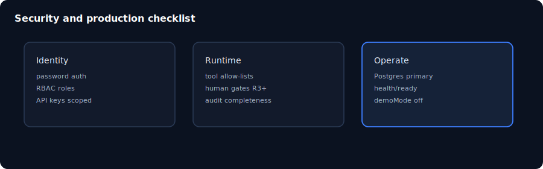

# 第 18 章：安全、營運與疑難排解

> **語言：** 繁體中文（`_hk`）  
> **狀態：** 骨架於 `book/user_guide/` — 請在此擴寫完整內文  
> **程度：** 專家  
> **部：** 第 V 部 — 專家與生產  
> **預估時間：** 60 分鐘  
> **路徑：** `book/user_guide/chapters/18-security-ops-troubleshooting_hk.md`  
> **英文對照：** [`18-security-ops-troubleshooting.md`](./18-security-ops-troubleshooting.md)

## 插圖

*圖：安全、營運與疑難排解 — 來源 `assets/15-security-production.svg`*

## 學習目標

- 套用生產就緒檢查清單
- 診斷常見開機與執行失敗
- 套用 agentic 安全基本（工具濫用、提示注入意識）

## 敘事大綱（擴寫為完整正文）

1. 種子密碼以外的認證強化
2. Secrets、CORS、安全標頭
3. Postgres runbook 要點
4. Doctor / security 腳本
5. 疑難矩陣（症狀 → 檢查）
6. 事件：核准繞過嘗試

## 實作實驗

- [ ] 跑 npm run doctor 並記錄輸出
- [ ] 用錯誤 DATABASE_URL 弄壞 ready 再恢復
- [ ] 精讀 rules/110-agentic-security.md 重點

## 主要來源（未驗證前勿臆造）

- `docs/security.md`
- `docs/troubleshooting.md`
- `backend/docs/postgres-runbook.md`
- `rules/30-security.md`
- `rules/110-agentic-security.md`

## 撰寫檢查清單（完整稿）

- [ ] 開場一段說明「為何重要」
- [ ] 步驟指令以 Windows PowerShell 為主，必要時附 bash
- [ ] 每個主要實驗含「預期結果」
- [ ] 相關處標明殘留／未宣稱
- [ ] 交叉連結上一章／下一章（`*_hk.md`）
- [ ] SVG 使用 `../assets/`（與英文版共用圖檔）
- [ ] 術語與英文版一致；產品識別碼（dna_id、API 路徑）不翻譯

## 導覽

- 目錄：[../TOC_hk.md](../TOC_hk.md)
- 主檔：[../user_guide_hk.md](../user_guide_hk.md)
- 英文主檔：[../user_guide.md](../user_guide.md)
- 計畫：[../../../planning/user_guide/00_PLAN.md](../../../planning/user_guide/00_PLAN.md)
