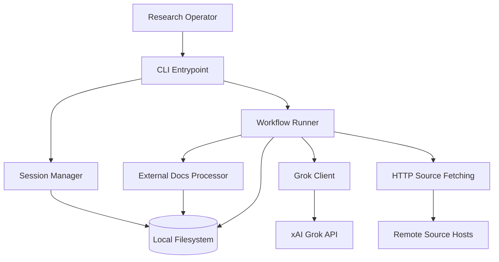
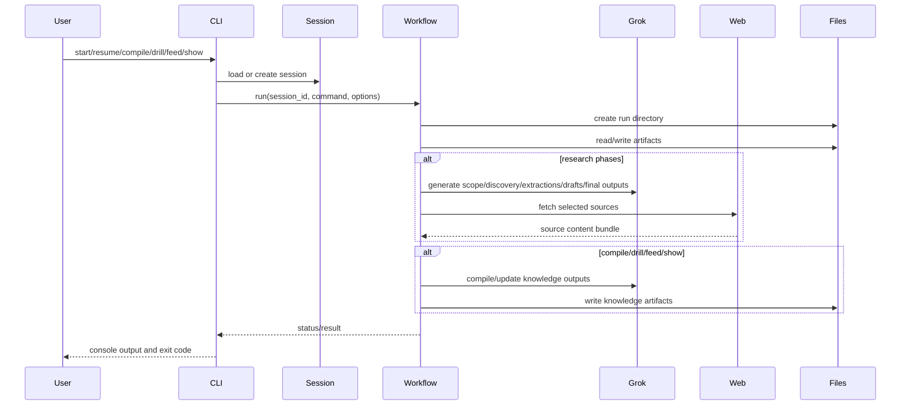

# CitationAgent

> **Self-contained agent definition** for host `generic-swarm-ops`. Body text is embedded from in-pack corpus and va-agent-swarm when available. Do not require external repos to understand this agent.

## Identity

| Field | Value |
|-------|-------|
| **va_id** | 70 |
| **pack_id** | `video.citation` |
| **category** | `9-Meta` |
| **domain_id** | `video` |
| **folder** | `business/video/agents/video.citation/` |

## Category roster section (full, from agents.md)

_The following is the complete category section from the master roster (includes peers in the same craft category)._


## 9. Specialist Meta-Agents

### 9.1 Orchestration Agents

| # | Agent | Responsibility | Knowledge Distillation Source | Self-Quality Criteria | Surpass-Human Signal | Accepts Critique From | Comments On | Tool Access | Architecture Pattern |
|---|---|---|---|---|---|---|---|---|---|
| 53 | **OrchestratorAgent** | Runs CrewAI/AutoGen/LangGraph DAG; retries, timeouts, fan-out/fan-in | LangGraph + CrewAI + AutoGen patterns; Airflow/Temporal; PGA schedule templates | DAG completion ≥99.5%; SLA adherence; deadlock = 0 | Lower TTD than human EP at same scope | ProducerAgent (scope), JudgeAgent (dispute), HiTL on stall | All agents (resource burn, retry storms) | LangGraph state machine; Temporal workflow engine; Redis (distributed locks); observability (LangSmith) | Agentic Graph (LangGraph) — deterministic DAG execution |
| 54 | **PlannerAgent** | Decomposes brief into phased DAG with assignments + critic gates | PMBOK; CrewAI task graphs; phase templates | Plan validity (no missing gate); cost variance <10% | Tighter, cheaper plans than EP first pass (blind A/B) | ProducerAgent, FinanceAgent (budget) | RouterAgent (wrong pick), OrchestratorAgent | LangGraph plan-gen; cost-estimation models; Gantt/PERT tools | ReAct (decompose → estimate → validate → emit DAG) |
| 55 | **RouterAgent** | Picks right specialist agent (and model) for each subtask | Agent-capability registry; benchmark history (cost/quality/latency) | Routing accuracy ≥95% vs oracle; cost within budget | Beats human producer in agent/vendor selection | OrchestratorAgent, CostOptimizerAgent | PlannerAgent (bad decomposition) | Agent registry DB; benchmark leaderboard cache; pricing APIs | Classifier + ReAct (match task embedding → agent capability) |
| 56 | **JudgeAgent** | Adjudicates disputes via multi-agent debate; scores against rubric | Du 2023 (LLM debate); MT-Bench rubrics; guild scoring sheets | Inter-rater κ vs expert panel ≥0.8 | Higher κ than median human juror | HiTL on overturned rulings | DirectorAgent, ScreenwriterAgent, any disputing pair | MT-Bench/Arena evaluation harness; rubric template engine | Multi-agent debate (Du 2023) + LLM-as-Judge (Zheng 2023) |
| 57 | **GateKeeperAgent** | Phase transitions; verifies L1/L2/L3 criteria; signs C2PA | Stage-gate methodology; PGA Producers Mark; QMS audit | Zero leaked defects; sign-off SLA ≥99% | Lower escaped-defect rate than human QA lead | ComplianceAgent, AIQAConsistencyAgent | OrchestratorAgent (premature advance) | C2PA signing (c2patool); JSON schema validators; rubric evaluation endpoints | Constitutional AI (constitution = phase-gate criteria) |
| 58 | **MemoryAgent** | Episodic + long-term project memory; retrieval for any agent | Reflexion (Shinn 2023); MemGPT; vector-DB best practices | Retrieval precision@5 ≥0.9; freshness SLA | Higher recall than producer's bible at scale | All agents (correction events) | All agents (stale facts) | Pinecone/Weaviate/Qdrant vector DB; MemGPT-style hierarchical memory; embedding models | Reflexion memory architecture (MemGPT extension) |

### 9.2 Creative Agents

| # | Agent | Responsibility | Knowledge Distillation Source | Self-Quality Criteria | Surpass-Human Signal | Accepts Critique From | Comments On | Tool Access | Architecture Pattern |
|---|---|---|---|---|---|---|---|---|---|
| 59 | **IdeationAgent** | Divergent brainstorm of concepts, hooks, taglines | Cannes Grand Prix; D&AD; IDEO design-thinking; SCAMPER/de Bono | Idea-count; novelty (embedding distance); semantic diversity | Wins agency-pitch shootouts on concept density | CreativeDirectorAgent, NoveltyAgent | CopywriterAgent (derivative), DirectorAgent (unfilmable) | Embedding novelty scorer; concept clustering (UMAP); Are.na/Pinterest search | Self-Refine + NoveltyAgent as critic |
| 60 | **NarrativeArcAgent** | 3-act / Save-the-Cat / Hero's Journey structure | Campbell; Snyder *Save the Cat*; Truby; Black List analyses | Beat-sheet coverage 100%; turning-point spacing; arc curve fit | Beats WGA first drafts on structural rubric | ScreenwriterAgent, DirectorAgent | ScreenwriterAgent (sagging middle) | Beat-sheet validator; emotional-arc plotter; structure templates | Self-Refine (rubric: beat-sheet completeness) |
| 61 | **StyleTransferAgent** | Applies named aesthetic consistently across shots | Curated style corpora; LoRA/seed registries; reference-frame banks | Style-similarity (CLIP/DINO) ≥0.85; cross-shot variance ≤τ | Wins blind preference vs human colorist+grader | DirectorAgent, ColoristAgent | GeneratorAgent (off-style) | LoRA weights per style; CLIP/DINO similarity scorer; Runway style-lock mode; ComfyUI | Self-Refine (CLIP style score as feedback) |
| 62 | **WorldBuildingAgent** | Lore, rules, geography, factions, magic/tech systems | Tolkien; *Worldbuilding* (Adams); fan-wikis; series-bible leaks | Internal-consistency (no contradictions); rule-completeness | Lower contradiction rate than writers' bibles at 10× volume | ShowrunnerAgent, FactCheckerAgent | ScreenwriterAgent (lore break), ConceptArtistAgent | Long-context LLM (Gemini 2.5 Pro); contradiction-detection model; wiki-graph DB | Reflexion (contradiction corrections → episodic memory) |
| 63 | **MoodBoardAgent** | Reference boards: visual, sonic, tonal | Pinterest/Are.na; lookbook archives; Spotify-Canvas | Reference coherence (cluster tightness); brief alignment | Faster + tighter boards than art director (blind A/B) | DirectorAgent, ProductionDesignAgent | ConceptArtistAgent (off-mood) | Pinterest/Are.na APIs; Spotify Canvas; CLIP clustering; Figma board generation | ReAct (search → cluster → layout → validate coherence) |
| 64 | **NoveltyAgent / Anti-Cliché Critic** | Flags tropes, clichés, over-fit outputs | TV Tropes; OpenSubtitles n-gram freq; corpus-novelty embeddings | Cliché-hit count; novelty score vs category prior | Catches more clichés than experienced script editor | IdeationAgent, ScreenwriterAgent | ScreenwriterAgent (trope-stuffed), CopywriterAgent (templated) | TV Tropes scraper; n-gram frequency DB; embedding novelty scorer | LLM-as-Judge (anti-cliché constitution) |
| 65 | **EmotionalArcAgent** | Maps valence/arousal curve; suggests beats | Plutchik; affective-computing corpora; Cron *Story Genius* | Curve-fit to target; biosignal-proxy regression accuracy | Better retention prediction than NRG test-screening cards | DirectorAgent, EditorAgent, ComposerAgent | EditorAgent (flat middle), ComposerAgent (cue mismatch) | Sentiment/emotion classifiers (GoEmotions); retention-curve predictor; biosignal proxy model | Self-Refine (emotional-arc curve as rubric target) |

### 9.3 Research Agents

| # | Agent | Responsibility | Knowledge Distillation Source | Self-Quality Criteria | Surpass-Human Signal | Accepts Critique From | Comments On | Tool Access | Architecture Pattern |
|---|---|---|---|---|---|---|---|---|---|
| 66 | **WebResearchAgent** | Live web search, source ranking, citation extraction | Bing/Google/Brave APIs; Common Crawl; Perplexity patterns | Source-grade per claim; citation precision; recency hit | Faster + more sources than newsroom researcher | FactCheckerAgent, CitationAgent | ScriptwriterAgent (uncited claim) | Brave/Google Search API; Jina Reader (web→markdown); source-quality classifier | ReAct (query → fetch → extract → grade → cite) |
| 67 | **ArchiveResearchAgent** | Historical / academic / archival deep search | JSTOR, arXiv, PubMed, AP Archive, Getty, FOIA | Primary-source ratio; archive-coverage breadth | Higher primary-source ratio than doc producer | FactCheckerAgent, SMEAgent | ScriptwriterAgent (secondary-source reliance) | JSTOR/arXiv/PubMed APIs; Getty Images API; FOIA request tools; OCR (Tesseract) | ReAct (formulate query → search archive → extract → grade source) |
| 68 | **TrendIntelligenceAgent** | Detects emerging memes, sounds, formats | TikTok Creative Center; Trendpop; Tubular; Reddit/X firehose | Prediction lead time vs peak; precision/recall on trend list | Earlier detection than human strategists at higher precision | SocialStrategistAgent, CopywriterAgent | IdeationAgent (off-trend) | TikTok Creative Center API; Reddit/X streaming APIs; Sensor Tower; Google Trends | ReAct + time-series anomaly detection |
| 69 | **CompetitorIntelligenceAgent** | What competitors are shipping | Meta Ad Library; TikTok Top Ads; YouTube scrape; release trackers | Coverage % of competitor set; our-novelty vs landscape | More comprehensive than agency strategy decks | BrandAgent, CreativeDirectorAgent | IdeationAgent (derivative) | Meta Ad Library API; TikTok Top Ads; SimilarWeb; YouTube Data API v3 | ReAct (scrape competitor → classify → report gaps) |
| 70 | **CitationAgent** | Normalizes sources; grades primary/secondary/tertiary | Chicago, APA, AP style; SPJ grading; CRAAP test | Citation format 100% valid; primary % ≥target | Lower error rate than newsroom copy desk | FactCheckerAgent, JournalistAgent | WebResearchAgent (weak source) | Citation parsers (AnyStyle); DOI resolver; CRAAP scoring model | Self-Refine (format validator + source grader as rubric) |
| 71 | **InterviewSynthesisAgent** | Synthesizes practitioner interviews into data | Otter/Rev transcripts; consent forms; SAG/WGA templates | Inter-coder agreement on themes; consent integrity | Faster + richer theme extraction than qualitative researcher | ResearchPIAgent (HiTL), ComplianceAgent | SMEAgent (mis-summarized expert) | Otter.ai/Rev API (transcription); thematic coding models; consent-management DB | Reflexion (interviewer refines questions based on theme gaps) |
| 72 | **BenchmarkResearchAgent** | Monitors VBench, EvalCrafter, MT-Bench, FVD, CLIP-T leaderboards | Papers-with-Code; HuggingFace leaderboards; conference proceedings | Coverage of benchmarks; freshness ≤7 days | Faster + broader than ML-research team | OptimizationAgents (any) | All AI agents (stale baselines) | Papers-with-Code API; HuggingFace Hub API; arXiv RSS; VBench leaderboard scraper | ReAct (poll leaderboards → detect change → alert) |

### 9.4 Optimization Agents

| # | Agent | Responsibility | Knowledge Distillation Source | Self-Quality Criteria | Surpass-Human Signal | Accepts Critique From | Comments On | Tool Access | Architecture Pattern |
|---|---|---|---|---|---|---|---|---|---|
| 73 | **PromptOptimizerAgent** | Auto-improves prompts via OPRO/APE/DSPy/Promptbreeder | OPRO (Yang 2023); APE (Zhou 2022); DSPy (Stanford); Promptbreeder (DeepMind) | Score uplift per iteration; convergence speed | Beats hand-tuned prompts on held-out briefs | PromptEngineerAgent, AIQAAgent | PromptEngineerAgent (sub-optimal seed) | DSPy framework (MIPRO optimizer); OPRO implementation; held-out eval harness | DSPy compilation + OPRO meta-optimization |
| 74 | **CostOptimizerAgent** | Routes between models/providers for $/quality | Provider pricing; cost-quality frontiers; FrugalGPT patterns | $/successful-task; Pareto distance from frontier | Lower $/quality than human CFO routing | RouterAgent, FinanceAgent | RouterAgent (over-spend), GeneratorAgent (re-roll burn) | Provider pricing APIs; benchmark cost DB; FrugalGPT cascade logic | ReAct (evaluate task → pick cheapest model meeting threshold) |
| 75 | **LatencyOptimizerAgent** | Parallelization, caching, speculative decoding, batching | vLLM; TensorRT-LLM; distillation; Anyscale/Ray | p50/p95 latency; throughput/GPU-hour | Lower p95 than human-tuned pipeline | OrchestratorAgent | OrchestratorAgent (serial bottleneck) | vLLM; TensorRT-LLM; Ray Serve; Redis (response cache); speculative decoding configs | Tool-use profiling + automated pipeline restructuring |
| 76 | **RetentionOptimizerAgent** | Tunes hook, pacing, structure for AVD/hold-rate | YouTube Analytics benchmarks; TikTok retention curves; AudienceSim | Predicted retention vs actual; AVD lift over control | Beats senior YouTube editor on AVD lift (A/B) | EditorAgent, AudienceSimAgent | EditorAgent (slow opener), ScriptwriterAgent (front fluff) | YouTube Analytics API; retention-curve predictor model; A/B test framework | RLAIF (reward = retention uplift from real analytics) |
| 77 | **ROASOptimizerAgent** | Optimizes ad creatives for performance | Meta Marketing Science; TikTok Ads Academy; MMM/MTA lit | ROAS uplift vs control; significance ≥95% | Beats senior marketer at equal budget | PerformanceMarketerAgent, AnalystAgent | UGCAgent (low hook), CopywriterAgent (weak CTA) | Meta Ads API (creative testing); TikTok Ads; Bayesian MMM tools (Robyn/Meridian) | RLAIF (reward = real ROAS from ad platform feedback) |
| 78 | **AccessibilityOptimizerAgent** | WCAG 2.2 contrast, captions, audio description, color-blind safe | WCAG 2.2; W3C/WAI-ARIA; DCMP captioning key; Deaf/HoH guidelines | Conformance 100% AA, ≥90% AAA; caption WER ≤2% | Catches more a11y defects than ADA-certified auditor | AccessibilityAgent (HiTL), ComplianceAgent | EditorAgent (caption sync), ColoristAgent (contrast) | axe-core/Lighthouse (contrast); Whisper v4 (captioning); audio-description generator | Constitutional AI (constitution = WCAG 2.2 success criteria) |
| 79 | **EvaluationHarnessAgent** | Runs benchmarks (VBench, EvalCrafter, MT-Bench, FVD, CLIP-T); posts regressions | Papers-with-Code; HuggingFace leaderboards; benchmark repos | Regression precision/recall; alert latency <1h | Catches regressions faster than ML-eng rotation | BenchmarkResearchAgent | All AI agents (regression alerts) | VBench suite; EvalCrafter; MT-Bench harness; CI/CD (GitHub Actions); alerting (PagerDuty) | Tool-use / ReAct (run benchmark → compare → alert if regressed) |
| 80 | **SafetyRedTeamAgent** | Adversarially attacks for deepfake, bias, jailbreak, defamation | Hany Farid benchmarks; Partnership on AI Framework; OWASP LLM Top 10 | Attack-success kept ≤1%; taxonomy coverage | Higher coverage than internal red-team rotation | EthicsAgent (HiTL), ComplianceAgent | AvatarDesignAgent, VoiceCloneAgent, AllGenerators | Deepfake detectors (Farid lab models); bias probes; jailbreak prompt banks; OWASP scanner | Multi-agent debate (red-team vs defender) + adversarial search |

---


## Responsibility

Normalizes sources; grades primary/secondary/tertiary

## Knowledge distillation sources

Chicago, APA, AP style; SPJ grading; CRAAP test

## Self-quality criteria

Citation format 100% valid; primary % ≥target

## Surpass-human signal

Lower error rate than newsroom copy desk

## Critique bus

- **Accepts critique from:** FactCheckerAgent, JournalistAgent

- **Comments on:** WebResearchAgent (weak source)

## Tools (design-time documentation)

Citation parsers (AnyStyle); DOI resolver; CRAAP scoring model

**Runtime safety:** Host allow-lists are only `agent_spec.json` + `tool-permission-register.json`. CI uses video_* stubs. Do not treat design-time vendor names as enabled APIs.

## Architecture pattern

Self-Refine (format validator + source grader as rubric)

## Common structure of an AI agent (full §11 from agents.md)

## 11. Common Structure of an AI Agent

Every agent — regardless of category — implements this skeleton. Derived from the source document's architecture patterns (§1), critique protocol (§6), and universal success-criteria framework (§5), enriched with current (2026) tooling research.

### 11.1 Architecture Diagram

The diagram below presents the common agent as a professional operating architecture rather than a simple component sketch. It shows how **orchestration**, the **input contract**, **knowledge and tool surfaces**, the internal **plan → act → self-review** loop, **traceability and provenance controls**, the **3-layer quality gate** (Spec → Rubric → Preference), **release packaging**, **peer critique**, **human escalation**, and **continuous improvement** work together as one governed system.


> **Tip:** view the diagram fullscreen on GitHub by clicking it, or download [`common-agent-structure.svg`](./common-agent-structure.svg) directly. The SVG is designed as a presentation-grade reference for architecture reviews and implementation planning.

### 11.2 Component Reference Table

| # | Component | Purpose | Mechanism / Implementation Notes |
|---|---|---|---|
| 1 | **Identity** | Stable unique handle for routing, logging, provenance | Kebab-case ID + semantic version (e.g. `director-agent@2.1.0`). Registered in the agent-capability registry used by RouterAgent. |
| 2 | **Responsibility (Scope)** | Single-sentence definition of what the agent owns | Mirrors a human craft role. Prevents scope overlap via explicit boundary documented in the registry. |
| 3 | **Knowledge Distillation Source** | Licensed/consented corpora the agent is trained or RAG-grounded on | Award archives, academic papers, expert interviews, peer-reviewed journals. Refreshed via Continuous Distillation Loop (§7 of source). |
| 4 | **Tool Access** | External APIs, generators, validators, DCC bridges | Video gen: Sora 2, Veo 3.1 (Gemini API), Runway Gen-4/Aleph, Kling 3.0. Voice: ElevenLabs v3, Sync.so, HeyGen. DCC: Resolve/Nuke/AE via MCP bridges. All accessed via MCP (Model Context Protocol, Anthropic 2024). |
| 5 | **Architecture Pattern** | Reasoning/learning loop powering the agent | One or more of: Self-Refine [1], Reflexion [2], RLAIF/Constitutional AI [3], Multi-agent debate [4], LLM-as-Judge [5], Pairwise preference (Arena) [5], ReAct [6], Agentic Graph (LangGraph/CrewAI/AutoGen) [7], DSPy/OPRO prompt optimization [8]. |
| 6 | **Memory** | Episodic + long-term project memory | Vector DB (Pinecone/Weaviate/Qdrant) accessed via MemoryAgent. Implements MemGPT-style hierarchical memory with summarization and eviction. Reflexion agents store verbal self-feedback here. |
| 7 | **Constitution / Rubric** | Written, role-specific scoring guide for self-check | Examples: Murch's Rule of Six (Editor), 12 Principles (Animator), Save-the-Cat beats (Screenwriter), WCAG 2.2 (Accessibility), FAA Part 107 (Drone), SAG-AFTRA AI rider (Consent). Used as the "constitution" in Constitutional AI pattern. |
| 8 | **Self-Quality: L1 Spec** | Did the output meet the structured brief? | JSON schema validation + tool validators (codec, LUFS, aspect ratio, frame count, file format). Must pass 100%. |
| 9 | **Self-Quality: L2 Rubric** | Does it meet craft rubric for this role? | LLM-as-Judge (Zheng 2023) with role-specific constitution. Must score ≥85/100. Up to 3 Self-Refine iterations if below threshold. |
| 10 | **Self-Quality: L3 Preference** | Would target audience choose this over human baseline? | Pairwise comparison: AudienceSim panel (≥200 simulated personas + ≥20 HiTL samples). Win rate ≥50% (parity) or ≥55% (surpass). |
| 11 | **Surpass-Human Signal** | Pre-registered proof the agent exceeds a credentialed professional | Benchmark dominance; blind Arena preference ≥55%; speed × quality (equal L2 at ≤10% turnaround); lower 90-day defect rate; certification pass; higher novelty at equal quality. |
| 12 | **Critique Inbox** | Channel for receiving structured feedback from peers | Shared `CritiqueMessage` JSON bus. Severities: blocker (halts DAG), major (Self-Refine ≤3 iters), minor/nit (logged for RLAIF). Disputes → JudgeAgent multi-agent debate → HiTL if unresolved. |
| 13 | **Critique Outbox** | Peer agents whose work this agent is qualified to review | Defined per-agent in roster. Messages emitted on same bus. Evidence-backed, rubric-referenced, appended to C2PA provenance. |
| 14 | **HiTL Escalation** | When a human must be brought in | Consent (SAG-AFTRA AI rider, EU AI Act Art. 50); final legal sign-off; MPA rating; festival eligibility; crisis comms; cross-cultural sensitivity. |
| 15 | **Provenance (C2PA)** | Cryptographic signing of every artifact | Every emitted artifact signed with C2PA (c2patool). Downstream agents verify chain. Accepted critiques appended to manifest. Platforms (YouTube, TikTok, Meta) auto-label based on C2PA presence. |
| 16 | **Continuous Learning** | How the agent keeps improving post-deployment | Bootstrap (licensed corpora) → Expert interviews (paid, consented) → Live RLAIF (DPO/KTO) → Award-rubric grounding → Adversarial red-team → 30/60/90-day reality check (retention, ROAS, awards). |
| 17 | **Orchestration Integration** | How the agent fits the multi-agent graph | Registered as a node in LangGraph/CrewAI/AutoGen DAG. OrchestratorAgent schedules; PlannerAgent assigns; RouterAgent selects model/provider; GateKeeperAgent verifies L1-L3 before advancing. |

### CritiqueMessage Schema (Universal)

```json
{
  "critique_id": "uuid",
  "from_agent": "EditorAgent",
  "to_agent": "DirectorAgent",
  "artifact_ref": "shot_42_take_3.mp4",
  "severity": "blocker | major | minor | nit",
  "category": "pacing | continuity | accuracy | compliance | accessibility | brand | craft",
  "evidence": ["timecode 00:01:14 — held 1.4s past cut point per genre prior"],
  "suggested_action": "trim 1.0s; re-evaluate hold",
  "rubric_reference": "Murch Rule of Six §3",
  "must_resolve_before": "phase_4_review"
}
```

### Composition Diagram

```text
[Brief] ──► PlannerAgent ──► OrchestratorAgent ──► RouterAgent ──► (52 craft agents §1–§8)
                 ▲                  │                                       │
                 │                  ▼                                       ▼
             MemoryAgent      GateKeeperAgent ◄─── JudgeAgent ◄──── CritiqueMessages
                                    ▲                                       ▲
                                    │                                       │
            [Creative meta:] IdeationAgent · NarrativeArcAgent · StyleTransferAgent · MoodBoardAgent · NoveltyAgent · EmotionalArcAgent
            [Research meta:] WebResearchAgent · ArchiveResearchAgent · TrendIntelAgent · CompetitorIntelAgent · CitationAgent · InterviewSynthAgent · BenchmarkResearchAgent
            [Optimization meta:] PromptOptimizerAgent · CostOptimizer · LatencyOptimizer · RetentionOptimizer · ROASOptimizer · AccessibilityOptimizer · EvalHarnessAgent · SafetyRedTeamAgent
```

---

## Shared references (from agents.md §12)

## 12. References

### Foundational Papers (Architecture Patterns)

| Ref | Paper | Key Contribution | Link |
|---|---|---|---|
| [1] | Madaan et al., "Self-Refine: Iterative Refinement with Self-Feedback," NeurIPS 2023 | Agent drafts → self-critiques against rubric → revises iteratively without weight updates | [arXiv:2303.17651](https://arxiv.org/abs/2303.17651) |
| [2] | Shinn et al., "Reflexion: Language Agents with Verbal Reinforcement Learning," NeurIPS 2023 | Verbal self-reflection stored in episodic memory buffer to improve decisions in subsequent trials | [arXiv:2303.11366](https://arxiv.org/abs/2303.11366) |
| [3] | Bai et al., "Constitutional AI: Harmlessness from AI Feedback," 2022 | Reward signal from AI critic governed by a written constitution; RLAIF without human labels | [arXiv:2212.08073](https://arxiv.org/abs/2212.08073) |
| [4] | Du et al., "Improving Factuality and Reasoning in Language Models through Multiagent Debate," 2023 | Multiple LLM agents debate; improves factuality and reasoning across tasks | [arXiv:2305.14325](https://arxiv.org/abs/2305.14325) |
| [5] | Zheng et al., "Judging LLM-as-a-Judge with MT-Bench and Chatbot Arena," NeurIPS 2023 | GPT-4 judge achieves >80% agreement with human preferences; scalable evaluation | [arXiv:2306.05685](https://arxiv.org/abs/2306.05685) |
| [6] | Yao et al., "ReAct: Synergizing Reasoning and Acting in Language Models," ICLR 2023 | Interleaving reasoning traces with tool-use actions for grounded decision-making | [arXiv:2210.03629](https://arxiv.org/abs/2210.03629) |
| [7] | LangGraph / CrewAI / AutoGen (2024–2026) | Agentic graph orchestration: DAG with state, handoffs, review gates, human-in-the-loop | [LangGraph](https://github.com/langchain-ai/langgraph), [CrewAI](https://github.com/crewAIInc/crewAI), [AutoGen](https://github.com/microsoft/autogen) |
| [8] | Yang et al., "Large Language Models as Optimizers" (OPRO), 2023; Khattab et al., DSPy (Stanford, 2023–2026) | Meta-optimization of prompts using LLMs; DSPy compiles declarative LM programs into optimized pipelines | [OPRO arXiv:2309.03409](https://arxiv.org/abs/2309.03409), [DSPy](https://github.com/stanfordnlp/dspy) |

### Evaluation Benchmarks

| Benchmark | Scope | Link |
|---|---|---|
| VBench / VBench 2.0 | Video generation quality — 16 dimensions (temporal + frame-wise); VBench 2.0 adds Human Fidelity, Creativity, Physics | [arXiv:2311.17982](https://arxiv.org/abs/2311.17982), [VBench 2.0: arXiv:2503.21755](https://arxiv.org/abs/2503.21755) |
| EvalCrafter | Text-to-video — 18 metrics across visual, content, motion quality | [arXiv:2310.11440](https://arxiv.org/abs/2310.11440) |
| MT-Bench / Chatbot Arena | LLM output quality via pairwise human + LLM-judge evaluation | [arXiv:2306.05685](https://arxiv.org/abs/2306.05685) |

### Generative Video Models (Tool Access — 2026 landscape)

| Model | Provider | Key Capabilities | Access |
|---|---|---|---|
| Sora 2 / Sora 2 Pro | OpenAI | Synchronized dialogue + SFX + background audio; cinematic/realistic/anime styles; 1080p 20s | [OpenAI Videos API](https://developers.openai.com/api/docs/models/sora-2) (discontinuing Sept 2026) |
| Veo 3.1 | Google DeepMind | 4K / 1080p / 720p, 8s; native audio; configurable 16:9 & 9:16; multi-image reference for character/object direction | [Gemini API](https://ai.google.dev/gemini-api/docs/video) / [Vertex AI](https://docs.cloud.google.com/vertex-ai/generative-ai/docs/models/veo/3-1-generate) |
| Runway Gen-4 / Gen-4.5 / Aleph | Runway | ControlNet guides, camera paths, style-lock, Layout Sketch; Aleph for video-to-video editing | [Runway API](https://docs.dev.runwayml.com/) |
| Kling 3.0 | Kuaishou | Cinematic motion realism; physics accuracy; motion-control (reference video); native audio | [Kling API (fal.ai)](https://fal.ai/models/fal-ai/kling-video) |

### Voice & Avatar Tools (2026)

| Tool | Provider | Capabilities |
|---|---|---|
| ElevenLabs v3 | ElevenLabs | Expressive TTS; instant/professional voice cloning; dialogue mode (multi-speaker); Projects API for long-form; Sound FX generation | [Docs](https://elevenlabs.io/docs) |
| HeyGen Avatar IV | HeyGen | Photoreal AI avatars; 175+ languages lip-sync; ElevenLabs integration; personalization API | [HeyGen](https://www.heygen.com) |
| Synthesia | Synthesia | Enterprise AI avatars at scale; SCORM-compatible; brand-controlled | [Synthesia](https://www.synthesia.io) |
| Sync.so / Wav2Lip | Open-source + API | Lip-sync overlays; phoneme-viseme alignment | [Sync.so](https://sync.so) |

### Infrastructure Standards

| Standard | Purpose | Status (2026) |
|---|---|---|
| C2PA (Content Provenance) | Cryptographic manifest signing for every AI-generated artifact; platforms (YouTube, TikTok, Meta) auto-label | EU AI Act Code of Practice (March 2026) mandates C2PA + watermarking combined. Over 2,300 tools support. [contentauthenticity.org](https://contentauthenticity.org/blog/the-state-of-content-authenticity-in-2026) |
| MCP (Model Context Protocol) | Open standard for LLM ↔ tool integration; 2,300+ public servers; adopted by Claude, VS Code, Cursor, etc. | Donated to Agentic AI Foundation (Linux Foundation, Dec 2025) by Anthropic + OpenAI + Block. [modelcontextprotocol.io](https://modelcontextprotocol.io) |
| DSPy | Framework for programming (not prompting) LLMs; compiles declarative pipelines into optimized prompts/finetunes | Stanford-maintained; MIPRO optimizer; used by PromptOptimizerAgent for automated prompt improvement. [github.com/stanfordnlp/dspy](https://github.com/stanfordnlp/dspy) |

---

*Generated: May 2026. Source: [`ai_agent_video_production_workflow.md`](./ai_agent_video_production_workflow.md). Core layout restored from `agents_old.md`; missing workflow-support content merged into the same table-driven structure.*

## Deep specifications (full embedded content)


### Document: `study/research_agent_functional_specification.md`

_Embedded from `corpus/study/research_agent_functional_specification.md`. Also stored at `sources/study/research_agent_functional_specification.md` under this agent folder._


# Research Agent Functional Specification

## 1. Document Control

- Document title: `Research Agent Functional Specification`
- System name: `grok-research-agent`
- Document type: Current-state functional specification derived from implementation and tests
- Primary delivery model: Local Python CLI application
- Source of truth for this specification: `grok_research_agent/` package implementation, packaged prompts, and automated tests
- Specification intent: Describe the functional behavior the system currently implements, including workflow behavior, file contracts, validation rules, failure handling, and integration points

## 2. Purpose

The system provides a local-first research automation workflow that converts a user-supplied topic into a detailed Markdown research report through a staged pipeline of scope definition, source discovery, source curation, content extraction, notebook assembly, synthesis, optional full-source preservation, final polishing, knowledge compilation, drill-pack generation, image-prompt generation, and YouTube-script generation.

The system is designed to:

- preserve human control at key decision points;
- store all research artifacts locally in resumable session directories;
- use Grok through the xAI OpenAI-compatible API for all LLM generation tasks;
- support optional ingestion of external local documentation as steering context;
- produce inspectable intermediate artifacts rather than a single opaque result.

## 3. Scope

### 3.1 In Scope

- Command-line session lifecycle management
- Persistent session state and artifact storage
- Eight-phase research workflow orchestration
- Optional unattended execution mode
- External-document preprocessing for local steering material
- Knowledge-base compilation into hypergraph and core concepts
- Drill-pack generation from compiled concepts
- Hypergraph updates from newly fed documents
- Mermaid rendering of hypergraph data
- Image-prompt generation from final report content
- YouTube-script generation from final report or section drafts

### 3.2 Out of Scope

- Web UI, API server, or multi-user collaboration
- Authentication, authorization, and role-based permissions
- Database-backed persistence
- Semantic vector search or retrieval index
- Automatic browser automation or crawler orchestration beyond direct HTTP fetch
- Guaranteed factual validation of LLM outputs
- Binary document feeding in the `feed` command beyond best-effort text decoding

## 4. Stakeholders, Roles, and External Actors

### 4.1 Human User Roles

- `Research Operator`: Starts sessions, approves or revises workflow outputs, selects curated sources, optionally chooses full offline collection, and runs auxiliary commands
- `Reviewer/Study User`: Consumes generated report, drill pack, hypergraph, Mermaid output, image prompts, or YouTube script; this role is not technically distinct from the operator

### 4.2 System Actors

- `LLM Provider`: xAI Grok, accessed through the OpenAI-compatible API
- `Remote Content Hosts`: Public websites and PDF endpoints referenced by curated sources
- `Local Filesystem`: Stores sessions, state, outputs, external-doc artifacts, and knowledge-base artifacts
- `Local Environment`: Provides `.env` or environment variables, `EDITOR`, and Python runtime

### 4.3 Access Model

- The system implements no internal user accounts and no permission model.
- Any user who can execute the CLI and read/write the target sessions directory can operate the system fully.

## 5. System Context and Architecture

### 5.1 Core Modules

- `grok_research_agent.cli`
  - Parses CLI arguments
  - Creates `SessionManager` and `WorkflowRunner`
  - Maps command failures to process exit codes
- `grok_research_agent.session_manager`
  - Creates and persists session state
  - Creates unique run directories
  - Provides canonical session and knowledge-base paths
- `grok_research_agent.workflow_phases`
  - Implements the workflow state machine
  - Handles source fetching, extraction, synthesis, compilation, drill-pack generation, feed, show, image generation, and YouTube script generation
- `grok_research_agent.grok_client`
  - Loads environment configuration
  - Calls xAI Grok using the OpenAI client
  - Maps API exceptions into domain-specific runtime errors
- `grok_research_agent.external_docs`
  - Recursively ingests supported local docs
  - Extracts steering context, constraints, requirements, and relevance signals
- `grok_research_agent.prompts/*`
  - Defines output contracts and behavioral instructions for LLM calls

### 5.2 Execution Model

- The product is a single-process CLI application.
- Each command creates a new run directory under the target session.
- Commands operate on files in the session directory and may also write run-local copies for traceability.
- Long-lived state is file-based; there is no background daemon.

## 6. Technology and Runtime Dependencies

- Python runtime: `>=3.11`
- Required packages:
  - `openai`
  - `python-dotenv`
  - `rich`
  - `pydantic>=2`
  - `pypdf`
  - `python-docx`
  - `requests`
  - `beautifulsoup4`
  - `readability-lxml`
  - `chardet<6`
- Packaged CLI entrypoint: `grok-research-agent = grok_research_agent.cli:main`
- Convenience wrappers: root-level `main.py` and `cli.py` forward to packaged CLI entrypoint

## 7. Configuration Specification

### 7.1 Environment Variables

- `GROK_API_KEY`
  - Required for any command path that instantiates `GrokClient`
  - Must be non-empty after whitespace trimming
  - If absent, LLM-backed actions shall fail with a clear message
- `GROK_MODEL`
  - Optional
  - Defaults to `grok-3`
  - Blank values shall be normalized back to `grok-3`
- `GROK_MAX_OUTPUT_TOKENS`
  - Optional integer
  - Defaults to `50000`
  - Invalid or non-numeric values shall revert to `50000`
  - Values below `1` shall be clamped to `1`
- `GROK_REQUEST_TIMEOUT_SECONDS`
  - Optional integer
  - Defaults to `300`
  - Invalid or non-numeric values shall revert to `300`
  - Values below `1` shall be clamped to `1`
- `EDITOR`
  - Optional
  - Used only during Phase 0 `edit` flow
  - If absent, selecting `edit` shall still create the editable temporary file, but no external editor is launched automatically

### 7.2 `.env` Resolution

- When the workflow constructs a default `GrokClient`, it shall attempt to load a `.env` file located two directory levels above the session directory.
- If no `.env` exists there, the system shall continue using process environment variables only.

## 8. User Interface Specification

### 8.1 Interface Type

- Primary interface: terminal/CLI
- Rendering library: `rich`
- Output types:
  - plain status messages
  - Markdown content echoed to console in some phases
  - preview tables for discovery and full-collection selection

### 8.2 Human Interaction Points

- H0: scope confirmation
- H1: curated-source approval
- H2: draft approval or revision instruction
- H3: full-source offline-copy selection

### 8.3 Unattended Mode

- `--auto` shall bypass interactive prompts and drive the workflow to completion where possible.
- In auto mode:
  - H0 is auto-confirmed
  - H1 source selection is set to `all`
  - H1 approval is set to `approve`
  - H2 feedback is set to `approve`
  - H3 selection is controlled by `--auto-full-collection` and defaults to `all`
- Auto mode shall not call `input()`.

## 9. User Roles and Permissions Specification

Because the system has no identity or authorization layer, the functional permission model is:

- any operator can execute any command;
- any operator can create, resume, modify, compile, drill, feed, and finalize sessions they can access on disk;
- there are no restricted admin-only actions;
- there is no audit or attribution model beyond file timestamps and artifact presence.

## 10. CLI Command Functional Requirements

### 10.1 Common Command Behavior

- `FR-CLI-001`: All commands except `list-types` shall require `--sessions-dir`.
- `FR-CLI-002`: Commands that need an existing session shall require `--session-id`.
- `FR-CLI-003`: The CLI shall return exit code `0` for successful completion.
- `FR-CLI-004`: The CLI shall return exit code `1` when `WorkflowRunner.run()` raises `GrokError` or `GrokQuotaError`.
- `FR-CLI-005`: The CLI shall return exit code `2` for unrecognized command dispatch or `argparse` validation failures.
- `FR-CLI-006`: When `--trace-llm` is enabled, request and response content shall be printed in truncated, control-character-sanitized form.

### 10.2 `start`

- `FR-START-001`: The system shall create a new session with topic, optional focus, optional external docs directory, and a persisted `mode`.
- `FR-START-002`: The system shall print the created session ID.
- `FR-START-003`: The system shall immediately invoke workflow execution beginning at the session's current phase, initially Phase 0.
- `FR-START-004`: The accepted `--mode` values shall be `report`, `compiler`, and `drill`.
- `FR-START-005`: The selected `mode` shall be stored in session state but shall not alter runtime workflow behavior in the current implementation.

### 10.3 `resume`

- `FR-RESUME-001`: The system shall load the session and execute from `current_phase`.
- `FR-RESUME-002`: In interactive mode, execution shall stop at the next human checkpoint or after a phase that explicitly instructs the user to resume again.
- `FR-RESUME-003`: If `current_phase >= 8`, the system shall print `Session is complete.`

### 10.4 `list-sessions`

- `FR-LIST-001`: The system shall list directories under `--sessions-dir` that contain `session.json`.
- `FR-LIST-002`: The listing shall exclude non-directory entries and directories missing `session.json`.
- `FR-LIST-003`: If no sessions exist, the system shall print `No sessions found.`

### 10.5 `list-types`

- `FR-TYPES-001`: The system shall print `auto-hypergraph`.
- `FR-TYPES-002`: No session directory argument shall be required for this command.

### 10.6 `update`

- `FR-UPDATE-001`: The system shall run discovery with `since_last_run=yes`.
- `FR-UPDATE-002`: On completion, the system shall set `current_phase = 2`.
- `FR-UPDATE-003`: The system shall instruct the user to resume in order to curate sources.

### 10.7 `synthesize`

- `FR-SYNTH-001`: The system shall force execution of Phase 5 synthesis regardless of current phase.
- `FR-SYNTH-002`: Phase 5 prerequisites still apply; if notebook input is missing, synthesis shall not proceed.

### 10.8 `compile`

- `FR-COMPILE-001`: The CLI shall expose `--type auto-hypergraph`.
- `FR-COMPILE-002`: The workflow shall accept `auto-hypergraph` and internally tolerate additional dormant auto-type strings, but only `auto-hypergraph` is exposed and supported end-to-end.
- `FR-COMPILE-003`: The system shall compile from `04_master_notebook.md` when present and append any `03_extracted/*.md` content when present.
- `FR-COMPILE-004`: If no notebook or extracted content exists, the system shall print `Missing notebook or extractions. Resume the session to generate them first.` and stop.

### 10.9 `drill`

- `FR-DRILL-001`: The only supported mode shall be `backward`.
- `FR-DRILL-002`: If `core_concepts.json` is absent, the system shall attempt `compile` automatically.
- `FR-DRILL-003`: If core concepts are still absent after compile, the system shall print `Missing core concepts. Run compile first.`

### 10.10 `feed`

- `FR-FEED-001`: The command shall require `--new-doc`.
- `FR-FEED-002`: If the file does not exist or is not a regular file, the system shall print `File not found: <path>` and stop.
- `FR-FEED-003`: The system shall copy the file into `knowledge_base/feed_docs/` with a timestamp prefix.
- `FR-FEED-004`: If no `hypergraph.json` exists, the system shall invoke compile and then return without performing a merge update.

### 10.11 `show`

- `FR-SHOW-001`: If `knowledge_base/hypergraph.json` does not exist, the system shall print `Missing hypergraph.json. Run compile first.`
- `FR-SHOW-002`: Otherwise, the system shall generate `knowledge_base/hypergraph.mmd`.

### 10.12 `generate-images`

- `FR-IMG-001`: The command shall require `FINAL_REPORT.md`.
- `FR-IMG-002`: If `FINAL_REPORT.md` is missing, the system shall print `Missing FINAL_REPORT.md`.
- `FR-IMG-003`: On success, the system shall write `images_to_generate.md` in both the run directory and session directory.

### 10.13 `youtube-script`

- `FR-YT-001`: The command shall require `FINAL_REPORT.md`.
- `FR-YT-002`: If `FINAL_REPORT.md` is missing, the system shall print `Missing FINAL_REPORT.md`.
- `FR-YT-003`: On success, the system shall write `Youtube_Script.md` in both the run directory and session directory.

## 11. Session Management Specification

### 11.1 Session Identity

- `FR-SESSION-001`: Session IDs shall be generated from a slugified topic plus current date in `YYYYMMDD` format.
- `FR-SESSION-002`: Slugification shall lowercase the topic, replace non-alphanumeric characters with `-`, collapse repeated hyphens, and strip leading/trailing hyphens.
- `FR-SESSION-003`: If the slug exceeds the configured prefix length, the system shall trim it and append an 8-character SHA-1 digest suffix.
- `FR-SESSION-004`: If a generated session directory already exists, the system shall append `-2`, `-3`, and so on until unique.

### 11.2 Session State

The persisted `SessionState` shall contain:

- `session_id`
- `topic`
- `focus`
- `mode`
- `external_docs_dir`
- `external_docs_status`
- `external_docs_summary`
- `external_docs_manifest_path`
- `external_docs_context_path`
- `external_docs_processed_files`
- `external_docs_total_files`
- `external_docs_completion_rate`
- `external_docs_relevance_score`
- `external_docs_last_error`
- `created_at`
- `grok_model`
- `current_phase`
- `run_history`
- `updated_at`

### 11.3 Session Persistence Rules

- `FR-SESSION-005`: The system shall persist state to `session.json` encoded as UTF-8 JSON.
- `FR-SESSION-006`: `updated_at` shall be refreshed on each `save_state()`.
- `FR-SESSION-007`: The sessions directory and knowledge-base subdirectories shall be created automatically when saving.
- `FR-SESSION-008`: `run_history` shall be initialized as an empty list but is not populated by current workflow code.

### 11.4 Run Directory Rules

- `FR-RUN-001`: Each command execution that creates a `WorkflowContext` shall create a new run directory under `runs/`.
- `FR-RUN-002`: Run directory names shall use timestamp format `YYYYMMDD_HHMMSS_microseconds`.
- `FR-RUN-003`: If a timestamp collision occurs, the system shall retry up to 1000 times.
- `FR-RUN-004`: If a unique run directory cannot be created within 1000 attempts, the system shall raise `RuntimeError`.

## 12. External Document Preprocessing Specification

### 12.1 Feature Purpose

The external-doc subsystem ingests local reference documents before workflow execution and converts them into mandatory steering context that can influence scope, discovery, curation, extraction, and planning.

### 12.2 Trigger Rules

- `FR-EXT-001`: External-doc preprocessing shall run automatically before workflow commands except `generate-images`, `youtube-script`, `compile`, `drill`, `feed`, and `show`.
- `FR-EXT-002`: If `external_docs_dir` is blank or absent, preprocessing shall be skipped.
- `FR-EXT-003`: If session state already marks preprocessing as `completed` and a summary exists, preprocessing shall not re-run automatically.

### 12.3 Supported Inputs

- Supported suffixes: `.pdf`, `.docx`, `.txt`, `.md`
- Discovery behavior: recursive under the provided root directory
- Unsupported file types: ignored rather than errored

### 12.4 Processing Rules

- `FR-EXT-004`: Each supported file shall be read using type-appropriate logic.
- `FR-EXT-005`: PDF extraction shall iterate pages and skip pages whose text extraction fails.
- `FR-EXT-006`: DOCX extraction shall concatenate non-empty paragraphs.
- `FR-EXT-007`: TXT and Markdown shall be read as UTF-8 with replacement for invalid characters.
- `FR-EXT-008`: Each document shall be categorized as `guideline`, `background`, `steering`, or `general` based on filename keywords.
- `FR-EXT-009`: The processor shall extract key concepts, constraints, requirements, and algorithm insights from sentence-level heuristics.
- `FR-EXT-010`: The processor shall compute a relevance score from topic/focus lexical overlap plus structural bonuses for relevant terms, extracted constraints, and extracted requirements.

### 12.5 Aggregated Outputs

- `FR-EXT-011`: The system shall write:
  - `external_docs/manifest.json`
  - `external_docs/extracted.json`
  - `external_docs/context.md`
- `FR-EXT-012`: `manifest.json` shall include per-file processing results and aggregate success metrics.
- `FR-EXT-013`: `context.md` shall include sections for key concepts, constraints, requirements, optional algorithm enhancement notes, and workflow guidance.
- `FR-EXT-014`: If topic or focus text matches algorithm-oriented keywords, algorithm enhancement notes shall be included; otherwise they shall be omitted.

### 12.6 Status Rules

- `FR-EXT-015`: If the external-doc root directory does not exist or is not a directory, status shall be set to `failed`, an explanatory error shall be stored in session state, and the workflow shall continue.
- `FR-EXT-016`: If individual files fail, those files shall be marked `failed`, but aggregate processing shall continue.
- `FR-EXT-017`: Aggregate status shall be:
  - `completed` when all discovered files process successfully
  - `partial` when at least one file succeeds and at least one fails
  - `failed` when zero files succeed

### 12.7 Prompt Injection Rules

- `FR-EXT-018`: When available, external-doc summary content shall be appended to relevant prompts as mandatory steering/background material.
- `FR-EXT-019`: External-doc context shall be truncated to phase-specific character budgets instead of causing failures.

## 13. Research Workflow State Machine

### 13.1 State Definitions

- Phase `0`: Scope generation and confirmation
- Phase `1`: Discovery
- Phase `2`: Curation and gap analysis
- Phase `3`: Extraction
- Phase `4`: Notebook assembly
- Phase `5`: Synthesis and review
- Phase `6`: Full offline collection selection
- Phase `7`: Final polish
- Phase `8`: Complete

### 13.2 Interactive Progression Rules

- `FR-STATE-001`: In interactive mode, the workflow shall process one phase or one human checkpoint per `resume` call according to `_run_until_human_step()`.
- `FR-STATE-002`: Some phases end by instructing the user to resume later instead of continuing automatically.
- `FR-STATE-003`: Phase transitions shall be persisted immediately when the code explicitly updates `current_phase`.

### 13.3 Auto-Mode Progression Rules

- `FR-STATE-004`: In auto mode, the workflow shall loop until `current_phase >= 8`.
- `FR-STATE-005`: Auto mode shall continue immediately across phases without requiring separate `resume` commands.

## 14. Phase-by-Phase Functional Requirements

### 14.1 Phase 0 - Scope Confirmation

- `FR-P0-001`: The system shall generate a Markdown scope summary using `scope_prompt.txt`.
- `FR-P0-002`: The generated scope shall be written to `<run>/00_scope.md`.
- `FR-P0-003`: The generated scope shall be printed to the console.
- `FR-P0-004`: In auto mode, the scope shall be accepted immediately, saved as `00_scope_confirmed.md`, and `current_phase` shall advance to `1`.
- `FR-P0-005`: In interactive mode, valid user inputs are `yes`, `edit`, and `cancel`.
- `FR-P0-006`: `cancel` shall terminate the phase without changing `current_phase`.
- `FR-P0-007`: `edit` shall write a temporary `00_scope_edit.md`, optionally invoke the `EDITOR`, reload the edited content, print it, and continue prompting.
- `FR-P0-008`: `yes` shall save `00_scope_confirmed.md`, set `current_phase = 1`, save state, and instruct the user to resume.
- `FR-P0-009`: If Grok client creation fails, the system shall print the error plus a `.env` guidance message and return without changing state.

### 14.2 Phase 1 - Discovery

- `FR-P1-001`: The system shall render `discovery_prompt.txt` with topic, effective focus, and `since_last_run`.
- `FR-P1-002`: Discovery output shall be written to both `<run>/01_discovery_table.md` and `<session>/01_discovery_table.md`.
- `FR-P1-003`: The system shall not validate discovery table format before saving.
- `FR-P1-004`: In normal interactive progression, completion of Phase 1 shall set `current_phase = 2` and instruct the user to resume for curation.

### 14.3 Phase 2 - Curation and Gap Analysis

- `FR-P2-001`: Phase 2 shall require `01_discovery_table.md`; if missing, the system shall print `Missing discovery table. Resume from Phase 1.` and stop.
- `FR-P2-002`: The system shall print a preview table containing up to the first 80 non-empty lines of discovery output.
- `FR-P2-003`: The user instruction string may contain free-form source-selection text, including numbers, `all`, `add <urls>`, `remove <indexes>`, or `gap`; the system does not parse these commands locally and instead passes them to the LLM.
- `FR-P2-004`: The system shall attempt curated-source generation up to 3 times.
- `FR-P2-005`: On retry attempts after the first failure, the prompt shall add stricter JSON-only instructions and a top-20 limit.
- `FR-P2-006`: Curated-source output shall be canonicalized into a list of objects with keys:
  - `title`
  - `url`
  - `type`
  - `why_relevant`
  - `credibility`
  - `priority`
- `FR-P2-007`: URLs shall be normalized by trimming quotes/backticks and removing trailing punctuation where possible.
- `FR-P2-008`: If the LLM returns invalid JSON or a non-canonical structure on all attempts, the system shall recover URLs heuristically from the discovery Markdown and build fallback source entries.
- `FR-P2-009`: Run-local curation output shall be written verbatim to `<run>/02_curated_sources.json`.
- `FR-P2-010`: Session-local curation output shall be re-written as canonical JSON to `<session>/02_curated_sources.json`.
- `FR-P2-011`: Gap analysis shall always be attempted using the curated list and saved to `<run>/02_gap_report.md`.
- `FR-P2-012`: If gap analysis times out, the saved gap report shall contain `# Gaps` and an explicit timeout note.
- `FR-P2-013`: Phase advancement to `3` shall occur only when the approval input is exactly `approve`.
- `FR-P2-014`: Any other approval response shall leave the session in Phase 2 and instruct the user to repeat curation later.

### 14.4 Phase 3 - Extraction

- `FR-P3-001`: Phase 3 shall require `02_curated_sources.json`; if missing, the system shall print `Missing curated sources. Resume from Phase 2.`
- `FR-P3-002`: If curated-source JSON exists but canonicalization produces an empty list, the system shall print `Curated sources file is invalid or empty. Resume from Phase 2 to re-curate sources.`
- `FR-P3-003`: The system shall create the following directories in both run and session scopes as applicable:
  - `03_extracted/`
  - `03_source_snapshots/`
  - `03_extracted_chunks/`
- `FR-P3-004`: The system shall request an extraction plan and save it as `<run>/03_extraction_plan.md`.
- `FR-P3-005`: If extraction-plan generation times out, the system shall save a placeholder plan instead of failing.
- `FR-P3-006`: The system shall prefetch source bundles concurrently using up to `4` fetch workers.
- `FR-P3-007`: If an individual source fetch fails during prefetch, the system shall print a warning and continue extracting remaining sources.
- `FR-P3-008`: For each successfully fetched source, the system shall save raw content and normalized source text snapshots in both run and session directories.
- `FR-P3-009`: Snapshot headers shall preserve title, URL, host, type, priority, and credibility metadata.
- `FR-P3-010`: HTML source bundles shall save raw snapshots with `.html`; PDF bundles with `.pdf`; all others with `.txt`.
- `FR-P3-011`: Source text shall be chunked with:
  - max chunk size `45000` characters
  - overlap `5000` characters
- `FR-P3-012`: Chunk extraction shall run in parallel using up to `2` extraction workers.
- `FR-P3-013`: Each chunk prompt shall require strict Markdown sections for coverage summary, terminology, mechanisms, workflows, evidence, limitations, open questions, quotable passages, and extraction notes.
- `FR-P3-014`: If an extraction chunk times out, that chunk shall be skipped and extraction shall continue for other chunks.
- `FR-P3-015`: Each successful extracted chunk shall be written to both run and session `03_extracted_chunks/`.
- `FR-P3-016`: If all chunks for a source fail, the system shall print a warning and skip generating that source dossier.
- `FR-P3-017`: Successful source dossiers shall be assembled into `03_extracted/<nnn>.md` in both run and session directories.
- `FR-P3-018`: On phase completion, the system shall write `<session>/03_extracted_index.txt` with a generation marker.

### 14.5 Phase 4 - Notebook Assembly

- `FR-P4-001`: Phase 4 shall require existence of `<session>/03_extracted/`; otherwise it shall print `No extracted sources found in this run. Resume from Phase 3.`
- `FR-P4-002`: The notebook shall include:
  - top heading `# Master Notebook`
  - topic line
  - notebook purpose section
  - optional external documentation context section
  - source catalog section
  - optional knowledge-base outline
  - source dossiers section
- `FR-P4-003`: The notebook shall concatenate parts using `---` separators.
- `FR-P4-004`: The notebook shall be written to both `<run>/04_master_notebook.md` and `<session>/04_master_notebook.md`.
- `FR-P4-005`: In interactive progression, successful notebook generation shall set `current_phase = 5`.

### 14.6 Phase 5 - Synthesis and Review

- `FR-P5-001`: Phase 5 shall require `04_master_notebook.md`; if missing, the system shall print `Missing notebook. Resume from Phase 4.`
- `FR-P5-002`: The notebook shall be split into chunks of up to `70000` characters with `5000` overlap.
- `FR-P5-003`: If no notebook chunks are produced, the system shall print `Notebook is empty. Resume from Phase 4.`
- `FR-P5-004`: For each report section in the fixed section list, the system shall build section-specific evidence packets from notebook chunks.
- `FR-P5-005`: Standard report sections shall be:
  - `Core Definitions and Scope`
  - `Architecture and Technical Mechanisms`
  - `Workflows, Processes, and Operational Patterns`
  - `Evidence, Examples, and Case Studies`
  - `Limitations, Trade-offs, and Failure Modes`
  - `Open Questions and Future Directions`
- `FR-P5-006`: Evidence-packet generation shall run with up to `2` workers per section.
- `FR-P5-007`: Evidence packets shall be saved in both run and session `05_section_evidence/` directories.
- `FR-P5-008`: If no evidence packets are generated for a section, that section shall be skipped with a warning.
- `FR-P5-009`: Each successfully drafted section shall be written to both run and session `05_section_drafts/`.
- `FR-P5-010`: The draft report shall include scope/coverage text, source catalog, drafted sections, optional knowledge-base alignment, and references.
- `FR-P5-011`: Draft versions shall be saved as incrementing `05_draft_vN.md`.
- `FR-P5-012`: The review prompt shall tell the user they may enter `approve | revise <section> <feedback> | add-section "Title" | gap-check`.
- `FR-P5-013`: Only exact response `approve` shall advance the session to Phase 6.
- `FR-P5-014`: Any non-`approve` response shall be treated as general revision feedback and passed to the revision prompt without local parsing.
- `FR-P5-015`: If revision generation times out, the prior draft shall remain authoritative and phase state shall not advance.
- `FR-P5-016`: Successful revision output shall be stored as the next draft version and require another review cycle.

### 14.7 Phase 6 - Full Offline Collection

- `FR-P6-001`: Phase 6 shall attempt to load curated sources from `02_curated_sources.json`.
- `FR-P6-002`: If curated sources are absent, the system shall attempt heuristic URL recovery from `01_discovery_table.md`.
- `FR-P6-003`: If no curated sources can be recovered, the system shall set `current_phase = 7`, save state, print a skip message, and require a subsequent resume for finalization.
- `FR-P6-004`: The source selection UI shall display index, title, and URL for each curated source.
- `FR-P6-005`: Valid practical inputs are `all`, `none`, or comma-separated integers; non-numeric tokens shall be ignored.
- `FR-P6-006`: Response `none` shall set `current_phase = 7`, save state, print a skip message, and return without finalizing automatically.
- `FR-P6-007`: Response `all` shall select all sources.
- `FR-P6-008`: Numeric selections outside valid index range shall be ignored.
- `FR-P6-009`: Selected sources shall be prefetched before writing full offline copies.
- `FR-P6-010`: For each successfully fetched selected source, the system shall write `06_full_sources/<nnn>.md` in both run and session directories.
- `FR-P6-011`: If a selected source cannot be fetched, that source shall be skipped without aborting the phase.
- `FR-P6-012`: After writing at least the attempted full-collection outputs, the system shall set `current_phase = 7`, invoke final polish immediately, then set `current_phase = 8`.

### 14.8 Phase 7 - Final Polish

- `FR-P7-001`: Final polish shall require both `04_master_notebook.md` and at least one `05_draft_v*.md`; otherwise it shall print `Missing notebook or draft.`
- `FR-P7-002`: The latest draft file by lexicographic version ordering shall be used as the report body source.
- `FR-P7-003`: The system shall generate an executive summary using `final_polish_prompt.txt`.
- `FR-P7-004`: If executive-summary generation times out, the system shall substitute a timeout placeholder message.
- `FR-P7-005`: The system shall generate a glossary using `glossary_prompt.txt`.
- `FR-P7-006`: If glossary generation times out, the system shall substitute a timeout placeholder bullet.
- `FR-P7-007`: If the latest draft begins with a level-1 heading, that heading shall be removed before final report assembly.
- `FR-P7-008`: The system shall build a Markdown table of contents from all level-2 headings in the report body.
- `FR-P7-009`: The final report shall contain:
  - level-1 final report heading
  - table of contents
  - executive summary
  - main body
  - source catalog
  - optional knowledge-base overview
  - glossary
- `FR-P7-010`: The system shall attempt to retarget word count twice if needed:
  - once on the body
  - once on the complete assembled report
- `FR-P7-011`: Final report word-count targets shall be:
  - minimum `9000`
  - maximum `10000`
  - target `9500`
- `FR-P7-012`: Word-count correction shall preserve headings and core claims while expanding or compressing content.
- `FR-P7-013`: The final report shall be written to both `<run>/FINAL_REPORT.md` and `<session>/FINAL_REPORT.md`.
- `FR-P7-014`: The system shall then attempt image-prompt generation and YouTube-script generation.

### 14.9 Phase 8 - Complete

- `FR-P8-001`: A session with `current_phase >= 8` shall be treated as complete.
- `FR-P8-002`: Resume on a completed session shall print `Session is complete.`

## 15. Source Fetching and Transformation Specification

### 15.1 URL Validation

- `FR-FETCH-001`: URLs shall be normalized before validation.
- `FR-FETCH-002`: Only `http` and `https` URLs with a network location shall be accepted.
- `FR-FETCH-003`: Invalid URLs shall raise `ValueError`.

### 15.2 HTTP Fetch Rules

- `FR-FETCH-004`: HTTP fetches shall use a user agent string `grok-research-agent/0.1`.
- `FR-FETCH-005`: Redirects shall be followed.
- `FR-FETCH-006`: Timeout shall be split into connect timeout and read timeout.
- `FR-FETCH-007`: Request timeouts shall raise `TimeoutError` with URL context.

### 15.3 Content-Type Handling

- `FR-FETCH-008`: PDF detection shall use either `Content-Type: application/pdf` or `.pdf` URL suffix.
- `FR-FETCH-009`: PDF bundles shall return extracted text as raw, main, full, and analysis text.
- `FR-FETCH-010`: Non-HTML non-PDF responses shall be treated as plain text.
- `FR-FETCH-011`: HTML responses shall generate:
  - `main_text` from `readability-lxml` summary when available
  - `full_text` from full-page HTML text extraction
  - `analysis_text` as merged main/full text or fallback content

### 15.4 HTML Text Normalization

- `FR-FETCH-012`: HTML extraction shall remove `script`, `style`, `noscript`, and `svg` tags.
- `FR-FETCH-013`: Duplicate normalized lines shall be removed to reduce repeated boilerplate.

## 16. Knowledge Compilation Specification

### 16.1 Compiler Inputs and Outputs

- `FR-KB-001`: Compile shall use notebook content first and then append extracted source dossiers when available.
- `FR-KB-002`: Hypergraph compilation shall use only the first `220000` characters of content.
- `FR-KB-003`: Core-concept extraction shall use:
  - first `220000` characters of source content
  - first `120000` characters of hypergraph JSON
- `FR-KB-004`: Compile outputs shall be written to:
  - `knowledge_base/hypergraph.json`
  - `knowledge_base/auto_types/auto_hypergraph.json`
  - `knowledge_base/core_concepts.json`

### 16.2 Hypergraph Contract

- `FR-KB-005`: Prompted hypergraph schema shall be:

```json
{
  "nodes": [{"id": "N1", "label": "..."}],
  "hyperedges": [{"id": "E1", "nodes": ["N1", "N2", "N3"], "relation": "...", "evidence": "..."}]
}
```

- `FR-KB-006`: If the LLM does not return valid JSON, the system shall persist a fallback JSON wrapper, typically `{ "raw": "<response>" }`, instead of failing the command.

### 16.3 Core Concepts Contract

- `FR-KB-007`: Prompted core-concepts schema shall be:

```json
{
  "core_concepts": [
    {
      "name": "...",
      "definition": "...",
      "why_load_bearing": "..."
    }
  ]
}
```

- `FR-KB-008`: The prompt requires exactly 7 concepts, but the implementation does not independently enforce the count after generation.

### 16.4 Drill-Pack Contract

- `FR-KB-009`: Drill-pack prompt output schema shall be:

```json
{
  "drill_pack_markdown": "markdown string",
  "drill_questions": [
    {
      "concept": "...",
      "questions": [
        {
          "question": "...",
          "answer": "...",
          "pitfalls": ["...", "..."]
        }
      ]
    }
  ]
}
```

- `FR-KB-010`: If `drill_pack_markdown` is missing or blank, the system shall strip code fences from the raw response and use the remainder as Markdown output.
- `FR-KB-011`: If the parsed JSON lacks `drill_questions`, the entire parsed object shall be written as `drill_questions.json`.

### 16.5 Feed and Hypergraph Update

- `FR-KB-012`: Feed shall read the new document using UTF-8 with replacement for decoding errors.
- `FR-KB-013`: Feed merge prompts shall receive:
  - first `160000` characters of existing hypergraph JSON
  - first `160000` characters of new document content
- `FR-KB-014`: Updated hypergraph output shall overwrite both canonical hypergraph locations.

### 16.6 Mermaid Rendering

- `FR-KB-015`: Mermaid output shall begin with `graph TD`.
- `FR-KB-016`: Node rendering shall use up to the first `200` nodes.
- `FR-KB-017`: Edge rendering shall use up to the first `400` edges or hyperedges.
- `FR-KB-018`: For hyperedges with more than two members, Mermaid rendering shall connect only the first two listed nodes.
- `FR-KB-019`: Edge labels shall use `relation` or `label` when present.

## 17. Final Report, Image Prompt, and YouTube Script Specification

### 17.1 Final Report Output Contract

- `FR-OUT-001`: The final report shall be a Markdown document named `FINAL_REPORT.md`.
- `FR-OUT-002`: The final report shall include explicit `## Executive Summary` and `## Source Catalog` sections.
- `FR-OUT-003`: If knowledge-base content exists, the report shall also include `## Knowledge Base Overview`.
- `FR-OUT-004`: The report shall end with a glossary section even if glossary generation timed out.

### 17.2 Image Prompt Generation

- `FR-OUT-005`: Image prompts shall be generated from the complete final report.
- `FR-OUT-006`: The prompt contract requests 5 to 10 image prompts emphasizing concrete mechanisms, workflows, architectures, comparisons, and evidence rather than generic concept art.
- `FR-OUT-007`: If image-prompt generation times out during final polish, report creation shall still succeed.

### 17.3 YouTube Script Generation

- `FR-OUT-008`: The system shall derive YouTube sections primarily from `05_section_drafts/` when available; otherwise it shall derive them from `FINAL_REPORT.md`.
- `FR-OUT-009`: The following report sections shall be excluded from narration source selection:
  - `Table of Contents`
  - `Source Catalog`
  - `Glossary`
  - `References`
  - `Knowledge Base Overview`
  - `Executive Summary`
- `FR-OUT-010`: The generated script shall contain:
  - top heading `# YouTube Script`
  - `## Introduction`
  - one level-2 heading per selected section
  - `## Conclusion`
- `FR-OUT-011`: If intro or outro generation times out, the system shall insert fallback placeholder narration instead of failing.
- `FR-OUT-012`: If a section generation times out, that section may be omitted while the rest of the script proceeds.
- `FR-OUT-013`: Short intro, section, or outro outputs shall be expanded by a secondary LLM call to hit minimum detail thresholds.
- `FR-OUT-014`: If a generated section lacks a Markdown heading, the system shall prepend the required heading automatically.

## 18. Input and Output File Specification

### 18.1 Session Root Outputs

The session root may contain:

- `session.json`
- `00_scope_confirmed.md`
- `01_discovery_table.md`
- `02_curated_sources.json`
- `03_extracted/`
- `03_source_snapshots/`
- `03_extracted_chunks/`
- `03_extracted_index.txt`
- `04_master_notebook.md`
- `05_section_evidence/`
- `05_section_drafts/`
- `05_draft_vN.md`
- `06_full_sources/`
- `FINAL_REPORT.md`
- `images_to_generate.md`
- `Youtube_Script.md`
- `external_docs/`
- `knowledge_base/`
- `runs/`

### 18.2 Knowledge Base Outputs

- `knowledge_base/hypergraph.json`
- `knowledge_base/core_concepts.json`
- `knowledge_base/drill_pack.md`
- `knowledge_base/drill_questions.json`
- `knowledge_base/hypergraph.mmd`
- `knowledge_base/auto_types/auto_hypergraph.json`
- `knowledge_base/feed_docs/<timestamp>_<original_name>`

### 18.3 Run-Scoped Outputs

- Each command execution that builds a workflow context may create run-local copies of generated artifacts for traceability and debugging.

## 19. Validation Rules

### 19.1 CLI Validation

- Required flags shall be enforced by `argparse`.
- Unsupported `compile --type` values exposed via CLI cannot pass parser validation.
- Unsupported `drill --mode` values exposed via CLI cannot pass parser validation.

### 19.2 Semantic Validation

- Curated-source validation is structural and best-effort, not strict schema validation via a dedicated validator.
- Discovery output is not structurally validated.
- Final report content is not semantically validated for factual correctness.
- Core concept count is prompt-constrained but not post-validated.

### 19.3 File Validation

- `feed` validates file existence and regular-file status.
- External docs validate root directory existence and supported suffixes.
- Session listing validates presence of `session.json`.

## 20. Error Handling and Recovery Specification

### 20.1 Grok API Errors

- `FR-ERR-001`: Missing API key shall raise `GrokError("Missing GROK_API_KEY in .env or environment")`.
- `FR-ERR-002`: Quota/billing-related API errors shall be mapped to `GrokQuotaError` with actionable text.
- `FR-ERR-003`: Timeout-like API errors shall be mapped to `GrokTimeoutError` including configured timeout seconds.
- `FR-ERR-004`: Non-timeout non-quota API failures shall be retried up to `5` times with exponential backoff capped at `30` seconds.
- `FR-ERR-005`: Quota and timeout errors are not retried in `GrokClient.chat_text()` once mapped.

### 20.2 LLM Timeout Tolerance

- `FR-ERR-006`: Selected phases use `_llm_optional()` to convert LLM timeout failures into warnings and continue:
  - gap analysis
  - extraction plan
  - extraction chunks
  - section evidence packets
  - section drafts
  - revision
  - executive summary
  - glossary
  - image prompts
  - YouTube intro/segments/outro
  - word-count retargeting
- `FR-ERR-007`: When `_llm_optional()` handles a timeout, the system shall print a warning and continue unless the calling feature requires explicit output to proceed.

### 20.3 Source Fetch Errors

- `FR-ERR-008`: Source fetch failures shall not abort the whole extraction or full-collection phase.
- `FR-ERR-009`: A timed-out fetch shall raise `TimeoutError`; callers may log and skip the source.

### 20.4 JSON Robustness

- `FR-ERR-010`: The system shall strip Markdown code fences when attempting to parse JSON-like model outputs.
- `FR-ERR-011`: The system shall attempt direct parse, bracket-slice parse, and brace-slice parse before falling back to raw wrapper JSON.
- `FR-ERR-012`: Invalid curated-source JSON shall trigger heuristic recovery from discovery links.

### 20.5 Non-Fatal Degradation Rules

- `FR-ERR-013`: Missing external docs shall not block the research workflow.
- `FR-ERR-014`: Missing curated sources in Phase 6 shall downgrade to skip behavior rather than fatal failure.
- `FR-ERR-015`: Missing hypergraph or core concepts shall produce instructional console messages rather than uncaught failures.
- `FR-ERR-016`: Missing final report for image or YouTube generation shall produce instructional console messages.

## 21. Integration Specifications

### 21.1 xAI Grok Integration

- Protocol: OpenAI-compatible chat completions API
- Base URL: `https://api.x.ai/v1`
- Auth: bearer API key supplied via environment
- Message structure: one system message and one user message per call
- Response handling: first completion choice message content or empty string

### 21.2 Remote Web Integration

- Protocol: HTTP/HTTPS GET
- Redirects: enabled
- Authentication: none
- SSL behavior: delegated to `requests`
- Failure handling: errors bubble to caller or are caught per phase and downgraded to warnings where designed

### 21.3 Local Document Integration

- External docs support `.pdf`, `.docx`, `.txt`, `.md`
- Feed command support is broader at file-opening level but uses text decoding and is intended for textual documents

## 22. Security and Privacy Requirements

- `FR-SEC-001`: API keys shall be read from environment or `.env`; the system shall not write them into session artifacts.
- `FR-SEC-002`: Research session directories may store fetched remote content and locally processed external docs; those files shall be considered potentially sensitive.
- `FR-SEC-003`: The system performs no secret redaction on fetched content before storage.
- `FR-SEC-004`: The system performs no access control on session directories.

## 23. Non-Functional Constraints with Functional Impact

- Local-first persistence means all critical artifacts must be inspectable on disk after each major step.
- Resumability depends on `current_phase` and file presence rather than transaction logs or DB state.
- Determinism is partial: filenames and workflow transitions are deterministic, but content is LLM-generated and therefore probabilistic.
- Concurrency is limited and bounded:
  - fetch workers: `4`
  - extraction workers: `2`
  - section-evidence workers: `2`
- Large text handling uses character-based truncation and chunking rather than token-precise segmentation.

## 24. Current Implementation Notes and Known Functional Gaps

- `mode` is stored in session state but does not currently change system behavior.
- `run_history` exists in the session schema but is not populated.
- `list-types` exposes only `auto-hypergraph` even though internal constants list several dormant auto types.
- The interactive guidance strings mention `add-section` and `gap-check`, but no local parser enforces those commands; they are passed verbatim as revision feedback.
- The final report includes a generated table of contents derived only from level-2 headings.
- Mermaid generation simplifies hyperedges to pairwise links using only the first two members.
- Discovery and final-report factual accuracy depend on model output and source quality; the system does not perform automated fact verification.

## 25. Acceptance Criteria

The current implementation shall be considered functionally complete for its intended scope when all of the following are true:

- A new session can be created with a unique session ID and persisted `session.json`.
- Interactive workflow progression can move the session from Phase 0 through Phase 8 with the expected human checkpoints.
- Auto mode can complete the workflow without calling `input()`.
- Discovery creates `01_discovery_table.md`.
- Curation creates `02_curated_sources.json` and a gap report.
- Extraction creates source snapshots, extracted chunks, and source dossiers.
- Notebook assembly creates `04_master_notebook.md`.
- Synthesis creates at least one `05_draft_vN.md`.
- Final polish creates `FINAL_REPORT.md`.
- Final polish or explicit commands can create `images_to_generate.md` and `Youtube_Script.md`.
- Compile creates hypergraph and core-concepts outputs under `knowledge_base/`.
- Drill creates `drill_pack.md` and `drill_questions.json`.
- Feed stores a timestamped document copy and can update or initialize hypergraph output.
- Show creates `hypergraph.mmd`.
- External docs, when supplied, are processed into manifest, extracted summary, and context outputs without blocking the workflow on partial failures.

## 26. Traceability Summary

This specification reflects the behavior implemented in:

- `grok_research_agent/cli.py`
- `grok_research_agent/session_manager.py`
- `grok_research_agent/grok_client.py`
- `grok_research_agent/external_docs.py`
- `grok_research_agent/workflow_phases.py`
- `grok_research_agent/prompts/*.txt`
- `tests/test_cli.py`
- `tests/test_session_manager.py`
- `tests/test_external_docs.py`
- `tests/test_workflow_happy_path.py`


### Document: `study/research_agent_technical_specification.md`

_Embedded from `corpus/study/research_agent_technical_specification.md`. Also stored at `sources/study/research_agent_technical_specification.md` under this agent folder._


# Research Agent Technical Specification for Redevelopment

## 1. Document Purpose

This document is the redevelopment handoff specification for `grok-research-agent`. It is intended for a coding agent that must rebuild the project without needing additional clarifications. It defines:

- the project context and intended outcomes;
- the required technical stack and exact implementation parameters;
- the architecture and module boundaries;
- the feature-level functional behavior and acceptance criteria;
- the UX, accessibility, quality, testing, performance, and security standards;
- the milestone and submission requirements that must be satisfied before redevelopment is considered complete.

This specification is based on the current repository implementation and is written as a target-state redevelopment contract. Where the current code is ambiguous or under-specified, this document resolves that ambiguity and sets the redevelopment expectation explicitly.

## 2. Project Context

### 2.1 Product Summary

`grok-research-agent` is a local-first Python CLI that automates an eight-phase research workflow using Grok through the xAI OpenAI-compatible API. The system starts from a topic and optional focus area, performs structured scope refinement and source analysis, extracts evidence-preserving notes from curated sources, builds a master notebook, synthesizes a detailed research report, and optionally produces:

- a structured knowledge base;
- a drill pack for study;
- image prompts for Grok Imagine;
- a YouTube narration script;
- full offline copies of selected sources.

### 2.2 Core Product Principles

The redevelopment must preserve these product principles:

- `Local-first`: all session state and artifacts live on the local filesystem.
- `Human-governed`: the workflow pauses at key checkpoints so the operator remains in control.
- `Artifact-transparent`: every meaningful phase writes inspectable files, not just final outputs.
- `Resumable`: sessions can be resumed across multiple command executions without losing state.
- `LLM-assisted, not opaque`: LLM outputs are persisted as intermediate and final artifacts so the user can inspect, review, and reuse them.

### 2.3 Primary User

- `Research Operator`: A technical user running the CLI locally to produce high-depth research outputs.

### 2.4 Secondary Users

- `Reviewer`: Consumes reports and structured outputs.
- `Study User`: Uses drill packs and hypergraph outputs for learning.

## 3. Redevelopment Objectives

The coding agent must redevelop a production-quality equivalent of the current system with the following objectives:

- preserve all implemented workflow commands and output contracts;
- preserve the session-based local storage model;
- preserve the current eight-phase research lifecycle and auxiliary commands;
- preserve support for external documentation preprocessing;
- preserve knowledge-base, drill-pack, image-prompt, and YouTube-script generation;
- harden the codebase for maintainability, testing, and deterministic file outputs;
- document and validate all edge-case behavior defined in this specification.

## 4. In-Scope and Out-of-Scope

### 4.1 In Scope

- Python CLI application
- Session creation, persistence, listing, and resume flow
- Eight-phase workflow engine
- Optional unattended execution mode
- External local-doc preprocessing
- Web source fetching and text extraction
- LLM prompt orchestration
- Knowledge compilation and hypergraph maintenance
- Drill-pack generation
- Mermaid export
- Image-prompt generation
- YouTube-script generation
- Unit, integration, and end-to-end automated tests
- Packaging for local install via `pip install -e .`

### 4.2 Out of Scope

- Browser-based application as a required deliverable
- User accounts and authentication
- Team collaboration features
- Remote database persistence
- Background queue processing
- Cloud deployment infrastructure
- Vector databases or retrieval indexes
- GUI dashboards unless explicitly approved later

## 5. Delivery Model

- Application type: local command-line application
- Runtime model: single-process, synchronous orchestration with bounded thread-pool concurrency
- Persistence model: filesystem only
- Packaging model: installable Python package with CLI entrypoint
- Supported OS target for redevelopment acceptance: Windows PowerShell first, with code written to remain portable across macOS and Linux where practical

## 6. Canonical Technical Stack

The redevelopment must use the following baseline stack unless a deviation is explicitly approved. Versions below are redevelopment targets and must be pinned in project metadata or lock-equivalent artifacts.

### 6.1 Language and Runtime

| Layer | Required Version |
| --- | --- |
| Python | `3.11.9` |
| setuptools | `69.5.1` |
| wheel | `0.43.0` |

### 6.2 Runtime Libraries

| Package | Required Version | Purpose |
| --- | --- | --- |
| `openai` | `1.30.0` | xAI OpenAI-compatible chat completions client |
| `python-dotenv` | `1.0.1` | `.env` loading |
| `rich` | `13.7.1` | CLI rendering and tables |
| `pydantic` | `2.7.1` | session schema validation |
| `tiktoken` | `0.7.0` | reserved for token-aware future work; include to preserve compatibility |
| `pypdf` | `4.2.0` | PDF text extraction |
| `python-docx` | `1.1.2` | DOCX text extraction |
| `requests` | `2.31.0` | web fetching |
| `beautifulsoup4` | `4.12.3` | HTML cleaning |
| `readability-lxml` | `0.8.1` | readable article extraction |
| `chardet` | `5.2.0` | encoding compatibility; must remain `<6` |

### 6.3 Development and QA Tooling

| Tool | Required Version | Purpose |
| --- | --- | --- |
| `pytest` | `8.2.0` | unit, integration, and E2E tests |
| `pytest-cov` | `5.0.0` | coverage reporting |
| `ruff` | `0.6.4` | linting and import hygiene |
| `mypy` | `1.11.1` | static type checking |

### 6.4 Packaging and Entry Points

- Package name: `grok-research-agent`
- CLI script: `grok-research-agent = grok_research_agent.cli:main`
- Python package directory: `grok_research_agent/`
- Prompt assets must be shipped as package data under `grok_research_agent/prompts/*.txt`

## 7. Required Repository Structure

The redevelopment must preserve or improve the following logical layout:

```text
project-root/
  grok_research_agent/
    __init__.py
    cli.py
    grok_client.py
    session_manager.py
    workflow_phases.py
    external_docs.py
    prompts/
      *.txt
  tests/
    test_cli.py
    test_session_manager.py
    test_external_docs.py
    test_workflow_happy_path.py
  pyproject.toml
  README.md
  requirements.txt
```

The coding agent may add:

- `tests/test_compile.py`
- `tests/test_drill.py`
- `tests/test_feed.py`
- `tests/test_show.py`
- `tests/test_youtube_script.py`
- `tests/test_images.py`
- `tests/test_error_handling.py`

Additional modules are allowed if they improve separation of concerns, provided the public behavior remains consistent with this specification.

## 8. Architecture Overview

### 8.1 High-Level Architecture



### 8.2 Core Components

#### 8.2.1 CLI Layer

Responsibilities:

- parse arguments;
- validate required flags;
- instantiate `SessionManager`;
- instantiate `WorkflowRunner`;
- translate handled domain errors into exit codes.

#### 8.2.2 Session Manager

Responsibilities:

- create unique session IDs;
- create session directory structure;
- read and write `session.json`;
- create unique run directories;
- provide canonical session and knowledge-base paths.

#### 8.2.3 Workflow Runner

Responsibilities:

- orchestrate the research state machine;
- construct prompts;
- call the Grok client;
- fetch and preprocess source content;
- write run-scoped and session-scoped artifacts;
- manage interactive and auto-mode behavior.

#### 8.2.4 Grok Client

Responsibilities:

- load API configuration from `.env` and environment variables;
- configure the OpenAI-compatible client using xAI base URL;
- execute chat completions;
- classify and map API failures to domain errors;
- support request/response tracing.

#### 8.2.5 External Docs Processor

Responsibilities:

- recursively discover supported local documents;
- extract text from `.pdf`, `.docx`, `.txt`, and `.md`;
- classify documents;
- generate steering summaries, constraints, requirements, and relevance signals;
- write aggregated external context artifacts.

### 8.3 Data Flow



### 8.4 Third-Party Integrations

| Integration | Protocol | Purpose | Mandatory |
| --- | --- | --- | --- |
| xAI Grok API | HTTPS | all LLM generation | Yes |
| Arbitrary source hosts | HTTP/HTTPS | fetch curated sources | Yes |
| Local filesystem | OS file I/O | persistence and output artifacts | Yes |

No other integration is required for redevelopment.

## 9. Session and Persistence Model

### 9.1 Session Directory Layout

```text
<sessions-dir>/
  <session-id>/
    session.json
    00_scope_confirmed.md
    01_discovery_table.md
    02_curated_sources.json
    03_extracted/
    03_source_snapshots/
    03_extracted_chunks/
    03_extracted_index.txt
    04_master_notebook.md
    05_section_evidence/
    05_section_drafts/
    05_draft_v*.md
    06_full_sources/
    FINAL_REPORT.md
    images_to_generate.md
    Youtube_Script.md
    external_docs/
      manifest.json
      extracted.json
      context.md
    knowledge_base/
      hypergraph.json
      core_concepts.json
      drill_pack.md
      drill_questions.json
      hypergraph.mmd
      auto_types/
        auto_hypergraph.json
      feed_docs/
    runs/
      <run-id>/
        ...run-scoped copies...
```

### 9.2 Session State Schema

The session state must include the following persisted fields:

- `session_id: str`
- `topic: str`
- `focus: str | None`
- `mode: str`
- `external_docs_dir: str | None`
- `external_docs_status: str`
- `external_docs_summary: str | None`
- `external_docs_manifest_path: str | None`
- `external_docs_context_path: str | None`
- `external_docs_processed_files: int`
- `external_docs_total_files: int`
- `external_docs_completion_rate: float | None`
- `external_docs_relevance_score: float | None`
- `external_docs_last_error: str | None`
- `created_at: str`
- `grok_model: str`
- `current_phase: int`
- `run_history: list[str]`
- `updated_at: str`

### 9.3 Session ID Rules

- Session ID is based on a slugified topic and current date.
- Slug format:
  - lowercase;
  - replace non-alphanumeric runs with `-`;
  - collapse repeated hyphens;
  - trim leading/trailing hyphens.
- If the slugified topic prefix exceeds the configured threshold, append an 8-character SHA-1 digest suffix.
- If a session directory already exists, append `-2`, `-3`, etc. until unique.

### 9.4 Run Directory Rules

- Each command execution that invokes `WorkflowRunner.run()` must create a new run directory.
- Run ID format: `YYYYMMDD_HHMMSS_microseconds`
- On collision, retry until unique or fail after 1000 attempts.

## 10. Configuration Requirements

### 10.1 Mandatory Environment Variables

- `GROK_API_KEY`
  - required;
  - must be non-empty after trim.

### 10.2 Optional Environment Variables

- `GROK_MODEL`
  - default: `grok-3`
- `GROK_MAX_OUTPUT_TOKENS`
  - default: `50000`
  - invalid values fall back to `50000`
  - clamp minimum to `1`
- `GROK_REQUEST_TIMEOUT_SECONDS`
  - default: `300`
  - invalid values fall back to `300`
  - clamp minimum to `1`
- `EDITOR`
  - used during Phase 0 manual edit flow only

### 10.3 `.env` Resolution

- The workflow must attempt to load `.env` from the project root via the current relative resolution strategy.
- If `.env` does not exist, environment variables remain the fallback.
- Missing `GROK_API_KEY` must produce an actionable error message.

## 11. CLI Command Specification

### 11.1 Supported Commands

- `start`
- `resume`
- `list-sessions`
- `list-types`
- `update`
- `synthesize`
- `compile`
- `drill`
- `feed`
- `show`
- `generate-images`
- `youtube-script`

### 11.2 Shared Flags

The following flags must remain available where currently implemented:

- `--sessions-dir`
- `--auto`
- `--auto-full-collection`
- `--trace-llm`
- `--trace-llm-max-chars`

### 11.3 Required Command Contracts

#### `start`

Inputs:

- `--topic` required
- `--focus` optional
- `--external-docs-dir` optional
- `--mode` optional; values:
  - `report`
  - `compiler`
  - `drill`

Outputs:

- creates session;
- prints session ID;
- enters workflow at Phase 0.

#### `resume`

Inputs:

- `--session-id` required

Outputs:

- executes from saved `current_phase`.

#### `list-sessions`

Outputs:

- prints valid session IDs found under `--sessions-dir`;
- prints `No sessions found.` when empty.

#### `list-types`

Outputs:

- prints `auto-hypergraph`.

#### `update`

Behavior:

- reruns discovery with `since_last_run=yes`;
- sets `current_phase = 2`.

#### `synthesize`

Behavior:

- forces Phase 5 synthesis from current notebook if available.

#### `compile`

Inputs:

- `--session-id`
- `--type auto-hypergraph`

Outputs:

- `knowledge_base/hypergraph.json`
- `knowledge_base/auto_types/auto_hypergraph.json`
- `knowledge_base/core_concepts.json`

#### `drill`

Inputs:

- `--session-id`
- `--mode backward`

Outputs:

- `knowledge_base/drill_pack.md`
- `knowledge_base/drill_questions.json`

#### `feed`

Inputs:

- `--session-id`
- `--new-doc`

Outputs:

- timestamped copy under `knowledge_base/feed_docs/`
- updated or initialized hypergraph artifacts

#### `show`

Outputs:

- `knowledge_base/hypergraph.mmd`

#### `generate-images`

Outputs:

- `images_to_generate.md`

#### `youtube-script`

Outputs:

- `Youtube_Script.md`

## 12. Workflow State Machine

### 12.1 Phase List

| Phase | Name | Human Interaction |
| --- | --- | --- |
| `0` | Scope Confirmation | Yes |
| `1` | Discovery | No |
| `2` | Curation and Gap Analysis | Yes |
| `3` | Extraction | No |
| `4` | Notebook Assembly | No |
| `5` | Synthesis and Review | Yes |
| `6` | Full Offline Collection | Yes |
| `7` | Final Polish | No |
| `8` | Complete | No |

### 12.2 Runtime Constants

These values must remain configurable in code and must default to:

| Constant | Value |
| --- | --- |
| `SOURCE_CHUNK_CHARS` | `45000` |
| `SOURCE_CHUNK_OVERLAP` | `5000` |
| `NOTEBOOK_CHUNK_CHARS` | `70000` |
| `FETCH_WORKERS` | `4` |
| `EXTRACTION_WORKERS` | `2` |
| `EVIDENCE_WORKERS` | `2` |
| `FINAL_REPORT_MIN_WORDS` | `9000` |
| `FINAL_REPORT_MAX_WORDS` | `10000` |
| `FINAL_REPORT_TARGET_WORDS` | `9500` |

### 12.3 Standard Report Sections

The redeveloped system must preserve these section names exactly:

- `Core Definitions and Scope`
- `Architecture and Technical Mechanisms`
- `Workflows, Processes, and Operational Patterns`
- `Evidence, Examples, and Case Studies`
- `Limitations, Trade-offs, and Failure Modes`
- `Open Questions and Future Directions`

## 13. Functional Requirements by Feature

### 13.1 Phase 0: Scope Confirmation

Requirements:

- generate a concise Markdown scope summary from topic and effective focus;
- save run-local `00_scope.md`;
- print scope to console;
- support user responses:
  - `yes`
  - `edit`
  - `cancel`
- on `yes`, save `00_scope_confirmed.md` and move to Phase 1;
- on `edit`, create `00_scope_edit.md`, optionally open `$EDITOR`, reload edited content, and continue prompting;
- on `cancel`, leave phase unchanged;
- in auto mode, auto-confirm without prompting.

Acceptance criteria:

- starting a new session produces Phase 0 output;
- auto mode advances immediately to Phase 1;
- missing Grok credentials yields a clear, actionable error and does not corrupt state.

Edge cases:

- blank or malformed focus content must not crash the phase;
- missing `EDITOR` must not block the `edit` flow.

### 13.2 Phase 1: Discovery

Requirements:

- render `discovery_prompt.txt` with topic, effective focus, and `since_last_run`;
- save discovery output to run and session scope;
- do not block on format validation before save;
- set `current_phase = 2` after successful run.

Acceptance criteria:

- `01_discovery_table.md` exists after discovery;
- `update` command reruns discovery with `since_last_run=yes`;
- the system instructs the user to resume for curation.

Edge cases:

- discovery output may be imperfect Markdown; the system still saves it;
- timeouts or Grok fatal errors must surface cleanly.

### 13.3 Phase 2: Curation and Gap Analysis

Requirements:

- require `01_discovery_table.md`;
- print a preview of discovered sources;
- accept user selection as free-form instruction;
- attempt up to 3 times to get valid curated JSON;
- canonicalize curated source objects to:
  - `title`
  - `url`
  - `type`
  - `why_relevant`
  - `credibility`
  - `priority`
- recover URLs heuristically from discovery Markdown if structured JSON cannot be parsed;
- save curated sources to run and session scope;
- generate and save a gap report;
- require exact `approve` to advance to Phase 3.

Acceptance criteria:

- `02_curated_sources.json` is always produced if discovery contains URLs;
- malformed JSON is recovered or normalized;
- gap report exists even after timeout through fallback content;
- non-`approve` response leaves the session in Phase 2.

Edge cases:

- fenced JSON responses must be parsed correctly;
- URLs wrapped in punctuation or backticks must be normalized;
- empty discovery files must not crash the system.

### 13.4 Phase 3: Extraction

Requirements:

- require valid curated sources;
- create run/session extraction directories;
- request and save an extraction plan;
- fetch source bundles concurrently;
- preserve raw snapshots plus normalized source-text snapshots;
- split source text into overlapping chunks;
- extract evidence-preserving chunk notes in parallel;
- save individual chunk outputs;
- assemble chunk outputs into source dossiers;
- skip failed sources without aborting the phase;
- write `03_extracted_index.txt` on completion.

Acceptance criteria:

- extraction creates:
  - `03_source_snapshots/`
  - `03_extracted_chunks/`
  - `03_extracted/`
- fetched source metadata is preserved in dossier headers;
- chunk timeouts skip only the failed chunk or source, not the entire run.

Edge cases:

- invalid URLs are skipped safely;
- PDF sources are extracted and stored;
- timeout during fetch or chunk extraction does not kill the entire phase.

### 13.5 Phase 4: Notebook Assembly

Requirements:

- require extracted source dossiers;
- build a master notebook with:
  - title
  - topic
  - notebook purpose
  - optional external-doc context
  - source catalog
  - optional knowledge-base outline
  - source dossiers
- write notebook to run and session scope.

Acceptance criteria:

- `04_master_notebook.md` exists;
- notebook contains source catalog and source dossiers;
- session moves to Phase 5 in normal workflow progression.

### 13.6 Phase 5: Synthesis and Review

Requirements:

- require notebook;
- split notebook into chunks;
- generate section-specific evidence packets in parallel;
- generate section drafts from evidence packets and source catalog;
- save evidence packets and drafts to run and session scope;
- assemble full draft `05_draft_vN.md`;
- accept review feedback;
- exact `approve` moves to Phase 6;
- any other feedback is treated as revision input;
- save revised draft as next version.

Acceptance criteria:

- draft output includes source catalog and references;
- drafted sections use the exact canonical section names;
- revision flow preserves previous drafts and creates a new version;
- timeouts in section generation degrade gracefully.

Edge cases:

- sections with no evidence packets are skipped with warning;
- notebook chunks may be empty and should produce a clear message;
- review strings such as `add-section "Title"` pass through to revision prompt without local parser errors.

### 13.7 Phase 6: Full Offline Collection

Requirements:

- display available curated sources;
- accept `all`, `none`, or comma-separated source numbers;
- prefetch selected sources;
- save full offline copies as Markdown;
- if no curated sources are available, attempt recovery from discovery;
- if recovery fails, skip to Phase 7;
- if full collection occurs, finalize immediately after saving selected content.

Acceptance criteria:

- `06_full_sources/` contains numbered Markdown files for selected sources;
- selection `none` skips collection and leaves finalization for next resume;
- selection `all` saves offline copies for all fetchable sources.

Edge cases:

- invalid numeric tokens are ignored;
- out-of-range indices are ignored;
- fetch failures skip individual sources only.

### 13.8 Phase 7: Final Polish

Requirements:

- require notebook and at least one draft;
- use latest draft version;
- generate executive summary and glossary;
- build TOC from level-2 headings;
- enforce target word counts using retargeting prompt logic;
- save `FINAL_REPORT.md`;
- generate image prompts;
- generate YouTube script.

Acceptance criteria:

- final report contains:
  - title
  - table of contents
  - executive summary
  - report body
  - source catalog
  - optional knowledge-base overview
  - glossary
- final report meets target word-count constraints unless retargeting times out, in which case the best available report is still saved;
- image prompts and YouTube script are produced when corresponding LLM calls succeed.

Edge cases:

- executive summary timeout inserts fallback text;
- glossary timeout inserts fallback bullet;
- report body starting with `# ` removes duplicated title before final assembly.

### 13.9 Compile

Requirements:

- compile from notebook if present, else extracted dossiers if present;
- generate hypergraph JSON using the auto-hypergraph prompt;
- save hypergraph to both canonical knowledge-base locations;
- generate core concepts and save them.

Acceptance criteria:

- `knowledge_base/hypergraph.json` exists;
- `knowledge_base/core_concepts.json` exists;
- `knowledge_base/auto_types/auto_hypergraph.json` exists.

Edge cases:

- invalid JSON response is still saved in wrapped fallback form instead of failing;
- missing notebook/extractions prints a clear instruction and exits cleanly.

### 13.10 Drill

Requirements:

- support only `backward` mode;
- auto-run compile if core concepts do not exist;
- generate drill-pack Markdown and structured questions JSON.

Acceptance criteria:

- `drill_pack.md` and `drill_questions.json` exist after success.

Edge cases:

- if core concepts still do not exist after compile, the command must exit with a clear message.

### 13.11 Feed

Requirements:

- validate file existence and regular-file status;
- copy supplied document into timestamped feed folder;
- initialize hypergraph via compile if missing;
- otherwise update the existing hypergraph using the update prompt.

Acceptance criteria:

- timestamped copy exists under `knowledge_base/feed_docs/`;
- hypergraph output is present after command completion.

Edge cases:

- unreadable file contents must be loaded with replacement characters rather than crash where possible;
- non-existent file prints a clear error and exits.

### 13.12 Show

Requirements:

- require `knowledge_base/hypergraph.json`;
- render Mermaid graph output to `hypergraph.mmd`.

Acceptance criteria:

- file begins with `graph TD`;
- nodes and edges are rendered from available JSON.

Edge cases:

- if hypergraph is missing, print an instructional message and exit.

### 13.13 External Documentation Preprocessing

Requirements:

- discover supported files recursively;
- process `.pdf`, `.docx`, `.txt`, `.md`;
- classify docs into `guideline`, `background`, `steering`, or `general`;
- extract key concepts, constraints, requirements, and algorithm insights;
- aggregate into manifest, extracted summary, and context Markdown;
- store processing metrics in session state;
- inject external context into applicable prompts.

Acceptance criteria:

- `external_docs/manifest.json`, `extracted.json`, and `context.md` exist;
- session state is updated with status and counts;
- partial file failures do not abort the whole workflow.

### 13.14 Image Prompt Generation

Requirements:

- require `FINAL_REPORT.md`;
- generate 5 to 10 image prompts emphasizing concrete mechanisms, workflows, architectures, and evidence.

Acceptance criteria:

- `images_to_generate.md` exists after success.

### 13.15 YouTube Script Generation

Requirements:

- require `FINAL_REPORT.md`;
- prefer section drafts as source material when available;
- exclude table of contents, source catalog, glossary, references, knowledge-base overview, and executive summary sections from narration inputs;
- generate:
  - `# YouTube Script`
  - `## Introduction`
  - section-level headings
  - `## Conclusion`
- expand short outputs to minimum length thresholds.

Acceptance criteria:

- `Youtube_Script.md` exists;
- required headings are present even if the model omits them initially.

## 14. Output Contracts

### 14.1 Curated Sources JSON Contract

```json
[
  {
    "title": "Example Source",
    "url": "https://example.com",
    "type": "blog",
    "why_relevant": "Explains architecture clearly",
    "credibility": 4,
    "priority": "High"
  }
]
```

### 14.2 Hypergraph JSON Contract

```json
{
  "nodes": [
    { "id": "N1", "label": "Concept A" }
  ],
  "hyperedges": [
    {
      "id": "E1",
      "nodes": ["N1", "N2", "N3"],
      "relation": "supports",
      "evidence": "Quoted or summarized evidence"
    }
  ]
}
```

Fallback rule:

- if valid JSON cannot be produced, save a wrapped fallback:

```json
{
  "raw": "original model output"
}
```

### 14.3 Core Concepts JSON Contract

```json
{
  "core_concepts": [
    {
      "name": "Concept A",
      "definition": "Short definition",
      "why_load_bearing": "Why the concept is foundational"
    }
  ]
}
```

### 14.4 Drill Pack JSON Contract

```json
{
  "drill_pack_markdown": "# Drill Pack",
  "drill_questions": [
    {
      "concept": "Concept A",
      "questions": [
        {
          "question": "What is Concept A?",
          "answer": "Detailed answer",
          "pitfalls": ["Common mistake"]
        }
      ]
    }
  ]
}
```

## 15. Error Handling Specification

### 15.1 Error Classes

The Grok integration layer must expose:

- `GrokError`
- `GrokTimeoutError`
- `GrokQuotaError`

### 15.2 Error Mapping Rules

- quota-like errors map to `GrokQuotaError`;
- timeout-like errors map to `GrokTimeoutError`;
- all other failures map to `GrokError`.

### 15.3 Retry Rules

- non-timeout, non-quota API failures retry up to 5 times;
- exponential backoff must be used with cap at 30 seconds.

### 15.4 Non-Fatal Degradation Rules

The system must continue where feasible when these fail:

- gap analysis;
- extraction plan;
- extraction chunks;
- section evidence packets;
- section drafts;
- revision generation;
- executive summary;
- glossary;
- image prompts;
- YouTube intro/section/outro expansion;
- word-count retargeting.

### 15.5 Fatal Conditions

The command must stop cleanly with a clear error or message when:

- `GROK_API_KEY` is missing for a required LLM path;
- required session or phase prerequisite files are missing;
- invalid command-line arguments are supplied;
- an existing session cannot be loaded.

## 16. Performance Benchmarks

The redevelopment must satisfy the following performance and operational standards on a standard developer workstation with broadband internet:

### 16.1 General Benchmarks

- session creation and `session.json` write: `< 1 second`
- `list-sessions`: `< 1 second` for up to 500 session directories
- run directory creation: `< 250 ms`
- compile/show/feed metadata writes: `< 1 second` excluding LLM/network latency

### 16.2 Concurrency Benchmarks

- web fetch fan-out must support up to 4 parallel source requests;
- extraction chunk fan-out must support up to 2 parallel LLM extractions;
- evidence-packet generation must support up to 2 parallel LLM calls per report section.

### 16.3 Scalability Targets

- curated-source list size: at least 20 sources unless topic is niche;
- notebook assembly must tolerate at least 20 extracted source dossiers;
- external-doc preprocessing must handle at least 40 supported files without failure;
- Mermaid rendering must tolerate at least 200 nodes and 400 edges/hyperedges.

### 16.4 Degradation Expectations

- performance degradation due to LLM latency is acceptable;
- correctness and resilience must be prioritized over aggressive parallelism;
- timeouts must degrade gracefully and preserve progress already written.

## 17. Security Standards

The coding agent must implement the following security requirements:

- never write API keys into tracked files or session artifacts;
- load secrets only from `.env` or environment variables;
- treat fetched page content and processed external docs as potentially sensitive local data;
- use HTTPS for xAI API access;
- validate URL schemes before fetch;
- reject non-HTTP(S) URLs during source fetch;
- sanitize traced LLM output to strip control characters before console rendering;
- avoid executing remote content;
- avoid shelling out except the optional editor launch in Phase 0;
- ensure failure paths do not dump secrets into logs or console output.

## 18. UI/UX and Accessibility Requirements

### 18.1 UI Scope Clarification

The required deliverable is CLI-first. A browser UI is not required and must not replace the CLI workflow. The redevelopment must therefore focus on:

- terminal UX;
- Markdown artifact readability;
- accessibility and usability of text-based outputs.

### 18.2 CLI UX Requirements

- use `rich` for readable, structured terminal output;
- keep prompts short, explicit, and action-oriented;
- always tell the user the next action after each workflow pause;
- display tabular previews for discovery and full-collection selection;
- ensure all interactive prompts can be understood without reading source code or docs;
- avoid ambiguous status messages.

### 18.3 Accessibility Requirements

Minimum accessibility target: `WCAG 2.1 AA` principles adapted to CLI and generated documentation.

Mandatory standards:

- color must never be the only carrier of meaning;
- prompts and errors must remain understandable in plain text;
- generated Markdown headings must be semantically ordered;
- tables must include clear headers;
- text outputs must avoid unnecessary ASCII art that breaks screen-reader flow;
- errors must be descriptive and remediation-oriented.

### 18.4 Responsive Design Standards

Because the mandatory product is CLI-only, responsive browser layout is not a required implementation artifact. However:

- generated Markdown reports must remain readable in narrow terminal and editor panes;
- tables should degrade gracefully when line wrapping occurs;
- no output should assume extremely wide displays;
- if the coding agent adds any optional HTML-rendered preview or UI helper, it must:
  - be mobile responsive at widths `320px`, `768px`, `1024px`, and `1440px`;
  - satisfy WCAG `2.1 AA`;
  - preserve feature parity with the CLI rather than replace it.

### 18.5 Visual Design Guidelines

For CLI and documentation outputs:

- headings must be consistent and hierarchical;
- filenames and commands must be rendered in monospace contexts where applicable;
- Markdown outputs must favor clean structural sections over decorative styling;
- final report and drill pack must be readable in GitHub-style Markdown renderers and plain editors;
- prompt and report formatting must be deterministic enough for downstream automation.

## 19. Testing Requirements

### 19.1 Required Test Categories

The coding agent must implement:

- unit tests;
- integration tests;
- end-to-end workflow tests.

### 19.2 Unit Test Coverage Requirements

At minimum, unit tests must cover:

- session ID generation and uniqueness;
- state load/save round-trip;
- `.env` and configuration parsing;
- Grok error mapping;
- URL normalization;
- relaxed JSON parsing;
- curated-source canonicalization;
- discovery recovery from raw Markdown URLs;
- text chunking behavior;
- HTML cleaning;
- Mermaid generation;
- external-doc categorization and aggregation.

### 19.3 Integration Test Requirements

Integration tests must cover:

- CLI command dispatch and return codes;
- start/resume flow using fake or injected LLM client;
- compile and drill workflows;
- feed and show flows;
- external-doc preprocessing path;
- timeout degradation behavior.

### 19.4 End-to-End Test Requirements

At least one full happy-path E2E test must verify:

- session creation;
- sequential phase progression from 0 through 8;
- generation of final report, images file, and YouTube script;
- knowledge-base compile and drill outputs;
- Mermaid output generation.

At least one auto-mode E2E test must verify:

- no `input()` calls occur;
- workflow completes to Phase 8;
- full offline copies are saved when auto full-collection is enabled.

### 19.5 Edge-Case Tests

Required edge-case coverage:

- missing `GROK_API_KEY`
- missing discovery table
- missing curated sources
- fenced JSON curated-source input
- extraction chunk timeout
- fetch timeout
- missing final report for image generation
- missing final report for YouTube generation
- invalid feed document path
- missing hypergraph for `show`

### 19.6 Coverage Thresholds

- minimum line coverage: `85%`
- minimum branch coverage for core orchestration modules: `75%`
- test suite must pass on Windows PowerShell execution

## 20. Quality Requirements

### 20.1 Code Quality Standards

- no untyped public functions in core modules unless justified;
- avoid duplicated orchestration logic;
- use dependency injection for HTTP and LLM clients in testable paths;
- preserve ASCII-only source text unless an existing file requires Unicode;
- add comments only where behavior is genuinely non-obvious.

### 20.2 Lint and Type Gates

The coding agent must run and pass:

- `ruff check .`
- `mypy grok_research_agent`
- `pytest -q`

### 20.3 Diagnostics Gate

- modified files must be free of IDE diagnostics before final handoff.

## 21. Acceptance Criteria by Deliverable

### 21.1 Core CLI Deliverable

Accepted when:

- all documented commands exist;
- command help text is accurate;
- exit codes follow this specification;
- local installation via `pip install -e .` works.

### 21.2 Workflow Deliverable

Accepted when:

- interactive workflow reaches Phase 8 through repeated resume calls;
- auto mode completes without user input;
- all phase outputs are generated in the correct directories.

### 21.3 Knowledge Deliverable

Accepted when:

- compile writes hypergraph and core concepts;
- drill writes Markdown and JSON drill artifacts;
- feed updates or initializes hypergraph;
- show writes Mermaid output.

### 21.4 External Docs Deliverable

Accepted when:

- external docs are recursively discovered;
- at least `.pdf`, `.docx`, `.txt`, `.md` are processed;
- manifest, extracted summary, and context Markdown are produced;
- workflow continues through partial file failures.

### 21.5 Final Content Deliverable

Accepted when:

- final report exists and contains required sections;
- image prompts exist if generation succeeds;
- YouTube script exists and contains required headings;
- file naming is deterministic and matches this specification.

## 22. Deliverable Milestones

The coding agent must complete redevelopment in the following milestone order.

### Milestone 1: Project Skeleton and Packaging

Must deliver:

- package structure;
- `pyproject.toml`;
- CLI entrypoint;
- dependency installation success;
- basic `list-types` and `list-sessions` behavior.

Exit criteria:

- installable in editable mode;
- lint and basic tests pass.

### Milestone 2: Session and State Foundation

Must deliver:

- session creation;
- state persistence;
- unique run directories;
- knowledge-base directory bootstrapping.

Exit criteria:

- session manager tests pass;
- state round-trip verified.

### Milestone 3: Workflow Core Phases

Must deliver:

- Phases 0 through 5;
- interactive and auto-mode progression;
- source fetch, extraction, and notebook assembly.

Exit criteria:

- happy-path workflow tests pass through draft generation.

### Milestone 4: Finalization and Output Expansion

Must deliver:

- Phase 6 and Phase 7;
- final report generation;
- image prompts;
- YouTube script.

Exit criteria:

- full workflow can reach Phase 8;
- final artifacts exist.

### Milestone 5: Knowledge Features

Must deliver:

- compile;
- drill;
- feed;
- show.

Exit criteria:

- knowledge artifact tests pass.

### Milestone 6: External Docs and Hardening

Must deliver:

- external-doc preprocessing;
- error recovery hardening;
- timeout degradation handling;
- coverage, lint, type, and diagnostics cleanup.

Exit criteria:

- all tests pass;
- quality gates pass;
- final QA checklist is complete.

## 23. Submission Requirements

Before handing redevelopment back, the coding agent must provide:

- updated source code;
- updated tests;
- updated `README.md` if CLI behavior changed;
- updated installation instructions if dependencies changed;
- exact list of commands run for validation;
- short change summary;
- explicit statement that all acceptance criteria were checked.

If any criterion is not met, the coding agent must:

- identify the unmet criterion;
- explain the blocker;
- provide the exact remaining work.

## 24. Required Validation Commands

The coding agent must run, at minimum:

```bash
python -m pip install -e ".[dev]"
ruff check .
mypy grok_research_agent
pytest -q
```

If coverage tooling is included:

```bash
pytest --cov=grok_research_agent --cov-report=term-missing
```

## 25. Quality Assurance Checklist

The coding agent must verify all items below before finalization.

### 25.1 Functional QA

- [ ] All documented commands exist and parse correctly
- [ ] Session creation works
- [ ] Resume works across multiple phases
- [ ] Auto mode completes without prompts
- [ ] External docs preprocessing works
- [ ] Extraction writes snapshots, chunks, and dossiers
- [ ] Notebook generation works
- [ ] Draft generation and revision work
- [ ] Final report generation works
- [ ] Image prompt generation works
- [ ] YouTube script generation works
- [ ] Compile works
- [ ] Drill works
- [ ] Feed works
- [ ] Show works

### 25.2 Reliability QA

- [ ] Missing API key handled correctly
- [ ] Missing prerequisite files handled with clear messages
- [ ] Invalid URLs do not crash the run
- [ ] Timeouts degrade gracefully where specified
- [ ] Invalid JSON responses are recovered or safely wrapped
- [ ] Partial failures do not delete successful artifacts

### 25.3 Code Quality QA

- [ ] Lint passes
- [ ] Type checks pass
- [ ] Tests pass
- [ ] No new diagnostics in edited files
- [ ] File outputs follow naming contracts
- [ ] No secrets written to repository files

### 25.4 Documentation QA

- [ ] README usage examples are valid
- [ ] Installation steps are current
- [ ] Command help matches implemented behavior
- [ ] Prompt assets required by runtime are included in package data

## 26. Definition of Done

Redevelopment is complete only when all of the following are true:

- the project can be installed and run locally;
- the full feature set described here is implemented;
- all required artifacts are produced with the correct names and structures;
- all acceptance criteria are satisfied;
- all mandatory test, lint, and type gates pass;
- no unresolved diagnostics remain in modified files;
- the coding agent can hand off the work without requiring follow-up clarification.

## 27. Non-Negotiable Implementation Constraints

The coding agent must not violate the following:

- do not replace the CLI-first interaction model with a GUI-only approach;
- do not move persistence to a database;
- do not remove the human-in-the-loop checkpoints;
- do not remove local run-scoped artifact generation;
- do not require third-party services other than xAI Grok and normal source hosting;
- do not silently swallow fatal state/precondition errors;
- do not break output file names or core JSON contracts.

## 28. Recommended Implementation Sequence

To minimize redevelopment risk, implement in this order:

1. package and CLI parser
2. session manager and path model
3. Grok client and error mapping
4. workflow engine skeleton
5. Phases 0 to 2
6. source fetch and extraction
7. notebook and synthesis
8. final polish, image prompts, YouTube script
9. compile, drill, feed, show
10. external docs processor
11. hardening, diagnostics cleanup, full test pass

## 29. Handoff Note for the Coding Agent

If a behavior in code conflicts with this document, this document governs the redevelopment target unless the repository owner provides an explicit override. The goal is not a loose approximation of the current project; the goal is a faithful, testable redevelopment with stronger engineering discipline and zero ambiguity in expected outcomes.


### Document: `study/agentic_rag_functional_specification.md`

_Embedded from `corpus/study/agentic_rag_functional_specification.md`. Also stored at `sources/study/agentic_rag_functional_specification.md` under this agent folder._


# Task: Build Ultra-Production-Grade Hybrid Agentic RAG System – Exhaustive Architectural & Implementation Specification (April 2026)

** Initial Prompt to task.md from Creator **
```
# How to create backend services
FIRST:
Conduct a comprehensive analysis and research of the task.md file to fully understand all requirements, specifications, 
and technical details. Based on this analysis, design and implement a complete backend server architecture that fulfills 
all outlined requirements. The backend server must be created within a dedicated 'backend' folder structure. Ensure the 
implementation includes proper API endpoints, database schema design, authentication mechanisms, error handling, logging 
systems, and follows RESTful principles. Document all API endpoints with clear specifications, implement comprehensive 
unit and integration tests, and verify that the server handles all edge cases and scalability requirements mentioned in 
task.md.
THEN:
Configure the application to integrate with GROK from x.ai by utilizing the environment variables defined in backend/.env  . 
Update all relevant codebase components to establish GROK as the primary Large Language Model (LLM) provider. This includes 
modifying API connection configurations, authentication parameters, model endpoints, and any existing LLM integration code 
to ensure seamless communication with GROK services. Implement proper error handling, rate limiting, and fallback mechanisms.
Verify the integration by testing all LLM-dependent features including text generation, chat completions, and any custom 
model interactions. Document the configuration changes and ensure backward compatibility where applicable.

# How to create frontend services
Conduct comprehensive research and analysis of the task.md requirements document to architect and implement a complete 
frontend application with integrated backend services and knowledge-base functionality. Design and develop the frontend 
solution with the following specifications: analyze all functional requirements from task.md, create responsive UI 
components with modern frameworks, implement state management for complex data flows, establish API integrations with 
backend services, incorporate knowledge-base search and retrieval features, optimize performance for fast load times, 
implement accessibility standards (WCAG 2.1), create intuitive navigation patterns, add comprehensive error handling and 
user feedback mechanisms, ensure cross-browser compatibility, implement proper security measures for data handling, write 
unit and integration tests for all components, document the codebase with clear comments and README files, and save the 
complete frontend project structure to the designated frontend folder. The final deliverable must provide exceptional user 
experience through thoughtful interaction design, consistent visual hierarchy, smooth animations, mobile-first responsive 
design, and intuitive user workflows that minimize cognitive load while maximizing task completion efficiency.

```
**Task Owner:** Coding Agent  
**Priority:** Critical  
**Estimated Effort:** 10–14 days (MVP core in 6 days; full scale, hybrid integration, wiki compounding, observability & benchmarks in remaining days)  
**Goal:** Deliver a **complete, production-ready, observable, evaluable, extensible, and benchmarked Agentic RAG system** that **precisely** implements the **4 Core Agentic Design Patterns** and **7 Architectural Elements** from the survey paper "Agentic Retrieval-Augmented Generation: A Survey on Agentic RAG" (arXiv:2501.09136, v4 as of April 2026) and the YouTube video "Agentic RAG Overview: 4 Core Principles and 7 Architectural Elements!" (https://youtu.be/MT3DM82PRLc).

The system **must**:
- Natively ingest and index your **~65,000 Markdown files (~500 MB corpus)** using **hierarchical chunking** with memory-safe, incremental, resumable processing.
- Support **hybrid knowledge representation**: Chroma vector store + **LightRAG** (latest 2026 version with OpenSearch backend support) for entity-relation graph and dual-level retrieval.
- Include **persistent knowledge compounding** via optional Karpathy-style LLM Wiki output (`wiki_output/` vault with `index.md`, `log.md`, concepts/, frontmatter, [[links]]`).
- Be fully local-first, Dockerized, traceable (LangSmith), and production-hardened.

This specification is the **definitive, deeply-rethought synthesis** of the entire conversation history after 10+ iterations of refinement: original Agentic RAG request → Karpathy Wiki comparison table → LightRAG enhancement → scale for 65k MD → repeated calls for deeper design details.

## 1. Core Concepts from Paper (Exact Mapping – Non-Negotiable)

**4 Core Agentic Design Patterns** (must be visible as explicit graph cycles/conditional edges):
1. **Reflection** — Agents self-evaluate outputs (relevance, faithfulness, hallucination) using rubrics and iterate (Self-RAG style reflection tokens or grader loops).
2. **Planning** — Autonomous decomposition of complex queries into sub-tasks or multi-hop plans.
3. **Tool Use** — Dynamic, interleaved tool calling (ReAct-style: think → act → observe).
4. **Multi-Agent Collaboration** — Specialized agents with shared state, hierarchical supervision, or flat peer coordination.

**7 Architectural Elements** (explicitly realized in design):
1. Single-agent routing + multi-agent delegation.
2. Hierarchical / graph-based control flow (LangGraph Pregel execution).
3. Adaptive retrieval (query complexity → strategy selection).
4. Stateful memory (conversation + long-term index + checkpoints).
5. Hybrid knowledge (vector + lightweight KG + persistent Markdown).
6. Iterative refinement with quality gates and max iterations.
7. Evaluation-aware (built-in metrics, tracing, health checks).

**Key Differentiators** (include updated comparison table in README.md):
- Superior to naive RAG (adds agency).
- Superior to pure Karpathy Wiki (query-time agentic reasoning + optional write-back).
- LightRAG adds fast relational power without heavy GraphRAG rebuild costs.

## 2. Full System Architecture (Mermaid – Include & Render in README)

```mermaid
graph TD
    User[User Query via CLI/Streamlit] --> Router[Query Analyzer Router<br/>Adaptive Strategy Selection]
    Router --> Planner[Planner Agent<br/>Decompose + Multi-Hop Plan]
    Planner --> ToolRouter[Tool Router<br/>Structured Decision: Vector | LightRAG | Web | Wiki]
    ToolRouter --> Vector[Vector Retriever<br/>Chroma MMR + Hierarchical + Rerank]
    ToolRouter --> LightRAGNode[LightRAG Dual-Level Retriever<br/>Entity + Relation Graph]
    ToolRouter --> Web[Tavily Web Search Tool]
    Vector & LightRAGNode & Web --> Researcher[Researcher + Grader Agent<br/>Reflection Loop + Doc Rubric Scoring]
    Researcher -->|grade < 0.85 & iterations < 3| Planner
    Researcher --> Generator[Generator Agent<br/>Synthesize with Citations]
    Generator --> Critic[Critic Agent<br/>Faithfulness + Hallucination Check]
    Critic -->|fail| Researcher
    Critic --> Final[Final Answer + Citations]
    Final --> WikiSynth[Optional Wiki Synthesizer Agent<br/>Karpathy-style Persistent Output]
    subgraph "State & Memory"
        State[AgentState + MemorySaver Checkpoints<br/>Conversation Summary + Long-term Index]
    end
    subgraph "Hybrid Knowledge Layer"
        Chroma[Chroma Vector DB<br/>Parent/Child Hierarchical Chunks]
        LRAG[LightRAG KG<br/>Entities, Relations, OpenSearch Backend]
    end
    WikiSynth --> WikiVault[wiki_output/ Vault<br/>index.md + log.md + concepts/]
```

## 3. Detailed Data Models (Pydantic v2 – Required)

Create `src/graph/state.py`:

```python
from pydantic import BaseModel, Field
from typing import List, Dict, Optional, Annotated, Literal
from langgraph.graph.message import add_messages
from langchain_core.messages import BaseMessage
from langchain_core.documents import Document

class RetrievedDoc(BaseModel):
    doc: Document
    relevance_score: float = Field(..., ge=0.0, le=1.0)
    source: str
    chunk_type: Literal["parent", "child"]
    headers: List[str] = Field(default_factory=list)
    lightrag_entities: List[str] = Field(default_factory=list)
    lightrag_relations: List[Dict] = Field(default_factory=list)

class AgentState(BaseModel):
    messages: Annotated[List[BaseMessage], add_messages]
    query: str
    plan: Optional[List[str]] = None
    retrieved_docs: List[RetrievedDoc] = Field(default_factory=list)
    critique: Optional[str] = None
    confidence: float = Field(default=0.0, ge=0.0, le=1.0)
    iterations: int = Field(default=0, ge=0, le=3)
    final_answer: Optional[str] = None
    citations: List[Dict[str, str]] = Field(default_factory=list)
    wiki_output_path: Optional[str] = None
    lightrag_context: Optional[Dict] = None
    metadata: Dict = Field(default_factory=dict)  # tracing, timestamps, etc.
```

Use `checkpointer = MemorySaver()` (or AsyncSqliteSaver for production persistence).

## 4. Per-Node Detailed Design (Contracts, Inputs/Outputs, Prompts)

All nodes in `src/agents/`; each takes `state: AgentState` and returns `partial dict` for state update.

1. **query_analyzer**: Classify complexity (simple/factual vs. multi-hop/relational). Decide routing. Prompt: `prompts/analyzer.md` (rubric-based classification).

2. **planner**: Output numbered plan or sub-queries. Few-shot examples for multi-hop (e.g., "Compare X and Y" → sub-queries on each + synthesis).

3. **tool_router**: Structured output (Pydantic model) selecting tools + parameters. Support parallel tool calls where safe.

4. **researcher_grader**: 
   - Execute selected retrievers (vector + optional LightRAG).
   - Grade each doc with detailed rubric (relevance, completeness, recency, authority).
   - Filter (threshold 0.75) and reflect if collection is weak.
   - Conditional edge for reflection loop.

5. **generator**: Use filtered docs, plan, and critique to produce grounded answer with inline citations.

6. **critic**: Independent scoring (faithfulness 0–1 using RAGAS-style or custom LLM judge). Trigger loop if low.

7. **wiki_synthesizer**: Generate Obsidian-compatible Markdown (YAML frontmatter: `source`, `date`, `tags`, `confidence`; explicit [[WikiLinks]]; update `index.md` and `log.md`).

**Prompt Library** (`src/prompts/`): One `.md` file per node with:
- Strict system role + task.
- Detailed rubric or output format (JSON mode preferred).
- 2–4 few-shot examples (positive + negative).
- Chain-of-thought encouragement for reflection/planning.

## 5. Hybrid Retrieval & Indexing Design (65k MD Scale – Critical)

**Ingestion Pipeline** (`src/ingestion/pipeline.py` – memory-safe, incremental):

- **Loader**: `DirectoryLoader` with `**/*.md`, multiprocessing.Pool (16–32 workers, batch size 2000–5000 files).
- **Hierarchical Chunking** (2026 best practice for Markdown):
  1. `MarkdownHeaderTextSplitter` (header levels 1–4) → parent chunks (~2000–4000 tokens) with full header path in metadata.
  2. `RecursiveCharacterTextSplitter(chunk_size=400–512, chunk_overlap=50–100)` on parent content → child chunks.
  3. Link via `parent_id` UUID.
- **Vector Indexing**: Chroma.from_documents (separate collections or metadata flag for parent/child). Use MMR retrieval.
- **LightRAG Indexing**: After vector, `lightrag.insert_batch(parent_chunks)` (async, entity/relation extraction). Use OpenSearch backend for scale (Docker compose included). Support incremental via hash/timestamp check.
- **Resumability**: JSON checkpoint with processed file hashes. GC after each batch.
- **Target Performance**: <45 min full ingestion on 32 GB RAM machine; incremental <1 min for small changes.

**Retrieval Logic**:
- Vector: `k=15`, `fetch_k=50`, reranker (optional Cohere or cross-encoder).
- LightRAG: `mode="hybrid"` (low-level entities + high-level relations).
- Adaptive: Router prefers LightRAG for queries with "compare", "how", "relation", "who connected to".

## 6. Tools (Dynamic & Extensible)

- `hybrid_retrieve(query: str, use_lightrag: bool = True)`
- `web_search_tavily`
- `wiki_writer(markdown_content: str, title: str)`
- Calculator, arXiv fetcher (bonus).

## 7. Graph Construction (`src/graph/agentic_rag_graph.py`)

- `StateGraph(AgentState)`
- Add nodes + conditional edges for reflection (`should_continue_reflection` based on confidence/iterations).
- Parallel tool execution where possible.
- Full LangSmith tracing on every node (callbacks).

## 8. UI, CLI, Evaluation & Production Features

- **Streamlit** (`app.py`): Chat interface + expandable reasoning trace (node-by-node with scores, docs, critiques) + "Save to Wiki" button.
- **Typer CLI** (`cli.py`): `ingest --resume`, `query "..." [--hybrid] [--wiki] [--trace]`, `lint-corpus`, `eval`, `build-wiki`.
- **Evaluation Harness** (`src/evaluation/`): RAGAS (faithfulness, answer_relevancy, context_precision) + custom reflection score. 50+ golden query test set. Automated runs with JSON reports.
- **Observability**: LangSmith project per run; custom metadata for agentic metrics.
- **Docker**: Multi-container compose (app + Chroma + LightRAG OpenSearch + optional PostgreSQL).
- **Error Handling**: Graceful fallbacks, retry logic, rate limiting.

## 9. Phased Implementation Plan (Strict Order – With Checkpoints)

**Phase 0**: Project skeleton, requirements.txt, config, data models, prompts templates, Docker compose.  
**Phase 1**: Ingestion pipeline – full 65k MD benchmark + incremental mode + LightRAG indexing.  
**Phase 2**: Hybrid retriever + tools implementation.  
**Phase 3**: LangGraph core (state, nodes, edges, reflection/planning loops, memory).  
**Phase 4**: Multi-agent collaboration + critic + wiki synthesizer.  
**Phase 5**: Streamlit UI + CLI + tracing visualization + evaluation harness.  
**Phase 6**: Docker, tests, logging, security (API keys), README (diagrams, comparison table, benchmarks).  
**Phase 7**: End-to-end stress testing (100 complex queries), latency/quality benchmarks, final polish.

## 10. Success Criteria (Measurable & Verifiable)

1. Full 65k MD corpus ingested incrementally without OOM or crashes; benchmark logged.
2. Every complex query trace demonstrates **all 4 patterns** and **7 elements** visibly.
3. Reflection loop triggers on ≥30% of queries and measurably improves confidence/quality.
4. LightRAG hybrid mode shows superior performance on relational/multi-hop queries vs. pure vector.
5. Wiki synthesis produces clean, Obsidian-ready vault with proper frontmatter and links.
6. Evaluation: faithfulness ≥0.92, answer relevancy ≥0.90, average latency <4s on consumer hardware.
7. Code is clean, fully typed (Pydantic + mypy), documented, git-committed per phase.

## 11. References & Recommended Starters

- Paper PDF: https://arxiv.org/pdf/2501.09136
- YouTube Video: https://youtu.be/MT3DM82PRLc
- LightRAG GitHub (2026 features): https://github.com/hkuds/lightrag (OpenSearch support)
- Karpathy LLM Wiki Gist (for wiki_output style): https://gist.github.com/karpathy/442a6bf555914893e9891c11519de94f
- LangGraph Agentic RAG examples (2026 edition)

**Immediate Action**: Start with **Phase 0 + Phase 1** today. Focus on robust, resumable ingestion of the 65k MD corpus first.

When ingestion is complete and benchmarked, ping me for detailed prompt review and graph wiring session.

This is the **canonical, ultra-detailed production-grade Agentic RAG implementation** with hybrid LightRAG and persistent Karpathy-style compounding. Ship it clean, observable, and performant. 🚀


### Document: `study/knowledge_router_agent.md`

_Embedded from `corpus/study/knowledge_router_agent.md`. Also stored at `sources/study/knowledge_router_agent.md` under this agent folder._


# Knowledge Router Agent — Complete Specification & Implementation Guide
**Version:** 1.0  
**Date:** 2026-06-06  
**Status:** Production-Ready Spec (Rethought across research papers, best practices, and your specific use cases)  
**Domains:** AI Filmmaking (text-to-video, consistency, cinematic pipelines) + AI Agents (multi-agent orchestration, advanced RAG, self-improving systems)  
**Philosophy:** Spec-driven, critic-loop heavy, hybrid deterministic + learned routing, fully traceable, continuously improving.

---

## Executive Summary

The **Knowledge Router Agent** is the central intelligence layer that ensures every specialized agent in your system (Character Consistency Critic, Video Prompt Optimizer, Multi-Agent Orchestrator Designer, Shot Planning Agent, etc.) receives **precisely the right knowledge** from your growing ~5,000-file `.md` corpus — with minimal noise, high precision, and strong explainability.

It draws from 2025–2026 research (AgentRouter’s graph-guided GNN routing with performance supervision, RopMura/RIRS centroid-based + iterative planning, Self-RAG reflection tokens, CRAG corrective retrieval, MasRouter unified routing, and production patterns from xAI Grok multi-agent modes) while being fully generalized for any knowledge-intensive domain.

**Core Innovations in This Design**
- **Hybrid Routing Stack** (Metadata-first → Cluster/Centroid semantic → Graph traversal → LLM ranker with reflection)
- **Dual Planner + Router** for complex multi-hop creative/technical pipelines
- **Built-in Multi-Level Critic** (retrieval quality, routing decision, downstream utility) inspired by Self-RAG
- **Performance-Supervised Improvement** (soft labels from actual agent success, like AgentRouter)
- **Traceable + Explainable** by design
- **Training-free bootstrap** (RopMura style) with optional learned components
- **Domain packs** for your key agents (Character Consistency, Prompt Engineering for Video, Agentic Video Production, etc.)

This spec is ready for direct implementation or feeding into your N1ch01as Architect coding agents.

---

## 1. Purpose & Success Criteria

**Purpose**  
Serve as the single, intelligent gateway between any requesting agent and the curated knowledge base. It must understand *who* is asking, *what* they need, and *why*, then deliver the optimal context pack with full reasoning.

**Success Criteria (Quality Gates)**
- Retrieval precision (relevant files returned in top results): ≥ 88% (critic or human eval)
- Routing decision quality (downstream agent success improvement): measurable lift
- Latency: < 4s p95 for standard queries; < 8s for complex pipeline queries
- Explainability: 100% of decisions produce human-readable + structured trace
- Continuous improvement: Routing accuracy improves over time via critic feedback and performance signals
- Cost efficiency: Avoids over-retrieval; supports cost-aware routing

---

## 2. Architecture Overview

```
Requesting Agent (e.g. Character Consistency Critic)
          ↓ (structured request)
Knowledge Router Agent
   ├── 1. Query Analyzer + Intent Classifier (with reflection)
   ├── 2. Planner (for complex/multi-hop pipeline queries)
   ├── 3. Hybrid Retrieval Engine
   │     ├── 3.1 Metadata Hard Filters (deterministic, fast)
   │     ├── 3.2 Cluster/Centroid Semantic Retriever (RopMura-inspired)
   │     ├── 3.3 Graph Explorer (AgentRouter-inspired heterogeneous GNN or lightweight traversal)
   │     └── 3.4 LLM Ranker + Reflection (Self-RAG style)
   ├── 4. Context Assembler (raw chunks / synthesized pack / structured knowledge)
   ├── 5. Explainer (full reasoning trace)
   └── 6. Multi-Level Critic (evaluates routing + retrieval + downstream utility)
          ↓
Knowledge Base (5,000+ .md files)
   ├── Rich YAML Frontmatter (agent_relevance, tags, category, quality_score, etc.)
   ├── Vector Store (embeddings + metadata filtering)
   ├── Knowledge Graph (nodes: techniques, tools, failure_modes, papers, agents; relations: improves, requires, common_failure, used_with)
   └── Optional Pre-computed Centroids per Domain/Agent Cluster
```

**Key Design Principles**
- **Metadata First**: Hard constraints eliminate 70-80% of irrelevant files instantly.
- **Graph-Guided Intelligence**: Relationships between concepts (e.g., “character consistency techniques improve multi-shot narrative in Seedance”) enable smarter routing.
- **Iterative Refinement**: For complex queries (full AI video production pipeline), Planner + iterative evaluation/simplification (RopMura style).
- **Self-Reflection**: The Router itself uses reflection tokens / critic steps (Self-RAG inspired) to judge its own retrieval quality before finalizing output.
- **Generalized + Extensible**: Core logic is domain-agnostic; domain packs and agent_relevance tags make it powerful for your AI Filmmaking + AI Agents corpus.

---

## 3. Input / Output Contract (Strict & Rich)

### Input from Requesting Agent
```json
{
  "request_id": "uuid-v4",
  "timestamp": "2026-06-06T15:02:00Z",
  "requesting_agent": "character_consistency_critic_v3",
  "task_description": "Ensure face, clothing, and prop consistency across 12 shots in a cinematic wuxia fight scene using Seedance + Kling hybrid workflow",
  "required_concepts": ["character_consistency", "multi_shot", "reference_sheets", "seedance", "kling", "failure_modes_consistency", "clothing_drift"],
  "constraints": {
    "max_files": 15,
    "max_tokens": 12000,
    "prefer_recent": true,
    "min_quality_score": 7.5,
    "exclude_tags": ["2025_outdated"]
  },
  "context": {
    "previous_failures": ["face morphing in shot 7-9", "clothing color shift under dramatic lighting"],
    "style": "cinematic wuxia, high contrast lighting, dynamic camera",
    "downstream_goal": "produce 12 consistent shots + editing notes"
  },
  "routing_hints": {
    "complexity": "high",           // low | medium | high | pipeline
    "needs_graph": true,
    "multi_hop_expected": true
  }
}
```

### Output from Router
```json
{
  "request_id": "...",
  "selected_knowledge": [
    {
      "file_id": "ai_filmmaking/consistency/character_reference_sheets_seedance_2026.md",
      "title": "Character Reference Sheets & Multi-Shot Consistency in Seedance 2.0",
      "relevance_score": 0.96,
      "match_reason": "Directly addresses clothing drift under dramatic lighting + multi-shot face consistency techniques proven with Seedance + Kling hybrid",
      "key_excerpts": ["Use detailed character bible images as first-frame reference...", "Failure mode: Clothing color shifts when lighting changes > 30% — mitigate with..."],
      "tags_matched": ["character_consistency", "multi_shot", "seedance", "failure_modes"],
      "agent_relevance_match": ["character_consistency_critic"]
    }
  ],
  "context_pack": {
    "type": "structured_knowledge_pack",
    "summary": "Key principles for character consistency in 2026 tools...",
    "structured_sections": {
      "best_practices": [...],
      "failure_modes_and_mitigations": [...],
      "tool_specific_notes": {"seedance": "...", "kling": "..."}
    }
  },
  "reasoning_trace": {
    "step_1": "Applied hard metadata filters: category=ai_filmmaking, tags contain character_consistency + multi_shot, quality >=7.5 → reduced to 47 candidates",
    "step_2": "Cluster/centroid semantic match on task_description → top clusters: consistency_systems, seedance_workflows",
    "step_3": "Graph traversal: 'character_consistency' → 'improves' → 'multi_shot_narrative' + 'failure_mode:clothing_drift' nodes → pulled 3 related technique files",
    "step_4": "LLM Ranker with reflection: Scored 12 files. Critic flagged 2 as partially relevant (lower lighting coverage). Final selection: 9 files.",
    "why_these_over_others": "Prioritized files with explicit failure mode coverage matching your previous_failures context."
  },
  "critic_evaluation": {
    "retrieval_quality": 0.93,
    "routing_confidence": 0.91,
    "expected_downstream_utility": "high",
    "suggested_improvements": ["Add more dynamic lighting failure examples", "Create dedicated 'wuxia_consistency' tag"]
  },
  "suggested_next_actions": ["Request deeper graph traversal on 'prop_consistency'", "Flag file X for quality review"]
}
```

---

## 4. Core Components (Detailed)

### 4.1 Query Analyzer + Intent Classifier
- Parses task_description + required_concepts + previous_failures.
- Extracts entities (tools: Seedance, Kling; concepts: character_consistency).
- Classifies complexity and whether Planner is needed.
- Uses lightweight reflection: “Is this query about a single technique or a full pipeline?”

### 4.2 Planner (for High-Complexity / Pipeline Queries)
Inspired by RopMura: When `routing_hints.complexity == "pipeline"` or `multi_hop_expected == true`:
- Decomposes into sub-tasks (e.g., 1. Character bible creation, 2. Shot-by-shot consistency rules, 3. Lighting-specific mitigations, 4. Tool-specific prompt patterns).
- Routes sub-tasks iteratively or in parallel.
- Uses Question Simplifier / Response Evaluator loop (max 4–5 rounds).

### 4.3 Hybrid Retrieval Engine (The Heart)
**Layered Approach (in order):**

1. **Metadata Hard Filters** (fast, deterministic, 70-80% reduction)
   - Exact match on `agent_relevance`, `category`, `tags` intersection, `quality_score`, recency, etc.

2. **Cluster / Centroid Semantic Retriever** (RopMura-inspired, efficient)
   - Pre-compute coherent clusters per major subcategory (consistency_systems, prompt_engineering_video, multi_agent_patterns, etc.).
   - Store only centroids + representative files.
   - Query embedding → Top-K centroids → expand to files in those clusters.
   - Great for scaling without broadcasting to entire 5k corpus.

3. **Graph Explorer** (AgentRouter-inspired)
   - Lightweight traversal or small heterogeneous GNN (if you train one later).
   - Nodes: techniques, tools (Seedance, Kling, LangGraph), failure_modes, papers, agent_roles.
   - Relations: improves, requires, common_failure_when, used_together_with, mitigates.
   - Example path: `character_consistency` → `improves` → `multi_shot_narrative` + `failure_mode:clothing_drift_under_dramatic_lighting`.

4. **LLM Ranker + Reflection** (Self-RAG / CRAG inspired)
   - Scores candidates on relevance to task + previous_failures + constraints.
   - Reflection step: “Are these passages actually useful for the downstream agent’s goal?” “Is anything critical missing?”
   - Can trigger corrective re-retrieval if quality low.

### 4.4 Context Assembler
- Options: raw top chunks | synthesized summary | structured knowledge pack (best for your critic-heavy agents).
- For creative agents: often returns “Knowledge Pack” with sections like Best Practices, Failure Modes & Mitigations, Tool-Specific Notes, Prompt Templates.

### 4.5 Explainer & Traceability
Every output includes a clear `reasoning_trace` (structured + natural language). This is non-negotiable for debugging and critic loops.

### 4.6 Multi-Level Critic (Self-Improving Core)
Three levels:
1. **Retrieval Critic**: Scores relevance, coverage of required_concepts, handling of previous_failures.
2. **Routing Critic**: Judges whether the right files were chosen vs alternatives; suggests better tags or graph edges.
3. **Downstream Utility Critic**: (Ideal) Observes or gets feedback from the requesting agent after it uses the context (“Did this knowledge help you succeed? What was missing?”). Feeds back as soft supervision signal (like AgentRouter’s F1-based training targets).

This turns the Router into a learning system over time.

---

## 5. Particular Use Case Implementations

### Use Case 1: Character Consistency Critic Agent
**Request Example**: See Input contract above (wuxia fight scene).

**Router Behavior**:
- Hard filter: `tags CONTAIN character_consistency AND multi_shot`
- Graph: Pulls “clothing_drift” failure mode nodes + mitigation techniques
- Returns structured pack: “Best reference sheet practices for Seedance + Kling”, “Lighting-induced color shift mitigations”, “Multi-shot coherence checklist”
- Critic checks coverage of “previous_failures”

### Use Case 2: Video Prompt Optimizer Agent
- Prioritizes files tagged `prompt_engineering`, `camera_movement_prompts`, `lighting_prompts`, `negative_prompts`, `seedance_prompt_formulas`, `2026_best_practices`
- Graph traversal for “prompt formula that worked with dynamic camera in cinematic scenes”
- Returns prompt templates + before/after examples + common failure prompts to avoid

### Use Case 3: Multi-Agent Orchestrator Designer
- Routes to `multi_agent_patterns`, `langgraph`, `crewai_roles`, `memory_architectures`, `production_ready_patterns`, `agentic_video_production`
- Planner decomposes: “Orchestration for consistency across shots” + “Cost/latency optimization for video gen agents”
- Returns role definitions, graph patterns, and real pipeline examples from your corpus

### Use Case 4: Shot Planning Agent (Script → Shot List → Generation)
- High complexity → activates Planner
- Iterative routing across scriptwriting, cinematography language, tool-specific shot capabilities, consistency constraints
- Final pack: Structured shot list template + per-shot prompting guidance + consistency guardrails

**Generalization Note**: For any new domain, simply:
- Add `agent_relevance` values in frontmatter
- Define new clusters / graph node types
- Optionally create a small “Domain Pack” template

---

## 6. Knowledge Base Integration Requirements

Every `.md` file **must** have rich frontmatter (this is non-negotiable for the Router to work well):

```yaml
---
title: "..."
category: ai_filmmaking | ai_agents | intersection_agentic_filmmaking
subcategory: consistency_systems | prompt_engineering_video | multi_agent_orchestration | ...
tags: [character_consistency, multi_shot, seedance, failure_modes, ...]
agent_relevance: [character_consistency_critic, video_prompt_optimizer, shot_planning_agent, ...]
domain: creative_video | agent_engineering | both
quality_score: 8.7          # human or critic rated
source_type: youtube | book | course | synthetic | research_paper
date_added: 2026-05-20
last_reviewed: 2026-06-01
---
```

**Recommended Additions for Scale**:
- Pre-computed cluster_id or centroid_id per file
- Graph node references (optional but powerful)

---

## 7. Phased Implementation Roadmap

**Phase 1 (MVP – 7–14 days)**
- Metadata hard filters + basic vector search
- Simple Query Analyzer
- Basic Context Assembler + Explainer
- Manual / lightweight critic feedback loop
- Bootstrap with your existing top 500–1000 high-quality files

**Phase 2 (Production Core)**
- Add Cluster/Centroid layer (RopMura style)
- Lightweight Graph Explorer (traversal first, small GNN later)
- Planner for pipeline queries
- Structured Knowledge Pack output
- Automated Critic (levels 1–2)

**Phase 3 (Learning System)**
- Performance signal feedback loop (downstream agent success → soft labels)
- Optional small RouterGNN (AgentRouter style) trained on your data
- Proactive suggestions / push mode
- Full self-improvement via critic + usage analytics

**Phase 4 (Advanced)**
- Cost/latency-aware routing
- Multi-modal support (if you add image/video references to knowledge base)
- Integration with your full N1ch01as Architect harness + main Critic Agent

---

## 8. Evaluation Framework

- **Offline**: Golden test set of 50–100 representative queries per major agent role. Measure precision@K, recall of required_concepts, critic scores.
- **Online**: Track downstream agent success rate before/after Router improvements. Log critic scores and human spot-checks.
- **Ablation**: Test impact of each layer (metadata only vs +graph vs +reflection).
- **Continuous**: Router critic proposes improvements to the knowledge base itself (new tags, missing content detection).

---

## 9. Edge Cases & Mitigations

- **Very broad query** → Planner forces decomposition + strict max_files.
- **No good matches** → Router returns “Insufficient high-quality knowledge” + suggestions to expand corpus + low confidence flag.
- **Conflicting information** across files → Graph + Critic prioritize higher quality_score + more recent + explicit failure mode coverage.
- **New agent role appears** → Easy extension: add to `agent_relevance` tags; Router gradually learns via feedback.
- **Latency spikes on complex queries** → Planner has round limits; fallback to simpler retrieval.

---

## 10. Tech Recommendations (Aligned with Your Stack)

- **Orchestration**: LangGraph or your custom harness (excellent for stateful Planner + Router + Critic loops)
- **Vector + Metadata**: LlamaIndex or Haystack with Qdrant/Pinecone (strong metadata filtering)
- **Graph**: Lightweight NetworkX/Neo4j for traversal; optional small GNN later (PyG or DGL)
- **Embeddings**: High-quality model (e.g., voyage, Snowflake, or your preferred)
- **LLM for Analyzer/Ranker/Critic**: Mix of strong reasoning model (Grok 4, Claude 4, DeepSeek R1, etc.) + cheaper models for simple steps
- **Storage**: All `.md` files in git + vector DB + optional graph DB

---

## 11. Generalization to Any Domain

This design is deliberately **domain-agnostic at the core**:
- Replace `category` / `subcategory` / `agent_relevance` with your new domain’s taxonomy.
- Define new clusters and graph schemas.
- The Hybrid Retrieval + Planner + Multi-Level Critic pattern transfers directly.

Your AI Filmmaking + AI Agents corpus is actually an **excellent stress test** because it combines creative, technical, and meta-agent knowledge — success here means the Router will generalize extremely well.

---

## Next Steps (Recommended)

1. Review and refine this spec with your main Critic Agent.
2. Start Phase 1 implementation (I can generate the detailed task.md + code skeletons next).
3. Audit/enrich frontmatter on your top 300–500 highest-value files.
4. Build the first version of the Metadata + Vector layer and test with 2–3 of your real agents.

This specification has been deeply researched and rethought for production robustness, your specific creative + agent use cases, and alignment with the latest 2025–2026 research patterns.

**File created at:** `/home/workdir/artifacts/knowledge_router_agent.md`

Ready for the next artifact (task.md for implementation, code skeletons, or graph schema)? Just say the word. We can iterate until it is perfect for your N1ch01as Architect ecosystem.


## Additional corpus / va passages naming this agent


### From `corpus/study/ai_agent_video_production_workflow.md` Copy: `sources/excerpts/ai_agent_video_production_workflow.md`.


| # | Agent | Responsibility | Knowledge Distillation Source | Self-Quality Criteria | Surpass-Human Signal | Accepts Critique From / How | Comments On (Critiques) |
|---|-------|----------------|-------------------------------|-----------------------|----------------------|-----------------------------|--------------------------|
| 32 | **InstructionalDesignAgent** | Learning objectives → script → assessment | ATD body of knowledge; Cathy Moore *Action Mapping*; Julie Dirksen *Design for How People Learn* | Bloom-level mapping; predicted completion ≥70%; Kirkpatrick L2 quiz ≥80% | Beats ATD-credentialed ID on learner retention RCT | SMEAgent, AccessibilityAgent | ScriptwriterAgent (no objective), AnimatorAgent (over-decoration) |
| 33 | **SMEAgent (Subject-Matter Expert)** | Domain accuracy in target field | Peer-reviewed journals; certified curricula (CFA, USMLE, AWS, etc.); consented expert-interview corpora | Citation density; benchmark exam pass (USMLE, CFA L3, etc.); hallucination rate ≤0.5% | Passes the same certification exam as the human pro at ≥pass threshold | FactCheckerAgent, peer SMEAgents (debate) | ScriptwriterAgent (inaccuracy), MotionGraphicsAgent (mis-labeled diagrams) |
| 34 | **FactCheckerAgent** | Source-grade every claim | New Yorker fact-check handbook; IFCN verified-signatories; Snopes/PolitiFact records | Source-grade per claim (primary > secondary); cross-source agreement ≥2 | Lower published-correction rate than Pulitzer-tier outlets | SMEAgent, StandardsEditorAgent | ScriptwriterAgent (unsourced), JournalistAgent |
| 35 | **MedicalIllustratorAgent** | Anatomy & procedure visuals | Netter atlas; AMI/CMI curriculum; Anatomage references | Anatomical accuracy (anatomy-detection model); AMI rubric score | CMI-certified peers vote ≥pass in blind review | SMEAgent (physician), AccessibilityAgent | AnimatorAgent (wrong anatomy), CopywriterAgent (mis-term) |
| 36 | **JournalistAgent** | Reporting + ethical framing | Pulitzer/duPont/Peabody winners; SPJ Code of Ethics; Poynter material | Source diversity; on-record ratio; ethical-checklist pass | Lower correction rate + faster file vs newsroom reporter | FactCheckerAgent, LegalAgent, StandardsEditorAgent | FactCheckerAgent, ScriptwriterAgent |
| 37 | **ComplianceAgent (Legal)** | FTC, HIPAA, GDPR, IP, AI-likeness clearance | Bar CLE corpora; FTC endorsement guides; EU AI Act; GDPR/CCPA; SAG-AFTRA AI rider | 100% rule-coverage on checklist; zero post-publish takedowns | Lower legal-risk score than median media-counsel review | All agents (must clear gate); HumanLawyerAgent for novel issues | All agents (blocking gate) |
| 38 | **FinanceAgent** | Accurate market / earnings / token facts | CFA Institute curriculum; SEC marketing rule; Bloomberg/Refinitiv data feeds | Numerical accuracy 100%; SEC marketing-rule compliance | Passes CFA L3 simulated; lower retraction rate than analyst desks | SMEAgent (econ), ComplianceAgent | ScriptwriterAgent (number drift), MotionGraphicsAgent (chart mis-scale) |
| 39 | **FoodStylistAgent** | Camera-ready food, recipe authenticity | James Beard Media Award archives; Susan Spungen techniques; IACP corpora | Visual appetite-appeal (aesthetic regressor); recipe-step accuracy | Wins blind preference vs editorial food stylist on still + motion | DoPAgent (lighting), DirectorAgent | ScriptwriterAgent (impossible recipe) |
| 40 | **TravelCineAgent** | Destination cinematography | Brandon Li / Chris Burkard reels; NatGeo style guide; Banff Film Fest selections | Establishing-shot diversity; location-mood match | Wins T+L blind preference at 0.1× sortie cost | DirectorAgent, DronePilotAgent | DronePilotAgent (no-fly zone) |
| 41 | **ChildrensAuthorAgent** | Age-appropriate story + safety | Caldecott/Geisel winners; Mo Willems / Julia Donaldson public works; ECE literature | Lexile band match; Common-Sense-Media safety pass; rhyme/meter score | Beats Caldecott-rubric predicted score vs entry pool | ChildSafetyAgent, ParentSimAgent | AnimatorAgent (scary), VOAgent (wrong age-tone) |
| 42 | **AudiobookNarratorAgent** | Sustained character + narration | Audie Award archives; AudioFile Earphones; consented narrator corpora | Vocal stamina (no drift over 60min); character distinction (embedding distance) | Wins AudioFile blind eval at fraction of studio time | DirectorAgent, AuthorAgent | VOArtistAgent (over-acting) |
| 43 | **SignLanguageInterpreterAgent** | Accurate ASL/BSL interpretation | RID NIC curricula; NAD-endorsed corpora; Deaf-community consented sign data | Sign accuracy (Deaf-reviewer vote); facial-grammar markers | Wins blind NAD-reviewer preference at scale | DeafCommunityReviewAgent (HiTL), LinguistAgent | VoiceCloneAgent (no caption), AccessibilityAgent |
| 44 | **LocalizationQAAgent (Linguist)** | Translation + cultural fit | LISA QA model; MQM error typology; ATA cert prep | MQM error rate per 1k words; cultural-flag count | Beats LSP human QA on MQM error rate at 10× speed | NativeReviewerAgent, BrandAgent | VoiceCloneAgent (wrong pronunciation), DubbingAgent |
| 45 | **RealEstatePhotoAgent / 3D Scan Op** | Wide interiors; Matterport scans | Mike Kelley architectural-photo tutorials; APALA refs | Vertical-line straightness; HDR exposure stack; coverage % | Listing-CTR uplift vs human-shot baseline | DoPAgent, DronePilotAgent | DronePilotAgent (illegal altitude) |

| # | Agent | Responsibility | Knowledge Distillation Source | Self-Quality Criteria | Surpass-Human Signal | Accepts Critique From / How | Comments On (Critiques) |
|---|-------|----------------|-------------------------------|-----------------------|----------------------|-----------------------------|--------------------------|
| 66 | **WebResearchAgent** | Live web search, source ranking, citation extraction | Bing/Google/Brave search APIs; Common Crawl; Perplexity / GPTSearcher patterns | Source-grade per claim; citation precision; recency window hit | Faster + more sources than newsroom researcher at same precision | FactCheckerAgent, CitationAgent | ScriptwriterAgent (uncited claim) |
| 67 | **ArchiveResearchAgent** | Historical / academic / archival deep search | JSTOR, arXiv, PubMed, AP Archive, Getty, FOIA datasets | Primary-source ratio; archive-coverage breadth | Higher primary-source ratio than doc producer's research deck | FactCheckerAgent, SMEAgent | ScriptwriterAgent (secondary-source over-reliance) |
| 68 | **TrendIntelligenceAgent** | Detects emerging memes, sounds, formats with lead time | TikTok Creative Center, Trendpop, Tubular, Sensor Tower, Reddit/X firehose | Trend-prediction lead time vs viral peak; precision/recall on trend list | Earlier detection than social-strategist humans at higher precision | SocialStrategistAgent, CopywriterAgent | IdeationAgent (off-trend) |
| 69 | **CompetitorIntelligenceAgent** | What competing brands, creators, studios are shipping | Public ad libraries (Meta Ad Library, TikTok Top Ads); YouTube channel scrape; theatrical/streaming release trackers | Coverage % of named competitor set; novelty-of-our-output vs landscape | More comprehensive than agency strategy decks in blind comparison | BrandAgent, CreativeDirectorAgent | IdeationAgent (derivative) |
| 70 | **CitationAgent** | Normalizes sources; grades primary/secondary/tertiary | Chicago, APA, AP style guides; SPJ source-grading; CRAAP test | Citation format 100% valid; primary-source % ≥target | Lower formatting/grading error rate than newsroom copy desk | FactCheckerAgent, JournalistAgent | WebResearchAgent (weak source) |
| 71 | **InterviewSynthesisAgent** | Conducts/synthesizes practitioner interviews into instruction-tuning data | Otter/Rev transcripts; consent forms; SAG-AFTRA/WGA interview consent templates | Inter-coder agreement on theme extraction; consent-chain integrity | Faster + richer theme extraction than qualitative researcher | ResearchPIAgent (HiTL), ComplianceAgent | SMEAgent (mis-summarized expert) |
| 72 | **BenchmarkResearchAgent** | Monitors VBench, EvalCrafter, MT-Bench, FVD, CLIP-T leaderboards + new benchmarks | Papers-with-Code; HuggingFace leaderboards; AI conference proceedings | Coverage of active benchmarks; freshness ≤7 days | Faster + broader than human ML-research team | OptimizationAgents (any) | All AI-era agents (stale baselines) |

```text
[Brief] ──► PlannerAgent ──► OrchestratorAgent ──► RouterAgent ──► (52 craft agents from §2.1–2.8)
                  ▲                  │                                       │
                  │                  ▼                                       ▼
              MemoryAgent      GateKeeperAgent ◄─── JudgeAgent ◄──── CritiqueMessages (§6)
                                     ▲                                       ▲
                                     │                                       │
             [Creative meta:] IdeationAgent · NarrativeArcAgent · StyleTransferAgent · MoodBoardAgent · NoveltyAgent · EmotionalArcAgent
             [Research meta:] WebResearchAgent · ArchiveResearchAgent · TrendIntelligenceAgent · CompetitorIntelligenceAgent · CitationAgent · InterviewSynthesisAgent · BenchmarkResearchAgent
             [Optimization meta:] PromptOptimizerAgent · CostOptimizerAgent · LatencyOptimizerAgent · RetentionOptimizerAgent · ROASOptimizerAgent · AccessibilityOptimizerAgent · EvaluationHarnessAgent · SafetyRedTeamAgent
```


### From `corpus/study/agent_loop_v3.md` Copy: `sources/excerpts/agent_loop_v3.md`.


### 1.3 Hierarchical + Self-Evolving (AgentOrchestra / Surveys 2025-2026)
- **Central Planner / Orchestrator / Supervisor** at top level.
- Decomposes into sub-tasks → delegates to **specialized sub-agents** (Deep Researcher, Analyzer, Browser/Tool agents, Reporter, etc.).
- Each sub-agent runs its **own loop** (ReAct-style or domain-optimized).
- **Tree-structured routing** + results bubble up.
- **TEA Protocol inspiration** (Tool-Environment-Agent): Treat tools, environments, and agents as first-class, versioned, lifecycle-managed entities with standardized protocols for context, invocation, and evolution.
- **Closed feedback / Self-evolution**:
  - Reflection (verbal self-critique on traces).
  - Trace-based optimization (e.g., TextGrad-style: attribute errors → propose edits → validate on held-out → version/register).
  - Version manager: Register improved prompts/tools/agents; support rollback/select best.
  - Tracer for full execution trajectories (auditability + optimization signal).
- **Consolidation**: Planner aggregates sub-results, harmonizes evidence, resolves conflicts, updates global plan/state, or triggers refinement. Dedicated Reporter agent often handles final synthesis with citations/deduplication.
- **Performance evidence**: AgentOrchestra-style systems reach 89%+ on GAIA benchmark; sub-agents + self-evolution add double-digit gains; hierarchical routing improves scalability vs flat multi-agent.

**Actionable Output Format** (example JSON or Markdown section):
```json
{
  "task_id": "...",
  "objective": "...",
  "success_criteria": ["...", "..."],
  "constraints": ["max_steps: 50", "budget_tokens: 200k"],
  "output_format": "structured report with citations",
  "initial_plan": ["Step 1: ...", "Step 2: ..."],
  "quality_gates": ["completeness > 90%", "no hallucinations", "structured output"]
}
```


### From `corpus/study/agent_loop_v2.md` Copy: `sources/excerpts/agent_loop_v2.md`.


### 1.3 Hierarchical + Self-Evolving (AgentOrchestra / Surveys 2025-2026)
- **Central Planner / Orchestrator / Supervisor** at top level.
- Decomposes into sub-tasks → delegates to **specialized sub-agents** (Deep Researcher, Analyzer, Browser/Tool agents, Reporter, etc.).
- Each sub-agent runs its **own loop** (ReAct-style or domain-optimized).
- **Tree-structured routing** + results bubble up.
- **TEA Protocol inspiration** (Tool-Environment-Agent): Treat tools, environments, and agents as first-class, versioned, lifecycle-managed entities with standardized protocols for context, invocation, and evolution.
- **Closed feedback / Self-evolution**:
  - Reflection (verbal self-critique on traces).
  - Trace-based optimization (e.g., TextGrad-style: attribute errors → propose edits → validate on held-out → version/register).
  - Version manager: Register improved prompts/tools/agents; support rollback/select best.
  - Tracer for full execution trajectories (auditability + optimization signal).
- **Consolidation**: Planner aggregates sub-results, harmonizes evidence, resolves conflicts, updates global plan/state, or triggers refinement. Dedicated Reporter agent often handles final synthesis with citations/deduplication.
- **Performance evidence**: AgentOrchestra-style systems reach 89%+ on GAIA benchmark; sub-agents + self-evolution add double-digit gains; hierarchical routing improves scalability vs flat multi-agent.

**Actionable Output Format** (example JSON or Markdown section):
```json
{
  "task_id": "...",
  "objective": "...",
  "success_criteria": ["...", "..."],
  "constraints": ["max_steps: 50", "budget_tokens: 200k"],
  "output_format": "structured report with citations",
  "initial_plan": ["Step 1: ...", "Step 2: ..."],
  "quality_gates": ["completeness > 90%", "no hallucinations", "structured output"]
}
```


### From `corpus/study/system_build_plan.md` Copy: `sources/excerpts/system_build_plan.md`.


**Build (`packages/rag`):**
- Ingestion pipeline: chunk → embed → index into Chroma (dev) + LightRAG/OpenSearch graph layer.
- Hybrid retrieval: vector + graph + keyword, with reranking; query-planning ("agentic" retrieval that decides what to fetch).
- `RAGClient` API: `retrieve(query, filters, k)`, `compound(query)` (multi-hop), `ingest(doc)`, `cite()` (returns source-graded provenance for FactChecker/Citation agents).
- Knowledge namespaces: per-project, per-domain, and global (so a project's world-bible is isolated).
- Freshness/eviction + a deterministic offline embedding model option for CI.

**Tests:** retrieval precision@5 ≥ 0.9 on the golden corpus Q&A set; citation grading returns primary/secondary/tertiary correctly; multi-hop compound query returns linked evidence; namespace isolation (project A can't see project B).

**Acceptance Gate G-M1:** `RAGClient` passes precision target on golden set; graph + vector both queried; provenance-graded citations returned. ✅

**Build:**
- **Orchestration (53–58):** harden Orchestrator/Planner/Router/Judge/GateKeeper/Memory with full dispute-resolution (multi-agent debate), stage-gate sign-off, and escaped-defect=0 discipline.
- **Creative (59–65):** Ideation, NarrativeArc, StyleTransfer, MoodBoard, Novelty/Anti-Cliché, EmotionalArc, WorldBuilding — many delegate to GCA/Aesthetics (no duplication).
- **Research (66–72):** Web/Archive/Trend/Competitor/Citation/InterviewSynthesis/Benchmark — built on the M4 Research Agent core.
- **Optimization (73–80):** Prompt/Cost/Latency/Retention/ROAS/Accessibility optimizers + EvaluationHarness + SafetyRedTeam.
- **Full QC mesh**: complete L3 (AudienceSim ≥200 personas + HiTL sampling) and Q1–Q6 delivery validators; `GateKeeperAgent` enforces "zero leaked defects."

| M | Milestone | Acceptance Gate (one-line) | Primary specs |
|---|-----------|----------------------------|---------------|
| M0 | Bootstrap + Claude config | Clean clone → `make verify` green; `.claude/` live | SYSTEM_REFERENCE §11 |
| M1 | Agentic RAG | precision@5 ≥0.9 on golden corpus; graded citations | agentic_rag |
| M2 | Orchestration runtime | 3-node DAG survives worker kill; typed events; C2PA | workflow §1.2; ui/architecture |
| M3 | LLM gateway + Router + Cost | every call metered/routed/version-tagged; budget stop | llm_usage; agents §9 |
| M4 | Research + Coding harness | cited dossier in RAG; conventions enforced | research_*; coding_agent |
| M5 | Intelligence layer | 6 reasoning services pass golden behavioral tests | intent/gca/optimization/goal/cps/aesthetics |
| M6 | Factory + Vertical Slice A | `make e2e-workflow-a` signed deliverable on mocks | workflow §3.1 |
| M7 | Production agents 1–52 | all 52 green on L1+L2+critique; 3 more workflows E2E | agents §1–8 |
| M8 | Meta-agents 53–80 + QC | all 80 live; full L1/L2/L3+Q1–Q6; red-team+harness nightly | workflow §2.9, §5 |
| M9 | Support 81–114 + delivery | 4 delivery branches Q6-valid; learning loop closes | agents §10; workflow §3.0 |
| M10 | UI + gateway + WS | human runs Workflow A fully in browser, live | all ui/ |
| M11 | Enhancement | personalized/cohort variants under consent; podcast E2E | psych_*; podcast |
| M12 | Hardening + launch | 100/100 checks; Workflow J all-114 dry-run; live-smoke | §14 |


### From `corpus/root/agent_loop_creator_v1.md` Copy: `sources/excerpts/agent_loop_creator_v1.md`.


### 2.3 ReAct Foundations + Enhancements
- **ReAct (Yao et al. ICLR 2023)**: Thought (reasoning trace) → Action (tool/delegate/finish) → Observation (grounded result) loop. 10-34% gains on interactive tasks vs pure CoT or acting. Our core: Strict structured decision output (Pydantic: thought, action_type, payload), structured Observation always.
- **Enhancements Incorporated**:
  - **Reflexion** (Shinn et al.): Verbal self-critique on trajectories → improvement plans. Used in light reflection (every N steps) + full Phase 4.
  - **Prospector** (Kim et al.): Self-Asking + Trajectory Ranking. Optional: Generate multiple candidate trajectories, rank via critic, pick best.
  - **ReflAct** (recent): Strengthens grounding **in the reasoning step itself** (retouches reasoning with world feedback). Enhance Thought prompt to explicitly re-ground vs previous obs + original objective.
  - **Plan-and-Execute + LATS/MetaGPT patterns**: Explicit high-level plan phase (Phase 0 optional) before loop; tree search elements via multiple parallel sub-branches (optional in hierarchical).
- **xAI Production Patterns**: Server-side ReAct loop (model decides tools → executes internally → iterates until final). Multi-agent: realtime parallel specialists + leader synthesis (4 or 16 agents controlled by `reasoning.effort`). Grok Build: Plan-first, parallel sub-agents (isolated contexts/worktrees), structured workflow, ACP support for custom orchestration. **Our Hybrid**: Client orchestrator maintains global state/trace/verifier; delegates research sub-problems to xAI multi-agent (narrow spec, receive synthesized + citations); for coding sub-tasks, use local specialists or emulate parallel in isolated Python processes/threads with copied state slices.

**Phase 3 (TEA Versioning + Basic Evolution + xAI Hybrid)**: VersionManager (register/rollback for prompts/tools/roles). Minimal TEA protocol schemas + registration. SelfEvolver (diagnose → propose → validate on held-out → commit). xAI multi-agent client integration (call for research sub-tasks; integrate result as special obs). Basic todo.md generation in planner.  
**Verification Gate**: Self-evolution run on 3 similar tasks shows measurable improvement (success/steps/verifier_score). xAI delegation works end-to-end (research sub-task returns synthesized result with citations). Version history queryable.


### From `corpus/root/agent_loop_creator_v2.md` Copy: `sources/excerpts/agent_loop_creator_v2.md`.


### 2.3 ReAct Foundations + Enhancements
- **ReAct (Yao et al. ICLR 2023)**: Thought (reasoning trace) → Action (tool/delegate/finish) → Observation (grounded result) loop. 10-34% gains on interactive tasks vs pure CoT or acting. Our core: Strict structured decision output (Pydantic: thought, action_type, payload), structured Observation always.
- **Enhancements Incorporated**:
  - **Reflexion** (Shinn et al.): Verbal self-critique on trajectories → improvement plans. Used in light reflection (every N steps) + full Phase 4.
  - **Prospector** (Kim et al.): Self-Asking + Trajectory Ranking. Optional: Generate multiple candidate trajectories, rank via critic, pick best.
  - **ReflAct** (recent): Strengthens grounding **in the reasoning step itself** (retouches reasoning with world feedback). Enhance Thought prompt to explicitly re-ground vs previous obs + original objective.
  - **Plan-and-Execute + LATS/MetaGPT patterns**: Explicit high-level plan phase (Phase 0 optional) before loop; tree search elements via multiple parallel sub-branches (optional in hierarchical).
- **xAI Production Patterns**: Server-side ReAct loop (model decides tools → executes internally → iterates until final). Multi-agent: realtime parallel specialists + leader synthesis (4 or 16 agents controlled by `reasoning.effort`). Grok Build: Plan-first, parallel sub-agents (isolated contexts/worktrees), structured workflow, ACP support for custom orchestration. **Our Hybrid**: Client orchestrator maintains global state/trace/verifier; delegates research sub-problems to xAI multi-agent (narrow spec, receive synthesized + citations); for coding sub-tasks, use local specialists or emulate parallel in isolated Python processes/threads with copied state slices.

**Phase 3 (TEA Versioning + Basic Evolution + xAI Hybrid)**: VersionManager (register/rollback for prompts/tools/roles). Minimal TEA protocol schemas + registration. SelfEvolver (diagnose → propose → validate on held-out → commit). xAI multi-agent client integration (call for research sub-tasks; integrate result as special obs). Basic todo.md generation in planner.  
**Verification Gate**: Self-evolution run on 3 similar tasks shows measurable improvement (success/steps/verifier_score). xAI delegation works end-to-end (research sub-task returns synthesized result with citations). Version history queryable.


### From `corpus/study/agents.md` Copy: `sources/excerpts/agents.md`.


| # | Agent | Responsibility | Knowledge Distillation Source | Self-Quality Criteria | Surpass-Human Signal | Accepts Critique From | Comments On | Tool Access | Architecture Pattern |
|---|---|---|---|---|---|---|---|---|---|
| 32 | **InstructionalDesignAgent** | Learning objectives → script → assessment | ATD body of knowledge; Cathy Moore *Action Mapping*; Dirksen *Design for How People Learn* | Bloom-level mapping; completion ≥70%; Kirkpatrick L2 quiz ≥80% | Beats ATD-credentialed ID on retention RCT | SMEAgent, AccessibilityAgent | ScriptwriterAgent (no objective), AnimatorAgent (over-decoration) | LMS APIs (SCORM/xAPI); quiz generation; Bloom taxonomy classifier | Self-Refine (rubric: Bloom/Kirkpatrick) |
| 33 | **SMEAgent (Subject-Matter Expert)** | Domain accuracy in target field | Peer-reviewed journals; certified curricula (CFA, USMLE, AWS); expert interviews | Citation density; benchmark exam pass; hallucination ≤0.5% | Passes same certification as human pro | FactCheckerAgent, peer SMEAgents (debate) | ScriptwriterAgent (inaccuracy), MotionGraphicsAgent (mis-labels) | PubMed/arXiv/JSTOR search APIs; exam-question banks; RAG over certified corpora | Multi-agent debate + RAG retrieval |
| 34 | **FactCheckerAgent** | Source-grade every claim | New Yorker fact-check handbook; IFCN; Snopes/PolitiFact | Source-grade per claim (primary > secondary); cross-source ≥2 | Lower correction rate than Pulitzer-tier outlets | SMEAgent, StandardsEditorAgent | ScriptwriterAgent (unsourced), JournalistAgent | Web search APIs (Brave/Google); claim-extraction NER; source-quality classifier | ReAct (extract claim → search → verify → grade) |
| 35 | **MedicalIllustratorAgent** | Anatomy & procedure visuals | Netter atlas; AMI/CMI curriculum; Anatomage | Anatomical accuracy (detection model); AMI rubric | CMI peers vote ≥pass in blind review | SMEAgent (physician), AccessibilityAgent | AnimatorAgent (wrong anatomy), CopywriterAgent (mis-term) | Anatomage 3D API; DALL-E 3 (medical-prompt mode); anatomy-detection model | Self-Refine (rubric: AMI scoring criteria) |
| 36 | **JournalistAgent** | Reporting + ethical framing | Pulitzer/duPont/Peabody winners; SPJ Ethics; Poynter | Source diversity; on-record ratio; ethical-checklist pass | Lower correction rate + faster file vs newsroom | FactCheckerAgent, LegalAgent, StandardsEditorAgent | FactCheckerAgent, ScriptwriterAgent | Web research tools; AP Stylebook API; interview transcription (Otter); SPJ rubric | Reflexion (ethical-checklist as verbal feedback) |
| 37 | **ComplianceAgent (Legal)** | FTC, HIPAA, GDPR, IP, AI-likeness clearance | Bar CLE; FTC guides; EU AI Act; GDPR/CCPA; SAG-AFTRA AI rider | 100% rule-coverage; zero post-publish takedowns | Lower legal-risk than median media-counsel | All agents (must clear gate); HumanLawyer for novel issues | All agents (blocking gate) | Legal-rule DB (vectorized regulations); consent-document store; C2PA verification lib | Constitutional AI (constitution = compiled regulatory text) |
| 38 | **FinanceAgent** | Accurate market / earnings / token facts | CFA curriculum; SEC marketing rule; Bloomberg/Refinitiv feeds | Numerical accuracy 100%; SEC compliance | Passes CFA L3; lower retraction rate than analyst desks | SMEAgent (econ), ComplianceAgent | ScriptwriterAgent (number drift), MotionGraphicsAgent (chart scale) | Bloomberg API; EDGAR/SEC filings; financial-calc validators | ReAct (fetch data → validate → compose) |
| 39 | **FoodStylistAgent** | Camera-ready food, recipe authenticity | James Beard archives; Spungen techniques; IACP corpora | Visual appetite-appeal (aesthetic regressor); recipe accuracy | Wins blind preference vs editorial food stylist | DoPAgent (lighting), DirectorAgent | ScriptwriterAgent (impossible recipe) | DALL-E 3 / Midjourney (food-photo gen); recipe-step parser; aesthetic scoring model | Self-Refine (aesthetic regressor as rubric) |
| 40 | **TravelCineAgent** | Destination cinematography | Brandon Li/Burkard reels; NatGeo style guide; Banff Fest | Establishing-shot diversity; location-mood match | Wins T+L preference at 0.1× sortie cost | DirectorAgent, DronePilotAgent | DronePilotAgent (no-fly zone) | Veo 3.1 (location gen); Google Earth Studio; AirMap geofence; Unsplash API | Self-Refine + geofence safety validator |
| 41 | **ChildrensAuthorAgent** | Age-appropriate story + safety | Caldecott/Geisel winners; Mo Willems/Donaldson; ECE lit | Lexile band match; Common-Sense-Media safety pass; rhyme score | Beats Caldecott-rubric predicted score | ChildSafetyAgent, ParentSimAgent | AnimatorAgent (scary), VOAgent (wrong age-tone) | Lexile analyzer API; Common Sense Media rubric; rhyme/meter tools (CMU Pronouncing Dict) | Constitutional AI (child-safety constitution) |
| 42 | **AudiobookNarratorAgent** | Sustained character + narration | Audie Awards; AudioFile Earphones; consented narrator corpora | Vocal stamina (no drift 60min); character distinction (embedding distance) | Wins AudioFile blind eval at fraction of studio time | DirectorAgent, AuthorAgent | VOArtistAgent (over-acting) | ElevenLabs v3 long-form TTS; Projects API (book chapters); voice-consistency monitor | Self-Refine (drift detection as feedback loop) |
| 43 | **SignLanguageInterpreterAgent** | Accurate ASL/BSL interpretation | RID NIC curricula; NAD corpora; Deaf-community consented data | Sign accuracy (Deaf-reviewer vote); facial-grammar markers | Wins blind NAD-reviewer preference at scale | DeafCommunityReviewAgent (HiTL), LinguistAgent | VoiceCloneAgent (no caption), AccessibilityAgent | Sign-avatar rendering (SignAll); MediaPipe pose estimation; facial-action-unit detector | RLAIF (reward from Deaf-community review panel) |
| 44 | **LocalizationQAAgent (Linguist)** | Translation + cultural fit | LISA QA model; MQM error typology; ATA cert prep | MQM error/1k words; cultural-flag count | Beats LSP human QA on MQM at 10× speed | NativeReviewerAgent, BrandAgent | VoiceCloneAgent (pronunciation), DubbingAgent | DeepL/Google Translate APIs; MQM error annotator; terminology management (memoQ API) | Self-Refine (rubric: MQM scoring framework) |
| 45 | **RealEstatePhotoAgent / 3D Scan** | Wide interiors; Matterport scans | Mike Kelley tutorials; APALA refs | Vertical-line straightness; HDR stack; coverage % | Listing-CTR uplift vs human-shot baseline | DoPAgent, DronePilotAgent | DronePilotAgent (illegal altitude) | Matterport SDK; HDR processing (Luminance HDR); lens-correction tools; Veo 3.1 | ReAct (assess space → generate views → validate geometry) |

| # | Agent | Responsibility | Knowledge Distillation Source | Self-Quality Criteria | Surpass-Human Signal | Accepts Critique From | Comments On | Tool Access | Architecture Pattern |
|---|---|---|---|---|---|---|---|---|---|
| 66 | **WebResearchAgent** | Live web search, source ranking, citation extraction | Bing/Google/Brave APIs; Common Crawl; Perplexity patterns | Source-grade per claim; citation precision; recency hit | Faster + more sources than newsroom researcher | FactCheckerAgent, CitationAgent | ScriptwriterAgent (uncited claim) | Brave/Google Search API; Jina Reader (web→markdown); source-quality classifier | ReAct (query → fetch → extract → grade → cite) |
| 67 | **ArchiveResearchAgent** | Historical / academic / archival deep search | JSTOR, arXiv, PubMed, AP Archive, Getty, FOIA | Primary-source ratio; archive-coverage breadth | Higher primary-source ratio than doc producer | FactCheckerAgent, SMEAgent | ScriptwriterAgent (secondary-source reliance) | JSTOR/arXiv/PubMed APIs; Getty Images API; FOIA request tools; OCR (Tesseract) | ReAct (formulate query → search archive → extract → grade source) |
| 68 | **TrendIntelligenceAgent** | Detects emerging memes, sounds, formats | TikTok Creative Center; Trendpop; Tubular; Reddit/X firehose | Prediction lead time vs peak; precision/recall on trend list | Earlier detection than human strategists at higher precision | SocialStrategistAgent, CopywriterAgent | IdeationAgent (off-trend) | TikTok Creative Center API; Reddit/X streaming APIs; Sensor Tower; Google Trends | ReAct + time-series anomaly detection |
| 69 | **CompetitorIntelligenceAgent** | What competitors are shipping | Meta Ad Library; TikTok Top Ads; YouTube scrape; release trackers | Coverage % of competitor set; our-novelty vs landscape | More comprehensive than agency strategy decks | BrandAgent, CreativeDirectorAgent | IdeationAgent (derivative) | Meta Ad Library API; TikTok Top Ads; SimilarWeb; YouTube Data API v3 | ReAct (scrape competitor → classify → report gaps) |
| 70 | **CitationAgent** | Normalizes sources; grades primary/secondary/tertiary | Chicago, APA, AP style; SPJ grading; CRAAP test | Citation format 100% valid; primary % ≥target | Lower error rate than newsroom copy desk | FactCheckerAgent, JournalistAgent | WebResearchAgent (weak source) | Citation parsers (AnyStyle); DOI resolver; CRAAP scoring model | Self-Refine (format validator + source grader as rubric) |
| 71 | **InterviewSynthesisAgent** | Synthesizes practitioner interviews into data | Otter/Rev transcripts; consent forms; SAG/WGA templates | Inter-coder agreement on themes; consent integrity | Faster + richer theme extraction than qualitative researcher | ResearchPIAgent (HiTL), ComplianceAgent | SMEAgent (mis-summarized expert) | Otter.ai/Rev API (transcription); thematic coding models; consent-management DB | Reflexion (interviewer refines questions based on theme gaps) |
| 72 | **BenchmarkResearchAgent** | Monitors VBench, EvalCrafter, MT-Bench, FVD, CLIP-T leaderboards | Papers-with-Code; HuggingFace leaderboards; conference proceedings | Coverage of benchmarks; freshness ≤7 days | Faster + broader than ML-research team | OptimizationAgents (any) | All AI agents (stale baselines) | Papers-with-Code API; HuggingFace Hub API; arXiv RSS; VBench leaderboard scraper | ReAct (poll leaderboards → detect change → alert) |

```text
[Brief] ──► PlannerAgent ──► OrchestratorAgent ──► RouterAgent ──► (52 craft agents §1–§8)
                 ▲                  │                                       │
                 │                  ▼                                       ▼
             MemoryAgent      GateKeeperAgent ◄─── JudgeAgent ◄──── CritiqueMessages
                                    ▲                                       ▲
                                    │                                       │
            [Creative meta:] IdeationAgent · NarrativeArcAgent · StyleTransferAgent · MoodBoardAgent · NoveltyAgent · EmotionalArcAgent
            [Research meta:] WebResearchAgent · ArchiveResearchAgent · TrendIntelAgent · CompetitorIntelAgent · CitationAgent · InterviewSynthAgent · BenchmarkResearchAgent
            [Optimization meta:] PromptOptimizerAgent · CostOptimizer · LatencyOptimizer · RetentionOptimizer · ROASOptimizer · AccessibilityOptimizer · EvalHarnessAgent · SafetyRedTeamAgent
```


### From `corpus/study/ui/ui_design.md` Copy: `sources/excerpts/ui_design.md`.


| # | Surface | Composition Diagram Operation(s) | Primary Agent(s) Served |
|---|---------|----------------------------------|------------------------|
| S1 | Brief Wizard | `[Brief]` entry point | User → PlannerAgent |
| S2 | Template Selector | Workflow type selection (A–J) | PlannerAgent |
| S3 | DAG Canvas | Full `PlannerAgent → OrchestratorAgent → RouterAgent → Craft Agents` flow | OrchestratorAgent, RouterAgent |
| S4 | Agent Node Card | Individual agent status within DAG | Any of 114 agents |
| S5 | Gate Approval Dialog | `GateKeeperAgent` phase transitions | GateKeeperAgent, JudgeAgent |
| S6 | Critique Feed | `CritiqueMessages` bus | All agents (bi-directional) |
| S7 | Memory Panel | `MemoryAgent` retrieval/store | MemoryAgent |
| S8 | Agent Inspector | Agent drill-down (tools, metrics, I/O) | Any agent |
| S9 | Artifact Gallery | Outputs from all craft agents | 52 craft agents (§1–§8) |
| S10 | Artifact Viewer | Preview + compare + provenance | All producing agents |
| S11 | Timeline View | Schedule/phase visualization | ProducerAgent, OrchestratorAgent |
| S12 | Budget Tracker | Cost monitoring | ProducerAgent, CostOptimizerAgent |
| S13 | Router Config | Model/agent routing rules | RouterAgent, CostOptimizerAgent |
| S14 | Prompt Lab | Prompt editing + optimization | PromptEngineerAgent, PromptOptimizerAgent |
| S15 | Quality Dashboard | VBench/EvalCrafter/CLIP-T scores | AIQAConsistencyAgent, EvalHarnessAgent |
| S16 | Delivery Packager | Channel-specific export | DistributorAgent, SoundMixerAgent, ColoristAgent |
| S17 | Analytics Panel | Post-release performance | AnalystAgent, RetentionOptimizerAgent |
| S18 | Compliance Checker | Legal/consent/C2PA status | ComplianceAgent, TrustSafetyAgent |
| S19 | Creative Meta Panel | Ideation/Narrative/Style/Mood/Novelty/Emotion | Creative meta-agents (§9.2) |
| S20 | Research Panel | Web/Archive/Trend/Competitor/Citation | Research meta-agents (§9.3) |
| S21 | Optimization Panel | Prompt/Cost/Latency/Retention/ROAS/A11y | Optimization meta-agents (§9.4) |
| S22 | Notification Center | Escalations, approvals, alerts | ProducerAgent, all gate agents |
| S23 | Team / Permissions | Human-in-the-loop configuration | Admin |
| S24 | Series Bible Editor | Long-running episodic memory | ShowrunnerAgent, WorldBuildingAgent |

Research Meta-Agents                         S20: Research Panel
  WebResearchAgent                                Live search results
  ArchiveResearchAgent                            Source cards
  TrendIntelligenceAgent                          Trend timeline
  CompetitorIntelligenceAgent                     Competitor grid
  CitationAgent                                   Source-grade badges
  InterviewSynthesisAgent                         Theme clusters
  BenchmarkResearchAgent                          Leaderboard diffs


## Local binary assets in this agent folder

- `sources/study/common-agent-structure.svg` — common architecture diagram


## Host runtime binding

- **agent_spec.json** in this folder (ALC, tools, status)
- **standby_pool.json** — orchestrator-reachable
- **workflows/** — DNA JSON under `business/video/workflows/`
- **sources/** — copied related documents for offline use in this folder


## Provenance

- Master roster row va_id=70 from embedded agents.md content above.
- Deep/extra text from `business/video/corpus/` and `C:\Project\va-agent-swarm`.
- Generator: `scripts/business/enrich_video_agent_specs.py`.
- Upstream project name (historical only): va-agent-swarm.


<!-- self_contained_spec · video.citation · va_id=70 -->

## Migration capability research (v1 honest · 2026-07-13)

Role-specific capability research for **CitationAgent** (`video.citation`, va_id=70, category `9-Meta`).

### Responsibility focus
Normalizes sources; grades primary/secondary/tertiary

### Prompt research topics (source of truth for S3)
- arXiv topics: 1. Retrieve and integrate state-of-the-art research findings from arXiv papers relevant to: agentic RAG, web research agents, citation-grounded LLMs, competitive intelligence agents, archive retrieval
- X topics: 2. Analyze and incorporate expert insights from x.ai (Twitter/X) from recognized industry and academic leaders specializing in: AI research agents, agentic RAG, citation tools
- YouTube topics: 3. Extract detailed, actionable technical guidance from high-quality YouTube content created by domain experts focused on: building research agents, RAG for production research, AI OSINT light workflows

### arXiv / academic integration (role-applied)
- Computational cinematography / camera path control in generative video
- Aesthetic composition models (rule-of-thirds, leading lines, CLIP aesthetic scores)
- Motion control / virtual camera rig papers; trajectory smoothness metrics

**How this agent uses it:** encode the above as self-quality checks, critique inputs, and design-time tool notes — not as host allow-list expansions.

### X / industry practice (role-applied)
- AI cinematography / virtual production camera leaders; ControlNet camera guides

### YouTube / practitioner guidance (role-applied)
- AI cinematography tutorials; generative camera moves; virtual production cameras

### Implementation notes for v1
1. Emit artifacts matching role responsibility; self-score against Self-quality criteria.
2. Accept critique only from listed critics; escalate disputes to Judge/Gate as DNA dictates.
3. Design-time tools remain documented only; runtime tools stay in `agent_spec.json`.
4. N1: no second control plane; video logic under `business/video/**` only.

### Research depth note (honest)
This v1 section maps **role-family** literature and the agent’s migration prompt topics into SPEC.
It is **not** a full unsummarized download of every paper/video transcript.
Live primary-source expansion remains a residual for score 100 on S3 where depth is still thin.

<!-- migration_capability_research · video.citation · v1 · 2026-07-13 -->
