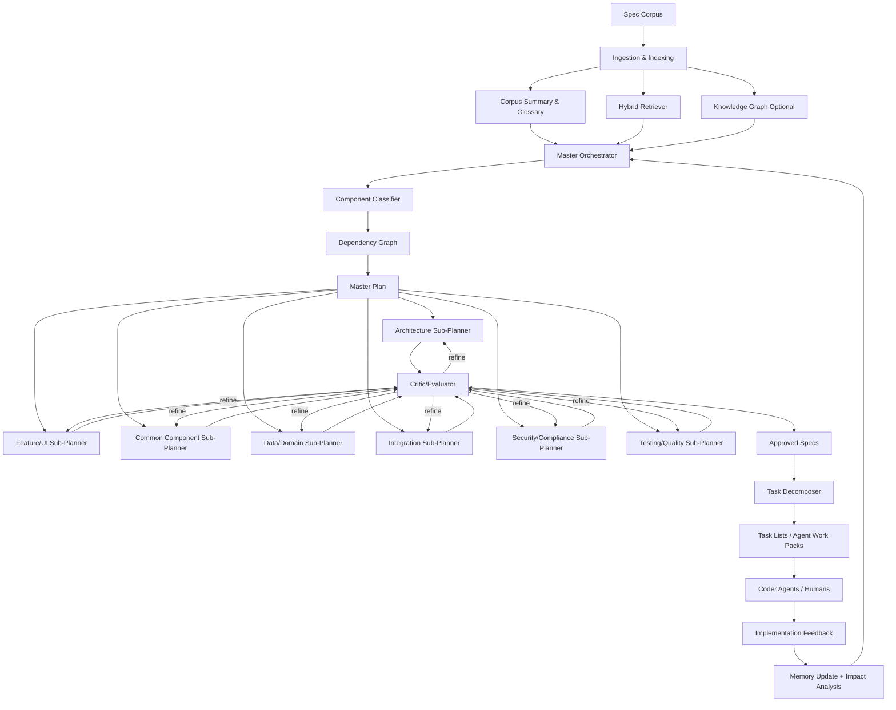

# OrchestratorAgent

> **Self-contained agent definition** for host `generic-swarm-ops`. Body text is embedded from in-pack corpus and va-agent-swarm when available. Do not require external repos to understand this agent.

## Identity

| Field | Value |
|-------|-------|
| **va_id** | 53 |
| **pack_id** | `video.orchestrator` |
| **category** | `9-Meta` |
| **domain_id** | `video` |
| **folder** | `business/video/agents/video.orchestrator/` |

## Category roster section (full, from agents.md)

_The following is the complete category section from the master roster (includes peers in the same craft category)._


## 9. Specialist Meta-Agents

### 9.1 Orchestration Agents

| # | Agent | Responsibility | Knowledge Distillation Source | Self-Quality Criteria | Surpass-Human Signal | Accepts Critique From | Comments On | Tool Access | Architecture Pattern |
|---|---|---|---|---|---|---|---|---|---|
| 53 | **OrchestratorAgent** | Runs CrewAI/AutoGen/LangGraph DAG; retries, timeouts, fan-out/fan-in | LangGraph + CrewAI + AutoGen patterns; Airflow/Temporal; PGA schedule templates | DAG completion ≥99.5%; SLA adherence; deadlock = 0 | Lower TTD than human EP at same scope | ProducerAgent (scope), JudgeAgent (dispute), HiTL on stall | All agents (resource burn, retry storms) | LangGraph state machine; Temporal workflow engine; Redis (distributed locks); observability (LangSmith) | Agentic Graph (LangGraph) — deterministic DAG execution |
| 54 | **PlannerAgent** | Decomposes brief into phased DAG with assignments + critic gates | PMBOK; CrewAI task graphs; phase templates | Plan validity (no missing gate); cost variance <10% | Tighter, cheaper plans than EP first pass (blind A/B) | ProducerAgent, FinanceAgent (budget) | RouterAgent (wrong pick), OrchestratorAgent | LangGraph plan-gen; cost-estimation models; Gantt/PERT tools | ReAct (decompose → estimate → validate → emit DAG) |
| 55 | **RouterAgent** | Picks right specialist agent (and model) for each subtask | Agent-capability registry; benchmark history (cost/quality/latency) | Routing accuracy ≥95% vs oracle; cost within budget | Beats human producer in agent/vendor selection | OrchestratorAgent, CostOptimizerAgent | PlannerAgent (bad decomposition) | Agent registry DB; benchmark leaderboard cache; pricing APIs | Classifier + ReAct (match task embedding → agent capability) |
| 56 | **JudgeAgent** | Adjudicates disputes via multi-agent debate; scores against rubric | Du 2023 (LLM debate); MT-Bench rubrics; guild scoring sheets | Inter-rater κ vs expert panel ≥0.8 | Higher κ than median human juror | HiTL on overturned rulings | DirectorAgent, ScreenwriterAgent, any disputing pair | MT-Bench/Arena evaluation harness; rubric template engine | Multi-agent debate (Du 2023) + LLM-as-Judge (Zheng 2023) |
| 57 | **GateKeeperAgent** | Phase transitions; verifies L1/L2/L3 criteria; signs C2PA | Stage-gate methodology; PGA Producers Mark; QMS audit | Zero leaked defects; sign-off SLA ≥99% | Lower escaped-defect rate than human QA lead | ComplianceAgent, AIQAConsistencyAgent | OrchestratorAgent (premature advance) | C2PA signing (c2patool); JSON schema validators; rubric evaluation endpoints | Constitutional AI (constitution = phase-gate criteria) |
| 58 | **MemoryAgent** | Episodic + long-term project memory; retrieval for any agent | Reflexion (Shinn 2023); MemGPT; vector-DB best practices | Retrieval precision@5 ≥0.9; freshness SLA | Higher recall than producer's bible at scale | All agents (correction events) | All agents (stale facts) | Pinecone/Weaviate/Qdrant vector DB; MemGPT-style hierarchical memory; embedding models | Reflexion memory architecture (MemGPT extension) |

### 9.2 Creative Agents

| # | Agent | Responsibility | Knowledge Distillation Source | Self-Quality Criteria | Surpass-Human Signal | Accepts Critique From | Comments On | Tool Access | Architecture Pattern |
|---|---|---|---|---|---|---|---|---|---|
| 59 | **IdeationAgent** | Divergent brainstorm of concepts, hooks, taglines | Cannes Grand Prix; D&AD; IDEO design-thinking; SCAMPER/de Bono | Idea-count; novelty (embedding distance); semantic diversity | Wins agency-pitch shootouts on concept density | CreativeDirectorAgent, NoveltyAgent | CopywriterAgent (derivative), DirectorAgent (unfilmable) | Embedding novelty scorer; concept clustering (UMAP); Are.na/Pinterest search | Self-Refine + NoveltyAgent as critic |
| 60 | **NarrativeArcAgent** | 3-act / Save-the-Cat / Hero's Journey structure | Campbell; Snyder *Save the Cat*; Truby; Black List analyses | Beat-sheet coverage 100%; turning-point spacing; arc curve fit | Beats WGA first drafts on structural rubric | ScreenwriterAgent, DirectorAgent | ScreenwriterAgent (sagging middle) | Beat-sheet validator; emotional-arc plotter; structure templates | Self-Refine (rubric: beat-sheet completeness) |
| 61 | **StyleTransferAgent** | Applies named aesthetic consistently across shots | Curated style corpora; LoRA/seed registries; reference-frame banks | Style-similarity (CLIP/DINO) ≥0.85; cross-shot variance ≤τ | Wins blind preference vs human colorist+grader | DirectorAgent, ColoristAgent | GeneratorAgent (off-style) | LoRA weights per style; CLIP/DINO similarity scorer; Runway style-lock mode; ComfyUI | Self-Refine (CLIP style score as feedback) |
| 62 | **WorldBuildingAgent** | Lore, rules, geography, factions, magic/tech systems | Tolkien; *Worldbuilding* (Adams); fan-wikis; series-bible leaks | Internal-consistency (no contradictions); rule-completeness | Lower contradiction rate than writers' bibles at 10× volume | ShowrunnerAgent, FactCheckerAgent | ScreenwriterAgent (lore break), ConceptArtistAgent | Long-context LLM (Gemini 2.5 Pro); contradiction-detection model; wiki-graph DB | Reflexion (contradiction corrections → episodic memory) |
| 63 | **MoodBoardAgent** | Reference boards: visual, sonic, tonal | Pinterest/Are.na; lookbook archives; Spotify-Canvas | Reference coherence (cluster tightness); brief alignment | Faster + tighter boards than art director (blind A/B) | DirectorAgent, ProductionDesignAgent | ConceptArtistAgent (off-mood) | Pinterest/Are.na APIs; Spotify Canvas; CLIP clustering; Figma board generation | ReAct (search → cluster → layout → validate coherence) |
| 64 | **NoveltyAgent / Anti-Cliché Critic** | Flags tropes, clichés, over-fit outputs | TV Tropes; OpenSubtitles n-gram freq; corpus-novelty embeddings | Cliché-hit count; novelty score vs category prior | Catches more clichés than experienced script editor | IdeationAgent, ScreenwriterAgent | ScreenwriterAgent (trope-stuffed), CopywriterAgent (templated) | TV Tropes scraper; n-gram frequency DB; embedding novelty scorer | LLM-as-Judge (anti-cliché constitution) |
| 65 | **EmotionalArcAgent** | Maps valence/arousal curve; suggests beats | Plutchik; affective-computing corpora; Cron *Story Genius* | Curve-fit to target; biosignal-proxy regression accuracy | Better retention prediction than NRG test-screening cards | DirectorAgent, EditorAgent, ComposerAgent | EditorAgent (flat middle), ComposerAgent (cue mismatch) | Sentiment/emotion classifiers (GoEmotions); retention-curve predictor; biosignal proxy model | Self-Refine (emotional-arc curve as rubric target) |

### 9.3 Research Agents

| # | Agent | Responsibility | Knowledge Distillation Source | Self-Quality Criteria | Surpass-Human Signal | Accepts Critique From | Comments On | Tool Access | Architecture Pattern |
|---|---|---|---|---|---|---|---|---|---|
| 66 | **WebResearchAgent** | Live web search, source ranking, citation extraction | Bing/Google/Brave APIs; Common Crawl; Perplexity patterns | Source-grade per claim; citation precision; recency hit | Faster + more sources than newsroom researcher | FactCheckerAgent, CitationAgent | ScriptwriterAgent (uncited claim) | Brave/Google Search API; Jina Reader (web→markdown); source-quality classifier | ReAct (query → fetch → extract → grade → cite) |
| 67 | **ArchiveResearchAgent** | Historical / academic / archival deep search | JSTOR, arXiv, PubMed, AP Archive, Getty, FOIA | Primary-source ratio; archive-coverage breadth | Higher primary-source ratio than doc producer | FactCheckerAgent, SMEAgent | ScriptwriterAgent (secondary-source reliance) | JSTOR/arXiv/PubMed APIs; Getty Images API; FOIA request tools; OCR (Tesseract) | ReAct (formulate query → search archive → extract → grade source) |
| 68 | **TrendIntelligenceAgent** | Detects emerging memes, sounds, formats | TikTok Creative Center; Trendpop; Tubular; Reddit/X firehose | Prediction lead time vs peak; precision/recall on trend list | Earlier detection than human strategists at higher precision | SocialStrategistAgent, CopywriterAgent | IdeationAgent (off-trend) | TikTok Creative Center API; Reddit/X streaming APIs; Sensor Tower; Google Trends | ReAct + time-series anomaly detection |
| 69 | **CompetitorIntelligenceAgent** | What competitors are shipping | Meta Ad Library; TikTok Top Ads; YouTube scrape; release trackers | Coverage % of competitor set; our-novelty vs landscape | More comprehensive than agency strategy decks | BrandAgent, CreativeDirectorAgent | IdeationAgent (derivative) | Meta Ad Library API; TikTok Top Ads; SimilarWeb; YouTube Data API v3 | ReAct (scrape competitor → classify → report gaps) |
| 70 | **CitationAgent** | Normalizes sources; grades primary/secondary/tertiary | Chicago, APA, AP style; SPJ grading; CRAAP test | Citation format 100% valid; primary % ≥target | Lower error rate than newsroom copy desk | FactCheckerAgent, JournalistAgent | WebResearchAgent (weak source) | Citation parsers (AnyStyle); DOI resolver; CRAAP scoring model | Self-Refine (format validator + source grader as rubric) |
| 71 | **InterviewSynthesisAgent** | Synthesizes practitioner interviews into data | Otter/Rev transcripts; consent forms; SAG/WGA templates | Inter-coder agreement on themes; consent integrity | Faster + richer theme extraction than qualitative researcher | ResearchPIAgent (HiTL), ComplianceAgent | SMEAgent (mis-summarized expert) | Otter.ai/Rev API (transcription); thematic coding models; consent-management DB | Reflexion (interviewer refines questions based on theme gaps) |
| 72 | **BenchmarkResearchAgent** | Monitors VBench, EvalCrafter, MT-Bench, FVD, CLIP-T leaderboards | Papers-with-Code; HuggingFace leaderboards; conference proceedings | Coverage of benchmarks; freshness ≤7 days | Faster + broader than ML-research team | OptimizationAgents (any) | All AI agents (stale baselines) | Papers-with-Code API; HuggingFace Hub API; arXiv RSS; VBench leaderboard scraper | ReAct (poll leaderboards → detect change → alert) |

### 9.4 Optimization Agents

| # | Agent | Responsibility | Knowledge Distillation Source | Self-Quality Criteria | Surpass-Human Signal | Accepts Critique From | Comments On | Tool Access | Architecture Pattern |
|---|---|---|---|---|---|---|---|---|---|
| 73 | **PromptOptimizerAgent** | Auto-improves prompts via OPRO/APE/DSPy/Promptbreeder | OPRO (Yang 2023); APE (Zhou 2022); DSPy (Stanford); Promptbreeder (DeepMind) | Score uplift per iteration; convergence speed | Beats hand-tuned prompts on held-out briefs | PromptEngineerAgent, AIQAAgent | PromptEngineerAgent (sub-optimal seed) | DSPy framework (MIPRO optimizer); OPRO implementation; held-out eval harness | DSPy compilation + OPRO meta-optimization |
| 74 | **CostOptimizerAgent** | Routes between models/providers for $/quality | Provider pricing; cost-quality frontiers; FrugalGPT patterns | $/successful-task; Pareto distance from frontier | Lower $/quality than human CFO routing | RouterAgent, FinanceAgent | RouterAgent (over-spend), GeneratorAgent (re-roll burn) | Provider pricing APIs; benchmark cost DB; FrugalGPT cascade logic | ReAct (evaluate task → pick cheapest model meeting threshold) |
| 75 | **LatencyOptimizerAgent** | Parallelization, caching, speculative decoding, batching | vLLM; TensorRT-LLM; distillation; Anyscale/Ray | p50/p95 latency; throughput/GPU-hour | Lower p95 than human-tuned pipeline | OrchestratorAgent | OrchestratorAgent (serial bottleneck) | vLLM; TensorRT-LLM; Ray Serve; Redis (response cache); speculative decoding configs | Tool-use profiling + automated pipeline restructuring |
| 76 | **RetentionOptimizerAgent** | Tunes hook, pacing, structure for AVD/hold-rate | YouTube Analytics benchmarks; TikTok retention curves; AudienceSim | Predicted retention vs actual; AVD lift over control | Beats senior YouTube editor on AVD lift (A/B) | EditorAgent, AudienceSimAgent | EditorAgent (slow opener), ScriptwriterAgent (front fluff) | YouTube Analytics API; retention-curve predictor model; A/B test framework | RLAIF (reward = retention uplift from real analytics) |
| 77 | **ROASOptimizerAgent** | Optimizes ad creatives for performance | Meta Marketing Science; TikTok Ads Academy; MMM/MTA lit | ROAS uplift vs control; significance ≥95% | Beats senior marketer at equal budget | PerformanceMarketerAgent, AnalystAgent | UGCAgent (low hook), CopywriterAgent (weak CTA) | Meta Ads API (creative testing); TikTok Ads; Bayesian MMM tools (Robyn/Meridian) | RLAIF (reward = real ROAS from ad platform feedback) |
| 78 | **AccessibilityOptimizerAgent** | WCAG 2.2 contrast, captions, audio description, color-blind safe | WCAG 2.2; W3C/WAI-ARIA; DCMP captioning key; Deaf/HoH guidelines | Conformance 100% AA, ≥90% AAA; caption WER ≤2% | Catches more a11y defects than ADA-certified auditor | AccessibilityAgent (HiTL), ComplianceAgent | EditorAgent (caption sync), ColoristAgent (contrast) | axe-core/Lighthouse (contrast); Whisper v4 (captioning); audio-description generator | Constitutional AI (constitution = WCAG 2.2 success criteria) |
| 79 | **EvaluationHarnessAgent** | Runs benchmarks (VBench, EvalCrafter, MT-Bench, FVD, CLIP-T); posts regressions | Papers-with-Code; HuggingFace leaderboards; benchmark repos | Regression precision/recall; alert latency <1h | Catches regressions faster than ML-eng rotation | BenchmarkResearchAgent | All AI agents (regression alerts) | VBench suite; EvalCrafter; MT-Bench harness; CI/CD (GitHub Actions); alerting (PagerDuty) | Tool-use / ReAct (run benchmark → compare → alert if regressed) |
| 80 | **SafetyRedTeamAgent** | Adversarially attacks for deepfake, bias, jailbreak, defamation | Hany Farid benchmarks; Partnership on AI Framework; OWASP LLM Top 10 | Attack-success kept ≤1%; taxonomy coverage | Higher coverage than internal red-team rotation | EthicsAgent (HiTL), ComplianceAgent | AvatarDesignAgent, VoiceCloneAgent, AllGenerators | Deepfake detectors (Farid lab models); bias probes; jailbreak prompt banks; OWASP scanner | Multi-agent debate (red-team vs defender) + adversarial search |

---


## Responsibility

Runs CrewAI/AutoGen/LangGraph DAG; retries, timeouts, fan-out/fan-in

## Knowledge distillation sources

LangGraph + CrewAI + AutoGen patterns; Airflow/Temporal; PGA schedule templates

## Self-quality criteria

DAG completion ≥99.5%; SLA adherence; deadlock = 0

## Surpass-human signal

Lower TTD than human EP at same scope

## Critique bus

- **Accepts critique from:** ProducerAgent (scope), JudgeAgent (dispute), HiTL on stall

- **Comments on:** All agents (resource burn, retry storms)

## Tools (design-time documentation)

LangGraph state machine; Temporal workflow engine; Redis (distributed locks); observability (LangSmith)

**Runtime safety:** Host allow-lists are only `agent_spec.json` + `tool-permission-register.json`. CI uses video_* stubs. Do not treat design-time vendor names as enabled APIs.

## Architecture pattern

Agentic Graph (LangGraph) — deterministic DAG execution

## Common structure of an AI agent (full §11 from agents.md)

## 11. Common Structure of an AI Agent

Every agent — regardless of category — implements this skeleton. Derived from the source document's architecture patterns (§1), critique protocol (§6), and universal success-criteria framework (§5), enriched with current (2026) tooling research.

### 11.1 Architecture Diagram

The diagram below presents the common agent as a professional operating architecture rather than a simple component sketch. It shows how **orchestration**, the **input contract**, **knowledge and tool surfaces**, the internal **plan → act → self-review** loop, **traceability and provenance controls**, the **3-layer quality gate** (Spec → Rubric → Preference), **release packaging**, **peer critique**, **human escalation**, and **continuous improvement** work together as one governed system.


> **Tip:** view the diagram fullscreen on GitHub by clicking it, or download [`common-agent-structure.svg`](./common-agent-structure.svg) directly. The SVG is designed as a presentation-grade reference for architecture reviews and implementation planning.

### 11.2 Component Reference Table

| # | Component | Purpose | Mechanism / Implementation Notes |
|---|---|---|---|
| 1 | **Identity** | Stable unique handle for routing, logging, provenance | Kebab-case ID + semantic version (e.g. `director-agent@2.1.0`). Registered in the agent-capability registry used by RouterAgent. |
| 2 | **Responsibility (Scope)** | Single-sentence definition of what the agent owns | Mirrors a human craft role. Prevents scope overlap via explicit boundary documented in the registry. |
| 3 | **Knowledge Distillation Source** | Licensed/consented corpora the agent is trained or RAG-grounded on | Award archives, academic papers, expert interviews, peer-reviewed journals. Refreshed via Continuous Distillation Loop (§7 of source). |
| 4 | **Tool Access** | External APIs, generators, validators, DCC bridges | Video gen: Sora 2, Veo 3.1 (Gemini API), Runway Gen-4/Aleph, Kling 3.0. Voice: ElevenLabs v3, Sync.so, HeyGen. DCC: Resolve/Nuke/AE via MCP bridges. All accessed via MCP (Model Context Protocol, Anthropic 2024). |
| 5 | **Architecture Pattern** | Reasoning/learning loop powering the agent | One or more of: Self-Refine [1], Reflexion [2], RLAIF/Constitutional AI [3], Multi-agent debate [4], LLM-as-Judge [5], Pairwise preference (Arena) [5], ReAct [6], Agentic Graph (LangGraph/CrewAI/AutoGen) [7], DSPy/OPRO prompt optimization [8]. |
| 6 | **Memory** | Episodic + long-term project memory | Vector DB (Pinecone/Weaviate/Qdrant) accessed via MemoryAgent. Implements MemGPT-style hierarchical memory with summarization and eviction. Reflexion agents store verbal self-feedback here. |
| 7 | **Constitution / Rubric** | Written, role-specific scoring guide for self-check | Examples: Murch's Rule of Six (Editor), 12 Principles (Animator), Save-the-Cat beats (Screenwriter), WCAG 2.2 (Accessibility), FAA Part 107 (Drone), SAG-AFTRA AI rider (Consent). Used as the "constitution" in Constitutional AI pattern. |
| 8 | **Self-Quality: L1 Spec** | Did the output meet the structured brief? | JSON schema validation + tool validators (codec, LUFS, aspect ratio, frame count, file format). Must pass 100%. |
| 9 | **Self-Quality: L2 Rubric** | Does it meet craft rubric for this role? | LLM-as-Judge (Zheng 2023) with role-specific constitution. Must score ≥85/100. Up to 3 Self-Refine iterations if below threshold. |
| 10 | **Self-Quality: L3 Preference** | Would target audience choose this over human baseline? | Pairwise comparison: AudienceSim panel (≥200 simulated personas + ≥20 HiTL samples). Win rate ≥50% (parity) or ≥55% (surpass). |
| 11 | **Surpass-Human Signal** | Pre-registered proof the agent exceeds a credentialed professional | Benchmark dominance; blind Arena preference ≥55%; speed × quality (equal L2 at ≤10% turnaround); lower 90-day defect rate; certification pass; higher novelty at equal quality. |
| 12 | **Critique Inbox** | Channel for receiving structured feedback from peers | Shared `CritiqueMessage` JSON bus. Severities: blocker (halts DAG), major (Self-Refine ≤3 iters), minor/nit (logged for RLAIF). Disputes → JudgeAgent multi-agent debate → HiTL if unresolved. |
| 13 | **Critique Outbox** | Peer agents whose work this agent is qualified to review | Defined per-agent in roster. Messages emitted on same bus. Evidence-backed, rubric-referenced, appended to C2PA provenance. |
| 14 | **HiTL Escalation** | When a human must be brought in | Consent (SAG-AFTRA AI rider, EU AI Act Art. 50); final legal sign-off; MPA rating; festival eligibility; crisis comms; cross-cultural sensitivity. |
| 15 | **Provenance (C2PA)** | Cryptographic signing of every artifact | Every emitted artifact signed with C2PA (c2patool). Downstream agents verify chain. Accepted critiques appended to manifest. Platforms (YouTube, TikTok, Meta) auto-label based on C2PA presence. |
| 16 | **Continuous Learning** | How the agent keeps improving post-deployment | Bootstrap (licensed corpora) → Expert interviews (paid, consented) → Live RLAIF (DPO/KTO) → Award-rubric grounding → Adversarial red-team → 30/60/90-day reality check (retention, ROAS, awards). |
| 17 | **Orchestration Integration** | How the agent fits the multi-agent graph | Registered as a node in LangGraph/CrewAI/AutoGen DAG. OrchestratorAgent schedules; PlannerAgent assigns; RouterAgent selects model/provider; GateKeeperAgent verifies L1-L3 before advancing. |

### CritiqueMessage Schema (Universal)

```json
{
  "critique_id": "uuid",
  "from_agent": "EditorAgent",
  "to_agent": "DirectorAgent",
  "artifact_ref": "shot_42_take_3.mp4",
  "severity": "blocker | major | minor | nit",
  "category": "pacing | continuity | accuracy | compliance | accessibility | brand | craft",
  "evidence": ["timecode 00:01:14 — held 1.4s past cut point per genre prior"],
  "suggested_action": "trim 1.0s; re-evaluate hold",
  "rubric_reference": "Murch Rule of Six §3",
  "must_resolve_before": "phase_4_review"
}
```

### Composition Diagram

```text
[Brief] ──► PlannerAgent ──► OrchestratorAgent ──► RouterAgent ──► (52 craft agents §1–§8)
                 ▲                  │                                       │
                 │                  ▼                                       ▼
             MemoryAgent      GateKeeperAgent ◄─── JudgeAgent ◄──── CritiqueMessages
                                    ▲                                       ▲
                                    │                                       │
            [Creative meta:] IdeationAgent · NarrativeArcAgent · StyleTransferAgent · MoodBoardAgent · NoveltyAgent · EmotionalArcAgent
            [Research meta:] WebResearchAgent · ArchiveResearchAgent · TrendIntelAgent · CompetitorIntelAgent · CitationAgent · InterviewSynthAgent · BenchmarkResearchAgent
            [Optimization meta:] PromptOptimizerAgent · CostOptimizer · LatencyOptimizer · RetentionOptimizer · ROASOptimizer · AccessibilityOptimizer · EvalHarnessAgent · SafetyRedTeamAgent
```

---

## Shared references (from agents.md §12)

## 12. References

### Foundational Papers (Architecture Patterns)

| Ref | Paper | Key Contribution | Link |
|---|---|---|---|
| [1] | Madaan et al., "Self-Refine: Iterative Refinement with Self-Feedback," NeurIPS 2023 | Agent drafts → self-critiques against rubric → revises iteratively without weight updates | [arXiv:2303.17651](https://arxiv.org/abs/2303.17651) |
| [2] | Shinn et al., "Reflexion: Language Agents with Verbal Reinforcement Learning," NeurIPS 2023 | Verbal self-reflection stored in episodic memory buffer to improve decisions in subsequent trials | [arXiv:2303.11366](https://arxiv.org/abs/2303.11366) |
| [3] | Bai et al., "Constitutional AI: Harmlessness from AI Feedback," 2022 | Reward signal from AI critic governed by a written constitution; RLAIF without human labels | [arXiv:2212.08073](https://arxiv.org/abs/2212.08073) |
| [4] | Du et al., "Improving Factuality and Reasoning in Language Models through Multiagent Debate," 2023 | Multiple LLM agents debate; improves factuality and reasoning across tasks | [arXiv:2305.14325](https://arxiv.org/abs/2305.14325) |
| [5] | Zheng et al., "Judging LLM-as-a-Judge with MT-Bench and Chatbot Arena," NeurIPS 2023 | GPT-4 judge achieves >80% agreement with human preferences; scalable evaluation | [arXiv:2306.05685](https://arxiv.org/abs/2306.05685) |
| [6] | Yao et al., "ReAct: Synergizing Reasoning and Acting in Language Models," ICLR 2023 | Interleaving reasoning traces with tool-use actions for grounded decision-making | [arXiv:2210.03629](https://arxiv.org/abs/2210.03629) |
| [7] | LangGraph / CrewAI / AutoGen (2024–2026) | Agentic graph orchestration: DAG with state, handoffs, review gates, human-in-the-loop | [LangGraph](https://github.com/langchain-ai/langgraph), [CrewAI](https://github.com/crewAIInc/crewAI), [AutoGen](https://github.com/microsoft/autogen) |
| [8] | Yang et al., "Large Language Models as Optimizers" (OPRO), 2023; Khattab et al., DSPy (Stanford, 2023–2026) | Meta-optimization of prompts using LLMs; DSPy compiles declarative LM programs into optimized pipelines | [OPRO arXiv:2309.03409](https://arxiv.org/abs/2309.03409), [DSPy](https://github.com/stanfordnlp/dspy) |

### Evaluation Benchmarks

| Benchmark | Scope | Link |
|---|---|---|
| VBench / VBench 2.0 | Video generation quality — 16 dimensions (temporal + frame-wise); VBench 2.0 adds Human Fidelity, Creativity, Physics | [arXiv:2311.17982](https://arxiv.org/abs/2311.17982), [VBench 2.0: arXiv:2503.21755](https://arxiv.org/abs/2503.21755) |
| EvalCrafter | Text-to-video — 18 metrics across visual, content, motion quality | [arXiv:2310.11440](https://arxiv.org/abs/2310.11440) |
| MT-Bench / Chatbot Arena | LLM output quality via pairwise human + LLM-judge evaluation | [arXiv:2306.05685](https://arxiv.org/abs/2306.05685) |

### Generative Video Models (Tool Access — 2026 landscape)

| Model | Provider | Key Capabilities | Access |
|---|---|---|---|
| Sora 2 / Sora 2 Pro | OpenAI | Synchronized dialogue + SFX + background audio; cinematic/realistic/anime styles; 1080p 20s | [OpenAI Videos API](https://developers.openai.com/api/docs/models/sora-2) (discontinuing Sept 2026) |
| Veo 3.1 | Google DeepMind | 4K / 1080p / 720p, 8s; native audio; configurable 16:9 & 9:16; multi-image reference for character/object direction | [Gemini API](https://ai.google.dev/gemini-api/docs/video) / [Vertex AI](https://docs.cloud.google.com/vertex-ai/generative-ai/docs/models/veo/3-1-generate) |
| Runway Gen-4 / Gen-4.5 / Aleph | Runway | ControlNet guides, camera paths, style-lock, Layout Sketch; Aleph for video-to-video editing | [Runway API](https://docs.dev.runwayml.com/) |
| Kling 3.0 | Kuaishou | Cinematic motion realism; physics accuracy; motion-control (reference video); native audio | [Kling API (fal.ai)](https://fal.ai/models/fal-ai/kling-video) |

### Voice & Avatar Tools (2026)

| Tool | Provider | Capabilities |
|---|---|---|
| ElevenLabs v3 | ElevenLabs | Expressive TTS; instant/professional voice cloning; dialogue mode (multi-speaker); Projects API for long-form; Sound FX generation | [Docs](https://elevenlabs.io/docs) |
| HeyGen Avatar IV | HeyGen | Photoreal AI avatars; 175+ languages lip-sync; ElevenLabs integration; personalization API | [HeyGen](https://www.heygen.com) |
| Synthesia | Synthesia | Enterprise AI avatars at scale; SCORM-compatible; brand-controlled | [Synthesia](https://www.synthesia.io) |
| Sync.so / Wav2Lip | Open-source + API | Lip-sync overlays; phoneme-viseme alignment | [Sync.so](https://sync.so) |

### Infrastructure Standards

| Standard | Purpose | Status (2026) |
|---|---|---|
| C2PA (Content Provenance) | Cryptographic manifest signing for every AI-generated artifact; platforms (YouTube, TikTok, Meta) auto-label | EU AI Act Code of Practice (March 2026) mandates C2PA + watermarking combined. Over 2,300 tools support. [contentauthenticity.org](https://contentauthenticity.org/blog/the-state-of-content-authenticity-in-2026) |
| MCP (Model Context Protocol) | Open standard for LLM ↔ tool integration; 2,300+ public servers; adopted by Claude, VS Code, Cursor, etc. | Donated to Agentic AI Foundation (Linux Foundation, Dec 2025) by Anthropic + OpenAI + Block. [modelcontextprotocol.io](https://modelcontextprotocol.io) |
| DSPy | Framework for programming (not prompting) LLMs; compiles declarative pipelines into optimized prompts/finetunes | Stanford-maintained; MIPRO optimizer; used by PromptOptimizerAgent for automated prompt improvement. [github.com/stanfordnlp/dspy](https://github.com/stanfordnlp/dspy) |

---

*Generated: May 2026. Source: [`ai_agent_video_production_workflow.md`](./ai_agent_video_production_workflow.md). Core layout restored from `agents_old.md`; missing workflow-support content merged into the same table-driven structure.*

## Deep specifications (full embedded content)


### Document: `study/intent_analysis_agent_functional_specification.md`

_Embedded from `corpus/study/intent_analysis_agent_functional_specification.md`. Also stored at `sources/study/intent_analysis_agent_functional_specification.md` under this agent folder._


**Deep Intent Analysis Framework (DIA) v2.0**  
**Comprehensive Functional Specification Document**

**Version:** 2.0 (Research-Enhanced)  
**Date:** May 26, 2026  
**Status:** Complete Functional Specification  
**Basis:** Original 6-phase DIA (from conversation history) + deep integration of 2025–2026 arXiv research on computational pragmatics, speech act theory, LLM-based intent/implicature reasoning, multi-party discourse analysis, and xAI Grok capabilities.

---

### 1. Executive Summary

The **Deep Intent Analysis Framework (DIA) v2.0** is a complete, production-ready, modular system for systematically decoding any text’s **purpose**, **hidden agenda**, **multi-angle perspectives**, **illocutionary force**, and **ethical/behavioral quality**.  

It transforms the original 6-phase manual/LLM-prompt pipeline into a **fully specified, agentic, evaluable software system** built on xAI’s Grok-4.3 (or latest) with native tool use, 1M+ token context, structured outputs, and low-hallucination reasoning.

**Core Objectives**  
- Answer: *Why does this language exist? What is the real goal? What is hidden? How many angles exist? Is the behavior good/wrong/effective?*  
- Achieve human-expert-level pragmatic reasoning at scale.  
- Support manual use, API, web app, IDE plugin, and enterprise analytics.

**Key v2.0 Improvements (from arXiv + xAI research)**  
- **Pragmatic Inference Chain (PIC)** integration for superior implicature & hidden-agenda detection.  
- **Multi-Perspective Agent Simulation** (inspired by multi-party conversational agents survey) for richer angle mapping.  
- **Gricean + Extended Maxims** (including Benevolence & Transparency for AI contexts).  
- **Automated Speech Act / Dialog Act Classification** using recent taxonomies and LLM judges.  
- **Hybrid Evaluation Pipeline** (automatic metrics + human-in-the-loop).  
- **Native xAI Integration**: Grok-4.3 reasoning modes, tool calling, real-time search for context validation.

**Target Users**  
Journalists, analysts, researchers, educators, content moderators, legal teams, AI safety engineers, and power users who want to “see through” language.

---

### 2. Background, Motivation & Research Foundation

**Original Motivation (from user history)**  
Language serves communication, but always with purpose, hidden intent, multiple angles, and moral implications. The 6-phase DIA provides a repeatable algorithm.

**2025–2026 Research Integration** (selected key sources)

- **Pragmatics in the Era of LLMs Survey** (arXiv:2502.12378): Comprehensive datasets for speech acts, implicature, social pragmatics; highlights LLM gaps in deeper pragmatic reasoning and English-centric bias. Recommends hybrid evaluation and theory-grounded prompting.

- **Pragmatic Inference Chain (PIC)** (arXiv:2503.01539): 4-step relevance-theory-based prompting dramatically improves implicit toxicity / hidden bias detection (GPT-4o: +12.26 pp). Explicitly separates literal meaning, metaphors, norm violation, and judgment. Directly enhances Phase 3 & 4.

- **Multi-Party Conversational Agents Survey** (arXiv:2505.18845): State-of-Mind taxonomy (Emotion, Engagement, Personality Big-Five, Dialog Acts); discourse structure; Theory of Mind (ToM) for multi-perspective modeling. Enables true multi-angle simulation.

- **Gricean Maxims in NLP & Human-AI Interaction**: Multiple papers extend Grice with Benevolence & Transparency maxims for AI; use maxim-violation detection for offensive/hidden-agenda texts.

- **xAI / Grok Research**: Grok-4.3 excels at agentic tool use, long-context reasoning, low hallucination, and social role mediation (truth arbiter, adversary). Ideal backbone for DIA as a trustworthy, multi-role analysis agent.

These findings directly upgrade the original framework into a **scientifically grounded, computationally implementable specification**.

---

### 3. System Architecture (High-Level)

**Modular, Agentic Design** (Grok-4.3 native)

```
User Input (Text + Optional Context)
          ↓
Phase 0: Context Analyzer Agent
          ↓
Phase 1: Purpose Classifier (Jakobson + LLM)
          ↓
Phase 2: Surface Literal Parser (NLP + LLM)
          ↓
Phase 3: Pragmatic Engine (Speech Acts + PIC + Grice Maxim Detector)
          ↓
Phase 4: Hidden Agenda & Multi-Angle Dissector (Multi-Agent ToM Simulation)
          ↓
Phase 5: Judgment Engine (Multi-Criteria Scorer + Ethical Auditor)
          ↓
Phase 6: Synthesizer & Action Recommender
          ↓
Structured JSON Output + Human-Readable Report + Visualizations
```

**Core Components**  
- **LLM Backbone**: Grok-4.3 (reasoning mode configurable: low/medium/high) via xAI API.  
- **Tool Layer**: Real-time search (for context validation), code interpreter (metrics, clustering), structured output enforcement.  
- **Optional Classical NLP Layer**: spaCy/transformers for baseline speech act classifiers, embeddings (angle similarity), topic modeling.  
- **Orchestration**: LangGraph-style or custom xAI agent framework with parallel tool calls.  
- **Storage**: Analysis history, user templates, benchmark results (PostgreSQL + vector DB for similarity search).  
- **Interfaces**: REST API, Web UI (Streamlit/Gradio), CLI, VS Code / Cursor extension, Slack/Discord bot.

**Data Flow**  
Every phase produces typed artifacts (JSON) that feed the next. Full traceability with evidence spans and confidence scores.

---

### 4. Detailed Functional Requirements – 6 Phases (v2.0 Enhanced)

#### Phase 0: Context Analyzer
**Inputs**: Raw text, optional metadata (sender, platform, date, prior messages).  
**Processing**: LLM extracts sender power/relationship, audience, medium norms, trigger event; bias self-check prompt.  
**Enhancement**: Real-time search tool for historical/cultural context.  
**Output**: Structured context object + confidence.

#### Phase 1: Purpose Categorization (Jakobson Functions)
**Table** (unchanged but now LLM-ranked with evidence): Referential, Emotive, Conative, Phatic, Metalingual, Poetic.  
**v2.0**: Multi-label classification with probability distribution + justification.

#### Phase 2: Surface Literal Analysis
**Checklist** (facts vs opinions, loaded words, voice, omissions, ambiguity).  
**Enhancement**: Embedding-based vagueness scoring + coreference resolution.

#### Phase 3: Pragmatic & Speech Act Engine (Core Upgrade)
**Components**:
- **Searle’s 5 Categories** (Assertives, Directives, Commissives, Expressives, Declaratives) + fine-grained taxonomies from Parliamentary Debates & CyberAgressionAdo-v2 (“attack”, “defend”, etc.).
- **Grice Maxim Violation Detector**: Automated scoring (Quantity, Quality, Relation, Manner) + extended maxims (Benevolence, Transparency).
- **PIC Integration** (mandatory for hidden agenda):
  1. Explain metaphors/special meanings (layperson language).
  2. Literal meaning (layperson language).
  3. Identify contradictions with relevant social/ethical norms (equality, truth-seeking, non-manipulation, etc.).
  4. Final implicature judgment.

**Output per utterance**: `{illocutionary_act, perlocutionary_effect, maxim_violations: [...], implicature: "...", confidence}`

#### Phase 4: Hidden Agenda & Multi-Angle Dissection (Major Upgrade)
**Steps**:
1. Explicit vs Implicit goals (power, status, division, validation…).
2. Power & ideology scan (CDA-style: who benefits? us vs them?).
3. **Multi-Perspective Agent Simulation** (new): Spawn 4–6 parallel Grok agents, each embodying one POV (speaker, receiver, opponent, society, historical, environmental). Each produces angle summary + evidence. Aggregate with clustering.
4. Framing analysis + inconsistency detection.
5. Agenda Type classification (Inform / Persuade / Manipulate / Bond / Signal / Deceive) with sub-scores.

**Output**: `hidden_agenda: str, angle_count: int, angles: [{perspective, framing, evidence}], ignored_angles: [...]`

#### Phase 5: Behavioral Judgment Engine
**6 Core Dimensions** (1–10 or 0–1) + 2 new:
1. Truthfulness
2. Ethical Impact (harm, autonomy, power imbalance)
3. Effectiveness (stated + hidden goals)
4. Clarity & Cooperation (Grice)
5. Social Value (understanding vs division)
6. Transparency
7. **Benevolence** (new – AI-specific)
8. **Cultural Appropriateness** (new – from multi-task pragmatic models)

**Final Verdict**: Categorical + narrative + recommended action.  
**Rule**: All scores must cite evidence from Phases 0–4.

#### Phase 6: Synthesis
One-paragraph executive summary + actionable recommendations + confidence vector.  
Optional: Counter-argument generator or “how to respond” module.

---

### 5. Data Models & Output Schema (JSON)

```json
{
  "analysis_id": "uuid",
  "input_text": "...",
  "context": {...},
  "purpose": {
    "dominant_functions": [{"function": "Conative", "score": 0.62, "evidence": "..."}],
    "jakobson_ranking": [...]
  },
  "surface": {...},
  "pragmatic": {
    "speech_acts": [...],
    "grice_violations": [...],
    "pic_implicature": "..."
  },
  "hidden_agenda": {
    "primary_agenda": "Manipulate via fear",
    "angle_count": 5,
    "angles": [...],
    "multi_perspective_summary": {...}
  },
  "judgment": {
    "scores": {
      "truthfulness": 7.2,
      "ethics": 3.1,
      "benevolence": 4.5,
      ...
    },
    "verdict": "Strategically effective but ethically manipulative",
    "recommended_action": "..."
  },
  "confidence": 0.87,
  "processing_time_ms": 12400,
  "model": "grok-4.3-reasoning-high"
}
```

---

### 6. Non-Functional Requirements

- **Performance**: <15s for <5k token text on Grok-4.3 high reasoning; parallel phase execution.  
- **Scalability**: Stateless API; batch mode for enterprise (1000s of texts).  
- **Accuracy**: Target >85% agreement with expert linguists on speech act + implicature benchmarks (use Parliamentary Debates, PIC test sets, etc.).  
- **Explainability**: Every claim has evidence span + confidence.  
- **Ethics & Safety**: Built-in refusal for harmful misuse; bias auditing; xAI alignment principles (truth-seeking, helpfulness without sycophancy).  
- **Privacy**: Optional local mode; no persistent storage of user texts unless opted in.

---

### 7. Implementation Roadmap

**Phase 1 (Weeks 1–4)**: Prompt-engineered prototype on Grok-4.3 (all 6 phases + PIC + basic multi-agent). Structured output validation.  
**Phase 2 (Months 2–3)**: Fine-tune lightweight speech act classifier on public datasets; integrate classical NLP metrics.  
**Phase 3 (Months 4–6)**: Full agentic orchestration, web UI, API, benchmark suite (accuracy, latency, user studies).  
**Phase 4 (Ongoing)**: Continuous evaluation on new pragmatic datasets; community benchmark contribution.

**Technology Stack**  
- Backend: Python + xAI SDK + LangGraph / custom agents  
- Frontend: Streamlit / Next.js  
- Storage: PostgreSQL + Qdrant (vector)  
- Evaluation: Custom harness using arXiv pragmatic datasets

---

### 8. Evaluation Framework

- **Automatic**: F1 on speech act datasets, PIC accuracy lift, Grice violation detection correlation with human labels.  
- **Human**: Expert linguist agreement (Cohen’s κ > 0.75 target).  
- **A/B Testing**: DIA vs baseline LLM on real-world texts (news, ads, political speech, X posts).  
- **xAI-Specific**: Measure reduction in sycophancy / hallucination in judgment phase.

---

### 9. Limitations & Future Work

**Current Limitations**  
- English-dominant (mitigate with multilingual PIC prompts).  
- Requires high-quality context for best results.  
- Computational cost on very long documents (mitigated by 1M context + summarization agents).

**Future**  
- Multimodal extension (video/audio discourse).  
- Real-time conversation monitoring (multi-party).  
- Fine-tuned DIA-specialist model on xAI infrastructure.  
- Open-source benchmark suite contribution to arXiv community.

---

### 10. References (Key Sources)

- Pragmatics in the Era of Large Language Models: A Survey (arXiv:2502.12378)  
- Pragmatic Inference Chain (PIC) (arXiv:2503.01539)  
- Multi-Party Conversational Agents: A Survey (arXiv:2505.18845)  
- Various Gricean Maxims in NLP papers (2024–2025)  
- xAI Grok-4.3 Model Card & API Documentation (2025–2026)  
- Original DIA framework (user conversation history, May 2026)

---

**This document constitutes the complete, actionable functional specification.**  

You can now:
- Copy it directly into a product requirements document or Notion.
- Hand it to engineers for implementation.
- Use it as the system prompt for building the actual Grok-powered DIA agent.

**Next Step Recommendation**: Provide a sample text (or confirm you want a live demonstration), and I will execute the full v2.0 pipeline on it using the exact enhanced structure above.  

Ready to build or test? Just say the word.


### Document: `plan/planner_agent_v2.1.md`

_Embedded from `corpus/plan/planner_agent_v2.1.md`. Also stored at `sources/plan/planner_agent_v2.1.md` under this agent folder._


# SIPA — Software Implementation Planner Agent

## Complete Research-Hardened Specification & Design Document

**Version:** 2.1 — Research-Hardened, Security-Operationalized  
**Date:** 2026-06-03  
**Status:** Production-Ready Design Spec  
**Primary Goal:** Convert very large software-specification corpora into high-fidelity, traceable, component-type-adaptive implementation plans and granular tasks for AI coding agents and human developers.

---

## Change Summary — v2.0 → v2.1

This revision is a deep-research pass and adversarial “100x rethink” consolidation. It does **not** merely expand the previous document; it tightens the system into an implementable, governable, security-aware planner.

### Major Improvements

1. **Research verification and correction**
   - Verified MAAD as arXiv:2606.01385, submitted May 31, 2026, and preserved it as the core architecture-planning influence. ([arxiv.org](https://arxiv.org/abs/2606.01385))
   - Updated AgentOrchestra reference: current arXiv title emphasizes the Tool-Environment-Agent, or TEA, protocol and lifecycle-aware orchestration rather than only “general-purpose task solving.” ([arxiv.org](https://arxiv.org/abs/2506.12508))
   - Updated GitHub Spec Kit alignment to include the current Spec → Plan → Tasks → Implement flow plus newer practical commands such as constitution, clarify, analyze, checklist, and task-to-issues. ([github.github.com](https://github.github.com/spec-kit/))
   - Qualified xAI/Grok Build claims: official xAI pages verify plan mode, parallel subagents, skills/plugins/hooks/MCP, headless mode, and API availability; this spec no longer depends on unofficial “Arena Mode” claims and instead defines SIPA’s own optional local “Arena Evaluator.” ([x.ai](https://x.ai/news/grok-build-cli))

2. **Added security and trust model**
   - Added prompt-injection, memory-poisoning, MCP/tool safety, least-privilege execution, untrusted-context boundaries, and human approval controls.
   - Integrated NCSC guidance that LLMs do not enforce a hard data/instruction boundary and should be treated as “inherently confusable” components. ([ncsc.gov.uk](https://www.ncsc.gov.uk/blog-post/prompt-injection-is-not-sql-injection))
   - Integrated MCP security principles around user consent, tool safety, data privacy, and untrusted tool descriptions. ([modelcontextprotocol.io](https://modelcontextprotocol.io/specification/2025-03-26/index))
   - Added OWASP GenAI/agentic risk alignment and operational monitoring requirements. ([genai.owasp.org](https://genai.owasp.org/2026/04/14/owasp-genai-exploit-round-up-report-q1-2026/))

3. **Strengthened context engineering**
   - Formalized SIPA’s context pipeline around **write, select, compress, isolate**, matching current agent context-engineering practice. ([langchain.com](https://www.langchain.com/blog/context-engineering))
   - Added retrieval budgets, evidence ledgers, source confidence levels, retrieval evaluation, and stale-source detection.
   - Added optional GraphRAG-style global/local retrieval for corpus-wide sensemaking and dependency impact analysis. ([microsoft.com](https://www.microsoft.com/en-us/research/project/graphrag/?msockid=334382bc6c746f231ca6946e6d716e0a))

4. **Expanded component taxonomy**
   - Added Security/Compliance, Testing/Quality, Migration/Legacy, AI/Agent Workflow, and Documentation/Developer Experience component types.
   - Added secondary risk tags that directly change retrieval depth, critic rubrics, and human-review requirements.

5. **Made outputs more machine-consumable**
   - Added artifact manifests, evidence ledgers, decision logs, task execution contracts, and canonical schemas.
   - Added stable IDs for requirements, claims, decisions, interfaces, tasks, risks, and open questions.

6. **Added evaluation science**
   - Added retrieval metrics, plan-quality metrics, artifact-level critic thresholds, and downstream coder-agent success metrics.
   - Integrated RAG evaluation dimensions such as context relevance, answer faithfulness, answer relevance, context precision, and context recall. ([aclanthology.org](https://aclanthology.org/2024.naacl-long.20/?utm_source=openai))

7. **Improved implementation roadmap**
   - Split MVP into a safer vertical slice.
   - Added CLI/API/MCP deployment model, observability, cache strategy, sandbox strategy, and governance gates.

---

## Table of Contents

1. Executive Summary
2. Core Problem
3. Research Foundation
4. Design Principles
5. Component Taxonomy
6. System Architecture
7. Agent Roles
8. End-to-End Workflow
9. Context Engineering, RAG, and Memory
10. Critic/Evaluator Subsystem
11. Security and Trust Model
12. Data Models and Schemas
13. Output Artifacts
14. Implementation Roadmap
15. Tool and Harness Integration
16. Metrics and Success Criteria
17. Risks and Mitigations
18. Future Roadmap
19. References

---

## 1. Executive Summary

SIPA is a hierarchical, context-engineered, multi-agent planning system for turning large software specification corpora into implementation-ready plans and tasks.

It is designed for projects where the source material may include:

- Markdown specs
- PRDs
- architecture notes
- API contracts
- user stories
- domain models
- UI descriptions
- ADRs
- implementation notes
- test plans
- legacy migration notes
- operational constraints

The key idea is simple but powerful:

> **Different software components require different levels and types of detail.**

A strategic architecture plan should not be generated with the same retrieval scope, summarization style, or output format as a UI screen, a shared library, a data model, or a migration adapter.

SIPA therefore uses:

- **Component-type classification**
- **Scoped retrieval**
- **Evidence-based synthesis**
- **Hierarchical memory**
- **Embedded critic loops**
- **Traceability-first artifacts**
- **Granular task generation**
- **Security-aware agent execution**

The result is a planner that reduces context size for downstream coding agents while improving fidelity, traceability, and implementation success.

---

## 2. Core Problem

Large software specs break AI coding workflows in predictable ways:

1. **Context overload**
   - Too much raw documentation causes distraction, contradiction, and missed details.

2. **Uniform summarization failure**
   - Architecture needs synthesis.
   - UI features need exhaustive local detail.
   - Shared components need contracts.
   - Data models need invariants.
   - Integrations need error semantics and compatibility rules.

3. **Loss of traceability**
   - Coding agents often implement plausible behavior that is not grounded in the source spec.

4. **Weak plan-to-task translation**
   - Large plans often become vague tasks.
   - Vague tasks create bad code, rework, and hidden assumptions.

5. **Security and tool-risk amplification**
   - Agentic coding tools can read files, run commands, call APIs, and modify repos.
   - Prompt injection, over-permissioned tools, and memory poisoning become architectural risks, not just prompt risks.

SIPA exists to solve these problems before coding begins.

---

## 3. Research Foundation

### 3.1 Spec-Driven Development

GitHub Spec Kit treats specifications as the center of AI-assisted development and ships a core flow of **Spec → Plan → Tasks → Implement**. It also provides Markdown artifacts, quality checklists, and cross-artifact analysis, making it a strong workflow model for SIPA’s output structure. ([github.github.com](https://github.github.com/spec-kit/))

SIPA extends this model for **pre-existing massive corpora**, not just greenfield features. It adds corpus indexing, type-aware planning, traceability enforcement, and critic loops.

### 3.2 MAAD and Requirements-to-Architecture Planning

MAAD proposes four specialized agents — Analyst, Modeler, Designer, and Evaluator — to convert requirements into multi-view architectural blueprints with quality assessments. It uses RAG for architecture standards and patterns, hierarchical memory for design history, and an evaluator for structured quality reports. ([arxiv.org](https://arxiv.org/abs/2606.01385))

SIPA adopts MAAD most directly for the Architecture Sub-Planner, then generalizes the same analyst/designer/evaluator structure across other component types.

### 3.3 Hierarchical Multi-Agent Orchestration

AgentOrchestra’s current formulation introduces TEA, a Tool-Environment-Agent protocol that treats agents, tools, environments, prompts, memory, and outputs as versioned lifecycle-managed resources. It also uses a central planner coordinating specialized sub-agents. ([arxiv.org](https://arxiv.org/abs/2506.12508))

SIPA adopts the practical lesson: orchestration should not be “agents chatting.” It should be explicit state, typed handoffs, versioned artifacts, and lifecycle-aware execution.

### 3.4 Multi-Agent Software Engineering Patterns

The LLM-based multi-agent systems survey identifies role specialization, SDLC coverage, agent synergy, and trustworthy autonomous software engineering as major research directions. ([arxiv.org](https://arxiv.org/abs/2404.04834))

MASAI shows the value of modular sub-agents with separate objectives and strategies for software-engineering tasks, including avoiding unnecessarily long trajectories and excessive context. ([arxiv.org](https://arxiv.org/abs/2406.11638?utm_source=openai))

SWE-agent demonstrates that the interface between agent and computer materially affects coding-agent performance, motivating SIPA’s emphasis on harness-native task packaging. ([arxiv.org](https://arxiv.org/abs/2405.15793?utm_source=openai))

SWE-Search supports the value of self-evaluation and iterative refinement for repository-level software tasks. ([proceedings.iclr.cc](https://proceedings.iclr.cc/paper_files/paper/2025/hash/a1e6783e4d739196cad3336f12d402bf-Abstract-Conference.html?utm_source=openai))

### 3.5 Context Engineering

Modern agent design increasingly treats context engineering as a first-class discipline. LangChain’s current framework groups context strategies into **write, select, compress, and isolate**, which SIPA adopts as its core context model. ([langchain.com](https://www.langchain.com/blog/context-engineering))

SIPA applies this as follows:

- **Write:** Persist plans, decisions, summaries, memory, and evidence outside the prompt.
- **Select:** Retrieve only the task-relevant source chunks, patterns, and memories.
- **Compress:** Summarize and extract with source-preserving compression.
- **Isolate:** Give each sub-planner a scoped context window rather than the entire corpus.

### 3.6 GraphRAG and Corpus Sensemaking

GraphRAG combines text extraction, network analysis, LLM prompting, and summarization to understand text datasets. Microsoft’s GraphRAG project is especially relevant for corpus-wide themes and dependency discovery. ([microsoft.com](https://www.microsoft.com/en-us/research/project/graphrag/?msockid=334382bc6c746f231ca6946e6d716e0a))

SIPA uses graph retrieval optionally, but the architecture is designed so a simpler hybrid vector/BM25 retriever can be used first.

### 3.7 Architecture Standards

SIPA’s architecture outputs are aligned with:

- **ISO/IEC/IEEE 42010** concepts of stakeholders, concerns, viewpoints, and views. ([iso-architecture.org](https://www.iso-architecture.org/ieee-1471/cm/?utm_source=openai))
- **C4 model** levels: system context, container, component, and code, with an emphasis on only producing diagrams that add value. ([c4model.com](https://c4model.com/diagrams?utm_source=openai))
- **ATAM** for reasoning about quality-attribute tradeoffs and architectural risks. ([sei.cmu.edu](https://www.sei.cmu.edu/library/the-architecture-tradeoff-analysis-method/?utm_source=openai))
- **Kruchten 4+1 views** for multi-perspective architecture description. ([scirp.org](https://www.scirp.org/reference/referencespapers?referenceid=2072965&utm_source=openai))

### 3.8 Security Research and Agentic Risk

NCSC warns that current LLMs do not enforce a true boundary between data and instructions, so prompt injection should be treated as an inherent residual risk that must be reduced through system design and impact limitation. ([ncsc.gov.uk](https://www.ncsc.gov.uk/blog-post/prompt-injection-is-not-sql-injection))

OWASP’s GenAI exploit reporting shows AI security incidents are increasingly targeting agent identities, orchestration layers, supply chains, permissions, and validation controls rather than only model outputs. ([genai.owasp.org](https://genai.owasp.org/2026/04/14/owasp-genai-exploit-round-up-report-q1-2026/))

The MCP specification explicitly notes that MCP enables arbitrary data access and code execution paths, requiring user consent, data privacy controls, and caution around tool behavior descriptions. ([modelcontextprotocol.io](https://modelcontextprotocol.io/specification/2025-03-26/index))

SIPA therefore treats security as a core subsystem, not a postscript.

---

## 4. Design Principles

1. **Type-aware planning**
   - Every component gets the planning style it actually needs.

2. **Traceability before creativity**
   - SIPA may synthesize, but every major claim must be grounded in source evidence or explicitly marked as an assumption.

3. **Small context, high signal**
   - Never feed the full corpus to a sub-planner unless the task is corpus-level analysis.

4. **Critic-first quality culture**
   - Drafts are not final until they pass structured quality gates.

5. **Living specifications**
   - Plans are versioned, diffable, and updated as implementation changes.

6. **Harness-native outputs**
   - Outputs must be directly useful to Cursor, Claude Code, Kiro, Grok Build, OpenWebUI, custom CLI agents, or human developers.

7. **Security by architecture**
   - Tool access, memory, retrieval, source trust, and approval flows must be explicitly governed.

8. **Human gates where risk is high**
   - Human review is required for strategic, security-critical, destructive, or high-cost decisions.

9. **Evaluation built in**
   - Retrieval quality, traceability, consistency, implementability, and downstream success are measured.

10. **Composable implementation**
   - SIPA can start as a CLI and later expose MCP/API integrations.

---

## 5. Component Taxonomy

The taxonomy controls:

- Retrieval strategy
- Context budget
- Planner selection
- Output template
- Critic rubric
- Human-review requirement
- Task decomposition style

### 5.1 Primary Component Types

| Type | Detail Level | Retrieval Strategy | Output Emphasis | Example |
|---|---:|---|---|---|
| Architecture / Strategic | High-level synthesis | Broad cross-corpus retrieval + ASRs/NFRs + patterns | Views, ADRs, tradeoffs, quality attributes | System architecture, service topology |
| Feature / UI / Tactical | Deep scoped detail | Narrow feature retrieval + full local excerpts | User stories, acceptance criteria, flows, state, validation | Dashboard, onboarding flow |
| Common / Shared Component | Contract-focused | Cross-module references + interface mentions | APIs, types, invariants, extension points | Auth service, notification library |
| Data / Domain Model | Medium | Entities, relationships, invariants, lifecycle rules | Schemas, aggregates, constraints, migrations | User, Order, Course, ExamAttempt |
| Integration / External | Medium | API contracts, event schemas, third-party docs | Mapping, retry, idempotency, compatibility | Stripe adapter, LMS sync |
| Infrastructure / DevOps | High-operational | NFRs, deployment docs, runtime constraints | IaC, CI/CD, observability, scaling | Kubernetes, GitHub Actions |
| Security / Compliance | High-rigor | Security reqs, policies, threat models, data flows | Threat model, controls, audit evidence | PII handling, RBAC, encryption |
| Testing / Quality | Medium | Acceptance criteria, test notes, defect history | Test matrix, fixtures, validation strategy | E2E suite, contract tests |
| Migration / Legacy | Medium-high | Legacy docs, current behavior, target constraints | Strangler plan, compatibility, rollback | COBOL replacement, DB migration |
| AI / Agent Workflow | High-rigor | Agent instructions, tools, memory, data access | Agent state machine, tool policy, eval harness | Coding agent, RAG assistant |
| Documentation / DevEx | Medium | Onboarding docs, workflows, developer feedback | Quickstarts, AGENTS.md, conventions | Contributor guide, module README |

### 5.2 Secondary Tags

Secondary tags modify critic gates and output sections:

- `security-critical`
- `privacy-sensitive`
- `performance-sensitive`
- `high-availability`
- `user-facing`
- `internal-only`
- `regulated`
- `legacy-modernization`
- `agentic-tool-use`
- `destructive-actions`
- `requires-human-review`
- `experimental`
- `mvp-critical`

### 5.3 Classification Rules

SIPA classifies components using:

1. Explicit metadata if present.
2. Requirement IDs and section names.
3. Keyword heuristics.
4. LLM classifier with structured output.
5. Human override.
6. Critic validation.

Classification output must include:

```yaml
component_id: CMP-auth-service
name: Auth Service
primary_type: common_component
secondary_tags:
  - security-critical
  - privacy-sensitive
confidence: 0.91
evidence:
  - specs/auth.md#overview
  - specs/security.md#session-management
needs_human_review: true
```

---

## 6. System Architecture



---

## 7. Agent Roles

### 7.1 Master Orchestrator

**Purpose:** Own the global plan, decomposition, dependencies, and coordination.

**Responsibilities:**

- Build corpus-level project understanding.
- Identify epics, modules, components, and phases.
- Classify components.
- Generate `master_plan.md`.
- Maintain dependency graph.
- Trigger sub-planners.
- Coordinate critic feedback and refinements.
- Escalate high-risk ambiguity to humans.

**Outputs:**

- `master_plan.md`
- `component_inventory.yml`
- `dependency_graph.mmd`
- `traceability_index.yml`
- `planning_run_manifest.json`

---

### 7.2 Architecture Sub-Planner

**Purpose:** Produce strategic architecture plans.

**Pattern:** MAAD-inspired Analyst → Modeler → Designer → Evaluator.

**Responsibilities:**

- Extract functional requirements, NFRs, and ASRs.
- Produce C4 and/or 4+1 views where useful.
- Generate ADRs.
- Identify tradeoffs.
- Define interface boundaries.
- Produce deployment and runtime views.
- Run ATAM-lite quality analysis.

**Outputs:**

- `architecture_<component>.md`
- `adr_<decision>.md`
- `architecture_views/*.mmd`
- `quality_attribute_scenarios.yml`

---

### 7.3 Feature/UI Sub-Planner

**Purpose:** Produce detailed, scoped implementation specs for user-facing behavior.

**Responsibilities:**

- Extract user stories.
- Expand acceptance criteria.
- Define UI states.
- Define user flows.
- Identify validations and errors.
- Link APIs and data dependencies.
- Generate implementation-sized tasks.

**Outputs:**

- `feature_spec_<name>.md`
- `flow_<name>.mmd`
- `acceptance_criteria_<name>.yml`
- `tasks_<name>.md`

---

### 7.4 Common Component Sub-Planner

**Purpose:** Produce contract-first shared component specs.

**Responsibilities:**

- Aggregate scattered mentions.
- Define public interfaces.
- Define invariants.
- Define extension points.
- Document configuration.
- Document failure modes.
- Provide usage examples.

**Outputs:**

- `component_spec_<name>.md`
- `interface_contract_<name>.yml`
- `usage_examples_<name>.md`

---

### 7.5 Data/Domain Sub-Planner

**Purpose:** Produce domain model and data lifecycle specifications.

**Responsibilities:**

- Identify entities, aggregates, value objects, and relationships.
- Define lifecycle states.
- Capture invariants and constraints.
- Identify migration and versioning needs.
- Define query patterns.
- Link domain objects to features and APIs.

**Outputs:**

- `domain_model_<bounded_context>.md`
- `schema_conceptual_<bounded_context>.mmd`
- `invariants_<bounded_context>.yml`

---

### 7.6 Integration Sub-Planner

**Purpose:** Produce robust integration and adapter specs.

**Responsibilities:**

- Define external contracts.
- Map source and target data.
- Define retry, timeout, idempotency, and backoff.
- Define auth and secret handling.
- Define version compatibility.
- Define observability and reconciliation.

**Outputs:**

- `integration_spec_<name>.md`
- `contract_mapping_<name>.yml`
- `integration_test_plan_<name>.md`

---

### 7.7 Security/Compliance Sub-Planner

**Purpose:** Produce security-sensitive plans and controls.

**Responsibilities:**

- Identify assets, trust boundaries, actors, and data flows.
- Threat-model agent/tool/data paths.
- Map requirements to controls.
- Define least-privilege policies.
- Define audit evidence.
- Require human approval for high-risk actions.

**Outputs:**

- `security_spec_<scope>.md`
- `threat_model_<scope>.md`
- `control_matrix_<scope>.yml`
- `approval_policy_<scope>.yml`

---

### 7.8 Critic/Evaluator

**Purpose:** Prevent bad plans from becoming implementation tasks.

**Critic dimensions:**

- Traceability
- Source fidelity
- Completeness
- Consistency
- Implementability
- Testability
- Security
- Risk
- Sizing
- Downstream agent usability

**Outputs:**

- `critique_<artifact>.json`
- `patch_instructions_<artifact>.md`
- `quality_gate_report_<artifact>.md`

---

### 7.9 Task Decomposer

**Purpose:** Convert approved specs into small, executable tasks.

**Task properties:**

- One logical change.
- Clear acceptance criteria.
- Source links.
- Relevant context excerpt.
- Dependencies.
- Suggested files.
- Test expectations.
- Rollback notes if needed.

**Outputs:**

- `tasks_<component>.md`
- optional issue exports
- optional agent work-pack JSON

---

## 8. End-to-End Workflow

### Phase 0 — Project Constitution

Before planning, SIPA should establish or ingest project principles.

Inputs may include:

- architecture principles
- coding standards
- testing standards
- security rules
- stack preferences
- UX rules
- naming conventions
- human review policy

Output:

```text
constitution.md
```

This aligns with current Spec Kit practice, where a constitution can govern subsequent specification, planning, and implementation artifacts. ([github.com](https://github.com/github/spec-kit))

---

### Phase 1 — Ingestion and Indexing

Steps:

1. Scan source directories.
2. Respect include/exclude rules.
3. Parse Markdown heading hierarchy.
4. Extract requirement IDs.
5. Detect components, entities, APIs, screens, and decisions.
6. Chunk semantically.
7. Generate embeddings.
8. Build keyword index.
9. Optionally build graph index.
10. Generate corpus summary and glossary.

Outputs:

- `corpus_index.md`
- `glossary.md`
- `chunks.parquet`
- `embeddings.db`
- `knowledge_graph.graphml`
- `ingestion_manifest.json`

---

### Phase 2 — Master Plan

The Master Orchestrator:

1. Reads corpus summaries.
2. Retrieves global cross-cutting requirements.
3. Builds initial component inventory.
4. Classifies components.
5. Generates dependency graph.
6. Creates implementation phases.
7. Identifies MVP slice.
8. Flags risks and unknowns.
9. Runs master-plan critic.

Output:

```text
plans/master_plan.md
```

Required sections:

- project summary
- scope
- non-goals
- component inventory
- phases
- dependency graph
- risk register
- traceability skeleton
- open questions
- human approval checklist

---

### Phase 3 — Type-Aware Sub-Planning

For each component:

1. Confirm component type.
2. Assemble context package.
3. Run relevant sub-planner.
4. Generate draft artifact.
5. Run critic.
6. Patch only failing sections.
7. Re-run critic.
8. Persist approved artifact.

Output examples:

```text
plans/architecture_core_platform.md
plans/feature_spec_student_dashboard.md
plans/component_spec_auth_service.md
plans/domain_model_user_progress.md
plans/integration_spec_lms_sync.md
plans/security_spec_auth_and_sessions.md
```

---

### Phase 4 — Task Generation

The Task Decomposer creates implementation tasks from approved plans.

Task format:

```markdown
- [ ] T042 [P] Build StudentDashboardHeader
  - **Component:** Student Dashboard
  - **Source:** feature_spec_student_dashboard.md#ui-header
  - **Depends on:** T011, T018
  - **Acceptance:**
    - Renders avatar, name, role, and notification state.
    - Handles loading and empty-avatar states.
    - Meets responsive behavior defined in section 4.2.
  - **Tests:**
    - Unit render states.
    - E2E dropdown interaction.
  - **Context excerpt:** See linked source section.
```

---

### Phase 5 — Implementation Feedback

After coder agents or humans execute tasks, SIPA ingests:

- diffs
- test results
- review comments
- implementation blockers
- changed assumptions
- failed tasks
- new requirements

SIPA then:

1. Updates episodic memory.
2. Performs impact analysis.
3. Updates affected plans.
4. Re-runs critic gates.
5. Regenerates affected tasks.

---

## 9. Context Engineering, RAG, and Memory

### 9.1 Context Package Structure

Every sub-planner receives a context package:

```yaml
context_package_id: CTX-feature-student-dashboard-v1
component_id: CMP-student-dashboard
planner_type: feature_ui
token_budget:
  max_total: 45000
  source_evidence: 25000
  memory: 5000
  master_context: 5000
  template_and_instructions: 5000
retrievals:
  - chunk_id: CHK-00123
    source: specs/student.md#dashboard
    relevance: 0.94
    trust_level: canonical
  - chunk_id: CHK-00418
    source: specs/ui.md#notifications
    relevance: 0.87
    trust_level: canonical
compression:
  method: extractive_then_abstractive
  preserve_quotes: true
  preserve_requirement_ids: true
```

### 9.2 Retrieval Modes

| Mode | Purpose |
|---|---|
| Exact ID lookup | Requirement IDs, ADR IDs, API names |
| BM25 keyword | Exact technical terms |
| Vector search | Semantic similarity |
| Graph traversal | Dependencies and trace links |
| Global summarization | Corpus-wide themes |
| Local neighborhood | Closely related chunks |
| Reranked hybrid | Default production mode |

### 9.3 Memory Types

| Memory | Scope | Examples |
|---|---|---|
| Working | Current run | draft, active critic notes |
| Episodic | Past runs | refinements, implementation feedback |
| Semantic | Generalized knowledge | patterns, glossary, conventions |
| Procedural | Agent behavior | prompts, rubrics, templates |
| Evidence | Source-grounding | chunk IDs, citations, excerpts |
| Security | Trust and permissions | approved tools, blocked actions |

### 9.4 Evidence Ledger

Every major output claim should map to evidence:

```yaml
claim_id: CLM-architecture-012
claim: "Auth Service owns session creation and refresh-token rotation."
artifact: component_spec_auth_service.md
evidence:
  - source: specs/auth.md#session-lifecycle
    quote: "..."
  - source: specs/security.md#refresh-token-policy
    quote: "..."
confidence: 0.93
status: supported
```

---

## 10. Critic/Evaluator Subsystem

### 10.1 Quality Gates

| Gate | Required For | Pass Threshold |
|---|---|---:|
| Traceability | all artifacts | ≥ 0.90 |
| Source fidelity | all artifacts | ≥ 0.92 |
| Internal consistency | all artifacts | ≥ 0.90 |
| Cross-artifact consistency | multi-component plans | ≥ 0.88 |
| Implementability | task lists | ≥ 0.90 |
| Testability | features/components | ≥ 0.90 |
| Security review | tagged artifacts | no high findings |
| Human approval | strategic/high-risk | explicit approval |

### 10.2 Critique Schema

```json
{
  "artifact_id": "feature_spec_student_dashboard",
  "overall_verdict": "refine",
  "scores": {
    "traceability": 0.86,
    "source_fidelity": 0.93,
    "consistency": 0.91,
    "implementability": 0.88,
    "testability": 0.84,
    "security": 0.90
  },
  "issues": [
    {
      "severity": "high",
      "category": "traceability",
      "location": "section 4.3",
      "description": "Notification polling interval is asserted without source evidence.",
      "suggested_patch": "Either link to source requirement or mark as assumption requiring human approval."
    }
  ],
  "recommended_next_action": "targeted_refinement"
}
```

### 10.3 Optional SIPA Arena Evaluator

SIPA can run multiple competing planner outputs and evaluate them using the same rubric.

Arena mode should compare:

- traceability
- clarity
- completeness
- risk handling
- taskability
- security posture
- source fidelity

This is independent of any external vendor feature. Official xAI documentation verifies Grok Build plan mode and parallel subagents, but SIPA’s evaluator must remain vendor-neutral. ([x.ai](https://x.ai/news/grok-build-cli))

---

## 11. Security and Trust Model

### 11.1 Core Security Assumptions

1. Retrieved documents may contain malicious instructions.
2. Tool descriptions may be untrusted.
3. Memory can be poisoned.
4. Agent outputs can be wrong even when confident.
5. Human approval is only useful if the UI shows the actual action, not merely the agent’s summary.
6. High-impact operations require deterministic controls outside the LLM.

### 11.2 Trust Levels

| Trust Level | Meaning | Example |
|---|---|---|
| canonical | approved source of truth | reviewed spec |
| trusted-derived | generated from canonical and approved | approved plan |
| unreviewed-derived | generated but not approved | draft plan |
| external | outside corpus | web docs |
| untrusted | user/tool/retrieved content with possible injection | arbitrary webpage |
| hostile-test | adversarial fixture | red-team prompt |

### 11.3 Tool Permission Policy

| Action | Default |
|---|---|
| Read project specs | allowed |
| Write generated plans | allowed in output directory |
| Modify source code | blocked by SIPA planner |
| Run shell commands | blocked unless explicit tool mode |
| Delete files | human approval required |
| Access secrets | prohibited |
| Call external APIs | human approval required |
| Install packages | human approval required |
| Update memory | allowed only through memory sanitizer |

### 11.4 Prompt-Injection Controls

SIPA must:

- Wrap retrieved content as untrusted evidence.
- Never let retrieved content override system/developer instructions.
- Strip or flag suspicious instructions in source chunks.
- Separate source evidence from planner instructions.
- Use deterministic policy checks for tool calls.
- Log source-to-claim mappings.
- Require human approval for high-impact actions.

### 11.5 MCP Controls

If SIPA exposes MCP tools:

- Every tool must have a narrow schema.
- Destructive tools must require explicit approval.
- Tool descriptions must be treated as untrusted unless from trusted servers.
- MCP resources must not be forwarded without consent.
- Tool calls must be logged with inputs, outputs, requester, and artifact ID.

These requirements follow MCP’s own security posture around user consent, tool safety, data privacy, and arbitrary code execution risks. ([modelcontextprotocol.io](https://modelcontextprotocol.io/specification/2025-03-26/index))

---

## 12. Data Models and Schemas

### 12.1 Core Artifact Frontmatter

```yaml
---
artifact_id: string
type: master_plan | architecture | feature_ui | common_component | domain_model | integration | security | task_list | critique
component_id: string
component_name: string
primary_type: string
secondary_tags: []
version: string
status: draft | in_review | approved | implemented | superseded
created_at: ISO-8601
updated_at: ISO-8601
source_corpus_version: string
traceability_score: number
critic_score: number
dependencies: []
review_required: boolean
approved_by: string | null
---
```

### 12.2 Requirement Record

```yaml
requirement_id: REQ-001
text: "Users must be able to reset their password by email."
source:
  file: specs/auth.md
  section: password-reset
type: functional
priority: must
component_refs:
  - CMP-auth-service
  - CMP-email-service
status: active
```

### 12.3 Decision Record

```yaml
decision_id: ADR-004
title: "Use refresh-token rotation"
status: proposed
context: "Session persistence requires secure long-lived authentication."
decision: "Use short-lived access tokens and rotating refresh tokens."
alternatives:
  - server-side sessions
  - static refresh tokens
consequences:
  positive:
    - limits replay window
  negative:
    - requires token-family invalidation logic
evidence:
  - specs/security.md#token-policy
```

### 12.4 Task Record

```yaml
task_id: T042
title: "Implement refresh-token rotation"
component_id: CMP-auth-service
source_artifacts:
  - component_spec_auth_service.md#refresh-token-rotation
dependencies:
  - T038
parallelizable: false
risk: high
acceptance_criteria:
  - "Refresh token is rotated on every successful refresh."
  - "Reuse of old refresh token invalidates token family."
tests:
  - "unit"
  - "integration"
human_review_required: true
```

---

## 13. Output Artifacts

### 13.1 `master_plan.md`

Required sections:

1. Executive summary
2. Scope and non-goals
3. Corpus summary
4. Component inventory
5. Component classification table
6. Dependency graph
7. Implementation phases
8. MVP slice
9. Risk register
10. Traceability skeleton
11. Open questions
12. Approval checklist
13. Changelog

### 13.2 Architecture Spec

Required sections:

1. Architecture scope
2. Stakeholders and concerns
3. ASRs and NFRs
4. C4 context/container/component views
5. Runtime scenarios
6. Deployment view
7. ADRs
8. Interface catalog
9. Quality attribute scenarios
10. Tradeoff analysis
11. Risks
12. Traceability matrix

### 13.3 Feature/UI Spec

Required sections:

1. Feature summary
2. User stories
3. User flows
4. UI states
5. Acceptance criteria
6. Validation matrix
7. Error and edge cases
8. API/data dependencies
9. Accessibility notes
10. Analytics/events
11. Test scenarios
12. Traceability matrix

### 13.4 Common Component Spec

Required sections:

1. Purpose
2. Scope
3. Public interface
4. Data contracts
5. Invariants
6. Configuration
7. Extension points
8. Error handling
9. Performance expectations
10. Security considerations
11. Usage examples
12. Test strategy
13. Traceability matrix

### 13.5 Security Spec

Required sections:

1. Assets
2. Actors
3. Trust boundaries
4. Data flows
5. Threats
6. Controls
7. Residual risks
8. Approval requirements
9. Monitoring
10. Audit evidence
11. Traceability matrix

### 13.6 Task List

Required sections:

1. Task overview
2. Execution order
3. Parallelizable tasks
4. Critical path
5. Task checklist
6. Test checklist
7. Review checklist
8. Rollback notes
9. Source links

---

## 14. Implementation Roadmap

### Phase 1 — Safe MVP

Build a vertical slice:

- Corpus loader
- Markdown chunker
- Hybrid search
- Component classifier
- Master planner
- One sub-planner
- Basic critic
- Markdown renderer
- Task decomposer
- CLI command

Recommended first sub-planner: **Feature/UI** if validating implementation handoff, or **Architecture** if validating strategic planning.

### Phase 2 — Core System

Add:

- All primary sub-planners
- Knowledge graph
- Evidence ledger
- Hierarchical memory
- Multi-stage critic
- Human approval gates
- Incremental re-planning
- Evaluation metrics
- Template library

### Phase 3 — Production Hardening

Add:

- Observability dashboard
- Cost/token tracking
- Model routing
- Prompt/version registry
- MCP server
- Sandboxed tool mode
- Security red-team suite
- CI validation
- Plan drift detection
- Issue tracker export

### Phase 4 — Self-Improvement

Add:

- Planner performance analytics
- Failed-task learning
- Retrieval strategy optimization
- Prompt/template evolution
- Domain-specific taxonomies
- Automatic benchmark generation

---

## 15. Tool and Harness Integration

### 15.1 Cursor / Claude Code / Kiro / Similar Tools

SIPA should write:

```text
plans/
tasks/
AGENTS.md
.cursor/rules/
.claude/commands/
```

Generated `AGENTS.md` should include:

- module conventions
- relevant plan links
- forbidden actions
- test expectations
- source-of-truth order

### 15.2 Grok Build

Official xAI docs verify that Grok Build supports plan mode, headless scripting, custom models, skills/plugins, MCP servers, and parallel subagents. ([x.ai](https://x.ai/cli))

SIPA integration pattern:

1. SIPA generates approved plan and task pack.
2. Grok Build runs in plan mode.
3. Human compares Grok’s execution plan to SIPA task criteria.
4. Implementation proceeds only after approval.
5. SIPA ingests diffs and test results.

### 15.3 MCP/API Mode

SIPA can expose:

- `sipa.index_corpus`
- `sipa.get_master_plan`
- `sipa.plan_component`
- `sipa.critique_artifact`
- `sipa.generate_tasks`
- `sipa.trace_requirement`
- `sipa.impact_analysis`

All write or destructive operations require authorization.

---

## 16. Metrics and Success Criteria

### 16.1 Retrieval Metrics

- Context precision
- Context recall
- Source coverage
- Duplicate chunk rate
- Stale source rate
- Evidence sufficiency
- Unsupported claim rate

### 16.2 Artifact Metrics

- Traceability score
- Source-fidelity score
- Consistency score
- Completeness score
- Testability score
- Implementability score
- Security score
- Human review time

### 16.3 Downstream Metrics

- Task completion rate
- Rework rate
- Test pass rate
- Spec deviation rate
- Clarification count
- Average task context size
- Time from spec change to updated tasks

### 16.4 MVP Success Thresholds

- Traceability ≥ 0.85 for MVP, ≥ 0.90 for production.
- No high-severity critic findings on approved artifacts.
- Average refinement loops < 3.
- At least 30% reduction in downstream task clarification.
- At least 50% reduction in context passed to coder agents compared with raw-spec prompting.

---

## 17. Risks and Mitigations

| Risk | Mitigation |
|---|---|
| Bad retrieval | Hybrid search, reranking, evidence ledger, retrieval eval |
| Hallucinated plans | Source-fidelity critic, unsupported-claim detector |
| Over-decomposition | Task sizing critic |
| Under-decomposition | Dependency and acceptance-criteria checks |
| Conflicting specs | Conflict detector and human resolution |
| Prompt injection | Untrusted-source boundaries, deterministic controls |
| Memory poisoning | Memory sanitizer and trust levels |
| Tool abuse | Least privilege and approval gates |
| Stale plans | Incremental indexing and impact analysis |
| High token cost | Compression, caching, model routing |
| Human bottleneck | Risk-based approvals |
| Vendor lock-in | Markdown-first artifacts and MCP-compatible API |

---

## 18. Future Roadmap

1. Full GraphRAG impact analysis.
2. Multimodal ingestion for UI mocks and architecture diagrams.
3. Automatic test generation from acceptance criteria.
4. Formal-methods bridge for critical invariants.
5. Domain packs for edtech, finance, embedded systems, and legacy modernization.
6. Jira/GitHub issue export.
7. Continuous plan-code drift detection.
8. Multi-model evaluator arena.
9. Self-optimizing prompt/template registry.
10. Secure enterprise deployment bundle.

---

## 19. References

- MAAD — requirements-to-architecture multi-agent design with Analyst, Modeler, Designer, Evaluator, RAG, hierarchical memory, and quality evaluation. ([arxiv.org](https://arxiv.org/abs/2606.01385))
- AgentOrchestra / TEA Protocol — lifecycle-aware hierarchical multi-agent orchestration. ([arxiv.org](https://arxiv.org/abs/2506.12508))
- LLM-Based Multi-Agent Systems for Software Engineering survey. ([arxiv.org](https://arxiv.org/abs/2404.04834))
- Designing LLM-based Multi-Agent Systems for SE Tasks — quality attributes, design patterns, and rationale. ([arxiv.org](https://arxiv.org/abs/2511.08475))
- GitHub Spec Kit documentation and repository. ([github.github.com](https://github.github.com/spec-kit/))
- LangChain context engineering: write, select, compress, isolate. ([langchain.com](https://www.langchain.com/blog/context-engineering))
- Microsoft GraphRAG project. ([microsoft.com](https://www.microsoft.com/en-us/research/project/graphrag/?msockid=334382bc6c746f231ca6946e6d716e0a))
- MASAI modular software-engineering agents. ([arxiv.org](https://arxiv.org/abs/2406.11638?utm_source=openai))
- SWE-agent agent-computer interface research. ([arxiv.org](https://arxiv.org/abs/2405.15793?utm_source=openai))
- SWE-Search iterative refinement and MCTS for software agents. ([proceedings.iclr.cc](https://proceedings.iclr.cc/paper_files/paper/2025/hash/a1e6783e4d739196cad3336f12d402bf-Abstract-Conference.html?utm_source=openai))
- ARES and RAGAS-style RAG evaluation dimensions. ([aclanthology.org](https://aclanthology.org/2024.naacl-long.20/?utm_source=openai))
- ISO/IEC/IEEE 42010 architecture description concepts. ([iso-architecture.org](https://www.iso-architecture.org/ieee-1471/cm/?utm_source=openai))
- C4 model diagrams. ([c4model.com](https://c4model.com/diagrams?utm_source=openai))
- ATAM architecture tradeoff analysis. ([sei.cmu.edu](https://www.sei.cmu.edu/library/the-architecture-tradeoff-analysis-method/?utm_source=openai))
- NCSC prompt-injection guidance. ([ncsc.gov.uk](https://www.ncsc.gov.uk/blog-post/prompt-injection-is-not-sql-injection))
- OWASP GenAI exploit reporting and agentic risk framing. ([genai.owasp.org](https://genai.owasp.org/2026/04/14/owasp-genai-exploit-round-up-report-q1-2026/))
- Model Context Protocol specification and security principles. ([modelcontextprotocol.io](https://modelcontextprotocol.io/specification/2025-03-26/index))
- xAI Grok Build official CLI and documentation pages. ([x.ai](https://x.ai/news/grok-build-cli))

---
Learn more:
1. [\[2606.01385\] Bridging Requirements and Architecture: Multi-Agent Orchestration with External Knowledge and Hierarchical Memory](https://arxiv.org/abs/2606.01385)
2. [\[2506.12508\] AgentOrchestra: Orchestrating Multi-Agent Intelligence with the Tool-Environment-Agent(TEA) Protocol](https://arxiv.org/abs/2506.12508)
3. [GitHub Spec Kit | Spec Kit Documentation](https://github.github.com/spec-kit/)
4. [Introducing Grok Build | xAI](https://x.ai/news/grok-build-cli)
5. [Prompt injection is not SQL injection (it may be worse) | National Cyber Security Centre](https://www.ncsc.gov.uk/blog-post/prompt-injection-is-not-sql-injection)
6. [Specification - Model Context Protocol](https://modelcontextprotocol.io/specification/2025-03-26/index)
7. [OWASP GenAI Exploit Round-up Report Q1 2026 - OWASP Gen AI Security Project](https://genai.owasp.org/2026/04/14/owasp-genai-exploit-round-up-report-q1-2026/)
8. [Context Engineering](https://www.langchain.com/blog/context-engineering)
9. [Project GraphRAG - Microsoft Research](https://www.microsoft.com/en-us/research/project/graphrag/?msockid=334382bc6c746f231ca6946e6d716e0a)
10. [ARES: An Automated Evaluation Framework for Retrieval-Augmented Generation Systems - ACL Anthology](https://aclanthology.org/2024.naacl-long.20/?utm_source=openai)
11. [\[2404.04834\] LLM-Based Multi-Agent Systems for Software Engineering: Literature Review, Vision and the Road Ahead](https://arxiv.org/abs/2404.04834)
12. [MASAI: Modular Architecture for Software-engineering AI Agents](https://arxiv.org/abs/2406.11638?utm_source=openai)
13. [SWE-agent: Agent-Computer Interfaces Enable Automated Software Engineering](https://arxiv.org/abs/2405.15793?utm_source=openai)
14. [SWE-Search: Enhancing Software Agents with Monte Carlo Tree Search and Iterative Refinement](https://proceedings.iclr.cc/paper_files/paper/2025/hash/a1e6783e4d739196cad3336f12d402bf-Abstract-Conference.html?utm_source=openai)
15. [ISO/IEC/IEEE 42010: Conceptual Model](https://www.iso-architecture.org/ieee-1471/cm/?utm_source=openai)
16. [Diagrams | C4 model](https://c4model.com/diagrams?utm_source=openai)
17. [The Architecture Tradeoff Analysis Method | CMU Software Engineering Institute](https://www.sei.cmu.edu/library/the-architecture-tradeoff-analysis-method/?utm_source=openai)
18. [Kruchten, P. (1995) Architectural Blueprints—The “4+1” View Model of Software Architecture. IEEE Software, 12, 42-50. - References - Scientific Research Publishing](https://www.scirp.org/reference/referencespapers?referenceid=2072965&utm_source=openai)
19. [GitHub - github/spec-kit:  Toolkit to help you get started with Spec-Driven Development · GitHub](https://github.com/github/spec-kit)
20. [Grok Build Beta | xAI](https://x.ai/cli)
21. [\[2511.08475\] Designing LLM-based Multi-Agent Systems for Software Engineering Tasks: Quality Attributes, Design Patterns and Rationale](https://arxiv.org/abs/2511.08475)


### Document: `plan/planner_agent_v2.0.md`

_Embedded from `corpus/plan/planner_agent_v2.0.md`. Also stored at `sources/plan/planner_agent_v2.0.md` under this agent folder._


# SIPA — Software Implementation Planner Agent
## Complete Detailed Specification & Design Document

**Version:** 2.0 (Complete & Expanded)  
**Date:** 2026-06-03  
**Status:** Production-Ready Design Spec  
**Owner / Context:** Designed for Nicholas (N1ch01as) ecosystem — integrates with existing AI coding harnesses (Cursor, Kiro, Claude Code, Grok Build, self-hosted OpenWebUI), spec-driven development workflows, critic/refinement loops, and large Markdown corpora RAG practices.  
**Purpose:** A hierarchical, context-engineered, multi-agent system that ingests massive functional specifications + supporting documentation and produces high-fidelity, appropriately-detailed, traceable implementation plans and granular tasks. Explicitly solves context-window limitations by using component-type-adaptive abstraction/detail levels, scoped RAG, hierarchical memory, and embedded quality gates.

This document is the **definitive, exhaustive specification**. It can be used directly as the source-of-truth spec to implement SIPA (or evolve an existing meta-agent system). It incorporates deep research from arXiv papers (MAAD, AgentOrchestra, LLM Multi-Agent SE surveys, etc.), GitHub Spec Kit SDD patterns, xAI Grok Build multi-agent planning/evaluation, context engineering best practices, and alignment with iterative self-refinement / harness engineering principles.

---

## Table of Contents
1. Executive Summary & Problem Statement
2. Research Foundations & Citations (Deep Dive)
3. Design Principles & Core Innovations
4. Component Taxonomy & Adaptive Detailing Strategy
5. Full System Architecture (Hierarchical Multi-Agent)
6. Detailed Agent Roles, Responsibilities, Inputs/Outputs
7. Complete End-to-End Workflow (Phased, with Examples)
8. Data Models, Schemas & Structured Outputs
9. RAG, Context Engineering & Memory Architecture
10. Critic / Evaluator Subsystem (Rubrics, Loops, Quality Gates)
11. Prompt Engineering & Few-Shot Strategies
12. Output Artifact Templates (Full Examples per Type)
13. Implementation Roadmap & Technical Guidance
14. Integration with Existing Tools & Harnesses
15. Metrics, Evaluation & Success Criteria
16. Risks, Mitigations & Edge Cases
17. Future Extensions & Roadmap
18. References & Sources

---

## 1. Executive Summary & Problem Statement

**The Challenge**  
You maintain (or are building from) a very large body of functional specifications, requirements documents, user stories, architecture notes, API contracts, UI descriptions, and related artifacts — often spanning hundreds of Markdown files or equivalent. Directly prompting coding agents with this corpus fails because of:

- Hard context length limits (even 128k–200k+ token models lose coherence or drop critical details in noise).
- **Uniform treatment mismatch**: A high-level architecture plan needs *strategic summarization + decision records + views*. A specific UI screen needs *deep, narrowly-scoped functional excerpts + exhaustive acceptance criteria + flows*. A shared library/component needs *interface contracts + extension points + synthesized common behaviors*. One-size-fits-all summarization destroys value.
- Loss of traceability and intent fidelity (hallucinations, missed cross-references, drift from original specs).
- Inability to scale iterative development or parallel work by multiple coder agents/humans.

**The Solution — SIPA (Software Implementation Planner Agent)**  
SIPA is a **hierarchical multi-agent planner** with:

- Intelligent ingestion & hybrid RAG over the entire corpus (semantic chunking, Knowledge Graph optional, dynamic scoping).
- **Component-type classification** that triggers specialized sub-planners producing *exactly the right abstraction and detail level*.
- Embedded, multi-stage **Critic/Evaluator** with traceability scoring, consistency checks, ATAM-style analysis, and patch-based iterative refinement ("rethink" loops) until quality gates are passed.
- Structured, versioned, git-friendly Markdown outputs (master plans, type-specific implementation specs, granular task lists) that are self-contained and sized for direct consumption by downstream coding agents (Cursor, Kiro, Claude Code, Grok Build, etc.).
- Living-specs philosophy (SDD-aligned): Plans evolve with implementation feedback; full bidirectional traceability.
- Strong alignment with your existing practices: spec-driven development, critic agents, self-refinement, harness engineering, detailed task.md outputs, xAI API / local models, and incremental/ production-ready engineering.

**Key Differentiator**  
Instead of generic decomposition, SIPA uses an explicit **Component Taxonomy** (Architecture/Strategic, Feature/UI/Tactical, Common/Shared/Operational, etc.) to drive fundamentally different retrieval, summarization, synthesis, and output structures. This is the practical realization of your insight that "software development needs different levels of implementation detail."

**Expected Impact**  
- 5–20× reduction in effective context size for coder agents while *increasing* fidelity.
- Higher implementation success rate, fewer rework cycles, preserved intent from massive specs.
- Scalable parallel development + maintainable living documentation.
- A reusable meta-capability you can fold into N1ch01as Architect or similar systems.

---

## 2. Research Foundations & Citations (Deep Dive)

SIPA is not invented from whole cloth — it is a principled synthesis and extension of the best 2025–2026 research and tooling in LLM agents for software engineering, hierarchical planning, requirements-to-architecture, and context engineering.

### 2.1 Spec-Driven Development (SDD) & Structured Agentic Workflows
- **GitHub Spec Kit** (2025, open-sourced): Makes specifications the central, evolving source of truth. Four-phase gated workflow:
  1. **Specify** — High-level intent → detailed "what/why" spec (user journeys, outcomes).
  2. **Plan** — Desired stack, architecture, constraints → technical plan (variations, trade-offs, compliance).
  3. **Tasks** — Break spec + plan into small, isolatable, reviewable chunks (ideal for context windows and safe PRs).
  4. **Implement** — Coder agents execute tasks one-by-one (or parallel) with human checkpoints and refinement.
- Benefits for large/complex projects: Centralizes scattered knowledge, enables safe iteration on legacy or big specs, separates stable intent from flexible "how". SIPA implements and extends the **Plan + Tasks** phases for *pre-existing massive corpora* using RAG and type-aware detailing.
- Related: Kiro (spec-first with requirements/design/tasks MDs), Tessl (spec as single source of truth that generates code), DeepLearning.AI course on SDD with coding agents (Paul Everitt / JetBrains).
- Alignment: SIPA outputs are designed to be consumed exactly like Spec Kit artifacts.

### 2.2 Hierarchical Multi-Agent Systems & Planning
- **AgentOrchestra** (arXiv:2506.12508, 2025): Hierarchical framework with top-level Planning Agent that explicitly decomposes complex objectives into sub-goals, maintains dynamic plans, and delegates to specialized modular sub-agents (Deep Researcher, Browser Use, Deep Analyzer, etc.). Uses standardized interfaces for collaboration. Emphasizes extensibility and multimodality. SIPA adopts the top-planner + specialized sub-planners pattern and explicit sub-goal formulation.
- **Self-Organized Agents (SoA)**: Mother agents manage high-level abstractions and delegate to Child agents for detailed subtasks (hierarchical decomposition in ultra-large-scale code generation).
- **GoalAct** (arXiv:2504.16563): Introduces continuously updated global planning + hierarchical execution (high-level skills → tool selection → detailed refinement). Improves success rates significantly on complex tasks.
- **ALMAS** (Autonomous LLM-based Multi-Agent Software Engineer): Sprint/Planner agents break high-level tasks into stories with acceptance criteria, effort estimates, and stepwise plans. Mirrors agile team roles.
- **HPTSA** and similar hierarchical planning + task-specific agent systems: Used successfully for complex, long-horizon tasks where single agents fail due to context.

### 2.3 Requirements Engineering → Architecture (MAAD — Most Directly Influential)
- **MAAD** (Multi-Agent Architecture Design, arXiv:2606.01385, 2026): State-of-the-art framework that transforms Software Requirements Specifications (SRS) into comprehensive, traceable, multi-view architectural blueprints with integrated quality assessment.
  - **Four specialized agents**:
    - **Analyst**: Parses SRS → extracts & structures FRs, NFRs, Architecturally Significant Requirements (ASRs). Classifies and annotates traceability.
    - **Modeler**: Maps requirements to “4+1” architectural views (Kruchten). Generates PlantUML/UML diagrams. Uses RAG to retrieve patterns, tactics, and standards.
    - **Designer**: Synthesizes production-ready documentation (traceability matrices, API specs, deployment configs, rationale, trade-off analysis).
    - **Evaluator (Critic)**: Embedded at every stage — validates completeness, consistency (cross-view), syntax, anti-patterns. Performs system-level ATAM (Architecture Tradeoff Analysis Method) evaluation and produces mismatch reports with severity + remediation suggestions. Triggers iterative patch-based refinement.
  - **Hierarchical Memory**: Working (current artifacts + feedback), Episodic (task/iteration history with lessons), Semantic (generalized patterns, principles, rationale with metadata for retrieval).
  - **RAG Integration**: External knowledge base (ISO/IEC 42010, Bass et al. architecture literature, patterns) injected to reduce hallucinations and enforce rigor (layering, stereotypes, separation of concerns).
  - **Results**: Outperforms MetaGPT on modularity, traceability, completeness. Practitioners found artifacts "well-structured" and effort-reducing. RAG measurably improves pattern justification and standard compliance.
- SIPA directly adapts the MAAD pipeline (Analyst-Modeler-Designer-Evaluator) for the **Architecture** sub-planner and generalizes the critic + memory + RAG pattern across all component types.

### 2.4 Broader LLM Multi-Agent Systems for Software Engineering
- Survey **LLM-Based Multi-Agent Systems for Software Engineering** (arXiv:2404.04834v4, 2025): Comprehensive review across SDLC phases. Notes hierarchical designs (Mother/Child), role specialization (PM/Architect/Engineer/QA), iterative feedback, memory components, and RAG/knowledge graphs for large repositories. Highlights MARE (requirements phases), MetaGPT (waterfall roles), ChatDev, Think-on-Process (dynamic process generation), etc.
- Other notable: MASAI (modular architecture for SE AI agents), SWE-Search (Monte Carlo Tree Search + iterative refinement), RepoSketcher / CodexGraph (graph-based understanding of large codebases — principles apply to specs).

### 2.5 Context Engineering, RAG & Large Corpus Handling
- Modern agent literature emphasizes moving beyond naive RAG to **Context Engineering**: dynamic write/select/compress/isolate strategies.
  - Semantic chunking (by logical boundaries: features, sections, requirement IDs) + hybrid retrieval (vector + BM25 + graph).
  - Compression/summarization of retrieved passages before assembly.
  - Schema enforcement, metadata injection, structured prompts.
  - Hierarchical indices and memory (working/episodic/semantic) to maintain coherence across long-running planning sessions.
- Papers on code agents (SWE-agent harnesses, context persistence) show that focused, scoped retrieval dramatically outperforms dumping entire large contexts.
- SIPA treats the spec corpus exactly like a large codebase: intelligent indexing, dependency-aware retrieval, and per-task context isolation.

### 2.6 xAI / Grok Build Inspiration (2026)
- **Grok Build** (xAI beta, available via xAI API / SuperGrok Heavy): New coding agent focused on professional software engineering. Uses **multi-agent orchestration** (up to 8 parallel agents) with explicit **plan → search → build** workflow. Includes **Arena Mode** (automated evaluation and ranking of competing outputs before human review). Strong emphasis on planning complex tasks, terminal/CLI integration, and local-first design. SIPA’s planner outputs are designed to feed directly into Grok Build (or complement it), and the critic/evaluation patterns draw from Arena-style automated scoring.

These foundations are not copied — they are synthesized, extended with the component-type adaptive detailing insight, and engineered for your specific constraints (very large existing spec corpora, different detail needs, production harness integration, critic-driven quality).

---

## 3. Design Principles & Core Innovations

1. **Hierarchical Decomposition + Type-Aware Specialization**  
   Top-level Orchestrator performs project-level decomposition and component classification. Specialized sub-planners then apply fundamentally different strategies based on component type.

2. **Context Engineering as First-Class Citizen**  
   Scoped retrieval, targeted summarization/compression, hierarchical memory, and isolation ensure every artifact uses the smallest possible high-signal context. Never the full corpus.

3. **Component-Type Taxonomy Drives Everything** (Core Innovation)  
   Explicit classification triggers different retrieval depth, summarization style, synthesis focus, and output structure. This is what makes SIPA uniquely effective for real software development.

4. **Embedded Critic with Quality Gates & Iterative Refinement**  
   No artifact is final until it passes multi-dimensional automated + structured checks (traceability, consistency, completeness, implementability, anti-patterns). Patch-based refinement + memory update creates "rethink" loops. Aligns with your preference for critic agents and self-improvement.

5. **Living Specs & Full Traceability (SDD-Aligned)**  
   Every claim/decision in a plan links back to source sections in the original corpus. Plans are versioned Markdown. Implementation feedback flows back to update plans and memory. Specs become executable, evolving artifacts.

6. **Production-Ready Engineering**  
   Structured outputs (YAML frontmatter + consistent sections), deterministic elements where possible, error handling, logging of reasoning traces, incremental operation, git-friendly artifacts, human-in-the-loop gates on strategic artifacts.

7. **Harness-Native Outputs**  
   Master plans, type-specific specs, and task lists are designed to be dropped directly into your existing workflows (task.md consumption by Cursor/Kiro/Claude/Grok Build, AGENTS.md rules, etc.).

8. **Self-Improving & Extensible**  
   Meta-reflection on planner performance, prompt/template evolution, and easy addition of new component types or sub-planners.

---

## 4. Component Taxonomy & Adaptive Detailing Strategy

SIPA maintains an explicit, extensible taxonomy. The Master Orchestrator (or a dedicated Classifier sub-agent) assigns each module/component a primary type (and optional secondary tags). This drives retrieval strategy, sub-planner selection, and output schema.

### Primary Types & Detailing Rules

| Type                  | Abstraction Level | Retrieval Strategy                          | Summarization Focus                     | Output Emphasis                              | Example Components                     |
|-----------------------|-------------------|---------------------------------------------|-----------------------------------------|----------------------------------------------|----------------------------------------|
| **Architecture / Strategic** | High (Strategic Overview) | Broad corpus scan for cross-cutting concerns + ASRs; RAG for patterns/standards | Global synthesis + key decisions; condense non-essential narrative | Views (textual/Mermaid), ADRs, interfaces, quality attributes, rationale, tech choices | System/subsystem architecture, major services, deployment topology, cross-cutting frameworks |
| **Feature / UI / Tactical** | Medium-High (Detailed but Scoped) | Narrow semantic search on feature name + related req IDs + UI mentions; pull full relevant paragraphs | Minimal global context; deep local detail | User stories, exhaustive acceptance criteria, flows/state machines, API contracts, edge cases, validation | Individual screens, user journeys, bounded-context features, specific endpoints with UI |
| **Common / Shared Component / Operational** | Medium (Interface & Reusability Focused) | Search for interface definitions, usage patterns, config, cross-module references | Synthesize common behaviors + extension points; de-emphasize end-user narrative | Public contracts (types/methods/events), config schemas, invariants, extension hooks, error/perf strategy, usage examples | Auth service, notification lib, shared domain models, utils, caching layer, logging facade |
| **Data / Domain Model** | Medium            | Focused on entity definitions, relationships, invariants across specs | Entity-relationship synthesis + lifecycle rules | Schema (conceptual/logical), invariants, evolution/migration notes, query patterns | Core entities, aggregates, value objects |
| **Integration / External** | Medium            | API contracts, event schemas, third-party specs | Contract + error/compatibility focus   | Interface specs, mapping rules, retry/idempotency, monitoring | Third-party integrations, event buses, legacy system adapters |
| **Infrastructure / DevOps** | High              | Non-functional + deployment/ops requirements | Summary of constraints + patterns      | Deployment views, IaC considerations, observability, scaling strategies | CI/CD pipelines, containerization, monitoring stacks |

**Secondary Tags** (orthogonal): Security-critical, Performance-sensitive, High-availability, User-facing, Internal-only, Legacy-modernization, etc. These influence critic rubrics and extra sections.

**Classification Heuristics** (implemented via LLM classifier + rules):
- Keywords/phrases: "architecture decision", "system overview", "deployment", "C4 model", "4+1 views" → Architecture.
- "UI screen", "user flow", "acceptance criteria for [feature]", "mockup", "Figma" → Feature/UI.
- "shared", "common", "library", "util", "service interface", "public API", "extension point" → Common/Shared.
- Presence of class/entity diagrams, "domain model", "aggregate root" → Data/Domain.
- Explicit requirement IDs or section references in master plan.

The taxonomy is versioned and can be extended (new types inherit a base template and override retrieval/synthesis/output rules).

---

## 5. Full System Architecture (Hierarchical Multi-Agent)

```
┌──────────────────────────────────────────────────────────────────────────────────────────────┐
│                              Master Orchestrator / Meta-Planner                               │
│  • High-level goal + corpus index intake                                                      │
│  • Project decomposition into phases/epics/modules                                            │
│  • Component classification (taxonomy) + dependency graph construction                        │
│  • Master roadmap / plan generation (with effort/priority/risk estimates)                     │
│  • Spawns & coordinates specialized sub-planners; manages global state & memory               │
│  • High-level critic pass + human gate (optional)                                             │
│  Tools: Hybrid RAG retriever, classifier, graph builder, summarizer, structured output        │
└───────────────────────────────────────┬────────────────────────────────────────────────────────┘
                                        │ delegates (type-aware)
          ┌─────────────────────────────┼─────────────────────────────┐
          ▼                             ▼                             ▼
┌─────────────────────┐     ┌─────────────────────┐     ┌─────────────────────┐
│ Architecture        │     │ Feature/UI          │     │ Common/Shared       │
│ Sub-Planner         │     │ Sub-Planner         │     │ Component           │
│ (MAAD-inspired)     │     │ (SDD Task-style)    │     │ Sub-Planner         │
│                     │     │                     │     │ (Interface-focused) │
│ - Analyst           │     │ - Deep scoped       │     │ - Contract          │
│ - Modeler (views)   │     │   retrieval         │     │   synthesizer       │
│ - Designer (docs)   │     │ - Story/acceptance  │     │ - Config &          │
│                     │     │   expansion         │     │   extension points  │
│ + RAG patterns      │     │ - Flow/state gen    │     │ - Usage examples    │
└──────────┬──────────┘     └──────────┬──────────┘     └──────────┬──────────┘
           │                           │                           │
           └───────────────────────────┼───────────────────────────┘
                                       ▼
                            ┌──────────────────────────┐
                            │   Evaluator / Critic     │
                            │   (Multi-stage, embedded)│
                            │   • Traceability scorer  │
                            │   • Consistency checker  │
                            │   • Completeness vs ASR  │
                            │   • Anti-pattern detect  │
                            │   • ATAM / mismatch      │
                            │   • Patch refinement     │
                            │   • Quality gate         │
                            └───────────┬──────────────┘
                                        │ feedback (loop until pass)
                                        ▼
                            ┌──────────────────────────┐
                            │ Task Decomposer /        │
                            │ Granular Task Generator  │
                            │ • Small, reviewable      │
                            │   units for coder agents │
                            │ • Acceptance criteria    │
                            │ • Context excerpts       │
                            │ • Sequencing & deps      │
                            └──────────────────────────┘
```

**Supporting Infrastructure (shared services)**:
- **Corpus Indexer & RAG Engine** (LlamaIndex/Haystack or custom): Semantic chunking, embeddings, hybrid search (vector + keyword + optional Knowledge Graph), passage compression, metadata tagging (requirement IDs, component tags, section paths).
- **Hierarchical Memory Manager**:
  - Working Memory: Current artifacts, feedback, active context packages.
  - Episodic Memory: Per-module/iteration history, decisions, refinement traces, lessons learned.
  - Semantic Memory: Generalized patterns, glossary, cross-cutting principles, reusable rationales (vector + structured metadata for retrieval).
- **Knowledge Graph (optional but recommended)**: Nodes = requirements, components, decisions; Edges = traces_to, depends_on, refines, conflicts_with, implements. Enables impact analysis and richer retrieval.
- **Structured Output Enforcer**: Pydantic models / JSON mode + validation. All agents produce typed artifacts.
- **Tooling Layer**: File system access (read specs, write plans), code execution (Mermaid/PlantUML rendering, contract validation stubs), diagram generation, optional vision for UI mocks.

**Orchestration Style**: Stateful graph (LangGraph-style) or role-based crew with explicit handoff protocols. Supports parallel execution of independent sub-planners. Dynamic replanning on significant feedback.

---

## 6. Detailed Agent Roles, Responsibilities, Inputs/Outputs

### 6.1 Master Orchestrator / Meta-Planner
**Responsibilities**:
- Ingest high-level goal + indexed corpus.
- Decompose into phases, epics, modules; build dependency graph.
- Classify components using taxonomy + heuristics/LLM.
- Generate master roadmap/plan (high-level summaries, priorities, risks, effort estimates).
- Coordinate sub-planners, manage global memory & traceability matrix.
- High-level consistency & completeness critic pass.
- Human review gate on strategic artifacts.

**Inputs**: High-level project prompt/goal, corpus index + summaries, optional existing partial plans.
**Outputs**: `master_plan.md` (or `project_roadmap.md`), dependency graph (Mermaid), initial traceability skeleton, classified module list, spawn commands for sub-planners.
**Prompt Style**: "You are an expert software program manager and architect. Decompose the following project... Classify each module according to the taxonomy... Prioritize for MVP... Output in strict structured format."

### 6.2 Architecture Sub-Planner (MAAD-inspired)
**Responsibilities**:
- Analyst phase: Extract/validate FRs/NFRs/ASRs relevant to the architectural scope; ensure traceability.
- Modeler phase: Generate multi-view architecture (logical, process, development, physical/scenario) using textual/Mermaid/PlantUML. Retrieve patterns via RAG.
- Designer phase: Synthesize documentation — rationale, interfaces/contracts, deployment considerations, trade-off analysis.
- Collaborate with Critic at each sub-stage.

**Inputs**: Scoped corpus excerpts for the architectural boundary + master plan context + RAG knowledge base (patterns, standards).
**Outputs**: `architecture_<module>.md` with YAML frontmatter + sections for overview, views, decisions (ADRs), interfaces, quality attributes, deployment, rationale.
**Special Tools**: RAG for architecture knowledge; diagram generation.

### 6.3 Feature/UI Sub-Planner (SDD Task-style)
**Responsibilities**:
- Perform deep, narrow retrieval on the specific feature/UI.
- Refine/expand user stories and acceptance criteria from source material.
- Synthesize interaction flows, state machines, UI behaviors.
- Extract or generate precise API contracts, payloads, validation rules, error/edge cases.
- Keep global context minimal; focus on "this screen/feature in detail."

**Inputs**: Highly targeted retrieval results (feature name + related req IDs + UI/acceptance mentions) + master plan + any linked architecture contracts.
**Outputs**: `feature_spec_<name>.md` — rich, detailed, scoped functional spec ready for implementation.
**Special**: Strong emphasis on exhaustive acceptance criteria (checklist or Gherkin) that can be directly turned into tests.

### 6.4 Common/Shared Component Sub-Planner
**Responsibilities**:
- Synthesize interface contracts, types, methods/events from scattered mentions across the corpus.
- Define configuration points and defaults.
- Identify and document extension points, hooks, plugin mechanisms.
- Capture invariants, guarantees, error handling strategy, performance considerations.
- Provide usage examples and testability notes.
- Focus on reusability and maintainability rather than end-user narrative.

**Inputs**: Retrieval across interface definitions, usage patterns, config requirements, cross-module references.
**Outputs**: `component_spec_<name>.md` — contract-first, extension-oriented specification.
**Special**: Often the most "synthesized" type; requires good aggregation across many source fragments.

### 6.5 Evaluator / Critic (Embedded, Multi-Stage)
**Responsibilities**:
- Traceability scoring (every major element links to source section(s) with evidence).
- Consistency checking (intra-plan, inter-plan with master/other modules, no contradictions).
- Completeness vs. relevant ASRs/NFRs from corpus.
- Anti-pattern detection (God object, tight coupling, missing edge cases, unclear contracts, etc.).
- Quality attribute / tradeoff analysis (ATAM-inspired) where relevant.
- Structured feedback + severity + suggested patches.
- Gate decision (pass / refine / escalate to human).

**Inputs**: Draft plan artifact + source excerpts used + memory of prior decisions + rubric.
**Outputs**: Structured critique (JSON + natural language) + patch suggestions or approval.
**Implementation**: Can be a single powerful LLM with rubric + tools, or a small crew of specialized critics (traceability critic, consistency critic, etc.). Uses LLM-as-judge with calibrated rubrics + rule-based checks.

### 6.6 Task Decomposer / Granular Task Generator
**Responsibilities**:
- Break validated plans into small, focused, reviewable tasks sized for coder agents (one context window, one logical change, clear acceptance criteria).
- Embed or link relevant excerpts from the parent plan/spec.
- Sequence tasks, note dependencies, suggest tests or review focus.
- Produce task lists that can be consumed directly (e.g., `tasks_<module>.md` or individual task cards).

**Inputs**: Validated type-specific plan(s) + master dependencies.
**Outputs**: Prioritized, sequenced task lists with full context for execution.

---

## 7. Complete End-to-End Workflow (Phased, with Examples)

### Phase 0: Ingestion & Indexing (Incremental-friendly)
1. Scan spec directory + related docs.
2. Intelligent chunking (heading hierarchy, requirement ID tags if present, semantic boundaries, feature/component mentions).
3. Embed + store with rich metadata (file path, section, requirement IDs, component tags, last modified).
4. Optional: Extract entities/relationships → build/update Knowledge Graph.
5. Generate/update corpus-level summaries, glossary, and initial component candidate list.
6. Output: Searchable index + `corpus_index.md` / `glossary.md`.

**Tools**: LlamaIndex/Haystack pipelines or custom scripts. Run on change detection (git hooks or watcher).

### Phase 1: High-Level Decomposition & Master Plan
1. Master Orchestrator receives high-level goal + index.
2. Decomposes project; classifies modules; builds dependency/risk view.
3. Generates `master_plan.md` (epics/phases, high-level summaries per module, priorities, critical path, initial traceability matrix skeleton).
4. Critic pass on master plan.
5. Optional human review gate.
6. Spawns sub-planners for priority modules (parallel where independent).

**Example Master Plan Excerpt** (abbreviated):
```markdown
---
type: master_plan
version: 1.0
---
# Project Roadmap — DeepTutor HKDSE xAI Edition (Example)

## Phases
### Phase 1: Core Domain & Auth (MVP Foundation)
- Architecture: [architecture_core_domain.md] (Strategic)
- Common: Auth Service, User Domain Model
- Features: Login/Register flows

### Phase 2: UI Features (Student/Teacher Dashboards)
- Feature: Student Profile Screen (Tactical)
- ...

## Dependencies
Core Domain → Auth Service → All UI features
...
```

### Phase 2: Scoped Type-Aware Planning + Critic Loops (Core Loop)
For each module in priority order (or parallel):

1. **Context Assembly**:
   - Classifier confirms type.
   - Hybrid retrieval with type-specific query strategy + compression.
   - Assemble minimal context package + memory retrieval (episodic/semantic relevant to this module).

2. **Sub-Planner Execution** (type-specific template + few-shot):
   - Architecture: Analyst → Modeler (RAG patterns) → Designer.
   - Feature/UI: Deep retrieval → story/acceptance expansion → flow/state/API synthesis.
   - Common: Interface aggregation → contract definition → extension/config synthesis.

3. **Embedded Critic Stages** (can run after each sub-stage or at end):
   - Traceability check (LLM + link validator).
   - Consistency (with master + sibling plans).
   - Completeness & anti-patterns.
   - Structured feedback JSON.
   - If below gate: Sub-planner receives patch instructions + memory → re-runs targeted sections only.

4. **Version & Persist**:
   - Write `architecture_<name>.md` / `feature_spec_<name>.md` / `component_spec_<name>.md` with full frontmatter + traceability.
   - Update global traceability matrix and episodic memory.

**Example Interaction Trace** (simplified for Architecture):
- Draft generated.
- Critic: "Traceability for 'event-driven notifications' only links to one section; missing NFR-089 on reliability. Also, deployment view lacks observability tactics from standard patterns."
- Patch instruction: "Add explicit link to NFR-089 and retrieve observability patterns via RAG; update deployment view section with 2-3 bullet tactics."
- Refined draft passes gate.

### Phase 3: Granular Task Generation
- Task Decomposer consumes validated plans.
- Produces `tasks_<module>.md` (or per-epic task boards) with:
  - Small units (e.g., "Implement UserProfileHeader component following feature_spec_user_profile.md sections 3.2–3.4 and contracts in architecture_user_domain.md").
  - Embedded relevant excerpts or precise links + line references.
  - Clear acceptance criteria (directly from plan).
  - Suggested tests, review focus, complexity.
- Sequenced and dependency-aware.

**Example Task**:
```markdown
- [ ] Task UI-042: Build StudentDashboardHeader component
  **From**: feature_spec_student_dashboard.md v1.3 (sections 2.1, 4.3) + architecture_core_ui.md contracts
  **Acceptance**:
  - Renders user avatar + notification bell per spec 2.1
  - Clicking avatar opens dropdown with profile/logout (state managed locally, no extra API call)
  - Responsive on mobile (Tailwind breakpoints)
  **Context Excerpt**: [paste or link key paragraphs]
  **Suggested Tests**: Unit for rendering states; E2E for dropdown interaction
```

### Phase 4: Implementation, Feedback & Living Update
- Tasks + plans fed to coder agents (your harness, Grok Build plan-search-build + Arena eval, parallel workers, etc.).
- Capture outcomes (diffs, test results, review comments, runtime issues, "this plan was unclear on X").
- Feed back into SIPA:
  - Update episodic memory with outcome.
  - Trigger targeted re-planning or patch on affected plans (e.g., "API response shape changed → update related UI plans and common contracts").
  - Evolve semantic memory (new patterns discovered during implementation).
- Re-run critic on changed artifacts.
- Maintain living traceability.

**Incremental Mode**: On new spec additions or changes, detect affected modules via graph/index and re-plan only those (with diff highlighting).

---

## 8. Data Models, Schemas & Structured Outputs

All artifacts use consistent YAML frontmatter + Markdown sections. Enforced via Pydantic or equivalent.

**Core Frontmatter Schema** (example):
```yaml
---
type: master_plan | architecture | feature_ui | common_component | task_list | critique
component: string
abstraction_level: strategic | tactical | operational
version: string (semver)
traceability: list of "file.md#section-or-anchor" or "req-ID"
dependencies: list of component names
critic_score: float (0-1)
last_refined: ISO date
status: draft | in_review | approved | implemented
tags: list (security-critical, etc.)
---
```

**Full Output Schemas** (high-level):
- Master Plan: Roadmap sections, phase breakdowns, module inventory with types, dependency graph, risk register, initial traceability matrix.
- Architecture Spec: Executive summary, Mermaid views (logical/component, deployment, etc.), ADR list, interface catalog, quality attribute scenarios, deployment/IaC notes, rationale.
- Feature/UI Spec: Refined user stories, exhaustive acceptance criteria (checklist or Gherkin), interaction flows (numbered or state diagram), UI state & behavior, API contracts (request/response examples), validation & error matrix, non-functional notes, wireframe prompts.
- Common Component Spec: Purpose & scope, public interface (code-like or table), configuration schema (YAML/JSON), extension points & hooks, invariants & guarantees, error handling strategy, performance considerations, usage examples, testability notes, migration notes.
- Task List: Prioritized/sequenced tasks with acceptance criteria, context excerpts/links, suggested tests, complexity, owner hints.
- Critique: Structured JSON (traceability_score, consistency_issues, completeness_gaps, anti_patterns, suggested_patches, overall_verdict, confidence).

All outputs are designed to be both human-readable and machine-consumable (for downstream agents or tooling).

---

## 9. RAG, Context Engineering & Memory Architecture

**Ingestion / Chunking Strategy**:
- Primary: Heading hierarchy + semantic boundaries (feature, requirement block, component description).
- Secondary: Requirement ID extraction (regex or LLM), component mention tagging.
- Metadata per chunk: file, section path, requirement IDs, component tags, last_modified, embedding.

**Retrieval (Hybrid + Type-Aware)**:
- Vector similarity (dense embeddings).
- Keyword / BM25 for exact IDs or technical terms.
- Optional Knowledge Graph traversal (e.g., "find all requirements that trace to this component or depend on it").
- Re-ranking + compression (LLM summarizer or extractive) of top-k passages before assembly.
- Type-specific query expansion (e.g., for Architecture: add "ASR NFR pattern tactic"; for UI: add "acceptance criteria flow edge case").

**Context Assembly**:
- Minimal sufficient package: Retrieved passages + compressed summary + relevant memory (episodic decisions for this module, semantic patterns) + master plan excerpts.
- Isolation: Each sub-planner invocation gets its own focused context; global context only where explicitly needed (cross-cutting).

**Hierarchical Memory**:
- **Working**: Current draft artifacts, active retrieval results, critic feedback in flight.
- **Episodic**: Structured records of planning sessions per module (inputs used, decisions made, refinement history, outcome if implemented). Enables "what changed since last version?"
- **Semantic**: Generalized, retrievable knowledge — architecture patterns that worked, common pitfalls in this domain, glossary, cross-cutting principles, reusable rationale snippets. Stored with metadata for precise retrieval.

**Knowledge Graph (Recommended)**:
- Nodes: Individual requirements, components, decisions, plans.
- Edges: traces_to (requirement → plan element), depends_on, refines, conflicts_with, implements (plan → code later).
- Benefits: Impact analysis ("changing this requirement affects which plans?"), richer retrieval, visualization for humans.

---

## 10. Critic / Evaluator Subsystem (Rubrics, Loops, Quality Gates)

**Multi-Stage Critic** (can be parallel or sequential):
1. **Traceability Critic**: For every major claim/decision/view/API, does it have explicit link(s) to source section(s) with evidence? Score + missing list.
2. **Consistency Critic**: Intra-plan (no internal contradictions), inter-plan (aligns with master and sibling modules), temporal (consistent with prior versions unless justified change).
3. **Completeness Critic**: Covers all relevant ASRs/NFRs from corpus for this scope? Missing user stories/edge cases? 
4. **Anti-Pattern & Quality Critic**: God object, tight coupling, missing error handling, unclear extension points, insufficient acceptance criteria, etc. Uses RAG knowledge of good patterns.
5. **Implementability / Sizing Critic**: Is the plan scoped such that tasks will fit coder context windows? Are acceptance criteria testable? Any obvious blockers?
6. **ATAM / Tradeoff Critic** (Architecture-heavy): Identifies quality attribute scenarios, trade-offs, risks; produces lightweight mismatch or risk register.

**Feedback Format** (structured for patch application):
```json
{
  "overall_verdict": "pass | refine | escalate",
  "traceability_score": 0.87,
  "issues": [
    {"severity": "high", "category": "traceability", "description": "...", "suggested_patch": "Add link to spec_v2.md#FR-112 and quote relevant sentence..."}
  ],
  "strengths": [...],
  "recommended_next_action": "..."
}
```

**Refinement Loop**:
- Critic feedback → Sub-planner receives it + relevant memory + instruction to apply minimal targeted patches only.
- Re-generate affected sections.
- Re-critic (can be limited to changed parts for efficiency).
- Converge when gate passed (configurable thresholds, e.g., traceability ≥ 0.90, no high-severity issues) or human override.

**Gate Examples**:
- Architecture: Must have at least 3 views + 2+ ADRs with rationale + traceability to major ASRs.
- Feature/UI: Every user story has ≥3 acceptance criteria covering happy path + at least 2 edge/error cases; all referenced APIs/contracts exist in linked architecture plans.
- Common: Public interface fully specified (signatures + semantics); at least one extension point documented; usage example present.

---

## 11. Prompt Engineering & Few-Shot Strategies

**System Prompts** (role + principles + taxonomy + output schema):
- "You are an expert senior software architect / product owner / interface designer specializing in [type]. You follow strict traceability, produce only the requested abstraction level, and never hallucinate details not supported by provided context or retrieved sources. Always output in the exact structured Markdown + YAML frontmatter format..."

**Chain-of-Thought / "Rethink" Instructions**:
- Built into every agent: "Before producing the final output, internally critique your draft against the rubric: traceability, consistency with provided context and master plan, completeness for this component type, absence of anti-patterns. Then apply improvements."

**Few-Shot Examples**:
- Curate 2–4 high-quality examples per component type (from your past successful plans or synthetic gold-standard ones).
- Include full input context snippet + expected output.
- Place in prompt or retrieve dynamically via semantic memory ("similar past planning tasks").

**Structured Output Enforcement**:
- Use Pydantic / instructor library or native JSON mode + post-validation.
- For Markdown-heavy outputs: Generate JSON structure first, then render to Markdown template (more reliable).

**Temperature & Sampling**:
- Planning / synthesis: 0.3–0.7 (creativity balanced with fidelity).
- Critic / evaluation: 0.0–0.2 (deterministic, consistent scoring).
- Refinement patches: Low temperature.

**xAI Grok / Strong Reasoning Models**:
- Use for Master Orchestrator, Architecture sub-planner, and top-level Critic (best reasoning for complex decomposition and tradeoff analysis).
- Lighter/faster models for retrieval, simple classification, or high-volume task decomposition.

---

## 12. Output Artifact Templates (Full Examples per Type)

(See the previous `software_implementation_planner_agent.md` for concrete abbreviated examples. In a full implementation, maintain a `templates/` directory with complete skeletons that agents fill.)

Key sections that appear across types (customized):
- YAML frontmatter (as above)
- Executive / Purpose summary (tailored length & focus)
- Traceability & Source References
- Detailed body (views for arch, acceptance criteria + flows for UI, contracts + extension points for common)
- Dependencies & Risks
- Open Questions / Assumptions (for human review)
- Changelog / Refinement History (auto-appended)

Full templates should be version-controlled alongside SIPA.

---

## 13. Implementation Roadmap & Technical Guidance

**Phase 1 (MVP — 1–2 weeks)**:
- Corpus indexer + basic hybrid RAG (LlamaIndex or simple embeddings + keyword).
- Master Orchestrator (decomposition + classification) + one sub-planner (start with Feature/UI or Architecture).
- Basic Critic (traceability + consistency) with simple loop.
- Structured output + file writer.
- Test end-to-end on a small bounded module from your specs.
- Integrate output consumption into one existing coder workflow (e.g., feed tasks to Cursor or Grok Build).

**Phase 2 (Core Completeness)**:
- Add all primary sub-planners + full taxonomy.
- Hierarchical memory (working + episodic + semantic).
- Advanced critic (all stages, patch application, ATAM-lite for architecture).
- Knowledge Graph (lightweight, e.g., NetworkX + LLM extraction or simple edges).
- Incremental mode + change detection.
- Full template library + few-shot examples.

**Phase 3 (Production Hardening)**:
- Observability (reasoning traces, retrieval logs, critic scores over time).
- Human-in-the-loop UI or CLI gates (review master plan, high-risk plans).
- Cost/token optimization (caching, model routing, compression).
- Parallel execution, retry logic, error handling.
- Metrics dashboard (traceability scores, refinement iterations, downstream task success rate).
- Packaging as reusable agent/harness component (Docker or Python package).

**Tech Stack Recommendations** (matching your environment):
- **Orchestration**: LangGraph (excellent for stateful hierarchical graphs + loops) or custom with your existing patterns. CrewAI/AutoGen as alternative for role-based.
- **RAG/Memory**: LlamaIndex (advanced indexing, hierarchical, graph capabilities) or Haystack. Chroma/Weaviate/Pinecone local. Optional Neo4j or in-memory graph for Knowledge Graph.
- **LLMs**: xAI Grok (primary for planning/critique — strong reasoning). DeepSeek / Qwen / local models for volume or cost. Grok Build where the plan-search-build + Arena evaluation adds value.
- **Structured Outputs**: Pydantic + instructor or native tool-calling/JSON mode.
- **Diagrams**: Mermaid (native in Markdown) + optional code execution for PlantUML or validation.
- **Storage**: Git repo for all plans/artifacts (versioning, diffing, collaboration). Optional vector DB persistence.
- **Integration**: File watchers or CLI commands that output to `plans/` and `tasks/` directories consumable by your harness. Expose as MCP/tool or simple API if needed for multi-agent setups.

**Code Structure Sketch** (high-level):
```
sipa/
├── indexer/          # corpus ingestion, chunking, embedding, graph
├── agents/
│   ├── orchestrator.py
│   ├── architecture_planner.py   # contains Analyst/Modeler/Designer logic
│   ├── feature_ui_planner.py
│   ├── common_component_planner.py
│   ├── critic.py                 # multi-stage or specialized critics
│   └── task_decomposer.py
├── memory/           # working, episodic, semantic managers
├── rag/              # hybrid retriever, compressors, type-specific strategies
├── schemas/          # Pydantic models for all artifacts
├── templates/        # Markdown skeletons + few-shot examples
├── prompts/          # system prompts, few-shot libraries
├── utils/            # diagram gen, traceability validator, patch applier
└── main.py / cli.py  # entrypoints, incremental runner
```

Start with a notebook or single-file prototype for rapid iteration, then refactor into the package.

---

## 14. Integration with Existing Tools & Harnesses

- **Input**: Point SIPA at your existing large spec folder (or a curated index file). It respects `.gitignore` or explicit include/exclude lists.
- **Output Consumption**:
  - Drop `master_plan.md`, type-specific specs, and `tasks_*.md` into your project repo.
  - Coder agents (Cursor, Kiro, Claude Code, Grok Build) consume them exactly as they would Spec Kit artifacts or your hand-written task.md files.
  - Generate or update `AGENTS.md` / Cursor rules per module with relevant excerpts or instructions derived from plans.
- **Feedback Loop**: Parse coder agent session logs, test results, or PR comments → feed structured outcomes back to SIPA (simple script or manual paste into episodic memory).
- **Grok Build Synergy**: Use SIPA plans as high-quality input to Grok Build's plan-search-build workflow. Leverage Arena Mode to evaluate multiple implementation approaches against the plan's acceptance criteria.
- **Self-Hosted / Local**: All components can run with local models + local vector DB. xAI API for the heavy reasoning steps.
- **CI/CD**: Optional hooks that re-index on spec changes, re-plan affected modules, or validate new code against current plans (traceability or contract tests).

---

## 15. Metrics, Evaluation & Success Criteria

**Quantitative**:
- Traceability coverage (% of plan elements with verified source links).
- Average refinement iterations per artifact until gate pass.
- Context token reduction vs. naive full-corpus approach (for equivalent downstream task success).
- Downstream coder agent task success / completion rate without major spec deviations.
- Time from spec change to updated plans/tasks (incremental mode).
- Critic score trends over project lifetime (improving patterns).

**Qualitative**:
- Human review: "Does this plan feel like it fully and accurately captured the intent of the original large specs for this module without requiring me to re-read everything?"
- "How much faster / with fewer clarifications can coder agents (or junior devs) implement from these plans vs. raw specs?"
- Reduced "I didn't realize that requirement existed" moments during implementation.

**Success Thresholds (MVP)**:
- ≥85% traceability on approved plans.
- Average <3 refinement iterations for most artifacts.
- Measurable reduction in context-related failures or back-and-forth in coder sessions.
- Positive subjective feedback from first real module usage.

---

## 16. Risks, Mitigations & Edge Cases

**Risks & Mitigations**:
- **Poor retrieval quality on messy/large corpus** → Invest upfront in chunking strategy + metadata + hybrid search. Start with well-structured subsets. Add human curation of key index files.
- **Over- or under-decomposition** → Critic sizing check + human gate on master plan. Goldilocks task sizing (implementable in 1 focused session).
- **Inconsistent plans across modules** → Strong semantic memory + global consistency critic passes on related clusters. Knowledge Graph helps.
- **Non-determinism / hallucination** → Structured schemas + critic gates + low-temperature critic + explicit "only use provided context or retrieved sources" instructions. Versioning makes drift visible.
- **High token/cost on very large projects** → Scoped retrieval + compression + model routing (cheap for indexing/retrieval, strong only for synthesis/critic) + caching of common context.
- **Human bottleneck on review gates** → Make gates configurable (auto-approve low-risk modules after high critic score). Provide excellent diff views and summaries for quick human review.
- **Legacy or poorly structured specs** → SIPA can still help by forcing explicit classification and traceability extraction; may require more human seed curation initially.

**Edge Cases**:
- Very small projects: Still useful for consistent structure and living traceability.
- Highly visual/UI-heavy specs (Figma, screenshots): Add vision model step to describe mocks → feed textual descriptions into Feature/UI planner.
- Conflicting requirements in corpus: Critic surfaces conflicts explicitly for human resolution; plans record assumptions.
- Rapidly evolving specs: Incremental mode + strong versioning + impact analysis via graph.

---

## 17. Future Extensions & Roadmap

- Full automated **Knowledge Graph RAG** with requirement dependency extraction and real-time impact analysis.
- **Multi-modal ingestion**: Vision models for UI mocks, diagrams, whiteboards in specs → generate textual descriptions or even starter wireframes/prompts.
- **Automated test & validation artifact generation**: From acceptance criteria → property-based tests, contract tests, E2E scenarios, or monitoring assertions.
- **Risk/Complexity scoring + auto-escalation**: Flag high-risk or complex plans for extra human review or finer-grained breakdown.
- **Meta-Planner / Self-Optimizer**: Analyze historical planner runs (which component types needed most refinements? which retrieval strategies worked best?) → evolve prompt templates, chunking rules, or even sub-planner personas.
- **Formal methods bridge**: For high-assurance modules, generate TLA+ specs, invariants, or model-checking artifacts from plans.
- **Team/Enterprise features**: Role-based access to plans, export to Confluence/Jira/Notion, CI/CD policy enforcement ("no code merged unless it satisfies current plan acceptance criteria"), multi-project semantic memory.
- **Domain-specific extensions**: Pre-built taxonomies and patterns for edtech (HKDSE), trading UIs, embedded/hardware (ESP32), legacy modernization (COBOL → modern), etc.

---

## 18. References & Sources

**Primary Research**:
- MAAD: arXiv:2606.01385 — "Bridging Requirements and Architecture: Multi-Agent Orchestration with External Knowledge and Hierarchical Memory"
- AgentOrchestra: arXiv:2506.12508 — Hierarchical multi-agent framework with top-level planner + modular sub-agents.
- LLM Multi-Agent Systems for SE survey: arXiv:2404.04834v4
- GoalAct, Self-Organized Agents, ALMAS, HPTSA, and related hierarchical planning papers (2025–2026).
- Context engineering literature (LangChain blog series, hybrid RAG, graph retrieval papers).

**Tooling & SDD**:
- GitHub Spec Kit & blog posts on spec-driven development with AI agents.
- Kiro, Tessl, and related spec-first tools.
- xAI Grok Build documentation (plan-search-build + Arena Mode).

**Broader**:
- SWE-agent, MASAI, MetaGPT, ChatDev, harness engineering papers (awesome-agent-harness).
- Kruchten 4+1 views, ATAM, ISO/IEC 42010 for architecture foundations.

---

**Closing Note**  
This complete specification is intentionally exhaustive so it can serve as the single source of truth for implementing or evolving SIPA. It directly addresses your requirement for breaking large specs into manageable, appropriately-detailed parts while preserving intent through traceability, critic-driven quality, and living updates.

You can now:
- Use this MD itself as the high-level spec fed into your agent harness to begin building SIPA.
- Prototype the MVP as outlined in Section 13.
- Request that I generate specific prompt templates, Pydantic schemas, sample code skeletons, or even a starter implementation notebook based on this spec.
- Iterate on any section (add domain-specific examples from your actual specs, refine rubrics, expand a template, etc.).

This is engineered to compound your existing strengths in AI agent engineering, spec-driven development, and rigorous harness building. Ready when you are to take the next step — whether that's refinement, prototyping, or applying it to a real module from your corpus. 

*Designed with the same "rethink deeply, quality gates, traceability, and practical production focus" philosophy you apply to your own systems.*


### Document: `study/agent_loop_v3.md`

_Embedded from `corpus/study/agent_loop_v3.md`. Also stored at `sources/study/agent_loop_v3.md` under this agent folder._


# Refined Agent Loop: Hierarchical, ReAct-Inspired, Production-Grade Design

**Version:** 2026-06-10 (v3 — Cognitive-Enhanced: Integrated high-priority traditional human thinking models from ranked analysis in thinking_model.md (Cynefin, Premortem, AAR, Double-Loop Learning, RPD, Dual Process, Metacognition, 5 Whys/Fishbone, Red Team, Paul-Elder, etc.) for adaptive context routing, proactive risk mitigation, fast/slow deliberation paths, structured reflection, and deeper self-evolution. All v2 details preserved; new mechanisms are additive, configurable, and mapped to existing phases.)  
**Research Sources**: "Why Do Multi-Agent LLM Systems Fail?" (MASFT taxonomy, 14-18 failure modes), Reflexion, Prospector, CGI, memory papers, xAI docs, developer reports on infinite loops/context issues, plus systematic review of 40+ human cognitive frameworks (ranked by adoption priority for agent loops).
**Purpose:** Actionable reference for building reliable, scalable LLM-based agent systems. Combines academic foundations (ReAct synergy of reasoning + acting), xAI's server-side agentic implementation (multi-agent orchestration for deep research), and advanced hierarchical patterns (planner + specialists + self-evolution).  
**Target Audience:** Builders of harnesses, multi-agent systems, coding agents, research agents (e.g., N1ch01as-style Architect with critic/self-refinement loops).  
**Key Principle:** Controlled loops with explicit state, structured outputs, quality gates, and hierarchical delegation. Not uncontrolled chain reactions — managed orchestration with bubbling-up consolidation and deliberate synthesis.

## 1. Core Principles (Refined from Research)

### 1.1 Foundational: ReAct Paradigm (Yao et al., ICLR 2023)
- **Definition**: Interleave **verbal reasoning traces (Thoughts)** with **actions** (tool calls, environment interactions, or delegation). Observations from actions ground and update reasoning.
- **Why it works**:
  - Pure Chain-of-Thought (CoT): Static, prone to hallucinations and error propagation (no external grounding).
  - Pure Acting: No high-level planning, poor exception handling, inefficient trajectories.
  - **ReAct synergy**: Thoughts decompose goals, track progress, handle exceptions, and replan. Actions provide real observations that correct reasoning and enable adaptation. Results in 10-34% gains on interactive tasks and reduced hallucinations on knowledge tasks.
- **Basic Cycle** (one iteration):
  1. **Thought**: LLM reasons about current state, goal, progress, next step, or exception. (Internal, updates context.)
  2. **Action**: Decide and output executable step (tool call with args, sub-agent delegation, or `Finish`/`Done`).
  3. **Observation**: Environment / tool / sub-agent returns structured result (data + metadata: status, confidence, summary, issues).
  4. Append to history/state → repeat.
- **Prompt Structure** (few-shot examples essential): Dense thoughts for reasoning-heavy tasks (QA/research); sparser for embodied/decision tasks. Use explicit tags or JSON schema for parseability.
- **Exception Handling**: Thought step detects failure ("Nothing useful returned") → replans or adjusts action in next iteration.

**xAI Alignment**: Grok's server-side agentic tool calling implements a production ReAct-style loop internally. The model decides tools, executes server-side (web_search, x_search, code_execution, collections_search), iterates until it can produce the final answer. Client sees only final (or streamed) output + optional reasoning tokens.

### 1.2 Production xAI Multi-Agent Orchestration (2026)
- **grok-4.20-multi-agent** (or equivalent): Launches configurable teams (4 agents for quick/focused; 16 for deep/comprehensive).
- **How the loop works**:
  - Server-side **realtime collaboration**: Multiple specialized agents run in parallel.
  - Each contributes reasoning, tool calls, findings.
  - **Leader agent** synthesizes discussion, cross-references, and delivers final structured answer.
  - Parallel tool invocation and iteration based on intermediate findings.
  - Sub-agent internal states encrypted/hidden by default (control + security); only leader outputs + (optionally) encrypted content exposed.
- **Strengths**: Deep multi-step research, structured outputs (tables, comparisons), realtime refinement, automatic tool use without client intervention in the loop.
- **Plan-first elements**: Complementary patterns in xAI tools like Grok Build CLI use explicit plan generation first, then parallel sub-agent execution (e.g., up to 8 sub-agents in isolated Git worktrees).

### 1.3 Hierarchical + Self-Evolving (AgentOrchestra / Surveys 2025-2026)
- **Central Planner / Orchestrator / Supervisor** at top level.
- Decomposes into sub-tasks → delegates to **specialized sub-agents** (Deep Researcher, Analyzer, Browser/Tool agents, Reporter, etc.).
- Each sub-agent runs its **own loop** (ReAct-style or domain-optimized).
- **Tree-structured routing** + results bubble up.
- **TEA Protocol inspiration** (Tool-Environment-Agent): Treat tools, environments, and agents as first-class, versioned, lifecycle-managed entities with standardized protocols for context, invocation, and evolution.
- **Closed feedback / Self-evolution**:
  - Reflection (verbal self-critique on traces).
  - Trace-based optimization (e.g., TextGrad-style: attribute errors → propose edits → validate on held-out → version/register).
  - Version manager: Register improved prompts/tools/agents; support rollback/select best.
  - Tracer for full execution trajectories (auditability + optimization signal).
- **Consolidation**: Planner aggregates sub-results, harmonizes evidence, resolves conflicts, updates global plan/state, or triggers refinement. Dedicated Reporter agent often handles final synthesis with citations/deduplication.
- **Performance evidence**: AgentOrchestra-style systems reach 89%+ on GAIA benchmark; sub-agents + self-evolution add double-digit gains; hierarchical routing improves scalability vs flat multi-agent.

**Overall Refined Model**: Start with ReAct core loop. Layer hierarchical delegation for complexity. Add explicit planning phase + reflection/critique gates + structured state/versioning for production reliability. xAI shows this can run server-side with strong orchestration primitives.

### 1.4 Cognitive Architecture Enhancements from Ranked Human Thinking Models (v3 Addition)

To further strengthen the loop against the failure modes detailed in Section 1.5, v3 explicitly incorporates high-adoption-priority traditional human thinking models (ranked by adoption priority for agent loops in the companion `thinking_model.md` — full table of 40 models with phases, similarities, strengths, and scores). These are mapped as first-class mechanisms rather than afterthoughts, delivering **adaptive intelligence** (context-aware routing), **proactive robustness** (pre-action risk), **efficient cognition** (fast/slow paths), and **deeper organizational learning** (double-loop + structured reflection). Prioritized models (scores 9–10) receive the deepest integration; others enhance specific sub-components (verifier, ideation, harmonization).

**Key Mappings & Operationalization in the v3 Loop**:

| Thinking Model (Rank / Score) | Primary Integration Point | How Operationalized (v3 Enhancement) | Key Benefit vs v2 Baseline |
|-------------------------------|---------------------------|--------------------------------------|----------------------------|
| **Cynefin Framework** (1 / 10) | Phase 0 (post-spec) + Phase 1 entry/replan decision | Classify task context: Simple (clear cause-effect) / Complicated (expert analysis) / Complex (emergent) / Chaotic (crisis). Dynamically configure loop params: Fast Recognition Path enabled + lighter gates for Simple/Complicated; Full deliberative + heavy reflection/critics + deeper diagnostics for Complex/Chaotic. | Enables adaptive loop intensity (Fast vs Full) — highest-leverage addition for efficiency + reliability. |
| **Premortem Analysis** (2 / 10) | Phase 0 (after plan gen, before state commit) | Mandatory "assume spectacular failure in 6-12 months → work backward to identify top causes/risks → explicitly mitigate in living spec, success criteria, todo items, or agent roles." Can be run by orchestrator LLM or dedicated Red Team critic. | Directly strengthens Phase 0 planning with proactive risk simulation & critic; near-zero cost. |
| **After-Action Review (AAR)** (3 / 10) | Phase 4 (every milestone reflection or termination) | Structured 4-question template: (1) What was supposed to happen? (vs original spec/plan) (2) What actually happened? (from tracer/obs) (3) Why? (diagnosis) (4) What next? (lessons → concrete evolution actions). Feeds self-evolution. | Perfect upgrade for Phase 4 reflection + self-evolution; highly practical structured learning. |
| **Double-Loop Learning** (4 / 9.5) | Phase 4 (after AAR single-loop fixes) | After tactical fixes, explicitly ask: "What governing variables/assumptions (prompt templates, success criteria definitions, agent role boundaries, memory schemas, verification thresholds, or even the task decomposition strategy) led us here? Should they change at the meta level?" Only then commit versioned updates. | Core to making self-evolution truly powerful (double-loop) rather than symptom patching. |
| **Recognition-Primed Decision (RPD)** (5 / 9.5) + **Dual Process Theory (System 1 & 2)** (8 / 9) | Phase 1 (Thought/Decide step) + Memory layer | **Fast Recognition Path** (new): Before verbose ReAct, query Pattern Store (long-term memory of successful high-quality traces + outcome metadata + embeddings). If strong similarity match (and Cynefin context permits), perform lightweight mental simulation ("Similar to trace #47, expected good result with action Z") then act with minimal tokens. System 1 = fast/intuitive/RPD for routine/expert; System 2 = slow/deliberate full ReAct for novel/risky/uncertain. Metacognition (below) decides switch. Fallback to full loop on low confidence. | Enables high-value "Fast Recognition Path" in v3 for expert domains/repeated tasks; foundation for adaptive fast/slow thinking. |
| **Metacognition Cycle** (7 / 9) | Parallel lightweight process alongside all Phase 1 iterations | Ongoing: Planning (align intent to spec) → Monitoring (bias detection, context fit via Cynefin, progress vs todo/success criteria, confidence drift) → Evaluating (quick rigor pulse) → Adjust (trigger mode switch, early replan, or gate escalation in real time or at next decision). | Direct parallel to state management; easy to implement as lightweight meta-prompt or separate small LLM call. |
| **5 Whys + Ishikawa Fishbone + Fault Tree** (6 / 9) | Phase 4 (AAR "Why?" diagnosis) + Verifier/Critic issue analysis | On persistent failures or low-confidence observations: Drill with iterative 5 Whys; categorize root causes via Fishbone (People/Prompts, Process/Methods, Models/Tools, Data/Material, Environment/Context, Metrics) or simple fault tree. Results drive Double-Loop changes and spec hardening. | Greatly strengthens Thought + Reflection for complex problems; systematic visual + deep cause analysis. |
| **Red Team Thinking** (12 / 8) | Verifier / Phase 3 quality gates + Premortem | Dedicated critic mode or separate lightweight agent: "Adversarially attack this plan/draft/output to surface hidden weaknesses, edge cases, or single points of failure." Complements standard verifier schema. | Strong built-in devil’s advocate; easy to implement as dedicated critic agent role. |
| **Paul-Elder Critical Thinking Framework** (9 / 8.5) | Verifier prompt + Thought step augmentation | Enhance `verify_output` and decision prompts with Elements of Thought (purpose, question at issue, information, concepts, assumptions, inferences, implications, point of view) + Intellectual Standards checklist (clarity, accuracy, precision, relevance, depth, breadth, logic, significance, fairness, sufficiency). | Excellent for enhancing Thought and Verifier quality; strong bias and rigor detection. |
| **Theory of Constraints (TOC)** (10 / 8.5) + **TRIZ** (14 / 8) | Phase 3 (Harmonize/Consolidation) + conflict resolution in self-evolution | When sub-results conflict or goals contradict: Use TOC Evaporating Cloud to surface and resolve core conflicts; apply TRIZ contradiction principles for inventive solutions. Feeds versioned prompt/agent edits. | Powerful for resolving conflicting goals; synergizes extremely well with TRIZ and self-evolution. |
| **Six Thinking Hats** (13 / 8) + **SCAMPER / Osborn-Parnes CPS** (15/11) | Phase 3 consolidation or creative sub-agent ideation | Optional multi-perspective pass (White=facts/data, Red=intuition/feelings, Black=risks/critic, Yellow=benefits/opportunities, Green=creativity/alternatives, Blue=process/meta) or SCAMPER checklist (Substitute/Combine/Adapt/Modify/Put to other uses/Eliminate/Reverse) during synthesis or when sub-agent is creative-writing/design-oriented. | Reduces blind spots effectively; directly upgrades ideation and creative sub-agents. |

**Additional Implementation Details (v3)**:
- **Memory Architecture Upgrade**: Add "Pattern Store" (vector + metadata of successful/failed traces with outcome scores) to support RPD fast matching. Hierarchical memory now explicitly tags traces with Cynefin context type for better retrieval.
- **Verifier / Critic Enhancements**: `verify_output` function now accepts `critic_mode` (or runs ensemble): "standard" | "red_team" | "paul_elder" | "six_hats". Returns aggregated issues + suggestions. Can be parallelized for depth.
- **Configurability in Task Spec**: New fields e.g. `"cognitive_profile": {"enable_fast_path": true, "reflection_style": "aar_double_loop_5whys", "critic_modes": ["red_team", "paul_elder"], "cynefin_classification": "complex"}` or auto-detected.
- **Metacognition Implementation**: Lightweight parallel prompt or small dedicated LLM call every N steps or on confidence drop / context shift. Updates shared state flags (e.g., `current_mode: "fast" | "full"`, `bias_flags: [...]`).
- **Early Exit / Efficiency**: Cynefin + RPD + Metacognition together allow safe early termination or fast-pathing on well-understood sub-problems without sacrificing the rigorous gates on hard parts — directly mitigating token waste and infinite-loop risks.

These additions are **production-aware**: all new steps are bounded, versioned, logged via tracer, and can be toggled or depth-limited per task. They transform the agent from a capable ReAct/hierarchical engine (v2) into a more cognitively complete system that thinks about its own thinking, anticipates failure, learns at multiple levels, and adapts its deliberation style to context — while fully preserving every v2 mechanism, code example, and mitigation.

### 1.5 Known Problems, Failure Modes & Targeted Mitigations (Research-Backed)

Recent systematic studies (especially the **MASFT taxonomy** from analysis of 150+ traces across popular multi-agent frameworks) identify that **most failures stem from design/spec issues (~40%+)**, coordination breakdowns, and weak verification/termination — **not raw model intelligence**. Single-agent ReAct loops suffer overlapping issues plus context bloat and repetitive behavior. Below is a synthesized taxonomy of the most common, well-documented problems, with **actionable mitigations** mapped directly to the phases in this document.

### Major Problem Categories & Frequency/Significance
1. **Specification & Design Ambiguities (Largest Category)**
   - Disobeying or misinterpreting task spec, vague roles, missing success criteria or output contracts.
   - **Impact**: Agents go off-track early; errors compound downstream.
   - **Mitigations**:
     - Phase 0: Mandatory structured Task Specification with explicit success criteria, constraints, output schema, and quality thresholds. Use "living spec" that can be updated.
     - Add automated spec validation (critic or schema check) before loop starts.
     - Clear role definitions and information contracts between orchestrator and sub-agents.

2. **Infinite Loops, Repetitive Actions & Thrashing**
   - Agent repeats the same (or similar) actions without progress; common in ReAct from poor exception handling or missing info; can be induced by prompt injection.
   - **Impact**: Wasted tokens/cost, timeouts, frustration (frequent real-world complaint).
   - **Mitigations**:
     - Phase 1 loop: Add **cycle detection** (state hashing of recent actions + observations; if similarity > threshold, force replan or terminate).
     - Explicit `max_steps`, `max_reflection_rounds`, and progress-based early exit (e.g., todo completion %).
     - Bounded reflection: Limit "improve this" iterations.
     - `Done` / `Finish` tool with mandatory verification before acceptance.
     - In hierarchical: Orchestrator monitors sub-agent progress and can kill/reassign stuck branches.

3. **Context Window Explosion / Context Rot / History Bloat**
   - Long trajectories cause key early info or instructions to be dropped; leads to inconsistency, repetition, goal drift.
   - **Impact**: Degraded performance in long-running or multi-turn tasks.
   - **Mitigations**:
     - Aggressive hierarchical memory: Short-term working memory + long-term persistent store (vector search, semantic caching, MemGPT-style).
     - Summarization at milestones or when context > threshold (signal-aware truncation).
     - Structured state (`task.md`, todo list, key facts only) instead of dumping full history every turn.
     - Sub-agents receive only relevant context slices + provenance.

4. **Hallucinations, Error Compounding & Verification Weakness**
   - Fabricated facts, incorrect tool results interpretation, or unverified claims propagating (worse in multi-agent).
   - **Impact**: Unreliable final outputs; cascading failures.
   - **Mitigations**:
     - **Verifier / Critic agents** as mandatory quality gates (Phase 3 consolidation and after sub-results).
     - Structured observation schema (status, confidence, issues list) + cross-validation (compare across agents/sources).
     - Multi-form verification (factual grounding in observations + external checks).
     - Trajectory ranking (e.g., Prospector-style critic selects best among multiple attempts).
     - In self-evolution: Only commit changes validated on held-out traces.

5. **Inter-Agent Misalignment & Coordination Failures (Multi-Agent Specific)**
   - Role overstepping, conflicting goals, stale state sharing, communication gaps, error propagation between agents.
   - **Impact**: Poor collaboration; sometimes single strong agent outperforms complex MAS.
   - **Mitigations**:
     - Strong central **Orchestrator/Planner** with explicit decomposition and routing (hierarchical control beats flat).
     - Information contracts + structured handoff formats.
     - Versioned shared state + durable coordination primitives (e.g., streams, pub/sub).
     - Circuit breakers: Detect inconsistency → pause, reconcile, or escalate.
     - Clear "Extreme hierarchical differentiation" (well-defined specialist roles).

6. **Termination & Goal Drift Problems**
   - Premature stopping (incomplete work) or failure to recognize completion; agents continue or give up wrongly.
   - **Impact**: Wrong or partial results.
   - **Mitigations**:
     - Explicit success criteria in spec + progress tracking against them.
     - Dedicated termination action (`Done` tool) that must pass verifier.
     - Periodic alignment checks in Thought step vs original objective.
     - Early termination signals when intermediate results satisfy criteria.

7. **Other Notable Issues**
   - **State staleness & memory failures**: Use hybrid memory (fast short-term + persistent long-term with retrieval).
   - **Security (prompt injection → loops or misuse)**: Sandbox tools, input sanitization, least-privilege tool access, monitoring for anomalous loops.
   - **Cost & scalability overhead**: Multi-agent only when benefit > coordination cost; monitor token usage per phase; parallel where safe.
   - **Debuggability**: Full tracer + structured logs are non-negotiable.

### How Mitigations Integrate into the Loop Phases
- **Phase 0 (Init)**: Spec engineering + validation is the single highest-ROI fix.
- **Phase 1 (Core Loop)**: Cycle detection, bounded steps/reflection, structured observations, progress tracking.
- **Phase 2 (Delegation)**: Narrow sub-specs + contracts; orchestrator monitoring.
- **Phase 3 (Consolidation)**: Verifier/critic gates, cross-validation, harmonization.
- **Phase 4 (Reflection/Self-evolution)**: Validation before applying changes; bounded loops.
- **Phase 5 (Termination)**: Verifier + explicit Done with evidence.

**Key Insight from Research**: Fixing **specification quality + verification layers + explicit termination controls** delivers the largest reliability gains. Adding more agents or raw model power without these often yields diminishing or negative returns.

## 2. The Complete Agent Loop Process (Actionable)

### Phase 0: Initialization (Spec-Driven Setup)
**Goal**: Establish clear contract before any loop iterations.
1. Parse human instruction → generate/validate **Task Specification** (structured: objective, success criteria, constraints, output format, max budget/steps/tokens, quality thresholds).
2. Create **initial state**:
   - `task.md` or structured scratchpad (current plan, todo list, progress, open questions).
   - Memory: Short-term (recent observations), long-term (retrieved knowledge, past versions).
   - Tracer / execution log (for later reflection).
   - Version registry (for prompts/tools/agents if evolving).
3. **Optional Plan Generation** (Plan-and-Execute flavor, recommended for complex tasks):
   - Orchestrator LLM generates high-level plan (numbered steps or dependency graph).
   - Validate plan against spec (self-critique or dedicated critic).
   - Store in state.
4. **v3 Cognitive Enhancements (Cynefin + Premortem)**:
   - **Cynefin Classification** (context-aware routing): LLM or lightweight classifier tags the task (Simple / Complicated / Complex / Chaotic) based on clarity of cause-effect, expert knowledge needed, emergence, or crisis nature. Store in task_spec and use to auto-configure loop behavior (see 1.4 table): e.g., Simple/Complicated → prefer Fast Recognition Path + reduced reflection depth; Complex/Chaotic → enforce Full mode + AAR/Double-Loop + multi-critic ensemble.
   - **Premortem Analysis** (proactive risk critic): Before finalizing state, run dedicated step (orchestrator or Red Team critic): "Imagine this plan and spec have failed spectacularly after deployment. List the top 5-7 plausible causes. For each, propose concrete mitigations (update success_criteria, add todo risk items, tighten constraints, adjust agent roles, or add verification gates)." Merge mitigations into living spec and initial todo. This is now a recommended mandatory gate for all but the simplest tasks.
5. Decide architecture: Flat ReAct (simple) vs Hierarchical (complex research/coding) vs Hybrid. Also set initial `cognitive_profile` flags from Cynefin + task type (enable_fast_path, reflection_style, etc.).

**Actionable Output Format** (example JSON or Markdown section):
```json
{
  "task_id": "...",
  "objective": "...",
  "success_criteria": ["...", "..."],
  "constraints": ["max_steps: 50", "budget_tokens: 200k"],
  "output_format": "structured report with citations",
  "initial_plan": ["Step 1: ...", "Step 2: ..."],
  "quality_gates": ["completeness > 90%", "no hallucinations", "structured output"]
}
```

### Phase 1: Core Iteration Loop (ReAct-Inspired, Controlled)
While not terminated:
**v3 Mode Selection (Cynefin + RPD + Dual Process + Metacognition)**: At loop start or after major observation, determine operating mode:
- If Cynefin context is Simple/Complicated **and** high-similarity match found in Pattern Store (RPD) **and** metacognition confidence high → enter **Fast Recognition Path**: lightweight Thought (mental simulation only), skip verbose reasoning, proceed to action with minimal tokens. Log as "fast_path" for later AAR review.
- Otherwise (Complex/Chaotic, low pattern match, or explicit config) → **Full Deliberative Mode** (standard detailed ReAct Thought + full gates). Metacognition runs lightweight parallel monitor (bias scan, progress pulse, context drift check) and can force mode switch mid-iteration if uncertainty spikes.

1. **Observe Current State**: Load full/relevant history + task spec + current plan/todo + latest observations. (Summarize aggressively if context long — use memory manager. Also retrieve relevant Pattern Store entries for RPD matching.)
2. **Reason (Thought)**:
   - **Metacognitive overlay** (parallel): "Am I in the right mode? Any detected biases (per Paul-Elder)? Progress vs success criteria and todo? Context still matches Cynefin tag? Any governing assumptions to flag for Double-Loop later?"
   - Analyze progress vs success criteria.
   - Identify gaps, risks, exceptions.
   - Decide strategy: direct tool, delegate sub-task, synthesize so far, reflect/critique, or finish. (In Fast mode: keep this extremely concise.)
   - Update internal plan or todo if needed.
3. **Act / Decide Next** (strict structured output — parseable):
   - **Option A (Tool)**: Call built-in or custom tool (with args). xAI-style: server handles execution in loop.
   - **Option B (Delegate)**: Invoke sub-agent with narrow sub-instruction + context slice + success criteria for that sub-task. (Hierarchical)
   - **Option C (Internal)**: Update state/plan only, or run critic on draft.
   - **Option D (Finish)**: Output final answer if quality gates passed.
4. **Execute & Observe**:
   - Run action (tool or sub-agent loop).
   - Collect **structured observation**:
     ```json
     {
       "status": "success | partial | failed",
       "data": {...},
       "summary": "concise natural language",
       "confidence": 0.85,
       "issues": ["list of problems"],
       "next_suggestions": ["..."],
       "trace_id": "..."
     }
     ```
   - Append to history + update todo/state.
5. **Light Reflection** (every N steps or on failure): Quick self-critique — "Is this trajectory still aligned? Any obvious fix?"

**Circuit Breaker Pattern (Recommended for Production)**

Circuit breakers prevent cascading failures when a tool, LLM call, or sub-agent is repeatedly failing. They have three states:
- **CLOSED**: Normal operation, requests go through.
- **OPEN**: Too many failures → fast-fail immediately (protects the system).
- **HALF_OPEN**: After timeout, allow limited test requests to check recovery.

Use one circuit breaker per tool type or per sub-agent role. Integrate with the retry wrappers below.

**Code Example: Minimal Controlled ReAct Loop with Cycle Detection (Python)**

```python
import hashlib
from typing import Any, Dict, List
from dataclasses import dataclass, field

@dataclass
class AgentState:
    task_spec: Dict[str, Any]
    history: List[Dict] = field(default_factory=list)
    todo: List[str] = field(default_factory=list)
    max_steps: int = 50
    seen_states: set = field(default_factory=set)  # for cycle detection

def hash_state(state: AgentState) -> str:
    """Simple cycle detection via recent action+obs hash"""
    recent = state.history[-3:] if len(state.history) > 3 else state.history
    return hashlib.md5(str(recent).encode()).hexdigest()

def controlled_react_loop(llm, tools, state: AgentState, max_retries: int = 3):
    import time
    import traceback

    step = 0
    while step < state.max_steps:
        step += 1
        current_hash = hash_state(state)
        if current_hash in state.seen_states:
            print("Cycle detected — forcing replan or terminate")
            # In production: trigger critic or escalate to human
            break
        state.seen_states.add(current_hash)

        try:
            # 1. Observe + build context (summarize if long)
            context = build_context(state)

            # 2. Reason + Decide (strict structured output)
            decision = llm.generate(
                prompt=build_decision_prompt(context, state.task_spec),
                output_schema={"thought": str, "action_type": str, "payload": dict}
            )

            if decision.action_type == "finish":
                if verify_output(decision.payload, state.task_spec):
                    return decision.payload
                else:
                    continue

            # 3. Execute with robust error handling
            obs = None
            if decision.action_type == "tool":
                obs = safe_execute_tool(decision.payload, tools, max_retries=max_retries)
            elif decision.action_type == "delegate":
                obs = safe_invoke_sub_agent(decision.payload, max_retries=max_retries)
            else:
                obs = {"status": "internal", "data": None}

        except Exception as e:
            # Structured error observation
            obs = {
                "status": "error",
                "error_type": type(e).__name__,
                "error_message": str(e),
                "traceback": traceback.format_exc(),
                "step": step
            }
            print(f"Error at step {step}: {e}")  # or send to tracer

        # 4. Structured observation + update state
        state.history.append({
            "thought": getattr(decision, 'thought', 'N/A'),
            "action": getattr(decision, 'action_type', 'error'),
            "observation": obs
        })
        update_todo(state, obs)

        # Optional: exponential backoff on errors
        if obs.get("status") == "error":
            time.sleep(min(2 ** (step % 5), 30))  # simple backoff

    return {"status": "max_steps_reached_or_error", "partial_result": state.history[-1]}


class CircuitBreaker:
    """
    Production-grade circuit breaker with proper Half-Open logic.

    States:
    - CLOSED: Normal operation. All calls go through.
    - OPEN: Too many failures. Fast-fail immediately to protect downstream systems.
    - HALF_OPEN: Recovery testing phase. Allow a limited number of test calls.
      - Success → back to CLOSED.
      - Failure → back to OPEN.
    """
    def __init__(self, failure_threshold: int = 5, recovery_timeout: int = 30, half_open_max_calls: int = 1):
        self.failure_threshold = failure_threshold
        self.recovery_timeout = recovery_timeout
        self.half_open_max_calls = half_open_max_calls

        self.failure_count = 0
        self.last_failure_time = 0
        self.state = "CLOSED"
        self.half_open_calls_made = 0  # track test calls in HALF_OPEN

    def _should_allow_request(self) -> bool:
        import time
        now = time.time()

        if self.state == "CLOSED":
            return True

        if self.state == "OPEN":
            if now - self.last_failure_time > self.recovery_timeout:
                self.state = "HALF_OPEN"
                self.half_open_calls_made = 0
                return True
            return False

        if self.state == "HALF_OPEN":
            if self.half_open_calls_made < self.half_open_max_calls:
                self.half_open_calls_made += 1
                return True
            return False

        return False

    def call(self, func, *args, **kwargs):
        import time

        if not self._should_allow_request():
            return {
                "status": "circuit_open",
                "error": f"Circuit breaker is {self.state} - fast failing",
                "circuit_state": self.state
            }

        try:
            result = func(*args, **kwargs)

            # Success path
            if self.state == "HALF_OPEN":
                # Successful test call in recovery → fully recover
                self.state = "CLOSED"
                self.failure_count = 0
                self.half_open_calls_made = 0
            elif self.state == "CLOSED":
                self.failure_count = 0

            return result

        except Exception as e:
            self.failure_count += 1
            self.last_failure_time = time.time()

            if self.state == "HALF_OPEN":
                # Test call failed during recovery → go back to OPEN
                self.state = "OPEN"
                self.half_open_calls_made = 0
            elif self.failure_count >= self.failure_threshold:
                self.state = "OPEN"

            raise e

    def should_retry(self) -> bool:
        """
        Returns True if we should attempt (or re-attempt) the operation.
        Useful for explicit "repeat if needed" logic outside the breaker.
        """
        return self.state in ("CLOSED", "HALF_OPEN")

    def reset(self):
        """Manually reset the circuit breaker to CLOSED state."""
        self.state = "CLOSED"
        self.failure_count = 0
        self.half_open_calls_made = 0
        self.last_failure_time = 0


def safe_execute_tool(payload: dict, tools: dict, max_retries: int = 3, circuit_breaker: CircuitBreaker = None) -> dict:
    """Retry wrapper for tool execution with structured error output + circuit breaker"""
    cb = circuit_breaker or CircuitBreaker()

    for attempt in range(max_retries):
        try:
            def _call():
                tool_name = payload.get("tool_name")
                args = payload.get("args", {})
                if tool_name not in tools:
                    return {"status": "error", "error": f"Unknown tool: {tool_name}"}
                result = tools[tool_name](**args)
                return {"status": "success", "data": result}

            result = cb.call(_call)
            return result
        except Exception as e:
            if attempt == max_retries - 1:
                return {
                    "status": "error",
                    "error_type": type(e).__name__,
                    "error_message": str(e),
                    "attempts": attempt + 1,
                    "circuit_state": cb.state
                }
            time.sleep(0.5 * (attempt + 1))
    return {"status": "error", "error": "Max retries exceeded", "circuit_state": cb.state}


def safe_invoke_sub_agent(payload: dict, max_retries: int = 2, circuit_breaker: CircuitBreaker = None) -> dict:
    """Wrapper for sub-agent delegation with retry, structured result + circuit breaker"""
    cb = circuit_breaker or CircuitBreaker(failure_threshold=3, recovery_timeout=60)

    for attempt in range(max_retries):
        try:
            def _call():
                result = invoke_sub_agent(payload)
                if result.get("status") in ["success", "partial"]:
                    return result
                raise RuntimeError(f"Sub-agent returned non-success: {result.get('status')}")

            result = cb.call(_call)
            return result
        except Exception as e:
            if attempt == max_retries - 1:
                return {
                    "status": "error",
                    "error_type": type(e).__name__,
                    "error_message": str(e),
                    "attempts": attempt + 1,
                    "sub_agent_payload": payload,
                    "circuit_state": cb.state
                }
            time.sleep(1)
    return {"status": "error", "error": "Sub-agent max retries exceeded", "circuit_state": cb.state}
```

**Code Example: Lightweight Verifier / Critic Agent (Prompt + Schema) — v3 Enhanced with Critic Modes + Paul-Elder Standards**

```python
VERIFIER_PROMPT = """
You are a strict, skeptical Verifier / Critic Agent operating in {critic_mode} mode.
Given the original task_spec and the candidate_output, 
return ONLY valid JSON with the schema below.

**Mode-specific instructions**:
- standard: Focus on factual grounding, completeness vs success_criteria, hallucination detection, format compliance.
- red_team: Adversarially attack the output — actively hunt for weaknesses, edge cases, hidden assumptions, single points of failure, or ways it could be misinterpreted/misused. Be creative and ruthless but evidence-based.
- paul_elder: Explicitly apply Paul-Elder Critical Thinking: evaluate Elements of Thought (purpose, question, information, concepts, assumptions, inferences, implications, point of view) and Intellectual Standards (clarity, accuracy, precision, relevance, depth, breadth, logic, significance, fairness, sufficiency). Flag violations with specific quotes/references.
- six_hats or ensemble: Incorporate multiple perspectives (or run sub-checks) and aggregate.

{
  "passes": true | false,
  "score": 0.0-1.0,
  "issues": ["list of concrete problems with evidence"],
  "suggestions": ["actionable fixes"],
  "confidence": 0.0-1.0,
  "critic_mode_used": "{critic_mode}",
  "paul_elder_violations": ["optional list if mode includes it"]
}

Task Spec: {task_spec}
Candidate Output: {candidate_output}
"""

def verify_output(candidate: dict, task_spec: dict, llm, critic_mode: str = "standard") -> dict:
    """v3 enhanced: Supports multiple critic modes. 'ensemble' runs 2-3 modes in parallel and merges results."""
    prompt = VERIFIER_PROMPT.format(
        task_spec=task_spec, 
        candidate_output=candidate,
        critic_mode=critic_mode
    )
    result = llm.generate(prompt, output_schema=...)  # force JSON
    # Optional: if critic_mode == "ensemble": run red_team + paul_elder in parallel and aggregate
    return result
```

**Code Example: Simple Self-Evolution / Reflection Step (Trace → Edit → Validate)**

```python
def self_evolve_component(component_name: str, trace: List[dict], llm, version_manager):
    """Minimal TextGrad / reflection-style evolution"""
    diagnosis = llm.generate(
        f"Analyze this execution trace and identify the root cause of any failures or inefficiencies:\n{trace}",
        output_schema={"root_cause": str, "target_component": str, "proposed_edit": str}
    )
    
    if diagnosis.target_component == component_name:
        new_version = apply_edit(component_name, diagnosis.proposed_edit)
        # Validate on held-out or re-execution
        if validate_improvement(new_version, trace):
            version_manager.register(new_version, parent=component_name)
            return new_version
    return None  # no change or rollback
```

**Termination Conditions** (checked every iteration or at gates):
- Success criteria met + quality gate passed.
- Max steps / token budget / time reached.
- Explicit `Done` / `Finish` action with validated output.
- Irrecoverable failure (escalate to human or higher orchestrator).
- Early exit if intermediate result satisfies objective.

### Phase 2: Hierarchical Delegation & Sub-Loops
When orchestrator decides to delegate:
1. **Decompose & Route**:
   - Planner selects or instantiates appropriate sub-agent type (specialist role, toolset, prompt template).
   - Creates narrow sub-task spec (subset of parent objective + relevant context slice).
   - Invokes sub-agent (can be same LLM with different system prompt/role, or different model).
2. **Sub-Agent Runs Independent Loop**:
   - Sub-agent executes its own ReAct-style iterations (or optimized variant) against its sub-spec.
   - Maintains local state/memory.
   - Can further delegate (tree) or call tools.
3. **Return Structured Result** to parent (bubbles up):
   - Same structured observation format above.
   - Includes provenance (which sub-agent, trace summary).
4. **Parent Handles**:
   - Records in global state/tracer.
   - Validates/integrates (merge with other branches, resolve conflicts via harmonization step).
   - Updates global plan/todo.
   - Decides next: more delegation, direct action, consolidate, or critique.

**Parallelism**: Where dependencies allow (e.g., independent research branches), run multiple sub-agents/tools concurrently (xAI multi-agent style or worktree isolation like Grok Build).

### Phase 3: Consolidation, Synthesis & Restructuring
After sub-results or major milestones:
1. **Aggregate**: Collect all relevant observations + plan progress.
2. **Harmonize**: LLM (or dedicated Reporter agent) merges, deduplicates, cross-references, resolves contradictions. Produces unified view.
3. **Restructure**: Transform into target output shape (report, code, answer, updated plan). Enforce format from initial spec.
4. **Quality Gate**:
   - Run critic/refiner: Score against success criteria, check for hallucinations/gaps, suggest fixes.
   - If fails: Trigger refinement loop (re-plan, re-delegate specific parts, or self-edit).
   - If passes: Proceed (or do final polish).
5. **Update State**: Persist consolidated knowledge to long-term memory / versioned artifacts.

**Example Consolidator Prompt Snippet**:
"You are a synthesis expert. Given the original task spec, current plan, and these sub-results [structured list], produce: 1) Updated progress summary. 2) Any conflicts resolved. 3) Draft final output section. 4) Remaining gaps and recommended next actions."

### Phase 4: Reflection, Critique & Self-Evolution (Advanced)
**v3 Structured Reflection (AAR + Double-Loop + 5 Whys / Ishikawa + Paul-Elder / Red Team)**: All reflections now follow an explicit, multi-layered protocol (configurable via task_spec.reflection_style). This upgrades the original verbal self-critique into a rigorous, multi-model cognitive process.

- **Mandatory AAR Template** (applied at every milestone, failure, or termination; directly from After-Action Review best practice):
  1. **What was supposed to happen?** — Re-state relevant parts of original task_spec, success criteria, plan, and expected observations.
  2. **What actually happened?** — Summarize from tracer + structured observations (successes, partials, errors, key metrics). Include Fast vs Full mode usage stats if applicable.
  3. **Why? (Diagnosis)** — 
     - First pass: Standard attribution (TextGrad-style or LLM).
     - Deep pass (if issues or Cynefin=Complex): Apply **5 Whys** iteratively on top 2-3 problems. Then categorize using **Ishikawa Fishbone** (or lightweight fault tree): e.g., Prompts/Methods, Models/Tools/Agents, Data/Observations, Context/Environment, State/Memory, Verification Gates, Human Spec.
     - Cross-check with **Paul-Elder** lens: Which elements of thought were weak? Which intellectual standards violated (accuracy? depth? fairness?)?
  4. **What next? (Actionable Lessons)** — Concrete, versionable changes. Prioritize by impact/effort.

- **Double-Loop Learning Layer** (always after AAR single-loop diagnosis, before committing changes):
  - "Beyond fixing the immediate symptoms: What *governing variables* or foundational assumptions created the conditions for this outcome? Examples: Was our definition of 'quality output' too loose? Did agent role boundaries allow drift? Is the memory retrieval strategy misaligned with task type? Should success criteria themselves evolve? Should we add new critic roles or change loop routing logic?"
  - Only changes that survive this meta-question are proposed for validation + registration. This prevents superficial patching and enables genuine architectural self-improvement.

- **Per-trajectory or milestone reflection** (original): LLM summarizes trace, diagnoses failures/successes, proposes improvements (prompt edits, tool patches, new sub-agent types). Now wrapped inside the AAR + Double-Loop structure above.

- **Self-evolution loop** (inspired by AgentOrchestra, enhanced):
  1. Collect trace via tracer + AAR output.
  2. Attribute errors / opportunities (LLM or TextGrad-style) **within AAR/Double-Loop frame**.
  3. Propose targeted changes (to prompts, tools, agent configs, success criteria, or even generated code / memory schemas).
  4. Validate changes (re-execute on held-out or similar task; check metrics; optionally re-run Premortem on proposed new version).
  5. If improved (and Double-Loop approved): Register new version (with lineage + AAR justification). Support rollback. Update Pattern Store with outcome metadata for future RPD use.
  6. Optional: If change is meta (e.g., new critic mode or routing rule), propagate to cognitive_profile defaults.

- **Critic Agent Role** (enhanced): Separate lightweight agent that reviews drafts/plans without full execution. Can be invoked at gates. Now supports multiple modes (standard | red_team | paul_elder | six_hats | ensemble) as defined in Section 1.4. Red Team mode is especially recommended during Premortem and high-stakes consolidation.

- **Benefits**: Continuous improvement during runtime; production systems become more robust over repeated use on similar task distributions. The combination of AAR structure, Double-Loop depth, systematic root-cause (5 Whys/Fishbone), and multi-perspective critics (Paul-Elder/Red Team) makes Phase 4 a true engine for compounding intelligence rather than just incremental fixes. Fast-path traces are still reviewed (lighter AAR) so the system can learn when to trust RPD matches.

**Implementation Tip**: Store AAR outputs as structured artifacts linked to versions in the registry. This creates an auditable "learning history" that future agents (or the same system on similar tasks) can retrieve for RPD-style pattern matching.

### Phase 5: Termination & Output
- When gates passed or termination condition met:
  1. Final synthesis pass.
  2. Structured final output (match spec).
  3. Optional: Post-hoc reflection summary for user or logging.
  4. Persist full trace + versions for audit/replay/debug.
- **Human-in-loop hooks**: At quality gate failures, high-stakes actions, or budget exhaustion.

## 3. State, Memory & Infrastructure Recommendations

- **State Schema**: task_spec + current_plan/todo + history (thought/action/observation tuples) + memory (key-value or vector) + versions + tracer.
- **Memory Management**: Hierarchical (local per sub-agent + global). Summarization on context pressure. Session-isolated for concurrency.
- **Tracing**: Full execution graph (who called what, results, timings, versions). Enables debugging, reflection, and optimization.
- **Versioning** (TEA-inspired): Prompts, tools, agent roles, generated artifacts — all versioned with semantic lineage and rollback.
- **xAI Integration Tips**:
  - Use Grok multi-agent mode for research-heavy top-level tasks.
  - Mix server-side agentic tools with client-side custom tools (hybrid).
  - For coding agents: Adopt plan-first + parallel sub-agents in isolated environments (worktrees).
  - Stream reasoning tokens when possible for transparency.
- **Production Hardening**:
  - Strict output schemas (JSON mode or constrained decoding).
  - Timeouts, retry with backoff, circuit breakers on failing tools/sub-agents.
  - Cost/token budgets + monitoring.
  - Logging + observability (every thought/action/observation).
  - Sandboxed execution for tools/code.

## 4. Decision Framework (When to Use What)

| Task Complexity       | Recommended Pattern                  | Key Features to Enable          | Example Use Case |
|-----------------------|--------------------------------------|---------------------------------|------------------|
| Simple fact lookup    | Flat ReAct (single loop)            | Tool calling, basic thought    | Quick search + answer |
| Multi-step research   | xAI Multi-Agent or Hierarchical     | Parallel agents, leader synth  | Deep analysis with sources |
| Coding / long project | Plan-first + Hierarchical + Worktrees | Sub-agents in isolation, todo.md | Full app generation + debug |
| Open-ended / creative | ReAct + Reflection + Self-evolution | Critic gates, versioned prompts| Iterative design refinement |
| High-stakes / reliable| All above + strong Quality Gates    | Structured results, validation | Enterprise automation |

## 5. Common Pitfalls & Mitigations (from Research)

**Primary reference: See the full MASFT-style taxonomy, failure modes, and phase-specific mitigations in Section 1.5 above.** The points below are retained for quick scanning and now include additional patterns from recent studies.

- **Context explosion**: Aggressive summarization + hierarchical state (local sub-memories).
- **Infinite loops / thrashing**: Hard max iterations + progress tracking in todo + critic that can force replan or escalate.
- **Poor consolidation**: Mandate structured sub-results + dedicated harmonization/reporter step.
- **Hallucinations in plans**: Ground every major claim in observations; use critic before committing to plan.
- **Brittle delegation**: Use explicit sub-task specs + success criteria; validate returned results.
- **Lack of visibility**: Full tracing + optional streaming of reasoning.

## 6. Quick-Start Pseudocode Skeleton (Python-like)

```python
def agent_loop(task_instruction, tools, sub_agent_registry, max_steps=50):
    state = initialize_state(task_instruction)  # spec, plan, todo, memory, tracer
    orchestrator = get_llm(role="orchestrator")
    
    while not should_terminate(state, max_steps):
        # 1. Observe
        context = build_context(state)
        
        # 2. Reason + Decide
        decision = orchestrator.generate(
            prompt=build_decision_prompt(context, state.spec),
            output_schema=DECISION_SCHEMA  # thought, action_type, payload
        )
        
        if decision.action_type == "tool":
            obs = execute_tool(decision.payload, tools)
        elif decision.action_type == "delegate":
            sub_result = invoke_sub_agent(decision.payload, sub_agent_registry)  # runs its own loop
            obs = structured_observation_from(sub_result)
        elif decision.action_type == "synthesize":
            obs = consolidate_and_gate(state)
        elif decision.action_type == "finish":
            return finalize_output(state, decision)
        
        # 3. Update state
        state.history.append(decision.thought, decision, obs)
        state = update_todo_and_plan(state, obs)
        
        # 4. Optional light reflection or full self-evolution pass
        if should_reflect(state):
            state = reflect_and_evolve(state)  # critique + version updates
    
    return handle_termination(state)
```

Sub-agent invoke follows the same pattern recursively (narrower scope).

## 7. References & Sources

- **ReAct Foundational**: Yao et al. "ReAct: Synergizing Reasoning and Acting in Language Models" (arXiv:2210.03629, ICLR 2023).
- **xAI Production**: xAI Developer Docs (Multi-Agent orchestration, server-side agentic tool calling, Grok Build CLI patterns) — realtime multi-agent research with leader synthesis; 4/16 agent teams.
- **Hierarchical & Advanced**:
  - "AgentOrchestra: Orchestrating Multi-Agent Intelligence with the Tool–Environment–Agent (TEA) Protocol" (arXiv ~2026) — hierarchical planner, TEA protocols, self-evolution via reflection/TextGrad-style, strong GAIA results.
  - Surveys: "The Landscape of Emerging AI Agent Architectures..." (2024); "Large Language Model Agent: A Survey..." (2025); "LLM-based Agentic Reasoning Frameworks: A Survey" (2025).
- Additional patterns: Reflexion (self-reflection), Plan-and-Execute variants, LATS (tree search), MetaGPT / AgentVerse / DyLAN (multi-agent collaboration).

---

**Next Steps for Implementation**:
1. Start with a minimal ReAct harness in your preferred framework (LangGraph, custom loop, or xAI SDK).
2. Add structured observation schema and todo/state management.
3. Layer hierarchical delegation + consolidation.
4. Instrument tracing + quality gates.
5. Experiment with reflection/self-evolution on repeated task types.
6. Integrate xAI multi-agent mode for research sub-tasks.

This document is designed to be **executable guidance** — copy patterns, adapt pseudocode, and iterate. For refinements, specific code examples in Python/Node, or integration with your existing harness (e.g., critic loops, spec-driven task.md), provide more details on your current stack.

**File created at**: `/home/workdir/artifacts/agent_loop_v3.md` (v3 cognitive-enhanced edition with integrations from ranked human thinking models table in thinking_model.md; all original v2 content, code examples, mitigations, and structure preserved and extended)


### Document: `study/SYSTEM_REFERENCE.md`

_Embedded from `corpus/study/SYSTEM_REFERENCE.md`. Also stored at `sources/study/SYSTEM_REFERENCE.md` under this agent folder._


# VA-Agent-Swarm — System Reference & Integration Map

> **Purpose:** This document is the single entry point that links every agent specification, workflow, technical architecture, and supporting resource into one cohesive system view. It maps how each component relates to the whole, defines the integration points, and provides navigation for implementers.

---

## Table of Contents

1. [System Overview](#1-system-overview)
2. [Architecture Layers](#2-architecture-layers)
3. [Agent Categories & Specification Map](#3-agent-categories--specification-map)
4. [Infrastructure & Support Agents](#4-infrastructure--support-agents)
5. [Cross-Cutting Capabilities](#5-cross-cutting-capabilities)
6. [Workflow Integration](#6-workflow-integration)
7. [Data Flow & Handoff Contracts](#7-data-flow--handoff-contracts)
8. [UI & Communication Layer](#8-ui--communication-layer)
9. [Technology Stack Reference](#9-technology-stack-reference)
10. [Reference Material Index](#10-reference-material-index)
11. [Implementation Priority & Dependencies](#11-implementation-priority--dependencies)

---

## 1. System Overview

The **VA-Agent-Swarm** is a hierarchical multi-agent system (MAS) designed to fully automate (or augment) professional video production — from initial creative brief through final delivery across all distribution channels. The system comprises **114 specialized agents** organized into 10 functional categories, supported by dedicated infrastructure agents, a shared critique bus, and a unified orchestration runtime.


### Core Design Principles

| Principle | Description | Reference |
|-----------|-------------|-----------|
| **Agentic Graph** | Agents as DAG nodes with handoffs and review gates | [ai_agent_video_production_workflow.md](./ai_agent_video_production_workflow.md) §1 |
| **Self-Refine + Critique** | Every agent drafts → self-critiques → revises against rubric | Madaan et al., 2023 |
| **Shared Artifact Contract** | Machine-readable manifests flow between all phases | [ai_agent_video_production_workflow.md](./ai_agent_video_production_workflow.md) §1.3 |
| **Human-in-the-Loop Gates** | Critical decisions escalate to human approval | [agents.md](./agents.md) — ProducerAgent |
| **Provenance (C2PA)** | Every artifact is signed; downstream agents verify chain | C2PA spec |
| **Continuous Self-Improvement** | Agents learn from outcomes, store episodic memory, ratchet quality | Reflexion (Shinn 2023) |

### System Boundaries

```
┌─────────────────────────────────────────────────────────────────────────┐
│  USER / CLIENT BRIEF                                                     │
└───────────┬─────────────────────────────────────────────────────────────┘
            ▼
┌─────────────────────────────────────────────────────────────────────────┐
│  TIER 1: UI FRONTEND — React 19 + Next.js 15                             │
│  (Project creation, agent management, real-time monitoring)              │
└───────────┬──────────────────────────────────┬──────────────────────────┘
            │ REST/GraphQL (commands)           │ WebSocket (live streams)
            ▼                                   ▼
┌─────────────────────────────────────────────────────────────────────────┐
│  TIER 2: API GATEWAY + ORCHESTRATION BACKEND                             │
│  FastAPI + LangGraph + Temporal + Redis Event Bus                        │
└───────────┬──────────────────────────────────┬──────────────────────────┘
            │ Agent Task Queue                  │ Tool API Calls
            ▼                                   ▼
┌─────────────────────────────────────────────────────────────────────────┐
│  TIER 3: AGENT RUNTIME — 114 Agent Definitions                           │
│  LLM Providers: Grok-4.x, Gemini 2.5 Pro, GPT-4o, Claude 4             │
│  Tool Access: Sora 2, Veo 3.1, Runway Gen-4, ElevenLabs, DaVinci, etc. │
└─────────────────────────────────────────────────────────────────────────┘
```

> **Full architecture details:** [ui/architecture_communication.md](./ui/architecture_communication.md)


---

## 2. Architecture Layers

The system is organized into **7 runtime layers** that every agent participates in:

| Layer | Responsibility | Key Agents / Services |
|-------|---------------|----------------------|
| **Orchestration** | Plan, route, schedule, retry, escalate | PlannerAgent (#54), OrchestratorAgent (#53), RouterAgent (#55), JudgeAgent (#56) |
| **Asset & Data Backbone** | Immutable asset IDs, versioning, dependency edges, rights | Asset Store (S3 + metadata DB) |
| **Message & State Fabric** | Critique bus, job status, gate decisions | Redis Streams / NATS, durable state store |
| **Quality & Continuity Mesh** | Multi-pass QC, continuity, accessibility, compliance | AIQAConsistencyAgent (#49), ComplianceAgent (#37), AccessibilityAgent |
| **Observability & Replay** | Live status, failure causes, bottlenecks, replay | AgentOps pipeline, LangSmith traces |
| **Delivery Fabric** | Package masters into outlet-specific variants | TrailerEditorAgent (#51), SocialMediaStrategistAgent (#28) |
| **Compute & Storage Scaling** | GPU autoscale, tiered storage | Infrastructure layer (Docker/K8s) |

> **Full layer specification:** [ai_agent_video_production_workflow.md](./ai_agent_video_production_workflow.md) §1.2

---

## 3. Agent Categories & Specification Map

The 114 agents are organized into 10 categories. Below, each category links to the master roster AND to any dedicated deep-specification documents that provide implementation-level detail.

### 3.1 Above-the-Line Agents (1–5)

| # | Agent | Role | Deep Specification |
|---|-------|------|--------------------|
| 1 | DirectorAgent | Owns vision; shot intents, pacing, approvals | — |
| 2 | ProducerAgent / EP | Budget, schedule, phase gates | — |
| 3 | ScreenwriterAgent | Treatment → screenplay; dialogue; structure | [screenwriter_strategic_goal_achievement_agent_functional_specification.md](./screenwriter_strategic_goal_achievement_agent_functional_specification.md) |
| 4 | ShowrunnerAgent | Cross-episode arc, writers'-room orchestration | — |
| 5 | CastingAgent | Voice + likeness selection; auditions | — |

**Roster reference:** [agents.md](./agents.md) §1


### 3.2 Camera & Lighting Agents (6–8)

| # | Agent | Role | Deep Specification |
|---|-------|------|--------------------|
| 6 | CinematographerAgent (DoP) | Lensing, lighting, composition, look | — |
| 7 | CameraOperatorAgent | Framing, focus, camera moves | — |
| 8 | DronePilotAgent | Aerial cinematography | — |

**Roster reference:** [agents.md](./agents.md) §2

### 3.3 Editorial & Color Agents (9–18)

| # | Agent | Role | Deep Specification |
|---|-------|------|--------------------|
| 9 | EditorAgent | Assemble cut; pacing | — |
| 10 | ColoristAgent | Final grade; look consistency | — |
| 11 | VFXSupervisorAgent | VFX pipeline supervision | — |
| 12 | AnimatorAgent (2D/3D) | Character motion, timing | — |
| 13 | MotionGraphicsAgent | Kinetic typography, infographics | — |
| 14 | StoryboardAgent | Script → shot panels | — |
| 15 | ConceptArtistAgent | World/character design | — |
| 16 | ProductionDesignAgent | Sets, locations, world look | — |
| 17 | CostumeDesignAgent | Character wardrobe | — |
| 18 | MUAAgent | Makeup/Hair/SFX | — |

**Roster reference:** [agents.md](./agents.md) §3

### 3.4 Sound & Music Agents (19–22)

| # | Agent | Role | Deep Specification |
|---|-------|------|--------------------|
| 19 | SoundDesignAgent | Ambience, foley, SFX | — |
| 20 | ComposerAgent | Original score | — |
| 21 | VoiceOverAgent | Narration, character VO | [podcast_agent_functional_specifcation.md](./podcast_agent_functional_specifcation.md) (shared patterns) |
| 22 | SoundMixerAgent | Final mix; 5.1/Atmos deliverables | — |

**Roster reference:** [agents.md](./agents.md) §4

### 3.5 Performance & Choreography Agents (23–27)

| # | Agent | Role | Deep Specification |
|---|-------|------|--------------------|
| 23 | ChoreographyAgent | Movement design | — |
| 24 | MusicVideoDirectorAgent | Visual concept for songs | — |
| 25 | ComedyWriterAgent | Skits, parody, viral memes | — |
| 26 | TalentAgent (On-camera) | AI-rendered performance | — |
| 27 | UGCCreatorAgent | Authentic-feel ads | — |

**Roster reference:** [agents.md](./agents.md) §5


### 3.6 Distribution & Marketing Agents (28–31)

| # | Agent | Role | Deep Specification |
|---|-------|------|--------------------|
| 28 | SocialMediaStrategistAgent | Platform distribution, trends | — |
| 29 | CopywriterAgent | Scripts, captions, hooks | — |
| 30 | CreativeDirectorAgent | Campaign concept | — |
| 31 | PerformanceMarketerAgent | Optimize ads for ROAS | — |

**Roster reference:** [agents.md](./agents.md) §6

### 3.7 Education & Domain-Expert Agents (32–45)

| # | Agent | Role | Deep Specification |
|---|-------|------|--------------------|
| 32 | InstructionalDesignAgent | Learning objectives → content | — |
| 33 | SMEAgent | Domain accuracy | — |
| 34 | FactCheckerAgent | Source-grade every claim | — |
| 35 | MedicalIllustratorAgent | Anatomy & procedure visuals | — |
| 36 | JournalistAgent | Reporting + ethics | — |
| 37 | ComplianceAgent (Legal) | FTC, HIPAA, GDPR, IP clearance | — |
| 38 | FinanceAgent | Market/earnings accuracy | — |
| 39 | FoodStylistAgent | Camera-ready food | — |
| 40 | TravelCineAgent | Destination cinematography | — |
| 41 | ChildrensAuthorAgent | Age-appropriate content | — |
| 42 | AudiobookNarratorAgent | Sustained narration | — |
| 43 | SignLanguageInterpreterAgent | ASL/BSL interpretation | — |
| 44 | LocalizationQAAgent | Translation + cultural fit | — |
| 45 | RealEstatePhotoAgent | Interiors, 3D scans | — |

**Roster reference:** [agents.md](./agents.md) §7

### 3.8 AI-Era Specialist Agents (46–52)

| # | Agent | Role | Deep Specification |
|---|-------|------|--------------------|
| 46 | PromptEngineerAgent | Crafts prompts; steers gen models | — |
| 47 | AvatarDesignAgent | Synthetic presenter identity | — |
| 48 | VoiceCloneAgent / LipSync | Voice cloning + lip-sync | — |
| 49 | AIQAConsistencyAgent | Frame drift, artifacts, identity breaks | — |
| 50 | PersonalizationEngineerAgent | Variable templates (name/face swap) | — |
| 51 | TrailerEditorAgent | Hook-driven trailer cuts | — |
| 52 | SportsAnalystAgent | Tactical breakdowns + diagrams | — |

**Roster reference:** [agents.md](./agents.md) §8


### 3.9 Specialist Meta-Agents (53–80)

These agents manage orchestration, quality, continuity, and system-level concerns:

| # | Agent | Role | Deep Specification |
|---|-------|------|--------------------|
| 53 | OrchestratorAgent | DAG execution, retries, fan-out/fan-in | — |
| 54 | PlannerAgent | Decomposes brief into phased DAG | — |
| 55 | RouterAgent | Picks right agent + model for subtask | — |
| 56 | JudgeAgent | Adjudicates disputes via debate | — |
| 57–80 | (Various meta-agents) | Memory, continuity, safety, escalation, etc. | — |

**Roster reference:** [agents.md](./agents.md) §9

### 3.10 Workflow Support Agents (81–114)

These agents provide production infrastructure services:

| Range | Function | Examples |
|-------|----------|----------|
| 81–90 | Asset management, versioning, render dispatch | RenderFarmAgent, AssetManagerAgent |
| 91–100 | Quality gates, delivery packaging, compliance | DeliveryAgent, QCGateAgent |
| 101–114 | Analytics, feedback loops, retraining triggers | AnalyticsAgent, FeedbackLoopAgent |

**Roster reference:** [agents.md](./agents.md) §10

---

## 4. Infrastructure & Support Agents

These cross-cutting agents have their own **deep functional and technical specifications** because they serve the entire system:

| Agent/System | Purpose in VA-Agent-Swarm | Specification Documents |
|--------------|--------------------------|------------------------|
| **Research Agent** | Powers knowledge acquisition for any agent that needs domain research, source discovery, and synthesis | [research_agent_functional_specification.md](./research_agent_functional_specification.md) + [research_agent_technical_specification.md](./research_agent_technical_specification.md) |
| **Process Optimization Agent** | Continuously optimizes production workflows using DMAIC + Lean + multi-agent consensus | [optimization_agent_functional_specification.md](./optimization_agent_functional_specification.md) + [optimization_agent_technical_specification.md](./optimization_agent_technical_specification.md) |
| **General Creative Agent (GCA)** | Provides creative ideation via SSOR model for DirectorAgent, ScreenwriterAgent, ConceptArtistAgent, etc. | [general_creative_agent_functional_specification.md](./general_creative_agent_functional_specification.md) + [general_creative_agent_technical_specification.md](./general_creative_agent_technical_specification.md) |
| **Agentic RAG System** | Shared knowledge backbone — retrieves, compounds, and serves contextual knowledge to all agents | [agentic_rag_functional_specification.md](./agentic_rag_functional_specification.md) |
| **Deep Intent Analysis (DIA)** | Analyzes user briefs, audience intent, hidden agendas — feeds IntentAnalysisAgent and DirectorAgent | [intent_analysis_agent_functional_specification.md](./intent_analysis_agent_functional_specification.md) |
| **Coding Agent (N1ch01as Architect)** | Builds and maintains the system's own codebase; implements new agents | [coding_agent_functional_specification.md](./coding_agent_functional_specification.md) |
| **LLM Usage Dashboard** | Monitors API costs and token consumption across all LLM providers used by the swarm | [llm_usage_functional_specification.md](./llm_usage_functional_specification.md) |
| **Podcast Agent** | Automates podcast/radio production workflow (preparation → execution → ending → follow-up) | [podcast_agent_functional_specifcation.md](./podcast_agent_functional_specifcation.md) |
| **Aesthetics Agent** | Shared "artiste sense" — a decomposed multimodal Critic + Aligner + Taste-Keeper that supplies aesthetic scoring, the L2/perceptual judge signal, novelty to the GCA, and `aesthetic` critiques to CinematographerAgent, ColoristAgent, PromptEngineerAgent, AIQAConsistencyAgent, etc. | [aesthetics_agent_functional_specification.md](./aesthetics_agent_functional_specification.md) |


---

## 5. Cross-Cutting Capabilities

These specifications define capabilities that are shared across multiple agents or apply system-wide:

| Capability | What It Provides | Used By | Specification |
|-----------|-----------------|---------|---------------|
| **Strategic Goal Achievement Framework** | 6-stage self-inquiry system for transforming vague goals into actionable plans | All planning agents (PlannerAgent, ProducerAgent, DirectorAgent) | [strategic_goal_achievement_agent_functional_specification.md](./strategic_goal_achievement_agent_functional_specification.md) |
| **Screenwriter Goal Achievement** | Practical demonstration of goal framework applied to creative writing | ScreenwriterAgent, ShowrunnerAgent, ComedyWriterAgent | [screenwriter_strategic_goal_achievement_agent_functional_specification.md](./screenwriter_strategic_goal_achievement_agent_functional_specification.md) |
| **Psychological Profiling** | 100 creator profiles with MBTI, motivations, fears, creative parameters | CastingAgent, TalentAgent, PersonalizationEngineerAgent, UGCCreatorAgent | [psychological_profile_agent_functional_specifications.md](./psychological_profile_agent_functional_specifications.md) |
| **Psychological Recommendation** | Psychology-based preference prediction (Big Five, emotional state) | AudienceSimAgent, PerformanceMarketerAgent, PersonalizationEngineerAgent | [psychological_recommendation_agent_functional_specification.md](./psychological_recommendation_agent_functional_specification.md) |
| **Complex Problem Solving** | WHAT/WHY/HOW/DO/REVIEW structured methodology | All diagnostic agents (FactCheckerAgent, SMEAgent, JudgeAgent, OptimizationAgent) | [complex_problem_solution_process_model.md](./complex_problem_solution_process_model.md) |
| **Common Agent Structure** | Shared architectural pattern for all agents | All 114 agents | [common-agent-structure.svg](./common-agent-structure.svg) + [common-agent-structure.html](./common-agent-structure.html) |

---

## 6. Workflow Integration

### 6.1 Production Pipeline (End-to-End)

```
USER BRIEF
    │
    ▼
┌─────────────────────────────────────────────────────────────────────┐
│ PHASE 1: INTENT & PLANNING                                           │
│ IntentAnalysisAgent (DIA) → PlannerAgent → ProducerAgent             │
│ Outputs: Parsed brief, phased DAG, budget, schedule                  │
│ Spec: intent_analysis_agent_functional_specification.md               │
└───────────────────────────────────┬─────────────────────────────────┘
                                    ▼
┌─────────────────────────────────────────────────────────────────────┐
│ PHASE 2: CREATIVE DEVELOPMENT                                        │
│ DirectorAgent + ScreenwriterAgent + GCA (SSOR)                       │
│ Outputs: Script, shot list, lookbook, storyboards                    │
│ Specs: general_creative_agent_*, screenwriter_*                      │
└───────────────────────────────────┬─────────────────────────────────┘
                                    ▼
┌─────────────────────────────────────────────────────────────────────┐
│ PHASE 3: PRE-PRODUCTION                                              │
│ CastingAgent + ProductionDesignAgent + ConceptArtistAgent            │
│ + CostumeAgent + ResearchAgent (domain knowledge)                    │
│ Outputs: Cast, sets, costumes, world bible, research dossiers        │
│ Spec: research_agent_functional_specification.md                     │
└───────────────────────────────────┬─────────────────────────────────┘
                                    ▼
┌─────────────────────────────────────────────────────────────────────┐
│ PHASE 4: PRODUCTION (GENERATION)                                     │
│ PromptEngineerAgent + CinematographerAgent + TalentAgent             │
│ + SoundDesignAgent + ComposerAgent + VoiceOverAgent                  │
│ Outputs: Raw footage, audio stems, VO tracks, SFX                    │
│ Tech ref: video_generation_techology_should_learn_now.md             │
└───────────────────────────────────┬─────────────────────────────────┘
                                    ▼
┌─────────────────────────────────────────────────────────────────────┐
│ PHASE 5: POST-PRODUCTION                                             │
│ EditorAgent + ColoristAgent + VFXSupervisorAgent + AnimatorAgent      │
│ + SoundMixerAgent + AIQAConsistencyAgent                             │
│ Outputs: Graded master, mixed audio, QC-passed final                 │
└───────────────────────────────────┬─────────────────────────────────┘
                                    ▼
┌─────────────────────────────────────────────────────────────────────┐
│ PHASE 6: DELIVERY & OPTIMIZATION                                     │
│ SocialMediaStrategistAgent + PerformanceMarketerAgent                 │
│ + TrailerEditorAgent + PersonalizationEngineerAgent                   │
│ + OptimizationAgent (continuous improvement)                         │
│ Outputs: Platform-specific packages, campaigns, analytics            │
│ Spec: optimization_agent_functional_specification.md                 │
└─────────────────────────────────────────────────────────────────────┘
```


### 6.2 Workflow Variants (by Video Type)

Each video type follows a customized path through the agent DAG. Visual workflows are available as SVGs:

| Video Type | Workflow Diagram | Key Agents Activated |
|-----------|-----------------|---------------------|
| Viral Hook | [workflows/A-viral-hook.svg](./workflows/A-viral-hook.svg) | ComedyWriterAgent, UGCCreatorAgent, SocialMediaStrategistAgent |
| UGC Ad | [workflows/B-ugc-ad.svg](./workflows/B-ugc-ad.svg) | UGCCreatorAgent, PerformanceMarketerAgent, CopywriterAgent |
| Animated Explainer | [workflows/C-animated-explainer.svg](./workflows/C-animated-explainer.svg) | InstructionalDesignAgent, MotionGraphicsAgent, VoiceOverAgent |
| Personalized Birthday | [workflows/D-personalized-birthday.svg](./workflows/D-personalized-birthday.svg) | PersonalizationEngineerAgent, AvatarDesignAgent, VoiceCloneAgent |
| AI Short Film | [workflows/E-ai-short-film.svg](./workflows/E-ai-short-film.svg) | DirectorAgent, ScreenwriterAgent, EditorAgent, ComposerAgent |
| Corporate Training | [workflows/F-corporate-training.svg](./workflows/F-corporate-training.svg) | InstructionalDesignAgent, SMEAgent, ComplianceAgent |
| Music Video | [workflows/G-music-video.svg](./workflows/G-music-video.svg) | MusicVideoDirectorAgent, ChoreographyAgent, ComposerAgent |
| AI Avatar | [workflows/H-ai-avatar.svg](./workflows/H-ai-avatar.svg) | AvatarDesignAgent, VoiceCloneAgent, LipSyncAgent |
| Documentary | [workflows/I-documentary.svg](./workflows/I-documentary.svg) | JournalistAgent, ResearchAgent, FactCheckerAgent, EditorAgent |
| Feature Film | [workflows/J-feature-film.svg](./workflows/J-feature-film.svg) | Full pipeline (all 114 agents) |

### 6.3 Human Baseline Comparison

The system is designed as a direct AI replacement/augmentation of the human production workflow:

> **Reference:** [human_video_production_workflow.md](./human_video_production_workflow.md) — Defines the 52 human craft roles that the agent system maps to and extends.

---

## 7. Data Flow & Handoff Contracts

Every agent communicates via a **Shared Artifact Handoff Contract** (machine-readable JSON manifest):

| Field | Purpose |
|-------|---------|
| `artifact_id` / `version` | Unique identity for every output and revision |
| `parent_assets` | Provenance links to scripts, prompts, plates, stems |
| `brief_scope` | Subtask, acceptance criteria, target audience |
| `technical_spec` | Codec, aspect ratio, duration, frame rate, color space, loudness |
| `rights_and_consent` | License state, likeness/voice consent, territorial limits |
| `continuity_state` | Character look, props, wardrobe, environment, identity hash |
| `qc_status` | Latest L1/L2/L3 QC result |
| `target_channels` | Theatrical, streaming, broadcast, social, CRM, LMS |
| `provenance_manifest` | C2PA reference, critique log pointer, sign-off chain |

> **Full contract spec:** [ai_agent_video_production_workflow.md](./ai_agent_video_production_workflow.md) §1.3

### 7.1 Critique Bus Protocol

All agents communicate critique via a structured JSON bus:

```json
{
  "from_agent": "EditorAgent",
  "to_agent": "DirectorAgent",
  "critique_type": "pacing_feedback",
  "severity": "suggestion",
  "artifact_ref": "artifact_id_123_v2",
  "message": "Scene 3 pacing exceeds genre-prior by 15%; suggest trim.",
  "rubric_score": 0.72,
  "timestamp": "2026-05-27T10:30:00Z"
}
```


---

## 8. UI & Communication Layer

The frontend provides human operators with visibility and control over the agent swarm:

| UI Document | Covers | Link |
|------------|--------|------|
| Architecture & Communication | Three-tier protocol (REST, WebSocket, Agent Queue) | [ui/architecture_communication.md](./ui/architecture_communication.md) |
| Agent Management UI | How to monitor, configure, and override agents | [ui/agent_management_ui.md](./ui/agent_management_ui.md) |
| Backend Agent Management | Server-side agent lifecycle, scaling, health | [ui/backend_agent_management.md](./ui/backend_agent_management.md) |
| UI Design | Visual design system, components, interactions | [ui/ui_design.md](./ui/ui_design.md) |
| Project Creation Flow | User journey from brief to running production | [ui/project_creation_flow.md](./ui/project_creation_flow.md) |
| Production Scale Discovery | How the system adapts to project complexity | [ui/production_scale_discovery.md](./ui/production_scale_discovery.md) |
| Video Remake Enhancement | Workflow for improving existing videos | [ui/video_remake_enhancement.md](./ui/video_remake_enhancement.md) |
| 100 Improvements Rethink | Comprehensive UI improvement catalog | [ui/RETHINK_100_IMPROVEMENTS.md](./ui/RETHINK_100_IMPROVEMENTS.md) |

---

## 9. Technology Stack Reference

### 9.1 LLM Providers (for Agent Reasoning)

| Provider | Models | Primary Use |
|----------|--------|------------|
| xAI | Grok-4.x | Primary reasoning, tool use, research |
| Google DeepMind | Gemini 2.5 Pro (1M context) | Long-context analysis, bible search |
| OpenAI | GPT-4o, o-series | Structured outputs, consensus sampling |
| Anthropic | Claude 4 | Safety, constitutional AI agents |
| Open-source | Qwen2.5, Wan 2.6 | Cost optimization, local inference |

### 9.2 Video Generation Models

> **Full reference (50 models ranked):** [video_generation_techology_should_learn_now.md](./video_generation_techology_should_learn_now.md)

| Rank | Model | Primary Use in System |
|------|-------|--------------------|
| 1 | Seedance 2.0 (ByteDance) | Multimodal generation with native audio |
| 2 | Kling 3.0 (Kuaishou) | Motion control, multi-character scenes |
| 3 | Veo 3.1 (Google) | Cinematic quality, character consistency |
| 4 | Grok Imagine Video (xAI) | Fast iteration, social-first output |
| 6 | Sora 2 (OpenAI) | Narrative/physics storytelling |
| 8 | Runway Gen-4.5 | Professional creative control, VFX |

### 9.3 Audio/Voice Tools

| Tool | Purpose |
|------|---------|
| ElevenLabs v3 | TTS, voice cloning, sound effects |
| Sync.so | Lip-sync alignment |
| Udio/Suno | Music generation |
| Dolby Atmos Renderer | Spatial audio mixing |

### 9.4 Infrastructure

| Component | Technology |
|-----------|-----------|
| Orchestration | LangGraph + Temporal |
| Event Bus | Redis Streams / NATS |
| Asset Storage | S3 + metadata DB |
| Observability | LangSmith + AgentOps |
| Frontend | React 19 + Next.js 15 |
| Backend | FastAPI (Python) |
| Vector DB | Chroma + Pinecone/Weaviate |
| Graph DB | LightRAG (OpenSearch) |


---

## 10. Reference Material Index

### 10.1 Deep Implementation Reference (68 Chapters)

The `reference/how_to_build_a_video_agent_system/` directory contains 68 chapters of detailed implementation guidance:

| Chapters | Likely Coverage |
|----------|----------------|
| 01–10 | System foundations, architecture patterns, agent design |
| 11–20 | Individual agent implementation, tool integration |
| 21–30 | Quality assurance, evaluation, testing patterns |
| 31–40 | Orchestration, state management, message passing |
| 41–50 | Video generation, audio, creative pipelines |
| 51–60 | Delivery, distribution, optimization loops |
| 61–68 | Advanced topics, scaling, future directions |

> **Location:** [reference/how_to_build_a_video_agent_system/](./reference/how_to_build_a_video_agent_system/)

### 10.2 Complete Document Inventory

#### Functional Specifications (English)

| Document | Agent/System | Status |
|----------|-------------|--------|
| [agentic_rag_functional_specification.md](./agentic_rag_functional_specification.md) | Hybrid Agentic RAG System | Complete |
| [aesthetics_agent_functional_specification.md](./aesthetics_agent_functional_specification.md) | Aesthetics Agent (Critic + Aligner + Taste-Keeper) | Complete |
| [coding_agent_functional_specification.md](./coding_agent_functional_specification.md) | N1ch01as Architect v1.0 (Coding Agent) | Complete |
| [general_creative_agent_functional_specification.md](./general_creative_agent_functional_specification.md) | General Creative Agent (SSOR) | Complete |
| [intent_analysis_agent_functional_specification.md](./intent_analysis_agent_functional_specification.md) | Deep Intent Analysis v2.0 | Complete |
| [llm_usage_functional_specification.md](./llm_usage_functional_specification.md) | LLM Usage & Cost Dashboard | Complete |
| [optimization_agent_functional_specification.md](./optimization_agent_functional_specification.md) | Process Optimization Agent v2.0 | Complete |
| [podcast_agent_functional_specifcation.md](./podcast_agent_functional_specifcation.md) | Podcast Production Agent | Complete |
| [psychological_profile_agent_functional_specifications.md](./psychological_profile_agent_functional_specifications.md) | 100 Creator Psychological Profiles | Complete |
| [psychological_recommendation_agent_functional_specification.md](./psychological_recommendation_agent_functional_specification.md) | Psychology-Based Recommendation | Complete |
| [research_agent_functional_specification.md](./research_agent_functional_specification.md) | Research Agent (grok-research-agent) | Complete |
| [screenwriter_strategic_goal_achievement_agent_functional_specification.md](./screenwriter_strategic_goal_achievement_agent_functional_specification.md) | Screenwriter Goal Achievement | Complete |
| [strategic_goal_achievement_agent_functional_specification.md](./strategic_goal_achievement_agent_functional_specification.md) | Strategic Goal Achievement Framework | Complete |

#### Technical Specifications (English)

| Document | Agent/System | Status |
|----------|-------------|--------|
| [general_creative_agent_technical_specification.md](./general_creative_agent_technical_specification.md) | GCA Implementation | Complete |
| [optimization_agent_technical_specification.md](./optimization_agent_technical_specification.md) | Optimization Agent Architecture | Complete |
| [research_agent_technical_specification.md](./research_agent_technical_specification.md) | Research Agent Redevelopment | Complete |

#### System-Level Documents (English)

| Document | Covers | Status |
|----------|--------|--------|
| [agents.md](./agents.md) | Full 114-agent roster with categories | Complete |
| [ai_agent_video_production_workflow.md](./ai_agent_video_production_workflow.md) | Complete production workflow + runtime architecture | Complete |
| [human_video_production_workflow.md](./human_video_production_workflow.md) | Human baseline (52 crew roles) | Complete |
| [complex_problem_solution_process_model.md](./complex_problem_solution_process_model.md) | WHAT/WHY/HOW/DO/REVIEW methodology | Complete |
| [system_build_plan.md](./system_build_plan.md) | Ultra-detailed implementation plan for building the whole system (target build agent: Claude Code; milestones M0–M12 + 100-point hardening) | Complete |
| [video_generation_techology_should_learn_now.md](./video_generation_techology_should_learn_now.md) | 50 AI video generation models (April 2026) | Complete |
| [lifes_quiet_redemption_agent_workflow.md](./lifes_quiet_redemption_agent_workflow.md) | Worked example: agent-mapped + research-informed short-film workflow (with diagrams) | Complete |

#### Chinese (香港繁體) Translations

All major documents have `_hk.md` counterparts providing Hong Kong Traditional Chinese translations. These follow the same naming pattern (e.g., `agents_hk.md`, `optimization_agent_functional_specification_hk.md`).

### 10.3 Workflow Diagram Gallery — "Life's Quiet Redemption" (Worked Example)

A worked end-to-end example of the system applied to a 60-second cinematic short. The six diagrams below (in [`./workflows/`](./workflows/)) visualize how the 114-agent swarm, the gate ladder, and the 2026 engine/research upgrades come together. Full write-up: [lifes_quiet_redemption_agent_workflow.md](./lifes_quiet_redemption_agent_workflow.md) ([香港繁體](./lifes_quiet_redemption_agent_workflow_hk.md)).

<table>
  <tr>
    <td width="33%" align="center"><a href="./workflows/lqr-pipeline-overview.svg"></a><br/><b>D1 · Pipeline Overview</b><br/>6-phase DAG, gates, feedback loop</td>
    <td width="33%" align="center"><a href="./workflows/lqr-scene-flow.svg"></a><br/><b>D2 · Scene Flow</b><br/>Arc, retention bands, per-shot engine</td>
    <td width="33%" align="center"><a href="./workflows/lqr-per-shot-loop.svg"></a><br/><b>D3 · Per-Shot Loop</b><br/>3E + visual anchor + VBench + MCTS</td>
  </tr>
  <tr>
    <td width="33%" align="center"><a href="./workflows/lqr-character-consistency.svg"></a><br/><b>D4 · Consistency Stack</b><br/>Identity youth→adult</td>
    <td width="33%" align="center"><a href="./workflows/lqr-engine-routing.svg"></a><br/><b>D5 · Engine Routing</b><br/>Grok Imagine + hero engines + cost</td>
    <td width="33%" align="center"><a href="./workflows/lqr-quality-gates.svg"></a><br/><b>D6 · Quality Gates</b><br/>L1/L2/L3 + VBench scorecard</td>
  </tr>
</table>

> If a thumbnail does not render, click it to open the full SVG. Diagrams follow the same visual language as [common-agent-structure.svg](./common-agent-structure.svg).

---

## 11. Implementation Priority & Dependencies

### 11.1 Foundation Layer (Build First)

These must exist before any production agent can function:

```
1. Agentic RAG System          ← Knowledge backbone for all agents
   └── agentic_rag_functional_specification.md

2. Orchestration Runtime        ← DAG execution, routing, state
   └── agents.md §9 (OrchestratorAgent, PlannerAgent, RouterAgent)

3. Research Agent               ← Knowledge acquisition service
   └── research_agent_functional_specification.md
   └── research_agent_technical_specification.md

4. Coding Agent                 ← Builds all other agents
   └── coding_agent_functional_specification.md

5. LLM Usage Dashboard          ← Cost monitoring from day one
   └── llm_usage_functional_specification.md
```

### 11.2 Intelligence Layer (Build Second)

These provide reasoning capabilities that production agents consume:

```
6. Deep Intent Analysis (DIA)   ← Parses user briefs into structured intents
   └── intent_analysis_agent_functional_specification.md

7. General Creative Agent (GCA) ← Creative ideation engine
   └── general_creative_agent_functional_specification.md
   └── general_creative_agent_technical_specification.md

8. Process Optimization Agent   ← Workflow improvement engine
   └── optimization_agent_functional_specification.md
   └── optimization_agent_technical_specification.md

9. Strategic Goal Achievement   ← Goal clarification for all planning
   └── strategic_goal_achievement_agent_functional_specification.md

10. Complex Problem Solving     ← Diagnostic reasoning framework
    └── complex_problem_solution_process_model.md
```

### 11.3 Production Layer (Build Third)

The 52 core production agents (1–52) from the master roster, activated per workflow type.

### 11.4 Enhancement Layer (Build Fourth)

```
11. Psychological Profiling     ← Personalizes creator/audience modeling
    └── psychological_profile_agent_functional_specifications.md

12. Psychological Recommendation ← Audience preference prediction
    └── psychological_recommendation_agent_functional_specification.md

13. Podcast Agent               ← Audio-first production variant
    └── podcast_agent_functional_specifcation.md
```

### 11.5 Dependency Graph

```
                    ┌─────────────────┐
                    │  Coding Agent   │ ← Builds everything
                    └────────┬────────┘
                             │
              ┌──────────────┼──────────────┐
              ▼              ▼              ▼
    ┌─────────────┐  ┌─────────────┐  ┌──────────────┐
    │ Agentic RAG │  │ Orchestrator│  │ LLM Dashboard│
    └──────┬──────┘  └──────┬──────┘  └──────────────┘
           │                │
     ┌─────┴─────┐    ┌────┴────┐
     ▼           ▼    ▼         ▼
┌─────────┐ ┌──────┐ ┌──────┐ ┌──────────┐
│Research │ │ DIA  │ │Router│ │ Planner  │
│ Agent   │ │      │ │Agent │ │  Agent   │
└────┬────┘ └──┬───┘ └──┬───┘ └────┬─────┘
     │         │         │          │
     └─────────┴─────────┴──────────┘
                    │
                    ▼
    ┌───────────────────────────────┐
    │  52 Production Agents (1–52) │
    │  + GCA + Optimization Agent   │
    │  + Goal Framework             │
    │  + Psychological Profiling    │
    └───────────────────────────────┘
```

---

## 12. How to Use This Document

1. **Starting a new implementation?** → Begin with §11 (Priority & Dependencies), then follow the Foundation → Intelligence → Production → Enhancement sequence. For a concrete, step-by-step build (milestones M0–M12, acceptance gates, and a 100-point hardening checklist) targeting the **Claude Code** build agent, follow [system_build_plan.md](./system_build_plan.md).

2. **Need to understand a specific agent?** → Find it in §3 (Agent Categories), then follow the "Deep Specification" link.

3. **Designing a new workflow?** → Check §6 (Workflow Integration) for the pipeline phases and §6.2 for existing workflow variants.

4. **Integrating agents together?** → See §7 (Data Flow & Handoff Contracts) for the shared manifest format and critique bus protocol.

5. **Building the UI?** → See §8 for all UI/communication documents.

6. **Need reference material?** → See §10 for the complete inventory including the 68-chapter deep reference.

---

*Document generated: May 27, 2026*  
*Covers: 114 agents, 12 functional specifications, 3 technical specifications, 10 workflow variants, 68 reference chapters*


### Document: `study/ai_agent_video_production_workflow.md`

_Embedded from `corpus/study/ai_agent_video_production_workflow.md`. Also stored at `sources/study/ai_agent_video_production_workflow.md` under this agent folder._


# AI Agent Video Production Workflow

> Companion to `human_video_production_workflow.md`. For every human crew role in the master roster, this document defines the **AI agent** that replaces (or augments) it, along with: scope of duties, knowledge-distillation pipeline, self-quality criteria, signals that the agent has surpassed a human professional, how the agent accepts critique from other agents, and what the agent is qualified to critique in return.

---

## 1. System Foundations and Reference-Scanning Plan

| Pattern | Purpose | Reference |
|---|---|---|
| **Self-Refine** | Agent drafts → self-critiques against rubric → revises | Madaan et al., 2023 |
| **Reflexion** | Agent stores verbal feedback in episodic memory, retries | Shinn et al., 2023 |
| **RLAIF / Constitutional AI** | Reward signal from AI critic governed by a written constitution | Bai et al., 2022 |
| **Multi-agent debate** | Two+ agents argue; judge agent picks the better answer | Du et al., 2023 (LLM debate) |
| **LLM-as-Judge with rubric** | Frozen judge model scores outputs against pre-registered rubric | Zheng et al., 2023 (MT-Bench) |
| **Pairwise preference (Arena)** | Blind A/B vote between agent output and human reference | LMSYS Chatbot Arena methodology |
| **Tool-use / ReAct** | Agent reasons + calls external tools (renderers, validators) | Yao et al., 2022 |
| **Agentic graph (CrewAI / AutoGen / LangGraph)** | Roles orchestrated as a DAG with handoffs and review gates | CrewAI, AutoGen, LangGraph |
| **Provenance (C2PA)** | Every artifact signed; downstream agents verify the chain | C2PA spec |

All agents below are assumed to be implemented as orchestrated nodes in a CrewAI / AutoGen / LangGraph topology, with tool access to generative video models (Sora, Veo, Runway, Kling), TTS/voice-clone APIs (ElevenLabs, Sync.so, Hedra), DCC tooling (Resolve, Nuke, AE via MCP bridges), and a shared critique bus.

### 1.1 Reference Scanning and Knowledge-Synthesis Workflow

The documentation-enhancement process for this system follows a fixed scan-to-synthesis loop so that new material added from `study/reference/how_to_build_a_video_agent_system` is traceable, scoped, and technically consistent.

| Step | Method | What is extracted | Admission rule |
|---|---|---|---|
| **Inventory** | Enumerate all chapters, agent lists, and distillation notes before reading | File coverage map, chapter clusters, missing topic alerts | No section is updated until all reference files are indexed |
| **Cluster** | Group files by function: orchestration, creation, QA, delivery, optimization, training | Thematic buckets and overlap map | A concept must be assigned to at least one workflow stage |
| **Extract** | Pull technical concepts, implementation details, metrics, handoffs, and best practices | Candidate facts, agent responsibilities, thresholds, artifact types | Extract only claims that are specific enough to operationalize |
| **Verify** | Cross-check each candidate against a second reference chapter, an existing section, or a standards anchor already named in this file | Verified additions, rejected assumptions, ambiguity flags | Ambiguous or single-source claims remain out of the core workflow |
| **Map** | Attach verified material to the most relevant section in this document | Patch list by section, table, or phase gate | Prefer enriching existing structure over adding parallel taxonomies |
| **Integrate** | Rewrite affected sections so new detail strengthens architecture, handoffs, and evaluation logic | Updated workflow prose, tables, and shared contracts | Added material must improve technical depth without duplicating nearby content |
| **Review** | Re-read end to end for consistency, completeness, terminology, and factual alignment | Finalized revision set and follow-up fixes | No release until naming, logic flow, and gate criteria are internally consistent |

**Working rules:**
1. Extract concepts under four lenses: **technical architecture**, **implementation sequence**, **quality/compliance**, and **continuous learning**.
2. Prefer workflow-relevant facts over market commentary unless the market fact changes routing, cost, or scale decisions.
3. Record handoff artifacts explicitly: prompts, scene packets, stems, graded masters, manifests, provenance bundles, and telemetry.
4. Reject role inflation unless a new role closes a real gap in orchestration, validation, continuity, delivery, or retraining.
5. Treat delivery packaging, observability, and asset management as system architecture, not postscript operations.

### 1.2 Runtime Production Systems Architecture

| Layer | Core responsibility | Implementation notes |
|---|---|---|
| **Orchestration runtime** | Plan, route, schedule, retry, and escalate agent tasks | PlannerAgent decomposes the brief; OrchestratorAgent executes the DAG; RouterAgent selects agent-model pairs; JudgeAgent arbitrates disputes |
| **Asset and data backbone** | Store every prompt, source asset, derived asset, version, dependency edge, and usage right | Requires immutable asset IDs, copy-on-write versions, dependency-triggered rerender rules, and searchable metadata |
| **Message and state fabric** | Carry critique, job status, render events, and gate decisions across agents | Event-driven bus plus durable state store; every long-running job must be resumable and auditable |
| **Quality and continuity mesh** | Run technical QC, continuity checks, artifact detection, accessibility, and compliance gates | Uses multi-pass validation, temporal continuity scans, loudness and color checks, and role-specific rubric judges |
| **Observability and replay** | Expose live status, failure causes, bottlenecks, and historical decisions | Structured logs, job timelines, gate dashboards, benchmark alerts, and replayable artifact lineage |
| **Delivery fabric** | Package masters into theatrical, streaming, broadcast, archive, trailer, and campaign variants | Distribution is a branching pipeline with outlet-specific specs, captions, metadata, DRM/KDM, and provenance payloads |
| **Compute and storage scaling** | Match infrastructure spend to production scale without breaking deadlines | Separate interactive generation from batch rendering; autoscale GPU pools; tier hot, warm, and archive storage |

### 1.3 Shared Artifact Handoff Contract

Every phase hands downstream agents a machine-readable manifest so creative work, QA, and compliance stay synchronized.

| Field | Purpose |
|---|---|
| **artifact_id / version** | Unique identity for every output and revision |
| **parent_assets** | Provenance links to scripts, prompts, plates, stems, references, and prior cuts |
| **brief_scope** | The exact subtask, acceptance criteria, and target audience segment |
| **technical_spec** | Codec, aspect ratio, duration, frame rate, color space, loudness, caption requirements |
| **rights_and_consent** | License state, likeness/voice consent state, territorial limits, embargo rules |
| **continuity_state** | Character look, props, wardrobe, environment, scene-time logic, and identity hash |
| **qc_status** | Latest L1/L2/L3 result plus six-pass delivery-QC status |
| **target_channels** | Theatrical, streaming, broadcast, archive, paid social, CRM, LMS, or festival endpoints |
| **provenance_manifest** | C2PA reference, critique log pointer, and final sign-off chain |

### 1.4 Reassessment Discipline

Documentation changes for this system are reviewed as a repeated challenge cycle rather than a single proofread. A 100-pass reassessment can be grouped into the following bands:

| Passes | Primary question |
|---|---|
| **1-20** | Are all extracted claims traceable to the reference set and aligned with the document's structure? |
| **21-40** | Does the architecture describe the real control plane: orchestration, memory, assets, delivery, and observability? |
| **41-60** | Are workflow handoffs explicit enough for implementation, QA, continuity, and compliance automation? |
| **61-80** | Are metrics, thresholds, and evaluation layers technically coherent across creative, technical, and business gates? |
| **81-100** | Is the wording unambiguous, internally consistent, and suitable for professional technical documentation? |

---

## 2. Master Agent Roster

Replaces the human crew in `human_video_production_workflow.md` § *Master Crew Reference Table*. It starts from the same 52 craft roles, then extends the operating model with specialist meta-agents and shared production services.

### 2.1 Above-the-Line Agents

| # | Agent | Responsibility | Knowledge Distillation Source | Self-Quality Criteria | Surpass-Human Signal | Accepts Critique From / How | Comments On (Critiques) |
|---|-------|----------------|-------------------------------|-----------------------|----------------------|-----------------------------|--------------------------|
| 1 | **DirectorAgent** | Owns vision; issues shot intents, sets pacing, approves takes | Criterion commentary tracks; IMDb Top 250 director interviews; DGA seminars; MasterClass corpora (Scorsese/Lynch/Gerwig) | Shot-intent fidelity (CLIP-T ≥0.32); story-beat coverage 100%; pacing curve matches genre prior | Wins ≥55% blind pairwise vs DGA director's cuts of same screenplay (Arena protocol) | ScreenwriterAgent (story beats), EditorAgent (pacing), Audience-Sim Agent (test screenings) — via structured JSON critique bus | EditorAgent, DoPAgent, ScreenwriterAgent, ComposerAgent — issues "creative-intent diff" |
| 2 | **ProducerAgent / EP** | Budget, schedule, hiring, delivery; greenlights phase gates | PGA Producers Mark guidelines; Variety/Deadline budget leaks; LineProducer Excel corpora | On-time delivery rate; budget variance <±5%; talent satisfaction (RLHF score) | Beats PGA-credited producer schedules at 0.6× cost with equal CSAT | All downstream agents (escalations); HumanInTheLoop gate for final greenlight | DirectorAgent (scope creep), AllAgents (resource burn) |
| 3 | **ScreenwriterAgent** | Treatment → screenplay; dialogue; structure | Black List scripts; WGA library; McKee *Story*; Truby *Anatomy of Story*; transcribed Charlie Kaufman / Sorkin interviews | Save-the-Cat beat sheet pass; dialogue distinctiveness (per-character embedding distance ≥τ); rewrite delta from notes | Wins ≥50% blind read vs Black List Top-10 scripts (WGA judge panel emulated) | DirectorAgent, DramaturgAgent, StoryEditorAgent — Reflexion loop on notes | DirectorAgent (logline clarity), DialogueAgent, ConsistencyAgent |
| 4 | **ShowrunnerAgent** | Cross-episode arc, writers'-room orchestration | WGA showrunner training; Sopranos/Breaking Bad room transcripts; Mike Schur teaching material | Arc continuity score across episodes; character-thread completion; tonal variance within bounds | Series Bible coverage ≥99% across 10 eps without drift (vs ~95% human baseline) | Network-Notes Agent, AudienceSim, Multi-agent debate w/ ScreenwriterAgent | ScreenwriterAgent (arc), CastingAgent, DirectorAgent (episode tone) |
| 5 | **CastingAgent** | Voice + likeness selection and audition simulation | CSA Artios archive; SAG-AFTRA AI rider; voice-actor corpora (consented) | Character-voice fit (audience preference); SAG-AFTRA AI consent compliance 100% | Beats CSA casting in blind audience preference for fit; faster turnaround (hours vs weeks) | DirectorAgent, ShowrunnerAgent, Legal/ConsentAgent | VoiceCloneAgent (likeness), AvatarDesignAgent |

### 2.2 Camera & Lighting Agents

| # | Agent | Responsibility | Knowledge Distillation Source | Self-Quality Criteria | Surpass-Human Signal | Accepts Critique From / How | Comments On (Critiques) |
|---|-------|----------------|-------------------------------|-----------------------|----------------------|-----------------------------|--------------------------|
| 6 | **CinematographerAgent (DoP)** | Lensing, lighting, composition, look | ASC Magazine 1980–present; Deakins forum; *Cinematography: Theory & Practice* (Brown); shot-libraries from Cannes selections | Rule-of-thirds / leading-lines score; exposure histogram in zone; color-temp consistency across shots | Beats ASC peer-juried short reels in blind aesthetic preference | DirectorAgent, ColoristAgent, VFXSupAgent | DirectorAgent (visual intent), GafferAgent, ColoristAgent |
| 7 | **CameraOperatorAgent** | Executes framing / focus / move per DoP intent | SOC archive; Steadicam workshop reels; on-set focus-pull telemetry | Frame steadiness, focus-hit %, action centering | Focus-pull accuracy >99% vs SOC operator ~97% baseline | CinematographerAgent (per-take feedback) | CinematographerAgent (impractical asks) |
| 8 | **DronePilotAgent** | Aerial cinematography (simulated or real) | Philip Bloom tutorials; FAA Part 107 corpus; SkyPixel award reels | Path smoothness; geofence compliance 100%; horizon stability | Hits competition-grade smoothness at 10× sortie rate; zero airspace violations | DoPAgent, SafetyAgent | DoPAgent (impossible heights), SafetyAgent (risk) |

### 2.3 Editorial & Color Agents

| # | Agent | Responsibility | Knowledge Distillation Source | Self-Quality Criteria | Surpass-Human Signal | Accepts Critique From / How | Comments On (Critiques) |
|---|-------|----------------|-------------------------------|-----------------------|----------------------|-----------------------------|--------------------------|
| 9 | **EditorAgent** | Assemble cut; pacing; coverage selection | Walter Murch *In the Blink of an Eye*; ACE Eddie winners; transcribed cut-by-cut breakdowns; Sundance editing labs | Pacing curve matches genre prior; Murch's "Rule of Six" weighted score; AVD prediction ≥ target | Wins ≥55% pairwise vs ACE-credited cuts on same dailies | DirectorAgent, AudienceSim, ComposerAgent (music-cut sync) | DirectorAgent (over-coverage), DoPAgent (unusable takes) |
| 10 | **ColoristAgent** | Final grade; look consistency | ICA course corpora; Stefan Sonnenfeld grading sessions; HPA Award-winning grades | ΔE drift across shots <2; skin-tone IT8 chart alignment; mood vector matches reference | Beats junior colorist in blind preference; matches senior colorist within ΔE budget | DoPAgent, DirectorAgent, AccessibilityAgent (contrast) | DoPAgent (mixed-temp footage), VFXAgent (comp-color mismatch) |
| 11 | **VFXSupervisorAgent** | Plans + supervises VFX pipeline | VES Awards reels; SIGGRAPH papers; Weta/DNEG public talks; Foundry training | Shot-completion %, comp-error pixel count, integration (CLIP-T vs plate) | Hits Weta-grade comp QC pass rate at fraction of time | DirectorAgent, DoPAgent, ConsistencyAgent | AIGeneratorAgent (artifacts), CompositorAgent |
| 12 | **AnimatorAgent (2D/3D)** | Character motion, weight, timing | Richard Williams *Animator's Survival Kit*; Annie Award reels; Pixar SparkShorts commentary; Aaron Blaise lessons | 12-principles checklist score; arc smoothness; lip-sync phoneme accuracy | Beats junior animator on Annie Awards rubric; equals senior at 5× throughput | DirectorAgent, LipSyncAgent | StoryboardAgent (impossible action), DirectorAgent (timing notes) |
| 13 | **MotionGraphicsAgent** | Kinetic typography, lower thirds, infographics | Motionographer archive; School of Motion lessons; AICP Next Award reels | Typographic hierarchy score; brand-system compliance; readability at thumbnail size | Wins agency RFP shootouts on speed + on-brand fidelity | BrandManagerAgent, AccessibilityAgent (contrast) | CopywriterAgent (verbosity), EditorAgent (timing) |
| 14 | **StoryboardAgent** | Script → shot panels | *Framed Ink* (Mateu-Mestre); Pixar story-trust outputs; Sylvain Despretz boards | Shot-language fidelity; coverage completeness; staging clarity | Matches Pixar story-trust pass rate at minutes per page | DirectorAgent, DoPAgent | ScriptwriterAgent (unfilmable action), DirectorAgent (staging) |
| 15 | **ConceptArtistAgent** | Pre-pro world/character design | ArtStation top-tier portfolios; Iain McCaig/Ryan Church reels; studio art-bibles | Style-bible adherence; silhouette readability; design coherence | Wins studio-art-director shootouts on iteration speed | DirectorAgent, ProductionDesignAgent | StoryboardAgent (design drift) |
| 16 | **ProductionDesignAgent** | Sets, locations, world look | ADG Awards archive; AMPAS Production Design submissions; Hannah Beachler/Rick Carter talks | Period accuracy (cross-ref); palette coherence; build feasibility (for hybrid) | Wins ADG blind comparisons on period-research depth | DirectorAgent, DoPAgent | ConceptArtistAgent (style break), CostumeAgent |
| 17 | **CostumeDesignAgent** | Character-through-wardrobe | V&A archive; CDG monographs; Ruth E. Carter masterclass | Period/fashion-history accuracy; silhouette read; palette fit | Beats CDG juniors on period accuracy benchmarks | DirectorAgent, ProductionDesignAgent | MUAAgent (continuity break) |
| 18 | **MUAAgent (Makeup/Hair/SFX)** | Talent face/hair; prosthetics for genre | IATSE 706 corpora; Kazu Hiro studio refs | Continuity hash across takes; skin-tone realism (FID) | Continuity break rate <0.5% (vs ~2% human) | DoPAgent, ContinuityAgent | CostumeAgent (palette clash) |

### 2.4 Sound & Music Agents

| # | Agent | Responsibility | Knowledge Distillation Source | Self-Quality Criteria | Surpass-Human Signal | Accepts Critique From / How | Comments On (Critiques) |
|---|-------|----------------|-------------------------------|-----------------------|----------------------|-----------------------------|--------------------------|
| 19 | **SoundDesignAgent** | Ambience, foley, SFX | BBC SFX library; MPSE Golden Reel reels; Ben Burtt / Skip Lievsay design notes | Spectral diversity; on-screen sync ≤±1 frame; loudness target (-23 LUFS for broadcast) | Wins MPSE-style pairwise on horror/sci-fi reels | DirectorAgent, MixerAgent | EditorAgent (pacing-clashing FX), ComposerAgent (frequency masking) |
| 20 | **ComposerAgent** | Original score | MAESTRO + film-score corpora (licensed); ASCAP/BMI film-music monographs; transcribed Zimmer/Hildur sessions | Cue-to-emotion alignment (valence/arousal regression on viewer biosignal proxy); thematic recurrence | Wins blind pairwise on emotional-fit task vs working composers | DirectorAgent, EditorAgent (music cuts) | EditorAgent (cut interrupts cue), SoundDesignAgent (mask) |
| 21 | **VoiceOverAgent** | Narration, character VO, ad reads | SOVAS-winning reels; consented voice-actor corpora; coach methodologies (Wolfson/Cashman) | Prosody match to brief; pronunciation 100% on lexicon; emotion tag match | Beats junior VO in blind ad-read preference; matches senior on emotion | DirectorAgent, BrandAgent | ScriptwriterAgent (unspeakable phrasing) |
| 22 | **SoundMixerAgent (Re-recording)** | Final mix; deliverables (5.1/Atmos) | CAS Awards; Atmos renderer specs; broadcast loudness standards | LUFS target; dialogue intelligibility (STOI ≥0.85); spec-deliverable pass | Hits CAS spec on first pass without engineer rework | EditorAgent, SoundDesignAgent, AccessibilityAgent | SoundDesignAgent (over-design), ComposerAgent (level clash) |

### 2.5 Performance & Choreography Agents

| # | Agent | Responsibility | Knowledge Distillation Source | Self-Quality Criteria | Surpass-Human Signal | Accepts Critique From / How | Comments On (Critiques) |
|---|-------|----------------|-------------------------------|-----------------------|----------------------|-----------------------------|--------------------------|
| 23 | **ChoreographyAgent** | Movement design (music videos, dance challenges) | Emmy Choreography submissions; Parris Goebel/Mandy Moore reels; dance-notation datasets | Beat-sync accuracy; safety constraints; viral-pattern alignment | Wins blind preference vs choreographer drafts for short-form | DirectorAgent, MVDirectorAgent | DirectorAgent (un-camera-friendly staging) |
| 24 | **MusicVideoDirectorAgent** | Visual concept for songs | DirectorsLibrary.com; UKMVA/MTV VMA winners; Hype Williams / Spike Jonze reels | Edit-rhythm sync; lookbook coherence; artist-brief fit | Wins label-blind preference vs commercial MV director shortlist | LabelA&RAgent, ArtistAgent | EditorAgent (cut on beat), DoPAgent |
| 25 | **ComedyWriterAgent** | Skits, parody, viral meme writing | UCB/Groundlings manuals; SNL writers'-room transcripts; Schur/Fey teaching | Joke-density; cold-open hook strength; predicted laughs/min | Beats UCB-table-read win rate on cold-reads | AudienceSim, ShowrunnerAgent | ScriptwriterAgent (no joke), SocialStrategistAgent (off-trend) |
| 26 | **TalentAgent (On-camera)** | AI-rendered performance | Method-acting transcripts; consented actor performance corpora | Emotion-target match; charisma score (audience proxy) | Hold-rate matches top creators in cohort | DirectorAgent, CastingAgent | DirectorAgent (impossible blocking) |
| 27 | **UGCCreatorAgent** | Authentic-feel ads in creator voice | TikTok Creative Center reports; Alix-Earle-style benchmark posts (style not identity) | Hook-rate ≥30%; "scripted" detector score below threshold (low = good) | Beats paid-creator avg ROAS at 0.1× cost | PerformanceMarketerAgent, BrandAgent | PerformanceMarketerAgent (wrong audience) |

### 2.6 Distribution & Marketing Agents

| # | Agent | Responsibility | Knowledge Distillation Source | Self-Quality Criteria | Surpass-Human Signal | Accepts Critique From / How | Comments On (Critiques) |
|---|-------|----------------|-------------------------------|-----------------------|----------------------|-----------------------------|--------------------------|
| 28 | **SocialMediaStrategistAgent** | Platform-native distribution, timing, trends | TikTok Creator Portal data; Meta Marketing Science; Tubular/Sensor Tower | Predicted-vs-actual reach error; trend-timing latency <2h | Beats agency social leads on 30-day reach lift | AnalystAgent, BrandAgent | CopywriterAgent (off-platform tone), EditorAgent (wrong aspect) |
| 29 | **CopywriterAgent** | Scripts, captions, hooks, headlines | D&AD/One Show winners; *Ogilvy on Advertising*; Joanna Wiebe Copyhackers | Reading grade; hook-curiosity score; brand-voice cosine similarity ≥0.85 | Wins D&AD-style blind preference on ad copy briefs | BrandAgent, PerformanceMarketerAgent | ScriptwriterAgent (verbosity), VOArtist (unspeakable) |
| 30 | **CreativeDirectorAgent** | Campaign concept; cross-discipline taste | Cannes Lions Grand Prix archive; D&AD Pencils; agency case studies | Concept distinctiveness (embedding novelty vs category prior); award-rubric predicted score | Wins Cannes-jury-emulator gold vs human-agency shortlists | ClientAgent, BrandAgent | CopywriterAgent, ArtDirectorAgent |
| 31 | **PerformanceMarketerAgent** | Optimize ads for ROAS | Meta Blueprint; TikTok Ads Academy; MMM literature | ROAS uplift vs control; statistical significance ≥95% | Beats senior media buyer on 30-day ROAS at equal spend | AnalystAgent, FinanceAgent | UGCAgent (low hook), CopywriterAgent (weak CTA) |

### 2.7 Education & Domain-Expert Agents

| # | Agent | Responsibility | Knowledge Distillation Source | Self-Quality Criteria | Surpass-Human Signal | Accepts Critique From / How | Comments On (Critiques) |
|---|-------|----------------|-------------------------------|-----------------------|----------------------|-----------------------------|--------------------------|
| 32 | **InstructionalDesignAgent** | Learning objectives → script → assessment | ATD body of knowledge; Cathy Moore *Action Mapping*; Julie Dirksen *Design for How People Learn* | Bloom-level mapping; predicted completion ≥70%; Kirkpatrick L2 quiz ≥80% | Beats ATD-credentialed ID on learner retention RCT | SMEAgent, AccessibilityAgent | ScriptwriterAgent (no objective), AnimatorAgent (over-decoration) |
| 33 | **SMEAgent (Subject-Matter Expert)** | Domain accuracy in target field | Peer-reviewed journals; certified curricula (CFA, USMLE, AWS, etc.); consented expert-interview corpora | Citation density; benchmark exam pass (USMLE, CFA L3, etc.); hallucination rate ≤0.5% | Passes the same certification exam as the human pro at ≥pass threshold | FactCheckerAgent, peer SMEAgents (debate) | ScriptwriterAgent (inaccuracy), MotionGraphicsAgent (mis-labeled diagrams) |
| 34 | **FactCheckerAgent** | Source-grade every claim | New Yorker fact-check handbook; IFCN verified-signatories; Snopes/PolitiFact records | Source-grade per claim (primary > secondary); cross-source agreement ≥2 | Lower published-correction rate than Pulitzer-tier outlets | SMEAgent, StandardsEditorAgent | ScriptwriterAgent (unsourced), JournalistAgent |
| 35 | **MedicalIllustratorAgent** | Anatomy & procedure visuals | Netter atlas; AMI/CMI curriculum; Anatomage references | Anatomical accuracy (anatomy-detection model); AMI rubric score | CMI-certified peers vote ≥pass in blind review | SMEAgent (physician), AccessibilityAgent | AnimatorAgent (wrong anatomy), CopywriterAgent (mis-term) |
| 36 | **JournalistAgent** | Reporting + ethical framing | Pulitzer/duPont/Peabody winners; SPJ Code of Ethics; Poynter material | Source diversity; on-record ratio; ethical-checklist pass | Lower correction rate + faster file vs newsroom reporter | FactCheckerAgent, LegalAgent, StandardsEditorAgent | FactCheckerAgent, ScriptwriterAgent |
| 37 | **ComplianceAgent (Legal)** | FTC, HIPAA, GDPR, IP, AI-likeness clearance | Bar CLE corpora; FTC endorsement guides; EU AI Act; GDPR/CCPA; SAG-AFTRA AI rider | 100% rule-coverage on checklist; zero post-publish takedowns | Lower legal-risk score than median media-counsel review | All agents (must clear gate); HumanLawyerAgent for novel issues | All agents (blocking gate) |
| 38 | **FinanceAgent** | Accurate market / earnings / token facts | CFA Institute curriculum; SEC marketing rule; Bloomberg/Refinitiv data feeds | Numerical accuracy 100%; SEC marketing-rule compliance | Passes CFA L3 simulated; lower retraction rate than analyst desks | SMEAgent (econ), ComplianceAgent | ScriptwriterAgent (number drift), MotionGraphicsAgent (chart mis-scale) |
| 39 | **FoodStylistAgent** | Camera-ready food, recipe authenticity | James Beard Media Award archives; Susan Spungen techniques; IACP corpora | Visual appetite-appeal (aesthetic regressor); recipe-step accuracy | Wins blind preference vs editorial food stylist on still + motion | DoPAgent (lighting), DirectorAgent | ScriptwriterAgent (impossible recipe) |
| 40 | **TravelCineAgent** | Destination cinematography | Brandon Li / Chris Burkard reels; NatGeo style guide; Banff Film Fest selections | Establishing-shot diversity; location-mood match | Wins T+L blind preference at 0.1× sortie cost | DirectorAgent, DronePilotAgent | DronePilotAgent (no-fly zone) |
| 41 | **ChildrensAuthorAgent** | Age-appropriate story + safety | Caldecott/Geisel winners; Mo Willems / Julia Donaldson public works; ECE literature | Lexile band match; Common-Sense-Media safety pass; rhyme/meter score | Beats Caldecott-rubric predicted score vs entry pool | ChildSafetyAgent, ParentSimAgent | AnimatorAgent (scary), VOAgent (wrong age-tone) |
| 42 | **AudiobookNarratorAgent** | Sustained character + narration | Audie Award archives; AudioFile Earphones; consented narrator corpora | Vocal stamina (no drift over 60min); character distinction (embedding distance) | Wins AudioFile blind eval at fraction of studio time | DirectorAgent, AuthorAgent | VOArtistAgent (over-acting) |
| 43 | **SignLanguageInterpreterAgent** | Accurate ASL/BSL interpretation | RID NIC curricula; NAD-endorsed corpora; Deaf-community consented sign data | Sign accuracy (Deaf-reviewer vote); facial-grammar markers | Wins blind NAD-reviewer preference at scale | DeafCommunityReviewAgent (HiTL), LinguistAgent | VoiceCloneAgent (no caption), AccessibilityAgent |
| 44 | **LocalizationQAAgent (Linguist)** | Translation + cultural fit | LISA QA model; MQM error typology; ATA cert prep | MQM error rate per 1k words; cultural-flag count | Beats LSP human QA on MQM error rate at 10× speed | NativeReviewerAgent, BrandAgent | VoiceCloneAgent (wrong pronunciation), DubbingAgent |
| 45 | **RealEstatePhotoAgent / 3D Scan Op** | Wide interiors; Matterport scans | Mike Kelley architectural-photo tutorials; APALA refs | Vertical-line straightness; HDR exposure stack; coverage % | Listing-CTR uplift vs human-shot baseline | DoPAgent, DronePilotAgent | DronePilotAgent (illegal altitude) |

### 2.8 AI-Era Specialist Agents

| # | Agent | Responsibility | Knowledge Distillation Source | Self-Quality Criteria | Surpass-Human Signal | Accepts Critique From / How | Comments On (Critiques) |
|---|-------|----------------|-------------------------------|-----------------------|----------------------|-----------------------------|--------------------------|
| 46 | **PromptEngineerAgent / GeneratorOperator** | Crafts prompts; steers Sora/Veo/Runway/Kling | Karen X. Cheng / Paul Trillo public prompt sets; r/aivideo community; Runway AIFF jury notes | Prompt→output CLIP-T score; iteration count to acceptance; seed-control reproducibility | Hits target shot in ≤3 iterations vs human's avg of 10 | DirectorAgent, AIQAAgent | AIQAAgent (re-roll budget), ConsistencyAgent |
| 47 | **AvatarDesignAgent** | Synthetic-presenter identity | Synthesia/HeyGen design docs; deepfake-detection literature (Hany Farid); C2PA spec | Identity-consistency hash across shots; consent-document chain; C2PA signed | C2PA-verifiable + Partnership-on-AI framework full-pass at scale | ComplianceAgent (consent), DeepfakeDetectionAgent | VoiceCloneAgent (off-likeness), LipSyncAgent |
| 48 | **VoiceCloneAgent / LipSyncSpecialist** | Voice cloning + lip-sync | ElevenLabs safety docs; Wav2Lip/Sync.so papers; James Baxter lip-sync animation references | Voice MOS ≥4.2; phoneme-viseme alignment error <40ms; consent flag verified | Wins blind MOS vs professional ADR + lip-replacement | ComplianceAgent (consent), AnimatorAgent (lip-sync gold standard) | AvatarDesignAgent (face flicker), DubbingAgent |
| 49 | **AIQAConsistencyAgent** | Catches frame drift, hand/face artifacts, identity breaks | VBench, EvalCrafter, FVD literature; MPC/Weta QC checklists; deepfake-detection model zoo | Per-frame artifact score; identity-hash drift across scene; hand/finger detector pass | Catches >95% of artifacts a senior QC catches, plus 30% the human misses | DirectorAgent, VFXSupAgent | GeneratorAgent (re-roll request), CompositorAgent |
| 50 | **PersonalizationEngineerAgent** | Variable templates (name/face/voice swap) | Idomoo case studies; DMA peer-reviewed campaigns; MarTech automation literature | Render-success rate ≥99.5%; spot-check pass; privacy-audit pass | Higher gift share-rate than top human-templated campaigns | ComplianceAgent (GDPR/CCPA), AnalystAgent | TemplateDesignerAgent (template fragility) |
| 51 | **TrailerEditorAgent** | Hook-driven trailer cuts | Golden Trailer Awards archive; Mark Woollen / AV Squad public reels; trailer-music libraries | Hook-rate at 3s; rising-action curve fit; music-sync precision | Wins Golden-Trailer-rubric blind comparison | DirectorAgent, MusicSupervisorAgent | EditorAgent (over-cut), ComposerAgent (mismatch) |
| 52 | **SportsAnalystAgent / TelestratorOp** | Tactical breakdowns + diagrams | MIT Sloan Sports Analytics papers; ESPN Stats & Info; Kirk Goldsberry analytics | Predicted-vs-actual play-call accuracy; on-screen clarity score | Beats ex-athlete commentator on tactical-prediction tasks | SMEAgent (sport), JournalistAgent | EditorAgent (missed-replay), MotionGraphicsAgent (chart clarity) |

### 2.9 Specialist Meta-Agents

Cross-cutting agents that don't map 1:1 to a human craft role but are essential to running the agent crew at scale. Grouped into four families: **Orchestration**, **Creative**, **Research**, **Optimization**.

#### 2.9.1 Orchestration Agents *(run the agent graph itself)*

| # | Agent | Responsibility | Knowledge Distillation Source | Self-Quality Criteria | Surpass-Human Signal | Accepts Critique From / How | Comments On (Critiques) |
|---|-------|----------------|-------------------------------|-----------------------|----------------------|-----------------------------|--------------------------|
| 53 | **OrchestratorAgent** | Runs the CrewAI / AutoGen / LangGraph DAG; schedules nodes; handles retries, timeouts, fan-out/fan-in | LangGraph + CrewAI + AutoGen reference patterns; Airflow/Temporal workflow corpora; PGA producer-schedule templates | DAG completion rate ≥99.5%; SLA adherence; deadlock rate = 0 | Lower mean time-to-delivery than human EP/line-producer at same scope | ProducerAgent (scope), JudgeAgent (dispute), HiTL on stall | All agents (resource burn, retry storms) |
| 54 | **PlannerAgent** | Decomposes a brief into a phased DAG with agent assignments + critic gates | Production-management corpora; PMBOK; CrewAI task graphs; phase templates from `human_video_production_workflow.md` | Plan validity (no missing critic gate); estimated cost variance vs actual <10% | Produces tighter, cheaper plans than producer-EP first pass in blind A/B | ProducerAgent, FinanceAgent (budget) | RouterAgent (wrong agent picked), OrchestratorAgent |
| 55 | **RouterAgent** | Picks the right specialist agent (and model) for each subtask | Agent-capability registry; benchmark history (cost/quality/latency per agent × task type) | Routing accuracy ≥95% vs oracle; cost-per-task within budget | Beats human producer in agent/vendor selection on cost-adjusted quality | OrchestratorAgent, CostOptimizerAgent | PlannerAgent (bad decomposition) |
| 56 | **JudgeAgent** | Adjudicates inter-agent disputes via multi-agent debate; scores outputs against rubric | Du et al. 2023 (LLM debate); MT-Bench rubrics; guild scoring sheets (DGA/WGA/ASC/ACE) | Inter-rater agreement vs human expert panel ≥0.8 Cohen's κ | Higher κ vs human jury than median human juror | HiTL on overturned rulings | DirectorAgent, ScreenwriterAgent, any disputing pair |
| 57 | **GateKeeperAgent** | Manages phase transitions; verifies L1/L2/L3 success criteria; signs C2PA provenance | Stage-gate methodology; PGA Producers Mark; QMS audit patterns | Zero leaked defects past gate; sign-off SLA hit rate ≥99% | Lower escaped-defect rate than human QA lead | ComplianceAgent, AIQAConsistencyAgent | OrchestratorAgent (premature advance) |
| 58 | **MemoryAgent** | Episodic + long-term project memory; retrieval for any agent | Reflexion (Shinn 2023); MemGPT; vector-DB best practices | Retrieval precision@5 ≥0.9 on project Q&A; freshness SLA | Higher recall than producer's project bible at scale | All agents (correction events) | All agents (stale facts) |

#### 2.9.2 Creative Agents *(divergent thinking & taste)*

| # | Agent | Responsibility | Knowledge Distillation Source | Self-Quality Criteria | Surpass-Human Signal | Accepts Critique From / How | Comments On (Critiques) |
|---|-------|----------------|-------------------------------|-----------------------|----------------------|-----------------------------|--------------------------|
| 59 | **IdeationAgent** | Divergent brainstorm of concepts, hooks, taglines, what-if angles | Cannes Lions Grand Prix archive; D&AD winners; IDEO design-thinking corpus; SCAMPER / Lateral Thinking (de Bono) | Idea-count per brief; novelty (embedding distance from corpus); semantic diversity within batch | Wins blind agency-pitch shootouts on first-round concept density | CreativeDirectorAgent, NoveltyAgent | CopywriterAgent (derivative), DirectorAgent (unfilmable) |
| 60 | **NarrativeArcAgent** | Shapes 3-act / Save-the-Cat / Kishōtenketsu / Hero's Journey structure | Campbell *Hero with a Thousand Faces*; Snyder *Save the Cat*; Truby *Anatomy of Story*; Black List structural analyses | Beat-sheet coverage 100%; turning-point spacing matches genre prior; emotional-arc curve fit | Beats WGA-staffed first drafts on structural-rubric blind reads | ScreenwriterAgent, DirectorAgent | ScreenwriterAgent (sagging middle) |
| 61 | **StyleTransferAgent** | Applies named aesthetic (Wes Anderson, A24, cyberpunk, vaporwave, Studio Ghibli, etc.) consistently across shots | Curated style corpora per look; LoRA/seed registries; reference-frame banks | Style-similarity score (CLIP/DINO) ≥0.85 to reference; consistency variance across shots ≤τ | Wins blind preference vs human colorist+grader doing same look | DirectorAgent, ColoristAgent | GeneratorAgent (off-style), ColoristAgent (palette drift) |
| 62 | **WorldBuildingAgent** | Builds lore, rules, geography, factions, magic/tech systems for series & franchises | Tolkien legendarium; *Worldbuilding* (Adams); fan-wiki corpora; series-bible leaks | Internal-consistency check (no contradictions across N entries); rule-completeness | Lower contradiction rate than human writers'-room bibles at 10× volume | ShowrunnerAgent, FactCheckerAgent | ScreenwriterAgent (lore break), ConceptArtistAgent |
| 63 | **MoodBoardAgent** | Builds reference boards: visual, sonic, tonal | Pinterest/Are.na corpora; lookbook archives; Spotify-Canvas references | Reference coherence (cluster tightness); brief alignment | Faster + tighter boards than human art director in blind A/B | DirectorAgent, ProductionDesignAgent | ConceptArtistAgent (off-mood) |
| 64 | **NoveltyAgent / Anti-Cliché Critic** | Flags tropes, clichés, and over-fit-to-corpus outputs | TV Tropes; OpenSubtitles n-gram frequency; corpus-novelty embeddings | Cliché-hit count per output; novelty score relative to category prior | Catches more clichés than experienced script editor in blind eval | IdeationAgent, ScreenwriterAgent | ScreenwriterAgent (trope-stuffed), CopywriterAgent (templated) |
| 65 | **EmotionalArcAgent** | Maps valence/arousal curve across runtime; suggests beats | Plutchik emotion wheel; affective-computing corpora; *Story Genius* (Cron) | Curve-fit to target shape; viewer-biosignal-proxy regression accuracy | Better retention-curve prediction than test-screening NRG cards | DirectorAgent, EditorAgent, ComposerAgent | EditorAgent (flat middle), ComposerAgent (cue mismatch) |

#### 2.9.3 Research Agents *(evidence & ground truth)*

| # | Agent | Responsibility | Knowledge Distillation Source | Self-Quality Criteria | Surpass-Human Signal | Accepts Critique From / How | Comments On (Critiques) |
|---|-------|----------------|-------------------------------|-----------------------|----------------------|-----------------------------|--------------------------|
| 66 | **WebResearchAgent** | Live web search, source ranking, citation extraction | Bing/Google/Brave search APIs; Common Crawl; Perplexity / GPTSearcher patterns | Source-grade per claim; citation precision; recency window hit | Faster + more sources than newsroom researcher at same precision | FactCheckerAgent, CitationAgent | ScriptwriterAgent (uncited claim) |
| 67 | **ArchiveResearchAgent** | Historical / academic / archival deep search | JSTOR, arXiv, PubMed, AP Archive, Getty, FOIA datasets | Primary-source ratio; archive-coverage breadth | Higher primary-source ratio than doc producer's research deck | FactCheckerAgent, SMEAgent | ScriptwriterAgent (secondary-source over-reliance) |
| 68 | **TrendIntelligenceAgent** | Detects emerging memes, sounds, formats with lead time | TikTok Creative Center, Trendpop, Tubular, Sensor Tower, Reddit/X firehose | Trend-prediction lead time vs viral peak; precision/recall on trend list | Earlier detection than social-strategist humans at higher precision | SocialStrategistAgent, CopywriterAgent | IdeationAgent (off-trend) |
| 69 | **CompetitorIntelligenceAgent** | What competing brands, creators, studios are shipping | Public ad libraries (Meta Ad Library, TikTok Top Ads); YouTube channel scrape; theatrical/streaming release trackers | Coverage % of named competitor set; novelty-of-our-output vs landscape | More comprehensive than agency strategy decks in blind comparison | BrandAgent, CreativeDirectorAgent | IdeationAgent (derivative) |
| 70 | **CitationAgent** | Normalizes sources; grades primary/secondary/tertiary | Chicago, APA, AP style guides; SPJ source-grading; CRAAP test | Citation format 100% valid; primary-source % ≥target | Lower formatting/grading error rate than newsroom copy desk | FactCheckerAgent, JournalistAgent | WebResearchAgent (weak source) |
| 71 | **InterviewSynthesisAgent** | Conducts/synthesizes practitioner interviews into instruction-tuning data | Otter/Rev transcripts; consent forms; SAG-AFTRA/WGA interview consent templates | Inter-coder agreement on theme extraction; consent-chain integrity | Faster + richer theme extraction than qualitative researcher | ResearchPIAgent (HiTL), ComplianceAgent | SMEAgent (mis-summarized expert) |
| 72 | **BenchmarkResearchAgent** | Monitors VBench, EvalCrafter, MT-Bench, FVD, CLIP-T leaderboards + new benchmarks | Papers-with-Code; HuggingFace leaderboards; AI conference proceedings | Coverage of active benchmarks; freshness ≤7 days | Faster + broader than human ML-research team | OptimizationAgents (any) | All AI-era agents (stale baselines) |

#### 2.9.4 Optimization Agents *(meta-improvers)*

| # | Agent | Responsibility | Knowledge Distillation Source | Self-Quality Criteria | Surpass-Human Signal | Accepts Critique From / How | Comments On (Critiques) |
|---|-------|----------------|-------------------------------|-----------------------|----------------------|-----------------------------|--------------------------|
| 73 | **PromptOptimizerAgent** | Auto-improves prompts via OPRO / APE / DSPy / Promptbreeder | OPRO (Yang 2023), APE (Zhou 2022), DSPy (Stanford), Promptbreeder (DeepMind) | Score uplift per iteration on held-out eval; iteration count to convergence | Beats Karen X. Cheng / Paul Trillo-style hand-tuned prompts on held-out briefs | PromptEngineerAgent, AIQAAgent | PromptEngineerAgent (sub-optimal seed) |
| 74 | **CostOptimizerAgent** | Routes between models / providers for $/quality | Provider pricing sheets; benchmark cost-quality frontiers; FrugalGPT patterns | $/successful-task; Pareto distance from cost-quality frontier | Lower $/quality than human CFO + producer routing decisions | RouterAgent, FinanceAgent | RouterAgent (over-spend), GeneratorAgent (re-roll burn) |
| 75 | **LatencyOptimizerAgent** | Parallelization, caching, speculative decoding, batch packing | vLLM, TensorRT-LLM, distillation literature; Anyscale/Ray patterns | p50/p95 latency; throughput per GPU-hour | Lower p95 than human-tuned pipeline at equal quality | OrchestratorAgent | OrchestratorAgent (serial bottleneck) |
| 76 | **RetentionOptimizerAgent** | Tunes hook, pacing, structure for AVD / hold-rate | YouTube Analytics public benchmarks; TikTok retention curves; AudienceSim outputs | Predicted retention curve vs actual; AVD lift over control | Beats senior YouTube editor on AVD lift in A/B | EditorAgent, AudienceSimAgent | EditorAgent (slow opener), ScriptwriterAgent (front-loaded fluff) |
| 77 | **ROASOptimizerAgent** | Optimizes ad creatives for performance metrics | Meta Marketing Science, TikTok Ads Academy, MMM/MTA literature | ROAS uplift vs control; significance ≥95% | Beats senior performance marketer at equal budget | PerformanceMarketerAgent, AnalystAgent | UGCAgent (low hook-rate), CopywriterAgent (weak CTA) |
| 78 | **AccessibilityOptimizerAgent** | WCAG 2.2 contrast, caption timing, audio description quality, color-blind safe palette | WCAG 2.2 spec; W3C/WAI-ARIA; DCMP captioning key; Deaf/HoH community guidelines | WCAG-conformance score 100% AA, ≥90% AAA; caption WER ≤2% | Catches more a11y defects than ADA-certified human auditor | AccessibilityAgent (HiTL), ComplianceAgent | EditorAgent (caption sync), ColoristAgent (contrast) |
| 79 | **EvaluationHarnessAgent** | Continuously runs benchmarks (VBench, EvalCrafter, MT-Bench, FVD, CLIP-T) and posts regressions | Papers-with-Code; HuggingFace leaderboards; benchmark code repos | Regression detection precision/recall; alert latency <1h | Catches regressions faster than ML-eng team rotation | BenchmarkResearchAgent | All AI agents (regression alerts) |
| 80 | **SafetyRedTeamAgent** | Adversarially attacks outputs for deepfake, bias, jailbreak, defamation | Hany Farid lab benchmarks; Partnership on AI Synthetic Media Framework; OWASP LLM Top 10 | Attack-success rate kept ≤1%; coverage of attack taxonomy | Higher coverage than internal red-team rotation | EthicsAgent (HiTL), ComplianceAgent | AvatarDesignAgent, VoiceCloneAgent, AllGeneratorAgents |

#### 2.9.5 How the Specialist Meta-Agents Compose

```text
[Brief] ──► PlannerAgent ──► OrchestratorAgent ──► RouterAgent ──► (52 craft agents from §2.1–2.8)
                  ▲                  │                                       │
                  │                  ▼                                       ▼
              MemoryAgent      GateKeeperAgent ◄─── JudgeAgent ◄──── CritiqueMessages (§6)
                                     ▲                                       ▲
                                     │                                       │
             [Creative meta:] IdeationAgent · NarrativeArcAgent · StyleTransferAgent · MoodBoardAgent · NoveltyAgent · EmotionalArcAgent
             [Research meta:] WebResearchAgent · ArchiveResearchAgent · TrendIntelligenceAgent · CompetitorIntelligenceAgent · CitationAgent · InterviewSynthesisAgent · BenchmarkResearchAgent
             [Optimization meta:] PromptOptimizerAgent · CostOptimizerAgent · LatencyOptimizerAgent · RetentionOptimizerAgent · ROASOptimizerAgent · AccessibilityOptimizerAgent · EvaluationHarnessAgent · SafetyRedTeamAgent
```

> **Composition rule**: Craft agents (§2.1–2.8) do the work. Meta-agents (§2.9) shape *how* the work is done — orchestration agents run the graph, creative agents widen the search space, research agents ground every claim, optimization agents tighten cost / latency / quality / safety on every iteration.

---

## 3. Agent Crew per Workflow Archetype

Maps the 10 workflows in `human_video_production_workflow.md` to agent-only crews per phase. Each cell lists the **lead agent** for that phase plus any critic agents that gate the handoff.

### 3.0 Shared Workflow Skeleton and Handoff Contracts

Before any archetype-specific crew activates, every workflow passes through the same operational skeleton. For compactness, the tables in §3.1-§3.10 fold **greenlight** into Concept and fold **channel packaging** into Distribution, but the underlying handoff contract remains the same.

| Phase | Primary outputs | Mandatory gates |
|---|---|---|
| **Greenlight** | Approved brief, KPI targets, budget envelope, rights-risk register, scale profile | ProducerAgent, FinanceAgent, ComplianceAgent, PlannerAgent |
| **Pre-production packet** | Script lock, storyboard/lookbook, asset IDs, character/world bibles, consent state, continuity baselines | DirectorAgent, ScreenwriterAgent, Asset/Data Backbone, Continuity checks |
| **Production packet** | Shot prompts, camera plans, performance refs, plates, generated takes, render telemetry | PromptEngineerAgent / GeneratorOperator, CinematographerAgent, AIQAConsistencyAgent |
| **Post master** | Timelines, graded masters, stems, captions/subtitles, QC reports, outlet variants | EditorAgent, ColoristAgent, SoundMixerAgent, Accessibility checks |
| **Review and release pack** | AudienceSim results, legal review, provenance bundle, sign-off log, unresolved-risk list | ComplianceAgent, JudgeAgent, HumanInTheLoop when required |
| **Distribution package** | DCP, streaming mezzanine, broadcast master, archive package, trailer/social cutdowns, metadata bundle | Delivery-spec validation, accessibility validation, territorial rights validation |
| **Post-launch learning set** | Performance telemetry, corrections, defect log, benchmark deltas, retraining tickets | AnalystAgent, EvaluationHarnessAgent, PromptOptimizerAgent, model-improvement loop |

**Distribution branching rule:** any workflow at S2 scale or above should assume at least four downstream branches when relevant: **theatrical**, **streaming**, **broadcast**, and **archive**, with marketing derivatives generated in parallel rather than as an afterthought.

### 3.1 Workflow A — Viral Hook Clip / Meme

| Phase | Lead Agent | Critic Agents (Gate) |
|---|---|---|
| Concept | TrendIntelligenceAgent + CopywriterAgent | SocialMediaStrategistAgent |
| Production | PromptEngineerAgent / GeneratorOperator | AIQAConsistencyAgent |
| Post | EditorAgent + AccessibilityOptimizerAgent | AccessibilityAgent |
| Review | SocialMediaStrategistAgent | AudienceSimAgent |
| Distribution | SocialMediaStrategistAgent | ComplianceAgent |
| Post-launch | AnalystAgent + CommunityAgent | AudienceSimAgent |

### 3.2 Workflow B — UGC-Style Performance Ad

| Phase | Lead Agent | Critic Agents |
|---|---|---|
| Concept | PerformanceMarketerAgent + CopywriterAgent | BrandAgent |
| Production | UGCCreatorAgent | DirectorAgent |
| Post | EditorAgent + MotionGraphicsAgent | BrandAgent |
| Review | ComplianceAgent (FTC/IP) | LegalAgent |
| Distribution | PerformanceMarketerAgent | FinanceAgent (budget) |
| Post-launch | PerformanceMarketerAgent + AnalystAgent | AudienceSimAgent |

### 3.3 Workflow C — Animated Explainer

| Phase | Lead Agent | Critic Agents |
|---|---|---|
| Concept | InstructionalDesignAgent + ScreenwriterAgent + StoryboardAgent | SMEAgent |
| Production | VoiceOverAgent + AnimatorAgent + ComposerAgent | DirectorAgent |
| Post | EditorAgent + SoundMixerAgent | AccessibilityAgent |
| Review | SMEAgent + BrandAgent | ComplianceAgent |
| Distribution | MarketingAgent + SEOAgent | AnalystAgent |
| Post-launch | AnalystAgent + InstructionalDesignAgent | AudienceSimAgent |

### 3.4 Workflow D — Personalized Birthday Video

| Phase | Lead Agent | Critic Agents |
|---|---|---|
| Concept | TemplateDesignAgent + PersonalizationEngineerAgent | UXAgent |
| Production | PersonalizationEngineerAgent + VoiceCloneAgent | AvatarDesignAgent |
| Post | AIQAConsistencyAgent | AccessibilityAgent |
| Review | TrustSafetyAgent | ComplianceAgent (GDPR/CCPA) |
| Distribution | CRMAgent | ComplianceAgent |
| Post-launch | AnalystAgent | AudienceSimAgent |

### 3.5 Workflow E — AI Multi-Scene Short Film

| Phase | Lead Agent | Critic Agents |
|---|---|---|
| Concept | DirectorAgent + ScreenwriterAgent + StoryboardAgent + ConceptArtistAgent | ShowrunnerAgent |
| Production | PromptEngineerAgent / GeneratorOperator + VoiceCloneAgent + ComposerAgent | AIQAConsistencyAgent + LipSyncAgent |
| Post | EditorAgent + ColoristAgent + VFXSupervisorAgent | DirectorAgent |
| Review | DirectorAgent + LegalAgent (C2PA) | AvatarDesignAgent (consent) |
| Distribution | ProducerAgent + FestivalStrategistAgent | ComplianceAgent |
| Post-launch | DirectorAgent + AudienceSimAgent | CriticAgent (festival jury sim) |

> **Worked example — "Life's Quiet Redemption" (60s short).** A full, research-informed application of this archetype, mapping all 14 shots to owning agents, engines, and gates: [lifes_quiet_redemption_agent_workflow.md](./lifes_quiet_redemption_agent_workflow.md) ([香港繁體](./lifes_quiet_redemption_agent_workflow_hk.md)). Diagrams in [`./workflows/`](./workflows/):
>
> | Diagram | Shows |
> |---|---|
> | [D1 · Pipeline Overview](./workflows/lqr-pipeline-overview.svg) | 6-phase DAG, gates, feedback loop |
> | [D2 · Scene Flow](./workflows/lqr-scene-flow.svg) | 14-card arc, retention bands, per-shot engine |
> | [D3 · Per-Shot Loop](./workflows/lqr-per-shot-loop.svg) | 3E + visual anchor + VBench gate + MCTS |
> | [D4 · Consistency Stack](./workflows/lqr-character-consistency.svg) | Identity youth→adult |
> | [D5 · Engine Routing](./workflows/lqr-engine-routing.svg) | Grok Imagine + hero engines + cost |
> | [D6 · Quality Gates](./workflows/lqr-quality-gates.svg) | L1/L2/L3 + VBench scorecard |

### 3.6 Workflow F — Corporate Training Video

| Phase | Lead Agent | Critic Agents |
|---|---|---|
| Concept | InstructionalDesignAgent + ComplianceAgent + ScreenwriterAgent | SMEAgent |
| Production | AvatarDesignAgent + MotionGraphicsAgent | DirectorAgent |
| Post | EditorAgent + AccessibilityAgent | AccessibilityOptimizerAgent |
| Review | SMEAgent + ComplianceAgent + AccessibilityAgent | LegalAgent |
| Distribution | LMSAgent | AnalystAgent |
| Post-launch | AnalystAgent + InstructionalDesignAgent | LearnerSimAgent |

### 3.7 Workflow G — Music Video (Live + AI VFX)

| Phase | Lead Agent | Critic Agents |
|---|---|---|
| Concept | MusicVideoDirectorAgent + ProducerAgent + ChoreographyAgent | LabelA&RAgent |
| Production | CinematographerAgent (DoP) + PromptEngineerAgent / GeneratorOperator + ContinuityAgent | VFXSupervisorAgent |
| Post | EditorAgent + ColoristAgent + SoundMixerAgent | DirectorAgent |
| Review | MusicSupervisorAgent + ComplianceAgent | LegalAgent (sample clearance) |
| Distribution | SocialMediaStrategistAgent | LabelDigitalAgent |
| Post-launch | AnalystAgent | AudienceSimAgent |

### 3.8 Workflow H — AI Avatar Talking-Head

| Phase | Lead Agent | Critic Agents |
|---|---|---|
| Concept | BrandStrategistAgent + ScreenwriterAgent | AvatarDesignAgent |
| Production | AvatarDesignAgent + VoiceCloneAgent + LipSyncAgent | AIQAConsistencyAgent |
| Post | MotionGraphicsAgent + EditorAgent | AccessibilityAgent |
| Review | BrandAgent + ComplianceAgent (C2PA, AI disclosure) | DeepfakeDetectionAgent |
| Distribution | MarketingAgent | ComplianceAgent |
| Post-launch | AnalystAgent + CommsAgent | AudienceSimAgent |

### 3.9 Workflow I — Documentary "Explained" Episode

| Phase | Lead Agent | Critic Agents |
|---|---|---|
| Concept | ShowrunnerAgent + JournalistAgent + ScreenwriterAgent | FactCheckerAgent |
| Production | DirectorAgent + CinematographerAgent (DoP) + ArchiveProducerAgent + MotionGraphicsAgent + FactCheckerAgent | LegalAgent (clearance) |
| Post | EditorAgent + VoiceOverAgent + ColoristAgent + SoundMixerAgent | AccessibilityAgent |
| Review | FactCheckerAgent + LegalAgent + StandardsEditorAgent | EthicsAgent (SPJ) |
| Distribution | ChannelManagerAgent + SocialMediaStrategistAgent + SEOAgent | AnalystAgent |
| Post-launch | AnalystAgent + StandardsEditorAgent | CorrectionsAgent |

### 3.10 Workflow J — Feature-Length AI Film

| Phase | Lead Agent | Critic Agents |
|---|---|---|
| Development | ScreenwriterAgent + ProducerAgent + DirectorAgent + ConceptArtistAgent + CastingAgent | LegalAgent (IP, consent) |
| Pre-Production | StoryboardAgent + ProductionDesignAgent + CostumeAgent + ContinuityAgent | DirectorAgent |
| Production | PromptEngineerAgent / GeneratorOperator (pool) + VoiceCloneAgent + LipSyncAgent + ComposerAgent | AIQAConsistencyAgent + AvatarDesignAgent |
| Post | EditorAgent + VFXSupervisorAgent + ColoristAgent + SoundMixerAgent | DirectorAgent |
| Review | DirectorAgent + AudienceSimAgent + MPAAgent + LegalAgent (C2PA) | EthicsAgent |
| Distribution | SalesAgent + DistributorAgent + TrailerEditorAgent + MarketingAgent + ArchiveMasterAgent | ComplianceAgent |
| Post-launch | AnalystAgent + AwardsStrategistAgent + CriticAgent (festival/press sim) | ProducerAgent |

---

## 4. Critique Network (who-comments-on-whom matrix)

Compact view of the inter-agent critique edges. Read rows as "critic", columns as "subject".

| Critic ↓ \ Subject → | Director | Screenwriter | DoP | Editor | Composer | Animator | Generator | AIQA | Compliance |
|---|---|---|---|---|---|---|---|---|---|
| **DirectorAgent** | – | ✔ (intent) | ✔ (visual) | ✔ (pacing) | ✔ (cue) | ✔ (timing) | ✔ (shot fit) | ✔ (re-roll) | – |
| **ScreenwriterAgent** | ✔ (logline) | – | – | ✔ (story) | – | – | – | – | – |
| **EditorAgent** | ✔ (coverage) | ✔ (structure) | ✔ (usable takes) | – | ✔ (music cut) | ✔ (anim timing) | ✔ (continuity) | ✔ (artifact) | – |
| **ColoristAgent** | – | – | ✔ (mixed temp) | ✔ (mood) | – | – | ✔ (palette drift) | ✔ (color artifact) | – |
| **ComposerAgent** | ✔ (emotion) | ✔ (theme) | – | ✔ (cut on beat) | – | – | – | – | – |
| **SoundMixerAgent** | – | – | – | ✔ (mix balance) | ✔ (level) | – | – | – | – |
| **VFXSupervisorAgent** | – | – | ✔ (plate) | ✔ (comp cut) | – | – | ✔ (artifacts) | ✔ (re-roll) | – |
| **AIQAConsistencyAgent** | – | – | – | ✔ (frame drift) | – | ✔ (hand/face) | ✔ (re-roll) | – | – |
| **AvatarDesignAgent** | – | – | – | – | – | – | ✔ (identity drift) | ✔ (face hash) | – |
| **LipSyncAgent** | – | – | – | – | – | ✔ (viseme) | ✔ (mouth) | ✔ (audio sync) | – |
| **FactCheckerAgent** | – | ✔ (unsourced) | – | – | – | – | – | – | ✔ (claim risk) |
| **SMEAgent** | – | ✔ (accuracy) | – | – | – | ✔ (incorrect viz) | ✔ (mis-rendered) | – | – |
| **ComplianceAgent** | ✔ (BLOCK) | ✔ (BLOCK) | ✔ (BLOCK) | ✔ (BLOCK) | ✔ (BLOCK) | ✔ (BLOCK) | ✔ (BLOCK) | ✔ (BLOCK) | – |
| **AccessibilityAgent** | – | ✔ (captions) | – | ✔ (subs/AD) | – | – | – | ✔ (contrast) | – |
| **AudienceSimAgent** | ✔ (retention) | ✔ (engagement) | – | ✔ (drop-off) | ✔ (mood drift) | – | – | – | – |
| **CriticAgent (festival/press sim)** | ✔ (auteur read) | ✔ (script depth) | ✔ (look) | ✔ (cut) | ✔ (score) | ✔ (anim craft) | – | – | – |

---

## 5. Universal Success-Criteria Framework

Every agent reports its self-quality on three layers; orchestrator advances the DAG only when all three pass.

| Layer | Question | Mechanism | Pass Threshold |
|---|---|---|---|
| **L1 Spec** | Did the output meet the structured brief? | JSON schema check + tool-validators (codec, LUFS, aspect, length) | 100% |
| **L2 Rubric** | Does it meet the craft rubric for this role? | LLM-as-judge with role-specific constitution (e.g., Murch's Rule of Six for editing) | ≥85/100 |
| **L3 Preference** | Would the target audience choose this over a human baseline? | Pairwise vs human reference, AudienceSim panel of ≥200 simulated personas + ≥20 HiTL samples | Win rate ≥50% (parity) or ≥55% (surpass) |

### Delivery QC Mesh

The L1/L2/L3 framework governs agent quality, but no asset is releasable until it also clears the shared six-pass delivery mesh:

| Pass | Focus | Typical checks |
|---|---|---|
| **Q1 Spec validation** | File and schema correctness | Resolution, duration, frame rate, aspect ratio, codec, metadata completeness |
| **Q2 Visual artifact detection** | Render integrity | Banding, flicker, compression artifacts, focus failure, temporal instability |
| **Q3 Audio and sync validation** | Sound quality | Loudness target, clipping, phase coherence, phoneme-viseme sync, lip-sync drift |
| **Q4 Continuity validation** | Story and scene consistency | Character identity, wardrobe, props, environment state, temporal logic |
| **Q5 Perceptual quality** | Human-viewer plausibility | Aesthetic preference, intelligibility, emotional fit, perceived polish |
| **Q6 Delivery compliance** | Outlet readiness | DCP/package validation, streaming metadata, broadcast safe levels, archive checksums, caption availability |

### How an Agent Knows It Surpasses Human Pros

| Surpass Signal | Measurement |
|---|---|
| **Benchmark dominance** | Beats human top-quartile on the domain-standard benchmark (VBench, USMLE, CFA L3, MQM, ATD L2, etc.) |
| **Blind preference** | LMSYS-Arena-style ≥55% win rate vs credentialed pro on matched briefs |
| **Speed × quality** | Equal L2 rubric score at ≤10% of human turnaround time |
| **Error rate** | Lower post-publish defect rate (corrections, takedowns, returns) over 90-day window |
| **Certification** | Passes the same accrediting exam the human pro must pass (CMI, CFA, CAS, USMLE, etc.) |
| **Originality** | Higher novelty score (embedding distance from training corpus) without lower quality |

---

## 6. Critique Protocol (how agents accept and give critique)

All inter-agent critique flows over a shared **CritiqueMessage** JSON schema. This is the universal mechanism by which any agent can comment on any other agent's work and any agent can ingest critique to revise.

```json
{
  "critique_id": "uuid",
  "from_agent": "EditorAgent",
  "to_agent": "DirectorAgent",
  "artifact_ref": "shot_42_take_3.mp4",
  "severity": "blocker | major | minor | nit",
  "category": "pacing | continuity | accuracy | compliance | accessibility | brand | craft",
  "evidence": ["timecode 00:01:14 — held 1.4s past the cut point per genre prior"],
  "suggested_action": "trim 1.0s; re-evaluate hold",
  "rubric_reference": "Murch Rule of Six §3",
  "must_resolve_before": "phase_4_review"
}
```

**Acceptance rules:**
1. **Blocker** severity halts the DAG until resolved.
2. **Major** triggers a Self-Refine / Reflexion loop (max 3 iterations) on the receiving agent.
3. **Minor / nit** is logged to the agent's memory store and aggregated for the next training cycle (RLAIF reward signal).
4. Disputes between two agents go to a **JudgeAgent** running multi-agent debate (Du et al. 2023) with the relevant rubric as the constitution; if unresolved, escalates to a HumanInTheLoop reviewer.
5. Every accepted critique is appended to the artifact's C2PA provenance chain so downstream agents and humans can audit.

---

## 7. Continuous Distillation Loop

How agents keep learning from real practitioners:

| Stage | Mechanism | Real-World Anchor |
|---|---|---|
| **Bootstrap** | Pre-train on publicly available + licensed pro corpora | IMDb top-rated full-credits films, Criterion commentaries, ASC/ACE/CAS archives, Cannes/Sundance selections |
| **Expert interviews** | Consented capture of working pros (paid) → instruction-tune | Direct partnerships with named DGA/WGA/ASC/ACE/CAS/MPSE/VES members |
| **Live RLAIF** | Working pros (and JudgeAgents) score outputs → DPO/KTO updates | Studio QC sessions, festival juror rubrics |
| **Award-rubric grounding** | Reverse-engineer scoring sheets of major guilds → constitution | DGA, WGA, ASC, ACE, MPSE, VES, Annie, CAS, HPA, Cannes, AMPAS |
| **Adversarial red-team** | DeepfakeDetectionAgent + EthicsAgent attack each new model version | Hany Farid lab benchmarks; Partnership on AI Synthetic Media Framework |
| **Post-launch reality check** | 30/60/90-day metrics fed back as ground truth (retention, ROAS, completion, awards) | YouTube Analytics, Wistia, Meta/TikTok ad reports, Metacritic, Box Office Mojo |

### 7.1 Distillation Inputs and Governance

| Data family | Examples | Why it matters |
|---|---|---|
| **Narrative text** | Scripts, subtitles, transcripts, treatments, reviews | Trains story structure, dialogue, narrative compression, and claim extraction |
| **Visual material** | Storyboards, frames, plates, concept art, shot libraries | Grounds composition, continuity, lensing, and style transfer |
| **Audio material** | Dialogue, ADR, ambience, SFX libraries, score stems | Supports voice, sync, sound design, mix, and emotion modeling |
| **Structured metadata** | Budgets, schedules, rights records, view-through, CTR, ROAS, corrections | Connects creative output to business and compliance outcomes |
| **Multimodal pairs** | Video + audio + subtitle sets, prompt/output pairs, scene packets | Enables end-to-end generation, QA, and retrieval workflows |
| **Operational telemetry** | Queue depth, render latency, rerender reasons, cache hits, benchmark regressions | Turns production behavior into optimization and retraining signal |

**Governance rules:** licensed or consented sourcing only; explicit voice/likeness consent chain; dataset versioning; bias balancing across genre, era, language, and culture; provenance attachment for all release-critical assets.

### 7.2 Scale Profiles and Deployment Strategy

| Scale | Typical scope | Workflow implications |
|---|---|---|
| **S1-S2** | Short clips, UGC ads, lightweight explainers | Small agent set, fast iterations, limited branching, lighter observability stack |
| **S3-S4** | Broadcast, premium social, music video, recurring branded series | Add continuity, stronger QC, multi-format delivery, scheduled publishing, richer analytics |
| **S5-S6** | Documentary, long-form branded content, enterprise learning libraries | Require archive strategy, stronger rights management, benchmark monitoring, multilingual packaging |
| **S7** | Feature-length or cinematic productions | Full branch packaging, heavy render orchestration, distributed storage, formal release governance, long-tail retraining |

### 7.3 Closed-Loop Improvement

1. Capture post-launch telemetry across audience retention, ROAS, completion, corrections, and platform-specific delivery failures.
2. Convert repeated failure modes into prompt updates, routing policies, rubric revisions, or model-training tickets.
3. Run benchmark and regression suites before promoting a new model, prompt pack, or orchestration policy.
4. Use canary or limited-rollout deployment for high-risk changes in avatar, voice, compliance, and delivery pipelines.
5. Keep the learning loop bidirectional: production quality informs training, and updated training assets trigger targeted rerender or repackaging only where dependencies require it.

---

## 8. Open Questions / Human-in-the-Loop Required

These remain non-negotiably human (per current ethics + regulation, May 2026):

- **Consent for voice/likeness cloning** (SAG-AFTRA AI rider, EU AI Act Art. 50)
- **Final legal sign-off** on novel IP/defamation/medical/financial claims
- **Casting of real human performers** when used
- **Editorial standards on news/journalism** (per SPJ, IFCN)
- **MPA rating + theatrical clearance**
- **Festival-eligibility certification** (most major fests require human attribution disclosure)
- **Crisis communication** during post-launch issues
- **Cross-cultural sensitivity review** in localization (NativeReviewerAgent recommends; human ratifies)


### Document: `study/system_build_plan.md`

_Embedded from `corpus/study/system_build_plan.md`. Also stored at `sources/study/system_build_plan.md` under this agent folder._


# VA-Agent-Swarm — System Build Plan

**Document Version:** 1.0 (Ultra-Detailed, Implementation-Ready)
**Date:** May 29, 2026
**Target Build Agent:** **Claude Code** (Anthropic CLI coding agent)
**Authors:** Synthesized for Nicholas (nicholas_hui) from the complete `study/` specification corpus
**Purpose:** This is the **single, authoritative, step-by-step plan** for an AI coding agent (Claude Code) to build the entire **VA-Agent-Swarm** — a 114-agent, hierarchical multi-agent video-production system — from an empty repository to a hardened, observable, production-grade platform.

> **Scope contract:** This document does *not* re-derive the system design. It assumes the design is already specified across `study/` (see [`SYSTEM_REFERENCE.md`](./SYSTEM_REFERENCE.md), [`ai_agent_video_production_workflow.md`](./ai_agent_video_production_workflow.md), [`agents.md`](./agents.md), and the per-agent functional/technical specs). This plan tells Claude Code **what to build, in what order, with what acceptance gates, and how to use its own tooling to do it reliably.**

---

## 0. How To Use This Document (Read First — This Section Is For Claude Code)

### 0.1 Your operating loop for the whole build

You (Claude Code) will execute this plan as a sequence of **Milestones (M0–M12)**. For *every* milestone and *every* task inside it:

1. **Enter Plan Mode first** (`Shift+Tab` → plan mode). Read the referenced spec(s), restate the goal, list files you will create/modify, and surface unknowns. **Do not edit code in plan mode.**
2. **Confirm the plan** against the milestone's *Acceptance Gate* and *Definition of Done (DoD)*. If anything is ambiguous, ask one consolidated question rather than guessing.
3. **Write the test first** (TDD). Every unit of behavior gets a failing test before implementation. See §9.
4. **Implement** the smallest increment that makes the test pass.
5. **Run the local gate**: `make verify` (lint + type + unit). Never advance with a red gate.
6. **Self-review** using the `code-reviewer` subagent (§2.3) and the milestone's checklist.
7. **Commit** with a Conventional Commit message (§11.3) referencing the milestone (e.g., `feat(m2-orchestrator): ...`).
8. **Update progress**: tick the milestone checklist item in `BUILD_PROGRESS.md` (you maintain this file — see §0.4).
9. **`/clear` context** between unrelated tasks to keep the window clean. Use `/compact` only mid-task.

### 0.2 The "rethink 100 times" mandate, operationalized

The user asked for a plan rethought "100 times with full effort." That intensity is encoded structurally, not as a slogan:

- **§14** is a literal **100-point hardening checklist** (10 themes × 10 checks). The system is not "done" until all 100 pass.
- The reference workflow already defines a **100-pass reassessment discipline** ([`ai_agent_video_production_workflow.md`](./ai_agent_video_production_workflow.md) §1.4). This build plan inherits it: every milestone's acceptance is re-challenged across the five bands (traceability → architecture → handoffs → metrics → wording).
- Every agent you build must clear the system's own **L1/L2/L3 quality framework** and the **Q1–Q6 delivery QC mesh** (§5.5). Quality is recursive: the system that judges videos must itself be judged.

### 0.3 Golden rules (violating these is a defect, even if tests pass)

| # | Rule | Why |
|---|------|-----|
| G1 | **Contracts before code.** The shared Pydantic contracts (§5) are built and frozen *before* any agent. Every agent imports them; none redefines them. | Prevents 114 divergent message formats. |
| G2 | **Vertical slice before breadth.** One workflow (Viral Hook, archetype A) runs end-to-end through real infra before the other 108 agents are built. | Validates the architecture cheaply before scale. |
| G3 | **Every agent is an instance of one base class.** No bespoke agent loops. New agents are *configuration + rubric + tools*, produced by the Agent Factory (§8). | 114 agents must share one lifecycle. |
| G4 | **No agent talks to the UI directly.** Agents publish to the Event Bus; the WebSocket Gateway fans out. | Per [`ui/architecture_communication.md`](./ui/architecture_communication.md). |
| G5 | **Determinism where possible.** Pin seeds, model versions, and prompt versions. Record them in provenance. | Reproducibility + audit. |
| G6 | **Cost & safety are gates, not afterthoughts.** The LLM gateway meters every token from M3; ComplianceAgent can BLOCK from the moment it exists. | Per spec; runaway cost/safety kills the project. |
| G7 | **Mock external gen-models behind an interface from day one.** Real Sora/Veo/Kling calls are expensive and rate-limited; the `MediaGenProvider` interface lets you run the whole DAG on cheap stubs in CI. | Testability + cost control. |

### 0.4 Artifacts you maintain throughout the build

- `BUILD_PROGRESS.md` — living checklist mirroring §6 milestones and §14 hardening; you tick items as you complete them.
- `DECISIONS.md` — an ADR (Architecture Decision Record) log; every non-obvious choice gets a dated entry.
- `CLAUDE.md` (root + per-package) — your persistent project memory (template in Appendix A).
- `.claude/` — your subagents, slash commands, settings, and hooks (Appendices B–D).

---

## 1. Mission & Build Philosophy

### 1.1 What is being built (one paragraph)

A hierarchical **multi-agent system (MAS)** that automates/augments professional video production from a client brief to multi-channel delivery. **114 specialized agents** (10 categories) run as nodes in a **LangGraph DAG**, made durable by **Temporal**, communicating creative artifacts via a **Shared Artifact Handoff Contract** and critique via a **CritiqueMessage bus**, gated by a **L1/L2/L3 + Q1–Q6 quality mesh**, observed via **LangSmith/Grafana**, surfaced to humans through a **Next.js 15 console** over REST + WebSocket. Cross-cutting services (Agentic RAG, Research, GCA, Optimization, DIA, Aesthetics, LLM-cost dashboard) provide reasoning, knowledge, creativity, and taste to every agent.

### 1.2 Build philosophy

1. **Walking skeleton first.** Get the thinnest possible end-to-end path alive (brief → 1 agent → artifact → UI event) before adding muscle.
2. **Platform, then agents.** ~70% of the hard engineering is the *platform* (orchestration, contracts, QC, observability, gateway). Agents are mostly declarative once the platform is right.
3. **Factory over hand-craft.** After the platform and 5 reference agents, the remaining ~109 agents are generated from spec via the Agent Factory and reviewed, not hand-coded loop-by-loop.
4. **Dogfood the Coding Agent spec.** The intended self-building "N1ch01as Architect" coding agent ([`coding_agent_functional_specification.md`](./coding_agent_functional_specification.md)) *is the role Claude Code plays* during this build. Where that spec defines conventions, follow them.
5. **Quality is recursive and measurable.** Use the system's own evaluation philosophy on the system itself: spec-conformance (L1), rubric (L2), preference/behavioral (L3).

---

## 2. Target Build Agent: Claude Code Operating Model

This section configures Claude Code so it builds the system reliably, with high context hygiene and minimal rework. **Set this up in M0 before writing product code.**

### 2.1 `CLAUDE.md` strategy (project memory)

Claude Code auto-loads `CLAUDE.md` from the repo root (and nested package dirs) into context. Use it as the always-on "constitution."

- **Root `CLAUDE.md`** (template in Appendix A): tech stack + pinned versions, monorepo map, the 7 Golden Rules (§0.3), build/test/lint commands, code-style rules, contract location, and "where to find the spec for X."
- **Per-package `CLAUDE.md`**: each `packages/*` and `services/*` gets a short `CLAUDE.md` describing its responsibility, public API, and local test command. Nested files load when you work in that subtree, keeping context tight.
- **Keep it lean.** `CLAUDE.md` competes with task context. Link to specs rather than pasting them. Run `/memory` to review; prune aggressively.
- Bootstrap with `/init`, then hand-edit to match Appendix A.

### 2.2 Mode discipline

| Mode | When | Trigger |
|------|------|---------|
| **Plan mode** | Start of every milestone/task; any change touching >2 files or a contract | `Shift+Tab` to plan mode |
| **Normal (ask-per-edit)** | Default implementation | — |
| **Auto-accept edits** | Only inside a tight TDD loop on a single file with a green safety net | `Shift+Tab` |
| **Extended thinking** | Architecture, contract design, debugging concurrency, the §14 hardening pass | Say "think hard" / "ultrathink" in the prompt |

### 2.3 Subagents to create (`.claude/agents/`)

Subagents have isolated context windows and scoped tools — ideal for keeping the main thread clean. Create these in M0 (full definitions in Appendix B):

| Subagent | Job | Tools (scoped) |
|----------|-----|----------------|
| `spec-reader` | Reads a `study/*.md` spec and returns a tight, structured summary + the exact requirements/acceptance criteria for the current task. Saves the main thread from loading whole specs. | Read, Grep, Glob |
| `contract-guardian` | Verifies a change does not violate or silently fork the frozen shared contracts (§5). Run before any commit that touches `packages/contracts`. | Read, Grep |
| `test-author` | Given a module + its spec section, writes the failing test suite first (unit + contract tests). | Read, Write, Edit |
| `test-runner` | Runs the relevant test subset, parses failures, returns a minimal diagnosis. Keeps long test logs out of the main window. | Bash(make test:*), Read |
| `code-reviewer` | Reviews a diff against the milestone DoD + §14 checklist + style; returns blocking/major/minor findings. | Read, Grep, Bash(git diff:*) |
| `agent-factory-smith` | Specialized for M6–M9: turns a row in `agents.md` + its spec into a concrete `AgentConfig` (prompt, rubric, tools, QC) using the factory template. | Read, Write, Edit, Grep |

> **Usage rule:** Delegate *reading* and *verification* to subagents; keep *decisions* and *integration* on the main thread. Invoke `spec-reader` at the top of each milestone instead of pasting specs.

### 2.4 Slash commands to create (`.claude/commands/`)

Repeatable workflows as version-controlled prompts (full bodies in Appendix C):

| Command | Purpose |
|---------|---------|
| `/milestone <id>` | Loads the milestone from this plan, invokes `spec-reader` on its referenced specs, enters plan mode, and drafts the task breakdown + acceptance checklist. |
| `/new-agent <number>` | Runs the Agent Implementation Playbook (§8) for one agent number from `agents.md`. |
| `/verify` | Runs `make verify` and summarizes failures with proposed fixes. |
| `/contract-check` | Invokes `contract-guardian` on the staged diff. |
| `/gate <Q1..Q6|L1..L3>` | Runs the named QC layer against a given artifact/module and reports pass/fail with evidence. |
| `/adr <title>` | Appends a new dated ADR to `DECISIONS.md` from the current discussion. |
| `/harden <theme>` | Runs one of the 10 themes from the §14 100-point checklist as a focused audit. |

### 2.5 MCP servers to configure (`.mcp.json`, project-scoped)

Configure incrementally — only when a milestone needs them:

| MCP server | Milestone | Use |
|------------|-----------|-----|
| **Postgres** (read-only role) | M2 | Let Claude Code inspect schema/state while debugging the orchestrator. |
| **Filesystem** (scoped to repo) | M0 | Already covered by native tools; add only if needed for large-asset dirs. |
| **GitHub** | M0 | PR/issue automation in CI (headless mode). |
| **LangSmith / observability** (if available) | M8+ | Pull traces while debugging agent runs. |
| **Temporal** (custom, optional) | M2 | Inspect workflow histories. |

> Keep MCP minimal. Each server adds tool-surface and context overhead. Prefer the repo's own `make` targets and the typed SDK over ad-hoc MCP where possible.

### 2.6 Hooks (`.claude/settings.json`)

Deterministic automation around your actions (events: `PreToolUse`, `PostToolUse`, `UserPromptSubmit`, `Stop`, `SubagentStop`, `PreCompact`, `SessionStart`):

| Hook | Event | Action |
|------|-------|--------|
| **Auto-format** | `PostToolUse` on Edit/Write to `*.py`/`*.ts` | Run `ruff format` / `prettier` on the changed file. |
| **Block protected paths** | `PreToolUse` on Edit/Write | Deny edits to `packages/contracts/**` unless the prompt explicitly says "contract change" + an ADR exists. Enforces G1. |
| **Type/lint gate** | `Stop` | Run `make verify`; if red, surface the failure so the turn doesn't end on a broken tree. |
| **Secret scan** | `PreToolUse` on Bash | Block commands that would print/commit `.env` or keys. |
| **Progress reminder** | `Stop` | Remind to update `BUILD_PROGRESS.md` if a milestone task was completed. |

### 2.7 Permissions & sandbox

- Maintain an allowlist in `.claude/settings.json` for safe, frequent commands (`make *`, `pytest`, `pnpm *`, `git status/diff/add/commit`, `docker compose *`).
- **Never** allowlist destructive/irreversible commands (`git push --force`, `rm -rf`, prod deploy). Those require explicit human confirmation.
- In CI/headless (`claude -p`), run inside a container with `--dangerously-skip-permissions` *only* because the container is the sandbox — never on a dev machine with credentials.

### 2.8 Context hygiene & parallelism

- **`/clear`** between milestones and unrelated tasks. A bloated window causes regressions and contradictions.
- **`/compact`** at natural breakpoints within a long task; write a one-line state summary to `BUILD_PROGRESS.md` before compacting so nothing is lost.
- **Git worktrees** for safe parallel tracks (e.g., UI in one worktree, meta-agents in another) without branch thrash:
  `git worktree add ../swarm-ui feature/m10-ui`.
- Prefer **subagents** for any sub-investigation that would otherwise dump large output (test logs, spec text, grep sweeps) into the main thread.

### 2.9 Definition of Done (applies to every task)

A task is **Done** only when **all** hold:
1. Behavior covered by tests written *before* the code; all green.
2. `make verify` passes (ruff + mypy/pyright + eslint + tsc + unit).
3. Public types/contracts unchanged, or changed via an ADR + `contract-guardian` sign-off.
4. `code-reviewer` subagent returns no blocking/major findings.
5. Relevant milestone Acceptance Gate criteria met with evidence (logged in `BUILD_PROGRESS.md`).
6. Conventional Commit made; no secrets, no debug cruft, no `TODO` without a tracked issue.
7. Docs touched: package `CLAUDE.md`/README updated if the public surface changed.


---

## 3. Tech Stack Decisions (Pinned)

These are **decisions, not options**. Record any deviation as an ADR. Versions are pinned at build start; the `dependency-upgrade` milestone (M12) is the only place they move.

### 3.1 Languages & runtimes

| Concern | Choice | Notes |
|---------|--------|-------|
| Backend / agents | **Python 3.12** | LangGraph, Temporal SDK, litellm, ML tooling all Python-first. |
| Python env & deps | **uv** (lockfile-driven) | Fast, reproducible; one workspace lock. |
| Frontend | **TypeScript 5.x, React 19, Next.js 15 (App Router)** | Per [`ui/architecture_communication.md`](./ui/architecture_communication.md). |
| JS package mgr / monorepo | **pnpm workspaces + Turborepo** | Caches builds across `apps/*` + `packages/*` (TS side). |
| Lint/format | **ruff** (Py), **eslint + prettier** (TS) | Enforced in hooks + CI. |
| Types | **pyright/mypy (strict)** (Py), **tsc strict** (TS) | No untyped public surface. |
| Tests | **pytest + pytest-asyncio + hypothesis** (Py), **vitest + Playwright** (TS) | Property tests for contracts; Playwright for UI E2E. |

### 3.2 Platform services

| Concern | Choice | Rationale (from specs) |
|---------|--------|------------------------|
| Agent orchestration (DAG) | **LangGraph** | DAG + conditional edges + first-class HiTL gates + checkpointing. |
| Durable workflow engine | **Temporal (Python SDK)** | Productions run minutes→hours; guaranteed delivery, retries, replay. |
| Event bus | **Redis Streams** (dev/MVP) → **NATS JetStream** (scale) | Pub/sub + persistence + replay; topic-per-production. |
| Relational store | **PostgreSQL 16** + **SQLModel/SQLAlchemy 2 + Alembic** | Production metadata, gate state, critiques, configs, audit log. (Spec mentions Drizzle; we standardize on Python ORM since the gateway is FastAPI. TS types are generated from Pydantic — see §5.6. ADR-001.) |
| Object storage | **S3 / Cloudflare R2** (via `boto3`/S3 API) | Video/audio/image artifacts; content-addressed keys. |
| Vector DB | **Chroma** (dev) → **Pinecone/Weaviate** (prod) | MemoryAgent + Agentic RAG retrieval. |
| Graph/Hybrid RAG | **LightRAG over OpenSearch** | Per [`agentic_rag_functional_specification.md`](./agentic_rag_functional_specification.md). |
| Cache / sessions / rate-limit | **Redis** | Hot data, locks, token buckets. |
| API gateway | **FastAPI** + **uvicorn/gunicorn** | REST + WebSocket gateway. |
| LLM access | **litellm** unified client | One interface for Grok-4.x, Gemini 2.5 Pro, GPT-4o, Claude 4, OSS. |
| Observability | **LangSmith** (agent traces) + **OpenTelemetry → Grafana/Tempo/Loki** | Traces, metrics, logs, replay. |
| Provenance | **C2PA** (`c2pa-python`) | Sign every artifact; verify chain downstream. |
| Containerization | **Docker** + **docker-compose** (dev) → **Kubernetes + Helm** (prod) | GPU node pool for gen tasks; CPU pool for LLM-only. |
| Secrets | **Doppler/Vault** (prod), `.env` + `direnv` (dev, gitignored) | Never in repo. |

### 3.3 External tool providers (behind interfaces — never called directly by agents)

| Capability | Providers | Interface to build |
|-----------|-----------|--------------------|
| Text/Video gen | Sora 2, Veo 3.1, Runway Gen-4.5, Kling 3.0, Seedance 2.0, Grok Imagine | `MediaGenProvider` (§5.4) with a `MockGenProvider` for CI |
| TTS / voice clone | ElevenLabs v3 | `VoiceProvider` |
| Lip-sync | Sync.so | `LipSyncProvider` |
| Music | Udio / Suno | `MusicProvider` |
| Spatial audio | Dolby Atmos Renderer | `MixProvider` |
| Eval metrics | VBench, EvalCrafter, CLIP-T, ArcFace, FVD, loudness (ITU-R BS.1770) | `EvalToolProvider` |

> **Decision (ADR-002):** All providers implement a common `Provider` protocol with `capabilities()`, `estimate_cost()`, `invoke()`, and `health()`. The `RouterAgent` selects among providers by cost/quality/latency. CI uses mock providers exclusively.

---

## 4. Monorepo Topology & Repository Scaffold

### 4.1 Top-level layout

```text
va-agent-swarm/                      # repo root (build target; specs live in study/)
├── CLAUDE.md                        # root project memory (Appendix A)
├── BUILD_PROGRESS.md                # living milestone + hardening checklist (you maintain)
├── DECISIONS.md                     # ADR log
├── Makefile                         # the single command surface: make verify|test|dev|...
├── .claude/                         # Claude Code config
│   ├── settings.json                # permissions + hooks (Appendix D)
│   ├── agents/                      # subagents (Appendix B)
│   └── commands/                    # slash commands (Appendix C)
├── .mcp.json                        # project-scoped MCP servers
├── docker-compose.yml               # postgres, redis, temporal, opensearch, chroma, minio
├── pyproject.toml                   # uv workspace root
├── uv.lock
├── pnpm-workspace.yaml
├── turbo.json
├── infra/                           # IaC: helm charts, k8s manifests, terraform
│
├── packages/                        # SHARED, REUSABLE (build these FIRST)
│   ├── contracts/                   # ⭐ FROZEN shared Pydantic models + generated TS types (§5)
│   ├── agent-core/                  # BaseAgent, lifecycle, Self-Refine/Reflexion loop (§5.3)
│   ├── agent-factory/               # AgentConfig → runnable agent (§8)
│   ├── llm-gateway/                 # litellm wrapper, metering, routing hooks (M3)
│   ├── providers/                   # MediaGen/Voice/LipSync/Music/Eval provider impls + mocks
│   ├── rag/                         # Agentic RAG client + indexers (M1)
│   ├── qc/                          # L1/L2/L3 judges + Q1–Q6 delivery mesh (§5.5)
│   ├── eventbus/                    # Redis Streams/NATS pub-sub + typed topics
│   ├── memory/                      # MemoryAgent store (episodic + vector)
│   ├── provenance/                  # C2PA signing/verification
│   └── observability/              # OTel + LangSmith wiring, structured logging
│
├── services/                        # DEPLOYABLE PROCESSES
│   ├── orchestrator/                # LangGraph graphs + Temporal workflows/activities (M2)
│   ├── agent-runtime/               # worker pool that executes agent nodes (M2/M6)
│   ├── api-gateway/                 # FastAPI REST + WebSocket gateway (M10)
│   └── scheduler/                   # cron/triggers for optimization + retraining loops
│
├── apps/
│   └── web/                         # Next.js 15 console (M10)
│
├── agents/                          # ⭐ 114 agent definitions (config + rubric + prompts)
│   ├── _registry.yaml               # the canonical agent registry (id→config path)
│   ├── production/                  # 1–52 craft agents
│   ├── meta/                        # 53–80 orchestration/creative/research/optimization
│   ├── support/                     # 81–114 workflow-support agents
│   └── crosscutting/               # GCA, Research, Optimization, DIA, Aesthetics, RAG, etc.
│
├── workflows/                       # the 10 archetype DAGs (A–J) as LangGraph graph defs
│
├── eval/                            # golden sets, rubrics, benchmark runners, sim personas
│   ├── golden/                      # frozen input→expected fixtures
│   ├── rubrics/                     # per-role L2 constitutions (JSON/YAML)
│   └── harness/                     # VBench/EvalCrafter/CLIP-T/FVD runners (wrap providers)
│
└── tests/                           # cross-package integration + E2E + contract tests
```

### 4.2 Build order of the scaffold (M0 produces this skeleton, empty but compiling)

1. `packages/contracts` (the constitution) → 2. `packages/observability` + `packages/eventbus` → 3. `packages/agent-core` → 4. everything else stubs that import contracts and pass `make verify`.

> **Rule:** every package ships with `__init__.py`/`index.ts`, a `CLAUDE.md`, a `tests/` dir, and at least one trivial passing test from the moment it exists, so `make verify` is green at every commit.

---

## 5. Cross-Cutting Contracts (Build These FIRST — They Are Frozen)

This is the most important section. **Everything downstream imports from `packages/contracts`.** Build it in M0–M1, freeze it, and gate changes behind ADR + `contract-guardian` (G1). Source of truth: [`ai_agent_video_production_workflow.md`](./ai_agent_video_production_workflow.md) §1.3, §6 and [`SYSTEM_REFERENCE.md`](./SYSTEM_REFERENCE.md) §7.

### 5.1 The Shared Artifact Handoff Contract

A single Pydantic v2 model carried with every artifact between phases. Fields map 1:1 to the spec table.

```python
# packages/contracts/artifact.py
from enum import Enum
from pydantic import BaseModel, Field

class TechnicalSpec(BaseModel):
    codec: str; aspect_ratio: str; duration_s: float
    frame_rate: float; color_space: str
    loudness_lufs: float | None = None
    caption_required: bool = False

class RightsAndConsent(BaseModel):
    license_state: str
    likeness_consent: bool = False
    voice_consent: bool = False
    territorial_limits: list[str] = []
    embargo_until: str | None = None

class ContinuityState(BaseModel):
    character_look: dict = {}
    props: list[str] = []
    wardrobe: dict = {}
    environment: dict = {}
    identity_hash: str | None = None     # for AIQA / Avatar identity drift

class QCStatus(BaseModel):
    l1_spec: bool | None = None
    l2_rubric: float | None = None        # 0–100
    l3_preference: float | None = None     # win-rate 0–1
    delivery_passes: dict[str, bool] = {}  # {"Q1": True, ... "Q6": False}

class ProvenanceManifest(BaseModel):
    c2pa_ref: str | None = None
    critique_log_ptr: str | None = None
    signoff_chain: list[str] = []
    model_versions: dict[str, str] = {}    # provider→version (determinism, G5)
    seeds: dict[str, int] = {}

class Artifact(BaseModel):
    artifact_id: str
    version: int = 1
    media_type: str                        # video|audio|image|script|manifest|...
    uri: str | None = None
    parent_assets: list[str] = []
    brief_scope: dict                       # subtask, acceptance criteria, audience
    technical_spec: TechnicalSpec | None = None
    rights_and_consent: RightsAndConsent
    continuity_state: ContinuityState = ContinuityState()
    qc_status: QCStatus = QCStatus()
    target_channels: list[str] = []
    provenance_manifest: ProvenanceManifest = ProvenanceManifest()
```

**Contract tests (write first):** round-trip JSON serialization; backward-compat schema snapshot test (fails if a field is removed/renamed without a version bump); `parent_assets` form a valid DAG (no cycles); every released artifact has a non-empty `provenance_manifest`.

### 5.2 The CritiqueMessage bus schema

Verbatim from [`ai_agent_video_production_workflow.md`](./ai_agent_video_production_workflow.md) §6. This is how any agent comments on any other.

```python
# packages/contracts/critique.py
from enum import Enum
from pydantic import BaseModel

class Severity(str, Enum):
    blocker = "blocker"; major = "major"; minor = "minor"; nit = "nit"

class Category(str, Enum):
    pacing="pacing"; continuity="continuity"; accuracy="accuracy"
    compliance="compliance"; accessibility="accessibility"; brand="brand"
    craft="craft"; aesthetic="aesthetic"   # aesthetic added per aesthetics_agent spec

class CritiqueMessage(BaseModel):
    critique_id: str
    from_agent: str
    to_agent: str
    artifact_ref: str
    severity: Severity
    category: Category
    evidence: list[str] = []
    suggested_action: str
    rubric_reference: str | None = None
    must_resolve_before: str | None = None   # phase id
    rubric_score: float | None = None
    timestamp: str
```

**Acceptance rules (implement in `agent-core`, test exhaustively):**
- `blocker` → halts the DAG node until resolved (Temporal signal / LangGraph interrupt).
- `major` → triggers Self-Refine/Reflexion loop on the receiver, **max 3 iterations**, then escalate to JudgeAgent.
- `minor`/`nit` → logged to MemoryAgent; aggregated as RLAIF reward signal for the next training cycle.
- Two-agent disputes → routed to JudgeAgent (multi-agent debate). ComplianceAgent critiques are always `blocker` (BLOCK gate).

### 5.3 The Common Agent base class

Every one of the 114 agents is an instance of `BaseAgent` (G3). Source: [`common-agent-structure.svg/html`](./common-agent-structure.html) and the per-agent spec tables (responsibility, knowledge source, self-quality, surpass signal, critique in/out).

```python
# packages/agent-core/base.py  (sketch — full impl in M2/M6)
class AgentConfig(BaseModel):
    id: str; name: str; category: str
    system_prompt_ref: str                 # path to versioned prompt
    model_policy: ModelPolicy              # preferred model(s), fallbacks, budget
    tools: list[str]                       # provider/tool ids the agent may call
    rubric_ref: str                        # L2 constitution for this role
    self_quality_metrics: list[MetricSpec] # e.g., CLIP-T>=0.32
    critiques_from: list[str]; critiques_on: list[str]
    max_refine_iters: int = 3

class BaseAgent:
    """draft -> self-critique(rubric) -> revise (Self-Refine, Madaan 2023);
       on failure store verbal feedback + retry (Reflexion, Shinn 2023)."""
    async def run(self, task: Task, ctx: RunContext) -> Artifact: ...
    async def self_refine(self, draft, rubric) -> Artifact: ...
    async def accept_critique(self, msg: CritiqueMessage) -> None: ...
    async def emit_critique(self, target, finding) -> CritiqueMessage: ...
    def provenance(self) -> ProvenanceManifest: ...
```

The base class wires in: LLM gateway (metered), RAG client, MemoryAgent, event-bus emit, provenance signing, OTel span. **No agent subclass reimplements these.** Specializations differ only by `AgentConfig`.

### 5.4 Provider interfaces (mockable)

```python
# packages/providers/base.py
class Provider(Protocol):
    def capabilities(self) -> set[str]: ...
    async def estimate_cost(self, req) -> CostEstimate: ...
    async def invoke(self, req) -> ProviderResult: ...
    async def health(self) -> bool: ...

class MediaGenProvider(Provider): ...      # Sora/Veo/Runway/Kling/Seedance
class MockGenProvider(MediaGenProvider):   # returns deterministic placeholder media + fake metrics for CI
    ...
```

**Rule:** CI and all unit/integration tests use mocks. A single nightly "live-smoke" job hits real providers behind a budget cap (§10.2).

### 5.5 The Quality Mesh — L1/L2/L3 + Q1–Q6

From [`ai_agent_video_production_workflow.md`](./ai_agent_video_production_workflow.md) §5. Implemented in `packages/qc`. The orchestrator advances a node only when its required QC layers pass.

| API | Layer | Mechanism | Pass |
|-----|-------|-----------|------|
| `qc.l1_spec(artifact)` | Spec | JSON-schema + tool validators (codec/LUFS/aspect/length) | 100% |
| `qc.l2_rubric(artifact, rubric)` | Rubric | LLM-as-judge w/ role constitution | ≥85/100 |
| `qc.l3_preference(artifact, baseline)` | Preference | Pairwise vs human ref + AudienceSim ≥200 personas + ≥20 HiTL | ≥0.50 parity / ≥0.55 surpass |
| `qc.delivery(artifact)` | Q1–Q6 | spec / artifact / audio-sync / continuity / perceptual / outlet-readiness | all 6 pass |

**Build note:** L1 and Q1/Q3/Q6 are deterministic validators (build first, fully testable). L2/L3/Q5 use LLM/sim judges (build with frozen-judge + golden sets to keep them stable; never let a judge model float unpinned).

### 5.6 Type propagation to the frontend

Generate TS types from the Pydantic contracts so the UI never drifts: `datamodel-code-generator`/`pydantic2ts` → `packages/contracts/ts/`. Turborepo task `contracts:gen` runs in CI; a check fails the build if generated types are stale. This keeps WebSocket event payloads and REST bodies (from [`ui/architecture_communication.md`](./ui/architecture_communication.md)) type-safe end to end.

### 5.7 Event-bus topic contract

Topics (from `ui/architecture_communication.md`): `production.{id}.agent_events`, `.critiques`, `.gates`, `.artifacts`, plus `system.alerts`. Every event is one of the typed WebSocket event models (`agent_state_change`, `artifact_created`, `critique_message`, `gate_ready`, `gate_resolved`, `budget_update`, `metric_update`, `memory_entry`, `tool_call`, `production_phase_change`, `error`). These live in `packages/contracts/events.py` and are the *only* shapes allowed on the bus.


---

## 6. Phased Build Roadmap (Milestones M0–M12)

**Sequencing principle** (from [`SYSTEM_REFERENCE.md`](./SYSTEM_REFERENCE.md) §11): Foundation → Intelligence → Production → Enhancement, but with a **vertical slice (G2)** punched through as early as M6 so the architecture is proven before breadth.

Each milestone below specifies: **Goal · Depends on · Build (files) · Claude Code workflow · Tests · Acceptance Gate**. Treat the Acceptance Gate as a hard stop — do not start the next milestone until it is green and logged in `BUILD_PROGRESS.md`.

> **Effort note:** "weeks" below are *relative sizing* for sequencing, not commitments. A single Claude Code session can complete several small tasks; large milestones (M2, M7, M10) span many sessions with `/clear` between tasks.

### Milestone dependency graph

```text
M0 Bootstrap ──► M1 RAG ──► M2 Orchestration ──► M3 LLM Gateway+Router+CostDash
                                  │                       │
                                  ▼                       ▼
                          M4 Research+Coding harness   M5 Intelligence (DIA,GCA,Opt,Goal,CPS,Aesthetics)
                                  │                       │
                                  └───────────┬───────────┘
                                              ▼
                                  M6 Agent Factory + VERTICAL SLICE (Workflow A) ◄── proves architecture
                                              ▼
                                  M7 Production agents 1–52 (factory breadth)
                                              ▼
                                  M8 Meta-agents 53–80 + QC mesh + GateKeeper
                                              ▼
                                  M9 Support agents 81–114 + Delivery fabric
                                              ▼
                                  M10 UI (web + gateway + websocket)   ── can start in parallel after M3 via worktree
                                              ▼
                                  M11 Enhancement (psych, podcast, personalization)
                                              ▼
                                  M12 Hardening, scale, security, launch (the §14 100-point pass)
```

---

### M0 — Bootstrap, Infra & Claude Code Setup

**Goal:** A compiling, green, fully-tooled empty monorepo with all Claude Code config in place. Nothing does anything yet — but `make verify` passes and `docker compose up` brings up every backing service.

**Depends on:** nothing.

**Build:**
- Repo scaffold from §4.1 (every package/service as an importable stub with one passing test).
- `Makefile` targets: `bootstrap`, `verify` (lint+type+unit), `test`, `test-int`, `dev`, `fmt`, `contracts:gen`, `up`, `down`, `clean`.
- `docker-compose.yml`: postgres, redis, temporal (+ UI), opensearch, chroma, minio (S3-compatible).
- `pyproject.toml` (uv workspace) + `pnpm-workspace.yaml` + `turbo.json`, all versions pinned (§3).
- CI pipeline (§11): lint → type → unit → contract-snapshot → build.
- **Claude Code config:** root + per-package `CLAUDE.md` (Appendix A), `.claude/agents/*` (Appendix B), `.claude/commands/*` (Appendix C), `.claude/settings.json` hooks/permissions (Appendix D), `.mcp.json` (Postgres+GitHub only).
- `BUILD_PROGRESS.md` and `DECISIONS.md` seeded (ADR-001, ADR-002).

**Claude Code workflow:** Start with `/init`; hand-edit `CLAUDE.md` to Appendix A. Create subagents/commands. Use plan mode to lay out the scaffold; generate it package-by-package, running `make verify` after each so green is continuous.

**Tests:** one trivial test per package; CI proves the matrix (Py 3.12, Node 20) green; `docker compose up` health-checks pass.

**Acceptance Gate G-M0:** `make bootstrap && make up && make verify` all green from a clean clone; `.claude/` subagents callable; ADR log started. ✅ before M1.

---

### M1 — Foundation: Agentic RAG (Knowledge Backbone)

**Goal:** The shared knowledge service every agent will call. Spec: [`agentic_rag_functional_specification.md`](./agentic_rag_functional_specification.md).

**Depends on:** M0.

**Build (`packages/rag`):**
- Ingestion pipeline: chunk → embed → index into Chroma (dev) + LightRAG/OpenSearch graph layer.
- Hybrid retrieval: vector + graph + keyword, with reranking; query-planning ("agentic" retrieval that decides what to fetch).
- `RAGClient` API: `retrieve(query, filters, k)`, `compound(query)` (multi-hop), `ingest(doc)`, `cite()` (returns source-graded provenance for FactChecker/Citation agents).
- Knowledge namespaces: per-project, per-domain, and global (so a project's world-bible is isolated).
- Freshness/eviction + a deterministic offline embedding model option for CI.

**Claude Code workflow:** `spec-reader` on the RAG spec → plan namespaces + retrieval modes → TDD the `RAGClient` against a tiny golden corpus (5 docs) → integrate Chroma/OpenSearch behind the interface (mock embeddings in unit tests, real in `make test-int`).

**Tests:** retrieval precision@5 ≥ 0.9 on the golden corpus Q&A set; citation grading returns primary/secondary/tertiary correctly; multi-hop compound query returns linked evidence; namespace isolation (project A can't see project B).

**Acceptance Gate G-M1:** `RAGClient` passes precision target on golden set; graph + vector both queried; provenance-graded citations returned. ✅

---

### M2 — Foundation: Orchestration Runtime (the Control Plane)

**Goal:** The beating heart — LangGraph DAG execution made durable by Temporal, wired to the Event Bus and Asset/State stores. This is the largest platform milestone.

**Depends on:** M0 (contracts), M1 (so nodes can call RAG).

**Build:**
- `packages/eventbus`: typed Redis Streams pub/sub; topic contract (§5.7); replayable; at-least-once + idempotency keys.
- `packages/observability`: OTel tracing + structured logs + LangSmith hookup; every node run is a span.
- `services/orchestrator`:
  - **LangGraph graph runtime**: nodes = agent tasks; conditional edges; **HiTL interrupt** points (gates); checkpointer backed by Postgres.
  - **Temporal workflows/activities**: each agent task is a Temporal activity (retry/backoff/timeout); the production is a Temporal workflow (resumable across restarts).
  - **OrchestratorAgent / PlannerAgent / RouterAgent / JudgeAgent / GateKeeperAgent / MemoryAgent** skeletons (agents #53–58) — these are *platform* agents, built here, refined in M8.
  - DAG primitives: fan-out/fan-in, dependency-triggered rerender, deadlock detection, SLA timers.
- `packages/memory`: episodic + long-term project memory (Reflexion/MemGPT pattern) over the vector DB; `MemoryAgent` retrieval API.
- Asset/Data backbone: immutable `artifact_id`, copy-on-write versions, dependency edges, searchable metadata (Postgres + S3/MinIO), C2PA signing via `packages/provenance`.
- State store: production state machine; gate state; durable, auditable, resumable.

**Claude Code workflow:** This is a "think hard" milestone. Plan the LangGraph↔Temporal boundary explicitly (ADR-003: *what lives in LangGraph vs Temporal*). Build the event bus + a 2-node toy graph first (echo → echo), prove durability by killing the worker mid-run and resuming. Then add HiTL interrupt, then the platform-agent skeletons. Use the Postgres MCP to inspect checkpoints while debugging.

**Tests:** kill-and-resume integration test (worker crash mid-DAG → resumes from checkpoint, no lost/dup tasks); fan-out/fan-in correctness; blocker-critique halts the node; gate interrupt waits for an external signal then proceeds; event replay reconstructs full state; deadlock detector trips on a cyclic plan.

**Acceptance Gate G-M2:** A hard-coded 3-node DAG (`Planner → echo-agent → GateKeeper`) runs end-to-end on real Temporal+Redis+Postgres, survives a mid-run worker kill, emits correct typed events, and signs artifacts with C2PA. ✅ This is the *walking skeleton*.

---

### M3 — Foundation: LLM Gateway, Router & Cost Dashboard

**Goal:** Every token metered and routed from day one (G6). Specs: [`llm_usage_functional_specification.md`](./llm_usage_functional_specification.md); RouterAgent in [`agents.md`](./agents.md) §9.

**Depends on:** M2.

**Build:**
- `packages/llm-gateway`: litellm wrapper exposing `complete()/stream()/embed()` with: provider/model abstraction (Grok-4.x, Gemini 2.5 Pro, GPT-4o, Claude 4, OSS), automatic retry/fallback, **per-call token+cost metering** emitted to the bus (`budget_update`), prompt+model **version tagging** into provenance (G5), response caching, and a **frozen-judge** mode for QC.
- **RouterAgent (#55)** real impl: capability registry + benchmark history → pick agent/model by cost/quality/latency; budget-aware. **CostOptimizerAgent (#74)** hooks.
- **LLM Usage Dashboard** backend: aggregates spend per production/agent/provider; alert thresholds; exposes `/api/llm-usage`.
- Budget guardrails: per-production budget envelope; hard stop + escalation when exceeded (ProducerAgent gate).

**Claude Code workflow:** TDD the metering math first (golden token→cost fixtures per provider price sheet). Build the registry as data (`agents/_registry.yaml` + a benchmark table) so routing is configurable, not hard-coded.

**Tests:** cost computed correctly per provider; fallback on provider error; budget-exceeded halts + emits escalation; router picks the Pareto-optimal provider on a fixture matrix; cache hit avoids a call; every call writes model+prompt version to provenance.

**Acceptance Gate G-M3:** Any agent call is metered, routed, version-tagged, and visible in the cost dashboard; budget breach triggers a real stop. ✅

---

### M4 — Foundation: Research Agent + Coding Agent Harness

**Goal:** The knowledge-acquisition service and the self-build conventions. Specs: [`research_agent_functional_specification.md`](./research_agent_functional_specification.md) (+ technical spec), [`coding_agent_functional_specification.md`](./coding_agent_functional_specification.md).

**Depends on:** M1 (RAG), M3 (gateway).

**Build:**
- **Research Agent** (`agents/crosscutting/research/`): query planning → multi-source retrieval (web + archive via providers) → synthesis → source-graded, cited dossier (writes to RAG namespaces). Sub-capabilities map to meta-agents #66–72 (built fully in M8; here build the core service they share).
- **Coding Agent harness**: codify the [`coding_agent_functional_specification.md`](./coding_agent_functional_specification.md) conventions as the project's own `.claude/` standards (this *is* Claude Code's playbook). Build the `agent-factory` scaffolding it relies on (templates, validators) — even though factory breadth comes in M6.

**Claude Code workflow:** Note that the Coding Agent spec describes *your own role*. Extract its conventions (naming, structure, review rubric) into `CLAUDE.md` and the `code-reviewer` subagent so they're enforced for the rest of the build.

**Tests:** Research Agent returns a cited dossier whose claims each carry a graded source; refuses to assert uncited claims (FactChecker-style guard); dossier is ingested and retrievable via RAG.

**Acceptance Gate G-M4:** Research Agent produces a graded, cited dossier on a test topic and stores it in RAG; coding conventions enforced by `code-reviewer`. ✅

---

### M5 — Intelligence Layer (Reasoning Services)

**Goal:** The shared "brains" every production agent consumes. Specs: [`intent_analysis_agent_functional_specification.md`](./intent_analysis_agent_functional_specification.md) (DIA), [`general_creative_agent_functional_specification.md`](./general_creative_agent_functional_specification.md)+technical (GCA/SSOR), [`optimization_agent_functional_specification.md`](./optimization_agent_functional_specification.md)+technical, [`strategic_goal_achievement_agent_functional_specification.md`](./strategic_goal_achievement_agent_functional_specification.md), [`complex_problem_solution_process_model.md`](./complex_problem_solution_process_model.md), [`aesthetics_agent_functional_specification.md`](./aesthetics_agent_functional_specification.md).

**Depends on:** M1–M4.

**Build (each as a crosscutting service agent, all on `BaseAgent`):**
1. **DIA (Deep Intent Analysis)** — parses briefs → structured intent (goals, audience, hidden agendas, constraints). The entry point of every production.
2. **GCA (SSOR)** — creative ideation engine; the 7-phase SSOR pipeline + domain factory. Consumed by Director/Screenwriter/ConceptArtist/Ideation.
3. **Process Optimization Agent** — DMAIC + Lean + multi-agent consensus over workflow telemetry.
4. **Strategic Goal Achievement** — 6-stage goal-clarification framework used by all planning agents.
5. **Complex Problem Solving** — WHAT/WHY/HOW/DO/REVIEW methodology for diagnostic agents.
6. **Aesthetics Agent** — the decomposed multimodal Critic + Aligner + Taste-Keeper (per the spec you authored); supplies `qc.l2`/perceptual scoring, novelty (D9) to GCA, and `aesthetic` critiques. Wire its `AestheticVerdict` into `packages/qc` and the critique bus.

**Claude Code workflow:** One sub-task per service; `/clear` between them. Each follows the Agent Implementation Playbook (§8). GCA and Aesthetics form a generate↔evaluate loop — build GCA's novelty score to *call* the Aesthetics Agent (don't duplicate).

**Tests:** DIA extracts the structured-intent schema from sample briefs (golden set); GCA produces traceable SSOR output with per-dimension scores; Aesthetics returns a decomposed `AestheticVector` + `hack_likelihood` and escalates low-confidence; Optimization proposes a measurable workflow delta on a telemetry fixture.

**Acceptance Gate G-M5:** All six reasoning services callable via the gateway, each passing its golden-set behavioral test; GCA↔Aesthetics loop demonstrated. ✅

---

### M6 — Agent Factory + Vertical Slice (Workflow A, end-to-end) ⭐

**Goal:** Prove the *entire* architecture with the cheapest real workflow before building 109 more agents (G2). Implement the **Agent Factory** and just enough craft agents to run **Workflow A — Viral Hook Clip** end-to-end through real infra with mock gen-providers.

**Depends on:** M2–M5.

**Build:**
- **Agent Factory** (`packages/agent-factory`): `AgentConfig (YAML) → runnable BaseAgent`. Validates prompt/rubric/tools/QC refs; registers into `agents/_registry.yaml`; generates the per-agent test skeleton. This is the engine for M7–M9.
- **Workflow A craft agents** (subset, via factory): TrendIntelligenceAgent, CopywriterAgent, SocialMediaStrategistAgent, PromptEngineerAgent/GeneratorOperator, AIQAConsistencyAgent, EditorAgent, AccessibilityOptimizerAgent, AudienceSimAgent, AnalystAgent — exactly the crew in [`ai_agent_video_production_workflow.md`](./ai_agent_video_production_workflow.md) §3.1.
- **Workflow A DAG** (`workflows/A_viral_hook.py`): Concept → Production → Post → Review → Distribution → Post-launch, with the spec'd critic gates.
- End-to-end run: brief → DIA → Planner builds the A-DAG → agents execute (mock gen) → artifacts flow with handoff contract → critique bus active → QC mesh gates → C2PA-signed deliverable → events on the bus.

**Claude Code workflow:** "ultrathink" the factory design — it must produce all 114 agents later, so its `AgentConfig` schema must be complete now. Build factory + one agent + its test, then the rest of the crew, then the DAG, then the E2E test. Use `agent-factory-smith` subagent for each agent config.

**Tests:** full E2E integration test of Workflow A on mocks (deterministic); each agent passes L1+L2 on golden inputs; a `blocker` critique halts and re-routes; budget metered end-to-end; provenance chain verifiable from final artifact back to brief.

**Acceptance Gate G-M6 (CRITICAL):** `make e2e-workflow-a` produces a signed deliverable from a brief, with every handoff contract populated, every gate enforced, all events emitted, full provenance, under budget — using mock providers. **This gate proves the platform. Do not proceed to breadth until it is rock-solid.** ✅

---

### M7 — Production Agents 1–52 (Breadth via Factory)

**Goal:** Implement the remaining craft agents (categories 1–8: agents #1–52) as factory-produced configs + rubrics + prompts. Specs: [`agents.md`](./agents.md) §1–8 and [`ai_agent_video_production_workflow.md`](./ai_agent_video_production_workflow.md) §2.1–2.8; deep specs for Screenwriter ([`screenwriter_strategic_goal_achievement_agent_functional_specification.md`](./screenwriter_strategic_goal_achievement_agent_functional_specification.md)) and shared VO/podcast patterns.

**Depends on:** M6.

**Build:** For each agent, the Playbook (§8) produces: `AgentConfig`, versioned system prompt, L2 rubric/constitution (in `eval/rubrics/`), self-quality metric wiring (e.g., DoP: rule-of-thirds + exposure-zone + color-temp; Colorist: ΔE<2; SoundMixer: LUFS+STOI; etc. — all already enumerated in the spec tables), tool allowlist, and critique in/out edges (from the §4 critique matrix). Batch by category to share rubric scaffolding.

**Claude Code workflow:** Use `/new-agent <n>` per agent. Process category-by-category (camera 6–8, editorial/color 9–18, sound 19–22, performance 23–27, marketing 28–31, domain 32–45, AI-era 46–52). `/clear` between categories. For each agent, `spec-reader` pulls its exact row (self-quality, surpass signal, critique edges) → factory config → test → review.

**Tests:** every agent: L1 schema conformance; L2 rubric ≥85 on its golden inputs; emits/accepts critique per the matrix; respects its tool allowlist; metered. Category-level integration tests (e.g., DoP→Colorist→Editor handoff preserves continuity_state).

**Acceptance Gate G-M7:** All 52 craft agents registered, each green on L1+L2 golden tests and critique-matrix tests; at least 3 additional workflow archetypes (e.g., C Animated Explainer, E AI Short Film, B UGC Ad) run end-to-end on mocks. ✅

---

### M8 — Meta-Agents 53–80 + Full QC Mesh + Gatekeeping

**Goal:** Promote the M2 platform-agent skeletons to full implementations and add the creative/research/optimization meta-agents that "shape how the work is done." Specs: [`ai_agent_video_production_workflow.md`](./ai_agent_video_production_workflow.md) §2.9.

**Depends on:** M7.

**Build:**
- **Orchestration (53–58):** harden Orchestrator/Planner/Router/Judge/GateKeeper/Memory with full dispute-resolution (multi-agent debate), stage-gate sign-off, and escaped-defect=0 discipline.
- **Creative (59–65):** Ideation, NarrativeArc, StyleTransfer, MoodBoard, Novelty/Anti-Cliché, EmotionalArc, WorldBuilding — many delegate to GCA/Aesthetics (no duplication).
- **Research (66–72):** Web/Archive/Trend/Competitor/Citation/InterviewSynthesis/Benchmark — built on the M4 Research Agent core.
- **Optimization (73–80):** Prompt/Cost/Latency/Retention/ROAS/Accessibility optimizers + EvaluationHarness + SafetyRedTeam.
- **Full QC mesh**: complete L3 (AudienceSim ≥200 personas + HiTL sampling) and Q1–Q6 delivery validators; `GateKeeperAgent` enforces "zero leaked defects."

**Claude Code workflow:** Build per family. `EvaluationHarnessAgent` (#79) and `SafetyRedTeamAgent` (#80) are force-multipliers — build them early in M8 so they continuously test everything else (regression alerts, adversarial probes).

**Tests:** Judge inter-rater agreement κ≥0.8 vs a fixture human-panel; GateKeeper blocks a seeded defect; SafetyRedTeam attack-success ≤1% on the seeded attack set; EvaluationHarness detects an injected regression <1h; AudienceSim L3 win-rate computed on a golden pair.

**Acceptance Gate G-M8:** All 80 agents live; full L1/L2/L3 + Q1–Q6 enforced on every release path; red-team + eval-harness running continuously in CI nightly. ✅

---

### M9 — Workflow-Support Agents 81–114 + Delivery Fabric

**Goal:** Production-infrastructure agents and multi-channel delivery. Specs: [`agents.md`](./agents.md) §10; delivery branching in [`ai_agent_video_production_workflow.md`](./ai_agent_video_production_workflow.md) §3.0.

**Depends on:** M8.

**Build:**
- **81–90** asset mgmt/versioning/render dispatch: RenderFarmAgent (GPU batch dispatch + autoscale), AssetManagerAgent, VersioningAgent, DependencyRerenderAgent.
- **91–100** quality gates/delivery packaging/compliance: DeliveryAgent, QCGateAgent, packaging into DCP / streaming mezzanine / broadcast master / archive / trailer / social cutdowns with outlet-specific specs, captions, metadata, DRM/KDM, C2PA payloads.
- **101–114** analytics/feedback/retraining: AnalyticsAgent, FeedbackLoopAgent, RetrainingTriggerAgent (RLAIF reward aggregation from minor/nit critiques), CorrectionsAgent.
- **Delivery Fabric**: branching pipeline (theatrical/streaming/broadcast/archive + marketing derivatives in parallel) with per-outlet validation.

**Claude Code workflow:** Factory configs for the agents; real engineering for RenderFarm autoscale and the delivery packaging validators (deterministic — TDD heavily). Wire the post-launch learning loop into the Optimization Agent (M5) and RetrainingTrigger.

**Tests:** delivery packager emits each outlet variant passing Q6; RenderFarm autoscales under a queued-job fixture; dependency change triggers correct re-render set; RLAIF aggregation produces a reward delta from logged nit critiques.

**Acceptance Gate G-M9:** A production produces all four delivery branches + marketing derivatives, each Q6-valid with provenance; post-launch telemetry flows back into a retraining ticket. ✅


---

### M10 — UI: Console, API Gateway & WebSocket Layer

**Goal:** The human operator surface. Specs: all of [`ui/`](./ui/) — [`architecture_communication.md`](./ui/architecture_communication.md), [`agent_management_ui.md`](./ui/agent_management_ui.md), [`backend_agent_management.md`](./ui/backend_agent_management.md), [`ui_design.md`](./ui/ui_design.md), [`project_creation_flow.md`](./ui/project_creation_flow.md), [`production_scale_discovery.md`](./ui/production_scale_discovery.md), [`video_remake_enhancement.md`](./ui/video_remake_enhancement.md), [`RETHINK_100_IMPROVEMENTS.md`](./ui/RETHINK_100_IMPROVEMENTS.md).

**Depends on:** M3 (events exist); can **start in parallel after M3 in a git worktree** against a fake-event emitter, then integrate.

**Build:**
- `services/api-gateway` (FastAPI): REST endpoints + WebSocket gateway exactly per the API contract tables in [`architecture_communication.md`](./ui/architecture_communication.md) (`POST /api/productions`, gate decisions, critiques, retry/skip, router-config, artifacts, delivery). Auth/RBAC, rate-limit, validation, C2PA signing on gate approval. Subscribes to the Event Bus, filters by `production_id`, fans out over WebSocket.
- `apps/web` (Next.js 15 + React 19): Brief Studio, DAG Canvas (live node states), Artifact Gallery, Critique Feed, Gate Approval Dialog, Budget Tracker, Quality Dashboard, Agent Inspector, Memory Panel, Delivery Hub. State via Zustand + React Query; WebSocket via socket.io-client (auto-reconnect, room-per-production). Types imported from generated `packages/contracts/ts` (§5.6).
- Project-creation flow + production-scale discovery (S0–S? scale profiles) + video-remake/enhancement flow.

**Claude Code workflow:** Build gateway first (typed, tested) so the UI has a real contract. Then UI components, driven by the WebSocket event types. Use Playwright for the critical journeys. Honor `RETHINK_100_IMPROVEMENTS.md` as a UI hardening backlog.

**Tests:** gateway contract tests (REST + WS payloads match `packages/contracts`); Playwright E2E: launch Workflow A from Brief Studio → watch DAG nodes transition live → approve a gate → see artifact in Gallery → trigger delivery. WebSocket reconnect resumes state. RBAC denies unauthorized gate approval.

**Acceptance Gate G-M10:** A human can launch, monitor in real time, critique, approve gates, and download deliverables for Workflow A entirely through the browser, with <50ms-class live updates and no agent→UI direct calls. ✅

---

### M11 — Enhancement Layer

**Goal:** Personalization and audio-first variants. Specs: [`psychological_profile_agent_functional_specifications.md`](./psychological_profile_agent_functional_specifications.md), [`psychological_recommendation_agent_functional_specification.md`](./psychological_recommendation_agent_functional_specification.md), [`podcast_agent_functional_specifcation.md`](./podcast_agent_functional_specifcation.md).

**Depends on:** M7–M9.

**Build:**
- **Psychological Profiling** (100 creator profiles: MBTI, motivations, fears, creative params) → feeds Casting/Talent/Personalization/UGC agents and Aesthetic-Agent *audience-cohort profiles*.
- **Psychological Recommendation** (Big Five / emotional-state preference prediction) → AudienceSim, PerformanceMarketer, Personalization.
- **PersonalizationEngineerAgent** templating (name/face/voice swap) with privacy/consent audit (GDPR/CCPA via ComplianceAgent).
- **Podcast Agent** audio-first workflow (preparation → execution → ending → follow-up), reusing VO/SoundMixer/Editor.

**Tests:** profile-conditioned generation changes output measurably and traceably; personalization render-success ≥99.5% on a batch fixture; consent audit blocks an unconsented likeness; podcast workflow runs end-to-end on mocks.

**Acceptance Gate G-M11:** Personalized + audience-cohort-conditioned variants generate under consent gates; podcast archetype runs end-to-end. ✅

---

### M12 — Hardening, Scale, Security & Launch (the 100-Point Pass)

**Goal:** Take everything to production-grade. This milestone *is* the §14 100-point checklist, executed theme by theme.

**Depends on:** M0–M11.

**Build/Do:**
- **Scale:** load-test the orchestrator (concurrent productions), GPU autoscale tuning, NATS migration if Redis Streams is the bottleneck, hot/warm/archive storage tiering, LatencyOptimizer pass (caching, batching, speculative decoding).
- **Security:** secret management hardening, RBAC review, dependency CVE scan, SBOM, prompt-injection defenses on every agent that ingests external content, SafetyRedTeam full sweep.
- **Reliability:** chaos test (kill workers, drop Redis, fail a provider) → graceful degradation; backup/restore of Postgres + asset store; DR runbook.
- **Compliance:** C2PA on 100% of releasable artifacts; FTC/HIPAA/GDPR/IP checklists wired into ComplianceAgent blocking gate; audit-trail completeness.
- **Cost:** cost dashboards + budget alerts validated under realistic load; CostOptimizer Pareto frontier check.
- **Docs:** operator runbooks, on-call playbooks, architecture diagrams regenerated, `CLAUDE.md`s current.
- **Launch:** staged rollout (internal → limited → GA) with feature flags; live-smoke against real providers behind budget caps.

**Claude Code workflow:** Run `/harden <theme>` for each of the 10 themes in §14; fix every finding; only when all 100 boxes are checked is the system "done." Use extended thinking for the chaos/security analysis.

**Acceptance Gate G-M12 (FINAL):** All 100 hardening checks pass; a full **Workflow J (Feature Film)** dry-run exercising all 114 agents completes on mocks with full QC/provenance/observability; live-smoke on real providers succeeds within budget; DR runbook validated. ✅ **Ship.**

---

### 6.1 Vertical-Slice-First Strategy (why M6 sits where it does)

Building 114 agents before proving one workflow end-to-end would be the classic distributed-systems mistake: discovering an architecture flaw after 80% of the code assumes it. The plan deliberately:

1. Builds the **platform** (M0–M5) — contracts, orchestration, gateway, intelligence.
2. Punches **one thin vertical slice** (M6, Workflow A) all the way through real infra on mock gen-providers. Workflow A is chosen because it has the fewest agents and shortest runtime, so it's the cheapest possible full proof.
3. Only then scales **breadth** (M7–M9) via the factory, with the architecture already battle-tested.
4. Adds **surface** (M10 UI) and **enrichment** (M11), then **hardens** (M12).

If the M6 gate reveals an architectural problem (e.g., the handoff contract is missing a field, or Temporal↔LangGraph boundary is wrong), you fix it in the platform with 9 agents in flight — not 114. This is the single most important sequencing decision in the plan.


---

## 7. The Repeatable Pattern: One Workflow Archetype = One DAG

Each of the 10 archetypes (A–J) in [`ai_agent_video_production_workflow.md`](./ai_agent_video_production_workflow.md) §3 becomes one LangGraph graph in `workflows/`. They share the §3.0 skeleton (Greenlight → Pre-production → Production → Post → Review/Release → Distribution → Post-launch) and differ only in which agents lead each phase and which critics gate the handoff.

**Build order of workflows:** A (M6) → C, E, B (M7) → F, G, H, I (M8) → D (M11, needs personalization) → J (M12, full-system dry-run). A workflow is "done" when its DAG runs end-to-end on mock providers, every phase gate enforces its critic set, and the final artifact carries a complete provenance chain.

---

## 8. Agent Implementation Playbook (Run For Each of the 114 Agents)

This is the exact, repeatable recipe the `/new-agent <n>` command automates. **No agent is hand-built outside this recipe** (G3).

**Inputs:** the agent's number and its rows in [`agents.md`](./agents.md) + [`ai_agent_video_production_workflow.md`](./ai_agent_video_production_workflow.md) §2 (Responsibility, Knowledge Distillation Source, Self-Quality Criteria, Surpass-Human Signal, Accepts Critique From, Comments On) + any deep spec.

**Steps:**
1. **Read (subagent).** `spec-reader` extracts the six fields above into a structured `AgentBrief`.
2. **Map self-quality → metrics.** Convert "Self-Quality Criteria" into concrete `MetricSpec`s with thresholds (e.g., DoP `rule_of_thirds>=τ, exposure_zone∈[III,VII], color_temp_var<=ΔK`; Colorist `deltaE<2`; SoundMixer `lufs==target, stoi>=0.85`). Many map to existing `packages/qc` validators or the Aesthetics Agent.
3. **Author the L2 rubric/constitution.** Turn "Surpass-Human Signal" + craft sources into a role constitution in `eval/rubrics/<agent>.yaml` (this is what LLM-as-judge scores against). Cite the craft authority named in the spec (Murch's Rule of Six for Editor, 12 principles for Animator, etc.).
4. **Define tools.** Allowlist only the providers/tools this agent may call (e.g., PromptEngineer → MediaGenProvider; Colorist → grade tool; FactChecker → RAG + WebResearch). Enforced by `agent-core`.
5. **Wire critique edges.** From the §4 critique matrix: `critiques_from` and `critiques_on`. ComplianceAgent edges are always blocking.
6. **Write the AgentConfig (YAML)** and register in `agents/_registry.yaml`.
7. **Author the versioned system prompt** (`agents/.../prompt.vN.md`) embedding role, constitution summary, self-refine instruction, and output schema (must emit a valid `Artifact`).
8. **TDD (subagent `test-author`):** golden-input fixtures → assert L1 schema pass, L2 rubric ≥85, correct critique emission/acceptance, tool-allowlist enforcement, metering present, provenance populated.
9. **Implement = instantiate.** `AgentFactory.build(config)` — no new code path; if you find yourself writing bespoke logic, that logic belongs in `agent-core` or a tool, not the agent.
10. **Review (subagent `code-reviewer`)** against DoD + §14 themes; fix; commit `feat(agent-<n>): <Name>`.
11. **Register in workflows** that use it; extend the relevant archetype integration test.

**Anti-patterns to reject:** an agent with no L2 rubric; an agent that calls a provider directly instead of through a tool interface; an agent that mutates another agent's artifact instead of emitting a critique; an agent whose "self-quality" is unmeasurable prose.

---

## 9. Testing & Evaluation Strategy

The system is an *evaluation engine*; its own test suite must be exemplary. Five layers:

### 9.1 Unit (per package/agent)
Pure-logic tests, fully mocked, deterministic, fast (<5s suite per package). Includes property tests (hypothesis) for contracts (serialization round-trips, DAG acyclicity, metering math).

### 9.2 Contract tests
Snapshot the JSON schema of every `packages/contracts` model. A change that removes/renames a field **fails CI** unless a version bump + ADR + `contract-guardian` sign-off exists (G1). Generated TS types must be in sync (`contracts:gen` diff check).

### 9.3 Integration (real backing services, mock gen-providers)
Run against `docker compose` (Postgres/Redis/Temporal/OpenSearch/Chroma/MinIO). Cover: DAG execution, kill-and-resume durability, event replay, gate interrupts, handoff-contract propagation across a phase, critique-bus routing, budget enforcement.

### 9.4 Behavioral / golden-set evaluation (the L1/L2/L3 mesh on the system itself)
- **Golden sets** in `eval/golden/`: frozen brief→expected fixtures per agent and per workflow. Inputs and expected structured outputs are version-controlled.
- **L2 judges are frozen + pinned** (specific model + prompt version) to keep scores stable across runs; never let a judge model float (regression-noise killer).
- **L3 AudienceSim**: ≥200 simulated personas (from Psychological Profiling, M11) + ≥20 HiTL samples; reports win-rate vs the stored human/baseline reference.
- **`EvaluationHarnessAgent` (#79)** runs these nightly and on every PR touching an agent; posts regressions to `system.alerts`.

### 9.5 Adversarial / safety (`SafetyRedTeamAgent` #80)
Continuous attacks: deepfake/likeness misuse, prompt injection via ingested web content, jailbreaks, defamation, bias. Target attack-success ≤1%. Runs nightly + pre-release.

### 9.6 E2E (UI)
Playwright journeys (M10): launch → live-monitor → critique → gate-approve → deliver, plus WebSocket reconnect and RBAC.

> **CI test pyramid:** PRs run unit + contract + the affected agent's golden L1/L2 + lint/type (minutes). Nightly runs full integration + L3 + red-team + benchmark harness + live-smoke (budget-capped).

---

## 10. Observability, Cost, Safety & Compliance Gates

### 10.1 Observability (from M2, deepened in M8/M12)
- **Tracing:** every agent run, tool call, LLM call, and gate decision is an OTel span; LangSmith captures agent-reasoning traces. A production has one trace tree from brief to delivery.
- **Metrics → Grafana:** DAG completion rate, node latency p50/p95, retry/deadlock counts, queue depth, GPU utilization, per-agent L2 score trend, escaped-defect rate.
- **Replay:** event-sourced bus + Temporal history → reconstruct any production's full decision path for debugging/audit (the "Observability & Replay" layer).
- **Structured logs:** JSON, correlated by `production_id` + `artifact_id` + `trace_id`.

### 10.2 Cost (from M3)
- Per-call metering → `budget_update` events → cost dashboard per production/agent/provider.
- Per-production **budget envelope**; hard stop + ProducerAgent escalation on breach (G6).
- **CostOptimizerAgent** keeps routing on the cost/quality Pareto frontier.
- **Live-smoke budget cap**: nightly real-provider job aborts at a fixed dollar ceiling.

### 10.3 Safety & Compliance (ComplianceAgent can BLOCK from M6)
- **ComplianceAgent (#37)** is a blocking gate on every release path: FTC, HIPAA, GDPR/CCPA, IP/likeness clearance, EU AI Act, AI-disclosure.
- **Consent chain**: any likeness/voice clone requires a verified consent record in `rights_and_consent`; AvatarDesign/VoiceClone agents cannot proceed without it.
- **C2PA**: 100% of releasable artifacts signed; downstream verifies the chain.
- **Provenance/audit**: every artifact traces back to brief + prompts + model versions + sign-offs.
- **Content-safety**: SafetyRedTeam + input-sanitization on any agent ingesting external/user content.

### 10.4 The non-negotiable release predicate
An artifact is releasable **iff**: `L1==pass AND L2>=85 AND L3>=threshold AND all(Q1..Q6) AND compliance==clear AND c2pa_signed AND budget_ok`. Encode this as a single `qc.release_ok(artifact)` function; the GateKeeperAgent calls only this.

---

## 11. CI/CD & Environments

### 11.1 Environments
- **dev** (docker-compose, mock providers, local secrets via direnv).
- **staging** (K8s, mock+limited-real providers, synthetic load).
- **prod** (K8s, real providers, full secrets via Vault, GPU pool autoscale).

### 11.2 Pipelines (GitHub Actions)
- **PR pipeline:** `make verify` (lint+type+unit) → contract-snapshot → affected-agent golden L1/L2 → build images. Required to merge.
- **Main pipeline:** full integration (compose services) → publish images → deploy staging → smoke.
- **Nightly:** full L3 + red-team + benchmark harness + dependency CVE scan + live-smoke (budget-capped).
- **Release:** tag → SBOM → staged rollout (feature-flagged) → canary → GA.

### 11.3 Conventions
- **Conventional Commits**, milestone-scoped (`feat(m7-colorist): ...`, `fix(m2-orchestrator): ...`).
- **Trunk-based** with short-lived branches; PRs small and milestone-tagged.
- **No direct pushes to main**; every change via PR with green checks + `code-reviewer` pass.
- Claude Code in headless mode (`claude -p`) may run scoped CI fix-ups inside the sandboxed runner only.

---

## 12. Data, Model & Prompt Management

- **Prompt registry:** every agent system prompt is versioned (`prompt.vN.md`); the active version is referenced by `AgentConfig` and recorded in provenance (G5). Prompt changes go through PromptOptimizer (#73) eval before promotion.
- **Model registry:** pinned model+version per agent policy; upgrades are eval-gated (run golden L2/L3 before/after; no regression allowed).
- **Seed/LoRA/style registries:** StyleTransfer (#61) and gen agents reference versioned seeds/LoRAs/reference-frame banks for reproducibility and look-consistency.
- **Golden-set governance:** golden fixtures are frozen and reviewed; changing an expected output requires justification (it may indicate a rubric drift).
- **Aesthetic profiles:** consent-governed, versioned `AestheticProfile`s (per the Aesthetics Agent spec) stored and signed; audience-cohort profiles link to Psychological Recommendation.
- **Eval datasets:** VBench/EvalCrafter/MT-Bench/FVD/CLIP-T runners wrapped behind `EvalToolProvider`; benchmark baselines tracked over time by BenchmarkResearch (#72) + EvaluationHarness (#79).

---

## 13. Risk Register & Mitigations

| # | Risk | Likelihood | Impact | Mitigation (where in plan) |
|---|------|-----------|--------|----------------------------|
| R1 | Architecture flaw discovered after broad agent build | Med | High | Vertical slice M6 before breadth (G2, §6.1) |
| R2 | Contract drift across 114 agents | High | High | Frozen contracts + `contract-guardian` + snapshot tests (§5, §9.2) |
| R3 | Runaway LLM/gen cost | High | High | Metering+budget gates from M3; mock providers in CI; live-smoke cap (§10.2) |
| R4 | Temporal↔LangGraph boundary confusion | Med | High | ADR-003 + kill/resume tests in M2 (§6 M2) |
| R5 | LLM-judge score noise destabilizes gates | High | Med | Frozen, pinned judges + golden sets (§9.4) |
| R6 | Reward hacking / "pretty slop" from aesthetic reward | Med | Med | Aesthetics Agent anti-hack layer; ensemble disagreement; HiTL on low confidence |
| R7 | Provider outage/rate-limit stalls productions | Med | Med | Provider abstraction + Router fallback + retries (§3.3, RouterAgent) |
| R8 | Consent/IP violation in generated likeness/voice | Low | Critical | ComplianceAgent blocking gate + consent chain + C2PA (§10.3) |
| R9 | Context bloat causes Claude Code regressions during build | High | Med | `/clear`+`/compact`+subagents+per-package CLAUDE.md (§2.8) |
| R10 | Prompt injection via ingested web/research content | Med | High | Input sanitization + SafetyRedTeam + least-tool-privilege (§10.3, §9.5) |
| R11 | Scale bottleneck on Redis Streams | Med | Med | NATS migration path designed in from M2 (§3.2, M12) |
| R12 | Non-deterministic tests flake CI | Med | Med | Deterministic mocks + pinned seeds/judges; quarantine flaky tests (§9) |
| R13 | Scope creep (role inflation: new agents that close no real gap) | Med | Med | Reject per workflow-doc rule §1.1 working-rule #4; ADR required for any agent beyond the 114 |


---

## 14. The 100-Point Hardening Checklist ("Rethink 100 Times", Operationalized)

The system is **not done** until all 100 boxes are checked. Organized as **10 themes × 10 checks**. Run each theme with `/harden <theme>` in M12 (and re-run any theme whose surface changed). This is the literal, structural form of the "rethink 100 times" mandate. Maintain the live state in `BUILD_PROGRESS.md`.

### Theme 1 — Contracts & Schema Integrity (1–10)
1. Every inter-agent message is a typed `packages/contracts` model; zero ad-hoc dicts on the bus.
2. Handoff `Artifact` populated at every phase boundary (no empty required fields).
3. Contract snapshot tests guard all models; removal/rename requires version bump + ADR.
4. Generated TS types are in sync with Pydantic (CI diff check green).
5. `parent_assets` always form an acyclic provenance DAG.
6. CritiqueMessage severity semantics enforced (blocker halts, major→3-iter refine, minor/nit→memory).
7. Event-bus payloads validate against `events.py`; invalid events are rejected, not silently dropped.
8. Versioning is copy-on-write; no in-place artifact mutation anywhere.
9. `qc_status` and `provenance_manifest` are never null on a releasable artifact.
10. No package redefines a shared contract locally (grep proves single source).

### Theme 2 — Orchestration & State (11–20)
11. Kill-and-resume: worker crash mid-DAG resumes from checkpoint with no lost/duplicate work.
12. Fan-out/fan-in correctness verified under concurrency.
13. Deadlock detector trips on cyclic/blocked plans; no silent hangs.
14. SLA timers + timeouts on every node; stalls escalate to HiTL.
15. Temporal↔LangGraph boundary documented (ADR-003) and respected in code.
16. Gate interrupts truly block until an external signal; no race that advances early.
17. Idempotency keys prevent double-execution on retry.
18. Event sourcing replays a full production deterministically.
19. Backpressure handled when the bus/queue saturates.
20. Graceful degradation when a backing service (Redis/Postgres/OpenSearch) is briefly unavailable.

### Theme 3 — Agent Correctness (21–30)
21. All 114 agents instantiated via the factory (no bespoke loops).
22. Each agent passes L1 schema conformance on its golden inputs.
23. Each agent scores ≥85 on its L2 rubric (frozen judge).
24. Critique edges match the §4 matrix exactly (no missing/extra edges).
25. Tool allowlist enforced; an agent calling a disallowed tool fails closed.
26. Self-Refine caps at `max_refine_iters`; runaway loops impossible.
27. Reflexion memory writes/reads verified; lessons persist across retries.
28. No agent mutates another's artifact; it emits a critique instead.
29. Every agent's self-quality criteria are *measurable* metrics, not prose.
30. ComplianceAgent BLOCK edges verified on every release path.

### Theme 4 — Quality Mesh (31–40)
31. `qc.release_ok()` is the single release predicate; GateKeeper calls only it.
32. L1 deterministic validators cover codec/aspect/duration/frame-rate/LUFS/captions.
33. L2 judges are pinned (model+prompt version); score variance within tolerance across reruns.
34. L3 AudienceSim uses ≥200 personas + ≥20 HiTL; win-rate computed correctly.
35. Q1–Q6 delivery mesh each implemented and gating.
36. Continuity (Q4) detects identity/wardrobe/prop drift via `identity_hash`.
37. Aesthetic scoring returns decomposed vector + `hack_likelihood`; low confidence escalates.
38. Reward-hacking defenses active (ensemble disagreement, variance monitoring).
39. Accessibility (WCAG 2.2 AA min) gated for any human-facing output.
40. A seeded defect is reliably caught and blocked before release.

### Theme 5 — Cost & Performance (41–50)
41. Every LLM/gen call metered; cost matches provider price sheets on fixtures.
42. Per-production budget envelope enforced with hard stop + escalation.
43. CostOptimizer keeps routing on the cost/quality Pareto frontier.
44. Response/embedding caching reduces redundant calls (cache-hit test).
45. p95 node latency within target under nominal load.
46. GPU pool autoscales under queued-render load; scales down when idle.
47. Storage tiering (hot/warm/archive) configured and tested.
48. Batch/interactive workloads separated; batch never starves interactive.
49. Live-smoke real-provider job aborts at its budget ceiling.
50. Load test: N concurrent productions complete within SLA.

### Theme 6 — Safety, Security & Compliance (51–60)
51. SafetyRedTeam attack-success ≤1% across the attack taxonomy.
52. Prompt-injection defenses on every agent ingesting external/user content.
53. Consent chain verified before any likeness/voice generation.
54. C2PA signs 100% of releasable artifacts; verification passes downstream.
55. FTC/HIPAA/GDPR-CCPA/IP/EU-AI-Act checklists wired into ComplianceAgent.
56. Secrets never in repo/logs; secret-scan hook + CI gate active.
57. RBAC enforced on all gateway mutations (gate approve, retry, config).
58. Dependency CVE scan + SBOM produced each release; criticals block.
59. AI-disclosure applied where required (avatar/synthetic content).
60. PII handled with generic placeholders in samples; real PII only in consented project data.

### Theme 7 — Observability & Operability (61–70)
61. One trace tree per production (brief→delivery) in LangSmith/Tempo.
62. Grafana dashboards: completion rate, latency, retries, deadlocks, queue depth, GPU, L2 trend, escaped-defect rate.
63. Logs are structured JSON correlated by production/artifact/trace id.
64. Any production fully replayable from the event log + Temporal history.
65. Alerts on `system.alerts` fire for regressions, budget breach, safety, SLA.
66. EvaluationHarness regression detection latency <1h.
67. Runbooks exist for top failure modes; on-call playbook current.
68. Backup/restore of Postgres + asset store verified.
69. DR drill: full-region failure recovery within RTO/RPO targets.
70. Feature flags allow safe staged rollout + instant rollback.

### Theme 8 — Frontend & Human Experience (71–80)
71. UI launches/monitors/critiques/approves/delivers Workflow A end-to-end.
72. WebSocket live updates are <50ms-class; DAG node states accurate.
73. No agent→UI direct calls (all via event bus + gateway).
74. WebSocket reconnect restores full state without duplication.
75. Gate Approval Dialog signs C2PA on approval; rejection routes feedback correctly.
76. Budget/quality dashboards reflect backend truth in real time.
77. Playwright E2E covers the critical journeys; green in CI.
78. RBAC denies unauthorized actions in the UI and gateway.
79. `RETHINK_100_IMPROVEMENTS.md` items triaged; criticals addressed.
80. Production-scale discovery adapts the DAG to project complexity (S-tiers).

### Theme 9 — Build Process & Claude Code Hygiene (81–90)
81. Root + per-package `CLAUDE.md` current and lean.
82. Subagents (`spec-reader`, `contract-guardian`, `test-author`, `test-runner`, `code-reviewer`, `agent-factory-smith`) defined and used.
83. Slash commands (`/milestone`, `/new-agent`, `/verify`, `/contract-check`, `/gate`, `/adr`, `/harden`) defined.
84. Hooks enforce auto-format, protected-path block, type/lint gate, secret scan.
85. `DECISIONS.md` has an ADR for every non-obvious choice (incl. ADR-001/002/003).
86. `BUILD_PROGRESS.md` reflects true milestone + hardening state.
87. Every commit is Conventional + milestone-scoped; no secrets/debug cruft.
88. `make verify` green at every commit; CI required checks enforced.
89. Context hygiene practiced (`/clear` between tasks; no contradictory stale context).
90. TDD honored: tests precede implementation across the codebase (spot-audit git history).

### Theme 10 — End-to-End System Validation (91–100)
91. All 10 workflow archetypes (A–J) run end-to-end on mock providers.
92. Workflow J (Feature Film) dry-run exercises all 114 agents successfully.
93. Provenance chain verifiable from any final artifact back to the brief.
94. Multi-channel delivery (theatrical/streaming/broadcast/archive + marketing) all Q6-valid.
95. Post-launch telemetry flows into retraining tickets (RLAIF loop closes).
96. Optimization Agent demonstrably improves a workflow metric over a baseline.
97. GCA↔Aesthetics generate↔evaluate loop produces measurably better candidates.
98. Research/FactChecker path produces only source-graded, cited claims.
99. Live-smoke on real providers completes within budget and passes QC.
100. A cold reader (new engineer) can build from this plan + specs without tribal knowledge.

> **Completion rule:** "Done" = 100/100 checked in `BUILD_PROGRESS.md`, with evidence (test name, dashboard link, or artifact id) beside each.

---

## 15. Sequencing Summary & Critical Path

### 15.1 Milestone → Acceptance Gate → Spec mapping

| M | Milestone | Acceptance Gate (one-line) | Primary specs |
|---|-----------|----------------------------|---------------|
| M0 | Bootstrap + Claude config | Clean clone → `make verify` green; `.claude/` live | SYSTEM_REFERENCE §11 |
| M1 | Agentic RAG | precision@5 ≥0.9 on golden corpus; graded citations | agentic_rag |
| M2 | Orchestration runtime | 3-node DAG survives worker kill; typed events; C2PA | workflow §1.2; ui/architecture |
| M3 | LLM gateway + Router + Cost | every call metered/routed/version-tagged; budget stop | llm_usage; agents §9 |
| M4 | Research + Coding harness | cited dossier in RAG; conventions enforced | research_*; coding_agent |
| M5 | Intelligence layer | 6 reasoning services pass golden behavioral tests | intent/gca/optimization/goal/cps/aesthetics |
| M6 | Factory + Vertical Slice A | `make e2e-workflow-a` signed deliverable on mocks | workflow §3.1 |
| M7 | Production agents 1–52 | all 52 green on L1+L2+critique; 3 more workflows E2E | agents §1–8 |
| M8 | Meta-agents 53–80 + QC | all 80 live; full L1/L2/L3+Q1–Q6; red-team+harness nightly | workflow §2.9, §5 |
| M9 | Support 81–114 + delivery | 4 delivery branches Q6-valid; learning loop closes | agents §10; workflow §3.0 |
| M10 | UI + gateway + WS | human runs Workflow A fully in browser, live | all ui/ |
| M11 | Enhancement | personalized/cohort variants under consent; podcast E2E | psych_*; podcast |
| M12 | Hardening + launch | 100/100 checks; Workflow J all-114 dry-run; live-smoke | §14 |

### 15.2 Critical path
`M0 → M2 → M3 → M5 → M6 → M7 → M8 → M9 → M12`. M1 feeds M2/M4; M4 supports M8; **M10 can parallelize from M3** in a worktree; M11 slots after M9. The single highest-leverage checkpoint is **G-M6** (vertical slice) — it converts architectural risk into a proven foundation.

### 15.3 What "full effort" means here
Depth over breadth at the start (platform + contracts + one perfect slice), then mechanical breadth via the factory, then recursive quality (the system judges videos to L1/L2/L3 — so it must judge *itself* to L1/L2/L3), then a literal 100-point hardening sweep. The plan is engineered so that a flaw is cheapest to fix exactly when it is most likely to be found.


---

## 16. Appendices (Copy-Paste Starters for Claude Code)

### Appendix A — Root `CLAUDE.md` Template

```markdown
# VA-Agent-Swarm — Project Memory (CLAUDE.md)

## What this is
A 114-agent video-production multi-agent system. Specs live in `study/`.
Authoritative map: study/SYSTEM_REFERENCE.md. Build plan: study/system_build_plan.md.

## Golden Rules (NEVER violate)
G1 Contracts before code — never edit packages/contracts without an ADR + contract-guardian.
G2 Vertical slice before breadth (Workflow A proves the platform).
G3 Every agent = BaseAgent instance via the factory; no bespoke agent loops.
G4 Agents never talk to the UI; publish to the event bus.
G5 Determinism: pin seeds/model/prompt versions; record in provenance.
G6 Cost & safety are gates from M3/M6, not afterthoughts.
G7 External gen-models are always behind a Provider interface; CI uses mocks.

## Stack (pinned — change only via ADR)
Python 3.12 + uv | TS5/React19/Next15 + pnpm/turbo | LangGraph + Temporal |
Redis Streams | Postgres + SQLModel/Alembic | S3/MinIO | Chroma→Pinecone |
LightRAG/OpenSearch | FastAPI | litellm | LangSmith + OTel/Grafana | C2PA | Docker→K8s.

## Commands
make verify  # lint + type + unit (MUST be green before commit)
make test    # unit ; make test-int # integration on docker-compose
make up/down # backing services ; make contracts:gen # regen TS types
make e2e-workflow-a  # the vertical-slice gate

## Where things live
Contracts: packages/contracts | Agent base: packages/agent-core | Factory: packages/agent-factory
Agents: agents/{production,meta,support,crosscutting} + agents/_registry.yaml
Workflows: workflows/ | QC: packages/qc | Rubrics: eval/rubrics | Golden sets: eval/golden

## Working rules
- Plan mode first for any change >2 files or touching a contract.
- TDD always: failing test before code.
- Use subagents for reading specs / running tests / reviewing diffs.
- /clear between unrelated tasks. Update BUILD_PROGRESS.md when a task completes.
- One ADR per non-obvious decision in DECISIONS.md.
```

### Appendix B — Subagent Definitions (`.claude/agents/*.md`)

```markdown
---
name: spec-reader
description: Reads a study/*.md spec and returns a tight structured summary + exact requirements/acceptance criteria for the current task. Use at the top of every milestone.
tools: Read, Grep, Glob
---
You extract, you do not implement. Given a spec path and a task focus, return:
1) One-paragraph purpose. 2) The exact requirements as a checklist.
3) Inputs/outputs/contracts referenced. 4) Acceptance criteria/metrics with thresholds.
5) Open questions/ambiguities. Keep under 400 words. Quote thresholds verbatim.
```

```markdown
---
name: contract-guardian
description: Verifies a staged diff does not violate or silently fork packages/contracts. Run before any commit touching contracts. MUST be used proactively.
tools: Read, Grep, Bash(git diff:*)
---
Fail the check if: a contract field is removed/renamed without a version bump + ADR;
a shape is redefined outside packages/contracts; generated TS types are stale;
an event/critique/artifact uses an ad-hoc dict. Report PASS/FAIL + exact violations.
```

```markdown
---
name: code-reviewer
description: Reviews a diff against the milestone DoD, the §14 hardening themes, and style. Use after implementing, before commit.
tools: Read, Grep, Bash(git diff:*)
---
Return findings as blocker/major/minor/nit with file:line + fix. Check: tests-first,
types strict, no direct provider calls, no UI calls from agents, allowlist respected,
provenance populated, no secrets, DoD met. Block on any blocker/major.
```

> Also create `test-author`, `test-runner`, and `agent-factory-smith` analogously (scoped tools, single responsibility).

### Appendix C — Slash Command Definitions (`.claude/commands/*.md`)

```markdown
---
# .claude/commands/milestone.md
description: Load a milestone from the build plan and start it correctly.
argument-hint: <M0..M12>
---
1) Read the milestone $ARGUMENTS section of study/system_build_plan.md.
2) Invoke spec-reader on each spec it references.
3) Enter plan mode. Draft: task breakdown, files to create/modify, test list,
   and the milestone Acceptance Gate as a checklist. 4) Stop for confirmation. Do NOT edit yet.
```

```markdown
---
# .claude/commands/new-agent.md
description: Implement one agent via the Agent Implementation Playbook (§8).
argument-hint: <agent number 1-114>
---
Run §8 for agent $ARGUMENTS: spec-reader → metrics → rubric (eval/rubrics) →
tools allowlist → critique edges (§4 matrix) → AgentConfig + registry → versioned prompt →
test-author writes failing tests → AgentFactory.build → code-reviewer → commit feat(agent-$ARGUMENTS).
```

```markdown
---
# .claude/commands/harden.md
description: Run one theme of the 100-point hardening checklist (§14).
argument-hint: <theme 1-10 or name>
---
Audit the codebase against the 10 checks in §14 theme $ARGUMENTS. For each: PASS/FAIL +
evidence (test name / dashboard / artifact id) or the exact fix needed. Update BUILD_PROGRESS.md.
```

> Also: `/verify` (run `make verify`, summarize failures), `/contract-check` (invoke contract-guardian on staged diff), `/gate <Q1..Q6|L1..L3>` (run a QC layer + report), `/adr <title>` (append dated ADR).

### Appendix D — `.claude/settings.json` (permissions + hooks)

```json
{
  "permissions": {
    "allow": [
      "Bash(make:*)", "Bash(pytest:*)", "Bash(uv:*)", "Bash(pnpm:*)",
      "Bash(git status)", "Bash(git diff:*)", "Bash(git add:*)", "Bash(git commit:*)",
      "Bash(docker compose:*)"
    ],
    "deny": [
      "Bash(git push --force:*)", "Bash(rm -rf:*)", "Read(.env)", "Read(**/secrets/**)"
    ]
  },
  "hooks": {
    "PostToolUse": [
      { "matcher": "Edit|Write",
        "hooks": [{ "type": "command", "command": "scripts/hooks/format_changed.sh" }] }
    ],
    "PreToolUse": [
      { "matcher": "Edit|Write",
        "hooks": [{ "type": "command", "command": "scripts/hooks/protect_contracts.sh" }] },
      { "matcher": "Bash",
        "hooks": [{ "type": "command", "command": "scripts/hooks/secret_scan.sh" }] }
    ],
    "Stop": [
      { "hooks": [{ "type": "command", "command": "make verify || echo 'GATE RED — fix before ending turn'" }] }
    ]
  }
}
```

> `protect_contracts.sh` exits non-zero (blocking the edit) when the target is under `packages/contracts/**` and the session lacks an explicit "contract change" + ADR marker — enforcing G1 mechanically.

### Appendix E — Definition of Done (pin in every PR template)

- [ ] Tests written before code; all green; `make verify` passes.
- [ ] Contracts unchanged, or changed via ADR + contract-guardian PASS.
- [ ] code-reviewer: no blocker/major findings.
- [ ] Milestone Acceptance Gate criteria met (evidence in `BUILD_PROGRESS.md`).
- [ ] Conventional, milestone-scoped commit; no secrets/cruft/untracked TODOs.
- [ ] Package `CLAUDE.md`/README updated if public surface changed.
- [ ] Relevant §14 hardening checks re-validated if surface changed.

### Appendix F — Glossary

| Term | Meaning |
|------|---------|
| **Handoff Contract** | The `Artifact` manifest carried between phases (§5.1). |
| **CritiqueMessage** | Typed inter-agent feedback (§5.2). |
| **L1/L2/L3** | Spec / Rubric / Preference quality layers (§5.5). |
| **Q1–Q6** | Six-pass delivery QC mesh (§5.5). |
| **Vertical slice** | One workflow built end-to-end before breadth (M6, G2). |
| **Factory** | Turns an `AgentConfig` into a runnable `BaseAgent` (§8). |
| **Frozen judge** | Pinned model+prompt LLM evaluator for stable scores (§9.4). |
| **Release predicate** | `qc.release_ok()` — the single gate for releasability (§10.4). |
| **GCA / SSOR** | General Creative Agent / Strategic Sparse Outlier Recombination. |
| **DIA** | Deep Intent Analysis (brief→structured intent). |
| **C2PA** | Provenance signing standard applied to every artifact. |

---

## 17. Final Word

This plan is engineered around one conviction: **build the platform and one perfect slice before the breadth, then let a factory and a recursive quality mesh do the scaling.** Contracts are frozen first so 114 agents cannot diverge. The vertical slice (M6) converts the system's biggest risk — an architecture flaw discovered late — into a cheap, early, provable checkpoint. Quality is recursive: the system that judges video to L1/L2/L3 must pass L1/L2/L3 on itself. And the "rethink 100 times" mandate is not rhetoric — it is the literal 100-point gate in §14 that stands between "works on my machine" and "production".

Claude Code: start at **M0**, run `/milestone M0`, and do not advance a milestone until its Acceptance Gate is green and logged. Build it like the system it is — planned, tested, observed, and signed.

**End of Build Plan.**
*Save as `study/system_build_plan.md`. Companion to `SYSTEM_REFERENCE.md`. Begin at M0.*


## Additional corpus / va passages naming this agent


### From `corpus/study/human_video_production_workflow.md` Copy: `sources/excerpts/human_video_production_workflow.md`.


| # | Role | Core Responsibility | Required Professional Quality | Typical Professional Experience | Related Production Types | Critics / Mentors (Real People & Methods) |
|---|------|---------------------|-------------------------------|---------------------------------|--------------------------|-------------------------------------------|
| 1 | **Director** | Owns creative vision; directs talent, camera, and pacing | Visual storytelling, leadership, decisiveness, taste | Film school + 5–15 yrs assisting / shorts / commercials before features | Films, music videos, ads, series, trailers | Martin Scorsese, Christopher Nolan, Greta Gerwig, Denis Villeneuve; methods: DGA peer screenings, Sundance Director's Lab, Cahiers du Cinéma reviews |
| 2 | **Producer / EP** | Budget, schedule, hiring, delivery | Project management, negotiation, financial literacy | PA → Line Producer → Producer (10+ yrs); MBA or PGA training common | All formats | Kathleen Kennedy, Kevin Feige, Jason Blum; methods: PGA Producers Mark review, studio greenlight committees |
| 3 | **Screenwriter / Scriptwriter** | Writes script, dialogue, structure | Story structure, dialogue, genre fluency, rewriting stamina | MFA or staffed writers' room 3–10 yrs; WGA membership | Films, ads, explainers, series, trailers | Aaron Sorkin, Charlie Kaufman, Phoebe Waller-Bridge; methods: Robert McKee's *Story* seminar, John Truby's *Anatomy of Story*, Black List script reviews |
| 4 | **Showrunner** | Creative + operational lead of a series | Writing + producing + people management | 10+ yrs in writers' rooms, prior staff writer / co-EP credits | Anthology series, episodic content | Vince Gilligan, Shonda Rhimes, Mike Schur; methods: WGA showrunner training, network notes process |
| 5 | **Cinematographer (DoP)** | Lighting, camera, lensing, look | Lighting science, camera tech, composition, color theory | Camera Assistant → Operator → DoP (8–15 yrs); ASC membership | Films, commercials, music videos, real estate, fashion | Roger Deakins, Emmanuel Lubezki, Rachel Morrison; methods: ASC Magazine reviews, ASC Master Class critiques |
| 6 | **Camera Operator** | Operates camera per DoP direction | Steady framing, focus, follow-action | 2nd AC → 1st AC → Operator (5–10 yrs); SOC membership | All live-action formats | Society of Camera Operators (SOC) peers, Steadicam Workshop instructors (Garrett Brown lineage) |
| 7 | **Drone Pilot** | Aerial cinematography | FAA Part 107 (or local equiv.), flight precision, spatial awareness | 100+ flight hours, commercial license, insurance | Real estate, travel, automotive, music videos | Philip Bloom, Dirk Dallas (@fromwhereidrone); methods: SkyPixel competition jury, FAA safety audits |
| 8 | **Editor** | Assembles footage, controls pacing and rhythm | Rhythm, story sense, software mastery (Avid/Premiere/Resolve) | Assistant Editor 3–7 yrs; ACE membership for top tier | All formats | Walter Murch (*In the Blink of an Eye*), Thelma Schoonmaker, Joe Walker; methods: ACE Eddie Awards peer review, Murch's "Rule of Six" |
| 9 | **Colorist** | Final color grade, look consistency | Color theory, DaVinci Resolve / Baselight mastery, calibrated eye | Assistant Colorist 3–5 yrs at post house | Films, commercials, music videos, fashion | Stefan Sonnenfeld (Company 3), Dado Valentic; methods: ICA (International Colorist Academy) peer review, HPA Awards |
| 10 | **VFX Supervisor** | Designs and oversees visual effects | Compositing, 3D pipeline, on-set methodology | TD / Compositor → VFX Sup (10+ yrs); VES membership | Films, trailers, sci-fi, gaming | Joe Letteri (Weta), Paul Franklin (DNEG); methods: VES Awards judging, SIGGRAPH paper review |
| 11 | **2D / 3D Animator** | Animates characters, objects, motion | Timing, weight, squash & stretch, rigging fluency | Animation degree + 3–8 yrs studio | Bedtime stories, kids' edu, motion comics, gaming, explainers | Glen Keane, Pete Docter, Aaron Blaise; methods: ASIFA-Hollywood Annie Awards, animation dailies / "circle takes" |
| 12 | **Motion Graphics Designer** | Animated typography, infographics, lower thirds | After Effects mastery, design fundamentals, kinetic typography | 3–7 yrs at design studio | Explainers, ads, lyric videos, news, trailers | Erin Sarofsky, Kyle Cooper (Prologue), Karin Fong; methods: Motionographer reviews, AICP Next Awards |
| 13 | **Storyboard Artist** | Translates script into shot panels | Drawing speed, camera language, staging | Illustration background + 3–5 yrs in animation/film | Films, animation, ads, AI multi-scene stories | Sylvain Despretz, Marcos Mateu-Mestre (*Framed Ink*); methods: director shot-by-shot reviews, Pixar story trust |
| 14 | **Concept Artist** | Designs worlds, characters, props before production | Drawing, painting, design language, world-building | Art school + 3–8 yrs at studio/game co | Sci-fi, fantasy, gaming, archviz, trailers | Iain McCaig, Ryan Church, Karla Ortiz; methods: ArtStation peer critique, studio art-director reviews |
| 15 | **Production Designer** | Designs sets, locations, overall visual world | Architecture, period research, art direction, budgeting | Art Director 5–10 yrs → PD | Films, ads, music videos, series | Hannah Beachler, Rick Carter, Sarah Greenwood; methods: ADG (Art Directors Guild) Awards, AMPAS Production Design peer review |
| 16 | **Costume Designer** | Designs and sources wardrobe | Fashion history, fabric, character through clothing | Fashion or theater degree + 5–10 yrs | Films, music videos, fashion, series | Ruth E. Carter, Jacqueline Durran, Sandy Powell; methods: CDG (Costume Designers Guild) Awards |
| 17 | **Makeup / Hair / SFX MUA** | Talent makeup; prosthetics for genre | Skin/hair craft, sculpting, on-set speed | Beauty school or apprenticeship + 5–10 yrs | Films, horror, fashion, ads | Kazu Hiro, Vivian Baker; methods: Make-Up Artists & Hair Stylists Guild Awards |
| 18 | **Sound Designer** | Builds sonic world, effects, ambience | Recording, foley, DAW mastery, psychoacoustics | Apprentice at sound house 3–8 yrs | Films, trailers, horror, ads, games | Ben Burtt (Star Wars), Skip Lievsay (Coens), Randy Thom; methods: MPSE Golden Reel Awards, AES peer review |
| 19 | **Composer** | Original music score | Music theory, orchestration, DAW + live recording, dramatic intuition | Conservatory + 5–15 yrs as orchestrator/assistant | Films, trailers, ads, games, doc | Hans Zimmer, Hildur Guðnadóttir, Ludwig Göransson; methods: Film Score Monthly reviews, ASCAP/BMI Film Music Awards |
| 20 | **Voice-Over Artist** | Narration, character voice, ad reads | Vocal range, mic technique, copy interpretation | Voice coaching + 3–10 yrs auditioning; SAG-AFTRA | Ads, explainers, audiobooks, avatars, animation | Tara Strong, Nancy Cartwright, Don LaFontaine (legacy); methods: SOVAS Voice Arts Awards, coach reviews (Nancy Wolfson, Marc Cashman) |
| 21 | **Sound Mixer / Re-recording Mixer** | Production sound capture; final mix | Boom op, location acoustics, mixing for theatrical/streaming | Boom Op → Production Mixer / Re-recording (8–15 yrs) | Films, doc, ads, podcasts | CAS (Cinema Audio Society) peers; methods: CAS Awards, MPSE Golden Reels |
| 22 | **Choreographer** | Designs movement / dance | Dance training, musicality, camera-aware staging | Professional dancer 10+ yrs → choreographer | Music videos, dance challenges, ads | Parris Goebel, Mandy Moore, Ryan Heffington; methods: Emmy Choreography peer panel, MTV VMA review |
| 23 | **Music Video Director** | Visual concept for songs | Editing rhythm, lookbook, artist collaboration | Spec videos + commercial work | Music videos, lyric videos, concept trailers | Hype Williams, Spike Jonze, Dave Meyers, Melina Matsoukas; methods: MTV VMA jury, UKMVA Awards |
| 24 | **Casting Director** | Finds and auditions talent | People sense, network, character-script fit | Casting Assoc. 3–7 yrs; CSA membership | Films, ads, series, avatars (voice casting) | Avy Kaufman, Francine Maisler; methods: Artios Awards (CSA) |
| 25 | **Comedy Writer / Performer** | Skits, parody, meme writing | Joke structure, timing, improvisation | UCB/Second City + writers'-room staffing | Skits, memes, parody trailers, viral content | Tina Fey, Mike Schur, Lorne Michaels; methods: SNL table read, UCB/Groundlings critique nights |
| 26 | **Comedian / On-camera Talent** | Performs skits and reactions | Charisma, timing, audience read | Stand-up sets, social following | Skits, reactions, GRWM, day-in-the-life | Open-mic peer crowds, comedy festival bookers (Just for Laughs) |
| 27 | **UGC Creator** | Authentic-feel ads in creator's voice | On-camera ease, hook writing, lighting/audio basics | 6–24 months on TikTok/Reels with measurable ROAS | UGC ads, unboxings, testimonials | Alix Earle (benchmark), brand performance teams; methods: Meta/TikTok Creative Reports, ROAS / hold-rate analytics |
| 28 | **Social Media Strategist** | Platform-native distribution, trend timing | Analytics, trend forecasting, platform mechanics | 3–7 yrs agency or in-house social | All short-form social | Gary Vaynerchuk, Rachel Karten (*Link in Bio*); methods: TikTok Creator Portal data, Tubular/Sensor Tower benchmarks |
| 29 | **Copywriter** | Scripts, captions, hooks, headlines | Conciseness, voice, persuasion | Agency copy 3–8 yrs; portfolio school (Miami Ad School, VCU Brandcenter) | Ads, social posts, hooks, founder stories | David Ogilvy (*Ogilvy on Advertising*), Joanna Wiebe (Copyhackers); methods: D&AD Pencils, One Show |
| 30 | **Creative Director (Agency)** | Overall creative concept for campaign | Cross-discipline taste, client management | Senior copy/art + 8–15 yrs | Brand ads, campaigns, trailers | Lee Clow (legacy), David Droga; methods: Cannes Lions jury, D&AD reviews |
| 31 | **Performance Marketer** | Optimizes ads for ROAS | Ad-platform mastery, A/B testing, attribution | 3–7 yrs paid media | Retargeting, app-install, e-comm ads | Neil Patel, Mari Smith, Andrew Foxwell; methods: Meta Marketing Science, MMM (Media Mix Modeling) reviews |
| 32 | **Instructional Designer** | Learning objectives → script → assessment | ADDIE / SAM models, Bloom's taxonomy, LXD | Education degree + 3–7 yrs in L&D | Courses, microlearning, compliance training | Cathy Moore (*Action Mapping*), Julie Dirksen (*Design for How People Learn*); methods: ADDIE peer review, Kirkpatrick evaluation |
| 33 | **Subject-Matter Expert (SME)** | Provides domain accuracy | Deep field credential | PhD / 10+ yrs practitioner | Edu, science docs, healthcare, legal, finance | Peer-reviewed journal editors in their field; methods: double-blind peer review, expert panels |
| 34 | **Fact-Checker / Researcher** | Verifies every claim | Source rigor, primary research, skepticism | Journalism degree + newsroom training | Docs, news, "explained" videos, edu | Peter Canby (New Yorker fact-check legacy), Snopes, PolitiFact; methods: SPJ Code of Ethics, IFCN verification |
| 35 | **Medical Illustrator** | Anatomy and procedure visuals | Anatomy mastery, certified (CMI) | Master's in Medical Illustration (Johns Hopkins, GSU) + AMI cert | Healthcare, patient ed, procedure animation | Frank H. Netter (legacy benchmark); methods: AMI (Association of Medical Illustrators) peer review, CMI cert audit |
| 36 | **Journalist / News Producer** | Reporting and ethical framing | Interviewing, ethics, deadline writing | J-school + 3–10 yrs newsroom | News briefings, explainer journalism | Pulitzer Prize jurors, SPJ ethics committee; methods: Poynter reviews, Columbia Journalism Review critiques |
| 37 | **Compliance / Legal Reviewer** | Ensures regulatory + clearance compliance | Knowledge of FTC, HIPAA, GDPR, IP law | JD + bar admission; 5+ yrs media/advertising | Pharma, finance, kids, AI-likeness, UGC | Bar association CLE peers; methods: FTC endorsement guides review, IAB legal counsel review |
| 38 | **Financial Analyst (for video)** | Accurate market / token / earnings facts | CFA charter, SEC/Reg-BI literacy | CF
…


### From `corpus/study/agent_loop_v2.md` Copy: `sources/excerpts/agent_loop_v2.md`.


### 1.3 Hierarchical + Self-Evolving (AgentOrchestra / Surveys 2025-2026)
- **Central Planner / Orchestrator / Supervisor** at top level.
- Decomposes into sub-tasks → delegates to **specialized sub-agents** (Deep Researcher, Analyzer, Browser/Tool agents, Reporter, etc.).
- Each sub-agent runs its **own loop** (ReAct-style or domain-optimized).
- **Tree-structured routing** + results bubble up.
- **TEA Protocol inspiration** (Tool-Environment-Agent): Treat tools, environments, and agents as first-class, versioned, lifecycle-managed entities with standardized protocols for context, invocation, and evolution.
- **Closed feedback / Self-evolution**:
  - Reflection (verbal self-critique on traces).
  - Trace-based optimization (e.g., TextGrad-style: attribute errors → propose edits → validate on held-out → version/register).
  - Version manager: Register improved prompts/tools/agents; support rollback/select best.
  - Tracer for full execution trajectories (auditability + optimization signal).
- **Consolidation**: Planner aggregates sub-results, harmonizes evidence, resolves conflicts, updates global plan/state, or triggers refinement. Dedicated Reporter agent often handles final synthesis with citations/deduplication.
- **Performance evidence**: AgentOrchestra-style systems reach 89%+ on GAIA benchmark; sub-agents + self-evolution add double-digit gains; hierarchical routing improves scalability vs flat multi-agent.

### Major Problem Categories & Frequency/Significance
1. **Specification & Design Ambiguities (Largest Category)**
   - Disobeying or misinterpreting task spec, vague roles, missing success criteria or output contracts.
   - **Impact**: Agents go off-track early; errors compound downstream.
   - **Mitigations**:
     - Phase 0: Mandatory structured Task Specification with explicit success criteria, constraints, output schema, and quality thresholds. Use "living spec" that can be updated.
     - Add automated spec validation (critic or schema check) before loop starts.
     - Clear role definitions and information contracts between orchestrator and sub-agents.

2. **Infinite Loops, Repetitive Actions & Thrashing**
   - Agent repeats the same (or similar) actions without progress; common in ReAct from poor exception handling or missing info; can be induced by prompt injection.
   - **Impact**: Wasted tokens/cost, timeouts, frustration (frequent real-world complaint).
   - **Mitigations**:
     - Phase 1 loop: Add **cycle detection** (state hashing of recent actions + observations; if similarity > threshold, force replan or terminate).
     - Explicit `max_steps`, `max_reflection_rounds`, and progress-based early exit (e.g., todo completion %).
     - Bounded reflection: Limit "improve this" iterations.
     - `Done` / `Finish` tool with mandatory verification before acceptance.
     - In hierarchical: Orchestrator monitors sub-agent progress and can kill/reassign stuck branches.

5. **Inter-Agent Misalignment & Coordination Failures (Multi-Agent Specific)**
   - Role overstepping, conflicting goals, stale state sharing, communication gaps, error propagation between agents.
   - **Impact**: Poor collaboration; sometimes single strong agent outperforms complex MAS.
   - **Mitigations**:
     - Strong central **Orchestrator/Planner** with explicit decomposition and routing (hierarchical control beats flat).
     - Information contracts + structured handoff formats.
     - Versioned shared state + durable coordination primitives (e.g., streams, pub/sub).
     - Circuit breakers: Detect inconsistency → pause, reconcile, or escalate.
     - Clear "Extreme hierarchical differentiation" (well-defined specialist roles).

### How Mitigations Integrate into the Loop Phases
- **Phase 0 (Init)**: Spec engineering + validation is the single highest-ROI fix.
- **Phase 1 (Core Loop)**: Cycle detection, bounded steps/reflection, structured observations, progress tracking.
- **Phase 2 (Delegation)**: Narrow sub-specs + contracts; orchestrator monitoring.
- **Phase 3 (Consolidation)**: Verifier/critic gates, cross-validation, harmonization.
- **Phase 4 (Reflection/Self-evolution)**: Validation before applying changes; bounded loops.
- **Phase 5 (Termination)**: Verifier + explicit Done with evidence.

### Phase 0: Initialization (Spec-Driven Setup)
**Goal**: Establish clear contract before any loop iterations.
1. Parse human instruction → generate/validate **Task Specification** (structured: objective, success criteria, constraints, output format, max budget/steps/tokens, quality thresholds).
2. Create **initial state**:
   - `task.md` or structured scratchpad (current plan, todo list, progress, open questions).
   - Memory: Short-term (recent observations), long-term (retrieved knowledge, past versions).
   - Tracer / execution log (for later reflection).
   - Version registry (for prompts/tools/agents if evolving).
3. **Optional Plan Generation** (Plan-and-Execute flavor, recommended for complex tasks):
   - Orchestrator LLM generates high-level plan (numbered steps or dependency graph).
   - Validate plan against spec (self-critique or dedicated critic).
   - Store in state.
4. Decide architecture: Flat ReAct (simple) vs Hierarchical (complex research/coding) vs Hybrid.

**Termination Conditions** (checked every iteration or at gates):
- Success criteria met + quality gate passed.
- Max steps / token budget / time reached.
- Explicit `Done` / `Finish` action with validated output.
- Irrecoverable failure (escalate to human or higher orchestrator).
- Early exit if intermediate result satisfies objective.

### Phase 2: Hierarchical Delegation & Sub-Loops
When orchestrator decides to delegate:
1. **Decompose & Route**:
   - Planner selects or instantiates appropriate sub-agent type (specialist role, toolset, prompt template).
   - Creates narrow sub-task spec (subset of parent objective + relevant context slice).
   - Invokes sub-agent (can be same LLM with different system prompt/role, or different model).
2. **Sub-Agent Runs Independent Loop**:
   - Sub-agent executes its own ReAct-style iterations (or optimized variant) against its sub-spec.
   - Maintains local state/memory.
   - Can further delegate (tree) or call tools.
3. **Return Structured Result** to parent (bubbles up):
   - Same structured observation format above.
   - Includes provenance (which sub-agent, trace summary).
4. **Parent Handles**:
   - Records in global state/tracer.
   - Validates/integrates (merge with other branches, resolve conflicts via harmonization step).
   - Updates global plan/todo.
   - Decides next: more delegation, direct action, consolidate, or critique.

```python
def agent_loop(task_instruction, tools, sub_agent_registry, max_steps=50):
    state = initialize_state(task_instruction)  # spec, plan, todo, memory, tracer
    orchestrator = get_llm(role="orchestrator")

# 2. Reason + Decide
        decision = orchestrator.generate(
            prompt=build_decision_prompt(context, state.spec),
            output_schema=DECISION_SCHEMA  # thought, action_type, payload
        )


### From `corpus/study/agent_loop.md` Copy: `sources/excerpts/agent_loop.md`.


### 1.3 Hierarchical + Self-Evolving Systems
For complex tasks, use a central **Orchestrator/Planner** that:
- Decomposes the task.
- Delegates to specialized sub-agents (each running their own loop).
- Receives structured results that bubble up.
- Performs consolidation + quality gating.
- Supports self-evolution via reflection on traces.

| Category                        | % Impact | Key Problems                          | Primary Mitigations                              |
|--------------------------------|----------|---------------------------------------|--------------------------------------------------|
| Specification & Design         | ~40%+   | Vague specs, missing success criteria | Structured Task Spec + validation in Phase 0    |
| Infinite Loops / Thrashing     | High    | Repetitive actions, no progress       | Cycle detection + `max_steps` + progress gates  |
| Context Explosion / Rot        | High    | Lost information in long histories    | Hierarchical memory + structured state + summarization |
| Verification & Hallucination   | High    | Unchecked outputs, error compounding  | Verifier/Critic agents + structured observations |
| Coordination & Misalignment    | High    | Role conflicts, stale state           | Strong orchestrator + information contracts     |
| Termination Problems           | Medium  | Premature stop or never stops         | Explicit `Done` action + quality gates          |

### Phase 2: Hierarchical Delegation
- Orchestrator creates narrow sub-task spec.
- Invokes sub-agent (which runs its own full loop).
- Sub-agent returns structured result.
- Result bubbles up for consolidation.


### From `corpus/study/lifes_quiet_redemption_agent_workflow.md` Copy: `sources/excerpts/lifes_quiet_redemption_agent_workflow.md`.


| Agent (#) | Service on This Film | Consumes | Produces | Tools | Self-Quality Bar | Critiqued By |
|---|---|---|---|---|---|---|
| IntentAnalysisAgent (DIA) | Decodes the poetic brief into explicit emotional goals, audience, and hidden intent | Client brief, theme statement | Parsed intent + audience model | DIA framework, embedding intent classifier | Intent coverage, ambiguity flags resolved | DirectorAgent, PlannerAgent |
| PlannerAgent (#54) | Breaks film into a 6-phase DAG with shot nodes + critic gates | Parsed intent | Phased DAG, assignments, gate map | LangGraph plan-gen, Gantt/PERT | No missing gate; cost variance <10% | ProducerAgent, RouterAgent |
| OrchestratorAgent (#53) | Executes the DAG; fan-out per shot, retries, escalations | DAG | Scheduled jobs, run state | LangGraph + Temporal, Redis locks | DAG completion ≥99.5%; deadlock = 0 | ProducerAgent, JudgeAgent |
| RouterAgent (#55) | Picks the best agent + model for each shot (Veo vs Kling vs Runway) | Task embeddings | Agent/model routing table | Capability registry, benchmark cache | Routing accuracy ≥95% | CostOptimizerAgent |
| ProducerAgent (#2) | Budget, schedule, phase greenlights | DAG, cost model | Greenlit phase gates | Sheets/Airtable, Temporal, Stripe | On-time; budget ±5% | DirectorAgent |
| CostOptimizerAgent (#74) | Routes re-rolls to cheapest engine meeting quality | Render telemetry | $/quality routing | Pricing APIs, FrugalGPT cascade | Lowest $/successful shot | RouterAgent, FinanceAgent |
| GateKeeperAgent (#57) | Verifies L1/L2/L3 at every phase; signs C2PA | Phase artifacts | Signed pass/fail | c2patool, JSON validators | Zero leaked defects | ComplianceAgent, AIQAConsistencyAgent |
| MemoryAgent (#58) | Stores character bible, prior takes, corrections for recall | All artifacts | Retrievable project memory | Pinecone/Weaviate, MemGPT | Retrieval precision@5 ≥0.9 | All agents |
| JudgeAgent (#56) | Settles disputes (e.g., Editor vs Director on pacing) via debate | Conflicting critiques | Adjudicated ruling | Debate + LLM-as-Judge harness | Inter-rater κ ≥0.8 vs panel | HiTL on overturn |

| Stage | Engine Choice | Why (cited) | Agent |
|---|---|---|---|
| Divergent draft / variant browse | **Grok Imagine 1.5 Fast** (6s, 720p, ~25s/clip) | Fast enough to try many framings and discard quickly ([x.ai](https://x.ai/news/grok-imagine-video-1-5), [imagine.art](https://www.imagine.art/blogs/xai-grok-imagine-video-1-5-guide)) | PromptEngineerAgent (#46), RouterAgent (#55) |
| Keyframe → motion (identity-safe) | **Grok Imagine 1.5 I2V** (animates the locked keyframe, faithful to source) | Continues the still rather than reinterpreting it, protecting face + lighting ([x.ai](https://x.ai/news/grok-imagine-1-5)) | PromptEngineerAgent (#46), ContinuityAgent (#98) |
| Fast full-film rough cut | **Grok Imagine Agent Mode** (plans/stitches 6s clips, native audio, in-quotes lip-sync) | Produces a stitched draft of the whole arc for early editorial review ([codersera](https://codersera.com/blog/grok-imagine-agent-mode-launch-2026/)) | OrchestratorAgent (#53), EditorAgent (#9) |
| Hero / emotional-peak shots | **Veo 3.1 / Kling 3.0 / Runway Gen-4** | Higher fidelity + camera control for Scenes 1, 5, 10, 12 | CinematographerAgent (#6) |
| Local / privacy-sensitive | **ComfyUI + CharCom LoRAs + IP-Adapter** | Full control, per-character LoRA identity ([arXiv CharCom](https://arxiv.org/html/2510.10135v1)) | StyleTransferAgent (#61) |


### From `corpus/study/knowledge_router_agent.md` Copy: `sources/excerpts/knowledge_router_agent.md`.


The **Knowledge Router Agent** is the central intelligence layer that ensures every specialized agent in your system (Character Consistency Critic, Video Prompt Optimizer, Multi-Agent Orchestrator Designer, Shot Planning Agent, etc.) receives **precisely the right knowledge** from your growing ~5,000-file `.md` corpus — with minimal noise, high precision, and strong explainability.

### Use Case 3: Multi-Agent Orchestrator Designer
- Routes to `multi_agent_patterns`, `langgraph`, `crewai_roles`, `memory_architectures`, `production_ready_patterns`, `agentic_video_production`
- Planner decomposes: “Orchestration for consistency across shots” + “Cost/latency optimization for video gen agents”
- Returns role definitions, graph patterns, and real pipeline examples from your corpus


### From `corpus/root/agent_loop_creator_v1.md` Copy: `sources/excerpts/agent_loop_creator_v1.md`.


**Key Findings & Mitigations Integrated**:
- Design/spec quality is #1 ROI. **Phase 0 mandatory**: Structured `TaskSpec` (Pydantic) with explicit objective, success_criteria list, constraints (max_steps, budgets), output_format, quality_gates. Automated spec validator + critic before loop start. Role contracts in delegation.
- Verification is weak spot even in "successful" runs. **Phase 3 + 5**: Dedicated Verifier/Critic agent (strict JSON: passes, score, issues, suggestions, confidence). Multi-level (low-level schema + high-level objective alignment). Explicit `Done` action that **must** pass verifier + evidence check. Progress tracking (% todo complete + criteria alignment in Thought step).
- Context/history loss & repetition common. **Phase 1**: Aggressive summarization on context > threshold, structured state (`task.md` / `todo.md` + key_facts only, not full history dump), cycle detection via recent action+obs hash (md5), `max_steps` hard cap + progress-based early exit.
- Inter-agent issues: Strong central Orchestrator with explicit decomposition/routing/contracts + structured handoff Observation schema (status, data, summary, confidence, issues, next_suggestions, provenance, trace_id). Circuit breakers per tool/role. Versioned shared state.
- Interventions in paper (+9-15% gains): Better prompts/roles/topology + verification sections. Our system goes further with **runtime gates + evolution**.

### 2.3 ReAct Foundations + Enhancements
- **ReAct (Yao et al. ICLR 2023)**: Thought (reasoning trace) → Action (tool/delegate/finish) → Observation (grounded result) loop. 10-34% gains on interactive tasks vs pure CoT or acting. Our core: Strict structured decision output (Pydantic: thought, action_type, payload), structured Observation always.
- **Enhancements Incorporated**:
  - **Reflexion** (Shinn et al.): Verbal self-critique on trajectories → improvement plans. Used in light reflection (every N steps) + full Phase 4.
  - **Prospector** (Kim et al.): Self-Asking + Trajectory Ranking. Optional: Generate multiple candidate trajectories, rank via critic, pick best.
  - **ReflAct** (recent): Strengthens grounding **in the reasoning step itself** (retouches reasoning with world feedback). Enhance Thought prompt to explicitly re-ground vs previous obs + original objective.
  - **Plan-and-Execute + LATS/MetaGPT patterns**: Explicit high-level plan phase (Phase 0 optional) before loop; tree search elements via multiple parallel sub-branches (optional in hierarchical).
- **xAI Production Patterns**: Server-side ReAct loop (model decides tools → executes internally → iterates until final). Multi-agent: realtime parallel specialists + leader synthesis (4 or 16 agents controlled by `reasoning.effort`). Grok Build: Plan-first, parallel sub-agents (isolated contexts/worktrees), structured workflow, ACP support for custom orchestration. **Our Hybrid**: Client orchestrator maintains global state/trace/verifier; delegates research sub-problems to xAI multi-agent (narrow spec, receive synthesized + citations); for coding sub-tasks, use local specialists or emulate parallel in isolated Python processes/threads with copied state slices.

### 2.4 Final Architectural Decisions (Post-100x Rethink)
- **Loop Style**: Controlled custom ReAct (dataclass/Pydantic State + hash cycle detect + circuit breakers) as foundation. Hierarchical on top (Orchestrator decides delegate vs tool vs synthesize vs finish). Not flat multi-agent (central control beats coordination chaos per research).
- **State**: `AgentState` (task_spec: TaskSpec, history: List[TraceEvent], todo: List[TodoItem] or todo_md_content, plan: Optional[Plan], memory_short: Summary + recent, memory_long: VectorStore + key_facts, versions: VersionRegistry, tracer: Tracer, budgets: Token/StepBudget, seen_hashes: set for cycles).
- **Memory Strategy**: Structured `todo.md` / key_facts (primary, low token) + aggressive summarization (on context pressure or milestone) + optional vector (Chroma/FAISS) for semantic retrieval of past traces/versions/knowledge. Sub-agents get **sliced context + provenance only**.
- **LLM Calling**: Unified client (support xAI direct, DeepSeek, OpenAI compat via LiteLLM or custom). All calls: system + few-shot (dense for research, sparse for embodied) + strict `output_schema` (Pydantic model_dump_json or JSON mode). Enforce parseability.
- **Tools**: Registry with validation. Safe execute wrapper (circuit + retry + structured error obs). Sandbox for code_execution (restricted globals or firejail/subprocess).
- **xAI Hybrid Specific**: `XAIClient` wrapper for `grok-4.20-multi-agent` calls. Payload: narrow sub_objective + success_criteria + enabled_tools list + context_slice. Parse leader final answer + optional reasoning. Log as special Observation with `source: "xai_multi_agent"`, `agent_count`, `synthesis_confidence`.
- **Self-Evolution Scope (Phased)**: Phase 2+: Prompts & verifier prompts. Phase 3+: Tool code (dynamic generation + validate). Phase 4: Agent configs/roles, even sub-spec generation heuristics.
- **Testing Dogfood**: Build failure simulator that replays MASFT examples; assert mitigations. Use the harness to improve its own prompts/verifier on held-out traces during development.
- **Extensibility**: Pluggable LLM backend, Tool types, SubAgent roles (registry + factory), Memory backends, Evolution strategies. CLI for single runs; server mode (FastAPI) for multi-session / integration with OpenWebUI-style frontends.

3. **Phase 2: Hierarchical Delegation**
   - Orchestrator (or Planner) decomposes → selects/instantiates specialist (registry: Researcher, Coder, Verifier, Reporter, ToolGen, Browser, Analyzer...).
   - Creates narrow `SubTaskSpec` (subset objective + success_criteria + context_slice + provenance).
   - Invokes sub-agent (own controlled loop instance or xAI multi-agent delegation).
   - Sub returns Structured Observation (bubble up with full sub_trace summary for audit).
   - Parent records, validates/integrates, updates global todo/plan, decides next.

### 3.3 Key Modules to Implement (with Skeletons from attached + Enhancements)
- **core/loop.py**: `controlled_react_loop` (enhance attached code with Pydantic, full state, MASFT-aware prompts, xAI hybrid hooks, progress tracking).
- **reliability/circuit_breaker.py**: Enhanced class with metrics, per-tool/role instances, integration with safe_execute.
- **reliability/verifier.py**: `verify_output` + `VERIFIER_PROMPT` tuned to catch FM-1.x/2.x/3.x (e.g., "Does this respect original task_spec and roles? Any premature termination or incomplete verification? Cross-check claims vs observations.").
- **hierarchical/orchestrator.py**: Planner logic, delegation router, sub-agent factory, consolidator.
- **evolution/self_evolver.py**: `self_evolve_component` (TextGrad-style: diagnose from trace, propose_edit, validate_improvement, VersionManager.register).
- **tea/protocol.py**: Minimal TCP/ECP/ACP schemas, register_tool/register_agent, get_context_slice, VersionManager.
- **integrations/xai.py**: `call_grok_multi_agent(sub_spec, tools_enabled, context_slice)` → parse leader result into StructuredObservation.
- **memory/ & tracing/**: As described.
- **prompts/**: Versioned JSON/YAML or .md files for system prompts, few-shots (ReAct decision, verifier, planner, reflector, sub-roles). Include MASFT failure mode references in critic prompts.

### 3.4 xAI Hybrid Integration Points
- In decision payload or orchestrator: If action_type == "delegate_research" or sub-spec complexity high → call_xai_multi_agent instead of local sub loop.
- Config: `enable_xai_hybrid=True`, `xai_research_threshold=0.7` (or explicit in spec).
- Logging: Always capture `source`, `agent_count` (from reasoning.effort), leader confidence if exposed.
- Fallback: If xAI call fails/circuit open → local sub-agent or direct tools.
- Grok Build Emulation (optional Phase 3): Expose plan/todo export; support "parallel sub-agents" via asyncio.gather on independent branches with isolated state copies.

**Phase 2 (Hierarchical + Consolidation)**: Orchestrator + SubAgentRegistry (pluggable roles with narrow specs + contracts). Delegation path (local sub-loop). Consolidator + Reporter (harmonize + structured output). Multi-level Verifier (schema + objective alignment + MASFT check). Optional plan generation phase. Context slicing + provenance.  
**Verification Gate**: End-to-end on multi-step research/coding task with delegation; sub-results correctly bubbled/integrated; conflicts resolved or flagged; overall success criteria checked by verifier.


### From `corpus/root/agent_loop_creator_v2.md` Copy: `sources/excerpts/agent_loop_creator_v2.md`.


**Key Findings & Mitigations Integrated**:
- Design/spec quality is #1 ROI. **Phase 0 mandatory**: Structured `TaskSpec` (Pydantic) with explicit objective, success_criteria list, constraints (max_steps, budgets), output_format, quality_gates. Automated spec validator + critic before loop start. Role contracts in delegation.
- Verification is weak spot even in "successful" runs. **Phase 3 + 5**: Dedicated Verifier/Critic agent (strict JSON: passes, score, issues, suggestions, confidence). Multi-level (low-level schema + high-level objective alignment). Explicit `Done` action that **must** pass verifier + evidence check. Progress tracking (% todo complete + criteria alignment in Thought step).
- Context/history loss & repetition common. **Phase 1**: Aggressive summarization on context > threshold, structured state (`task.md` / `todo.md` + key_facts only, not full history dump), cycle detection via recent action+obs hash (md5), `max_steps` hard cap + progress-based early exit.
- Inter-agent issues: Strong central Orchestrator with explicit decomposition/routing/contracts + structured handoff Observation schema (status, data, summary, confidence, issues, next_suggestions, provenance, trace_id). Circuit breakers per tool/role. Versioned shared state.
- Interventions in paper (+9-15% gains): Better prompts/roles/topology + verification sections. Our system goes further with **runtime gates + evolution**.

### 2.3 ReAct Foundations + Enhancements
- **ReAct (Yao et al. ICLR 2023)**: Thought (reasoning trace) → Action (tool/delegate/finish) → Observation (grounded result) loop. 10-34% gains on interactive tasks vs pure CoT or acting. Our core: Strict structured decision output (Pydantic: thought, action_type, payload), structured Observation always.
- **Enhancements Incorporated**:
  - **Reflexion** (Shinn et al.): Verbal self-critique on trajectories → improvement plans. Used in light reflection (every N steps) + full Phase 4.
  - **Prospector** (Kim et al.): Self-Asking + Trajectory Ranking. Optional: Generate multiple candidate trajectories, rank via critic, pick best.
  - **ReflAct** (recent): Strengthens grounding **in the reasoning step itself** (retouches reasoning with world feedback). Enhance Thought prompt to explicitly re-ground vs previous obs + original objective.
  - **Plan-and-Execute + LATS/MetaGPT patterns**: Explicit high-level plan phase (Phase 0 optional) before loop; tree search elements via multiple parallel sub-branches (optional in hierarchical).
- **xAI Production Patterns**: Server-side ReAct loop (model decides tools → executes internally → iterates until final). Multi-agent: realtime parallel specialists + leader synthesis (4 or 16 agents controlled by `reasoning.effort`). Grok Build: Plan-first, parallel sub-agents (isolated contexts/worktrees), structured workflow, ACP support for custom orchestration. **Our Hybrid**: Client orchestrator maintains global state/trace/verifier; delegates research sub-problems to xAI multi-agent (narrow spec, receive synthesized + citations); for coding sub-tasks, use local specialists or emulate parallel in isolated Python processes/threads with copied state slices.

### 2.4 Final Architectural Decisions (Post-100x Rethink)
- **Loop Style**: Controlled custom ReAct (dataclass/Pydantic State + hash cycle detect + circuit breakers) as foundation. Hierarchical on top (Orchestrator decides delegate vs tool vs synthesize vs finish). Not flat multi-agent (central control beats coordination chaos per research).
- **State**: `AgentState` (task_spec: TaskSpec, history: List[TraceEvent], todo: List[TodoItem] or todo_md_content, plan: Optional[Plan], memory_short: Summary + recent, memory_long: VectorStore + key_facts, versions: VersionRegistry, tracer: Tracer, budgets: Token/StepBudget, seen_hashes: set for cycles).
- **Memory Strategy**: Structured `todo.md` / key_facts (primary, low token) + aggressive summarization (on context pressure or milestone) + optional vector (Chroma/FAISS) for semantic retrieval of past traces/versions/knowledge. Sub-agents get **sliced context + provenance only**.
- **LLM Calling**: Unified client (support xAI direct, DeepSeek, OpenAI compat via LiteLLM or custom). All calls: system + few-shot (dense for research, sparse for embodied) + strict `output_schema` (Pydantic model_dump_json or JSON mode). Enforce parseability.
- **Tools**: Registry with validation. Safe execute wrapper (circuit + retry + structured error obs). Sandbox for code_execution (restricted globals or firejail/subprocess).
- **xAI Hybrid Specific**: `XAIClient` wrapper for `grok-4.20-multi-agent` calls. Payload: narrow sub_objective + success_criteria + enabled_tools list + context_slice. Parse leader final answer + optional reasoning. Log as special Observation with `source: "xai_multi_agent"`, `agent_count`, `synthesis_confidence`.
- **Self-Evolution Scope (Phased)**: Phase 2+: Prompts & verifier prompts. Phase 3+: Tool code (dynamic generation + validate). Phase 4: Agent configs/roles, even sub-spec generation heuristics.
- **Testing Dogfood**: Build failure simulator that replays MASFT examples; assert mitigations. Use the harness to improve its own prompts/verifier on held-out traces during development.
- **Extensibility**: Pluggable LLM backend, Tool types, SubAgent roles (registry + factory), Memory backends, Evolution strategies. CLI for single runs; server mode (FastAPI) for multi-session / integration with OpenWebUI-style frontends.

3. **Phase 2: Hierarchical Delegation**
   - Orchestrator (or Planner) decomposes → selects/instantiates specialist (registry: Researcher, Coder, Verifier, Reporter, ToolGen, Browser, Analyzer...).
   - Creates narrow `SubTaskSpec` (subset objective + success_criteria + context_slice + provenance).
   - Invokes sub-agent (own controlled loop instance or xAI multi-agent delegation).
   - Sub returns Structured Observation (bubble up with full sub_trace summary for audit).
   - Parent records, validates/integrates, updates global todo/plan, decides next.

### 3.3 Key Modules to Implement (with Skeletons from attached + Enhancements)
- **core/loop.py**: `controlled_react_loop` (enhance attached code with Pydantic, full state, MASFT-aware prompts, xAI hybrid hooks, progress tracking).
- **reliability/circuit_breaker.py**: Enhanced class with metrics, per-tool/role instances, integration with safe_execute.
- **reliability/verifier.py**: `verify_output` + `VERIFIER_PROMPT` tuned to catch FM-1.x/2.x/3.x (e.g., "Does this respect original task_spec and roles? Any premature termination or incomplete verification? Cross-check claims vs observations.").
- **hierarchical/orchestrator.py**: Planner logic, delegation router, sub-agent factory, consolidator.
- **evolution/self_evolver.py**: `self_evolve_component` (TextGrad-style: diagnose from trace, propose_edit, validate_improvement, VersionManager.register).
- **tea/protocol.py**: Minimal TCP/ECP/ACP schemas, register_tool/register_agent, get_context_slice, VersionManager.
- **integrations/xai.py**: `call_grok_multi_agent(sub_spec, tools_enabled, context_slice)` → parse leader result into StructuredObservation.
- **memory/ & tracing/**: As described.
- **prompts/**: Versioned JSON/YAML or .md files for system prompts, few-shots (ReAct decision, verifier, planner, reflector, sub-roles). Include MASFT failure mode references in critic prompts.

### 3.4 xAI Hybrid Integration Points
- In decision payload or orchestrator: If action_type == "delegate_research" or sub-spec complexity high → call_xai_multi_agent instead of local sub loop.
- Config: `enable_xai_hybrid=True`, `xai_research_threshold=0.7` (or explicit in spec).
- Logging: Always capture `source`, `agent_count` (from reasoning.effort), leader confidence if exposed.
- Fallback: If xAI call fails/circuit open → local sub-agent or direct tools.
- Grok Build Emulation (optional Phase 3): Expose plan/todo export; support "parallel sub-agents" via asyncio.gather on independent branches with isolated state copies.

**Phase 2 (Hierarchical + Consolidation)**: Orchestrator + SubAgentRegistry (pluggable roles with narrow specs + contracts). Delegation path (local sub-loop). Consolidator + Reporter (harmonize + structured output). Multi-level Verifier (schema + objective alignment + MASFT check). Optional plan generation phase. Context slicing + provenance.  
**Verification Gate**: End-to-end on multi-step research/coding task with delegation; sub-results correctly bubbled/integrated; conflicts resolved or flagged; overall success criteria checked by verifier.


### From `corpus/study/agents.md` Copy: `sources/excerpts/agents.md`.


| # | Agent | Responsibility | Knowledge Distillation Source | Self-Quality Criteria | Surpass-Human Signal | Accepts Critique From | Comments On | Tool Access | Architecture Pattern |
|---|---|---|---|---|---|---|---|---|---|
| 53 | **OrchestratorAgent** | Runs CrewAI/AutoGen/LangGraph DAG; retries, timeouts, fan-out/fan-in | LangGraph + CrewAI + AutoGen patterns; Airflow/Temporal; PGA schedule templates | DAG completion ≥99.5%; SLA adherence; deadlock = 0 | Lower TTD than human EP at same scope | ProducerAgent (scope), JudgeAgent (dispute), HiTL on stall | All agents (resource burn, retry storms) | LangGraph state machine; Temporal workflow engine; Redis (distributed locks); observability (LangSmith) | Agentic Graph (LangGraph) — deterministic DAG execution |
| 54 | **PlannerAgent** | Decomposes brief into phased DAG with assignments + critic gates | PMBOK; CrewAI task graphs; phase templates | Plan validity (no missing gate); cost variance <10% | Tighter, cheaper plans than EP first pass (blind A/B) | ProducerAgent, FinanceAgent (budget) | RouterAgent (wrong pick), OrchestratorAgent | LangGraph plan-gen; cost-estimation models; Gantt/PERT tools | ReAct (decompose → estimate → validate → emit DAG) |
| 55 | **RouterAgent** | Picks right specialist agent (and model) for each subtask | Agent-capability registry; benchmark history (cost/quality/latency) | Routing accuracy ≥95% vs oracle; cost within budget | Beats human producer in agent/vendor selection | OrchestratorAgent, CostOptimizerAgent | PlannerAgent (bad decomposition) | Agent registry DB; benchmark leaderboard cache; pricing APIs | Classifier + ReAct (match task embedding → agent capability) |
| 56 | **JudgeAgent** | Adjudicates disputes via multi-agent debate; scores against rubric | Du 2023 (LLM debate); MT-Bench rubrics; guild scoring sheets | Inter-rater κ vs expert panel ≥0.8 | Higher κ than median human juror | HiTL on overturned rulings | DirectorAgent, ScreenwriterAgent, any disputing pair | MT-Bench/Arena evaluation harness; rubric template engine | Multi-agent debate (Du 2023) + LLM-as-Judge (Zheng 2023) |
| 57 | **GateKeeperAgent** | Phase transitions; verifies L1/L2/L3 criteria; signs C2PA | Stage-gate methodology; PGA Producers Mark; QMS audit | Zero leaked defects; sign-off SLA ≥99% | Lower escaped-defect rate than human QA lead | ComplianceAgent, AIQAConsistencyAgent | OrchestratorAgent (premature advance) | C2PA signing (c2patool); JSON schema validators; rubric evaluation endpoints | Constitutional AI (constitution = phase-gate criteria) |
| 58 | **MemoryAgent** | Episodic + long-term project memory; retrieval for any agent | Reflexion (Shinn 2023); MemGPT; vector-DB best practices | Retrieval precision@5 ≥0.9; freshness SLA | Higher recall than producer's bible at scale | All agents (correction events) | All agents (stale facts) | Pinecone/Weaviate/Qdrant vector DB; MemGPT-style hierarchical memory; embedding models | Reflexion memory architecture (MemGPT extension) |

| # | Agent | Responsibility | Knowledge Distillation Source | Self-Quality Criteria | Surpass-Human Signal | Accepts Critique From | Comments On | Tool Access | Architecture Pattern |
|---|---|---|---|---|---|---|---|---|---|
| 73 | **PromptOptimizerAgent** | Auto-improves prompts via OPRO/APE/DSPy/Promptbreeder | OPRO (Yang 2023); APE (Zhou 2022); DSPy (Stanford); Promptbreeder (DeepMind) | Score uplift per iteration; convergence speed | Beats hand-tuned prompts on held-out briefs | PromptEngineerAgent, AIQAAgent | PromptEngineerAgent (sub-optimal seed) | DSPy framework (MIPRO optimizer); OPRO implementation; held-out eval harness | DSPy compilation + OPRO meta-optimization |
| 74 | **CostOptimizerAgent** | Routes between models/providers for $/quality | Provider pricing; cost-quality frontiers; FrugalGPT patterns | $/successful-task; Pareto distance from frontier | Lower $/quality than human CFO routing | RouterAgent, FinanceAgent | RouterAgent (over-spend), GeneratorAgent (re-roll burn) | Provider pricing APIs; benchmark cost DB; FrugalGPT cascade logic | ReAct (evaluate task → pick cheapest model meeting threshold) |
| 75 | **LatencyOptimizerAgent** | Parallelization, caching, speculative decoding, batching | vLLM; TensorRT-LLM; distillation; Anyscale/Ray | p50/p95 latency; throughput/GPU-hour | Lower p95 than human-tuned pipeline | OrchestratorAgent | OrchestratorAgent (serial bottleneck) | vLLM; TensorRT-LLM; Ray Serve; Redis (response cache); speculative decoding configs | Tool-use profiling + automated pipeline restructuring |
| 76 | **RetentionOptimizerAgent** | Tunes hook, pacing, structure for AVD/hold-rate | YouTube Analytics benchmarks; TikTok retention curves; AudienceSim | Predicted retention vs actual; AVD lift over control | Beats senior YouTube editor on AVD lift (A/B) | EditorAgent, AudienceSimAgent | EditorAgent (slow opener), ScriptwriterAgent (front fluff) | YouTube Analytics API; retention-curve predictor model; A/B test framework | RLAIF (reward = retention uplift from real analytics) |
| 77 | **ROASOptimizerAgent** | Optimizes ad creatives for performance | Meta Marketing Science; TikTok Ads Academy; MMM/MTA lit | ROAS uplift vs control; significance ≥95% | Beats senior marketer at equal budget | PerformanceMarketerAgent, AnalystAgent | UGCAgent (low hook), CopywriterAgent (weak CTA) | Meta Ads API (creative testing); TikTok Ads; Bayesian MMM tools (Robyn/Meridian) | RLAIF (reward = real ROAS from ad platform feedback) |
| 78 | **AccessibilityOptimizerAgent** | WCAG 2.2 contrast, captions, audio description, color-blind safe | WCAG 2.2; W3C/WAI-ARIA; DCMP captioning key; Deaf/HoH guidelines | Conformance 100% AA, ≥90% AAA; caption WER ≤2% | Catches more a11y defects than ADA-certified auditor | AccessibilityAgent (HiTL), ComplianceAgent | EditorAgent (caption sync), ColoristAgent (contrast) | axe-core/Lighthouse (contrast); Whisper v4 (captioning); audio-description generator | Constitutional AI (constitution = WCAG 2.2 success criteria) |
| 79 | **EvaluationHarnessAgent** | Runs benchmarks (VBench, EvalCrafter, MT-Bench, FVD, CLIP-T); posts regressions | Papers-with-Code; HuggingFace leaderboards; benchmark repos | Regression precision/recall; alert latency <1h | Catches regressions faster than ML-eng rotation | BenchmarkResearchAgent | All AI agents (regression alerts) | VBench suite; EvalCrafter; MT-Bench harness; CI/CD (GitHub Actions); alerting (PagerDuty) | Tool-use / ReAct (run benchmark → compare → alert if regressed) |
| 80 | **SafetyRedTeamAgent** | Adversarially attacks for deepfake, bias, jailbreak, defamation | Hany Farid benchmarks; Partnership on AI Framework; OWASP LLM Top 10 | Attack-success kept ≤1%; taxonomy coverage | Higher coverage than internal red-team rotation | EthicsAgent (HiTL), ComplianceAgent | AvatarDesignAgent, VoiceCloneAgent, AllGenerators | Deepfake detectors (Farid lab models); bias probes; jailbreak prompt banks; OWASP scanner | Multi-agent debate (red-team vs defender) + adversarial search |

| # | Component | Purpose | Mechanism / Implementation Notes |
|---|---|---|---|
| 1 | **Identity** | Stable unique handle for routing, logging, provenance | Kebab-case ID + semantic version (e.g. `director-agent@2.1.0`). Registered in the agent-capability registry used by RouterAgent. |
| 2 | **Responsibility (Scope)** | Single-sentence definition of what the agent owns | Mirrors a human craft role. Prevents scope overlap via explicit boundary documented in the registry. |
| 3 | **Knowledge Distillation Source** | Licensed/consented corpora the agent is trained or RAG-grounded on | Award archives, academic papers, expert interviews, peer-reviewed journals. Refreshed via Continuous Distillation Loop (§7 of source). |
| 4 | **Tool Access** | External APIs, generators, validators, DCC bridges | Video gen: Sora 2, Veo 3.1 (Gemini API), Runway Gen-4/Aleph, Kling 3.0. Voice: ElevenLabs v3, Sync.so, HeyGen. DCC: Resolve/Nuke/AE via MCP bridges. All accessed via MCP (Model Context Protocol, Anthropic 2024). |
| 5 | **Architecture Pattern** | Reasoning/learning loop powering the agent | One or more of: Self-Refine [1], Reflexion [2], RLAIF/Constitutional AI [3], Multi-agent debate [4], LLM-as-Judge [5], Pairwise preference (Arena) [5], ReAct [6], Agentic Graph (LangGraph/CrewAI/AutoGen) [7], DSPy/OPRO prompt optimization [8]. |
| 6 | **Memory** | Episodic + long-term project memory | Vector DB (Pinecone/Weaviate/Qdrant) accessed via MemoryAgent. Implements MemGPT-style hierarchical memory with summarization and eviction. Reflexion agents store verbal self-feedback here. |
| 7 | **Constitution / Rubric** | Written, role-specific scoring guide for self-check | Examples: Murch's Rule of Six (Editor), 12 Principles (Animator), Save-the-Cat beats (Screenwriter), WCAG 2.2 (Accessibility), FAA Part 107 (Drone), SAG-AFTRA AI rider (Consent). Used as the "constitution" in Constitutional AI pattern. |
| 8 | **Self-Quality: L1 Spec** | Did the output meet the structured brief? | JSON schema validation + tool validators (codec, LUFS, aspect ratio, frame count, file format). Must pass 100%. |
| 9 | **Self-Quality: L2 Rubric** | Does it meet craft rubric for this role? | LLM-as-Judge (Zheng 2023) with role-specific constitution. Must score ≥85/100. Up to 3 Self-Refine iterations if below threshold. |
| 10 | **Self-Quality: L3 Preference** | Would target audience choose this over human baseline? | Pairwise comparison: AudienceSim panel (≥200 simulated personas + ≥20 HiTL samples). Win rate ≥50% (parity) or ≥55% (surpass). |
| 11 | **Surpass-Human Signal** | Pre-registered proof the agent exceeds a credentialed professional | Benchmark dominance; blind Arena preference ≥55%; speed × quality (equal L2 at ≤10% turnaround); lower 90-day defect rate; certification pass; higher novelty at equal quality. |
| 12 | **Critique Inbox** | Channel for receiving structured feedback from peers | Shared `CritiqueMessage` JSON bus. Severities: blocker (halts DAG), major (Self-Refine ≤3 iters), minor/nit (logged for RLAIF). Disputes → JudgeAgent multi-agent debate → HiTL if unresolved. |
| 13 | **Critique Outbox** | Peer agents whose work this agent is qualified to review | Defined per-agent in roster. Messages emitted on same bus. Evidence-backed, rubric-referenced, appended to C2PA provenance. |
| 14 | **HiTL Escalation** | When a human must be brought in | Consent (SAG-AFTRA AI rider, EU AI Act Art. 50); final legal sign-off; MPA rating; festival eligibility; crisis comms; cross-cultural sensitivity. |
| 15 | **Provenance (C2PA)** | Cryptographic signing of every artifact | Every emitted artifact signed with C2PA (c2patool). Downstream agents verify chain. Accepted critiques appended to manifest. Platforms (YouTube, TikTok, Meta) auto-label based on C2PA presence. |
| 16 | **Continuous Learning** | How the agent keeps improving post-deployment | Bootstrap (licensed corpora) → Expert interviews (paid, consented) → Live RLAIF (DPO/KTO) → Award-rubric grounding → Adversarial red-team → 30/60/90-day reality check (retention, ROAS, awards). |
| 17 | **Orchestration Integration** | How the agent fits the multi-agent graph | Registered as a node in LangGraph/CrewAI/AutoGen DAG. OrchestratorAgent schedules; PlannerAgent assigns; RouterAgent selects model/provider; GateKeeperAgent verifies L1-L3 before advancing. |

```text
[Brief] ──► PlannerAgent ──► OrchestratorAgent ──► RouterAgent ──► (52 craft agents §1–§8)
                 ▲                  │                                       │
                 │                  ▼                                       ▼
             MemoryAgent      GateKeeperAgent ◄─── JudgeAgent ◄──── CritiqueMessages
                                    ▲                                       ▲
                                    │                                       │
            [Creative meta:] IdeationAgent · NarrativeArcAgent · StyleTransferAgent · MoodBoardAgent · NoveltyAgent · Emotio
…


### From `corpus/study/ui/architecture_communication.md` Copy: `sources/excerpts/architecture_communication.md`.


```text
USER (Browser)
    │
    │  1. Fills Brief Studio form
    │  2. Clicks [▶ LAUNCH PRODUCTION]
    │
    ▼
FRONTEND (React)
    │
    │  POST /api/productions
    │  Body: { template: "E", title: "Luna", vision: "...",
    │          genre: "sci-fi", duration: 600, budget: 100, ... }
    │
    ▼
API GATEWAY (Backend)
    │
    │  3. Creates Production record in DB
    │  4. Enqueues "start_production" job
    │
    ▼
ORCHESTRATION ENGINE (LangGraph)
    │
    │  5. PlannerAgent receives brief
    │     - LLM call (Gemini 2.5 Pro): decompose brief → phased DAG
    │     - Returns: task list, agent assignments, gate criteria
    │
    │  6. OrchestratorAgent initializes DAG execution
    │     - Creates state machine in LangGraph
    │     - Registers all agent nodes
    │
    │  7. RouterAgent assigns model + provider per task
    │     - Checks cost/quality rules from config
    │
    ▼
AGENT WORKERS (Parallel)
    │
    │  8. DirectorAgent gets "generate shot intent" task
    │     - LLM call: Gemini 2.5 Pro (creative reasoning)
    │     - Tool call: Veo 3.1 API (video generation)
    │     - Self-Refine loop: score with CLIP-T, iterate if < threshold
    │
    │  9. Each completed step:
    │     - Agent → publishes event to Event Bus
    │     - Event Bus → WebSocket Gateway → Frontend (real-time update)
    │
    ▼
FRONTEND receives WebSocket events
    │
    │  10. DAG Canvas node transitions: ○ → ● → ✓
    │  11. Artifact appears in Gallery
    │  12. Critique message appears in Feed
    │  13. Status bar updates (agents running, budget spent)
```

```text
User          Frontend       API Gateway    Event Bus    Orchestrator    Agent Worker    LLM/Tool
 │               │               │              │             │               │             │
 │─click node──►│               │              │             │               │             │
 │               │─GET /agent───►│              │             │               │             │
 │               │◄──agent data──│              │             │               │             │
 │◄──render─────│               │              │             │               │             │
 │               │               │              │             │               │             │
 │─approve gate─►│              │              │             │               │             │
 │               │─POST /gate───►│              │             │               │             │
 │               │               │─publish──────►│            │               │             │
 │               │               │              │─gate_ok────►│               │             │
 │               │               │              │             │─dispatch──────►│             │
 │               │               │              │             │               │─LLM call───►│
 │               │               │              │             │               │◄──response──│
 │               │               │              │             │               │─tool call──►│
 │               │               │              │             │               │◄──video─────│
 │               │               │              │             │               │             │
 │               │               │              │◄─artifact_created───────────│             │
 │               │               │              │◄─state_change───────────────│             │
 │               │◄─────ws push──│◄─subscribe───│             │               │             │
 │◄──re-render──│               │              │             │               │             │
```


### From `corpus/study/ui/backend_agent_management.md` Copy: `sources/excerpts/backend_agent_management.md`.


Step-by-step, here's what happens when the OrchestratorAgent decides "DirectorAgent should work on Shot #5":

```text
Step 1: TASK CREATION
─────────────────────
Orchestrator creates a task object:
{
  task_id: "task_042",
  agent_id: 1,                          // DirectorAgent
  task_type: "generate_shot_intent",
  inputs: {
    script: "artifact_id:screenplay_v4",
    storyboard: "artifact_id:panel_05",
    mood: "artifact_id:mood_board_act2",
    critiques: ["use wider lens", "scene 2 clarity low"]
  },
  constraints: {
    model: "gemini-2.5-pro",
    generation_tool: "veo-3.1",
    budget_remaining: 58,
    max_cost: 2.50
  }
}

Orchestrator receives "task_042 complete" → decides next task.
```

│
                         ▼
              All publish events to Event Bus
              Orchestrator coordinates dependencies:
              "EditorAgent can't start until DirectorAgent
               completes ALL shots for this scene"
```

The Orchestrator uses a **dependency graph** to know when to dispatch:

# Orchestrator checks after every task completion:
def on_task_complete(task):
    for pending_task, deps in dependencies.items():
        if all(is_satisfied(dep) for dep in deps["requires"]):
            dispatch(pending_task)  # Now it can run!
```

```text
Agent task fails (LLM error, tool timeout, quality below threshold)
    │
    ▼
RETRY LOGIC (in Orchestrator):
    │
    ├── Is retry_count < max_retries (default: 3)?
    │     YES → Re-queue with exponential backoff
    │           (wait 5s, then 15s, then 45s)
    │
    ├── Is it a transient error (API timeout, rate limit)?
    │     YES → Retry with same parameters
    │
    ├── Is it a quality failure (CLIP-T too low)?
    │     YES → Retry with PromptOptimizerAgent adjusting the prompt
    │
    ├── Is it a budget overrun?
    │     YES → Try with cheaper model (CostOptimizer fallback)
    │
    └── All retries exhausted?
          YES → Mark agent as FAILED
               → Notify user via WebSocket (red node on DAG)
               → User can: [Retry] [Skip] [Modify & Retry]
```


### From `corpus/study/ui/ui_design.md` Copy: `sources/excerpts/ui_design.md`.


| # | Surface | Composition Diagram Operation(s) | Primary Agent(s) Served |
|---|---------|----------------------------------|------------------------|
| S1 | Brief Wizard | `[Brief]` entry point | User → PlannerAgent |
| S2 | Template Selector | Workflow type selection (A–J) | PlannerAgent |
| S3 | DAG Canvas | Full `PlannerAgent → OrchestratorAgent → RouterAgent → Craft Agents` flow | OrchestratorAgent, RouterAgent |
| S4 | Agent Node Card | Individual agent status within DAG | Any of 114 agents |
| S5 | Gate Approval Dialog | `GateKeeperAgent` phase transitions | GateKeeperAgent, JudgeAgent |
| S6 | Critique Feed | `CritiqueMessages` bus | All agents (bi-directional) |
| S7 | Memory Panel | `MemoryAgent` retrieval/store | MemoryAgent |
| S8 | Agent Inspector | Agent drill-down (tools, metrics, I/O) | Any agent |
| S9 | Artifact Gallery | Outputs from all craft agents | 52 craft agents (§1–§8) |
| S10 | Artifact Viewer | Preview + compare + provenance | All producing agents |
| S11 | Timeline View | Schedule/phase visualization | ProducerAgent, OrchestratorAgent |
| S12 | Budget Tracker | Cost monitoring | ProducerAgent, CostOptimizerAgent |
| S13 | Router Config | Model/agent routing rules | RouterAgent, CostOptimizerAgent |
| S14 | Prompt Lab | Prompt editing + optimization | PromptEngineerAgent, PromptOptimizerAgent |
| S15 | Quality Dashboard | VBench/EvalCrafter/CLIP-T scores | AIQAConsistencyAgent, EvalHarnessAgent |
| S16 | Delivery Packager | Channel-specific export | DistributorAgent, SoundMixerAgent, ColoristAgent |
| S17 | Analytics Panel | Post-release performance | AnalystAgent, RetentionOptimizerAgent |
| S18 | Compliance Checker | Legal/consent/C2PA status | ComplianceAgent, TrustSafetyAgent |
| S19 | Creative Meta Panel | Ideation/Narrative/Style/Mood/Novelty/Emotion | Creative meta-agents (§9.2) |
| S20 | Research Panel | Web/Archive/Trend/Competitor/Citation | Research meta-agents (§9.3) |
| S21 | Optimization Panel | Prompt/Cost/Latency/Retention/ROAS/A11y | Optimization meta-agents (§9.4) |
| S22 | Notification Center | Escalations, approvals, alerts | ProducerAgent, all gate agents |
| S23 | Team / Permissions | Human-in-the-loop configuration | Admin |
| S24 | Series Bible Editor | Long-running episodic memory | ShowrunnerAgent, WorldBuildingAgent |

```text
┌─────────────────────────────────────────────────────────────────────────────┐
│  PRODUCTION: "Luna" (Type E: AI Short Film)     Phase: Production  ⏱ 12m    │
├──────────────────┬──────────────────────────────────────────────────────────┤
│  VIEW TABS:      │                                                          │
│  [DAG] Timeline  │                                                          │
│  Gallery Critique│            ┌─────────────┐                               │
│                  │            │  [Brief]    │                               │
│  FILTER:         │            └──────┬──────┘                               │
│  ○ All           │                   │                                      │
│  ○ Active        │                   ▼                                      │
│  ○ Blocked       │        ┌──────────────────┐                              │
│  ○ Completed     │        │  PlannerAgent    │                              │
│                  │        │  ✓ Complete      │                              │
│  ZOOM: [─────●]  │        └────────┬─────────┘                              │
│                  │                 │                                         │
│  LAYERS:         │                 ▼                                         │
│  ☑ Orchestration │     ┌─────────────────────┐                              │
│  ☑ Craft         │     │  OrchestratorAgent  │                              │
│  ☑ Meta-Creative │     │  ● Running          │                              │
│  ☑ Meta-Research │     └────┬───────────┬────┘                              │
│  ☑ Meta-Optimize │          │           │                                   │
│  ☑ Critique      │          ▼           ▼                                   │
│                  │   ┌───────────┐  ┌──────────────┐                        │
│                  │   │RouterAgent│  │MemoryAgent   │                        │
│                  │   │ ● Running │  │ ● Listening  │                        │
│                  │   └─────┬─────┘  └──────────────┘                        │
│                  │         │                                                 │
│                  │    ┌────┼────┬────────┬──────────┐                        │
│                  │    ▼    ▼    ▼        ▼          ▼                        │
│                  │ ┌────┐┌────┐┌────┐┌────────┐┌────────┐                   │
│                  │ │Dir ││DoP ││Edit││Composer││VFX Sup │                   │
│                  │ │ ●  ││ ○  ││ ○  ││  ○     ││  ○     │                   │
│                  │ └────┘└────┘└────┘└────────┘└────────┘                   │
│                  │         │         ▲                                       │
│                  │         ▼         │                                       │
│                  │  ┌──────────────────────┐                                │
│                  │  │   GateKeeperAgent    │                                │
│                  │  │   ⚠ Awaiting Approval │                                │
│                  │  └──────────────────────┘                                │
│                  │         ▲                                                 │
│                  │         │                                                 │
│                  │  ┌──────────────┐                                        │
│                  │  │  JudgeAgent  │                                        │
│                  │  │  ● Scoring   │                                        │
│                  │  └──────────────┘                                        │
│                  │                                                          │
├──────────────────┴──────────────────────────────────────────────────────────┤
│  DETAIL DRAWER ▲                                                            │
│  ┌──────────────────────────────────────────────────────────────────────┐   │
│  │ DirectorAgent │ Task: Shot Intent #4 │ Score: CLIP-T 0.34 (✓≥0.32)  │   │
│  │ Input: Scene 2 script │ Output: shot_intent_04.json │ Critiques: 2   │   │
│  └──────────────────────────────────────────────────────────────────────┘   │
└─────────────────────────────────────────────────────────────────────────────┘
```

```text
┌─────────────────────────────────────────────────────────────────────────────┐
│  AGENT REGISTRY                    Search: [____________]  Filter: [All ▼]  │
├─────────────────────────────────────────────────────────────────────────────┤
│                                                                             │
│  CATEGORIES:                                                                │
│  [All 114] [Above-Line 5] [Camera 3] [Editorial 10] [Sound 4]             │
│  [Performance 5] [Distribution 4] [Education 14] [AI-Specialist 7]         │
│  [Meta-Orchestration 6] [Meta-Creative 7] [Meta-Research 7]                │
│  [Meta-Optimization 8] [Workflow Support 34]                               │
│                                                                             │
│  ┌──────────────────────────────────────────────────────────────────────┐   │
│  │ # │ Agent               │ Pattern        │ Tools        │ Status    │   │
│  ├───┼─────────────────────┼────────────────┼──────────────┼───────────┤   │
│  │ 1 │ DirectorAgent       │ Self-Refine    │ Sora,Veo,Run │ ● Active  │   │
│  │ 2 │ ProducerAgent       │ Agentic Graph  │ Sheets,Tempo │ ● Active  │   │
│  │ 3 │ ScreenwriterAgent   │ Reflexion      │ Fountain,Emb │ ○ Idle    │   │
│  │ 4 │ ShowrunnerAgent     │ Multi-Debate   │ LongCtx,Vec  │ ○ Idle    │   │
│  │ ...│                    │                │              │           │   │
│  │46 │ PromptEngineerAgent │ DSPy/OPRO      │ Sora,Veo,Kli │ ● Active  │   │
│  │53 │ OrchestratorAgent   │ Agentic Graph  │ LangGraph    │ ● Active  │   │
│  └──────────────────────────────────────────────────────────────────────┘   │
│                                                                             │
│  Click any row → opens Agent Detail Card with full capabilities table       │
└─────────────────────────────────────────────────────────────────────────────┘
```

Step 1: ARRIVE AT DASHBOARD
   │
   ├── Option A: Click template card (A–J) → Brief Studio (pre-filled)
   ├── Option B: Click "+ New Production" → Brief Studio (blank)
   └── Option C: Type in global search → AI suggests template
   │
   ▼
Step 2: BRIEF STUDIO
   │
   ├── 2a. Select/confirm template (activates workflow-specific agent set)
   ├── 2b. Fill brief details (title, vision, genre, duration, aspect, tone)
   ├── 2c. Upload references (scripts, mood boards, audio refs, brand assets)
   ├── 2d. Set constraints (compliance, platforms, accessibility, budget, deadline)
   └── 2e. Review plan preview (PlannerAgent pre-decomposition estimate)
   │
   ▼
Step 3: LAUNCH
   │
   ├── Brief → PlannerAgent (decomposes into phased DAG)
   ├── PlannerAgent → OrchestratorAgent (initializes execution)
   ├── OrchestratorAgent → RouterAgent (assigns models + agents)
   ├── MemoryAgent initialized with brief + references
   └── UI transitions to Production Console (DAG Canvas view)
   │
   ▼
Step 4: PRE-PRODUCTION PHASE (automated)
   │
   ├── ScreenwriterAgent → script
   ├── StoryboardAgent → panels
   ├── ConceptArtistAgent → look dev
   ├── CastingAgent → voice/talent selection
   ├── ComposerAgent → initial themes
   ├── Creative Meta-agents assist (Ideation, NarrativeArc, Mood, Style)
   ├── Research Meta-agents feed context (Web, Archive, Trend)
   │
   ├── GateKeeperAgent checks L1 criteria
   └── Gate Approval Dialog appears → USER APPROVES → next phase
   │
   ▼
Step 5: PRODUCTION PHASE (automated with optional HiTL)
   │
   ├── DirectorAgent issues shot intents
   ├── PromptEngineerAgent crafts generation prompts
   ├── RouterAgent routes to Veo/Sora/Runway/Kling
   ├── CinematographerAgent validates composition
   ├── AIQAConsistencyAgent runs per-frame QC
   ├── Optimization agents tune (Prompt, Cost, Latency)
   │
   ├── Critique messages flow (viewable in Critique Feed)
   ├── Artifacts appear in Gallery as generated
   ├── User can intervene via Critique Feed human slot
   │
   ├── GateKeeperAgent checks L2 criteria
   └── Gate Approval Dialog → USER APPROVES → next phase
   │
   ▼
Step 6: POST-PRODUCTION PHASE (automated with optional HiTL)
   │
   ├── EditorAgent assembles cut
   ├── ColoristAgent applies grade
   ├── SoundDesignAgent + ComposerAgent lay audio
   ├── SoundMixerAgent final mix
   ├── VFXSupervisorAgent composites
   ├── AccessibilityOptimizerAgent adds captions/AD
   │
   ├── JudgeAgent scores via rubric
   ├── GateKeeperAgent checks L3 criteria
   └── Gate Approval Dialog → USER APPROVES → delivery
   │
   ▼
Step 7: DELIVERY PHASE
   │
   ├── Delivery Hub shows channel matrix
   ├── DistributorAgent packages per-outlet specs
   ├── ComplianceAgent final legal sign-off
   ├── C2PA provenance signed across all outputs
   ├── User reviews final QC, approves distribution
   └── Assets published to target channels
   │
   ▼
Step 8: POST-RELEASE (optional)
   │
   ├── AnalystAgent collects performance data
   ├── RetentionOptimizerAgent / ROASOptimizerAgent analyze
   ├── Analytics Panel shows results
   └── Learnings feed back into MemoryAgent for future productions
```

[Brief]                                      S1: Brief Wizard
    │                                        S2: Template Selector
    ▼
PlannerAgent                                 S3: DAG Canvas (node)
    │                                        S11: Timeline View (plan → schedule)
    │                                        S8: Agent Inspector (drill
…


### From `corpus/study/ui/video_remake_enhancement.md` Copy: `sources/excerpts/video_remake_enhancement.md`.


Once launched, it flows through the same:
  PlannerAgent → OrchestratorAgent → RouterAgent → Craft Agents → Gates → Delivery
```


## Local binary assets in this agent folder

- `sources/study/common-agent-structure.svg` — common architecture diagram


## Host runtime binding

- **agent_spec.json** in this folder (ALC, tools, status)
- **standby_pool.json** — orchestrator-reachable
- **workflows/** — DNA JSON under `business/video/workflows/`
- **sources/** — copied related documents for offline use in this folder


## Provenance

- Master roster row va_id=53 from embedded agents.md content above.
- Deep/extra text from `business/video/corpus/` and `C:\Project\va-agent-swarm`.
- Generator: `scripts/business/enrich_video_agent_specs.py`.
- Upstream project name (historical only): va-agent-swarm.


<!-- self_contained_spec · video.orchestrator · va_id=53 -->

## Migration capability research (v1 honest · 2026-07-13)

Role-specific capability research for **OrchestratorAgent** (`video.orchestrator`, va_id=53, category `9-Meta`).

### Responsibility focus
Runs CrewAI/AutoGen/LangGraph DAG; retries, timeouts, fan-out/fan-in

### Prompt research topics (source of truth for S3)
- arXiv topics: 1. Retrieve and integrate state-of-the-art research findings from arXiv papers relevant to: multi-agent orchestration, workflow DAGs, LangGraph/CrewAI patterns, video pipeline scheduling, fault-tolerant agent graphs
- X topics: 2. Analyze and incorporate expert insights from x.ai (Twitter/X) from recognized industry and academic leaders specializing in: video agent swarms, orchestration of media AI, production pipeline automation leaders
- YouTube topics: 3. Extract detailed, actionable technical guidance from high-quality YouTube content created by domain experts focused on: multi-agent video pipelines, orchestrating AI film crews, distributed media workflow orchestration

### arXiv / academic integration (role-applied)
- AgentOrchestra / TEA protocol — lifecycle-managed agents/tools/envs; hierarchical planner + specialists
- MASFT multi-agent failure taxonomy — deadlock, retry storms, coordination failures → timeouts, cycle detection, HiTL stall
- LangGraph-style state graphs / Plan-Execute — deterministic DAG for production spine
- Reflexion (Shinn) — verbal feedback into episodic memory after failed nodes

**How this agent uses it:** encode the above as self-quality checks, critique inputs, and design-time tool notes — not as host allow-list expansions.

### X / industry practice (role-applied)
- LangChain multi-agent tutorials: StateGraph shared state + specialized agents
- Supervisor vs pure fan-out/fan-in — use parallel when tasks independent; supervisor when routing dynamic

### YouTube / practitioner guidance (role-applied)
- AI film-crew orchestration: role nodes + handoff contracts + gate approvals
- Durable workflow / checkpoint resume for long media pipelines

### Implementation notes for v1
1. Emit artifacts matching role responsibility; self-score against Self-quality criteria.
2. Accept critique only from listed critics; escalate disputes to Judge/Gate as DNA dictates.
3. Design-time tools remain documented only; runtime tools stay in `agent_spec.json`.
4. N1: no second control plane; video logic under `business/video/**` only.

### Research depth note (honest)
This v1 section maps **role-family** literature and the agent’s migration prompt topics into SPEC.
It is **not** a full unsummarized download of every paper/video transcript.
Live primary-source expansion remains a residual for score 100 on S3 where depth is still thin.

<!-- migration_capability_research · video.orchestrator · v1 · 2026-07-13 -->
