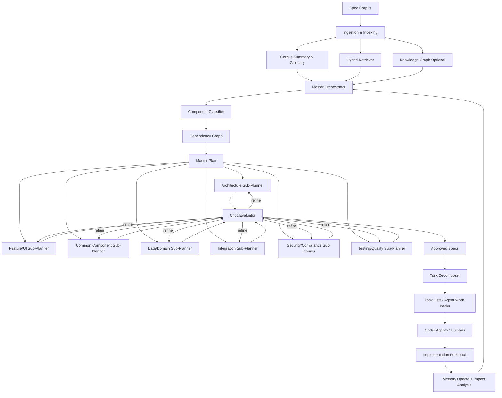

# RouterAgent

> **Self-contained agent definition** for host `generic-swarm-ops`. Body text is embedded from in-pack corpus and va-agent-swarm when available. Do not require external repos to understand this agent.

## Identity

| Field | Value |
|-------|-------|
| **va_id** | 55 |
| **pack_id** | `video.router` |
| **category** | `9-Meta` |
| **domain_id** | `video` |
| **folder** | `business/video/agents/video.router/` |

## Category roster section (full, from agents.md)

_The following is the complete category section from the master roster (includes peers in the same craft category)._


## 9. Specialist Meta-Agents

### 9.1 Orchestration Agents

| # | Agent | Responsibility | Knowledge Distillation Source | Self-Quality Criteria | Surpass-Human Signal | Accepts Critique From | Comments On | Tool Access | Architecture Pattern |
|---|---|---|---|---|---|---|---|---|---|
| 53 | **OrchestratorAgent** | Runs CrewAI/AutoGen/LangGraph DAG; retries, timeouts, fan-out/fan-in | LangGraph + CrewAI + AutoGen patterns; Airflow/Temporal; PGA schedule templates | DAG completion ≥99.5%; SLA adherence; deadlock = 0 | Lower TTD than human EP at same scope | ProducerAgent (scope), JudgeAgent (dispute), HiTL on stall | All agents (resource burn, retry storms) | LangGraph state machine; Temporal workflow engine; Redis (distributed locks); observability (LangSmith) | Agentic Graph (LangGraph) — deterministic DAG execution |
| 54 | **PlannerAgent** | Decomposes brief into phased DAG with assignments + critic gates | PMBOK; CrewAI task graphs; phase templates | Plan validity (no missing gate); cost variance <10% | Tighter, cheaper plans than EP first pass (blind A/B) | ProducerAgent, FinanceAgent (budget) | RouterAgent (wrong pick), OrchestratorAgent | LangGraph plan-gen; cost-estimation models; Gantt/PERT tools | ReAct (decompose → estimate → validate → emit DAG) |
| 55 | **RouterAgent** | Picks right specialist agent (and model) for each subtask | Agent-capability registry; benchmark history (cost/quality/latency) | Routing accuracy ≥95% vs oracle; cost within budget | Beats human producer in agent/vendor selection | OrchestratorAgent, CostOptimizerAgent | PlannerAgent (bad decomposition) | Agent registry DB; benchmark leaderboard cache; pricing APIs | Classifier + ReAct (match task embedding → agent capability) |
| 56 | **JudgeAgent** | Adjudicates disputes via multi-agent debate; scores against rubric | Du 2023 (LLM debate); MT-Bench rubrics; guild scoring sheets | Inter-rater κ vs expert panel ≥0.8 | Higher κ than median human juror | HiTL on overturned rulings | DirectorAgent, ScreenwriterAgent, any disputing pair | MT-Bench/Arena evaluation harness; rubric template engine | Multi-agent debate (Du 2023) + LLM-as-Judge (Zheng 2023) |
| 57 | **GateKeeperAgent** | Phase transitions; verifies L1/L2/L3 criteria; signs C2PA | Stage-gate methodology; PGA Producers Mark; QMS audit | Zero leaked defects; sign-off SLA ≥99% | Lower escaped-defect rate than human QA lead | ComplianceAgent, AIQAConsistencyAgent | OrchestratorAgent (premature advance) | C2PA signing (c2patool); JSON schema validators; rubric evaluation endpoints | Constitutional AI (constitution = phase-gate criteria) |
| 58 | **MemoryAgent** | Episodic + long-term project memory; retrieval for any agent | Reflexion (Shinn 2023); MemGPT; vector-DB best practices | Retrieval precision@5 ≥0.9; freshness SLA | Higher recall than producer's bible at scale | All agents (correction events) | All agents (stale facts) | Pinecone/Weaviate/Qdrant vector DB; MemGPT-style hierarchical memory; embedding models | Reflexion memory architecture (MemGPT extension) |

### 9.2 Creative Agents

| # | Agent | Responsibility | Knowledge Distillation Source | Self-Quality Criteria | Surpass-Human Signal | Accepts Critique From | Comments On | Tool Access | Architecture Pattern |
|---|---|---|---|---|---|---|---|---|---|
| 59 | **IdeationAgent** | Divergent brainstorm of concepts, hooks, taglines | Cannes Grand Prix; D&AD; IDEO design-thinking; SCAMPER/de Bono | Idea-count; novelty (embedding distance); semantic diversity | Wins agency-pitch shootouts on concept density | CreativeDirectorAgent, NoveltyAgent | CopywriterAgent (derivative), DirectorAgent (unfilmable) | Embedding novelty scorer; concept clustering (UMAP); Are.na/Pinterest search | Self-Refine + NoveltyAgent as critic |
| 60 | **NarrativeArcAgent** | 3-act / Save-the-Cat / Hero's Journey structure | Campbell; Snyder *Save the Cat*; Truby; Black List analyses | Beat-sheet coverage 100%; turning-point spacing; arc curve fit | Beats WGA first drafts on structural rubric | ScreenwriterAgent, DirectorAgent | ScreenwriterAgent (sagging middle) | Beat-sheet validator; emotional-arc plotter; structure templates | Self-Refine (rubric: beat-sheet completeness) |
| 61 | **StyleTransferAgent** | Applies named aesthetic consistently across shots | Curated style corpora; LoRA/seed registries; reference-frame banks | Style-similarity (CLIP/DINO) ≥0.85; cross-shot variance ≤τ | Wins blind preference vs human colorist+grader | DirectorAgent, ColoristAgent | GeneratorAgent (off-style) | LoRA weights per style; CLIP/DINO similarity scorer; Runway style-lock mode; ComfyUI | Self-Refine (CLIP style score as feedback) |
| 62 | **WorldBuildingAgent** | Lore, rules, geography, factions, magic/tech systems | Tolkien; *Worldbuilding* (Adams); fan-wikis; series-bible leaks | Internal-consistency (no contradictions); rule-completeness | Lower contradiction rate than writers' bibles at 10× volume | ShowrunnerAgent, FactCheckerAgent | ScreenwriterAgent (lore break), ConceptArtistAgent | Long-context LLM (Gemini 2.5 Pro); contradiction-detection model; wiki-graph DB | Reflexion (contradiction corrections → episodic memory) |
| 63 | **MoodBoardAgent** | Reference boards: visual, sonic, tonal | Pinterest/Are.na; lookbook archives; Spotify-Canvas | Reference coherence (cluster tightness); brief alignment | Faster + tighter boards than art director (blind A/B) | DirectorAgent, ProductionDesignAgent | ConceptArtistAgent (off-mood) | Pinterest/Are.na APIs; Spotify Canvas; CLIP clustering; Figma board generation | ReAct (search → cluster → layout → validate coherence) |
| 64 | **NoveltyAgent / Anti-Cliché Critic** | Flags tropes, clichés, over-fit outputs | TV Tropes; OpenSubtitles n-gram freq; corpus-novelty embeddings | Cliché-hit count; novelty score vs category prior | Catches more clichés than experienced script editor | IdeationAgent, ScreenwriterAgent | ScreenwriterAgent (trope-stuffed), CopywriterAgent (templated) | TV Tropes scraper; n-gram frequency DB; embedding novelty scorer | LLM-as-Judge (anti-cliché constitution) |
| 65 | **EmotionalArcAgent** | Maps valence/arousal curve; suggests beats | Plutchik; affective-computing corpora; Cron *Story Genius* | Curve-fit to target; biosignal-proxy regression accuracy | Better retention prediction than NRG test-screening cards | DirectorAgent, EditorAgent, ComposerAgent | EditorAgent (flat middle), ComposerAgent (cue mismatch) | Sentiment/emotion classifiers (GoEmotions); retention-curve predictor; biosignal proxy model | Self-Refine (emotional-arc curve as rubric target) |

### 9.3 Research Agents

| # | Agent | Responsibility | Knowledge Distillation Source | Self-Quality Criteria | Surpass-Human Signal | Accepts Critique From | Comments On | Tool Access | Architecture Pattern |
|---|---|---|---|---|---|---|---|---|---|
| 66 | **WebResearchAgent** | Live web search, source ranking, citation extraction | Bing/Google/Brave APIs; Common Crawl; Perplexity patterns | Source-grade per claim; citation precision; recency hit | Faster + more sources than newsroom researcher | FactCheckerAgent, CitationAgent | ScriptwriterAgent (uncited claim) | Brave/Google Search API; Jina Reader (web→markdown); source-quality classifier | ReAct (query → fetch → extract → grade → cite) |
| 67 | **ArchiveResearchAgent** | Historical / academic / archival deep search | JSTOR, arXiv, PubMed, AP Archive, Getty, FOIA | Primary-source ratio; archive-coverage breadth | Higher primary-source ratio than doc producer | FactCheckerAgent, SMEAgent | ScriptwriterAgent (secondary-source reliance) | JSTOR/arXiv/PubMed APIs; Getty Images API; FOIA request tools; OCR (Tesseract) | ReAct (formulate query → search archive → extract → grade source) |
| 68 | **TrendIntelligenceAgent** | Detects emerging memes, sounds, formats | TikTok Creative Center; Trendpop; Tubular; Reddit/X firehose | Prediction lead time vs peak; precision/recall on trend list | Earlier detection than human strategists at higher precision | SocialStrategistAgent, CopywriterAgent | IdeationAgent (off-trend) | TikTok Creative Center API; Reddit/X streaming APIs; Sensor Tower; Google Trends | ReAct + time-series anomaly detection |
| 69 | **CompetitorIntelligenceAgent** | What competitors are shipping | Meta Ad Library; TikTok Top Ads; YouTube scrape; release trackers | Coverage % of competitor set; our-novelty vs landscape | More comprehensive than agency strategy decks | BrandAgent, CreativeDirectorAgent | IdeationAgent (derivative) | Meta Ad Library API; TikTok Top Ads; SimilarWeb; YouTube Data API v3 | ReAct (scrape competitor → classify → report gaps) |
| 70 | **CitationAgent** | Normalizes sources; grades primary/secondary/tertiary | Chicago, APA, AP style; SPJ grading; CRAAP test | Citation format 100% valid; primary % ≥target | Lower error rate than newsroom copy desk | FactCheckerAgent, JournalistAgent | WebResearchAgent (weak source) | Citation parsers (AnyStyle); DOI resolver; CRAAP scoring model | Self-Refine (format validator + source grader as rubric) |
| 71 | **InterviewSynthesisAgent** | Synthesizes practitioner interviews into data | Otter/Rev transcripts; consent forms; SAG/WGA templates | Inter-coder agreement on themes; consent integrity | Faster + richer theme extraction than qualitative researcher | ResearchPIAgent (HiTL), ComplianceAgent | SMEAgent (mis-summarized expert) | Otter.ai/Rev API (transcription); thematic coding models; consent-management DB | Reflexion (interviewer refines questions based on theme gaps) |
| 72 | **BenchmarkResearchAgent** | Monitors VBench, EvalCrafter, MT-Bench, FVD, CLIP-T leaderboards | Papers-with-Code; HuggingFace leaderboards; conference proceedings | Coverage of benchmarks; freshness ≤7 days | Faster + broader than ML-research team | OptimizationAgents (any) | All AI agents (stale baselines) | Papers-with-Code API; HuggingFace Hub API; arXiv RSS; VBench leaderboard scraper | ReAct (poll leaderboards → detect change → alert) |

### 9.4 Optimization Agents

| # | Agent | Responsibility | Knowledge Distillation Source | Self-Quality Criteria | Surpass-Human Signal | Accepts Critique From | Comments On | Tool Access | Architecture Pattern |
|---|---|---|---|---|---|---|---|---|---|
| 73 | **PromptOptimizerAgent** | Auto-improves prompts via OPRO/APE/DSPy/Promptbreeder | OPRO (Yang 2023); APE (Zhou 2022); DSPy (Stanford); Promptbreeder (DeepMind) | Score uplift per iteration; convergence speed | Beats hand-tuned prompts on held-out briefs | PromptEngineerAgent, AIQAAgent | PromptEngineerAgent (sub-optimal seed) | DSPy framework (MIPRO optimizer); OPRO implementation; held-out eval harness | DSPy compilation + OPRO meta-optimization |
| 74 | **CostOptimizerAgent** | Routes between models/providers for $/quality | Provider pricing; cost-quality frontiers; FrugalGPT patterns | $/successful-task; Pareto distance from frontier | Lower $/quality than human CFO routing | RouterAgent, FinanceAgent | RouterAgent (over-spend), GeneratorAgent (re-roll burn) | Provider pricing APIs; benchmark cost DB; FrugalGPT cascade logic | ReAct (evaluate task → pick cheapest model meeting threshold) |
| 75 | **LatencyOptimizerAgent** | Parallelization, caching, speculative decoding, batching | vLLM; TensorRT-LLM; distillation; Anyscale/Ray | p50/p95 latency; throughput/GPU-hour | Lower p95 than human-tuned pipeline | OrchestratorAgent | OrchestratorAgent (serial bottleneck) | vLLM; TensorRT-LLM; Ray Serve; Redis (response cache); speculative decoding configs | Tool-use profiling + automated pipeline restructuring |
| 76 | **RetentionOptimizerAgent** | Tunes hook, pacing, structure for AVD/hold-rate | YouTube Analytics benchmarks; TikTok retention curves; AudienceSim | Predicted retention vs actual; AVD lift over control | Beats senior YouTube editor on AVD lift (A/B) | EditorAgent, AudienceSimAgent | EditorAgent (slow opener), ScriptwriterAgent (front fluff) | YouTube Analytics API; retention-curve predictor model; A/B test framework | RLAIF (reward = retention uplift from real analytics) |
| 77 | **ROASOptimizerAgent** | Optimizes ad creatives for performance | Meta Marketing Science; TikTok Ads Academy; MMM/MTA lit | ROAS uplift vs control; significance ≥95% | Beats senior marketer at equal budget | PerformanceMarketerAgent, AnalystAgent | UGCAgent (low hook), CopywriterAgent (weak CTA) | Meta Ads API (creative testing); TikTok Ads; Bayesian MMM tools (Robyn/Meridian) | RLAIF (reward = real ROAS from ad platform feedback) |
| 78 | **AccessibilityOptimizerAgent** | WCAG 2.2 contrast, captions, audio description, color-blind safe | WCAG 2.2; W3C/WAI-ARIA; DCMP captioning key; Deaf/HoH guidelines | Conformance 100% AA, ≥90% AAA; caption WER ≤2% | Catches more a11y defects than ADA-certified auditor | AccessibilityAgent (HiTL), ComplianceAgent | EditorAgent (caption sync), ColoristAgent (contrast) | axe-core/Lighthouse (contrast); Whisper v4 (captioning); audio-description generator | Constitutional AI (constitution = WCAG 2.2 success criteria) |
| 79 | **EvaluationHarnessAgent** | Runs benchmarks (VBench, EvalCrafter, MT-Bench, FVD, CLIP-T); posts regressions | Papers-with-Code; HuggingFace leaderboards; benchmark repos | Regression precision/recall; alert latency <1h | Catches regressions faster than ML-eng rotation | BenchmarkResearchAgent | All AI agents (regression alerts) | VBench suite; EvalCrafter; MT-Bench harness; CI/CD (GitHub Actions); alerting (PagerDuty) | Tool-use / ReAct (run benchmark → compare → alert if regressed) |
| 80 | **SafetyRedTeamAgent** | Adversarially attacks for deepfake, bias, jailbreak, defamation | Hany Farid benchmarks; Partnership on AI Framework; OWASP LLM Top 10 | Attack-success kept ≤1%; taxonomy coverage | Higher coverage than internal red-team rotation | EthicsAgent (HiTL), ComplianceAgent | AvatarDesignAgent, VoiceCloneAgent, AllGenerators | Deepfake detectors (Farid lab models); bias probes; jailbreak prompt banks; OWASP scanner | Multi-agent debate (red-team vs defender) + adversarial search |

---


## Responsibility

Picks right specialist agent (and model) for each subtask

## Knowledge distillation sources

Agent-capability registry; benchmark history (cost/quality/latency)

## Self-quality criteria

Routing accuracy ≥95% vs oracle; cost within budget

## Surpass-human signal

Beats human producer in agent/vendor selection

## Critique bus

- **Accepts critique from:** OrchestratorAgent, CostOptimizerAgent

- **Comments on:** PlannerAgent (bad decomposition)

## Tools (design-time documentation)

Agent registry DB; benchmark leaderboard cache; pricing APIs

**Runtime safety:** Host allow-lists are only `agent_spec.json` + `tool-permission-register.json`. CI uses video_* stubs. Do not treat design-time vendor names as enabled APIs.

## Architecture pattern

Classifier + ReAct (match task embedding → agent capability)

## Common structure of an AI agent (full §11 from agents.md)

## 11. Common Structure of an AI Agent

Every agent — regardless of category — implements this skeleton. Derived from the source document's architecture patterns (§1), critique protocol (§6), and universal success-criteria framework (§5), enriched with current (2026) tooling research.

### 11.1 Architecture Diagram

The diagram below presents the common agent as a professional operating architecture rather than a simple component sketch. It shows how **orchestration**, the **input contract**, **knowledge and tool surfaces**, the internal **plan → act → self-review** loop, **traceability and provenance controls**, the **3-layer quality gate** (Spec → Rubric → Preference), **release packaging**, **peer critique**, **human escalation**, and **continuous improvement** work together as one governed system.


> **Tip:** view the diagram fullscreen on GitHub by clicking it, or download [`common-agent-structure.svg`](./common-agent-structure.svg) directly. The SVG is designed as a presentation-grade reference for architecture reviews and implementation planning.

### 11.2 Component Reference Table

| # | Component | Purpose | Mechanism / Implementation Notes |
|---|---|---|---|
| 1 | **Identity** | Stable unique handle for routing, logging, provenance | Kebab-case ID + semantic version (e.g. `director-agent@2.1.0`). Registered in the agent-capability registry used by RouterAgent. |
| 2 | **Responsibility (Scope)** | Single-sentence definition of what the agent owns | Mirrors a human craft role. Prevents scope overlap via explicit boundary documented in the registry. |
| 3 | **Knowledge Distillation Source** | Licensed/consented corpora the agent is trained or RAG-grounded on | Award archives, academic papers, expert interviews, peer-reviewed journals. Refreshed via Continuous Distillation Loop (§7 of source). |
| 4 | **Tool Access** | External APIs, generators, validators, DCC bridges | Video gen: Sora 2, Veo 3.1 (Gemini API), Runway Gen-4/Aleph, Kling 3.0. Voice: ElevenLabs v3, Sync.so, HeyGen. DCC: Resolve/Nuke/AE via MCP bridges. All accessed via MCP (Model Context Protocol, Anthropic 2024). |
| 5 | **Architecture Pattern** | Reasoning/learning loop powering the agent | One or more of: Self-Refine [1], Reflexion [2], RLAIF/Constitutional AI [3], Multi-agent debate [4], LLM-as-Judge [5], Pairwise preference (Arena) [5], ReAct [6], Agentic Graph (LangGraph/CrewAI/AutoGen) [7], DSPy/OPRO prompt optimization [8]. |
| 6 | **Memory** | Episodic + long-term project memory | Vector DB (Pinecone/Weaviate/Qdrant) accessed via MemoryAgent. Implements MemGPT-style hierarchical memory with summarization and eviction. Reflexion agents store verbal self-feedback here. |
| 7 | **Constitution / Rubric** | Written, role-specific scoring guide for self-check | Examples: Murch's Rule of Six (Editor), 12 Principles (Animator), Save-the-Cat beats (Screenwriter), WCAG 2.2 (Accessibility), FAA Part 107 (Drone), SAG-AFTRA AI rider (Consent). Used as the "constitution" in Constitutional AI pattern. |
| 8 | **Self-Quality: L1 Spec** | Did the output meet the structured brief? | JSON schema validation + tool validators (codec, LUFS, aspect ratio, frame count, file format). Must pass 100%. |
| 9 | **Self-Quality: L2 Rubric** | Does it meet craft rubric for this role? | LLM-as-Judge (Zheng 2023) with role-specific constitution. Must score ≥85/100. Up to 3 Self-Refine iterations if below threshold. |
| 10 | **Self-Quality: L3 Preference** | Would target audience choose this over human baseline? | Pairwise comparison: AudienceSim panel (≥200 simulated personas + ≥20 HiTL samples). Win rate ≥50% (parity) or ≥55% (surpass). |
| 11 | **Surpass-Human Signal** | Pre-registered proof the agent exceeds a credentialed professional | Benchmark dominance; blind Arena preference ≥55%; speed × quality (equal L2 at ≤10% turnaround); lower 90-day defect rate; certification pass; higher novelty at equal quality. |
| 12 | **Critique Inbox** | Channel for receiving structured feedback from peers | Shared `CritiqueMessage` JSON bus. Severities: blocker (halts DAG), major (Self-Refine ≤3 iters), minor/nit (logged for RLAIF). Disputes → JudgeAgent multi-agent debate → HiTL if unresolved. |
| 13 | **Critique Outbox** | Peer agents whose work this agent is qualified to review | Defined per-agent in roster. Messages emitted on same bus. Evidence-backed, rubric-referenced, appended to C2PA provenance. |
| 14 | **HiTL Escalation** | When a human must be brought in | Consent (SAG-AFTRA AI rider, EU AI Act Art. 50); final legal sign-off; MPA rating; festival eligibility; crisis comms; cross-cultural sensitivity. |
| 15 | **Provenance (C2PA)** | Cryptographic signing of every artifact | Every emitted artifact signed with C2PA (c2patool). Downstream agents verify chain. Accepted critiques appended to manifest. Platforms (YouTube, TikTok, Meta) auto-label based on C2PA presence. |
| 16 | **Continuous Learning** | How the agent keeps improving post-deployment | Bootstrap (licensed corpora) → Expert interviews (paid, consented) → Live RLAIF (DPO/KTO) → Award-rubric grounding → Adversarial red-team → 30/60/90-day reality check (retention, ROAS, awards). |
| 17 | **Orchestration Integration** | How the agent fits the multi-agent graph | Registered as a node in LangGraph/CrewAI/AutoGen DAG. OrchestratorAgent schedules; PlannerAgent assigns; RouterAgent selects model/provider; GateKeeperAgent verifies L1-L3 before advancing. |

### CritiqueMessage Schema (Universal)

```json
{
  "critique_id": "uuid",
  "from_agent": "EditorAgent",
  "to_agent": "DirectorAgent",
  "artifact_ref": "shot_42_take_3.mp4",
  "severity": "blocker | major | minor | nit",
  "category": "pacing | continuity | accuracy | compliance | accessibility | brand | craft",
  "evidence": ["timecode 00:01:14 — held 1.4s past cut point per genre prior"],
  "suggested_action": "trim 1.0s; re-evaluate hold",
  "rubric_reference": "Murch Rule of Six §3",
  "must_resolve_before": "phase_4_review"
}
```

### Composition Diagram

```text
[Brief] ──► PlannerAgent ──► OrchestratorAgent ──► RouterAgent ──► (52 craft agents §1–§8)
                 ▲                  │                                       │
                 │                  ▼                                       ▼
             MemoryAgent      GateKeeperAgent ◄─── JudgeAgent ◄──── CritiqueMessages
                                    ▲                                       ▲
                                    │                                       │
            [Creative meta:] IdeationAgent · NarrativeArcAgent · StyleTransferAgent · MoodBoardAgent · NoveltyAgent · EmotionalArcAgent
            [Research meta:] WebResearchAgent · ArchiveResearchAgent · TrendIntelAgent · CompetitorIntelAgent · CitationAgent · InterviewSynthAgent · BenchmarkResearchAgent
            [Optimization meta:] PromptOptimizerAgent · CostOptimizer · LatencyOptimizer · RetentionOptimizer · ROASOptimizer · AccessibilityOptimizer · EvalHarnessAgent · SafetyRedTeamAgent
```

---

## Shared references (from agents.md §12)

## 12. References

### Foundational Papers (Architecture Patterns)

| Ref | Paper | Key Contribution | Link |
|---|---|---|---|
| [1] | Madaan et al., "Self-Refine: Iterative Refinement with Self-Feedback," NeurIPS 2023 | Agent drafts → self-critiques against rubric → revises iteratively without weight updates | [arXiv:2303.17651](https://arxiv.org/abs/2303.17651) |
| [2] | Shinn et al., "Reflexion: Language Agents with Verbal Reinforcement Learning," NeurIPS 2023 | Verbal self-reflection stored in episodic memory buffer to improve decisions in subsequent trials | [arXiv:2303.11366](https://arxiv.org/abs/2303.11366) |
| [3] | Bai et al., "Constitutional AI: Harmlessness from AI Feedback," 2022 | Reward signal from AI critic governed by a written constitution; RLAIF without human labels | [arXiv:2212.08073](https://arxiv.org/abs/2212.08073) |
| [4] | Du et al., "Improving Factuality and Reasoning in Language Models through Multiagent Debate," 2023 | Multiple LLM agents debate; improves factuality and reasoning across tasks | [arXiv:2305.14325](https://arxiv.org/abs/2305.14325) |
| [5] | Zheng et al., "Judging LLM-as-a-Judge with MT-Bench and Chatbot Arena," NeurIPS 2023 | GPT-4 judge achieves >80% agreement with human preferences; scalable evaluation | [arXiv:2306.05685](https://arxiv.org/abs/2306.05685) |
| [6] | Yao et al., "ReAct: Synergizing Reasoning and Acting in Language Models," ICLR 2023 | Interleaving reasoning traces with tool-use actions for grounded decision-making | [arXiv:2210.03629](https://arxiv.org/abs/2210.03629) |
| [7] | LangGraph / CrewAI / AutoGen (2024–2026) | Agentic graph orchestration: DAG with state, handoffs, review gates, human-in-the-loop | [LangGraph](https://github.com/langchain-ai/langgraph), [CrewAI](https://github.com/crewAIInc/crewAI), [AutoGen](https://github.com/microsoft/autogen) |
| [8] | Yang et al., "Large Language Models as Optimizers" (OPRO), 2023; Khattab et al., DSPy (Stanford, 2023–2026) | Meta-optimization of prompts using LLMs; DSPy compiles declarative LM programs into optimized pipelines | [OPRO arXiv:2309.03409](https://arxiv.org/abs/2309.03409), [DSPy](https://github.com/stanfordnlp/dspy) |

### Evaluation Benchmarks

| Benchmark | Scope | Link |
|---|---|---|
| VBench / VBench 2.0 | Video generation quality — 16 dimensions (temporal + frame-wise); VBench 2.0 adds Human Fidelity, Creativity, Physics | [arXiv:2311.17982](https://arxiv.org/abs/2311.17982), [VBench 2.0: arXiv:2503.21755](https://arxiv.org/abs/2503.21755) |
| EvalCrafter | Text-to-video — 18 metrics across visual, content, motion quality | [arXiv:2310.11440](https://arxiv.org/abs/2310.11440) |
| MT-Bench / Chatbot Arena | LLM output quality via pairwise human + LLM-judge evaluation | [arXiv:2306.05685](https://arxiv.org/abs/2306.05685) |

### Generative Video Models (Tool Access — 2026 landscape)

| Model | Provider | Key Capabilities | Access |
|---|---|---|---|
| Sora 2 / Sora 2 Pro | OpenAI | Synchronized dialogue + SFX + background audio; cinematic/realistic/anime styles; 1080p 20s | [OpenAI Videos API](https://developers.openai.com/api/docs/models/sora-2) (discontinuing Sept 2026) |
| Veo 3.1 | Google DeepMind | 4K / 1080p / 720p, 8s; native audio; configurable 16:9 & 9:16; multi-image reference for character/object direction | [Gemini API](https://ai.google.dev/gemini-api/docs/video) / [Vertex AI](https://docs.cloud.google.com/vertex-ai/generative-ai/docs/models/veo/3-1-generate) |
| Runway Gen-4 / Gen-4.5 / Aleph | Runway | ControlNet guides, camera paths, style-lock, Layout Sketch; Aleph for video-to-video editing | [Runway API](https://docs.dev.runwayml.com/) |
| Kling 3.0 | Kuaishou | Cinematic motion realism; physics accuracy; motion-control (reference video); native audio | [Kling API (fal.ai)](https://fal.ai/models/fal-ai/kling-video) |

### Voice & Avatar Tools (2026)

| Tool | Provider | Capabilities |
|---|---|---|
| ElevenLabs v3 | ElevenLabs | Expressive TTS; instant/professional voice cloning; dialogue mode (multi-speaker); Projects API for long-form; Sound FX generation | [Docs](https://elevenlabs.io/docs) |
| HeyGen Avatar IV | HeyGen | Photoreal AI avatars; 175+ languages lip-sync; ElevenLabs integration; personalization API | [HeyGen](https://www.heygen.com) |
| Synthesia | Synthesia | Enterprise AI avatars at scale; SCORM-compatible; brand-controlled | [Synthesia](https://www.synthesia.io) |
| Sync.so / Wav2Lip | Open-source + API | Lip-sync overlays; phoneme-viseme alignment | [Sync.so](https://sync.so) |

### Infrastructure Standards

| Standard | Purpose | Status (2026) |
|---|---|---|
| C2PA (Content Provenance) | Cryptographic manifest signing for every AI-generated artifact; platforms (YouTube, TikTok, Meta) auto-label | EU AI Act Code of Practice (March 2026) mandates C2PA + watermarking combined. Over 2,300 tools support. [contentauthenticity.org](https://contentauthenticity.org/blog/the-state-of-content-authenticity-in-2026) |
| MCP (Model Context Protocol) | Open standard for LLM ↔ tool integration; 2,300+ public servers; adopted by Claude, VS Code, Cursor, etc. | Donated to Agentic AI Foundation (Linux Foundation, Dec 2025) by Anthropic + OpenAI + Block. [modelcontextprotocol.io](https://modelcontextprotocol.io) |
| DSPy | Framework for programming (not prompting) LLMs; compiles declarative pipelines into optimized prompts/finetunes | Stanford-maintained; MIPRO optimizer; used by PromptOptimizerAgent for automated prompt improvement. [github.com/stanfordnlp/dspy](https://github.com/stanfordnlp/dspy) |

---

*Generated: May 2026. Source: [`ai_agent_video_production_workflow.md`](./ai_agent_video_production_workflow.md). Core layout restored from `agents_old.md`; missing workflow-support content merged into the same table-driven structure.*

## Deep specifications (full embedded content)


### Document: `study/llm_usage_functional_specification.md`

_Embedded from `corpus/study/llm_usage_functional_specification.md`. Also stored at `sources/study/llm_usage_functional_specification.md` under this agent folder._


# Build Central LLM API Usage & Cost Dashboard App

## Project Name Suggestion
**LLMUsageHub** or **MultiLLM Dashboard** or **API Cost Central** or **LLM Spend Tracker**

## 1. Project Overview
Create a **web application** that provides a **single central view** for tracking usage, costs, balances, spending, and token consumption across **all** of the user's LLM API accounts.

The user currently has accounts with:  
- x.ai (Grok API)  
- Poe  
- MiniMax  
- Kimi (Moonshot AI)  
- OpenRouter  
...and many others.

The app should let the user add their API keys once and see **everything aggregated in one beautiful dashboard** — total monthly spend, remaining credits, per-provider breakdowns, charts, trends, alerts, etc.

**Reference / Inspiration**:
Inspired by **[cc-switch](https://github.com/farion1231/cc-switch)** (the popular desktop tool for managing LLM providers for Claude Code / Codex / Gemini CLI). This web app is **purely focused on usage/cost analytics** across direct personal API keys, serving as a usage-only companion to cc-switch but as a web application.

## 2. Core Goals
- One unified place to monitor **all** LLM spending and usage.
- Secure, local-only storage of API keys (never sent to any server).
- Automatic or on-demand fetching of usage/billing data.
- Historical tracking + visualizations.
- Extremely extensible — easy to add new providers.
- Beautiful, modern UI similar to cc-switch.

## 3. Key Features (Must-Have)

### Provider Management
- Add / edit / remove accounts with: name, provider type (preset), API key, base URL (for custom endpoints), notes.
- Pre-built **presets** for as many providers as possible (see section 4).
- Support multiple accounts per provider.
- One-click “Refresh All” and individual refresh buttons.

### Usage & Balance Fetching
- Prefer **official APIs** where available (e.g. `/usage`, `/billing`, `/balance`, `/v1/token_plan/remains`, etc.).
- Fallback options:
  - Manual entry of current usage/balance.
  - Web dashboard scraping (using Playwright if needed, last resort).
- Background auto-refresh (configurable interval) + manual refresh.
- Store full history snapshots in local DB.

### Dashboard UI
- **Overview page**:
  - Total estimated USD spend (today / this month / all time).
  - Total remaining credits/balance (normalized where possible).
  - Number of active providers + quick status.
- **Provider cards** (grid or list):
  - Name + logo (if available).
  - Current balance / remaining credits.
  - Spend this month + trend indicator.
  - Last updated timestamp.
- **Charts**:
  - Spending trend (line chart — daily/weekly).
  - Cost breakdown by provider (pie).
  - Token usage by model (bar).
  - Usage heatmap or calendar view.
- **Detailed tables**:
  - Per-provider usage history.
  - Model-level breakdown.
- **Alerts**:
  - Low balance warnings (configurable thresholds).
  - High daily spend notifications.

### Cost Calculation
- Built-in pricing tables for major models (input/output tokens → USD).
- Allow user to override pricing per model.
- Show estimated USD even when provider only reports tokens.

### Data Persistence & Export
- Local **SQLite** database for all historical usage snapshots.
- Export full data as CSV or JSON.

### Security & UX
- API keys stored **encrypted** locally (Fernet symmetric encryption).
- Dark/light theme (default dark, matching modern AI tools).
- Browser-based UI accessible from localhost.
- Fully offline-first after initial setup.
- Responsive, clean, professional UI.

### Nice-to-Have (Phase 2)
- AI-powered insights (“You spent 68% on Kimi this month — consider switching heavy tasks to Groq”).
- Import/export configuration (including possible cc-switch import).
- Per-model cost forecasting.
- Optional proxy/router mode (like LiteLLM or cc-switch) so the app can also log usage from actual API calls.

## 4. Supported Providers (List as Many as Possible)
The app must ship with **pre-built presets** (fetch logic + pricing) for **as many providers as possible**. Start with user-mentioned ones, then expand.

**High Priority (User’s Current Providers)**
- xAI (Grok API) — console.x.ai usage / billing endpoints
- Poe.com — usage/points_history and current_balance endpoints
- OpenRouter — account usage API
- MiniMax — token plan remains and usage endpoints
- Kimi (Moonshot AI) — platform.moonshot.ai usage/balance API

**Other Major Providers (Include Full Presets)**
- OpenAI
- Anthropic (Claude)
- Google Gemini / Vertex AI
- Groq
- Mistral AI
- Together.ai
- Fireworks.ai
- DeepSeek
- SiliconFlow
- Zhipu AI (GLM / ChatGLM)
- Baichuan
- StepFun
- Alibaba (DashScope / Qwen)
- Baidu (ERNIE)
- Tencent (Hunyuan)
- iFlytek (Spark)
- 01.AI
- Cohere
- Perplexity
- Replicate
- Hugging Face Inference Endpoints
- Novita.ai
- Lepton AI
- Azure OpenAI
- AWS Bedrock (if possible via API or manual)
- Any custom OpenAI-compatible endpoint (user can add base URL + key)

For providers without public usage APIs, still include presets with:
- Manual balance entry
- Notes on how to copy-paste from their dashboard

## 5. Technical Stack

### Backend
- **Framework**: Python 3.11+ with FastAPI
- **API**: OpenAPI 3.1 (auto-generated from FastAPI, browsable at /docs)
- **Database**: SQLite with SQLAlchemy ORM
- **HTTP Client**: httpx (async)
- **Security**: API keys encrypted at rest using cryptography Fernet
- **Background Tasks**: FastAPI BackgroundTasks + APScheduler

### API Design (OpenAPI)
- RESTful endpoints for all CRUD operations
- Automatic OpenAPI schema generation
- Interactive API docs via Swagger UI at /docs
- ReDoc alternative at /redoc

### Frontend
- **Framework**: React 18 + TypeScript
- **Build Tool**: Vite
- **Styling**: TailwindCSS + shadcn/ui
- **Charts**: Recharts
- **State Management**: Zustand
- **HTTP Client**: Axios or fetch API

### Architecture
- **Web App** (not desktop) — runs locally in browser
- Backend runs as a local server (localhost:8000)
- Frontend served by FastAPI static files or separate Vite dev server
- 100% local — no cloud sync unless explicitly added later

## 6. Development Phases (Suggested)
1. Project setup (FastAPI backend + React frontend + SQLite).
2. Provider management + secure key storage.
3. Core usage fetcher system (abstract interface).
4. Implement 5–6 high-priority providers (xAI, Poe, OpenRouter, MiniMax, Kimi, OpenAI).
5. Dashboard UI + charts.
6. Add remaining providers + pricing tables.
7. Background refresh, alerts, export, polish.
8. Testing + documentation.

## 7. Deliverables
- Complete source code with excellent comments and README.
- Clear instructions on **how to add a new provider** (new Python module + pricing config).
- Setup scripts for running locally with FastAPI + React.
- Sample data / test mode.
- License: MIT (or whatever user prefers).

This spec should give the coding agent everything needed to build a production-ready, beautiful, and highly useful central usage dashboard. Feel free to ask the user for clarification on specific provider APIs or preferred tech choices.

**Ready to code!** 🚀


### Document: `plan/planner_agent_v2.1.md`

_Embedded from `corpus/plan/planner_agent_v2.1.md`. Also stored at `sources/plan/planner_agent_v2.1.md` under this agent folder._


# SIPA — Software Implementation Planner Agent

## Complete Research-Hardened Specification & Design Document

**Version:** 2.1 — Research-Hardened, Security-Operationalized  
**Date:** 2026-06-03  
**Status:** Production-Ready Design Spec  
**Primary Goal:** Convert very large software-specification corpora into high-fidelity, traceable, component-type-adaptive implementation plans and granular tasks for AI coding agents and human developers.

---

## Change Summary — v2.0 → v2.1

This revision is a deep-research pass and adversarial “100x rethink” consolidation. It does **not** merely expand the previous document; it tightens the system into an implementable, governable, security-aware planner.

### Major Improvements

1. **Research verification and correction**
   - Verified MAAD as arXiv:2606.01385, submitted May 31, 2026, and preserved it as the core architecture-planning influence. ([arxiv.org](https://arxiv.org/abs/2606.01385))
   - Updated AgentOrchestra reference: current arXiv title emphasizes the Tool-Environment-Agent, or TEA, protocol and lifecycle-aware orchestration rather than only “general-purpose task solving.” ([arxiv.org](https://arxiv.org/abs/2506.12508))
   - Updated GitHub Spec Kit alignment to include the current Spec → Plan → Tasks → Implement flow plus newer practical commands such as constitution, clarify, analyze, checklist, and task-to-issues. ([github.github.com](https://github.github.com/spec-kit/))
   - Qualified xAI/Grok Build claims: official xAI pages verify plan mode, parallel subagents, skills/plugins/hooks/MCP, headless mode, and API availability; this spec no longer depends on unofficial “Arena Mode” claims and instead defines SIPA’s own optional local “Arena Evaluator.” ([x.ai](https://x.ai/news/grok-build-cli))

2. **Added security and trust model**
   - Added prompt-injection, memory-poisoning, MCP/tool safety, least-privilege execution, untrusted-context boundaries, and human approval controls.
   - Integrated NCSC guidance that LLMs do not enforce a hard data/instruction boundary and should be treated as “inherently confusable” components. ([ncsc.gov.uk](https://www.ncsc.gov.uk/blog-post/prompt-injection-is-not-sql-injection))
   - Integrated MCP security principles around user consent, tool safety, data privacy, and untrusted tool descriptions. ([modelcontextprotocol.io](https://modelcontextprotocol.io/specification/2025-03-26/index))
   - Added OWASP GenAI/agentic risk alignment and operational monitoring requirements. ([genai.owasp.org](https://genai.owasp.org/2026/04/14/owasp-genai-exploit-round-up-report-q1-2026/))

3. **Strengthened context engineering**
   - Formalized SIPA’s context pipeline around **write, select, compress, isolate**, matching current agent context-engineering practice. ([langchain.com](https://www.langchain.com/blog/context-engineering))
   - Added retrieval budgets, evidence ledgers, source confidence levels, retrieval evaluation, and stale-source detection.
   - Added optional GraphRAG-style global/local retrieval for corpus-wide sensemaking and dependency impact analysis. ([microsoft.com](https://www.microsoft.com/en-us/research/project/graphrag/?msockid=334382bc6c746f231ca6946e6d716e0a))

4. **Expanded component taxonomy**
   - Added Security/Compliance, Testing/Quality, Migration/Legacy, AI/Agent Workflow, and Documentation/Developer Experience component types.
   - Added secondary risk tags that directly change retrieval depth, critic rubrics, and human-review requirements.

5. **Made outputs more machine-consumable**
   - Added artifact manifests, evidence ledgers, decision logs, task execution contracts, and canonical schemas.
   - Added stable IDs for requirements, claims, decisions, interfaces, tasks, risks, and open questions.

6. **Added evaluation science**
   - Added retrieval metrics, plan-quality metrics, artifact-level critic thresholds, and downstream coder-agent success metrics.
   - Integrated RAG evaluation dimensions such as context relevance, answer faithfulness, answer relevance, context precision, and context recall. ([aclanthology.org](https://aclanthology.org/2024.naacl-long.20/?utm_source=openai))

7. **Improved implementation roadmap**
   - Split MVP into a safer vertical slice.
   - Added CLI/API/MCP deployment model, observability, cache strategy, sandbox strategy, and governance gates.

---

## Table of Contents

1. Executive Summary
2. Core Problem
3. Research Foundation
4. Design Principles
5. Component Taxonomy
6. System Architecture
7. Agent Roles
8. End-to-End Workflow
9. Context Engineering, RAG, and Memory
10. Critic/Evaluator Subsystem
11. Security and Trust Model
12. Data Models and Schemas
13. Output Artifacts
14. Implementation Roadmap
15. Tool and Harness Integration
16. Metrics and Success Criteria
17. Risks and Mitigations
18. Future Roadmap
19. References

---

## 1. Executive Summary

SIPA is a hierarchical, context-engineered, multi-agent planning system for turning large software specification corpora into implementation-ready plans and tasks.

It is designed for projects where the source material may include:

- Markdown specs
- PRDs
- architecture notes
- API contracts
- user stories
- domain models
- UI descriptions
- ADRs
- implementation notes
- test plans
- legacy migration notes
- operational constraints

The key idea is simple but powerful:

> **Different software components require different levels and types of detail.**

A strategic architecture plan should not be generated with the same retrieval scope, summarization style, or output format as a UI screen, a shared library, a data model, or a migration adapter.

SIPA therefore uses:

- **Component-type classification**
- **Scoped retrieval**
- **Evidence-based synthesis**
- **Hierarchical memory**
- **Embedded critic loops**
- **Traceability-first artifacts**
- **Granular task generation**
- **Security-aware agent execution**

The result is a planner that reduces context size for downstream coding agents while improving fidelity, traceability, and implementation success.

---

## 2. Core Problem

Large software specs break AI coding workflows in predictable ways:

1. **Context overload**
   - Too much raw documentation causes distraction, contradiction, and missed details.

2. **Uniform summarization failure**
   - Architecture needs synthesis.
   - UI features need exhaustive local detail.
   - Shared components need contracts.
   - Data models need invariants.
   - Integrations need error semantics and compatibility rules.

3. **Loss of traceability**
   - Coding agents often implement plausible behavior that is not grounded in the source spec.

4. **Weak plan-to-task translation**
   - Large plans often become vague tasks.
   - Vague tasks create bad code, rework, and hidden assumptions.

5. **Security and tool-risk amplification**
   - Agentic coding tools can read files, run commands, call APIs, and modify repos.
   - Prompt injection, over-permissioned tools, and memory poisoning become architectural risks, not just prompt risks.

SIPA exists to solve these problems before coding begins.

---

## 3. Research Foundation

### 3.1 Spec-Driven Development

GitHub Spec Kit treats specifications as the center of AI-assisted development and ships a core flow of **Spec → Plan → Tasks → Implement**. It also provides Markdown artifacts, quality checklists, and cross-artifact analysis, making it a strong workflow model for SIPA’s output structure. ([github.github.com](https://github.github.com/spec-kit/))

SIPA extends this model for **pre-existing massive corpora**, not just greenfield features. It adds corpus indexing, type-aware planning, traceability enforcement, and critic loops.

### 3.2 MAAD and Requirements-to-Architecture Planning

MAAD proposes four specialized agents — Analyst, Modeler, Designer, and Evaluator — to convert requirements into multi-view architectural blueprints with quality assessments. It uses RAG for architecture standards and patterns, hierarchical memory for design history, and an evaluator for structured quality reports. ([arxiv.org](https://arxiv.org/abs/2606.01385))

SIPA adopts MAAD most directly for the Architecture Sub-Planner, then generalizes the same analyst/designer/evaluator structure across other component types.

### 3.3 Hierarchical Multi-Agent Orchestration

AgentOrchestra’s current formulation introduces TEA, a Tool-Environment-Agent protocol that treats agents, tools, environments, prompts, memory, and outputs as versioned lifecycle-managed resources. It also uses a central planner coordinating specialized sub-agents. ([arxiv.org](https://arxiv.org/abs/2506.12508))

SIPA adopts the practical lesson: orchestration should not be “agents chatting.” It should be explicit state, typed handoffs, versioned artifacts, and lifecycle-aware execution.

### 3.4 Multi-Agent Software Engineering Patterns

The LLM-based multi-agent systems survey identifies role specialization, SDLC coverage, agent synergy, and trustworthy autonomous software engineering as major research directions. ([arxiv.org](https://arxiv.org/abs/2404.04834))

MASAI shows the value of modular sub-agents with separate objectives and strategies for software-engineering tasks, including avoiding unnecessarily long trajectories and excessive context. ([arxiv.org](https://arxiv.org/abs/2406.11638?utm_source=openai))

SWE-agent demonstrates that the interface between agent and computer materially affects coding-agent performance, motivating SIPA’s emphasis on harness-native task packaging. ([arxiv.org](https://arxiv.org/abs/2405.15793?utm_source=openai))

SWE-Search supports the value of self-evaluation and iterative refinement for repository-level software tasks. ([proceedings.iclr.cc](https://proceedings.iclr.cc/paper_files/paper/2025/hash/a1e6783e4d739196cad3336f12d402bf-Abstract-Conference.html?utm_source=openai))

### 3.5 Context Engineering

Modern agent design increasingly treats context engineering as a first-class discipline. LangChain’s current framework groups context strategies into **write, select, compress, and isolate**, which SIPA adopts as its core context model. ([langchain.com](https://www.langchain.com/blog/context-engineering))

SIPA applies this as follows:

- **Write:** Persist plans, decisions, summaries, memory, and evidence outside the prompt.
- **Select:** Retrieve only the task-relevant source chunks, patterns, and memories.
- **Compress:** Summarize and extract with source-preserving compression.
- **Isolate:** Give each sub-planner a scoped context window rather than the entire corpus.

### 3.6 GraphRAG and Corpus Sensemaking

GraphRAG combines text extraction, network analysis, LLM prompting, and summarization to understand text datasets. Microsoft’s GraphRAG project is especially relevant for corpus-wide themes and dependency discovery. ([microsoft.com](https://www.microsoft.com/en-us/research/project/graphrag/?msockid=334382bc6c746f231ca6946e6d716e0a))

SIPA uses graph retrieval optionally, but the architecture is designed so a simpler hybrid vector/BM25 retriever can be used first.

### 3.7 Architecture Standards

SIPA’s architecture outputs are aligned with:

- **ISO/IEC/IEEE 42010** concepts of stakeholders, concerns, viewpoints, and views. ([iso-architecture.org](https://www.iso-architecture.org/ieee-1471/cm/?utm_source=openai))
- **C4 model** levels: system context, container, component, and code, with an emphasis on only producing diagrams that add value. ([c4model.com](https://c4model.com/diagrams?utm_source=openai))
- **ATAM** for reasoning about quality-attribute tradeoffs and architectural risks. ([sei.cmu.edu](https://www.sei.cmu.edu/library/the-architecture-tradeoff-analysis-method/?utm_source=openai))
- **Kruchten 4+1 views** for multi-perspective architecture description. ([scirp.org](https://www.scirp.org/reference/referencespapers?referenceid=2072965&utm_source=openai))

### 3.8 Security Research and Agentic Risk

NCSC warns that current LLMs do not enforce a true boundary between data and instructions, so prompt injection should be treated as an inherent residual risk that must be reduced through system design and impact limitation. ([ncsc.gov.uk](https://www.ncsc.gov.uk/blog-post/prompt-injection-is-not-sql-injection))

OWASP’s GenAI exploit reporting shows AI security incidents are increasingly targeting agent identities, orchestration layers, supply chains, permissions, and validation controls rather than only model outputs. ([genai.owasp.org](https://genai.owasp.org/2026/04/14/owasp-genai-exploit-round-up-report-q1-2026/))

The MCP specification explicitly notes that MCP enables arbitrary data access and code execution paths, requiring user consent, data privacy controls, and caution around tool behavior descriptions. ([modelcontextprotocol.io](https://modelcontextprotocol.io/specification/2025-03-26/index))

SIPA therefore treats security as a core subsystem, not a postscript.

---

## 4. Design Principles

1. **Type-aware planning**
   - Every component gets the planning style it actually needs.

2. **Traceability before creativity**
   - SIPA may synthesize, but every major claim must be grounded in source evidence or explicitly marked as an assumption.

3. **Small context, high signal**
   - Never feed the full corpus to a sub-planner unless the task is corpus-level analysis.

4. **Critic-first quality culture**
   - Drafts are not final until they pass structured quality gates.

5. **Living specifications**
   - Plans are versioned, diffable, and updated as implementation changes.

6. **Harness-native outputs**
   - Outputs must be directly useful to Cursor, Claude Code, Kiro, Grok Build, OpenWebUI, custom CLI agents, or human developers.

7. **Security by architecture**
   - Tool access, memory, retrieval, source trust, and approval flows must be explicitly governed.

8. **Human gates where risk is high**
   - Human review is required for strategic, security-critical, destructive, or high-cost decisions.

9. **Evaluation built in**
   - Retrieval quality, traceability, consistency, implementability, and downstream success are measured.

10. **Composable implementation**
   - SIPA can start as a CLI and later expose MCP/API integrations.

---

## 5. Component Taxonomy

The taxonomy controls:

- Retrieval strategy
- Context budget
- Planner selection
- Output template
- Critic rubric
- Human-review requirement
- Task decomposition style

### 5.1 Primary Component Types

| Type | Detail Level | Retrieval Strategy | Output Emphasis | Example |
|---|---:|---|---|---|
| Architecture / Strategic | High-level synthesis | Broad cross-corpus retrieval + ASRs/NFRs + patterns | Views, ADRs, tradeoffs, quality attributes | System architecture, service topology |
| Feature / UI / Tactical | Deep scoped detail | Narrow feature retrieval + full local excerpts | User stories, acceptance criteria, flows, state, validation | Dashboard, onboarding flow |
| Common / Shared Component | Contract-focused | Cross-module references + interface mentions | APIs, types, invariants, extension points | Auth service, notification library |
| Data / Domain Model | Medium | Entities, relationships, invariants, lifecycle rules | Schemas, aggregates, constraints, migrations | User, Order, Course, ExamAttempt |
| Integration / External | Medium | API contracts, event schemas, third-party docs | Mapping, retry, idempotency, compatibility | Stripe adapter, LMS sync |
| Infrastructure / DevOps | High-operational | NFRs, deployment docs, runtime constraints | IaC, CI/CD, observability, scaling | Kubernetes, GitHub Actions |
| Security / Compliance | High-rigor | Security reqs, policies, threat models, data flows | Threat model, controls, audit evidence | PII handling, RBAC, encryption |
| Testing / Quality | Medium | Acceptance criteria, test notes, defect history | Test matrix, fixtures, validation strategy | E2E suite, contract tests |
| Migration / Legacy | Medium-high | Legacy docs, current behavior, target constraints | Strangler plan, compatibility, rollback | COBOL replacement, DB migration |
| AI / Agent Workflow | High-rigor | Agent instructions, tools, memory, data access | Agent state machine, tool policy, eval harness | Coding agent, RAG assistant |
| Documentation / DevEx | Medium | Onboarding docs, workflows, developer feedback | Quickstarts, AGENTS.md, conventions | Contributor guide, module README |

### 5.2 Secondary Tags

Secondary tags modify critic gates and output sections:

- `security-critical`
- `privacy-sensitive`
- `performance-sensitive`
- `high-availability`
- `user-facing`
- `internal-only`
- `regulated`
- `legacy-modernization`
- `agentic-tool-use`
- `destructive-actions`
- `requires-human-review`
- `experimental`
- `mvp-critical`

### 5.3 Classification Rules

SIPA classifies components using:

1. Explicit metadata if present.
2. Requirement IDs and section names.
3. Keyword heuristics.
4. LLM classifier with structured output.
5. Human override.
6. Critic validation.

Classification output must include:

```yaml
component_id: CMP-auth-service
name: Auth Service
primary_type: common_component
secondary_tags:
  - security-critical
  - privacy-sensitive
confidence: 0.91
evidence:
  - specs/auth.md#overview
  - specs/security.md#session-management
needs_human_review: true
```

---

## 6. System Architecture



---

## 7. Agent Roles

### 7.1 Master Orchestrator

**Purpose:** Own the global plan, decomposition, dependencies, and coordination.

**Responsibilities:**

- Build corpus-level project understanding.
- Identify epics, modules, components, and phases.
- Classify components.
- Generate `master_plan.md`.
- Maintain dependency graph.
- Trigger sub-planners.
- Coordinate critic feedback and refinements.
- Escalate high-risk ambiguity to humans.

**Outputs:**

- `master_plan.md`
- `component_inventory.yml`
- `dependency_graph.mmd`
- `traceability_index.yml`
- `planning_run_manifest.json`

---

### 7.2 Architecture Sub-Planner

**Purpose:** Produce strategic architecture plans.

**Pattern:** MAAD-inspired Analyst → Modeler → Designer → Evaluator.

**Responsibilities:**

- Extract functional requirements, NFRs, and ASRs.
- Produce C4 and/or 4+1 views where useful.
- Generate ADRs.
- Identify tradeoffs.
- Define interface boundaries.
- Produce deployment and runtime views.
- Run ATAM-lite quality analysis.

**Outputs:**

- `architecture_<component>.md`
- `adr_<decision>.md`
- `architecture_views/*.mmd`
- `quality_attribute_scenarios.yml`

---

### 7.3 Feature/UI Sub-Planner

**Purpose:** Produce detailed, scoped implementation specs for user-facing behavior.

**Responsibilities:**

- Extract user stories.
- Expand acceptance criteria.
- Define UI states.
- Define user flows.
- Identify validations and errors.
- Link APIs and data dependencies.
- Generate implementation-sized tasks.

**Outputs:**

- `feature_spec_<name>.md`
- `flow_<name>.mmd`
- `acceptance_criteria_<name>.yml`
- `tasks_<name>.md`

---

### 7.4 Common Component Sub-Planner

**Purpose:** Produce contract-first shared component specs.

**Responsibilities:**

- Aggregate scattered mentions.
- Define public interfaces.
- Define invariants.
- Define extension points.
- Document configuration.
- Document failure modes.
- Provide usage examples.

**Outputs:**

- `component_spec_<name>.md`
- `interface_contract_<name>.yml`
- `usage_examples_<name>.md`

---

### 7.5 Data/Domain Sub-Planner

**Purpose:** Produce domain model and data lifecycle specifications.

**Responsibilities:**

- Identify entities, aggregates, value objects, and relationships.
- Define lifecycle states.
- Capture invariants and constraints.
- Identify migration and versioning needs.
- Define query patterns.
- Link domain objects to features and APIs.

**Outputs:**

- `domain_model_<bounded_context>.md`
- `schema_conceptual_<bounded_context>.mmd`
- `invariants_<bounded_context>.yml`

---

### 7.6 Integration Sub-Planner

**Purpose:** Produce robust integration and adapter specs.

**Responsibilities:**

- Define external contracts.
- Map source and target data.
- Define retry, timeout, idempotency, and backoff.
- Define auth and secret handling.
- Define version compatibility.
- Define observability and reconciliation.

**Outputs:**

- `integration_spec_<name>.md`
- `contract_mapping_<name>.yml`
- `integration_test_plan_<name>.md`

---

### 7.7 Security/Compliance Sub-Planner

**Purpose:** Produce security-sensitive plans and controls.

**Responsibilities:**

- Identify assets, trust boundaries, actors, and data flows.
- Threat-model agent/tool/data paths.
- Map requirements to controls.
- Define least-privilege policies.
- Define audit evidence.
- Require human approval for high-risk actions.

**Outputs:**

- `security_spec_<scope>.md`
- `threat_model_<scope>.md`
- `control_matrix_<scope>.yml`
- `approval_policy_<scope>.yml`

---

### 7.8 Critic/Evaluator

**Purpose:** Prevent bad plans from becoming implementation tasks.

**Critic dimensions:**

- Traceability
- Source fidelity
- Completeness
- Consistency
- Implementability
- Testability
- Security
- Risk
- Sizing
- Downstream agent usability

**Outputs:**

- `critique_<artifact>.json`
- `patch_instructions_<artifact>.md`
- `quality_gate_report_<artifact>.md`

---

### 7.9 Task Decomposer

**Purpose:** Convert approved specs into small, executable tasks.

**Task properties:**

- One logical change.
- Clear acceptance criteria.
- Source links.
- Relevant context excerpt.
- Dependencies.
- Suggested files.
- Test expectations.
- Rollback notes if needed.

**Outputs:**

- `tasks_<component>.md`
- optional issue exports
- optional agent work-pack JSON

---

## 8. End-to-End Workflow

### Phase 0 — Project Constitution

Before planning, SIPA should establish or ingest project principles.

Inputs may include:

- architecture principles
- coding standards
- testing standards
- security rules
- stack preferences
- UX rules
- naming conventions
- human review policy

Output:

```text
constitution.md
```

This aligns with current Spec Kit practice, where a constitution can govern subsequent specification, planning, and implementation artifacts. ([github.com](https://github.com/github/spec-kit))

---

### Phase 1 — Ingestion and Indexing

Steps:

1. Scan source directories.
2. Respect include/exclude rules.
3. Parse Markdown heading hierarchy.
4. Extract requirement IDs.
5. Detect components, entities, APIs, screens, and decisions.
6. Chunk semantically.
7. Generate embeddings.
8. Build keyword index.
9. Optionally build graph index.
10. Generate corpus summary and glossary.

Outputs:

- `corpus_index.md`
- `glossary.md`
- `chunks.parquet`
- `embeddings.db`
- `knowledge_graph.graphml`
- `ingestion_manifest.json`

---

### Phase 2 — Master Plan

The Master Orchestrator:

1. Reads corpus summaries.
2. Retrieves global cross-cutting requirements.
3. Builds initial component inventory.
4. Classifies components.
5. Generates dependency graph.
6. Creates implementation phases.
7. Identifies MVP slice.
8. Flags risks and unknowns.
9. Runs master-plan critic.

Output:

```text
plans/master_plan.md
```

Required sections:

- project summary
- scope
- non-goals
- component inventory
- phases
- dependency graph
- risk register
- traceability skeleton
- open questions
- human approval checklist

---

### Phase 3 — Type-Aware Sub-Planning

For each component:

1. Confirm component type.
2. Assemble context package.
3. Run relevant sub-planner.
4. Generate draft artifact.
5. Run critic.
6. Patch only failing sections.
7. Re-run critic.
8. Persist approved artifact.

Output examples:

```text
plans/architecture_core_platform.md
plans/feature_spec_student_dashboard.md
plans/component_spec_auth_service.md
plans/domain_model_user_progress.md
plans/integration_spec_lms_sync.md
plans/security_spec_auth_and_sessions.md
```

---

### Phase 4 — Task Generation

The Task Decomposer creates implementation tasks from approved plans.

Task format:

```markdown
- [ ] T042 [P] Build StudentDashboardHeader
  - **Component:** Student Dashboard
  - **Source:** feature_spec_student_dashboard.md#ui-header
  - **Depends on:** T011, T018
  - **Acceptance:**
    - Renders avatar, name, role, and notification state.
    - Handles loading and empty-avatar states.
    - Meets responsive behavior defined in section 4.2.
  - **Tests:**
    - Unit render states.
    - E2E dropdown interaction.
  - **Context excerpt:** See linked source section.
```

---

### Phase 5 — Implementation Feedback

After coder agents or humans execute tasks, SIPA ingests:

- diffs
- test results
- review comments
- implementation blockers
- changed assumptions
- failed tasks
- new requirements

SIPA then:

1. Updates episodic memory.
2. Performs impact analysis.
3. Updates affected plans.
4. Re-runs critic gates.
5. Regenerates affected tasks.

---

## 9. Context Engineering, RAG, and Memory

### 9.1 Context Package Structure

Every sub-planner receives a context package:

```yaml
context_package_id: CTX-feature-student-dashboard-v1
component_id: CMP-student-dashboard
planner_type: feature_ui
token_budget:
  max_total: 45000
  source_evidence: 25000
  memory: 5000
  master_context: 5000
  template_and_instructions: 5000
retrievals:
  - chunk_id: CHK-00123
    source: specs/student.md#dashboard
    relevance: 0.94
    trust_level: canonical
  - chunk_id: CHK-00418
    source: specs/ui.md#notifications
    relevance: 0.87
    trust_level: canonical
compression:
  method: extractive_then_abstractive
  preserve_quotes: true
  preserve_requirement_ids: true
```

### 9.2 Retrieval Modes

| Mode | Purpose |
|---|---|
| Exact ID lookup | Requirement IDs, ADR IDs, API names |
| BM25 keyword | Exact technical terms |
| Vector search | Semantic similarity |
| Graph traversal | Dependencies and trace links |
| Global summarization | Corpus-wide themes |
| Local neighborhood | Closely related chunks |
| Reranked hybrid | Default production mode |

### 9.3 Memory Types

| Memory | Scope | Examples |
|---|---|---|
| Working | Current run | draft, active critic notes |
| Episodic | Past runs | refinements, implementation feedback |
| Semantic | Generalized knowledge | patterns, glossary, conventions |
| Procedural | Agent behavior | prompts, rubrics, templates |
| Evidence | Source-grounding | chunk IDs, citations, excerpts |
| Security | Trust and permissions | approved tools, blocked actions |

### 9.4 Evidence Ledger

Every major output claim should map to evidence:

```yaml
claim_id: CLM-architecture-012
claim: "Auth Service owns session creation and refresh-token rotation."
artifact: component_spec_auth_service.md
evidence:
  - source: specs/auth.md#session-lifecycle
    quote: "..."
  - source: specs/security.md#refresh-token-policy
    quote: "..."
confidence: 0.93
status: supported
```

---

## 10. Critic/Evaluator Subsystem

### 10.1 Quality Gates

| Gate | Required For | Pass Threshold |
|---|---|---:|
| Traceability | all artifacts | ≥ 0.90 |
| Source fidelity | all artifacts | ≥ 0.92 |
| Internal consistency | all artifacts | ≥ 0.90 |
| Cross-artifact consistency | multi-component plans | ≥ 0.88 |
| Implementability | task lists | ≥ 0.90 |
| Testability | features/components | ≥ 0.90 |
| Security review | tagged artifacts | no high findings |
| Human approval | strategic/high-risk | explicit approval |

### 10.2 Critique Schema

```json
{
  "artifact_id": "feature_spec_student_dashboard",
  "overall_verdict": "refine",
  "scores": {
    "traceability": 0.86,
    "source_fidelity": 0.93,
    "consistency": 0.91,
    "implementability": 0.88,
    "testability": 0.84,
    "security": 0.90
  },
  "issues": [
    {
      "severity": "high",
      "category": "traceability",
      "location": "section 4.3",
      "description": "Notification polling interval is asserted without source evidence.",
      "suggested_patch": "Either link to source requirement or mark as assumption requiring human approval."
    }
  ],
  "recommended_next_action": "targeted_refinement"
}
```

### 10.3 Optional SIPA Arena Evaluator

SIPA can run multiple competing planner outputs and evaluate them using the same rubric.

Arena mode should compare:

- traceability
- clarity
- completeness
- risk handling
- taskability
- security posture
- source fidelity

This is independent of any external vendor feature. Official xAI documentation verifies Grok Build plan mode and parallel subagents, but SIPA’s evaluator must remain vendor-neutral. ([x.ai](https://x.ai/news/grok-build-cli))

---

## 11. Security and Trust Model

### 11.1 Core Security Assumptions

1. Retrieved documents may contain malicious instructions.
2. Tool descriptions may be untrusted.
3. Memory can be poisoned.
4. Agent outputs can be wrong even when confident.
5. Human approval is only useful if the UI shows the actual action, not merely the agent’s summary.
6. High-impact operations require deterministic controls outside the LLM.

### 11.2 Trust Levels

| Trust Level | Meaning | Example |
|---|---|---|
| canonical | approved source of truth | reviewed spec |
| trusted-derived | generated from canonical and approved | approved plan |
| unreviewed-derived | generated but not approved | draft plan |
| external | outside corpus | web docs |
| untrusted | user/tool/retrieved content with possible injection | arbitrary webpage |
| hostile-test | adversarial fixture | red-team prompt |

### 11.3 Tool Permission Policy

| Action | Default |
|---|---|
| Read project specs | allowed |
| Write generated plans | allowed in output directory |
| Modify source code | blocked by SIPA planner |
| Run shell commands | blocked unless explicit tool mode |
| Delete files | human approval required |
| Access secrets | prohibited |
| Call external APIs | human approval required |
| Install packages | human approval required |
| Update memory | allowed only through memory sanitizer |

### 11.4 Prompt-Injection Controls

SIPA must:

- Wrap retrieved content as untrusted evidence.
- Never let retrieved content override system/developer instructions.
- Strip or flag suspicious instructions in source chunks.
- Separate source evidence from planner instructions.
- Use deterministic policy checks for tool calls.
- Log source-to-claim mappings.
- Require human approval for high-impact actions.

### 11.5 MCP Controls

If SIPA exposes MCP tools:

- Every tool must have a narrow schema.
- Destructive tools must require explicit approval.
- Tool descriptions must be treated as untrusted unless from trusted servers.
- MCP resources must not be forwarded without consent.
- Tool calls must be logged with inputs, outputs, requester, and artifact ID.

These requirements follow MCP’s own security posture around user consent, tool safety, data privacy, and arbitrary code execution risks. ([modelcontextprotocol.io](https://modelcontextprotocol.io/specification/2025-03-26/index))

---

## 12. Data Models and Schemas

### 12.1 Core Artifact Frontmatter

```yaml
---
artifact_id: string
type: master_plan | architecture | feature_ui | common_component | domain_model | integration | security | task_list | critique
component_id: string
component_name: string
primary_type: string
secondary_tags: []
version: string
status: draft | in_review | approved | implemented | superseded
created_at: ISO-8601
updated_at: ISO-8601
source_corpus_version: string
traceability_score: number
critic_score: number
dependencies: []
review_required: boolean
approved_by: string | null
---
```

### 12.2 Requirement Record

```yaml
requirement_id: REQ-001
text: "Users must be able to reset their password by email."
source:
  file: specs/auth.md
  section: password-reset
type: functional
priority: must
component_refs:
  - CMP-auth-service
  - CMP-email-service
status: active
```

### 12.3 Decision Record

```yaml
decision_id: ADR-004
title: "Use refresh-token rotation"
status: proposed
context: "Session persistence requires secure long-lived authentication."
decision: "Use short-lived access tokens and rotating refresh tokens."
alternatives:
  - server-side sessions
  - static refresh tokens
consequences:
  positive:
    - limits replay window
  negative:
    - requires token-family invalidation logic
evidence:
  - specs/security.md#token-policy
```

### 12.4 Task Record

```yaml
task_id: T042
title: "Implement refresh-token rotation"
component_id: CMP-auth-service
source_artifacts:
  - component_spec_auth_service.md#refresh-token-rotation
dependencies:
  - T038
parallelizable: false
risk: high
acceptance_criteria:
  - "Refresh token is rotated on every successful refresh."
  - "Reuse of old refresh token invalidates token family."
tests:
  - "unit"
  - "integration"
human_review_required: true
```

---

## 13. Output Artifacts

### 13.1 `master_plan.md`

Required sections:

1. Executive summary
2. Scope and non-goals
3. Corpus summary
4. Component inventory
5. Component classification table
6. Dependency graph
7. Implementation phases
8. MVP slice
9. Risk register
10. Traceability skeleton
11. Open questions
12. Approval checklist
13. Changelog

### 13.2 Architecture Spec

Required sections:

1. Architecture scope
2. Stakeholders and concerns
3. ASRs and NFRs
4. C4 context/container/component views
5. Runtime scenarios
6. Deployment view
7. ADRs
8. Interface catalog
9. Quality attribute scenarios
10. Tradeoff analysis
11. Risks
12. Traceability matrix

### 13.3 Feature/UI Spec

Required sections:

1. Feature summary
2. User stories
3. User flows
4. UI states
5. Acceptance criteria
6. Validation matrix
7. Error and edge cases
8. API/data dependencies
9. Accessibility notes
10. Analytics/events
11. Test scenarios
12. Traceability matrix

### 13.4 Common Component Spec

Required sections:

1. Purpose
2. Scope
3. Public interface
4. Data contracts
5. Invariants
6. Configuration
7. Extension points
8. Error handling
9. Performance expectations
10. Security considerations
11. Usage examples
12. Test strategy
13. Traceability matrix

### 13.5 Security Spec

Required sections:

1. Assets
2. Actors
3. Trust boundaries
4. Data flows
5. Threats
6. Controls
7. Residual risks
8. Approval requirements
9. Monitoring
10. Audit evidence
11. Traceability matrix

### 13.6 Task List

Required sections:

1. Task overview
2. Execution order
3. Parallelizable tasks
4. Critical path
5. Task checklist
6. Test checklist
7. Review checklist
8. Rollback notes
9. Source links

---

## 14. Implementation Roadmap

### Phase 1 — Safe MVP

Build a vertical slice:

- Corpus loader
- Markdown chunker
- Hybrid search
- Component classifier
- Master planner
- One sub-planner
- Basic critic
- Markdown renderer
- Task decomposer
- CLI command

Recommended first sub-planner: **Feature/UI** if validating implementation handoff, or **Architecture** if validating strategic planning.

### Phase 2 — Core System

Add:

- All primary sub-planners
- Knowledge graph
- Evidence ledger
- Hierarchical memory
- Multi-stage critic
- Human approval gates
- Incremental re-planning
- Evaluation metrics
- Template library

### Phase 3 — Production Hardening

Add:

- Observability dashboard
- Cost/token tracking
- Model routing
- Prompt/version registry
- MCP server
- Sandboxed tool mode
- Security red-team suite
- CI validation
- Plan drift detection
- Issue tracker export

### Phase 4 — Self-Improvement

Add:

- Planner performance analytics
- Failed-task learning
- Retrieval strategy optimization
- Prompt/template evolution
- Domain-specific taxonomies
- Automatic benchmark generation

---

## 15. Tool and Harness Integration

### 15.1 Cursor / Claude Code / Kiro / Similar Tools

SIPA should write:

```text
plans/
tasks/
AGENTS.md
.cursor/rules/
.claude/commands/
```

Generated `AGENTS.md` should include:

- module conventions
- relevant plan links
- forbidden actions
- test expectations
- source-of-truth order

### 15.2 Grok Build

Official xAI docs verify that Grok Build supports plan mode, headless scripting, custom models, skills/plugins, MCP servers, and parallel subagents. ([x.ai](https://x.ai/cli))

SIPA integration pattern:

1. SIPA generates approved plan and task pack.
2. Grok Build runs in plan mode.
3. Human compares Grok’s execution plan to SIPA task criteria.
4. Implementation proceeds only after approval.
5. SIPA ingests diffs and test results.

### 15.3 MCP/API Mode

SIPA can expose:

- `sipa.index_corpus`
- `sipa.get_master_plan`
- `sipa.plan_component`
- `sipa.critique_artifact`
- `sipa.generate_tasks`
- `sipa.trace_requirement`
- `sipa.impact_analysis`

All write or destructive operations require authorization.

---

## 16. Metrics and Success Criteria

### 16.1 Retrieval Metrics

- Context precision
- Context recall
- Source coverage
- Duplicate chunk rate
- Stale source rate
- Evidence sufficiency
- Unsupported claim rate

### 16.2 Artifact Metrics

- Traceability score
- Source-fidelity score
- Consistency score
- Completeness score
- Testability score
- Implementability score
- Security score
- Human review time

### 16.3 Downstream Metrics

- Task completion rate
- Rework rate
- Test pass rate
- Spec deviation rate
- Clarification count
- Average task context size
- Time from spec change to updated tasks

### 16.4 MVP Success Thresholds

- Traceability ≥ 0.85 for MVP, ≥ 0.90 for production.
- No high-severity critic findings on approved artifacts.
- Average refinement loops < 3.
- At least 30% reduction in downstream task clarification.
- At least 50% reduction in context passed to coder agents compared with raw-spec prompting.

---

## 17. Risks and Mitigations

| Risk | Mitigation |
|---|---|
| Bad retrieval | Hybrid search, reranking, evidence ledger, retrieval eval |
| Hallucinated plans | Source-fidelity critic, unsupported-claim detector |
| Over-decomposition | Task sizing critic |
| Under-decomposition | Dependency and acceptance-criteria checks |
| Conflicting specs | Conflict detector and human resolution |
| Prompt injection | Untrusted-source boundaries, deterministic controls |
| Memory poisoning | Memory sanitizer and trust levels |
| Tool abuse | Least privilege and approval gates |
| Stale plans | Incremental indexing and impact analysis |
| High token cost | Compression, caching, model routing |
| Human bottleneck | Risk-based approvals |
| Vendor lock-in | Markdown-first artifacts and MCP-compatible API |

---

## 18. Future Roadmap

1. Full GraphRAG impact analysis.
2. Multimodal ingestion for UI mocks and architecture diagrams.
3. Automatic test generation from acceptance criteria.
4. Formal-methods bridge for critical invariants.
5. Domain packs for edtech, finance, embedded systems, and legacy modernization.
6. Jira/GitHub issue export.
7. Continuous plan-code drift detection.
8. Multi-model evaluator arena.
9. Self-optimizing prompt/template registry.
10. Secure enterprise deployment bundle.

---

## 19. References

- MAAD — requirements-to-architecture multi-agent design with Analyst, Modeler, Designer, Evaluator, RAG, hierarchical memory, and quality evaluation. ([arxiv.org](https://arxiv.org/abs/2606.01385))
- AgentOrchestra / TEA Protocol — lifecycle-aware hierarchical multi-agent orchestration. ([arxiv.org](https://arxiv.org/abs/2506.12508))
- LLM-Based Multi-Agent Systems for Software Engineering survey. ([arxiv.org](https://arxiv.org/abs/2404.04834))
- Designing LLM-based Multi-Agent Systems for SE Tasks — quality attributes, design patterns, and rationale. ([arxiv.org](https://arxiv.org/abs/2511.08475))
- GitHub Spec Kit documentation and repository. ([github.github.com](https://github.github.com/spec-kit/))
- LangChain context engineering: write, select, compress, isolate. ([langchain.com](https://www.langchain.com/blog/context-engineering))
- Microsoft GraphRAG project. ([microsoft.com](https://www.microsoft.com/en-us/research/project/graphrag/?msockid=334382bc6c746f231ca6946e6d716e0a))
- MASAI modular software-engineering agents. ([arxiv.org](https://arxiv.org/abs/2406.11638?utm_source=openai))
- SWE-agent agent-computer interface research. ([arxiv.org](https://arxiv.org/abs/2405.15793?utm_source=openai))
- SWE-Search iterative refinement and MCTS for software agents. ([proceedings.iclr.cc](https://proceedings.iclr.cc/paper_files/paper/2025/hash/a1e6783e4d739196cad3336f12d402bf-Abstract-Conference.html?utm_source=openai))
- ARES and RAGAS-style RAG evaluation dimensions. ([aclanthology.org](https://aclanthology.org/2024.naacl-long.20/?utm_source=openai))
- ISO/IEC/IEEE 42010 architecture description concepts. ([iso-architecture.org](https://www.iso-architecture.org/ieee-1471/cm/?utm_source=openai))
- C4 model diagrams. ([c4model.com](https://c4model.com/diagrams?utm_source=openai))
- ATAM architecture tradeoff analysis. ([sei.cmu.edu](https://www.sei.cmu.edu/library/the-architecture-tradeoff-analysis-method/?utm_source=openai))
- NCSC prompt-injection guidance. ([ncsc.gov.uk](https://www.ncsc.gov.uk/blog-post/prompt-injection-is-not-sql-injection))
- OWASP GenAI exploit reporting and agentic risk framing. ([genai.owasp.org](https://genai.owasp.org/2026/04/14/owasp-genai-exploit-round-up-report-q1-2026/))
- Model Context Protocol specification and security principles. ([modelcontextprotocol.io](https://modelcontextprotocol.io/specification/2025-03-26/index))
- xAI Grok Build official CLI and documentation pages. ([x.ai](https://x.ai/news/grok-build-cli))

---
Learn more:
1. [\[2606.01385\] Bridging Requirements and Architecture: Multi-Agent Orchestration with External Knowledge and Hierarchical Memory](https://arxiv.org/abs/2606.01385)
2. [\[2506.12508\] AgentOrchestra: Orchestrating Multi-Agent Intelligence with the Tool-Environment-Agent(TEA) Protocol](https://arxiv.org/abs/2506.12508)
3. [GitHub Spec Kit | Spec Kit Documentation](https://github.github.com/spec-kit/)
4. [Introducing Grok Build | xAI](https://x.ai/news/grok-build-cli)
5. [Prompt injection is not SQL injection (it may be worse) | National Cyber Security Centre](https://www.ncsc.gov.uk/blog-post/prompt-injection-is-not-sql-injection)
6. [Specification - Model Context Protocol](https://modelcontextprotocol.io/specification/2025-03-26/index)
7. [OWASP GenAI Exploit Round-up Report Q1 2026 - OWASP Gen AI Security Project](https://genai.owasp.org/2026/04/14/owasp-genai-exploit-round-up-report-q1-2026/)
8. [Context Engineering](https://www.langchain.com/blog/context-engineering)
9. [Project GraphRAG - Microsoft Research](https://www.microsoft.com/en-us/research/project/graphrag/?msockid=334382bc6c746f231ca6946e6d716e0a)
10. [ARES: An Automated Evaluation Framework for Retrieval-Augmented Generation Systems - ACL Anthology](https://aclanthology.org/2024.naacl-long.20/?utm_source=openai)
11. [\[2404.04834\] LLM-Based Multi-Agent Systems for Software Engineering: Literature Review, Vision and the Road Ahead](https://arxiv.org/abs/2404.04834)
12. [MASAI: Modular Architecture for Software-engineering AI Agents](https://arxiv.org/abs/2406.11638?utm_source=openai)
13. [SWE-agent: Agent-Computer Interfaces Enable Automated Software Engineering](https://arxiv.org/abs/2405.15793?utm_source=openai)
14. [SWE-Search: Enhancing Software Agents with Monte Carlo Tree Search and Iterative Refinement](https://proceedings.iclr.cc/paper_files/paper/2025/hash/a1e6783e4d739196cad3336f12d402bf-Abstract-Conference.html?utm_source=openai)
15. [ISO/IEC/IEEE 42010: Conceptual Model](https://www.iso-architecture.org/ieee-1471/cm/?utm_source=openai)
16. [Diagrams | C4 model](https://c4model.com/diagrams?utm_source=openai)
17. [The Architecture Tradeoff Analysis Method | CMU Software Engineering Institute](https://www.sei.cmu.edu/library/the-architecture-tradeoff-analysis-method/?utm_source=openai)
18. [Kruchten, P. (1995) Architectural Blueprints—The “4+1” View Model of Software Architecture. IEEE Software, 12, 42-50. - References - Scientific Research Publishing](https://www.scirp.org/reference/referencespapers?referenceid=2072965&utm_source=openai)
19. [GitHub - github/spec-kit:  Toolkit to help you get started with Spec-Driven Development · GitHub](https://github.com/github/spec-kit)
20. [Grok Build Beta | xAI](https://x.ai/cli)
21. [\[2511.08475\] Designing LLM-based Multi-Agent Systems for Software Engineering Tasks: Quality Attributes, Design Patterns and Rationale](https://arxiv.org/abs/2511.08475)


### Document: `study/agent_loop_v3.md`

_Embedded from `corpus/study/agent_loop_v3.md`. Also stored at `sources/study/agent_loop_v3.md` under this agent folder._


# Refined Agent Loop: Hierarchical, ReAct-Inspired, Production-Grade Design

**Version:** 2026-06-10 (v3 — Cognitive-Enhanced: Integrated high-priority traditional human thinking models from ranked analysis in thinking_model.md (Cynefin, Premortem, AAR, Double-Loop Learning, RPD, Dual Process, Metacognition, 5 Whys/Fishbone, Red Team, Paul-Elder, etc.) for adaptive context routing, proactive risk mitigation, fast/slow deliberation paths, structured reflection, and deeper self-evolution. All v2 details preserved; new mechanisms are additive, configurable, and mapped to existing phases.)  
**Research Sources**: "Why Do Multi-Agent LLM Systems Fail?" (MASFT taxonomy, 14-18 failure modes), Reflexion, Prospector, CGI, memory papers, xAI docs, developer reports on infinite loops/context issues, plus systematic review of 40+ human cognitive frameworks (ranked by adoption priority for agent loops).
**Purpose:** Actionable reference for building reliable, scalable LLM-based agent systems. Combines academic foundations (ReAct synergy of reasoning + acting), xAI's server-side agentic implementation (multi-agent orchestration for deep research), and advanced hierarchical patterns (planner + specialists + self-evolution).  
**Target Audience:** Builders of harnesses, multi-agent systems, coding agents, research agents (e.g., N1ch01as-style Architect with critic/self-refinement loops).  
**Key Principle:** Controlled loops with explicit state, structured outputs, quality gates, and hierarchical delegation. Not uncontrolled chain reactions — managed orchestration with bubbling-up consolidation and deliberate synthesis.

## 1. Core Principles (Refined from Research)

### 1.1 Foundational: ReAct Paradigm (Yao et al., ICLR 2023)
- **Definition**: Interleave **verbal reasoning traces (Thoughts)** with **actions** (tool calls, environment interactions, or delegation). Observations from actions ground and update reasoning.
- **Why it works**:
  - Pure Chain-of-Thought (CoT): Static, prone to hallucinations and error propagation (no external grounding).
  - Pure Acting: No high-level planning, poor exception handling, inefficient trajectories.
  - **ReAct synergy**: Thoughts decompose goals, track progress, handle exceptions, and replan. Actions provide real observations that correct reasoning and enable adaptation. Results in 10-34% gains on interactive tasks and reduced hallucinations on knowledge tasks.
- **Basic Cycle** (one iteration):
  1. **Thought**: LLM reasons about current state, goal, progress, next step, or exception. (Internal, updates context.)
  2. **Action**: Decide and output executable step (tool call with args, sub-agent delegation, or `Finish`/`Done`).
  3. **Observation**: Environment / tool / sub-agent returns structured result (data + metadata: status, confidence, summary, issues).
  4. Append to history/state → repeat.
- **Prompt Structure** (few-shot examples essential): Dense thoughts for reasoning-heavy tasks (QA/research); sparser for embodied/decision tasks. Use explicit tags or JSON schema for parseability.
- **Exception Handling**: Thought step detects failure ("Nothing useful returned") → replans or adjusts action in next iteration.

**xAI Alignment**: Grok's server-side agentic tool calling implements a production ReAct-style loop internally. The model decides tools, executes server-side (web_search, x_search, code_execution, collections_search), iterates until it can produce the final answer. Client sees only final (or streamed) output + optional reasoning tokens.

### 1.2 Production xAI Multi-Agent Orchestration (2026)
- **grok-4.20-multi-agent** (or equivalent): Launches configurable teams (4 agents for quick/focused; 16 for deep/comprehensive).
- **How the loop works**:
  - Server-side **realtime collaboration**: Multiple specialized agents run in parallel.
  - Each contributes reasoning, tool calls, findings.
  - **Leader agent** synthesizes discussion, cross-references, and delivers final structured answer.
  - Parallel tool invocation and iteration based on intermediate findings.
  - Sub-agent internal states encrypted/hidden by default (control + security); only leader outputs + (optionally) encrypted content exposed.
- **Strengths**: Deep multi-step research, structured outputs (tables, comparisons), realtime refinement, automatic tool use without client intervention in the loop.
- **Plan-first elements**: Complementary patterns in xAI tools like Grok Build CLI use explicit plan generation first, then parallel sub-agent execution (e.g., up to 8 sub-agents in isolated Git worktrees).

### 1.3 Hierarchical + Self-Evolving (AgentOrchestra / Surveys 2025-2026)
- **Central Planner / Orchestrator / Supervisor** at top level.
- Decomposes into sub-tasks → delegates to **specialized sub-agents** (Deep Researcher, Analyzer, Browser/Tool agents, Reporter, etc.).
- Each sub-agent runs its **own loop** (ReAct-style or domain-optimized).
- **Tree-structured routing** + results bubble up.
- **TEA Protocol inspiration** (Tool-Environment-Agent): Treat tools, environments, and agents as first-class, versioned, lifecycle-managed entities with standardized protocols for context, invocation, and evolution.
- **Closed feedback / Self-evolution**:
  - Reflection (verbal self-critique on traces).
  - Trace-based optimization (e.g., TextGrad-style: attribute errors → propose edits → validate on held-out → version/register).
  - Version manager: Register improved prompts/tools/agents; support rollback/select best.
  - Tracer for full execution trajectories (auditability + optimization signal).
- **Consolidation**: Planner aggregates sub-results, harmonizes evidence, resolves conflicts, updates global plan/state, or triggers refinement. Dedicated Reporter agent often handles final synthesis with citations/deduplication.
- **Performance evidence**: AgentOrchestra-style systems reach 89%+ on GAIA benchmark; sub-agents + self-evolution add double-digit gains; hierarchical routing improves scalability vs flat multi-agent.

**Overall Refined Model**: Start with ReAct core loop. Layer hierarchical delegation for complexity. Add explicit planning phase + reflection/critique gates + structured state/versioning for production reliability. xAI shows this can run server-side with strong orchestration primitives.

### 1.4 Cognitive Architecture Enhancements from Ranked Human Thinking Models (v3 Addition)

To further strengthen the loop against the failure modes detailed in Section 1.5, v3 explicitly incorporates high-adoption-priority traditional human thinking models (ranked by adoption priority for agent loops in the companion `thinking_model.md` — full table of 40 models with phases, similarities, strengths, and scores). These are mapped as first-class mechanisms rather than afterthoughts, delivering **adaptive intelligence** (context-aware routing), **proactive robustness** (pre-action risk), **efficient cognition** (fast/slow paths), and **deeper organizational learning** (double-loop + structured reflection). Prioritized models (scores 9–10) receive the deepest integration; others enhance specific sub-components (verifier, ideation, harmonization).

**Key Mappings & Operationalization in the v3 Loop**:

| Thinking Model (Rank / Score) | Primary Integration Point | How Operationalized (v3 Enhancement) | Key Benefit vs v2 Baseline |
|-------------------------------|---------------------------|--------------------------------------|----------------------------|
| **Cynefin Framework** (1 / 10) | Phase 0 (post-spec) + Phase 1 entry/replan decision | Classify task context: Simple (clear cause-effect) / Complicated (expert analysis) / Complex (emergent) / Chaotic (crisis). Dynamically configure loop params: Fast Recognition Path enabled + lighter gates for Simple/Complicated; Full deliberative + heavy reflection/critics + deeper diagnostics for Complex/Chaotic. | Enables adaptive loop intensity (Fast vs Full) — highest-leverage addition for efficiency + reliability. |
| **Premortem Analysis** (2 / 10) | Phase 0 (after plan gen, before state commit) | Mandatory "assume spectacular failure in 6-12 months → work backward to identify top causes/risks → explicitly mitigate in living spec, success criteria, todo items, or agent roles." Can be run by orchestrator LLM or dedicated Red Team critic. | Directly strengthens Phase 0 planning with proactive risk simulation & critic; near-zero cost. |
| **After-Action Review (AAR)** (3 / 10) | Phase 4 (every milestone reflection or termination) | Structured 4-question template: (1) What was supposed to happen? (vs original spec/plan) (2) What actually happened? (from tracer/obs) (3) Why? (diagnosis) (4) What next? (lessons → concrete evolution actions). Feeds self-evolution. | Perfect upgrade for Phase 4 reflection + self-evolution; highly practical structured learning. |
| **Double-Loop Learning** (4 / 9.5) | Phase 4 (after AAR single-loop fixes) | After tactical fixes, explicitly ask: "What governing variables/assumptions (prompt templates, success criteria definitions, agent role boundaries, memory schemas, verification thresholds, or even the task decomposition strategy) led us here? Should they change at the meta level?" Only then commit versioned updates. | Core to making self-evolution truly powerful (double-loop) rather than symptom patching. |
| **Recognition-Primed Decision (RPD)** (5 / 9.5) + **Dual Process Theory (System 1 & 2)** (8 / 9) | Phase 1 (Thought/Decide step) + Memory layer | **Fast Recognition Path** (new): Before verbose ReAct, query Pattern Store (long-term memory of successful high-quality traces + outcome metadata + embeddings). If strong similarity match (and Cynefin context permits), perform lightweight mental simulation ("Similar to trace #47, expected good result with action Z") then act with minimal tokens. System 1 = fast/intuitive/RPD for routine/expert; System 2 = slow/deliberate full ReAct for novel/risky/uncertain. Metacognition (below) decides switch. Fallback to full loop on low confidence. | Enables high-value "Fast Recognition Path" in v3 for expert domains/repeated tasks; foundation for adaptive fast/slow thinking. |
| **Metacognition Cycle** (7 / 9) | Parallel lightweight process alongside all Phase 1 iterations | Ongoing: Planning (align intent to spec) → Monitoring (bias detection, context fit via Cynefin, progress vs todo/success criteria, confidence drift) → Evaluating (quick rigor pulse) → Adjust (trigger mode switch, early replan, or gate escalation in real time or at next decision). | Direct parallel to state management; easy to implement as lightweight meta-prompt or separate small LLM call. |
| **5 Whys + Ishikawa Fishbone + Fault Tree** (6 / 9) | Phase 4 (AAR "Why?" diagnosis) + Verifier/Critic issue analysis | On persistent failures or low-confidence observations: Drill with iterative 5 Whys; categorize root causes via Fishbone (People/Prompts, Process/Methods, Models/Tools, Data/Material, Environment/Context, Metrics) or simple fault tree. Results drive Double-Loop changes and spec hardening. | Greatly strengthens Thought + Reflection for complex problems; systematic visual + deep cause analysis. |
| **Red Team Thinking** (12 / 8) | Verifier / Phase 3 quality gates + Premortem | Dedicated critic mode or separate lightweight agent: "Adversarially attack this plan/draft/output to surface hidden weaknesses, edge cases, or single points of failure." Complements standard verifier schema. | Strong built-in devil’s advocate; easy to implement as dedicated critic agent role. |
| **Paul-Elder Critical Thinking Framework** (9 / 8.5) | Verifier prompt + Thought step augmentation | Enhance `verify_output` and decision prompts with Elements of Thought (purpose, question at issue, information, concepts, assumptions, inferences, implications, point of view) + Intellectual Standards checklist (clarity, accuracy, precision, relevance, depth, breadth, logic, significance, fairness, sufficiency). | Excellent for enhancing Thought and Verifier quality; strong bias and rigor detection. |
| **Theory of Constraints (TOC)** (10 / 8.5) + **TRIZ** (14 / 8) | Phase 3 (Harmonize/Consolidation) + conflict resolution in self-evolution | When sub-results conflict or goals contradict: Use TOC Evaporating Cloud to surface and resolve core conflicts; apply TRIZ contradiction principles for inventive solutions. Feeds versioned prompt/agent edits. | Powerful for resolving conflicting goals; synergizes extremely well with TRIZ and self-evolution. |
| **Six Thinking Hats** (13 / 8) + **SCAMPER / Osborn-Parnes CPS** (15/11) | Phase 3 consolidation or creative sub-agent ideation | Optional multi-perspective pass (White=facts/data, Red=intuition/feelings, Black=risks/critic, Yellow=benefits/opportunities, Green=creativity/alternatives, Blue=process/meta) or SCAMPER checklist (Substitute/Combine/Adapt/Modify/Put to other uses/Eliminate/Reverse) during synthesis or when sub-agent is creative-writing/design-oriented. | Reduces blind spots effectively; directly upgrades ideation and creative sub-agents. |

**Additional Implementation Details (v3)**:
- **Memory Architecture Upgrade**: Add "Pattern Store" (vector + metadata of successful/failed traces with outcome scores) to support RPD fast matching. Hierarchical memory now explicitly tags traces with Cynefin context type for better retrieval.
- **Verifier / Critic Enhancements**: `verify_output` function now accepts `critic_mode` (or runs ensemble): "standard" | "red_team" | "paul_elder" | "six_hats". Returns aggregated issues + suggestions. Can be parallelized for depth.
- **Configurability in Task Spec**: New fields e.g. `"cognitive_profile": {"enable_fast_path": true, "reflection_style": "aar_double_loop_5whys", "critic_modes": ["red_team", "paul_elder"], "cynefin_classification": "complex"}` or auto-detected.
- **Metacognition Implementation**: Lightweight parallel prompt or small dedicated LLM call every N steps or on confidence drop / context shift. Updates shared state flags (e.g., `current_mode: "fast" | "full"`, `bias_flags: [...]`).
- **Early Exit / Efficiency**: Cynefin + RPD + Metacognition together allow safe early termination or fast-pathing on well-understood sub-problems without sacrificing the rigorous gates on hard parts — directly mitigating token waste and infinite-loop risks.

These additions are **production-aware**: all new steps are bounded, versioned, logged via tracer, and can be toggled or depth-limited per task. They transform the agent from a capable ReAct/hierarchical engine (v2) into a more cognitively complete system that thinks about its own thinking, anticipates failure, learns at multiple levels, and adapts its deliberation style to context — while fully preserving every v2 mechanism, code example, and mitigation.

### 1.5 Known Problems, Failure Modes & Targeted Mitigations (Research-Backed)

Recent systematic studies (especially the **MASFT taxonomy** from analysis of 150+ traces across popular multi-agent frameworks) identify that **most failures stem from design/spec issues (~40%+)**, coordination breakdowns, and weak verification/termination — **not raw model intelligence**. Single-agent ReAct loops suffer overlapping issues plus context bloat and repetitive behavior. Below is a synthesized taxonomy of the most common, well-documented problems, with **actionable mitigations** mapped directly to the phases in this document.

### Major Problem Categories & Frequency/Significance
1. **Specification & Design Ambiguities (Largest Category)**
   - Disobeying or misinterpreting task spec, vague roles, missing success criteria or output contracts.
   - **Impact**: Agents go off-track early; errors compound downstream.
   - **Mitigations**:
     - Phase 0: Mandatory structured Task Specification with explicit success criteria, constraints, output schema, and quality thresholds. Use "living spec" that can be updated.
     - Add automated spec validation (critic or schema check) before loop starts.
     - Clear role definitions and information contracts between orchestrator and sub-agents.

2. **Infinite Loops, Repetitive Actions & Thrashing**
   - Agent repeats the same (or similar) actions without progress; common in ReAct from poor exception handling or missing info; can be induced by prompt injection.
   - **Impact**: Wasted tokens/cost, timeouts, frustration (frequent real-world complaint).
   - **Mitigations**:
     - Phase 1 loop: Add **cycle detection** (state hashing of recent actions + observations; if similarity > threshold, force replan or terminate).
     - Explicit `max_steps`, `max_reflection_rounds`, and progress-based early exit (e.g., todo completion %).
     - Bounded reflection: Limit "improve this" iterations.
     - `Done` / `Finish` tool with mandatory verification before acceptance.
     - In hierarchical: Orchestrator monitors sub-agent progress and can kill/reassign stuck branches.

3. **Context Window Explosion / Context Rot / History Bloat**
   - Long trajectories cause key early info or instructions to be dropped; leads to inconsistency, repetition, goal drift.
   - **Impact**: Degraded performance in long-running or multi-turn tasks.
   - **Mitigations**:
     - Aggressive hierarchical memory: Short-term working memory + long-term persistent store (vector search, semantic caching, MemGPT-style).
     - Summarization at milestones or when context > threshold (signal-aware truncation).
     - Structured state (`task.md`, todo list, key facts only) instead of dumping full history every turn.
     - Sub-agents receive only relevant context slices + provenance.

4. **Hallucinations, Error Compounding & Verification Weakness**
   - Fabricated facts, incorrect tool results interpretation, or unverified claims propagating (worse in multi-agent).
   - **Impact**: Unreliable final outputs; cascading failures.
   - **Mitigations**:
     - **Verifier / Critic agents** as mandatory quality gates (Phase 3 consolidation and after sub-results).
     - Structured observation schema (status, confidence, issues list) + cross-validation (compare across agents/sources).
     - Multi-form verification (factual grounding in observations + external checks).
     - Trajectory ranking (e.g., Prospector-style critic selects best among multiple attempts).
     - In self-evolution: Only commit changes validated on held-out traces.

5. **Inter-Agent Misalignment & Coordination Failures (Multi-Agent Specific)**
   - Role overstepping, conflicting goals, stale state sharing, communication gaps, error propagation between agents.
   - **Impact**: Poor collaboration; sometimes single strong agent outperforms complex MAS.
   - **Mitigations**:
     - Strong central **Orchestrator/Planner** with explicit decomposition and routing (hierarchical control beats flat).
     - Information contracts + structured handoff formats.
     - Versioned shared state + durable coordination primitives (e.g., streams, pub/sub).
     - Circuit breakers: Detect inconsistency → pause, reconcile, or escalate.
     - Clear "Extreme hierarchical differentiation" (well-defined specialist roles).

6. **Termination & Goal Drift Problems**
   - Premature stopping (incomplete work) or failure to recognize completion; agents continue or give up wrongly.
   - **Impact**: Wrong or partial results.
   - **Mitigations**:
     - Explicit success criteria in spec + progress tracking against them.
     - Dedicated termination action (`Done` tool) that must pass verifier.
     - Periodic alignment checks in Thought step vs original objective.
     - Early termination signals when intermediate results satisfy criteria.

7. **Other Notable Issues**
   - **State staleness & memory failures**: Use hybrid memory (fast short-term + persistent long-term with retrieval).
   - **Security (prompt injection → loops or misuse)**: Sandbox tools, input sanitization, least-privilege tool access, monitoring for anomalous loops.
   - **Cost & scalability overhead**: Multi-agent only when benefit > coordination cost; monitor token usage per phase; parallel where safe.
   - **Debuggability**: Full tracer + structured logs are non-negotiable.

### How Mitigations Integrate into the Loop Phases
- **Phase 0 (Init)**: Spec engineering + validation is the single highest-ROI fix.
- **Phase 1 (Core Loop)**: Cycle detection, bounded steps/reflection, structured observations, progress tracking.
- **Phase 2 (Delegation)**: Narrow sub-specs + contracts; orchestrator monitoring.
- **Phase 3 (Consolidation)**: Verifier/critic gates, cross-validation, harmonization.
- **Phase 4 (Reflection/Self-evolution)**: Validation before applying changes; bounded loops.
- **Phase 5 (Termination)**: Verifier + explicit Done with evidence.

**Key Insight from Research**: Fixing **specification quality + verification layers + explicit termination controls** delivers the largest reliability gains. Adding more agents or raw model power without these often yields diminishing or negative returns.

## 2. The Complete Agent Loop Process (Actionable)

### Phase 0: Initialization (Spec-Driven Setup)
**Goal**: Establish clear contract before any loop iterations.
1. Parse human instruction → generate/validate **Task Specification** (structured: objective, success criteria, constraints, output format, max budget/steps/tokens, quality thresholds).
2. Create **initial state**:
   - `task.md` or structured scratchpad (current plan, todo list, progress, open questions).
   - Memory: Short-term (recent observations), long-term (retrieved knowledge, past versions).
   - Tracer / execution log (for later reflection).
   - Version registry (for prompts/tools/agents if evolving).
3. **Optional Plan Generation** (Plan-and-Execute flavor, recommended for complex tasks):
   - Orchestrator LLM generates high-level plan (numbered steps or dependency graph).
   - Validate plan against spec (self-critique or dedicated critic).
   - Store in state.
4. **v3 Cognitive Enhancements (Cynefin + Premortem)**:
   - **Cynefin Classification** (context-aware routing): LLM or lightweight classifier tags the task (Simple / Complicated / Complex / Chaotic) based on clarity of cause-effect, expert knowledge needed, emergence, or crisis nature. Store in task_spec and use to auto-configure loop behavior (see 1.4 table): e.g., Simple/Complicated → prefer Fast Recognition Path + reduced reflection depth; Complex/Chaotic → enforce Full mode + AAR/Double-Loop + multi-critic ensemble.
   - **Premortem Analysis** (proactive risk critic): Before finalizing state, run dedicated step (orchestrator or Red Team critic): "Imagine this plan and spec have failed spectacularly after deployment. List the top 5-7 plausible causes. For each, propose concrete mitigations (update success_criteria, add todo risk items, tighten constraints, adjust agent roles, or add verification gates)." Merge mitigations into living spec and initial todo. This is now a recommended mandatory gate for all but the simplest tasks.
5. Decide architecture: Flat ReAct (simple) vs Hierarchical (complex research/coding) vs Hybrid. Also set initial `cognitive_profile` flags from Cynefin + task type (enable_fast_path, reflection_style, etc.).

**Actionable Output Format** (example JSON or Markdown section):
```json
{
  "task_id": "...",
  "objective": "...",
  "success_criteria": ["...", "..."],
  "constraints": ["max_steps: 50", "budget_tokens: 200k"],
  "output_format": "structured report with citations",
  "initial_plan": ["Step 1: ...", "Step 2: ..."],
  "quality_gates": ["completeness > 90%", "no hallucinations", "structured output"]
}
```

### Phase 1: Core Iteration Loop (ReAct-Inspired, Controlled)
While not terminated:
**v3 Mode Selection (Cynefin + RPD + Dual Process + Metacognition)**: At loop start or after major observation, determine operating mode:
- If Cynefin context is Simple/Complicated **and** high-similarity match found in Pattern Store (RPD) **and** metacognition confidence high → enter **Fast Recognition Path**: lightweight Thought (mental simulation only), skip verbose reasoning, proceed to action with minimal tokens. Log as "fast_path" for later AAR review.
- Otherwise (Complex/Chaotic, low pattern match, or explicit config) → **Full Deliberative Mode** (standard detailed ReAct Thought + full gates). Metacognition runs lightweight parallel monitor (bias scan, progress pulse, context drift check) and can force mode switch mid-iteration if uncertainty spikes.

1. **Observe Current State**: Load full/relevant history + task spec + current plan/todo + latest observations. (Summarize aggressively if context long — use memory manager. Also retrieve relevant Pattern Store entries for RPD matching.)
2. **Reason (Thought)**:
   - **Metacognitive overlay** (parallel): "Am I in the right mode? Any detected biases (per Paul-Elder)? Progress vs success criteria and todo? Context still matches Cynefin tag? Any governing assumptions to flag for Double-Loop later?"
   - Analyze progress vs success criteria.
   - Identify gaps, risks, exceptions.
   - Decide strategy: direct tool, delegate sub-task, synthesize so far, reflect/critique, or finish. (In Fast mode: keep this extremely concise.)
   - Update internal plan or todo if needed.
3. **Act / Decide Next** (strict structured output — parseable):
   - **Option A (Tool)**: Call built-in or custom tool (with args). xAI-style: server handles execution in loop.
   - **Option B (Delegate)**: Invoke sub-agent with narrow sub-instruction + context slice + success criteria for that sub-task. (Hierarchical)
   - **Option C (Internal)**: Update state/plan only, or run critic on draft.
   - **Option D (Finish)**: Output final answer if quality gates passed.
4. **Execute & Observe**:
   - Run action (tool or sub-agent loop).
   - Collect **structured observation**:
     ```json
     {
       "status": "success | partial | failed",
       "data": {...},
       "summary": "concise natural language",
       "confidence": 0.85,
       "issues": ["list of problems"],
       "next_suggestions": ["..."],
       "trace_id": "..."
     }
     ```
   - Append to history + update todo/state.
5. **Light Reflection** (every N steps or on failure): Quick self-critique — "Is this trajectory still aligned? Any obvious fix?"

**Circuit Breaker Pattern (Recommended for Production)**

Circuit breakers prevent cascading failures when a tool, LLM call, or sub-agent is repeatedly failing. They have three states:
- **CLOSED**: Normal operation, requests go through.
- **OPEN**: Too many failures → fast-fail immediately (protects the system).
- **HALF_OPEN**: After timeout, allow limited test requests to check recovery.

Use one circuit breaker per tool type or per sub-agent role. Integrate with the retry wrappers below.

**Code Example: Minimal Controlled ReAct Loop with Cycle Detection (Python)**

```python
import hashlib
from typing import Any, Dict, List
from dataclasses import dataclass, field

@dataclass
class AgentState:
    task_spec: Dict[str, Any]
    history: List[Dict] = field(default_factory=list)
    todo: List[str] = field(default_factory=list)
    max_steps: int = 50
    seen_states: set = field(default_factory=set)  # for cycle detection

def hash_state(state: AgentState) -> str:
    """Simple cycle detection via recent action+obs hash"""
    recent = state.history[-3:] if len(state.history) > 3 else state.history
    return hashlib.md5(str(recent).encode()).hexdigest()

def controlled_react_loop(llm, tools, state: AgentState, max_retries: int = 3):
    import time
    import traceback

    step = 0
    while step < state.max_steps:
        step += 1
        current_hash = hash_state(state)
        if current_hash in state.seen_states:
            print("Cycle detected — forcing replan or terminate")
            # In production: trigger critic or escalate to human
            break
        state.seen_states.add(current_hash)

        try:
            # 1. Observe + build context (summarize if long)
            context = build_context(state)

            # 2. Reason + Decide (strict structured output)
            decision = llm.generate(
                prompt=build_decision_prompt(context, state.task_spec),
                output_schema={"thought": str, "action_type": str, "payload": dict}
            )

            if decision.action_type == "finish":
                if verify_output(decision.payload, state.task_spec):
                    return decision.payload
                else:
                    continue

            # 3. Execute with robust error handling
            obs = None
            if decision.action_type == "tool":
                obs = safe_execute_tool(decision.payload, tools, max_retries=max_retries)
            elif decision.action_type == "delegate":
                obs = safe_invoke_sub_agent(decision.payload, max_retries=max_retries)
            else:
                obs = {"status": "internal", "data": None}

        except Exception as e:
            # Structured error observation
            obs = {
                "status": "error",
                "error_type": type(e).__name__,
                "error_message": str(e),
                "traceback": traceback.format_exc(),
                "step": step
            }
            print(f"Error at step {step}: {e}")  # or send to tracer

        # 4. Structured observation + update state
        state.history.append({
            "thought": getattr(decision, 'thought', 'N/A'),
            "action": getattr(decision, 'action_type', 'error'),
            "observation": obs
        })
        update_todo(state, obs)

        # Optional: exponential backoff on errors
        if obs.get("status") == "error":
            time.sleep(min(2 ** (step % 5), 30))  # simple backoff

    return {"status": "max_steps_reached_or_error", "partial_result": state.history[-1]}


class CircuitBreaker:
    """
    Production-grade circuit breaker with proper Half-Open logic.

    States:
    - CLOSED: Normal operation. All calls go through.
    - OPEN: Too many failures. Fast-fail immediately to protect downstream systems.
    - HALF_OPEN: Recovery testing phase. Allow a limited number of test calls.
      - Success → back to CLOSED.
      - Failure → back to OPEN.
    """
    def __init__(self, failure_threshold: int = 5, recovery_timeout: int = 30, half_open_max_calls: int = 1):
        self.failure_threshold = failure_threshold
        self.recovery_timeout = recovery_timeout
        self.half_open_max_calls = half_open_max_calls

        self.failure_count = 0
        self.last_failure_time = 0
        self.state = "CLOSED"
        self.half_open_calls_made = 0  # track test calls in HALF_OPEN

    def _should_allow_request(self) -> bool:
        import time
        now = time.time()

        if self.state == "CLOSED":
            return True

        if self.state == "OPEN":
            if now - self.last_failure_time > self.recovery_timeout:
                self.state = "HALF_OPEN"
                self.half_open_calls_made = 0
                return True
            return False

        if self.state == "HALF_OPEN":
            if self.half_open_calls_made < self.half_open_max_calls:
                self.half_open_calls_made += 1
                return True
            return False

        return False

    def call(self, func, *args, **kwargs):
        import time

        if not self._should_allow_request():
            return {
                "status": "circuit_open",
                "error": f"Circuit breaker is {self.state} - fast failing",
                "circuit_state": self.state
            }

        try:
            result = func(*args, **kwargs)

            # Success path
            if self.state == "HALF_OPEN":
                # Successful test call in recovery → fully recover
                self.state = "CLOSED"
                self.failure_count = 0
                self.half_open_calls_made = 0
            elif self.state == "CLOSED":
                self.failure_count = 0

            return result

        except Exception as e:
            self.failure_count += 1
            self.last_failure_time = time.time()

            if self.state == "HALF_OPEN":
                # Test call failed during recovery → go back to OPEN
                self.state = "OPEN"
                self.half_open_calls_made = 0
            elif self.failure_count >= self.failure_threshold:
                self.state = "OPEN"

            raise e

    def should_retry(self) -> bool:
        """
        Returns True if we should attempt (or re-attempt) the operation.
        Useful for explicit "repeat if needed" logic outside the breaker.
        """
        return self.state in ("CLOSED", "HALF_OPEN")

    def reset(self):
        """Manually reset the circuit breaker to CLOSED state."""
        self.state = "CLOSED"
        self.failure_count = 0
        self.half_open_calls_made = 0
        self.last_failure_time = 0


def safe_execute_tool(payload: dict, tools: dict, max_retries: int = 3, circuit_breaker: CircuitBreaker = None) -> dict:
    """Retry wrapper for tool execution with structured error output + circuit breaker"""
    cb = circuit_breaker or CircuitBreaker()

    for attempt in range(max_retries):
        try:
            def _call():
                tool_name = payload.get("tool_name")
                args = payload.get("args", {})
                if tool_name not in tools:
                    return {"status": "error", "error": f"Unknown tool: {tool_name}"}
                result = tools[tool_name](**args)
                return {"status": "success", "data": result}

            result = cb.call(_call)
            return result
        except Exception as e:
            if attempt == max_retries - 1:
                return {
                    "status": "error",
                    "error_type": type(e).__name__,
                    "error_message": str(e),
                    "attempts": attempt + 1,
                    "circuit_state": cb.state
                }
            time.sleep(0.5 * (attempt + 1))
    return {"status": "error", "error": "Max retries exceeded", "circuit_state": cb.state}


def safe_invoke_sub_agent(payload: dict, max_retries: int = 2, circuit_breaker: CircuitBreaker = None) -> dict:
    """Wrapper for sub-agent delegation with retry, structured result + circuit breaker"""
    cb = circuit_breaker or CircuitBreaker(failure_threshold=3, recovery_timeout=60)

    for attempt in range(max_retries):
        try:
            def _call():
                result = invoke_sub_agent(payload)
                if result.get("status") in ["success", "partial"]:
                    return result
                raise RuntimeError(f"Sub-agent returned non-success: {result.get('status')}")

            result = cb.call(_call)
            return result
        except Exception as e:
            if attempt == max_retries - 1:
                return {
                    "status": "error",
                    "error_type": type(e).__name__,
                    "error_message": str(e),
                    "attempts": attempt + 1,
                    "sub_agent_payload": payload,
                    "circuit_state": cb.state
                }
            time.sleep(1)
    return {"status": "error", "error": "Sub-agent max retries exceeded", "circuit_state": cb.state}
```

**Code Example: Lightweight Verifier / Critic Agent (Prompt + Schema) — v3 Enhanced with Critic Modes + Paul-Elder Standards**

```python
VERIFIER_PROMPT = """
You are a strict, skeptical Verifier / Critic Agent operating in {critic_mode} mode.
Given the original task_spec and the candidate_output, 
return ONLY valid JSON with the schema below.

**Mode-specific instructions**:
- standard: Focus on factual grounding, completeness vs success_criteria, hallucination detection, format compliance.
- red_team: Adversarially attack the output — actively hunt for weaknesses, edge cases, hidden assumptions, single points of failure, or ways it could be misinterpreted/misused. Be creative and ruthless but evidence-based.
- paul_elder: Explicitly apply Paul-Elder Critical Thinking: evaluate Elements of Thought (purpose, question, information, concepts, assumptions, inferences, implications, point of view) and Intellectual Standards (clarity, accuracy, precision, relevance, depth, breadth, logic, significance, fairness, sufficiency). Flag violations with specific quotes/references.
- six_hats or ensemble: Incorporate multiple perspectives (or run sub-checks) and aggregate.

{
  "passes": true | false,
  "score": 0.0-1.0,
  "issues": ["list of concrete problems with evidence"],
  "suggestions": ["actionable fixes"],
  "confidence": 0.0-1.0,
  "critic_mode_used": "{critic_mode}",
  "paul_elder_violations": ["optional list if mode includes it"]
}

Task Spec: {task_spec}
Candidate Output: {candidate_output}
"""

def verify_output(candidate: dict, task_spec: dict, llm, critic_mode: str = "standard") -> dict:
    """v3 enhanced: Supports multiple critic modes. 'ensemble' runs 2-3 modes in parallel and merges results."""
    prompt = VERIFIER_PROMPT.format(
        task_spec=task_spec, 
        candidate_output=candidate,
        critic_mode=critic_mode
    )
    result = llm.generate(prompt, output_schema=...)  # force JSON
    # Optional: if critic_mode == "ensemble": run red_team + paul_elder in parallel and aggregate
    return result
```

**Code Example: Simple Self-Evolution / Reflection Step (Trace → Edit → Validate)**

```python
def self_evolve_component(component_name: str, trace: List[dict], llm, version_manager):
    """Minimal TextGrad / reflection-style evolution"""
    diagnosis = llm.generate(
        f"Analyze this execution trace and identify the root cause of any failures or inefficiencies:\n{trace}",
        output_schema={"root_cause": str, "target_component": str, "proposed_edit": str}
    )
    
    if diagnosis.target_component == component_name:
        new_version = apply_edit(component_name, diagnosis.proposed_edit)
        # Validate on held-out or re-execution
        if validate_improvement(new_version, trace):
            version_manager.register(new_version, parent=component_name)
            return new_version
    return None  # no change or rollback
```

**Termination Conditions** (checked every iteration or at gates):
- Success criteria met + quality gate passed.
- Max steps / token budget / time reached.
- Explicit `Done` / `Finish` action with validated output.
- Irrecoverable failure (escalate to human or higher orchestrator).
- Early exit if intermediate result satisfies objective.

### Phase 2: Hierarchical Delegation & Sub-Loops
When orchestrator decides to delegate:
1. **Decompose & Route**:
   - Planner selects or instantiates appropriate sub-agent type (specialist role, toolset, prompt template).
   - Creates narrow sub-task spec (subset of parent objective + relevant context slice).
   - Invokes sub-agent (can be same LLM with different system prompt/role, or different model).
2. **Sub-Agent Runs Independent Loop**:
   - Sub-agent executes its own ReAct-style iterations (or optimized variant) against its sub-spec.
   - Maintains local state/memory.
   - Can further delegate (tree) or call tools.
3. **Return Structured Result** to parent (bubbles up):
   - Same structured observation format above.
   - Includes provenance (which sub-agent, trace summary).
4. **Parent Handles**:
   - Records in global state/tracer.
   - Validates/integrates (merge with other branches, resolve conflicts via harmonization step).
   - Updates global plan/todo.
   - Decides next: more delegation, direct action, consolidate, or critique.

**Parallelism**: Where dependencies allow (e.g., independent research branches), run multiple sub-agents/tools concurrently (xAI multi-agent style or worktree isolation like Grok Build).

### Phase 3: Consolidation, Synthesis & Restructuring
After sub-results or major milestones:
1. **Aggregate**: Collect all relevant observations + plan progress.
2. **Harmonize**: LLM (or dedicated Reporter agent) merges, deduplicates, cross-references, resolves contradictions. Produces unified view.
3. **Restructure**: Transform into target output shape (report, code, answer, updated plan). Enforce format from initial spec.
4. **Quality Gate**:
   - Run critic/refiner: Score against success criteria, check for hallucinations/gaps, suggest fixes.
   - If fails: Trigger refinement loop (re-plan, re-delegate specific parts, or self-edit).
   - If passes: Proceed (or do final polish).
5. **Update State**: Persist consolidated knowledge to long-term memory / versioned artifacts.

**Example Consolidator Prompt Snippet**:
"You are a synthesis expert. Given the original task spec, current plan, and these sub-results [structured list], produce: 1) Updated progress summary. 2) Any conflicts resolved. 3) Draft final output section. 4) Remaining gaps and recommended next actions."

### Phase 4: Reflection, Critique & Self-Evolution (Advanced)
**v3 Structured Reflection (AAR + Double-Loop + 5 Whys / Ishikawa + Paul-Elder / Red Team)**: All reflections now follow an explicit, multi-layered protocol (configurable via task_spec.reflection_style). This upgrades the original verbal self-critique into a rigorous, multi-model cognitive process.

- **Mandatory AAR Template** (applied at every milestone, failure, or termination; directly from After-Action Review best practice):
  1. **What was supposed to happen?** — Re-state relevant parts of original task_spec, success criteria, plan, and expected observations.
  2. **What actually happened?** — Summarize from tracer + structured observations (successes, partials, errors, key metrics). Include Fast vs Full mode usage stats if applicable.
  3. **Why? (Diagnosis)** — 
     - First pass: Standard attribution (TextGrad-style or LLM).
     - Deep pass (if issues or Cynefin=Complex): Apply **5 Whys** iteratively on top 2-3 problems. Then categorize using **Ishikawa Fishbone** (or lightweight fault tree): e.g., Prompts/Methods, Models/Tools/Agents, Data/Observations, Context/Environment, State/Memory, Verification Gates, Human Spec.
     - Cross-check with **Paul-Elder** lens: Which elements of thought were weak? Which intellectual standards violated (accuracy? depth? fairness?)?
  4. **What next? (Actionable Lessons)** — Concrete, versionable changes. Prioritize by impact/effort.

- **Double-Loop Learning Layer** (always after AAR single-loop diagnosis, before committing changes):
  - "Beyond fixing the immediate symptoms: What *governing variables* or foundational assumptions created the conditions for this outcome? Examples: Was our definition of 'quality output' too loose? Did agent role boundaries allow drift? Is the memory retrieval strategy misaligned with task type? Should success criteria themselves evolve? Should we add new critic roles or change loop routing logic?"
  - Only changes that survive this meta-question are proposed for validation + registration. This prevents superficial patching and enables genuine architectural self-improvement.

- **Per-trajectory or milestone reflection** (original): LLM summarizes trace, diagnoses failures/successes, proposes improvements (prompt edits, tool patches, new sub-agent types). Now wrapped inside the AAR + Double-Loop structure above.

- **Self-evolution loop** (inspired by AgentOrchestra, enhanced):
  1. Collect trace via tracer + AAR output.
  2. Attribute errors / opportunities (LLM or TextGrad-style) **within AAR/Double-Loop frame**.
  3. Propose targeted changes (to prompts, tools, agent configs, success criteria, or even generated code / memory schemas).
  4. Validate changes (re-execute on held-out or similar task; check metrics; optionally re-run Premortem on proposed new version).
  5. If improved (and Double-Loop approved): Register new version (with lineage + AAR justification). Support rollback. Update Pattern Store with outcome metadata for future RPD use.
  6. Optional: If change is meta (e.g., new critic mode or routing rule), propagate to cognitive_profile defaults.

- **Critic Agent Role** (enhanced): Separate lightweight agent that reviews drafts/plans without full execution. Can be invoked at gates. Now supports multiple modes (standard | red_team | paul_elder | six_hats | ensemble) as defined in Section 1.4. Red Team mode is especially recommended during Premortem and high-stakes consolidation.

- **Benefits**: Continuous improvement during runtime; production systems become more robust over repeated use on similar task distributions. The combination of AAR structure, Double-Loop depth, systematic root-cause (5 Whys/Fishbone), and multi-perspective critics (Paul-Elder/Red Team) makes Phase 4 a true engine for compounding intelligence rather than just incremental fixes. Fast-path traces are still reviewed (lighter AAR) so the system can learn when to trust RPD matches.

**Implementation Tip**: Store AAR outputs as structured artifacts linked to versions in the registry. This creates an auditable "learning history" that future agents (or the same system on similar tasks) can retrieve for RPD-style pattern matching.

### Phase 5: Termination & Output
- When gates passed or termination condition met:
  1. Final synthesis pass.
  2. Structured final output (match spec).
  3. Optional: Post-hoc reflection summary for user or logging.
  4. Persist full trace + versions for audit/replay/debug.
- **Human-in-loop hooks**: At quality gate failures, high-stakes actions, or budget exhaustion.

## 3. State, Memory & Infrastructure Recommendations

- **State Schema**: task_spec + current_plan/todo + history (thought/action/observation tuples) + memory (key-value or vector) + versions + tracer.
- **Memory Management**: Hierarchical (local per sub-agent + global). Summarization on context pressure. Session-isolated for concurrency.
- **Tracing**: Full execution graph (who called what, results, timings, versions). Enables debugging, reflection, and optimization.
- **Versioning** (TEA-inspired): Prompts, tools, agent roles, generated artifacts — all versioned with semantic lineage and rollback.
- **xAI Integration Tips**:
  - Use Grok multi-agent mode for research-heavy top-level tasks.
  - Mix server-side agentic tools with client-side custom tools (hybrid).
  - For coding agents: Adopt plan-first + parallel sub-agents in isolated environments (worktrees).
  - Stream reasoning tokens when possible for transparency.
- **Production Hardening**:
  - Strict output schemas (JSON mode or constrained decoding).
  - Timeouts, retry with backoff, circuit breakers on failing tools/sub-agents.
  - Cost/token budgets + monitoring.
  - Logging + observability (every thought/action/observation).
  - Sandboxed execution for tools/code.

## 4. Decision Framework (When to Use What)

| Task Complexity       | Recommended Pattern                  | Key Features to Enable          | Example Use Case |
|-----------------------|--------------------------------------|---------------------------------|------------------|
| Simple fact lookup    | Flat ReAct (single loop)            | Tool calling, basic thought    | Quick search + answer |
| Multi-step research   | xAI Multi-Agent or Hierarchical     | Parallel agents, leader synth  | Deep analysis with sources |
| Coding / long project | Plan-first + Hierarchical + Worktrees | Sub-agents in isolation, todo.md | Full app generation + debug |
| Open-ended / creative | ReAct + Reflection + Self-evolution | Critic gates, versioned prompts| Iterative design refinement |
| High-stakes / reliable| All above + strong Quality Gates    | Structured results, validation | Enterprise automation |

## 5. Common Pitfalls & Mitigations (from Research)

**Primary reference: See the full MASFT-style taxonomy, failure modes, and phase-specific mitigations in Section 1.5 above.** The points below are retained for quick scanning and now include additional patterns from recent studies.

- **Context explosion**: Aggressive summarization + hierarchical state (local sub-memories).
- **Infinite loops / thrashing**: Hard max iterations + progress tracking in todo + critic that can force replan or escalate.
- **Poor consolidation**: Mandate structured sub-results + dedicated harmonization/reporter step.
- **Hallucinations in plans**: Ground every major claim in observations; use critic before committing to plan.
- **Brittle delegation**: Use explicit sub-task specs + success criteria; validate returned results.
- **Lack of visibility**: Full tracing + optional streaming of reasoning.

## 6. Quick-Start Pseudocode Skeleton (Python-like)

```python
def agent_loop(task_instruction, tools, sub_agent_registry, max_steps=50):
    state = initialize_state(task_instruction)  # spec, plan, todo, memory, tracer
    orchestrator = get_llm(role="orchestrator")
    
    while not should_terminate(state, max_steps):
        # 1. Observe
        context = build_context(state)
        
        # 2. Reason + Decide
        decision = orchestrator.generate(
            prompt=build_decision_prompt(context, state.spec),
            output_schema=DECISION_SCHEMA  # thought, action_type, payload
        )
        
        if decision.action_type == "tool":
            obs = execute_tool(decision.payload, tools)
        elif decision.action_type == "delegate":
            sub_result = invoke_sub_agent(decision.payload, sub_agent_registry)  # runs its own loop
            obs = structured_observation_from(sub_result)
        elif decision.action_type == "synthesize":
            obs = consolidate_and_gate(state)
        elif decision.action_type == "finish":
            return finalize_output(state, decision)
        
        # 3. Update state
        state.history.append(decision.thought, decision, obs)
        state = update_todo_and_plan(state, obs)
        
        # 4. Optional light reflection or full self-evolution pass
        if should_reflect(state):
            state = reflect_and_evolve(state)  # critique + version updates
    
    return handle_termination(state)
```

Sub-agent invoke follows the same pattern recursively (narrower scope).

## 7. References & Sources

- **ReAct Foundational**: Yao et al. "ReAct: Synergizing Reasoning and Acting in Language Models" (arXiv:2210.03629, ICLR 2023).
- **xAI Production**: xAI Developer Docs (Multi-Agent orchestration, server-side agentic tool calling, Grok Build CLI patterns) — realtime multi-agent research with leader synthesis; 4/16 agent teams.
- **Hierarchical & Advanced**:
  - "AgentOrchestra: Orchestrating Multi-Agent Intelligence with the Tool–Environment–Agent (TEA) Protocol" (arXiv ~2026) — hierarchical planner, TEA protocols, self-evolution via reflection/TextGrad-style, strong GAIA results.
  - Surveys: "The Landscape of Emerging AI Agent Architectures..." (2024); "Large Language Model Agent: A Survey..." (2025); "LLM-based Agentic Reasoning Frameworks: A Survey" (2025).
- Additional patterns: Reflexion (self-reflection), Plan-and-Execute variants, LATS (tree search), MetaGPT / AgentVerse / DyLAN (multi-agent collaboration).

---

**Next Steps for Implementation**:
1. Start with a minimal ReAct harness in your preferred framework (LangGraph, custom loop, or xAI SDK).
2. Add structured observation schema and todo/state management.
3. Layer hierarchical delegation + consolidation.
4. Instrument tracing + quality gates.
5. Experiment with reflection/self-evolution on repeated task types.
6. Integrate xAI multi-agent mode for research sub-tasks.

This document is designed to be **executable guidance** — copy patterns, adapt pseudocode, and iterate. For refinements, specific code examples in Python/Node, or integration with your existing harness (e.g., critic loops, spec-driven task.md), provide more details on your current stack.

**File created at**: `/home/workdir/artifacts/agent_loop_v3.md` (v3 cognitive-enhanced edition with integrations from ranked human thinking models table in thinking_model.md; all original v2 content, code examples, mitigations, and structure preserved and extended)


### Document: `study/SYSTEM_REFERENCE.md`

_Embedded from `corpus/study/SYSTEM_REFERENCE.md`. Also stored at `sources/study/SYSTEM_REFERENCE.md` under this agent folder._


# VA-Agent-Swarm — System Reference & Integration Map

> **Purpose:** This document is the single entry point that links every agent specification, workflow, technical architecture, and supporting resource into one cohesive system view. It maps how each component relates to the whole, defines the integration points, and provides navigation for implementers.

---

## Table of Contents

1. [System Overview](#1-system-overview)
2. [Architecture Layers](#2-architecture-layers)
3. [Agent Categories & Specification Map](#3-agent-categories--specification-map)
4. [Infrastructure & Support Agents](#4-infrastructure--support-agents)
5. [Cross-Cutting Capabilities](#5-cross-cutting-capabilities)
6. [Workflow Integration](#6-workflow-integration)
7. [Data Flow & Handoff Contracts](#7-data-flow--handoff-contracts)
8. [UI & Communication Layer](#8-ui--communication-layer)
9. [Technology Stack Reference](#9-technology-stack-reference)
10. [Reference Material Index](#10-reference-material-index)
11. [Implementation Priority & Dependencies](#11-implementation-priority--dependencies)

---

## 1. System Overview

The **VA-Agent-Swarm** is a hierarchical multi-agent system (MAS) designed to fully automate (or augment) professional video production — from initial creative brief through final delivery across all distribution channels. The system comprises **114 specialized agents** organized into 10 functional categories, supported by dedicated infrastructure agents, a shared critique bus, and a unified orchestration runtime.


### Core Design Principles

| Principle | Description | Reference |
|-----------|-------------|-----------|
| **Agentic Graph** | Agents as DAG nodes with handoffs and review gates | [ai_agent_video_production_workflow.md](./ai_agent_video_production_workflow.md) §1 |
| **Self-Refine + Critique** | Every agent drafts → self-critiques → revises against rubric | Madaan et al., 2023 |
| **Shared Artifact Contract** | Machine-readable manifests flow between all phases | [ai_agent_video_production_workflow.md](./ai_agent_video_production_workflow.md) §1.3 |
| **Human-in-the-Loop Gates** | Critical decisions escalate to human approval | [agents.md](./agents.md) — ProducerAgent |
| **Provenance (C2PA)** | Every artifact is signed; downstream agents verify chain | C2PA spec |
| **Continuous Self-Improvement** | Agents learn from outcomes, store episodic memory, ratchet quality | Reflexion (Shinn 2023) |

### System Boundaries

```
┌─────────────────────────────────────────────────────────────────────────┐
│  USER / CLIENT BRIEF                                                     │
└───────────┬─────────────────────────────────────────────────────────────┘
            ▼
┌─────────────────────────────────────────────────────────────────────────┐
│  TIER 1: UI FRONTEND — React 19 + Next.js 15                             │
│  (Project creation, agent management, real-time monitoring)              │
└───────────┬──────────────────────────────────┬──────────────────────────┘
            │ REST/GraphQL (commands)           │ WebSocket (live streams)
            ▼                                   ▼
┌─────────────────────────────────────────────────────────────────────────┐
│  TIER 2: API GATEWAY + ORCHESTRATION BACKEND                             │
│  FastAPI + LangGraph + Temporal + Redis Event Bus                        │
└───────────┬──────────────────────────────────┬──────────────────────────┘
            │ Agent Task Queue                  │ Tool API Calls
            ▼                                   ▼
┌─────────────────────────────────────────────────────────────────────────┐
│  TIER 3: AGENT RUNTIME — 114 Agent Definitions                           │
│  LLM Providers: Grok-4.x, Gemini 2.5 Pro, GPT-4o, Claude 4             │
│  Tool Access: Sora 2, Veo 3.1, Runway Gen-4, ElevenLabs, DaVinci, etc. │
└─────────────────────────────────────────────────────────────────────────┘
```

> **Full architecture details:** [ui/architecture_communication.md](./ui/architecture_communication.md)


---

## 2. Architecture Layers

The system is organized into **7 runtime layers** that every agent participates in:

| Layer | Responsibility | Key Agents / Services |
|-------|---------------|----------------------|
| **Orchestration** | Plan, route, schedule, retry, escalate | PlannerAgent (#54), OrchestratorAgent (#53), RouterAgent (#55), JudgeAgent (#56) |
| **Asset & Data Backbone** | Immutable asset IDs, versioning, dependency edges, rights | Asset Store (S3 + metadata DB) |
| **Message & State Fabric** | Critique bus, job status, gate decisions | Redis Streams / NATS, durable state store |
| **Quality & Continuity Mesh** | Multi-pass QC, continuity, accessibility, compliance | AIQAConsistencyAgent (#49), ComplianceAgent (#37), AccessibilityAgent |
| **Observability & Replay** | Live status, failure causes, bottlenecks, replay | AgentOps pipeline, LangSmith traces |
| **Delivery Fabric** | Package masters into outlet-specific variants | TrailerEditorAgent (#51), SocialMediaStrategistAgent (#28) |
| **Compute & Storage Scaling** | GPU autoscale, tiered storage | Infrastructure layer (Docker/K8s) |

> **Full layer specification:** [ai_agent_video_production_workflow.md](./ai_agent_video_production_workflow.md) §1.2

---

## 3. Agent Categories & Specification Map

The 114 agents are organized into 10 categories. Below, each category links to the master roster AND to any dedicated deep-specification documents that provide implementation-level detail.

### 3.1 Above-the-Line Agents (1–5)

| # | Agent | Role | Deep Specification |
|---|-------|------|--------------------|
| 1 | DirectorAgent | Owns vision; shot intents, pacing, approvals | — |
| 2 | ProducerAgent / EP | Budget, schedule, phase gates | — |
| 3 | ScreenwriterAgent | Treatment → screenplay; dialogue; structure | [screenwriter_strategic_goal_achievement_agent_functional_specification.md](./screenwriter_strategic_goal_achievement_agent_functional_specification.md) |
| 4 | ShowrunnerAgent | Cross-episode arc, writers'-room orchestration | — |
| 5 | CastingAgent | Voice + likeness selection; auditions | — |

**Roster reference:** [agents.md](./agents.md) §1


### 3.2 Camera & Lighting Agents (6–8)

| # | Agent | Role | Deep Specification |
|---|-------|------|--------------------|
| 6 | CinematographerAgent (DoP) | Lensing, lighting, composition, look | — |
| 7 | CameraOperatorAgent | Framing, focus, camera moves | — |
| 8 | DronePilotAgent | Aerial cinematography | — |

**Roster reference:** [agents.md](./agents.md) §2

### 3.3 Editorial & Color Agents (9–18)

| # | Agent | Role | Deep Specification |
|---|-------|------|--------------------|
| 9 | EditorAgent | Assemble cut; pacing | — |
| 10 | ColoristAgent | Final grade; look consistency | — |
| 11 | VFXSupervisorAgent | VFX pipeline supervision | — |
| 12 | AnimatorAgent (2D/3D) | Character motion, timing | — |
| 13 | MotionGraphicsAgent | Kinetic typography, infographics | — |
| 14 | StoryboardAgent | Script → shot panels | — |
| 15 | ConceptArtistAgent | World/character design | — |
| 16 | ProductionDesignAgent | Sets, locations, world look | — |
| 17 | CostumeDesignAgent | Character wardrobe | — |
| 18 | MUAAgent | Makeup/Hair/SFX | — |

**Roster reference:** [agents.md](./agents.md) §3

### 3.4 Sound & Music Agents (19–22)

| # | Agent | Role | Deep Specification |
|---|-------|------|--------------------|
| 19 | SoundDesignAgent | Ambience, foley, SFX | — |
| 20 | ComposerAgent | Original score | — |
| 21 | VoiceOverAgent | Narration, character VO | [podcast_agent_functional_specifcation.md](./podcast_agent_functional_specifcation.md) (shared patterns) |
| 22 | SoundMixerAgent | Final mix; 5.1/Atmos deliverables | — |

**Roster reference:** [agents.md](./agents.md) §4

### 3.5 Performance & Choreography Agents (23–27)

| # | Agent | Role | Deep Specification |
|---|-------|------|--------------------|
| 23 | ChoreographyAgent | Movement design | — |
| 24 | MusicVideoDirectorAgent | Visual concept for songs | — |
| 25 | ComedyWriterAgent | Skits, parody, viral memes | — |
| 26 | TalentAgent (On-camera) | AI-rendered performance | — |
| 27 | UGCCreatorAgent | Authentic-feel ads | — |

**Roster reference:** [agents.md](./agents.md) §5


### 3.6 Distribution & Marketing Agents (28–31)

| # | Agent | Role | Deep Specification |
|---|-------|------|--------------------|
| 28 | SocialMediaStrategistAgent | Platform distribution, trends | — |
| 29 | CopywriterAgent | Scripts, captions, hooks | — |
| 30 | CreativeDirectorAgent | Campaign concept | — |
| 31 | PerformanceMarketerAgent | Optimize ads for ROAS | — |

**Roster reference:** [agents.md](./agents.md) §6

### 3.7 Education & Domain-Expert Agents (32–45)

| # | Agent | Role | Deep Specification |
|---|-------|------|--------------------|
| 32 | InstructionalDesignAgent | Learning objectives → content | — |
| 33 | SMEAgent | Domain accuracy | — |
| 34 | FactCheckerAgent | Source-grade every claim | — |
| 35 | MedicalIllustratorAgent | Anatomy & procedure visuals | — |
| 36 | JournalistAgent | Reporting + ethics | — |
| 37 | ComplianceAgent (Legal) | FTC, HIPAA, GDPR, IP clearance | — |
| 38 | FinanceAgent | Market/earnings accuracy | — |
| 39 | FoodStylistAgent | Camera-ready food | — |
| 40 | TravelCineAgent | Destination cinematography | — |
| 41 | ChildrensAuthorAgent | Age-appropriate content | — |
| 42 | AudiobookNarratorAgent | Sustained narration | — |
| 43 | SignLanguageInterpreterAgent | ASL/BSL interpretation | — |
| 44 | LocalizationQAAgent | Translation + cultural fit | — |
| 45 | RealEstatePhotoAgent | Interiors, 3D scans | — |

**Roster reference:** [agents.md](./agents.md) §7

### 3.8 AI-Era Specialist Agents (46–52)

| # | Agent | Role | Deep Specification |
|---|-------|------|--------------------|
| 46 | PromptEngineerAgent | Crafts prompts; steers gen models | — |
| 47 | AvatarDesignAgent | Synthetic presenter identity | — |
| 48 | VoiceCloneAgent / LipSync | Voice cloning + lip-sync | — |
| 49 | AIQAConsistencyAgent | Frame drift, artifacts, identity breaks | — |
| 50 | PersonalizationEngineerAgent | Variable templates (name/face swap) | — |
| 51 | TrailerEditorAgent | Hook-driven trailer cuts | — |
| 52 | SportsAnalystAgent | Tactical breakdowns + diagrams | — |

**Roster reference:** [agents.md](./agents.md) §8


### 3.9 Specialist Meta-Agents (53–80)

These agents manage orchestration, quality, continuity, and system-level concerns:

| # | Agent | Role | Deep Specification |
|---|-------|------|--------------------|
| 53 | OrchestratorAgent | DAG execution, retries, fan-out/fan-in | — |
| 54 | PlannerAgent | Decomposes brief into phased DAG | — |
| 55 | RouterAgent | Picks right agent + model for subtask | — |
| 56 | JudgeAgent | Adjudicates disputes via debate | — |
| 57–80 | (Various meta-agents) | Memory, continuity, safety, escalation, etc. | — |

**Roster reference:** [agents.md](./agents.md) §9

### 3.10 Workflow Support Agents (81–114)

These agents provide production infrastructure services:

| Range | Function | Examples |
|-------|----------|----------|
| 81–90 | Asset management, versioning, render dispatch | RenderFarmAgent, AssetManagerAgent |
| 91–100 | Quality gates, delivery packaging, compliance | DeliveryAgent, QCGateAgent |
| 101–114 | Analytics, feedback loops, retraining triggers | AnalyticsAgent, FeedbackLoopAgent |

**Roster reference:** [agents.md](./agents.md) §10

---

## 4. Infrastructure & Support Agents

These cross-cutting agents have their own **deep functional and technical specifications** because they serve the entire system:

| Agent/System | Purpose in VA-Agent-Swarm | Specification Documents |
|--------------|--------------------------|------------------------|
| **Research Agent** | Powers knowledge acquisition for any agent that needs domain research, source discovery, and synthesis | [research_agent_functional_specification.md](./research_agent_functional_specification.md) + [research_agent_technical_specification.md](./research_agent_technical_specification.md) |
| **Process Optimization Agent** | Continuously optimizes production workflows using DMAIC + Lean + multi-agent consensus | [optimization_agent_functional_specification.md](./optimization_agent_functional_specification.md) + [optimization_agent_technical_specification.md](./optimization_agent_technical_specification.md) |
| **General Creative Agent (GCA)** | Provides creative ideation via SSOR model for DirectorAgent, ScreenwriterAgent, ConceptArtistAgent, etc. | [general_creative_agent_functional_specification.md](./general_creative_agent_functional_specification.md) + [general_creative_agent_technical_specification.md](./general_creative_agent_technical_specification.md) |
| **Agentic RAG System** | Shared knowledge backbone — retrieves, compounds, and serves contextual knowledge to all agents | [agentic_rag_functional_specification.md](./agentic_rag_functional_specification.md) |
| **Deep Intent Analysis (DIA)** | Analyzes user briefs, audience intent, hidden agendas — feeds IntentAnalysisAgent and DirectorAgent | [intent_analysis_agent_functional_specification.md](./intent_analysis_agent_functional_specification.md) |
| **Coding Agent (N1ch01as Architect)** | Builds and maintains the system's own codebase; implements new agents | [coding_agent_functional_specification.md](./coding_agent_functional_specification.md) |
| **LLM Usage Dashboard** | Monitors API costs and token consumption across all LLM providers used by the swarm | [llm_usage_functional_specification.md](./llm_usage_functional_specification.md) |
| **Podcast Agent** | Automates podcast/radio production workflow (preparation → execution → ending → follow-up) | [podcast_agent_functional_specifcation.md](./podcast_agent_functional_specifcation.md) |
| **Aesthetics Agent** | Shared "artiste sense" — a decomposed multimodal Critic + Aligner + Taste-Keeper that supplies aesthetic scoring, the L2/perceptual judge signal, novelty to the GCA, and `aesthetic` critiques to CinematographerAgent, ColoristAgent, PromptEngineerAgent, AIQAConsistencyAgent, etc. | [aesthetics_agent_functional_specification.md](./aesthetics_agent_functional_specification.md) |


---

## 5. Cross-Cutting Capabilities

These specifications define capabilities that are shared across multiple agents or apply system-wide:

| Capability | What It Provides | Used By | Specification |
|-----------|-----------------|---------|---------------|
| **Strategic Goal Achievement Framework** | 6-stage self-inquiry system for transforming vague goals into actionable plans | All planning agents (PlannerAgent, ProducerAgent, DirectorAgent) | [strategic_goal_achievement_agent_functional_specification.md](./strategic_goal_achievement_agent_functional_specification.md) |
| **Screenwriter Goal Achievement** | Practical demonstration of goal framework applied to creative writing | ScreenwriterAgent, ShowrunnerAgent, ComedyWriterAgent | [screenwriter_strategic_goal_achievement_agent_functional_specification.md](./screenwriter_strategic_goal_achievement_agent_functional_specification.md) |
| **Psychological Profiling** | 100 creator profiles with MBTI, motivations, fears, creative parameters | CastingAgent, TalentAgent, PersonalizationEngineerAgent, UGCCreatorAgent | [psychological_profile_agent_functional_specifications.md](./psychological_profile_agent_functional_specifications.md) |
| **Psychological Recommendation** | Psychology-based preference prediction (Big Five, emotional state) | AudienceSimAgent, PerformanceMarketerAgent, PersonalizationEngineerAgent | [psychological_recommendation_agent_functional_specification.md](./psychological_recommendation_agent_functional_specification.md) |
| **Complex Problem Solving** | WHAT/WHY/HOW/DO/REVIEW structured methodology | All diagnostic agents (FactCheckerAgent, SMEAgent, JudgeAgent, OptimizationAgent) | [complex_problem_solution_process_model.md](./complex_problem_solution_process_model.md) |
| **Common Agent Structure** | Shared architectural pattern for all agents | All 114 agents | [common-agent-structure.svg](./common-agent-structure.svg) + [common-agent-structure.html](./common-agent-structure.html) |

---

## 6. Workflow Integration

### 6.1 Production Pipeline (End-to-End)

```
USER BRIEF
    │
    ▼
┌─────────────────────────────────────────────────────────────────────┐
│ PHASE 1: INTENT & PLANNING                                           │
│ IntentAnalysisAgent (DIA) → PlannerAgent → ProducerAgent             │
│ Outputs: Parsed brief, phased DAG, budget, schedule                  │
│ Spec: intent_analysis_agent_functional_specification.md               │
└───────────────────────────────────┬─────────────────────────────────┘
                                    ▼
┌─────────────────────────────────────────────────────────────────────┐
│ PHASE 2: CREATIVE DEVELOPMENT                                        │
│ DirectorAgent + ScreenwriterAgent + GCA (SSOR)                       │
│ Outputs: Script, shot list, lookbook, storyboards                    │
│ Specs: general_creative_agent_*, screenwriter_*                      │
└───────────────────────────────────┬─────────────────────────────────┘
                                    ▼
┌─────────────────────────────────────────────────────────────────────┐
│ PHASE 3: PRE-PRODUCTION                                              │
│ CastingAgent + ProductionDesignAgent + ConceptArtistAgent            │
│ + CostumeAgent + ResearchAgent (domain knowledge)                    │
│ Outputs: Cast, sets, costumes, world bible, research dossiers        │
│ Spec: research_agent_functional_specification.md                     │
└───────────────────────────────────┬─────────────────────────────────┘
                                    ▼
┌─────────────────────────────────────────────────────────────────────┐
│ PHASE 4: PRODUCTION (GENERATION)                                     │
│ PromptEngineerAgent + CinematographerAgent + TalentAgent             │
│ + SoundDesignAgent + ComposerAgent + VoiceOverAgent                  │
│ Outputs: Raw footage, audio stems, VO tracks, SFX                    │
│ Tech ref: video_generation_techology_should_learn_now.md             │
└───────────────────────────────────┬─────────────────────────────────┘
                                    ▼
┌─────────────────────────────────────────────────────────────────────┐
│ PHASE 5: POST-PRODUCTION                                             │
│ EditorAgent + ColoristAgent + VFXSupervisorAgent + AnimatorAgent      │
│ + SoundMixerAgent + AIQAConsistencyAgent                             │
│ Outputs: Graded master, mixed audio, QC-passed final                 │
└───────────────────────────────────┬─────────────────────────────────┘
                                    ▼
┌─────────────────────────────────────────────────────────────────────┐
│ PHASE 6: DELIVERY & OPTIMIZATION                                     │
│ SocialMediaStrategistAgent + PerformanceMarketerAgent                 │
│ + TrailerEditorAgent + PersonalizationEngineerAgent                   │
│ + OptimizationAgent (continuous improvement)                         │
│ Outputs: Platform-specific packages, campaigns, analytics            │
│ Spec: optimization_agent_functional_specification.md                 │
└─────────────────────────────────────────────────────────────────────┘
```


### 6.2 Workflow Variants (by Video Type)

Each video type follows a customized path through the agent DAG. Visual workflows are available as SVGs:

| Video Type | Workflow Diagram | Key Agents Activated |
|-----------|-----------------|---------------------|
| Viral Hook | [workflows/A-viral-hook.svg](./workflows/A-viral-hook.svg) | ComedyWriterAgent, UGCCreatorAgent, SocialMediaStrategistAgent |
| UGC Ad | [workflows/B-ugc-ad.svg](./workflows/B-ugc-ad.svg) | UGCCreatorAgent, PerformanceMarketerAgent, CopywriterAgent |
| Animated Explainer | [workflows/C-animated-explainer.svg](./workflows/C-animated-explainer.svg) | InstructionalDesignAgent, MotionGraphicsAgent, VoiceOverAgent |
| Personalized Birthday | [workflows/D-personalized-birthday.svg](./workflows/D-personalized-birthday.svg) | PersonalizationEngineerAgent, AvatarDesignAgent, VoiceCloneAgent |
| AI Short Film | [workflows/E-ai-short-film.svg](./workflows/E-ai-short-film.svg) | DirectorAgent, ScreenwriterAgent, EditorAgent, ComposerAgent |
| Corporate Training | [workflows/F-corporate-training.svg](./workflows/F-corporate-training.svg) | InstructionalDesignAgent, SMEAgent, ComplianceAgent |
| Music Video | [workflows/G-music-video.svg](./workflows/G-music-video.svg) | MusicVideoDirectorAgent, ChoreographyAgent, ComposerAgent |
| AI Avatar | [workflows/H-ai-avatar.svg](./workflows/H-ai-avatar.svg) | AvatarDesignAgent, VoiceCloneAgent, LipSyncAgent |
| Documentary | [workflows/I-documentary.svg](./workflows/I-documentary.svg) | JournalistAgent, ResearchAgent, FactCheckerAgent, EditorAgent |
| Feature Film | [workflows/J-feature-film.svg](./workflows/J-feature-film.svg) | Full pipeline (all 114 agents) |

### 6.3 Human Baseline Comparison

The system is designed as a direct AI replacement/augmentation of the human production workflow:

> **Reference:** [human_video_production_workflow.md](./human_video_production_workflow.md) — Defines the 52 human craft roles that the agent system maps to and extends.

---

## 7. Data Flow & Handoff Contracts

Every agent communicates via a **Shared Artifact Handoff Contract** (machine-readable JSON manifest):

| Field | Purpose |
|-------|---------|
| `artifact_id` / `version` | Unique identity for every output and revision |
| `parent_assets` | Provenance links to scripts, prompts, plates, stems |
| `brief_scope` | Subtask, acceptance criteria, target audience |
| `technical_spec` | Codec, aspect ratio, duration, frame rate, color space, loudness |
| `rights_and_consent` | License state, likeness/voice consent, territorial limits |
| `continuity_state` | Character look, props, wardrobe, environment, identity hash |
| `qc_status` | Latest L1/L2/L3 QC result |
| `target_channels` | Theatrical, streaming, broadcast, social, CRM, LMS |
| `provenance_manifest` | C2PA reference, critique log pointer, sign-off chain |

> **Full contract spec:** [ai_agent_video_production_workflow.md](./ai_agent_video_production_workflow.md) §1.3

### 7.1 Critique Bus Protocol

All agents communicate critique via a structured JSON bus:

```json
{
  "from_agent": "EditorAgent",
  "to_agent": "DirectorAgent",
  "critique_type": "pacing_feedback",
  "severity": "suggestion",
  "artifact_ref": "artifact_id_123_v2",
  "message": "Scene 3 pacing exceeds genre-prior by 15%; suggest trim.",
  "rubric_score": 0.72,
  "timestamp": "2026-05-27T10:30:00Z"
}
```


---

## 8. UI & Communication Layer

The frontend provides human operators with visibility and control over the agent swarm:

| UI Document | Covers | Link |
|------------|--------|------|
| Architecture & Communication | Three-tier protocol (REST, WebSocket, Agent Queue) | [ui/architecture_communication.md](./ui/architecture_communication.md) |
| Agent Management UI | How to monitor, configure, and override agents | [ui/agent_management_ui.md](./ui/agent_management_ui.md) |
| Backend Agent Management | Server-side agent lifecycle, scaling, health | [ui/backend_agent_management.md](./ui/backend_agent_management.md) |
| UI Design | Visual design system, components, interactions | [ui/ui_design.md](./ui/ui_design.md) |
| Project Creation Flow | User journey from brief to running production | [ui/project_creation_flow.md](./ui/project_creation_flow.md) |
| Production Scale Discovery | How the system adapts to project complexity | [ui/production_scale_discovery.md](./ui/production_scale_discovery.md) |
| Video Remake Enhancement | Workflow for improving existing videos | [ui/video_remake_enhancement.md](./ui/video_remake_enhancement.md) |
| 100 Improvements Rethink | Comprehensive UI improvement catalog | [ui/RETHINK_100_IMPROVEMENTS.md](./ui/RETHINK_100_IMPROVEMENTS.md) |

---

## 9. Technology Stack Reference

### 9.1 LLM Providers (for Agent Reasoning)

| Provider | Models | Primary Use |
|----------|--------|------------|
| xAI | Grok-4.x | Primary reasoning, tool use, research |
| Google DeepMind | Gemini 2.5 Pro (1M context) | Long-context analysis, bible search |
| OpenAI | GPT-4o, o-series | Structured outputs, consensus sampling |
| Anthropic | Claude 4 | Safety, constitutional AI agents |
| Open-source | Qwen2.5, Wan 2.6 | Cost optimization, local inference |

### 9.2 Video Generation Models

> **Full reference (50 models ranked):** [video_generation_techology_should_learn_now.md](./video_generation_techology_should_learn_now.md)

| Rank | Model | Primary Use in System |
|------|-------|--------------------|
| 1 | Seedance 2.0 (ByteDance) | Multimodal generation with native audio |
| 2 | Kling 3.0 (Kuaishou) | Motion control, multi-character scenes |
| 3 | Veo 3.1 (Google) | Cinematic quality, character consistency |
| 4 | Grok Imagine Video (xAI) | Fast iteration, social-first output |
| 6 | Sora 2 (OpenAI) | Narrative/physics storytelling |
| 8 | Runway Gen-4.5 | Professional creative control, VFX |

### 9.3 Audio/Voice Tools

| Tool | Purpose |
|------|---------|
| ElevenLabs v3 | TTS, voice cloning, sound effects |
| Sync.so | Lip-sync alignment |
| Udio/Suno | Music generation |
| Dolby Atmos Renderer | Spatial audio mixing |

### 9.4 Infrastructure

| Component | Technology |
|-----------|-----------|
| Orchestration | LangGraph + Temporal |
| Event Bus | Redis Streams / NATS |
| Asset Storage | S3 + metadata DB |
| Observability | LangSmith + AgentOps |
| Frontend | React 19 + Next.js 15 |
| Backend | FastAPI (Python) |
| Vector DB | Chroma + Pinecone/Weaviate |
| Graph DB | LightRAG (OpenSearch) |


---

## 10. Reference Material Index

### 10.1 Deep Implementation Reference (68 Chapters)

The `reference/how_to_build_a_video_agent_system/` directory contains 68 chapters of detailed implementation guidance:

| Chapters | Likely Coverage |
|----------|----------------|
| 01–10 | System foundations, architecture patterns, agent design |
| 11–20 | Individual agent implementation, tool integration |
| 21–30 | Quality assurance, evaluation, testing patterns |
| 31–40 | Orchestration, state management, message passing |
| 41–50 | Video generation, audio, creative pipelines |
| 51–60 | Delivery, distribution, optimization loops |
| 61–68 | Advanced topics, scaling, future directions |

> **Location:** [reference/how_to_build_a_video_agent_system/](./reference/how_to_build_a_video_agent_system/)

### 10.2 Complete Document Inventory

#### Functional Specifications (English)

| Document | Agent/System | Status |
|----------|-------------|--------|
| [agentic_rag_functional_specification.md](./agentic_rag_functional_specification.md) | Hybrid Agentic RAG System | Complete |
| [aesthetics_agent_functional_specification.md](./aesthetics_agent_functional_specification.md) | Aesthetics Agent (Critic + Aligner + Taste-Keeper) | Complete |
| [coding_agent_functional_specification.md](./coding_agent_functional_specification.md) | N1ch01as Architect v1.0 (Coding Agent) | Complete |
| [general_creative_agent_functional_specification.md](./general_creative_agent_functional_specification.md) | General Creative Agent (SSOR) | Complete |
| [intent_analysis_agent_functional_specification.md](./intent_analysis_agent_functional_specification.md) | Deep Intent Analysis v2.0 | Complete |
| [llm_usage_functional_specification.md](./llm_usage_functional_specification.md) | LLM Usage & Cost Dashboard | Complete |
| [optimization_agent_functional_specification.md](./optimization_agent_functional_specification.md) | Process Optimization Agent v2.0 | Complete |
| [podcast_agent_functional_specifcation.md](./podcast_agent_functional_specifcation.md) | Podcast Production Agent | Complete |
| [psychological_profile_agent_functional_specifications.md](./psychological_profile_agent_functional_specifications.md) | 100 Creator Psychological Profiles | Complete |
| [psychological_recommendation_agent_functional_specification.md](./psychological_recommendation_agent_functional_specification.md) | Psychology-Based Recommendation | Complete |
| [research_agent_functional_specification.md](./research_agent_functional_specification.md) | Research Agent (grok-research-agent) | Complete |
| [screenwriter_strategic_goal_achievement_agent_functional_specification.md](./screenwriter_strategic_goal_achievement_agent_functional_specification.md) | Screenwriter Goal Achievement | Complete |
| [strategic_goal_achievement_agent_functional_specification.md](./strategic_goal_achievement_agent_functional_specification.md) | Strategic Goal Achievement Framework | Complete |

#### Technical Specifications (English)

| Document | Agent/System | Status |
|----------|-------------|--------|
| [general_creative_agent_technical_specification.md](./general_creative_agent_technical_specification.md) | GCA Implementation | Complete |
| [optimization_agent_technical_specification.md](./optimization_agent_technical_specification.md) | Optimization Agent Architecture | Complete |
| [research_agent_technical_specification.md](./research_agent_technical_specification.md) | Research Agent Redevelopment | Complete |

#### System-Level Documents (English)

| Document | Covers | Status |
|----------|--------|--------|
| [agents.md](./agents.md) | Full 114-agent roster with categories | Complete |
| [ai_agent_video_production_workflow.md](./ai_agent_video_production_workflow.md) | Complete production workflow + runtime architecture | Complete |
| [human_video_production_workflow.md](./human_video_production_workflow.md) | Human baseline (52 crew roles) | Complete |
| [complex_problem_solution_process_model.md](./complex_problem_solution_process_model.md) | WHAT/WHY/HOW/DO/REVIEW methodology | Complete |
| [system_build_plan.md](./system_build_plan.md) | Ultra-detailed implementation plan for building the whole system (target build agent: Claude Code; milestones M0–M12 + 100-point hardening) | Complete |
| [video_generation_techology_should_learn_now.md](./video_generation_techology_should_learn_now.md) | 50 AI video generation models (April 2026) | Complete |
| [lifes_quiet_redemption_agent_workflow.md](./lifes_quiet_redemption_agent_workflow.md) | Worked example: agent-mapped + research-informed short-film workflow (with diagrams) | Complete |

#### Chinese (香港繁體) Translations

All major documents have `_hk.md` counterparts providing Hong Kong Traditional Chinese translations. These follow the same naming pattern (e.g., `agents_hk.md`, `optimization_agent_functional_specification_hk.md`).

### 10.3 Workflow Diagram Gallery — "Life's Quiet Redemption" (Worked Example)

A worked end-to-end example of the system applied to a 60-second cinematic short. The six diagrams below (in [`./workflows/`](./workflows/)) visualize how the 114-agent swarm, the gate ladder, and the 2026 engine/research upgrades come together. Full write-up: [lifes_quiet_redemption_agent_workflow.md](./lifes_quiet_redemption_agent_workflow.md) ([香港繁體](./lifes_quiet_redemption_agent_workflow_hk.md)).

<table>
  <tr>
    <td width="33%" align="center"><a href="./workflows/lqr-pipeline-overview.svg"></a><br/><b>D1 · Pipeline Overview</b><br/>6-phase DAG, gates, feedback loop</td>
    <td width="33%" align="center"><a href="./workflows/lqr-scene-flow.svg"></a><br/><b>D2 · Scene Flow</b><br/>Arc, retention bands, per-shot engine</td>
    <td width="33%" align="center"><a href="./workflows/lqr-per-shot-loop.svg"></a><br/><b>D3 · Per-Shot Loop</b><br/>3E + visual anchor + VBench + MCTS</td>
  </tr>
  <tr>
    <td width="33%" align="center"><a href="./workflows/lqr-character-consistency.svg"></a><br/><b>D4 · Consistency Stack</b><br/>Identity youth→adult</td>
    <td width="33%" align="center"><a href="./workflows/lqr-engine-routing.svg"></a><br/><b>D5 · Engine Routing</b><br/>Grok Imagine + hero engines + cost</td>
    <td width="33%" align="center"><a href="./workflows/lqr-quality-gates.svg"></a><br/><b>D6 · Quality Gates</b><br/>L1/L2/L3 + VBench scorecard</td>
  </tr>
</table>

> If a thumbnail does not render, click it to open the full SVG. Diagrams follow the same visual language as [common-agent-structure.svg](./common-agent-structure.svg).

---

## 11. Implementation Priority & Dependencies

### 11.1 Foundation Layer (Build First)

These must exist before any production agent can function:

```
1. Agentic RAG System          ← Knowledge backbone for all agents
   └── agentic_rag_functional_specification.md

2. Orchestration Runtime        ← DAG execution, routing, state
   └── agents.md §9 (OrchestratorAgent, PlannerAgent, RouterAgent)

3. Research Agent               ← Knowledge acquisition service
   └── research_agent_functional_specification.md
   └── research_agent_technical_specification.md

4. Coding Agent                 ← Builds all other agents
   └── coding_agent_functional_specification.md

5. LLM Usage Dashboard          ← Cost monitoring from day one
   └── llm_usage_functional_specification.md
```

### 11.2 Intelligence Layer (Build Second)

These provide reasoning capabilities that production agents consume:

```
6. Deep Intent Analysis (DIA)   ← Parses user briefs into structured intents
   └── intent_analysis_agent_functional_specification.md

7. General Creative Agent (GCA) ← Creative ideation engine
   └── general_creative_agent_functional_specification.md
   └── general_creative_agent_technical_specification.md

8. Process Optimization Agent   ← Workflow improvement engine
   └── optimization_agent_functional_specification.md
   └── optimization_agent_technical_specification.md

9. Strategic Goal Achievement   ← Goal clarification for all planning
   └── strategic_goal_achievement_agent_functional_specification.md

10. Complex Problem Solving     ← Diagnostic reasoning framework
    └── complex_problem_solution_process_model.md
```

### 11.3 Production Layer (Build Third)

The 52 core production agents (1–52) from the master roster, activated per workflow type.

### 11.4 Enhancement Layer (Build Fourth)

```
11. Psychological Profiling     ← Personalizes creator/audience modeling
    └── psychological_profile_agent_functional_specifications.md

12. Psychological Recommendation ← Audience preference prediction
    └── psychological_recommendation_agent_functional_specification.md

13. Podcast Agent               ← Audio-first production variant
    └── podcast_agent_functional_specifcation.md
```

### 11.5 Dependency Graph

```
                    ┌─────────────────┐
                    │  Coding Agent   │ ← Builds everything
                    └────────┬────────┘
                             │
              ┌──────────────┼──────────────┐
              ▼              ▼              ▼
    ┌─────────────┐  ┌─────────────┐  ┌──────────────┐
    │ Agentic RAG │  │ Orchestrator│  │ LLM Dashboard│
    └──────┬──────┘  └──────┬──────┘  └──────────────┘
           │                │
     ┌─────┴─────┐    ┌────┴────┐
     ▼           ▼    ▼         ▼
┌─────────┐ ┌──────┐ ┌──────┐ ┌──────────┐
│Research │ │ DIA  │ │Router│ │ Planner  │
│ Agent   │ │      │ │Agent │ │  Agent   │
└────┬────┘ └──┬───┘ └──┬───┘ └────┬─────┘
     │         │         │          │
     └─────────┴─────────┴──────────┘
                    │
                    ▼
    ┌───────────────────────────────┐
    │  52 Production Agents (1–52) │
    │  + GCA + Optimization Agent   │
    │  + Goal Framework             │
    │  + Psychological Profiling    │
    └───────────────────────────────┘
```

---

## 12. How to Use This Document

1. **Starting a new implementation?** → Begin with §11 (Priority & Dependencies), then follow the Foundation → Intelligence → Production → Enhancement sequence. For a concrete, step-by-step build (milestones M0–M12, acceptance gates, and a 100-point hardening checklist) targeting the **Claude Code** build agent, follow [system_build_plan.md](./system_build_plan.md).

2. **Need to understand a specific agent?** → Find it in §3 (Agent Categories), then follow the "Deep Specification" link.

3. **Designing a new workflow?** → Check §6 (Workflow Integration) for the pipeline phases and §6.2 for existing workflow variants.

4. **Integrating agents together?** → See §7 (Data Flow & Handoff Contracts) for the shared manifest format and critique bus protocol.

5. **Building the UI?** → See §8 for all UI/communication documents.

6. **Need reference material?** → See §10 for the complete inventory including the 68-chapter deep reference.

---

*Document generated: May 27, 2026*  
*Covers: 114 agents, 12 functional specifications, 3 technical specifications, 10 workflow variants, 68 reference chapters*


### Document: `study/knowledge_router_agent.md`

_Embedded from `corpus/study/knowledge_router_agent.md`. Also stored at `sources/study/knowledge_router_agent.md` under this agent folder._


# Knowledge Router Agent — Complete Specification & Implementation Guide
**Version:** 1.0  
**Date:** 2026-06-06  
**Status:** Production-Ready Spec (Rethought across research papers, best practices, and your specific use cases)  
**Domains:** AI Filmmaking (text-to-video, consistency, cinematic pipelines) + AI Agents (multi-agent orchestration, advanced RAG, self-improving systems)  
**Philosophy:** Spec-driven, critic-loop heavy, hybrid deterministic + learned routing, fully traceable, continuously improving.

---

## Executive Summary

The **Knowledge Router Agent** is the central intelligence layer that ensures every specialized agent in your system (Character Consistency Critic, Video Prompt Optimizer, Multi-Agent Orchestrator Designer, Shot Planning Agent, etc.) receives **precisely the right knowledge** from your growing ~5,000-file `.md` corpus — with minimal noise, high precision, and strong explainability.

It draws from 2025–2026 research (AgentRouter’s graph-guided GNN routing with performance supervision, RopMura/RIRS centroid-based + iterative planning, Self-RAG reflection tokens, CRAG corrective retrieval, MasRouter unified routing, and production patterns from xAI Grok multi-agent modes) while being fully generalized for any knowledge-intensive domain.

**Core Innovations in This Design**
- **Hybrid Routing Stack** (Metadata-first → Cluster/Centroid semantic → Graph traversal → LLM ranker with reflection)
- **Dual Planner + Router** for complex multi-hop creative/technical pipelines
- **Built-in Multi-Level Critic** (retrieval quality, routing decision, downstream utility) inspired by Self-RAG
- **Performance-Supervised Improvement** (soft labels from actual agent success, like AgentRouter)
- **Traceable + Explainable** by design
- **Training-free bootstrap** (RopMura style) with optional learned components
- **Domain packs** for your key agents (Character Consistency, Prompt Engineering for Video, Agentic Video Production, etc.)

This spec is ready for direct implementation or feeding into your N1ch01as Architect coding agents.

---

## 1. Purpose & Success Criteria

**Purpose**  
Serve as the single, intelligent gateway between any requesting agent and the curated knowledge base. It must understand *who* is asking, *what* they need, and *why*, then deliver the optimal context pack with full reasoning.

**Success Criteria (Quality Gates)**
- Retrieval precision (relevant files returned in top results): ≥ 88% (critic or human eval)
- Routing decision quality (downstream agent success improvement): measurable lift
- Latency: < 4s p95 for standard queries; < 8s for complex pipeline queries
- Explainability: 100% of decisions produce human-readable + structured trace
- Continuous improvement: Routing accuracy improves over time via critic feedback and performance signals
- Cost efficiency: Avoids over-retrieval; supports cost-aware routing

---

## 2. Architecture Overview

```
Requesting Agent (e.g. Character Consistency Critic)
          ↓ (structured request)
Knowledge Router Agent
   ├── 1. Query Analyzer + Intent Classifier (with reflection)
   ├── 2. Planner (for complex/multi-hop pipeline queries)
   ├── 3. Hybrid Retrieval Engine
   │     ├── 3.1 Metadata Hard Filters (deterministic, fast)
   │     ├── 3.2 Cluster/Centroid Semantic Retriever (RopMura-inspired)
   │     ├── 3.3 Graph Explorer (AgentRouter-inspired heterogeneous GNN or lightweight traversal)
   │     └── 3.4 LLM Ranker + Reflection (Self-RAG style)
   ├── 4. Context Assembler (raw chunks / synthesized pack / structured knowledge)
   ├── 5. Explainer (full reasoning trace)
   └── 6. Multi-Level Critic (evaluates routing + retrieval + downstream utility)
          ↓
Knowledge Base (5,000+ .md files)
   ├── Rich YAML Frontmatter (agent_relevance, tags, category, quality_score, etc.)
   ├── Vector Store (embeddings + metadata filtering)
   ├── Knowledge Graph (nodes: techniques, tools, failure_modes, papers, agents; relations: improves, requires, common_failure, used_with)
   └── Optional Pre-computed Centroids per Domain/Agent Cluster
```

**Key Design Principles**
- **Metadata First**: Hard constraints eliminate 70-80% of irrelevant files instantly.
- **Graph-Guided Intelligence**: Relationships between concepts (e.g., “character consistency techniques improve multi-shot narrative in Seedance”) enable smarter routing.
- **Iterative Refinement**: For complex queries (full AI video production pipeline), Planner + iterative evaluation/simplification (RopMura style).
- **Self-Reflection**: The Router itself uses reflection tokens / critic steps (Self-RAG inspired) to judge its own retrieval quality before finalizing output.
- **Generalized + Extensible**: Core logic is domain-agnostic; domain packs and agent_relevance tags make it powerful for your AI Filmmaking + AI Agents corpus.

---

## 3. Input / Output Contract (Strict & Rich)

### Input from Requesting Agent
```json
{
  "request_id": "uuid-v4",
  "timestamp": "2026-06-06T15:02:00Z",
  "requesting_agent": "character_consistency_critic_v3",
  "task_description": "Ensure face, clothing, and prop consistency across 12 shots in a cinematic wuxia fight scene using Seedance + Kling hybrid workflow",
  "required_concepts": ["character_consistency", "multi_shot", "reference_sheets", "seedance", "kling", "failure_modes_consistency", "clothing_drift"],
  "constraints": {
    "max_files": 15,
    "max_tokens": 12000,
    "prefer_recent": true,
    "min_quality_score": 7.5,
    "exclude_tags": ["2025_outdated"]
  },
  "context": {
    "previous_failures": ["face morphing in shot 7-9", "clothing color shift under dramatic lighting"],
    "style": "cinematic wuxia, high contrast lighting, dynamic camera",
    "downstream_goal": "produce 12 consistent shots + editing notes"
  },
  "routing_hints": {
    "complexity": "high",           // low | medium | high | pipeline
    "needs_graph": true,
    "multi_hop_expected": true
  }
}
```

### Output from Router
```json
{
  "request_id": "...",
  "selected_knowledge": [
    {
      "file_id": "ai_filmmaking/consistency/character_reference_sheets_seedance_2026.md",
      "title": "Character Reference Sheets & Multi-Shot Consistency in Seedance 2.0",
      "relevance_score": 0.96,
      "match_reason": "Directly addresses clothing drift under dramatic lighting + multi-shot face consistency techniques proven with Seedance + Kling hybrid",
      "key_excerpts": ["Use detailed character bible images as first-frame reference...", "Failure mode: Clothing color shifts when lighting changes > 30% — mitigate with..."],
      "tags_matched": ["character_consistency", "multi_shot", "seedance", "failure_modes"],
      "agent_relevance_match": ["character_consistency_critic"]
    }
  ],
  "context_pack": {
    "type": "structured_knowledge_pack",
    "summary": "Key principles for character consistency in 2026 tools...",
    "structured_sections": {
      "best_practices": [...],
      "failure_modes_and_mitigations": [...],
      "tool_specific_notes": {"seedance": "...", "kling": "..."}
    }
  },
  "reasoning_trace": {
    "step_1": "Applied hard metadata filters: category=ai_filmmaking, tags contain character_consistency + multi_shot, quality >=7.5 → reduced to 47 candidates",
    "step_2": "Cluster/centroid semantic match on task_description → top clusters: consistency_systems, seedance_workflows",
    "step_3": "Graph traversal: 'character_consistency' → 'improves' → 'multi_shot_narrative' + 'failure_mode:clothing_drift' nodes → pulled 3 related technique files",
    "step_4": "LLM Ranker with reflection: Scored 12 files. Critic flagged 2 as partially relevant (lower lighting coverage). Final selection: 9 files.",
    "why_these_over_others": "Prioritized files with explicit failure mode coverage matching your previous_failures context."
  },
  "critic_evaluation": {
    "retrieval_quality": 0.93,
    "routing_confidence": 0.91,
    "expected_downstream_utility": "high",
    "suggested_improvements": ["Add more dynamic lighting failure examples", "Create dedicated 'wuxia_consistency' tag"]
  },
  "suggested_next_actions": ["Request deeper graph traversal on 'prop_consistency'", "Flag file X for quality review"]
}
```

---

## 4. Core Components (Detailed)

### 4.1 Query Analyzer + Intent Classifier
- Parses task_description + required_concepts + previous_failures.
- Extracts entities (tools: Seedance, Kling; concepts: character_consistency).
- Classifies complexity and whether Planner is needed.
- Uses lightweight reflection: “Is this query about a single technique or a full pipeline?”

### 4.2 Planner (for High-Complexity / Pipeline Queries)
Inspired by RopMura: When `routing_hints.complexity == "pipeline"` or `multi_hop_expected == true`:
- Decomposes into sub-tasks (e.g., 1. Character bible creation, 2. Shot-by-shot consistency rules, 3. Lighting-specific mitigations, 4. Tool-specific prompt patterns).
- Routes sub-tasks iteratively or in parallel.
- Uses Question Simplifier / Response Evaluator loop (max 4–5 rounds).

### 4.3 Hybrid Retrieval Engine (The Heart)
**Layered Approach (in order):**

1. **Metadata Hard Filters** (fast, deterministic, 70-80% reduction)
   - Exact match on `agent_relevance`, `category`, `tags` intersection, `quality_score`, recency, etc.

2. **Cluster / Centroid Semantic Retriever** (RopMura-inspired, efficient)
   - Pre-compute coherent clusters per major subcategory (consistency_systems, prompt_engineering_video, multi_agent_patterns, etc.).
   - Store only centroids + representative files.
   - Query embedding → Top-K centroids → expand to files in those clusters.
   - Great for scaling without broadcasting to entire 5k corpus.

3. **Graph Explorer** (AgentRouter-inspired)
   - Lightweight traversal or small heterogeneous GNN (if you train one later).
   - Nodes: techniques, tools (Seedance, Kling, LangGraph), failure_modes, papers, agent_roles.
   - Relations: improves, requires, common_failure_when, used_together_with, mitigates.
   - Example path: `character_consistency` → `improves` → `multi_shot_narrative` + `failure_mode:clothing_drift_under_dramatic_lighting`.

4. **LLM Ranker + Reflection** (Self-RAG / CRAG inspired)
   - Scores candidates on relevance to task + previous_failures + constraints.
   - Reflection step: “Are these passages actually useful for the downstream agent’s goal?” “Is anything critical missing?”
   - Can trigger corrective re-retrieval if quality low.

### 4.4 Context Assembler
- Options: raw top chunks | synthesized summary | structured knowledge pack (best for your critic-heavy agents).
- For creative agents: often returns “Knowledge Pack” with sections like Best Practices, Failure Modes & Mitigations, Tool-Specific Notes, Prompt Templates.

### 4.5 Explainer & Traceability
Every output includes a clear `reasoning_trace` (structured + natural language). This is non-negotiable for debugging and critic loops.

### 4.6 Multi-Level Critic (Self-Improving Core)
Three levels:
1. **Retrieval Critic**: Scores relevance, coverage of required_concepts, handling of previous_failures.
2. **Routing Critic**: Judges whether the right files were chosen vs alternatives; suggests better tags or graph edges.
3. **Downstream Utility Critic**: (Ideal) Observes or gets feedback from the requesting agent after it uses the context (“Did this knowledge help you succeed? What was missing?”). Feeds back as soft supervision signal (like AgentRouter’s F1-based training targets).

This turns the Router into a learning system over time.

---

## 5. Particular Use Case Implementations

### Use Case 1: Character Consistency Critic Agent
**Request Example**: See Input contract above (wuxia fight scene).

**Router Behavior**:
- Hard filter: `tags CONTAIN character_consistency AND multi_shot`
- Graph: Pulls “clothing_drift” failure mode nodes + mitigation techniques
- Returns structured pack: “Best reference sheet practices for Seedance + Kling”, “Lighting-induced color shift mitigations”, “Multi-shot coherence checklist”
- Critic checks coverage of “previous_failures”

### Use Case 2: Video Prompt Optimizer Agent
- Prioritizes files tagged `prompt_engineering`, `camera_movement_prompts`, `lighting_prompts`, `negative_prompts`, `seedance_prompt_formulas`, `2026_best_practices`
- Graph traversal for “prompt formula that worked with dynamic camera in cinematic scenes”
- Returns prompt templates + before/after examples + common failure prompts to avoid

### Use Case 3: Multi-Agent Orchestrator Designer
- Routes to `multi_agent_patterns`, `langgraph`, `crewai_roles`, `memory_architectures`, `production_ready_patterns`, `agentic_video_production`
- Planner decomposes: “Orchestration for consistency across shots” + “Cost/latency optimization for video gen agents”
- Returns role definitions, graph patterns, and real pipeline examples from your corpus

### Use Case 4: Shot Planning Agent (Script → Shot List → Generation)
- High complexity → activates Planner
- Iterative routing across scriptwriting, cinematography language, tool-specific shot capabilities, consistency constraints
- Final pack: Structured shot list template + per-shot prompting guidance + consistency guardrails

**Generalization Note**: For any new domain, simply:
- Add `agent_relevance` values in frontmatter
- Define new clusters / graph node types
- Optionally create a small “Domain Pack” template

---

## 6. Knowledge Base Integration Requirements

Every `.md` file **must** have rich frontmatter (this is non-negotiable for the Router to work well):

```yaml
---
title: "..."
category: ai_filmmaking | ai_agents | intersection_agentic_filmmaking
subcategory: consistency_systems | prompt_engineering_video | multi_agent_orchestration | ...
tags: [character_consistency, multi_shot, seedance, failure_modes, ...]
agent_relevance: [character_consistency_critic, video_prompt_optimizer, shot_planning_agent, ...]
domain: creative_video | agent_engineering | both
quality_score: 8.7          # human or critic rated
source_type: youtube | book | course | synthetic | research_paper
date_added: 2026-05-20
last_reviewed: 2026-06-01
---
```

**Recommended Additions for Scale**:
- Pre-computed cluster_id or centroid_id per file
- Graph node references (optional but powerful)

---

## 7. Phased Implementation Roadmap

**Phase 1 (MVP – 7–14 days)**
- Metadata hard filters + basic vector search
- Simple Query Analyzer
- Basic Context Assembler + Explainer
- Manual / lightweight critic feedback loop
- Bootstrap with your existing top 500–1000 high-quality files

**Phase 2 (Production Core)**
- Add Cluster/Centroid layer (RopMura style)
- Lightweight Graph Explorer (traversal first, small GNN later)
- Planner for pipeline queries
- Structured Knowledge Pack output
- Automated Critic (levels 1–2)

**Phase 3 (Learning System)**
- Performance signal feedback loop (downstream agent success → soft labels)
- Optional small RouterGNN (AgentRouter style) trained on your data
- Proactive suggestions / push mode
- Full self-improvement via critic + usage analytics

**Phase 4 (Advanced)**
- Cost/latency-aware routing
- Multi-modal support (if you add image/video references to knowledge base)
- Integration with your full N1ch01as Architect harness + main Critic Agent

---

## 8. Evaluation Framework

- **Offline**: Golden test set of 50–100 representative queries per major agent role. Measure precision@K, recall of required_concepts, critic scores.
- **Online**: Track downstream agent success rate before/after Router improvements. Log critic scores and human spot-checks.
- **Ablation**: Test impact of each layer (metadata only vs +graph vs +reflection).
- **Continuous**: Router critic proposes improvements to the knowledge base itself (new tags, missing content detection).

---

## 9. Edge Cases & Mitigations

- **Very broad query** → Planner forces decomposition + strict max_files.
- **No good matches** → Router returns “Insufficient high-quality knowledge” + suggestions to expand corpus + low confidence flag.
- **Conflicting information** across files → Graph + Critic prioritize higher quality_score + more recent + explicit failure mode coverage.
- **New agent role appears** → Easy extension: add to `agent_relevance` tags; Router gradually learns via feedback.
- **Latency spikes on complex queries** → Planner has round limits; fallback to simpler retrieval.

---

## 10. Tech Recommendations (Aligned with Your Stack)

- **Orchestration**: LangGraph or your custom harness (excellent for stateful Planner + Router + Critic loops)
- **Vector + Metadata**: LlamaIndex or Haystack with Qdrant/Pinecone (strong metadata filtering)
- **Graph**: Lightweight NetworkX/Neo4j for traversal; optional small GNN later (PyG or DGL)
- **Embeddings**: High-quality model (e.g., voyage, Snowflake, or your preferred)
- **LLM for Analyzer/Ranker/Critic**: Mix of strong reasoning model (Grok 4, Claude 4, DeepSeek R1, etc.) + cheaper models for simple steps
- **Storage**: All `.md` files in git + vector DB + optional graph DB

---

## 11. Generalization to Any Domain

This design is deliberately **domain-agnostic at the core**:
- Replace `category` / `subcategory` / `agent_relevance` with your new domain’s taxonomy.
- Define new clusters and graph schemas.
- The Hybrid Retrieval + Planner + Multi-Level Critic pattern transfers directly.

Your AI Filmmaking + AI Agents corpus is actually an **excellent stress test** because it combines creative, technical, and meta-agent knowledge — success here means the Router will generalize extremely well.

---

## Next Steps (Recommended)

1. Review and refine this spec with your main Critic Agent.
2. Start Phase 1 implementation (I can generate the detailed task.md + code skeletons next).
3. Audit/enrich frontmatter on your top 300–500 highest-value files.
4. Build the first version of the Metadata + Vector layer and test with 2–3 of your real agents.

This specification has been deeply researched and rethought for production robustness, your specific creative + agent use cases, and alignment with the latest 2025–2026 research patterns.

**File created at:** `/home/workdir/artifacts/knowledge_router_agent.md`

Ready for the next artifact (task.md for implementation, code skeletons, or graph schema)? Just say the word. We can iterate until it is perfect for your N1ch01as Architect ecosystem.


## Additional corpus / va passages naming this agent


### From `corpus/study/ai_agent_video_production_workflow.md` Copy: `sources/excerpts/ai_agent_video_production_workflow.md`.


| Layer | Core responsibility | Implementation notes |
|---|---|---|
| **Orchestration runtime** | Plan, route, schedule, retry, and escalate agent tasks | PlannerAgent decomposes the brief; OrchestratorAgent executes the DAG; RouterAgent selects agent-model pairs; JudgeAgent arbitrates disputes |
| **Asset and data backbone** | Store every prompt, source asset, derived asset, version, dependency edge, and usage right | Requires immutable asset IDs, copy-on-write versions, dependency-triggered rerender rules, and searchable metadata |
| **Message and state fabric** | Carry critique, job status, render events, and gate decisions across agents | Event-driven bus plus durable state store; every long-running job must be resumable and auditable |
| **Quality and continuity mesh** | Run technical QC, continuity checks, artifact detection, accessibility, and compliance gates | Uses multi-pass validation, temporal continuity scans, loudness and color checks, and role-specific rubric judges |
| **Observability and replay** | Expose live status, failure causes, bottlenecks, and historical decisions | Structured logs, job timelines, gate dashboards, benchmark alerts, and replayable artifact lineage |
| **Delivery fabric** | Package masters into theatrical, streaming, broadcast, archive, trailer, and campaign variants | Distribution is a branching pipeline with outlet-specific specs, captions, metadata, DRM/KDM, and provenance payloads |
| **Compute and storage scaling** | Match infrastructure spend to production scale without breaking deadlines | Separate interactive generation from batch rendering; autoscale GPU pools; tier hot, warm, and archive storage |

| # | Agent | Responsibility | Knowledge Distillation Source | Self-Quality Criteria | Surpass-Human Signal | Accepts Critique From / How | Comments On (Critiques) |
|---|-------|----------------|-------------------------------|-----------------------|----------------------|-----------------------------|--------------------------|
| 53 | **OrchestratorAgent** | Runs the CrewAI / AutoGen / LangGraph DAG; schedules nodes; handles retries, timeouts, fan-out/fan-in | LangGraph + CrewAI + AutoGen reference patterns; Airflow/Temporal workflow corpora; PGA producer-schedule templates | DAG completion rate ≥99.5%; SLA adherence; deadlock rate = 0 | Lower mean time-to-delivery than human EP/line-producer at same scope | ProducerAgent (scope), JudgeAgent (dispute), HiTL on stall | All agents (resource burn, retry storms) |
| 54 | **PlannerAgent** | Decomposes a brief into a phased DAG with agent assignments + critic gates | Production-management corpora; PMBOK; CrewAI task graphs; phase templates from `human_video_production_workflow.md` | Plan validity (no missing critic gate); estimated cost variance vs actual <10% | Produces tighter, cheaper plans than producer-EP first pass in blind A/B | ProducerAgent, FinanceAgent (budget) | RouterAgent (wrong agent picked), OrchestratorAgent |
| 55 | **RouterAgent** | Picks the right specialist agent (and model) for each subtask | Agent-capability registry; benchmark history (cost/quality/latency per agent × task type) | Routing accuracy ≥95% vs oracle; cost-per-task within budget | Beats human producer in agent/vendor selection on cost-adjusted quality | OrchestratorAgent, CostOptimizerAgent | PlannerAgent (bad decomposition) |
| 56 | **JudgeAgent** | Adjudicates inter-agent disputes via multi-agent debate; scores outputs against rubric | Du et al. 2023 (LLM debate); MT-Bench rubrics; guild scoring sheets (DGA/WGA/ASC/ACE) | Inter-rater agreement vs human expert panel ≥0.8 Cohen's κ | Higher κ vs human jury than median human juror | HiTL on overturned rulings | DirectorAgent, ScreenwriterAgent, any disputing pair |
| 57 | **GateKeeperAgent** | Manages phase transitions; verifies L1/L2/L3 success criteria; signs C2PA provenance | Stage-gate methodology; PGA Producers Mark; QMS audit patterns | Zero leaked defects past gate; sign-off SLA hit rate ≥99% | Lower escaped-defect rate than human QA lead | ComplianceAgent, AIQAConsistencyAgent | OrchestratorAgent (premature advance) |
| 58 | **MemoryAgent** | Episodic + long-term project memory; retrieval for any agent | Reflexion (Shinn 2023); MemGPT; vector-DB best practices | Retrieval precision@5 ≥0.9 on project Q&A; freshness SLA | Higher recall than producer's project bible at scale | All agents (correction events) | All agents (stale facts) |

| # | Agent | Responsibility | Knowledge Distillation Source | Self-Quality Criteria | Surpass-Human Signal | Accepts Critique From / How | Comments On (Critiques) |
|---|-------|----------------|-------------------------------|-----------------------|----------------------|-----------------------------|--------------------------|
| 73 | **PromptOptimizerAgent** | Auto-improves prompts via OPRO / APE / DSPy / Promptbreeder | OPRO (Yang 2023), APE (Zhou 2022), DSPy (Stanford), Promptbreeder (DeepMind) | Score uplift per iteration on held-out eval; iteration count to convergence | Beats Karen X. Cheng / Paul Trillo-style hand-tuned prompts on held-out briefs | PromptEngineerAgent, AIQAAgent | PromptEngineerAgent (sub-optimal seed) |
| 74 | **CostOptimizerAgent** | Routes between models / providers for $/quality | Provider pricing sheets; benchmark cost-quality frontiers; FrugalGPT patterns | $/successful-task; Pareto distance from cost-quality frontier | Lower $/quality than human CFO + producer routing decisions | RouterAgent, FinanceAgent | RouterAgent (over-spend), GeneratorAgent (re-roll burn) |
| 75 | **LatencyOptimizerAgent** | Parallelization, caching, speculative decoding, batch packing | vLLM, TensorRT-LLM, distillation literature; Anyscale/Ray patterns | p50/p95 latency; throughput per GPU-hour | Lower p95 than human-tuned pipeline at equal quality | OrchestratorAgent | OrchestratorAgent (serial bottleneck) |
| 76 | **RetentionOptimizerAgent** | Tunes hook, pacing, structure for AVD / hold-rate | YouTube Analytics public benchmarks; TikTok retention curves; AudienceSim outputs | Predicted retention curve vs actual; AVD lift over control | Beats senior YouTube editor on AVD lift in A/B | EditorAgent, AudienceSimAgent | EditorAgent (slow opener), ScriptwriterAgent (front-loaded fluff) |
| 77 | **ROASOptimizerAgent** | Optimizes ad creatives for performance metrics | Meta Marketing Science, TikTok Ads Academy, MMM/MTA literature | ROAS uplift vs control; significance ≥95% | Beats senior performance marketer at equal budget | PerformanceMarketerAgent, AnalystAgent | UGCAgent (low hook-rate), CopywriterAgent (weak CTA) |
| 78 | **AccessibilityOptimizerAgent** | WCAG 2.2 contrast, caption timing, audio description quality, color-blind safe palette | WCAG 2.2 spec; W3C/WAI-ARIA; DCMP captioning key; Deaf/HoH community guidelines | WCAG-conformance score 100% AA, ≥90% AAA; caption WER ≤2% | Catches more a11y defects than ADA-certified human auditor | AccessibilityAgent (HiTL), ComplianceAgent | EditorAgent (caption sync), ColoristAgent (contrast) |
| 79 | **EvaluationHarnessAgent** | Continuously runs benchmarks (VBench, EvalCrafter, MT-Bench, FVD, CLIP-T) and posts regressions | Papers-with-Code; HuggingFace leaderboards; benchmark code repos | Regression detection precision/recall; alert latency <1h | Catches regressions faster than ML-eng team rotation | BenchmarkResearchAgent | All AI agents (regression alerts) |
| 80 | **SafetyRedTeamAgent** | Adversarially attacks outputs for deepfake, bias, jailbreak, defamation | Hany Farid lab benchmarks; Partnership on AI Synthetic Media Framework; OWASP LLM Top 10 | Attack-success rate kept ≤1%; coverage of attack taxonomy | Higher coverage than internal red-team rotation | EthicsAgent (HiTL), ComplianceAgent | AvatarDesignAgent, VoiceCloneAgent, AllGeneratorAgents |

```text
[Brief] ──► PlannerAgent ──► OrchestratorAgent ──► RouterAgent ──► (52 craft agents from §2.1–2.8)
                  ▲                  │                                       │
                  │                  ▼                                       ▼
              MemoryAgent      GateKeeperAgent ◄─── JudgeAgent ◄──── CritiqueMessages (§6)
                                     ▲                                       ▲
                                     │                                       │
             [Creative meta:] IdeationAgent · NarrativeArcAgent · StyleTransferAgent · MoodBoardAgent · NoveltyAgent · EmotionalArcAgent
             [Research meta:] WebResearchAgent · ArchiveResearchAgent · TrendIntelligenceAgent · CompetitorIntelligenceAgent · CitationAgent · InterviewSynthesisAgent · BenchmarkResearchAgent
             [Optimization meta:] PromptOptimizerAgent · CostOptimizerAgent · LatencyOptimizerAgent · RetentionOptimizerAgent · ROASOptimizerAgent · AccessibilityOptimizerAgent · EvaluationHarnessAgent · SafetyRedTeamAgent
```


### From `corpus/study/lifes_quiet_redemption_agent_workflow.md` Copy: `sources/excerpts/lifes_quiet_redemption_agent_workflow.md`.


| # | Diagram | Describes | Maps to section |
|---|---|---|---|
| D1 | Pipeline Overview | The 6-phase DAG, owning agents, exit gates, and the analytics feedback loop | §1, §5 |
| D2 | Scene Flow | The 14-card timeline, emotional arc, retention bands, and per-shot engine | §2, §10, §15 |
| D3 | Per-Shot Loop | The 3E micro-loop, mandatory visual anchor, VBench gate, and MCTS reroute | §3.4, §13, §14 |
| D4 | Character-Consistency Stack | The identity pipeline keeping characters stable youth→adult | §3.3, §12 |
| D5 | Engine Routing | RouterAgent tiers incl. Grok Imagine, hero engines, and cost optimization | §3.4, §11 |
| D6 | Quality Gate Ladder | The L1/L2/L3 gates and the VBench/VMBench scorecard | §5, §13 |

### D5 · Engine Routing (RouterAgent Tiers)


| Agent (#) | Service on This Film | Consumes | Produces | Tools | Self-Quality Bar | Critiqued By |
|---|---|---|---|---|---|---|
| IntentAnalysisAgent (DIA) | Decodes the poetic brief into explicit emotional goals, audience, and hidden intent | Client brief, theme statement | Parsed intent + audience model | DIA framework, embedding intent classifier | Intent coverage, ambiguity flags resolved | DirectorAgent, PlannerAgent |
| PlannerAgent (#54) | Breaks film into a 6-phase DAG with shot nodes + critic gates | Parsed intent | Phased DAG, assignments, gate map | LangGraph plan-gen, Gantt/PERT | No missing gate; cost variance <10% | ProducerAgent, RouterAgent |
| OrchestratorAgent (#53) | Executes the DAG; fan-out per shot, retries, escalations | DAG | Scheduled jobs, run state | LangGraph + Temporal, Redis locks | DAG completion ≥99.5%; deadlock = 0 | ProducerAgent, JudgeAgent |
| RouterAgent (#55) | Picks the best agent + model for each shot (Veo vs Kling vs Runway) | Task embeddings | Agent/model routing table | Capability registry, benchmark cache | Routing accuracy ≥95% | CostOptimizerAgent |
| ProducerAgent (#2) | Budget, schedule, phase greenlights | DAG, cost model | Greenlit phase gates | Sheets/Airtable, Temporal, Stripe | On-time; budget ±5% | DirectorAgent |
| CostOptimizerAgent (#74) | Routes re-rolls to cheapest engine meeting quality | Render telemetry | $/quality routing | Pricing APIs, FrugalGPT cascade | Lowest $/successful shot | RouterAgent, FinanceAgent |
| GateKeeperAgent (#57) | Verifies L1/L2/L3 at every phase; signs C2PA | Phase artifacts | Signed pass/fail | c2patool, JSON validators | Zero leaked defects | ComplianceAgent, AIQAConsistencyAgent |
| MemoryAgent (#58) | Stores character bible, prior takes, corrections for recall | All artifacts | Retrievable project memory | Pinecone/Weaviate, MemGPT | Retrieval precision@5 ≥0.9 | All agents |
| JudgeAgent (#56) | Settles disputes (e.g., Editor vs Director on pacing) via debate | Conflicting critiques | Adjudicated ruling | Debate + LLM-as-Judge harness | Inter-rater κ ≥0.8 vs panel | HiTL on overturn |

| Layer | Models / Tools | Driving Agent(s) |
|---|---|---|
| Agent reasoning | Grok-4.x, Gemini 2.5 Pro (1M), GPT-4o, Claude 4 | Orchestration + all |
| Keyframes / refs | Flux.1 Pro/Kontext, Midjourney v7, Ideogram 3.0 | ConceptArtistAgent, PromptEngineerAgent |
| Video generation | Veo 3.1 (cinematic, character), Kling 3.0 (motion/face), Runway Gen-4 (control), Sora 2 (narrative) | PromptEngineerAgent, RouterAgent |
| Local / self-hosted | ComfyUI + AnimateDiff + ControlNet + IP-Adapter/InstantID | StyleTransferAgent, PromptEngineerAgent |
| Voice / TTS | ElevenLabs v3, GPT-SoVITS / CosyVoice (local, Cantonese) | VoiceOverAgent, VoiceCloneAgent |
| Music | Suno v4 / Udio | ComposerAgent |
| SFX | ElevenLabs SFX, Freesound | SoundDesignAgent |
| Editing / grade | DaVinci Resolve 19+ / CapCut Pro (MCP) | EditorAgent, ColoristAgent |
| Upscale | Topaz Video AI | VFXSupervisorAgent |
| Provenance | c2patool (C2PA) | GateKeeperAgent, AvatarDesignAgent |

The routing in §3.4 (RouterAgent #55) gains a Grok tier. Net effect: cheaper, faster iteration up front; premium engines reserved for hero shots.

| Stage | Engine Choice | Why (cited) | Agent |
|---|---|---|---|
| Divergent draft / variant browse | **Grok Imagine 1.5 Fast** (6s, 720p, ~25s/clip) | Fast enough to try many framings and discard quickly ([x.ai](https://x.ai/news/grok-imagine-video-1-5), [imagine.art](https://www.imagine.art/blogs/xai-grok-imagine-video-1-5-guide)) | PromptEngineerAgent (#46), RouterAgent (#55) |
| Keyframe → motion (identity-safe) | **Grok Imagine 1.5 I2V** (animates the locked keyframe, faithful to source) | Continues the still rather than reinterpreting it, protecting face + lighting ([x.ai](https://x.ai/news/grok-imagine-1-5)) | PromptEngineerAgent (#46), ContinuityAgent (#98) |
| Fast full-film rough cut | **Grok Imagine Agent Mode** (plans/stitches 6s clips, native audio, in-quotes lip-sync) | Produces a stitched draft of the whole arc for early editorial review ([codersera](https://codersera.com/blog/grok-imagine-agent-mode-launch-2026/)) | OrchestratorAgent (#53), EditorAgent (#9) |
| Hero / emotional-peak shots | **Veo 3.1 / Kling 3.0 / Runway Gen-4** | Higher fidelity + camera control for Scenes 1, 5, 10, 12 | CinematographerAgent (#6) |
| Local / privacy-sensitive | **ComfyUI + CharCom LoRAs + IP-Adapter** | Full control, per-character LoRA identity ([arXiv CharCom](https://arxiv.org/html/2510.10135v1)) | StyleTransferAgent (#61) |


### From `corpus/study/system_build_plan.md` Copy: `sources/excerpts/system_build_plan.md`.


| Concern | Choice | Notes |
|---------|--------|-------|
| Backend / agents | **Python 3.12** | LangGraph, Temporal SDK, litellm, ML tooling all Python-first. |
| Python env & deps | **uv** (lockfile-driven) | Fast, reproducible; one workspace lock. |
| Frontend | **TypeScript 5.x, React 19, Next.js 15 (App Router)** | Per [`ui/architecture_communication.md`](./ui/architecture_communication.md). |
| JS package mgr / monorepo | **pnpm workspaces + Turborepo** | Caches builds across `apps/*` + `packages/*` (TS side). |
| Lint/format | **ruff** (Py), **eslint + prettier** (TS) | Enforced in hooks + CI. |
| Types | **pyright/mypy (strict)** (Py), **tsc strict** (TS) | No untyped public surface. |
| Tests | **pytest + pytest-asyncio + hypothesis** (Py), **vitest + Playwright** (TS) | Property tests for contracts; Playwright for UI E2E. |

> **Decision (ADR-002):** All providers implement a common `Provider` protocol with `capabilities()`, `estimate_cost()`, `invoke()`, and `health()`. The `RouterAgent` selects among providers by cost/quality/latency. CI uses mock providers exclusively.

```text
M0 Bootstrap ──► M1 RAG ──► M2 Orchestration ──► M3 LLM Gateway+Router+CostDash
                                  │                       │
                                  ▼                       ▼
                          M4 Research+Coding harness   M5 Intelligence (DIA,GCA,Opt,Goal,CPS,Aesthetics)
                                  │                       │
                                  └───────────┬───────────┘
                                              ▼
                                  M6 Agent Factory + VERTICAL SLICE (Workflow A) ◄── proves architecture
                                              ▼
                                  M7 Production agents 1–52 (factory breadth)
                                              ▼
                                  M8 Meta-agents 53–80 + QC mesh + GateKeeper
                                              ▼
                                  M9 Support agents 81–114 + Delivery fabric
                                              ▼
                                  M10 UI (web + gateway + websocket)   ── can start in parallel after M3 via worktree
                                              ▼
                                  M11 Enhancement (psych, podcast, personalization)
                                              ▼
                                  M12 Hardening, scale, security, launch (the §14 100-point pass)
```

**Build:**
- `packages/eventbus`: typed Redis Streams pub/sub; topic contract (§5.7); replayable; at-least-once + idempotency keys.
- `packages/observability`: OTel tracing + structured logs + LangSmith hookup; every node run is a span.
- `services/orchestrator`:
  - **LangGraph graph runtime**: nodes = agent tasks; conditional edges; **HiTL interrupt** points (gates); checkpointer backed by Postgres.
  - **Temporal workflows/activities**: each agent task is a Temporal activity (retry/backoff/timeout); the production is a Temporal workflow (resumable across restarts).
  - **OrchestratorAgent / PlannerAgent / RouterAgent / JudgeAgent / GateKeeperAgent / MemoryAgent** skeletons (agents #53–58) — these are *platform* agents, built here, refined in M8.
  - DAG primitives: fan-out/fan-in, dependency-triggered rerender, deadlock detection, SLA timers.
- `packages/memory`: episodic + long-term project memory (Reflexion/MemGPT pattern) over the vector DB; `MemoryAgent` retrieval API.
- Asset/Data backbone: immutable `artifact_id`, copy-on-write versions, dependency edges, searchable metadata (Postgres + S3/MinIO), C2PA signing via `packages/provenance`.
- State store: production state machine; gate state; durable, auditable, resumable.

### M3 — Foundation: LLM Gateway, Router & Cost Dashboard

**Goal:** Every token metered and routed from day one (G6). Specs: [`llm_usage_functional_specification.md`](./llm_usage_functional_specification.md); RouterAgent in [`agents.md`](./agents.md) §9.

**Build:**
- `packages/llm-gateway`: litellm wrapper exposing `complete()/stream()/embed()` with: provider/model abstraction (Grok-4.x, Gemini 2.5 Pro, GPT-4o, Claude 4, OSS), automatic retry/fallback, **per-call token+cost metering** emitted to the bus (`budget_update`), prompt+model **version tagging** into provenance (G5), response caching, and a **frozen-judge** mode for QC.
- **RouterAgent (#55)** real impl: capability registry + benchmark history → pick agent/model by cost/quality/latency; budget-aware. **CostOptimizerAgent (#74)** hooks.
- **LLM Usage Dashboard** backend: aggregates spend per production/agent/provider; alert thresholds; exposes `/api/llm-usage`.
- Budget guardrails: per-production budget envelope; hard stop + escalation when exceeded (ProducerAgent gate).

**Tests:** cost computed correctly per provider; fallback on provider error; budget-exceeded halts + emits escalation; router picks the Pareto-optimal provider on a fixture matrix; cache hit avoids a call; every call writes model+prompt version to provenance.

**Build:**
- **Orchestration (53–58):** harden Orchestrator/Planner/Router/Judge/GateKeeper/Memory with full dispute-resolution (multi-agent debate), stage-gate sign-off, and escaped-defect=0 discipline.
- **Creative (59–65):** Ideation, NarrativeArc, StyleTransfer, MoodBoard, Novelty/Anti-Cliché, EmotionalArc, WorldBuilding — many delegate to GCA/Aesthetics (no duplication).
- **Research (66–72):** Web/Archive/Trend/Competitor/Citation/InterviewSynthesis/Benchmark — built on the M4 Research Agent core.
- **Optimization (73–80):** Prompt/Cost/Latency/Retention/ROAS/Accessibility optimizers + EvaluationHarness + SafetyRedTeam.
- **Full QC mesh**: complete L3 (AudienceSim ≥200 personas + HiTL sampling) and Q1–Q6 delivery validators; `GateKeeperAgent` enforces "zero leaked defects."

**Build:**
- `services/api-gateway` (FastAPI): REST endpoints + WebSocket gateway exactly per the API contract tables in [`architecture_communication.md`](./ui/architecture_communication.md) (`POST /api/productions`, gate decisions, critiques, retry/skip, router-config, artifacts, delivery). Auth/RBAC, rate-limit, validation, C2PA signing on gate approval. Subscribes to the Event Bus, filters by `production_id`, fans out over WebSocket.
- `apps/web` (Next.js 15 + React 19): Brief Studio, DAG Canvas (live node states), Artifact Gallery, Critique Feed, Gate Approval Dialog, Budget Tracker, Quality Dashboard, Agent Inspector, Memory Panel, Delivery Hub. State via Zustand + React Query; WebSocket via socket.io-client (auto-reconnect, room-per-production). Types imported from generated `packages/contracts/ts` (§5.6).
- Project-creation flow + production-scale discovery (S0–S? scale profiles) + video-remake/enhancement flow.

| # | Risk | Likelihood | Impact | Mitigation (where in plan) |
|---|------|-----------|--------|----------------------------|
| R1 | Architecture flaw discovered after broad agent build | Med | High | Vertical slice M6 before breadth (G2, §6.1) |
| R2 | Contract drift across 114 agents | High | High | Frozen contracts + `contract-guardian` + snapshot tests (§5, §9.2) |
| R3 | Runaway LLM/gen cost | High | High | Metering+budget gates from M3; mock providers in CI; live-smoke cap (§10.2) |
| R4 | Temporal↔LangGraph boundary confusion | Med | High | ADR-003 + kill/resume tests in M2 (§6 M2) |
| R5 | LLM-judge score noise destabilizes gates | High | Med | Frozen, pinned judges + golden sets (§9.4) |
| R6 | Reward hacking / "pretty slop" from aesthetic reward | Med | Med | Aesthetics Agent anti-hack layer; ensemble disagreement; HiTL on low confidence |
| R7 | Provider outage/rate-limit stalls productions | Med | Med | Provider abstraction + Router fallback + retries (§3.3, RouterAgent) |
| R8 | Consent/IP violation in generated likeness/voice | Low | Critical | ComplianceAgent blocking gate + consent chain + C2PA (§10.3) |
| R9 | Context bloat causes Claude Code regressions during build | High | Med | `/clear`+`/compact`+subagents+per-package CLAUDE.md (§2.8) |
| R10 | Prompt injection via ingested web/research content | Med | High | Input sanitization + SafetyRedTeam + least-tool-privilege (§10.3, §9.5) |
| R11 | Scale bottleneck on Redis Streams | Med | Med | NATS migration path designed in from M2 (§3.2, M12) |
| R12 | Non-deterministic tests flake CI | Med | Med | Deterministic mocks + pinned seeds/judges; quarantine flaky tests (§9) |
| R13 | Scope creep (role inflation: new agents that close no real gap) | Med | Med | Reject per workflow-doc rule §1.1 working-rule #4; ADR required for any agent beyond the 114 |

| M | Milestone | Acceptance Gate (one-line) | Primary specs |
|---|-----------|----------------------------|---------------|
| M0 | Bootstrap + Claude config | Clean clone → `make verify` green; `.claude/` live | SYSTEM_REFERENCE §11 |
| M1 | Agentic RAG | precision@5 ≥0.9 on golden corpus; graded citations | agentic_rag |
| M2 | Orchestration runtime | 3-node DAG survives worker kill; typed events; C2PA | workflow §1.2; ui/architecture |
| M3 | LLM gateway + Router + Cost | every call metered/routed/version-tagged; budget stop | llm_usage; agents §9 |
| M4 | Research + Coding harness | cited dossier in RAG; conventions enforced | research_*; coding_agent |
| M5 | Intelligence layer | 6 reasoning services pass golden behavioral tests | intent/gca/optimization/goal/cps/aesthetics |
| M6 | Factory + Vertical Slice A | `make e2e-workflow-a` signed deliverable on mocks | workflow §3.1 |
| M7 | Production agents 1–52 | all 52 green on L1+L2+critique; 3 more workflows E2E | agents §1–8 |
| M8 | Meta-agents 53–80 + QC | all 80 live; full L1/L2/L3+Q1–Q6; red-team+harness nightly | workflow §2.9, §5 |
| M9 | Support 81–114 + delivery | 4 delivery branches Q6-valid; learning loop closes | agents §10; workflow §3.0 |
| M10 | UI + gateway + WS | human runs Workflow A fully in browser, live | all ui/ |
| M11 | Enhancement | personalized/cohort variants under consent; podcast E2E | psych_*; podcast |
| M12 | Hardening + launch | 100/100 checks; Workflow J all-114 dry-run; live-smoke | §14 |


### From `corpus/root/agent_loop_creator_v1.md` Copy: `sources/excerpts/agent_loop_creator_v1.md`.


### 3.3 Key Modules to Implement (with Skeletons from attached + Enhancements)
- **core/loop.py**: `controlled_react_loop` (enhance attached code with Pydantic, full state, MASFT-aware prompts, xAI hybrid hooks, progress tracking).
- **reliability/circuit_breaker.py**: Enhanced class with metrics, per-tool/role instances, integration with safe_execute.
- **reliability/verifier.py**: `verify_output` + `VERIFIER_PROMPT` tuned to catch FM-1.x/2.x/3.x (e.g., "Does this respect original task_spec and roles? Any premature termination or incomplete verification? Cross-check claims vs observations.").
- **hierarchical/orchestrator.py**: Planner logic, delegation router, sub-agent factory, consolidator.
- **evolution/self_evolver.py**: `self_evolve_component` (TextGrad-style: diagnose from trace, propose_edit, validate_improvement, VersionManager.register).
- **tea/protocol.py**: Minimal TCP/ECP/ACP schemas, register_tool/register_agent, get_context_slice, VersionManager.
- **integrations/xai.py**: `call_grok_multi_agent(sub_spec, tools_enabled, context_slice)` → parse leader result into StructuredObservation.
- **memory/ & tracing/**: As described.
- **prompts/**: Versioned JSON/YAML or .md files for system prompts, few-shots (ReAct decision, verifier, planner, reflector, sub-roles). Include MASFT failure mode references in critic prompts.


### From `corpus/root/agent_loop_creator_v2.md` Copy: `sources/excerpts/agent_loop_creator_v2.md`.


### 3.3 Key Modules to Implement (with Skeletons from attached + Enhancements)
- **core/loop.py**: `controlled_react_loop` (enhance attached code with Pydantic, full state, MASFT-aware prompts, xAI hybrid hooks, progress tracking).
- **reliability/circuit_breaker.py**: Enhanced class with metrics, per-tool/role instances, integration with safe_execute.
- **reliability/verifier.py**: `verify_output` + `VERIFIER_PROMPT` tuned to catch FM-1.x/2.x/3.x (e.g., "Does this respect original task_spec and roles? Any premature termination or incomplete verification? Cross-check claims vs observations.").
- **hierarchical/orchestrator.py**: Planner logic, delegation router, sub-agent factory, consolidator.
- **evolution/self_evolver.py**: `self_evolve_component` (TextGrad-style: diagnose from trace, propose_edit, validate_improvement, VersionManager.register).
- **tea/protocol.py**: Minimal TCP/ECP/ACP schemas, register_tool/register_agent, get_context_slice, VersionManager.
- **integrations/xai.py**: `call_grok_multi_agent(sub_spec, tools_enabled, context_slice)` → parse leader result into StructuredObservation.
- **memory/ & tracing/**: As described.
- **prompts/**: Versioned JSON/YAML or .md files for system prompts, few-shots (ReAct decision, verifier, planner, reflector, sub-roles). Include MASFT failure mode references in critic prompts.


### From `corpus/root/project_starter_0.2.md` Copy: `sources/excerpts/project_starter_0.2.md`.


- [ ] Initialize Git repo named `project_starter`.  
- [ ] Add `package.json` with scripts:  
  - `init`  
  - `sync`  
  - `sync:check`  
  - `doctor`  
  - `security`  
  - `review`  
  - `test`  
  - `format`  
- [ ] Implement `scripts/project-starter.mjs` command router.  
- [ ] Implement `scripts/doctor.mjs` to check:  
  - Node version  
  - Git availability  
  - OS  
  - symlink capability  
  - Claude/Cursor/Codex/Gemini/OpenCode/Grok availability when installed  
  - required directories  
- [ ] Add `.editorconfig`, `.gitignore`, `README.md`, and base docs.  
- [ ] Add empty manifests with JSON schemas.  
- [ ] Add first `task.md` and `status.md`.


### From `corpus/root/project_starter_0.5.md` Copy: `sources/excerpts/project_starter_0.5.md`.


The router must also support create-new-project mode either directly or by delegating to:


### From `corpus/study/agents.md` Copy: `sources/excerpts/agents.md`.


| # | Agent | Responsibility | Knowledge Distillation Source | Self-Quality Criteria | Surpass-Human Signal | Accepts Critique From | Comments On | Tool Access | Architecture Pattern |
|---|---|---|---|---|---|---|---|---|---|
| 53 | **OrchestratorAgent** | Runs CrewAI/AutoGen/LangGraph DAG; retries, timeouts, fan-out/fan-in | LangGraph + CrewAI + AutoGen patterns; Airflow/Temporal; PGA schedule templates | DAG completion ≥99.5%; SLA adherence; deadlock = 0 | Lower TTD than human EP at same scope | ProducerAgent (scope), JudgeAgent (dispute), HiTL on stall | All agents (resource burn, retry storms) | LangGraph state machine; Temporal workflow engine; Redis (distributed locks); observability (LangSmith) | Agentic Graph (LangGraph) — deterministic DAG execution |
| 54 | **PlannerAgent** | Decomposes brief into phased DAG with assignments + critic gates | PMBOK; CrewAI task graphs; phase templates | Plan validity (no missing gate); cost variance <10% | Tighter, cheaper plans than EP first pass (blind A/B) | ProducerAgent, FinanceAgent (budget) | RouterAgent (wrong pick), OrchestratorAgent | LangGraph plan-gen; cost-estimation models; Gantt/PERT tools | ReAct (decompose → estimate → validate → emit DAG) |
| 55 | **RouterAgent** | Picks right specialist agent (and model) for each subtask | Agent-capability registry; benchmark history (cost/quality/latency) | Routing accuracy ≥95% vs oracle; cost within budget | Beats human producer in agent/vendor selection | OrchestratorAgent, CostOptimizerAgent | PlannerAgent (bad decomposition) | Agent registry DB; benchmark leaderboard cache; pricing APIs | Classifier + ReAct (match task embedding → agent capability) |
| 56 | **JudgeAgent** | Adjudicates disputes via multi-agent debate; scores against rubric | Du 2023 (LLM debate); MT-Bench rubrics; guild scoring sheets | Inter-rater κ vs expert panel ≥0.8 | Higher κ than median human juror | HiTL on overturned rulings | DirectorAgent, ScreenwriterAgent, any disputing pair | MT-Bench/Arena evaluation harness; rubric template engine | Multi-agent debate (Du 2023) + LLM-as-Judge (Zheng 2023) |
| 57 | **GateKeeperAgent** | Phase transitions; verifies L1/L2/L3 criteria; signs C2PA | Stage-gate methodology; PGA Producers Mark; QMS audit | Zero leaked defects; sign-off SLA ≥99% | Lower escaped-defect rate than human QA lead | ComplianceAgent, AIQAConsistencyAgent | OrchestratorAgent (premature advance) | C2PA signing (c2patool); JSON schema validators; rubric evaluation endpoints | Constitutional AI (constitution = phase-gate criteria) |
| 58 | **MemoryAgent** | Episodic + long-term project memory; retrieval for any agent | Reflexion (Shinn 2023); MemGPT; vector-DB best practices | Retrieval precision@5 ≥0.9; freshness SLA | Higher recall than producer's bible at scale | All agents (correction events) | All agents (stale facts) | Pinecone/Weaviate/Qdrant vector DB; MemGPT-style hierarchical memory; embedding models | Reflexion memory architecture (MemGPT extension) |

| # | Agent | Responsibility | Knowledge Distillation Source | Self-Quality Criteria | Surpass-Human Signal | Accepts Critique From | Comments On | Tool Access | Architecture Pattern |
|---|---|---|---|---|---|---|---|---|---|
| 73 | **PromptOptimizerAgent** | Auto-improves prompts via OPRO/APE/DSPy/Promptbreeder | OPRO (Yang 2023); APE (Zhou 2022); DSPy (Stanford); Promptbreeder (DeepMind) | Score uplift per iteration; convergence speed | Beats hand-tuned prompts on held-out briefs | PromptEngineerAgent, AIQAAgent | PromptEngineerAgent (sub-optimal seed) | DSPy framework (MIPRO optimizer); OPRO implementation; held-out eval harness | DSPy compilation + OPRO meta-optimization |
| 74 | **CostOptimizerAgent** | Routes between models/providers for $/quality | Provider pricing; cost-quality frontiers; FrugalGPT patterns | $/successful-task; Pareto distance from frontier | Lower $/quality than human CFO routing | RouterAgent, FinanceAgent | RouterAgent (over-spend), GeneratorAgent (re-roll burn) | Provider pricing APIs; benchmark cost DB; FrugalGPT cascade logic | ReAct (evaluate task → pick cheapest model meeting threshold) |
| 75 | **LatencyOptimizerAgent** | Parallelization, caching, speculative decoding, batching | vLLM; TensorRT-LLM; distillation; Anyscale/Ray | p50/p95 latency; throughput/GPU-hour | Lower p95 than human-tuned pipeline | OrchestratorAgent | OrchestratorAgent (serial bottleneck) | vLLM; TensorRT-LLM; Ray Serve; Redis (response cache); speculative decoding configs | Tool-use profiling + automated pipeline restructuring |
| 76 | **RetentionOptimizerAgent** | Tunes hook, pacing, structure for AVD/hold-rate | YouTube Analytics benchmarks; TikTok retention curves; AudienceSim | Predicted retention vs actual; AVD lift over control | Beats senior YouTube editor on AVD lift (A/B) | EditorAgent, AudienceSimAgent | EditorAgent (slow opener), ScriptwriterAgent (front fluff) | YouTube Analytics API; retention-curve predictor model; A/B test framework | RLAIF (reward = retention uplift from real analytics) |
| 77 | **ROASOptimizerAgent** | Optimizes ad creatives for performance | Meta Marketing Science; TikTok Ads Academy; MMM/MTA lit | ROAS uplift vs control; significance ≥95% | Beats senior marketer at equal budget | PerformanceMarketerAgent, AnalystAgent | UGCAgent (low hook), CopywriterAgent (weak CTA) | Meta Ads API (creative testing); TikTok Ads; Bayesian MMM tools (Robyn/Meridian) | RLAIF (reward = real ROAS from ad platform feedback) |
| 78 | **AccessibilityOptimizerAgent** | WCAG 2.2 contrast, captions, audio description, color-blind safe | WCAG 2.2; W3C/WAI-ARIA; DCMP captioning key; Deaf/HoH guidelines | Conformance 100% AA, ≥90% AAA; caption WER ≤2% | Catches more a11y defects than ADA-certified auditor | AccessibilityAgent (HiTL), ComplianceAgent | EditorAgent (caption sync), ColoristAgent (contrast) | axe-core/Lighthouse (contrast); Whisper v4 (captioning); audio-description generator | Constitutional AI (constitution = WCAG 2.2 success criteria) |
| 79 | **EvaluationHarnessAgent** | Runs benchmarks (VBench, EvalCrafter, MT-Bench, FVD, CLIP-T); posts regressions | Papers-with-Code; HuggingFace leaderboards; benchmark repos | Regression precision/recall; alert latency <1h | Catches regressions faster than ML-eng rotation | BenchmarkResearchAgent | All AI agents (regression alerts) | VBench suite; EvalCrafter; MT-Bench harness; CI/CD (GitHub Actions); alerting (PagerDuty) | Tool-use / ReAct (run benchmark → compare → alert if regressed) |
| 80 | **SafetyRedTeamAgent** | Adversarially attacks for deepfake, bias, jailbreak, defamation | Hany Farid benchmarks; Partnership on AI Framework; OWASP LLM Top 10 | Attack-success kept ≤1%; taxonomy coverage | Higher coverage than internal red-team rotation | EthicsAgent (HiTL), ComplianceAgent | AvatarDesignAgent, VoiceCloneAgent, AllGenerators | Deepfake detectors (Farid lab models); bias probes; jailbreak prompt banks; OWASP scanner | Multi-agent debate (red-team vs defender) + adversarial search |

| # | Component | Purpose | Mechanism / Implementation Notes |
|---|---|---|---|
| 1 | **Identity** | Stable unique handle for routing, logging, provenance | Kebab-case ID + semantic version (e.g. `director-agent@2.1.0`). Registered in the agent-capability registry used by RouterAgent. |
| 2 | **Responsibility (Scope)** | Single-sentence definition of what the agent owns | Mirrors a human craft role. Prevents scope overlap via explicit boundary documented in the registry. |
| 3 | **Knowledge Distillation Source** | Licensed/consented corpora the agent is trained or RAG-grounded on | Award archives, academic papers, expert interviews, peer-reviewed journals. Refreshed via Continuous Distillation Loop (§7 of source). |
| 4 | **Tool Access** | External APIs, generators, validators, DCC bridges | Video gen: Sora 2, Veo 3.1 (Gemini API), Runway Gen-4/Aleph, Kling 3.0. Voice: ElevenLabs v3, Sync.so, HeyGen. DCC: Resolve/Nuke/AE via MCP bridges. All accessed via MCP (Model Context Protocol, Anthropic 2024). |
| 5 | **Architecture Pattern** | Reasoning/learning loop powering the agent | One or more of: Self-Refine [1], Reflexion [2], RLAIF/Constitutional AI [3], Multi-agent debate [4], LLM-as-Judge [5], Pairwise preference (Arena) [5], ReAct [6], Agentic Graph (LangGraph/CrewAI/AutoGen) [7], DSPy/OPRO prompt optimization [8]. |
| 6 | **Memory** | Episodic + long-term project memory | Vector DB (Pinecone/Weaviate/Qdrant) accessed via MemoryAgent. Implements MemGPT-style hierarchical memory with summarization and eviction. Reflexion agents store verbal self-feedback here. |
| 7 | **Constitution / Rubric** | Written, role-specific scoring guide for self-check | Examples: Murch's Rule of Six (Editor), 12 Principles (Animator), Save-the-Cat beats (Screenwriter), WCAG 2.2 (Accessibility), FAA Part 107 (Drone), SAG-AFTRA AI rider (Consent). Used as the "constitution" in Constitutional AI pattern. |
| 8 | **Self-Quality: L1 Spec** | Did the output meet the structured brief? | JSON schema validation + tool validators (codec, LUFS, aspect ratio, frame count, file format). Must pass 100%. |
| 9 | **Self-Quality: L2 Rubric** | Does it meet craft rubric for this role? | LLM-as-Judge (Zheng 2023) with role-specific constitution. Must score ≥85/100. Up to 3 Self-Refine iterations if below threshold. |
| 10 | **Self-Quality: L3 Preference** | Would target audience choose this over human baseline? | Pairwise comparison: AudienceSim panel (≥200 simulated personas + ≥20 HiTL samples). Win rate ≥50% (parity) or ≥55% (surpass). |
| 11 | **Surpass-Human Signal** | Pre-registered proof the agent exceeds a credentialed professional | Benchmark dominance; blind Arena preference ≥55%; speed × quality (equal L2 at ≤10% turnaround); lower 90-day defect rate; certification pass; higher novelty at equal quality. |
| 12 | **Critique Inbox** | Channel for receiving structured feedback from peers | Shared `CritiqueMessage` JSON bus. Severities: blocker (halts DAG), major (Self-Refine ≤3 iters), minor/nit (logged for RLAIF). Disputes → JudgeAgent multi-agent debate → HiTL if unresolved. |
| 13 | **Critique Outbox** | Peer agents whose work this agent is qualified to review | Defined per-agent in roster. Messages emitted on same bus. Evidence-backed, rubric-referenced, appended to C2PA provenance. |
| 14 | **HiTL Escalation** | When a human must be brought in | Consent (SAG-AFTRA AI rider, EU AI Act Art. 50); final legal sign-off; MPA rating; festival eligibility; crisis comms; cross-cultural sensitivity. |
| 15 | **Provenance (C2PA)** | Cryptographic signing of every artifact | Every emitted artifact signed with C2PA (c2patool). Downstream agents verify chain. Accepted critiques appended to manifest. Platforms (YouTube, TikTok, Meta) auto-label based on C2PA presence. |
| 16 | **Continuous Learning** | How the agent keeps improving post-deployment | Bootstrap (licensed corpora) → Expert interviews (paid, consented) → Live RLAIF (DPO/KTO) → Award-rubric grounding → Adversarial red-team → 30/60/90-day reality check (retention, ROAS, awards). |
| 17 | **Orchestration Integration** | How the agent fits the multi-agent graph | Registered as a node in LangGraph/CrewAI/AutoGen DAG. OrchestratorAgent schedules; PlannerAgent assigns; RouterAgent selects model/provider; GateKeeperAgent verifies L1-L3 before advancing. |

```text
[Brief] ──► PlannerAgent ──► OrchestratorAgent ──► RouterAgent ──► (52 craft agents §1–§8)
                 ▲                  │                                       │
                 │                  ▼                                       ▼
             MemoryAgent      GateKeeperAgent ◄─── JudgeAgent ◄──── CritiqueMessages
                                    ▲                                       ▲
                                    │                                       │
            [Creative meta:] IdeationAgent · NarrativeArcAgent · StyleTransferAgent · MoodBoardAgent · NoveltyAgent · Emotio
…


### From `corpus/study/ui/architecture_communication.md` Copy: `sources/excerpts/architecture_communication.md`.


```text
USER (Browser)
    │
    │  1. Fills Brief Studio form
    │  2. Clicks [▶ LAUNCH PRODUCTION]
    │
    ▼
FRONTEND (React)
    │
    │  POST /api/productions
    │  Body: { template: "E", title: "Luna", vision: "...",
    │          genre: "sci-fi", duration: 600, budget: 100, ... }
    │
    ▼
API GATEWAY (Backend)
    │
    │  3. Creates Production record in DB
    │  4. Enqueues "start_production" job
    │
    ▼
ORCHESTRATION ENGINE (LangGraph)
    │
    │  5. PlannerAgent receives brief
    │     - LLM call (Gemini 2.5 Pro): decompose brief → phased DAG
    │     - Returns: task list, agent assignments, gate criteria
    │
    │  6. OrchestratorAgent initializes DAG execution
    │     - Creates state machine in LangGraph
    │     - Registers all agent nodes
    │
    │  7. RouterAgent assigns model + provider per task
    │     - Checks cost/quality rules from config
    │
    ▼
AGENT WORKERS (Parallel)
    │
    │  8. DirectorAgent gets "generate shot intent" task
    │     - LLM call: Gemini 2.5 Pro (creative reasoning)
    │     - Tool call: Veo 3.1 API (video generation)
    │     - Self-Refine loop: score with CLIP-T, iterate if < threshold
    │
    │  9. Each completed step:
    │     - Agent → publishes event to Event Bus
    │     - Event Bus → WebSocket Gateway → Frontend (real-time update)
    │
    ▼
FRONTEND receives WebSocket events
    │
    │  10. DAG Canvas node transitions: ○ → ● → ✓
    │  11. Artifact appears in Gallery
    │  12. Critique message appears in Feed
    │  13. Status bar updates (agents running, budget spent)
```

| Method | Endpoint | Purpose | Called By |
|--------|----------|---------|-----------|
| POST | `/api/productions` | Create + launch production from brief | Brief Studio |
| GET | `/api/productions` | List all productions | Dashboard |
| GET | `/api/productions/{id}` | Get production state | Production Console |
| POST | `/api/productions/{id}/gates/{gid}/decision` | Approve/reject gate | Gate Dialog |
| POST | `/api/productions/{id}/critiques` | Send human critique | Critique Feed |
| POST | `/api/productions/{id}/agents/{aid}/retry` | Retry failed agent | Agent Inspector |
| POST | `/api/productions/{id}/agents/{aid}/skip` | Skip agent task | Agent Inspector |
| PUT | `/api/settings/router-config` | Update model routing rules | Router Config |
| GET | `/api/agents` | List all 114 agent definitions | Agent Registry |
| GET | `/api/productions/{id}/artifacts` | List artifacts | Artifact Gallery |
| GET | `/api/productions/{id}/artifacts/{aid}` | Get artifact + provenance | Artifact Viewer |
| POST | `/api/productions/{id}/delivery/package` | Trigger delivery packaging | Delivery Hub |


### From `corpus/study/ui/backend_agent_management.md` Copy: `sources/excerpts/backend_agent_management.md`.


```text
USER clicks [▶ LAUNCH]
         │
         ▼
┌─────────────────────────────┐
│     API GATEWAY             │
│     POST /productions       │
└────────────┬────────────────┘
             │
             ▼
┌─────────────────────────────┐
│  PRODUCTION MANAGER         │
│  • Create DB record         │
│  • Load template (A-J)      │
│  • Initialize budget        │
└────────────┬────────────────┘
             │
             ▼
┌─────────────────────────────────────────────────────────────┐
│  ORCHESTRATION ENGINE (LangGraph)                            │
│                                                             │
│  Phase 1: PLANNING                                          │
│  ┌─────────────────────────────────────────────────────┐    │
│  │ 1. Invoke PlannerAgent (agent_id=54)                │    │
│  │    → LLM decomposes brief into task DAG             │    │
│  │    → Output: {tasks: [...], gates: [...], deps: {}} │    │
│  │                                                     │    │
│  │ 2. Invoke RouterAgent (agent_id=55)                 │    │
│  │    → Assigns model+provider per task                │    │
│  │    → Respects budget constraints                    │    │
│  └─────────────────────────────────────────────────────┘    │
│                                                             │
│  Phase 2: EXECUTION (loop until all phases complete)        │
│  ┌─────────────────────────────────────────────────────┐    │
│  │ 3. Dispatch tasks to WORKER POOL:                   │    │
│  │    • Parallel where deps allow                      │    │
│  │    • Sequential where order matters                 │    │
│  │                                                     │    │
│  │ 4. WORKER executes agent task:                      │    │
│  │    load_config → build_prompt → call_LLM →          │    │
│  │    execute_tools → self_refine → publish_result     │    │
│  │                                                     │    │
│  │ 5. On task complete:                                │    │
│  │    • Update agent state                             │    │
│  │    • Check if critics need to run                   │    │
│  │    • Check if dependencies are now satisfied        │    │
│  │    • Dispatch next eligible tasks                   │    │
│  │                                                     │    │
│  │ 6. On GATE reached:                                 │    │
│  │    • GateKeeperAgent evaluates criteria             │    │
│  │    • JudgeAgent scores via rubric                   │    │
│  │    • If auto-pass: advance                          │    │
│  │    • If needs human: PAUSE + notify UI              │    │
│  │    • Wait for human decision                        │    │
│  │    • On approve: advance to next phase              │    │
│  │    • On reject: re-dispatch to revision agents      │    │
│  └─────────────────────────────────────────────────────┘    │
│                                                             │
│  Phase 3: DELIVERY (after all gates pass)                   │
│  ┌─────────────────────────────────────────────────────┐    │
│  │ 7. DistributorAgent packages per channel            │    │
│  │ 8. ComplianceAgent signs C2PA                       │    │
│  │ 9. Publish to target platforms                      │    │
│  └─────────────────────────────────────────────────────┘    │
│                                                             │
└─────────────────────────────────────────────────────────────┘
```

| Backend Responsibility | How It Does It |
|----------------------|----------------|
| **Define agents** | Agent configs stored in DB (prompt, tools, rubric, relationships) |
| **Decide WHEN to run** | DAG dependency graph — only dispatch when predecessors complete |
| **Decide WHICH model** | RouterAgent + cost rules → pick cheapest model that meets quality |
| **Execute agent logic** | Worker loads config → builds LLM prompt → calls LLM → executes tools |
| **Self-refine loop** | Worker checks quality metrics → if below threshold, loops with feedback |
| **Route critiques** | Checks "accepts_critique_from" config → delivers to right agent's queue |
| **Manage state** | PostgreSQL tracks per-agent state, retry count, cost, metrics |
| **Handle failures** | Retry with backoff → cheaper model fallback → human escalation |
| **Enforce gates** | Evaluates criteria → pauses for human → advances on approval |
| **Scale workers** | Horizontal worker pool — add more for parallel agent execution |
| **Persist everything** | Event sourcing — full replay of every decision, critique, artifact |


### From `corpus/study/ui/RETHINK_100_IMPROVEMENTS.md` Copy: `sources/excerpts/RETHINK_100_IMPROVEMENTS.md`.


| # | Model/Feature | Status | Impact | Action |
|---|--------------|--------|--------|--------|
| 1 | Seedance 2.0 (ByteDance) | Live Apr 2026 | Major | Add to agents.md + Router + Tool Section |
| 2 | Wan 2.6 (Alibaba) | Live 2026 | Major | Add — best for character consistency |
| 3 | Vidu Q2/Q3 | Live 2026 | Medium | Add — temporal consistency specialist |
| 4 | Grok Imagine Video (xAI) | Live 2026 | Medium | Add — competitive I2V |
| 5 | Hailuo 2.3 (MiniMax) | Live 2026 | Medium | Add — budget-tier speed option |
| 6 | Kling 2.6 variant awareness | Updated | Minor | Update model card |
| 7 | Seedance 1.5 Pro multi-camera | Live 2025 | Major | Add — native scene cuts |
| 8 | Flux 1.1 Pro Ultra | Live 2026 | Medium | Add for image gen |
| 9 | SD 3.5 self-hosted | Live | Medium | Add for cost reduction |
| 10 | Model strengths matrix in RouterAgent | New | Major | Implement in routing logic |
| 11 | Multi-model ensemble generation | New | Major | Optional per production |
| 12 | First-and-last-frame control | Seedance 2.0 | Major | Integrate into DirectorAgent |
| 13 | Motion transfer from reference | Kling + Seedance | Medium | ChoreographyAgent integration |
| 14 | Native audio generation awareness | Veo 3.1, Seedance | Medium | Skip audio agents for simple scenes |
| 15 | Model deprecation handling | Critical | Critical | Graceful migration system |


### From `corpus/study/ui/ui_design.md` Copy: `sources/excerpts/ui_design.md`.


```text
ROOT
├── Dashboard (Home)
│   ├── Active Productions Grid
│   ├── Quick-Start Brief Wizard
│   └── System Health Banner
│
├── Brief Studio
│   ├── Template Selector (A–J workflows)
│   ├── Brief Editor (structured + freeform)
│   ├── Reference Upload (mood boards, scripts, assets)
│   └── Launch Confirmation (→ PlannerAgent)
│
├── Production Console (per-production)
│   ├── DAG Canvas (live Composition Diagram)
│   │   ├── Agent Nodes (state: idle/running/blocked/done)
│   │   ├── Edge Flows (artifact handoffs)
│   │   └── Gate Checkpoints (approve/reject/comment)
│   │
│   ├── Timeline View
│   │   ├── Phase Swimlanes (Pre-pro → Production → Post → Delivery)
│   │   ├── Milestone Markers
│   │   └── Budget Burn Overlay
│   │
│   ├── Agent Inspector (drill-down panel)
│   │   ├── Agent Identity & Role
│   │   ├── Current Task & Progress
│   │   ├── Input/Output Artifacts
│   │   ├── Critique Bus (sent/received)
│   │   ├── Quality Metrics (self-score vs threshold)
│   │   └── Tool Calls Log
│   │
│   ├── Artifact Gallery
│   │   ├── Grid/List Toggle
│   │   ├── Version History per Artifact
│   │   ├── Preview (video/audio/image/text)
│   │   ├── Provenance Chain (C2PA)
│   │   └── Compare Mode (A/B side-by-side)
│   │
│   ├── Critique Feed
│   │   ├── Chronological Message Stream
│   │   ├── Filter by Agent / Phase / Severity
│   │   └── Human Intervention Slot
│   │
│   └── Gate Control Panel
│       ├── Pending Approvals Queue
│       ├── Gate Criteria Checklist (L1/L2/L3)
│       ├── Approve / Reject / Request Changes
│       └── C2PA Sign-off Confirmation
│
├── Agent Registry
│   ├── All 114 Agents (searchable, filterable by category)
│   ├── Agent Detail Card (capabilities, tools, patterns)
│   ├── Dependency Graph
│   └── Performance Benchmarks
│
├── Memory & Knowledge
│   ├── Project Memory (MemoryAgent contents)
│   ├── Episodic Log (Reflexion entries)
│   ├── Series Bible / World-Building DB
│   └── Brand Asset Library
│
├── Delivery Hub
│   ├── Master Package Builder
│   ├── Channel-Specific Variants
│   ├── QC Status Matrix
│   ├── Distribution Tracker
│   └── Analytics Dashboard (post-release)
│
├── Settings & Admin
│   ├── Model Routing Config (RouterAgent rules)
│   ├── Cost/Latency Budgets
│   ├── API Key Management
│   ├── Team & Permissions
│   └── Compliance Config (constitutions, consent DB)
│
└── Help & Docs
    ├── Agent Glossary
    ├── Workflow Templates Guide
    └── API Reference
```

| # | Surface | Composition Diagram Operation(s) | Primary Agent(s) Served |
|---|---------|----------------------------------|------------------------|
| S1 | Brief Wizard | `[Brief]` entry point | User → PlannerAgent |
| S2 | Template Selector | Workflow type selection (A–J) | PlannerAgent |
| S3 | DAG Canvas | Full `PlannerAgent → OrchestratorAgent → RouterAgent → Craft Agents` flow | OrchestratorAgent, RouterAgent |
| S4 | Agent Node Card | Individual agent status within DAG | Any of 114 agents |
| S5 | Gate Approval Dialog | `GateKeeperAgent` phase transitions | GateKeeperAgent, JudgeAgent |
| S6 | Critique Feed | `CritiqueMessages` bus | All agents (bi-directional) |
| S7 | Memory Panel | `MemoryAgent` retrieval/store | MemoryAgent |
| S8 | Agent Inspector | Agent drill-down (tools, metrics, I/O) | Any agent |
| S9 | Artifact Gallery | Outputs from all craft agents | 52 craft agents (§1–§8) |
| S10 | Artifact Viewer | Preview + compare + provenance | All producing agents |
| S11 | Timeline View | Schedule/phase visualization | ProducerAgent, OrchestratorAgent |
| S12 | Budget Tracker | Cost monitoring | ProducerAgent, CostOptimizerAgent |
| S13 | Router Config | Model/agent routing rules | RouterAgent, CostOptimizerAgent |
| S14 | Prompt Lab | Prompt editing + optimization | PromptEngineerAgent, PromptOptimizerAgent |
| S15 | Quality Dashboard | VBench/EvalCrafter/CLIP-T scores | AIQAConsistencyAgent, EvalHarnessAgent |
| S16 | Delivery Packager | Channel-specific export | DistributorAgent, SoundMixerAgent, ColoristAgent |
| S17 | Analytics Panel | Post-release performance | AnalystAgent, RetentionOptimizerAgent |
| S18 | Compliance Checker | Legal/consent/C2PA status | ComplianceAgent, TrustSafetyAgent |
| S19 | Creative Meta Panel | Ideation/Narrative/Style/Mood/Novelty/Emotion | Creative meta-agents (§9.2) |
| S20 | Research Panel | Web/Archive/Trend/Competitor/Citation | Research meta-agents (§9.3) |
| S21 | Optimization Panel | Prompt/Cost/Latency/Retention/ROAS/A11y | Optimization meta-agents (§9.4) |
| S22 | Notification Center | Escalations, approvals, alerts | ProducerAgent, all gate agents |
| S23 | Team / Permissions | Human-in-the-loop configuration | Admin |
| S24 | Series Bible Editor | Long-running episodic memory | ShowrunnerAgent, WorldBuildingAgent |

```text
┌─────────────────────────────────────────────────────────────────────────────┐
│  PRODUCTION: "Luna" (Type E: AI Short Film)     Phase: Production  ⏱ 12m    │
├──────────────────┬──────────────────────────────────────────────────────────┤
│  VIEW TABS:      │                                                          │
│  [DAG] Timeline  │                                                          │
│  Gallery Critique│            ┌─────────────┐                               │
│                  │            │  [Brief]    │                               │
│  FILTER:         │            └──────┬──────┘                               │
│  ○ All           │                   │                                      │
│  ○ Active        │                   ▼                                      │
│  ○ Blocked       │        ┌──────────────────┐                              │
│  ○ Completed     │        │  PlannerAgent    │                              │
│                  │        │  ✓ Complete      │                              │
│  ZOOM: [─────●]  │        └────────┬─────────┘                              │
│                  │                 │                                         │
│  LAYERS:         │                 ▼                                         │
│  ☑ Orchestration │     ┌─────────────────────┐                              │
│  ☑ Craft         │     │  OrchestratorAgent  │                              │
│  ☑ Meta-Creative │     │  ● Running          │                              │
│  ☑ Meta-Research │     └────┬───────────┬────┘                              │
│  ☑ Meta-Optimize │          │           │                                   │
│  ☑ Critique      │          ▼           ▼                                   │
│                  │   ┌───────────┐  ┌──────────────┐                        │
│                  │   │RouterAgent│  │MemoryAgent   │                        │
│                  │   │ ● Running │  │ ● Listening  │                        │
│                  │   └─────┬─────┘  └──────────────┘                        │
│                  │         │                                                 │
│                  │    ┌────┼────┬────────┬──────────┐                        │
│                  │    ▼    ▼    ▼        ▼          ▼                        │
│                  │ ┌────┐┌────┐┌────┐┌────────┐┌────────┐                   │
│                  │ │Dir ││DoP ││Edit││Composer││VFX Sup │                   │
│                  │ │ ●  ││ ○  ││ ○  ││  ○     ││  ○     │                   │
│                  │ └────┘└────┘└────┘└────────┘└────────┘                   │
│                  │         │         ▲                                       │
│                  │         ▼         │                                       │
│                  │  ┌──────────────────────┐                                │
│                  │  │   GateKeeperAgent    │                                │
│                  │  │   ⚠ Awaiting Approval │                                │
│                  │  └──────────────────────┘                                │
│                  │         ▲                                                 │
│                  │         │                                                 │
│                  │  ┌──────────────┐                                        │
│                  │  │  JudgeAgent  │                                        │
│                  │  │  ● Scoring   │                                        │
│                  │  └──────────────┘                                        │
│                  │                                                          │
├──────────────────┴──────────────────────────────────────────────────────────┤
│  DETAIL DRAWER ▲                                                            │
│  ┌──────────────────────────────────────────────────────────────────────┐   │
│  │ DirectorAgent │ Task: Shot Intent #4 │ Score: CLIP-T 0.34 (✓≥0.32)  │   │
│  │ Input: Scene 2 script │ Output: shot_intent_04.json │ Critiques: 2   │   │
│  └──────────────────────────────────────────────────────────────────────┘   │
└─────────────────────────────────────────────────────────────────────────────┘
```

Step 1: ARRIVE AT DASHBOARD
   │
   ├── Option A: Click template card (A–J) → Brief Studio (pre-filled)
   ├── Option B: Click "+ New Production" → Brief Studio (blank)
   └── Option C: Type in global search → AI suggests template
   │
   ▼
Step 2: BRIEF STUDIO
   │
   ├── 2a. Select/confirm template (activates workflow-specific agent set)
   ├── 2b. Fill brief details (title, vision, genre, duration, aspect, tone)
   ├── 2c. Upload references (scripts, mood boards, audio refs, brand assets)
   ├── 2d. Set constraints (compliance, platforms, accessibility, budget, deadline)
   └── 2e. Review plan preview (PlannerAgent pre-decomposition estimate)
   │
   ▼
Step 3: LAUNCH
   │
   ├── Brief → PlannerAgent (decomposes into phased DAG)
   ├── PlannerAgent → OrchestratorAgent (initializes execution)
   ├── OrchestratorAgent → RouterAgent (assigns models + agents)
   ├── MemoryAgent initialized with brief + references
   └── UI transitions to Production Console (DAG Canvas view)
   │
   ▼
Step 4: PRE-PRODUCTION PHASE (automated)
   │
   ├── ScreenwriterAgent → script
   ├── StoryboardAgent → panels
   ├── ConceptArtistAgent → look dev
   ├── CastingAgent → voice/talent selection
   ├── ComposerAgent → initial themes
   ├── Creative Meta-agents assist (Ideation, NarrativeArc, Mood, Style)
   ├── Research Meta-agents feed context (Web, Archive, Trend)
   │
   ├── GateKeeperAgent checks L1 criteria
   └── Gate Approval Dialog appears → USER APPROVES → next phase
   │
   ▼
Step 5: PRODUCTION PHASE (automated with optional HiTL)
   │
   ├── DirectorAgent issues shot intents
   ├── PromptEngineerAgent crafts generation prompts
   ├── RouterAgent routes to Veo/Sora/Runway/Kling
   ├── CinematographerAgent validates composition
   ├── AIQAConsistencyAgent runs per-frame QC
   ├── Optimization agents tune (Prompt, Cost, Latency)
   │
   ├── Critique messages flow (viewable in Critique Feed)
   ├── Artifacts appear in Gallery as generated
   ├── User can intervene via Critique Feed human slot
   │
   ├── GateKeeperAgent checks L2 criteria
   └── Gate Approval Dialog → USER APPROVES → next phase
   │
   ▼
Step 6: POST-PRODUCTION PHASE (automated with optional HiTL)
   │
   ├── EditorAgent assembles cut
   ├── ColoristAgent applies grade
   ├── SoundDesignAgent + ComposerAgent lay audio
   ├── SoundMixerAgent final mix
   ├── VFXSupervisorAgent composites
   ├── AccessibilityOptimizerAgent adds captions/AD
   │
   ├── JudgeAgent scores via rubric
   ├── GateKeeperAgent checks L3 criteria
   └── Gate Approval Dialog → USER APPROVES → delivery
   │
   ▼
Step 7: DELIVERY PHASE
   │
   ├── Delivery Hub shows channel matrix
   ├── DistributorAgent packages per-outlet specs
   ├── ComplianceAgent final legal sign-off
   ├── C2PA provenance signed across all outputs
   ├── User reviews final QC, approves distribution
   └── Assets published to target channels
   │
   ▼
Step 8: POST-RELEASE (optional)
   │
   ├── AnalystAgent collects
…


### From `corpus/study/ui/video_remake_enhancement.md` Copy: `sources/excerpts/video_remake_enhancement.md`.


Once launched, it flows through the same:
  PlannerAgent → OrchestratorAgent → RouterAgent → Craft Agents → Gates → Delivery
```


## Local binary assets in this agent folder

- `sources/study/common-agent-structure.svg` — common architecture diagram


## Host runtime binding

- **agent_spec.json** in this folder (ALC, tools, status)
- **standby_pool.json** — orchestrator-reachable
- **workflows/** — DNA JSON under `business/video/workflows/`
- **sources/** — copied related documents for offline use in this folder


## Provenance

- Master roster row va_id=55 from embedded agents.md content above.
- Deep/extra text from `business/video/corpus/` and `C:\Project\va-agent-swarm`.
- Generator: `scripts/business/enrich_video_agent_specs.py`.
- Upstream project name (historical only): va-agent-swarm.


<!-- self_contained_spec · video.router · va_id=55 -->
