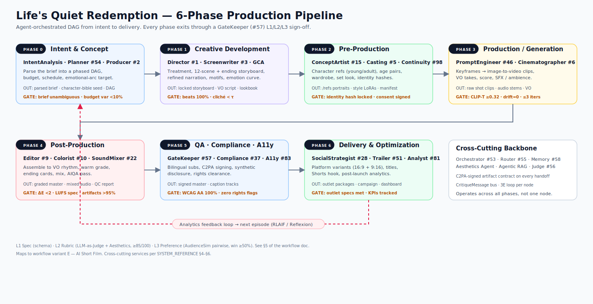
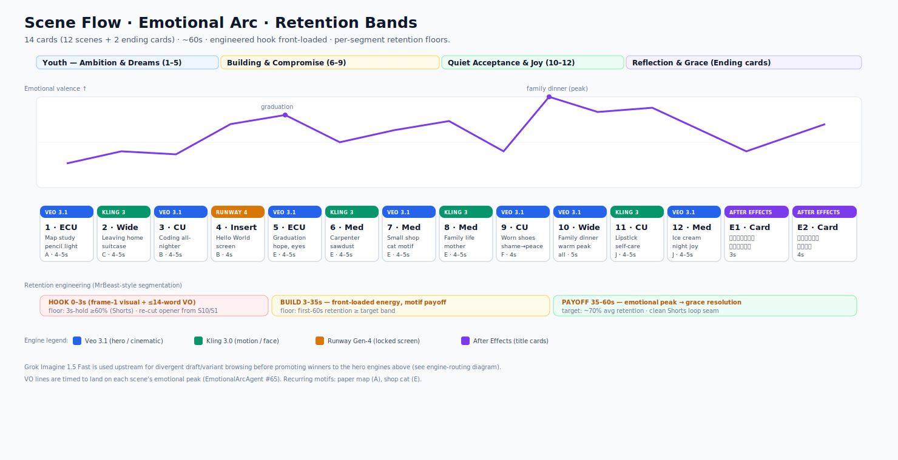
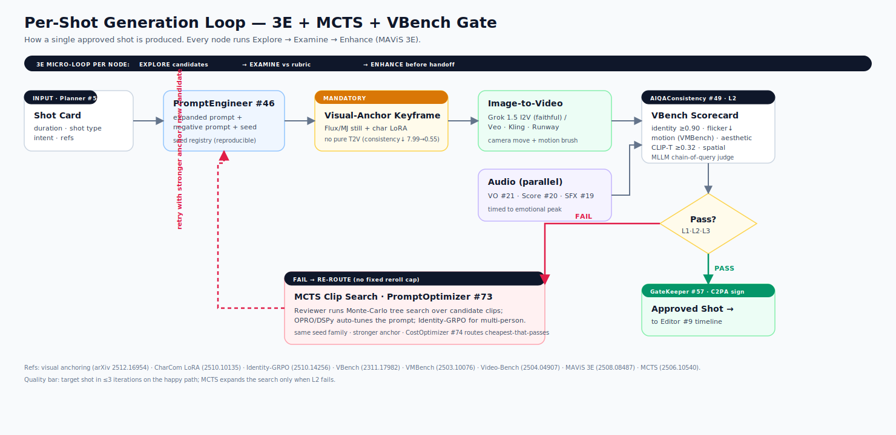
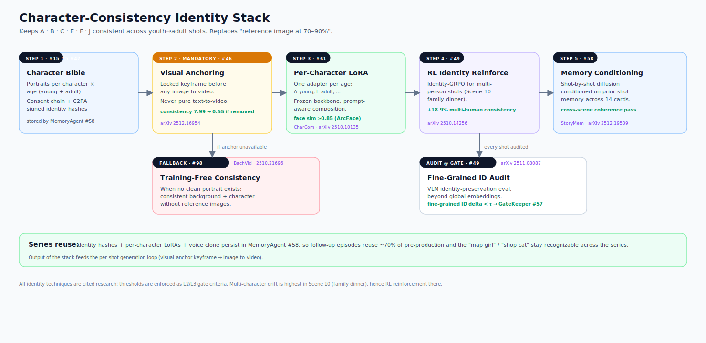
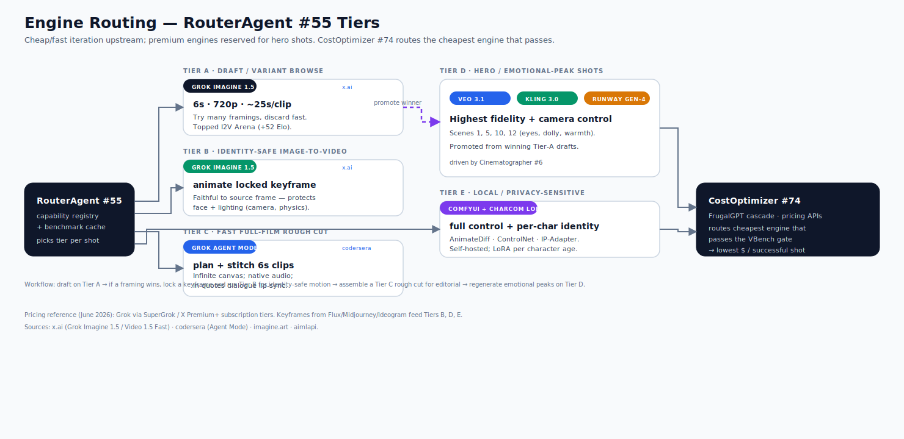
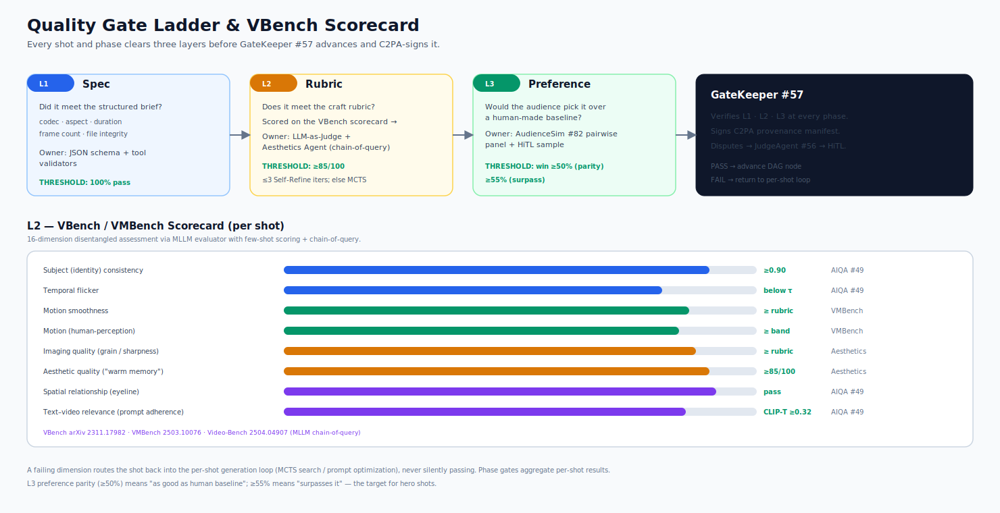

# 《人生的靜默救贖》— 代理協作製作流程

> **本文件用途。** 將原本的《人生的靜默救贖》電影短片流程,重新以「表格優先」的方式建構,並對應到 **VA-Agent-Swarm** 114 個代理系統。每一個階段、場景與工藝任務,現在都對應到真正負責它的代理:每個代理提供甚麼服務、消耗/產出哪些工件、用甚麼工具、品質關卡為何,以及由哪些代理負責批評。
>
> - **專案類型:** 情感勵志短片(約 55–65 秒)+ 直向剪輯版本
> - **主題:** 未實現的夢想、人生繞道與「失敗」如何悄悄保護並引導我們
> - **風格:** 寫實電影感的華語生活劇;溫暖黃金時刻光線;淺景深;細微菲林顆粒
> - **流程:** 對應工作流程變體 **E — AI 短片**([workflows/E-ai-short-film.svg](./workflows/E-ai-short-film.svg))
> - **系統地圖:** [SYSTEM_REFERENCE.md](./SYSTEM_REFERENCE.md) · [agents.md](./agents.md) · [ai_agent_video_production_workflow.md](./ai_agent_video_production_workflow.md)
>
> *(本文件為 [lifes_quiet_redemption_agent_workflow.md](./lifes_quiet_redemption_agent_workflow.md) 的繁體中文對照版本。)*

---

## 0. 視覺圖表(請先閱讀)

以下六張圖表完整描述本流程,並貫穿下文各節引用。原始檔案位於 [`./workflows/`](./workflows/)。

| # | 圖表 | 描述 | 對應章節 |
|---|---|---|---|
| D1 | 流程總覽 | 6 階段 DAG、負責代理、出場關卡與分析回饋迴圈 | §1、§5 |
| D2 | 場景流 | 14 卡時間軸、情緒弧線、留存帶、逐鏡引擎 | §2、§10、§15 |
| D3 | 逐鏡迴圈 | 3E 微迴圈、強制視覺錨定、VBench 關卡、MCTS 重導 | §3.4、§13、§14 |
| D4 | 角色一致性堆疊 | 維持角色少年→成年穩定的身分管線 | §3.3、§12 |
| D5 | 引擎路由 | RouterAgent 層級(含 Grok Imagine)、英雄引擎、成本優化 | §3.4、§11 |
| D6 | 品質關卡階梯 | L1/L2/L3 關卡與 VBench/VMBench 評分卡 | §5、§13 |

### D1 · 流程總覽

### D2 · 場景流、情緒弧線與留存帶

### D3 · 逐鏡生成迴圈

### D4 · 角色一致性身分堆疊

### D5 · 引擎路由(RouterAgent 層級)

### D6 · 品質關卡階梯與 VBench 評分卡

---

## 1. 流程總覽 — 階段 → 負責代理 → 服務

將原本的階段 0–6 大綱,對應到 swarm 的 6 階段製作管線(SYSTEM_REFERENCE §6.1)。每個階段結束前,須先通過 **GateKeeperAgent(#57)** 的 L1/L2/L3 簽核,DAG 才會推進。

| 階段 | 主導代理 | 支援代理 | 提供的服務(就本片而言) | 主要產出工件 | 關卡(通過條件) |
|---|---|---|---|---|---|
| **0 · 意圖與概念** | IntentAnalysisAgent (DIA)、PlannerAgent (#54)、ProducerAgent (#2) | StrategicGoal 框架、BrandStrategistAgent (#85)、FinanceAgent (#38)、CostOptimizerAgent (#74) | 將「生活悄悄救我們」的命題解析為分階段 DAG、預算、排期與情感弧線目標 | 已解析命題、角色聖經種子、分階段 DAG | 命題無歧義;DAG 有效;預算偏差 <10% |
| **1 · 創意開發** | DirectorAgent (#1)、ScreenwriterAgent (#3)、General Creative Agent (SSOR) | IdeationAgent (#59)、NarrativeArcAgent (#60)、EmotionalArcAgent (#65)、NoveltyAgent (#64)、StoryboardAgent (#14)、MoodBoardAgent (#63) | 處理大綱、12 場景 + 結尾分鏡表、精煉旁白、重複母題設計、情緒曲線 | 鎖定的分鏡表、旁白腳本、視覺手冊 | 節拍覆蓋 100%;陳腔濫調數低於 τ;弧線符合目標 |
| **2 · 前期製作** | ConceptArtistAgent (#15)、ProductionDesignAgent (#16)、CastingAgent (#5) | CostumeDesignAgent (#17)、MUAAgent (#18)、AvatarDesignAgent (#47)、ResearchAgent、StyleTransferAgent (#61)、ContinuityAgent (#98) | 角色參考圖集(A,B,C,E,F,J 的少年/成年)、年齡漸進對、服裝、場景視覺、身分雜湊 | `/refs/` 肖像集、風格 LoRA、連戲清單 | 每個角色身分雜湊已鎖定;同意鏈已簽署 |
| **3 · 製作(生成)** | PromptEngineerAgent (#46)、CinematographerAgent (#6)、CameraOperatorAgent (#7) | TalentAgent (#26)、VoiceOverAgent (#21)、ComposerAgent (#20)、SoundDesignAgent (#19)、VoiceCloneAgent (#48)、PromptOptimizerAgent (#73) | 逐鏡關鍵影格 → 圖生影片片段、旁白、配樂、音效/環境聲 | 原始鏡頭片段、音訊分軌、旁白音軌 | CLIP-T ≥0.32;身分漂移 = 0;每鏡 ≤3 次迭代 |
| **4 · 後期製作** | EditorAgent (#9)、ColoristAgent (#10)、SoundMixerAgent (#22) | AIQAConsistencyAgent (#49)、LipSyncAgent (#99)、MotionGraphicsAgent (#13)、VFXSupervisorAgent (#11)、RetentionOptimizerAgent (#76) | 依旁白節奏組接、暖色調光、結尾字卡、混音、品檢 | 調光母帶、混音音訊、品檢報告 | ΔE 漂移 <2;LUFS 符合規格;偽影通過率 >95% |
| **5 · 品保、合規與無障礙** | GateKeeperAgent (#57)、ComplianceAgent (#37)、AccessibilityAgent (#83) | AccessibilityOptimizerAgent (#78)、DeepfakeDetectionAgent (#103)、EthicsAgent (#107)、LocalizationQAAgent (#44) | 雙語字幕、C2PA 簽署、合成媒體揭露、版權清查 | 已簽署母帶 + 字幕軌 | WCAG AA 100%;零版權旗標;C2PA 鏈有效 |
| **6 · 交付與優化** | SocialMediaStrategistAgent (#28)、TrailerEditorAgent (#51)、AnalystAgent (#81) | SEOAgent (#87)、ChannelManagerAgent (#108)、PersonalizationEngineerAgent (#50)、OptimizationAgent、CommunityAgent (#88) | 平台版本(16:9 + 9:16)、標題/詮釋資料、Shorts 鉤子剪輯、上線後分析迴圈 | 各渠道發佈包、行銷活動、分析儀表板 | 各渠道規格達標;觸及/留存有追蹤 |

---

## 2. 逐場景製作矩陣

分鏡表每一列都成為一張**製作卡**,經由 DAG 路由。欄位涵蓋原始的(時長 / 鏡別 / 描述 / 旁白),再加上代理分派、生成引擎、音訊設計、連戲控制與品檢負責人。

| # | 節拍 | 時長 | 鏡別 | 視覺描述(面向模型) | 主導創意代理 | 生成代理 + 引擎 | 音訊代理(旁白/音效/配樂) | 連戲控制 | 品檢負責人 |
|---|---|---|---|---|---|---|---|---|---|
| 1 | 少年 — 苦讀 | 4–5s | 特寫 / ECU | 學生 A 俯身看紙本地圖,鉛筆描著國界,塵光透窗,神情滿懷希望 | DirectorAgent + EmotionalArcAgent | PromptEngineerAgent → Veo 3.1(緩慢推進) | 旁白:溫暖第 1 句 · 音效:鉛筆書寫聲、隱約教室聲 | ContinuityAgent:A-少年身分雜湊 | AIQAConsistencyAgent |
| 2 | 少年 — 離家 | 4–5s | 全景 / Wide | 18 歲 C 提行李立於門口,晨光,回望一眼 | DirectorAgent + StoryboardAgent | PromptEngineerAgent → Kling 3.0(靜止、風) | 旁白第 2 句 · 音效:開門、遠處街聲 · 配樂:鋼琴進入 | ContinuityAgent:C-少年、服裝 | AIQAConsistencyAgent |
| 3 | 少年 — 寫程式的熱情 | 4–5s | 特寫 / CU | 年輕程式員 B,熬夜紅眼,螢幕光,手指停頓後越打越有信心 | CinematographerAgent | PromptEngineerAgent → Veo 3.1(手持呼吸感) | 旁白第 3 句 · 音效:機械鍵盤(ASMR) · 配樂:鋪墊 | ContinuityAgent:B-少年、螢幕光 LUT | AIQAConsistencyAgent |
| 4 | 少年 — 第一個 "Hello World" | 4s | 插入 / Insert | 螢幕特寫:`Hello World` 編譯通過;眼鏡反射出笑容 | MotionGraphicsAgent(螢幕 UI) | PromptEngineerAgent → Runway Gen-4(鎖定螢幕) | 旁白第 4 句 · 音效:輕柔提示音 | ContinuityAgent:B-少年視線銜接 | AIQAConsistencyAgent + LegalAgent(無真實商標) |
| 5 | 少年 — 畢業的希望 | 4–5s | 特寫 / ECU | 22 歲 E 著學士袍,流蘇隨風,凝望玻璃高樓,眼裡有光 | DirectorAgent + EmotionalArcAgent | PromptEngineerAgent → Veo 3.1(極緩推向眼睛) | 旁白第 5 句 · 配樂:溫柔漸強 | ContinuityAgent:E-畢業身分雜湊 | AIQAConsistencyAgent |
| 6 | 建立 — 工藝/勞動 | 4–5s | 中景 / Medium | 成年 E 為木匠,木屑映金光,手穩,沉靜的自豪 | ProductionDesignAgent | PromptEngineerAgent → Kling 3.0(手部運動筆刷) | 旁白第 6 句 · 音效:木工聲、葉沙沙 | ContinuityAgent:E-成年漸進對 | AIQAConsistencyAgent |
| 7 | 建立 — 小生意 | 4–5s | 中景 / Medium | E 的小店,貓臥櫃上,溫暖室內,客人正離去 | DirectorAgent | PromptEngineerAgent → Veo 3.1(輕緩橫搖) | 旁白第 7 句 · 音效:店鈴、貓 · 重複母題:貓 | ContinuityAgent:貓母題、店面場景 | AIQAConsistencyAgent |
| 8 | 建立 — 家庭生活 | 4–5s | 中景 / Medium | E 已為人母,孩子在桌邊,柔和居家光 | CastingAgent + TalentAgent | PromptEngineerAgent → Kling 3.0 | 旁白第 8 句 · 音效:輕聲談笑、孩童聲 | ContinuityAgent:E-家庭身分雜湊 | AIQAConsistencyAgent |
| 9 | 建立 — 舊日的羞愧(鞋) | 4s | 特寫 / CU | F 瞥向磨損的鞋,羞愧泛起後漸轉為接納 | EmotionalArcAgent | PromptEngineerAgent → Veo 3.1(細微移焦) | 旁白第 9 句 · 配樂:轉小調 | ContinuityAgent:F 身分、鞋履 | AIQAConsistencyAgent |
| 10 | 接納 — 家庭晚餐 | 5s | 全景 / Wide | 溫暖的家庭晚餐,湯冒熱氣,笑聲,金色吊燈 | DirectorAgent + ColoristAgent(色調) | PromptEngineerAgent → Veo 3.1(緩慢推軌) | 旁白第 10 句 · 音效:湯杓、家人談笑、孩童咯咯笑 · 配樂:暖 | ContinuityAgent:群戲連戲 | AIQAConsistencyAgent |
| 11 | 接納 — 自我關照 | 4–5s | 特寫 / CU | J 對鏡塗口紅,柔和而真誠的微笑,笑意達眼 | MUAAgent | PromptEngineerAgent → Kling 3.0(臉部一致性模式) | 旁白第 11 句 · 音效:安靜室內聲 | ContinuityAgent:J 身分雜湊 | AIQAConsistencyAgent + LipSyncAgent(若旁白入鏡) |
| 12 | 接納 — 簡單的快樂 | 4–5s | 中景 / Medium | J 在夜裡,城市燈光散景,湯匙刮著雪糕杯,知足 | TravelCineAgent(城市視覺) | PromptEngineerAgent → Veo 3.1(手持、霓虹散景) | 旁白第 12 句 · 音效:城市嗡鳴、風、湯匙聲 · 配樂:收束 | ContinuityAgent:J-夜、光線連戲 | AIQAConsistencyAgent |
| E1 | 結尾字卡(黑) | 3s | 字卡 / Card | 黑屏:「人生不是一場巨大的失敗。」 | MotionGraphicsAgent | After Effects (MCP) 排版字卡 | 旁白收束 1 · 配樂:輕柔延音 | BrandAgent:字體系統 | AccessibilityAgent(對比度) |
| E2 | 結尾字卡(白) | 4s | 字卡 / Card | 白屏:「只是很多愿望事與愿違,也許是生活在偷偷救我們。」 | MotionGraphicsAgent | After Effects (MCP) 排版字卡 | 旁白收束 2 · 配樂:最終收束 | BrandAgent:字體系統 | AccessibilityAgent(對比度) |

---

## 3. 代理服務目錄(每個代理在本片實際做甚麼)

完整描述每個代理的貢獻、消耗的輸入、產出、工具、自身品質標準,以及由誰審查。按管線角色分組。

### 3.1 編排與規劃

| 代理 (#) | 在本片的服務 | 消耗 | 產出 | 工具 | 自身品質標準 | 由誰批評 |
|---|---|---|---|---|---|---|
| IntentAnalysisAgent (DIA) | 將詩意命題解碼為明確的情感目標、受眾與隱藏意圖 | 委託命題、主題陳述 | 已解析意圖 + 受眾模型 | DIA 框架、嵌入意圖分類器 | 意圖覆蓋、歧義旗標已解決 | DirectorAgent、PlannerAgent |
| PlannerAgent (#54) | 將影片拆成含鏡頭節點 + 批評關卡的 6 階段 DAG | 已解析意圖 | 分階段 DAG、分派、關卡圖 | LangGraph 計劃生成、Gantt/PERT | 無遺漏關卡;成本偏差 <10% | ProducerAgent、RouterAgent |
| OrchestratorAgent (#53) | 執行 DAG;逐鏡扇出、重試、升級 | DAG | 排程作業、執行狀態 | LangGraph + Temporal、Redis 鎖 | DAG 完成率 ≥99.5%;死鎖 = 0 | ProducerAgent、JudgeAgent |
| RouterAgent (#55) | 為每個鏡頭挑選最佳代理 + 模型(Veo vs Kling vs Runway) | 任務嵌入 | 代理/模型路由表 | 能力註冊表、基準快取 | 路由準確率 ≥95% | CostOptimizerAgent |
| ProducerAgent (#2) | 預算、排期、階段放行 | DAG、成本模型 | 已放行階段關卡 | Sheets/Airtable、Temporal、Stripe | 準時;預算 ±5% | DirectorAgent |
| CostOptimizerAgent (#74) | 將重生成導向達標下最便宜的引擎 | 算繪遙測 | 性價比路由 | 定價 API、FrugalGPT 級聯 | 每成功鏡頭成本最低 | RouterAgent、FinanceAgent |
| GateKeeperAgent (#57) | 在每個階段驗證 L1/L2/L3;簽署 C2PA | 階段工件 | 已簽署通過/失敗 | c2patool、JSON 驗證器 | 零漏檢缺陷 | ComplianceAgent、AIQAConsistencyAgent |
| MemoryAgent (#58) | 儲存角色聖經、過往鏡次、修正以供回溯 | 所有工件 | 可檢索的專案記憶 | Pinecone/Weaviate、MemGPT | 檢索 precision@5 ≥0.9 | 所有代理 |
| JudgeAgent (#56) | 透過辯論裁決爭議(如剪輯師 vs 導演對節奏的分歧) | 衝突批評 | 裁定結果 | 辯論 + LLM-as-Judge | 評審者間 κ ≥0.8 | 翻案時交人類複核 |

### 3.2 主創與故事

| 代理 (#) | 在本片的服務 | 消耗 | 產出 | 工具 | 自身品質標準 | 由誰批評 |
|---|---|---|---|---|---|---|
| DirectorAgent (#1) | 掌握溫暖反思的願景;下達鏡頭意圖、核可鏡次 | 分鏡、參考圖 | 逐鏡創意意圖、核可 | Veo/Kling/Runway、Resolve (MCP) | 鏡頭意圖忠實度(CLIP-T ≥0.32) | ScreenwriterAgent、EditorAgent、AudienceSimAgent |
| ScreenwriterAgent (#3) | 將旁白打磨為連貫且有節奏的旁白腳本 | 大綱、節拍表 | 最終旁白腳本(中 + 英) | Fountain/FDX、嵌入距離 | 節拍通過;語句獨特性 | DirectorAgent、NoveltyAgent |
| General Creative Agent (SSOR) | 提供新鮮取景與隱喻(地圖→真實地點、重複出現的貓) | 命題、氛圍 | 創意選項、母題 | SSOR 構思引擎 | 同等連貫下的新穎度 | DirectorAgent、NoveltyAgent |
| IdeationAgent (#59) | 為鉤子、標語、結尾字卡用語做發散選項 | 主題 | 概念/鉤子集 | 新穎度評分、概念聚類 | 點子密度、語意多樣性 | CreativeDirectorAgent、NoveltyAgent |
| NarrativeArcAgent (#60) | 驗證少年→建立→接納→恩典的弧線間距 | 分鏡 | 節拍覆蓋圖 | 節拍表驗證器、弧線繪圖 | 覆蓋 100%;轉折點間距 | ScreenwriterAgent |
| EmotionalArcAgent (#65) | 對應效價/喚醒度,使每句旁白落在視覺高點 | 分鏡、旁白 | 情緒曲線 + 節拍建議 | GoEmotions、留存預測 | 曲線貼合目標 | EditorAgent、ComposerAgent |
| NoveltyAgent (#64) | 標記視覺/台詞中的陳腔(如過度使用的「城市追夢者」套路) | 草稿 | 陳腔命中報告 | TV Tropes、n-gram 庫、新穎度評分 | 陳腔數低於 τ | ScreenwriterAgent |
| StoryboardAgent (#14) | 將腳本轉為含走位的 12 格鏡頭表 | 腳本 | 鏡頭格 + 走位備註 | 圖像生成、Fountain 解析 | 覆蓋完整度、走位清晰度 | DirectorAgent |
| MoodBoardAgent (#63) | 建立視覺/聽覺/調性參考板(黃金時刻、菲林顆粒) | 命題 | 視覺手冊板 | Pinterest/Are.na、CLIP 聚類 | 參考一致性 | DirectorAgent、ProductionDesignAgent |

### 3.3 視覺、角色與連戲

| 代理 (#) | 在本片的服務 | 消耗 | 產出 | 工具 | 自身品質標準 | 由誰批評 |
|---|---|---|---|---|---|---|
| ConceptArtistAgent (#15) | 設計各角色跨年齡的造型(A,B,C,E,F,J 少年+成年) | 視覺手冊 | 角色設計稿 | Midjourney v7、SD ControlNet | 風格聖經貼合度 | DirectorAgent |
| CastingAgent (#5) | 為每個角色挑選已授權肖像 + 聲音匹配 | 設計稿 | 卡司/肖像 + 同意鏈 | 肖像目錄、聲音庫 | 匹配度 + 同意 100% | DirectorAgent、ComplianceAgent |
| AvatarDesignAgent (#47) | 鎖定合成主持人身分,逐臉 C2PA 簽署 | 卡司參考 | 身分雜湊、已簽署參考 | HeyGen/Synthesia、c2patool | 身分雜湊一致性 | ComplianceAgent、DeepfakeDetectionAgent |
| ProductionDesignAgent (#16) | 定義場景(教室、店面、家、夜街)與調色盤 | 視覺手冊 | 場景/世界視覺規格 | Unreal 場勘、Veo 場景生成 | 調色盤一致、時代準確 | DirectorAgent |
| CostumeDesignAgent (#17) | 依年齡/角色設計服裝(學生、木匠、母親、上班族) | 設計稿 | 服裝規格 | 時尚史庫、圖像生成 | 輪廓辨識度、調色盤貼合 | MUAAgent |
| MUAAgent (#18) | 髮型/化妝連戲,含口紅一幕(場景 11) | 服裝 | 各鏡次連戲雜湊 | 臉部標記、感知雜湊 | 連戲斷裂 <0.5% | ContinuityAgent |
| StyleTransferAgent (#61) | 在所有鏡頭套用一致、可調光的美學 | 參考、鏡頭 | 各風格 LoRA、CLIP 分數 | LoRA、CLIP/DINO、Runway 風格鎖 | 風格相似度 ≥0.85 | DirectorAgent、ColoristAgent |
| ContinuityAgent (#98) | 追蹤身分、服裝、道具(貓母題)、時間狀態跨場連戲 | 所有鏡頭 | 連戲清單 | 狀態清單、鏡頭比對 | 狀態漂移偵測 | AIQAConsistencyAgent、GateKeeperAgent |

### 3.4 生成、攝影與音訊

| 代理 (#) | 在本片的服務 | 消耗 | 產出 | 工具 | 自身品質標準 | 由誰批評 |
|---|---|---|---|---|---|---|
| PromptEngineerAgent (#46) | 為每個鏡頭撰寫擴充的模型提示 + 負面提示 | 鏡頭卡、參考 | 最終提示、種子 | Sora 2/Veo 3.1/Runway/Kling、種子註冊表 | 目標鏡頭 ≤3 次迭代 | AIQAConsistencyAgent |
| PromptOptimizerAgent (#73) | 當鏡頭未過品檢時自動調整弱提示(OPRO/DSPy) | 失敗提示 + 分數 | 改良提示 | DSPy MIPRO、OPRO、評估框架 | 每次迭代分數提升 | PromptEngineerAgent |
| CinematographerAgent (#6) | 逐鏡的鏡頭、打光、構圖(黃金時刻、淺景深) | 鏡頭意圖 | 打光/鏡頭規格 | Veo 攝影路徑、ACES 管線 | 構圖 + 色溫一致性 | DirectorAgent、ColoristAgent |
| CameraOperatorAgent (#7) | 執行推進、推軌、手持呼吸感運動 | 鏡頭規格 | 攝影運動預設 | Runway 攝影預設、Kling motion | 畫面穩定、運鏡平順 | CinematographerAgent |
| TalentAgent (#26) | 算繪入鏡的微表演(微笑、瞥視、停頓) | 角色參考 | 表演鏡次 | HeyGen Avatar IV、情緒模型 | 情緒目標匹配 | DirectorAgent |
| VoiceOverAgent (#21) | 以中文(+英文備選)演繹溫暖反思的旁白 | 旁白腳本 | 旁白鏡次 | ElevenLabs v3、發音詞典 | 韻律 + 發音匹配 | DirectorAgent |
| VoiceCloneAgent (#48) | 若需一致的旁白聲線,處理克隆 + 同意 | 同意 + 樣本 | 克隆旁白、對嘴 | ElevenLabs 克隆、Sync.so | MOS ≥4.2;同意已驗證 | ComplianceAgent、LipSyncAgent |
| ComposerAgent (#20) | 極簡鋼琴 + 柔弦配樂,於高點漸強 | 情緒曲線 | 配樂分軌 | Udio/Suno、MIDI、Demucs | 樂句對情緒對齊 | EditorAgent、SoundDesignAgent |
| SoundDesignAgent (#19) | 逐場擬音/環境聲(鉛筆、鍵盤、湯、城市嗡鳴) | 鏡頭表 | 音效分軌 | ElevenLabs SFX、Freesound | 同步 ≤±1 影格 | EditorAgent、ComposerAgent |

### 3.5 後期、品保、合規與交付

| 代理 (#) | 在本片的服務 | 消耗 | 產出 | 工具 | 自身品質標準 | 由誰批評 |
|---|---|---|---|---|---|---|
| EditorAgent (#9) | 依旁白節奏組接;為情感留白而修剪 | 片段、旁白、配樂 | 已組接剪輯 | Resolve (MCP)、FFmpeg | 節奏貼合類型先驗 | DirectorAgent、AudienceSimAgent |
| ColoristAgent (#10) | 暖色電影調光、膚色保護、青色陰影 | 已組接剪輯 | 調光母帶 | Resolve color (MCP)、ACES/OCIO | ΔE 漂移 <2 | CinematographerAgent、AccessibilityAgent |
| MotionGraphicsAgent (#13) | 製作兩張結尾字卡 + 字幕樣式 | 最終台詞 | 字卡、字幕範本 | After Effects (MCP)、Lottie | 排版層次、可讀性 | BrandAgent、AccessibilityAgent |
| VFXSupervisorAgent (#11) | 清理/小幅合成修正(手/臉偽影移除) | 旗標鏡頭 | 已修鏡頭 | Nuke (MCP)、Runway Aleph | 合成錯誤像素數 | AIQAConsistencyAgent |
| SoundMixerAgent (#22) | 最終混音;旁白下壓配樂;音效層平衡 | 分軌 | 混音母帶(立體聲 + 5.1) | Dolby Atmos 算繪、Fairlight | LUFS 符合規格;STOI ≥0.85 | SoundDesignAgent、AccessibilityAgent |
| AIQAConsistencyAgent (#49) | 逐鏡捕捉影格漂移、壞手/臉、身分斷裂 | 所有鏡頭 | 品檢報告 + 旗標 | VBench、ArcFace、手部偵測 | 捕捉 >95% 資深品檢 | DirectorAgent、VFXSupervisorAgent |
| LipSyncAgent (#99) | 驗證任何入鏡旁白的音素-視位對齊 | 旁白 + 臉部鏡頭 | 對嘴報告 | 音素-視位對齊器 | 對嘴誤差低於門檻 | VoiceCloneAgent、AnimatorAgent |
| RetentionOptimizerAgent (#76) | 為平均觀看時長調整鉤子 + 開場節奏(尤其 Shorts) | 剪輯 + 分析 | 留存調整剪輯備註 | YouTube Analytics、留存預測 | AVD 較對照組提升 | EditorAgent |
| ComplianceAgent (#37) | FTC/IP/肖像清查;畫面無真實商標/品牌 | 母帶 | 清查通過 | 法規庫、C2PA 驗證 | 規則覆蓋 100%;零下架 | 所有代理(阻擋性關卡) |
| DeepfakeDetectionAgent (#103) | 確認合成媒體來源乾淨、非欺騙性 | 母帶、參考 | 鑑識通過 | 鑑識模型、來源驗證 | 鑑識召回率 | TrustSafetyAgent、SafetyRedTeamAgent |
| EthicsAgent (#107) | 確認合成媒體揭露 + 敏感內容公平性 | 母帶 | 倫理通過 | 風險矩陣、揭露檢查表 | 議題召回、緩解清晰度 | StandardsEditorAgent、ComplianceAgent |
| AccessibilityAgent (#83) | 最終無障礙驗收:字幕同步、對比度、口述影像 | 母帶 + 字幕 | 發佈就緒通過 | 字幕 + 對比度驗證 | WCAG AA 100% | AccessibilityOptimizerAgent |
| LocalizationQAAgent (#44) | 驗證中→英字幕準確度 + 文化適配 | 字幕 | MQM 評級字幕 | DeepL、MQM 標註 | 每千字 MQM 錯誤低於目標 | NativeReviewerAgent、BrandAgent |
| SocialMediaStrategistAgent (#28) | 規劃平台原生發佈(YouTube/Shorts/小紅書/抖音/Reels) | 最終母帶 | 發佈計劃 | Meta/TikTok API、Sensor Tower | 趨勢時機延遲 <2 小時 | AnalystAgent |
| TrailerEditorAgent (#51) | 剪一支 3 秒鉤子的直向 Shorts/Reels 預告 | 母帶 | 鉤子剪輯 | Resolve (MCP)、留存預測 | 3 秒鉤子率 | DirectorAgent |
| SEOAgent (#87) | 標題、描述、標籤、搜尋意圖詮釋資料 | 母帶、計劃 | 詮釋資料包 | 關鍵字工具、詮釋資料 API | 關鍵字 + 意圖匹配 | MarketingAgent、AnalystAgent |
| PersonalizationEngineerAgent (#50) | (選用)可變的「你的未竟之願」個人化版本 | 範本 + 母帶 | 個人化算繪 | Idomoo/HeyGen、同意平台 | 算繪成功率 ≥99.5% | ComplianceAgent |
| AnalystAgent (#81) | 上線後觸及/留存/情感報告 → 下一次迭代 | 平台遙測 | 可決策報告 | 分析儀表板、BI 倉儲 | KPI 完整度;預測偏差 | EvaluationHarnessAgent |

---

## 4. 全程套用的橫切服務

這些共享能力(SYSTEM_REFERENCE §4–§5)貫穿每個階段,而非僅在單一節點運作。

| 服務 / 能力 | 提供者 | 在本片的角色 |
|---|---|---|
| **美學評分(Critic + Aligner + Taste-Keeper)** | Aesthetics Agent | 向 Cinematographer、Colorist、PromptEngineer、AIQA 提供 L2/感知層的「這夠美夠暖嗎?」評審訊號 |
| **策略目標達成(6 階段自我探詢)** | Strategic Goal 框架 | 將模糊的「讓人覺得人生救了他們」目標轉為 Planner/Director 可量度的創意目標 |
| **Agentic RAG 知識骨幹** | Agentic RAG System | 隨需向任何代理提供華語電影參考、黃金時刻打光配方、提示模式 |
| **心理側寫 / 推薦** | Psych Profile + Recommendation 代理 | 為 AudienceSim 與 Personalization 調整旁白語氣與受眾共鳴預測(五大性格 / 情緒狀態) |
| **持續自我改進(Reflexion + RLAIF)** | Optimization Agent + EvaluationHarnessAgent (#79) | 將 30/60/90 天留存/ROAS 回饋至下一部片的提示 + 剪輯選擇 |
| **共享工件交接合約(C2PA 簽署清單)** | 所有代理 | 每段片、分軌、母帶皆帶 `artifact_id`、`continuity_state`、`qc_status`、`provenance_manifest` 在各階段間流轉 |
| **批評匯流排(CritiqueMessage JSON)** | 所有代理 | 結構化的阻擋/重大/次要回饋;爭議升級至 JudgeAgent → 人類複核 |

---

## 5. 品質關卡階梯(逐鏡與逐階段)

每件工件在 GateKeeperAgent 推進前須通過三層(agents.md §11.2)。

| 層級 | 問題 | 負責者 / 機制 | 門檻 |
|---|---|---|---|
| **L1 — 規格** | 是否符合結構化命題(編碼、長寬比、時長、影格數)? | JSON schema + 工具驗證 | 100% 通過 |
| **L2 — 評分準則** | 是否符合工藝準則(構圖、調光、韻律、節拍貼合)? | LLM-as-Judge + Aesthetics Agent | ≥85/100(≤3 次 Self-Refine) |
| **L3 — 偏好** | 目標受眾會否在它與人類製作基準間選它? | AudienceSimAgent (#82) 成對評審 + 人類抽樣 | 勝率 ≥50%(持平)/ ≥55%(超越) |

---

## 6. 交付版本與渠道規格

| 渠道 | 長寬比 / 規格 | 負責代理 | 備註 |
|---|---|---|---|
| YouTube(主) | 16:9、1080p/4K、24–30fps、燒錄 + 軟字幕 | DistributorAgent (#112)、ChannelManagerAgent (#108)、SEOAgent (#87) | 完整約 60 秒版 |
| YouTube Shorts | 9:16、臉部重構圖、燒錄字幕 | TrailerEditorAgent (#51)、RetentionOptimizerAgent (#76) | 前置 3 秒鉤子 |
| 小紅書 | 9:16 / 3:4、中文字幕 | SocialMediaStrategistAgent (#28)、LocalizationQAAgent (#44) | 文化調整的標題 + 標籤 |
| 抖音 / TikTok | 9:16、感知熱門音訊 | SocialMediaStrategistAgent (#28)、TrendIntelligenceAgent (#68) | 鉤子率 ≥30% 目標 |
| Instagram Reels | 9:16、英 + 中字幕 | MarketingAgent (#86)、SEOAgent (#87) | 雙語版本 |
| 典藏母帶 | ProRes + C2PA、校驗碼 | ArchiveMasterAgent (#114)、GateKeeperAgent (#57) | 系列複用保存包 |

---

## 7. 建議工具 / 模型棧(2026 年 6 月)

| 層 | 模型 / 工具 | 驅動代理 |
|---|---|---|
| 代理推理 | Grok-4.x、Gemini 2.5 Pro (1M)、GPT-4o、Claude 4 | 編排 + 全體 |
| 關鍵影格 / 參考圖 | Flux.1 Pro/Kontext、Midjourney v7、Ideogram 3.0 | ConceptArtistAgent、PromptEngineerAgent |
| 影片生成 | Veo 3.1(電影感、角色)、Kling 3.0(運動/臉)、Runway Gen-4(控制)、Sora 2(敘事) | PromptEngineerAgent、RouterAgent |
| 本地 / 自架 | ComfyUI + AnimateDiff + ControlNet + IP-Adapter/InstantID | StyleTransferAgent、PromptEngineerAgent |
| 語音 / TTS | ElevenLabs v3、GPT-SoVITS / CosyVoice(本地、粵語) | VoiceOverAgent、VoiceCloneAgent |
| 配樂 | Suno v4 / Udio | ComposerAgent |
| 音效 | ElevenLabs SFX、Freesound | SoundDesignAgent |
| 剪輯 / 調光 | DaVinci Resolve 19+ / CapCut Pro (MCP) | EditorAgent、ColoristAgent |
| 升頻 | Topaz Video AI | VFXSupervisorAgent |
| 來源驗證 | c2patool (C2PA) | GateKeeperAgent、AvatarDesignAgent |

---

## 8. 系列化與可擴展性(複用 swarm)

由於 swarm 會持久保存角色聖經(MemoryAgent #58)、身分雜湊(AvatarDesignAgent #47)與風格 LoRA(StyleTransferAgent #61),後續短片可複用約 70% 的前期製作。系列新作只需為新節拍重跑階段 1–4,而 ContinuityAgent 保證重複出現的「地圖女孩」與「店貓」跨集一致。

| 複用資產 | 由誰保存 | 帶來甚麼 |
|---|---|---|
| 角色聖經 + 身分雜湊 | MemoryAgent、AvatarDesignAgent | 跨集相同臉孔 |
| 風格 LoRA + 調光 LUT | StyleTransferAgent、ColoristAgent | 一致的「溫暖回憶」視覺 |
| 旁白聲線克隆 | VoiceCloneAgent | 跨系列可辨識的旁白 |
| 提示 + 種子註冊表 | PromptEngineerAgent | 快速、可重現的重算繪 |
| 重複母題(貓、紙地圖) | ContinuityAgent | 受眾辨識 / 品牌 |

---
---

# 第二部分 — 研究啟發的品質升級(2026 年 6 月)

> 本部分以三方面研究強化第一部分:(1) 頂尖 YouTube 成長策略師、(2) xAI 當前的 Grok Imagine 影片棧、(3) 近期 arXiv 關於一致、長篇、多鏡頭 AI 影片的研究。所有外部主張均附內文引用。*所有外部來源內容均經改寫/摘要以符合授權限制;任何來源皆未超出合理使用引用上限。*

## 9. 研究來源 → 發現 → 流程啟示

| 領域 | 來源 | 關鍵發現(改寫) | 對本流程的啟示 |
|---|---|---|---|
| YouTube 成長 | [Colin & Samir — Paddy Galloway 新規則](https://www.colinandsamir.com/resources/the-new-rules-of-youtube-from-paddy-galloway) | 最大槓桿在於**包裝**(標題 + 縮圖),而非製作;有創作者僅將心力轉向包裝便從每片約 2–3K 觀看躍升至 100 萬+ | 在生成前加入**包裝優先關卡**;標題+縮圖於階段 1 決定,而非事後 |
| YouTube 成長 | [Paddy Galloway 策略摘要](https://outlierkit.com/resources/youtube-scriptwriting-methods-compared/) · [Accelerator](https://www.paddygalloway.com/accelerator) | 成功建立於 點子 → 標題 → 留存 → 包裝,並善用頻道自身數據;模仿同類中已過度表現的「異常值」影片 | 加入 **OutlierModeling** 步驟(TrendIntel + Analyst)餵入點子選擇 |
| 留存 | [MrBeast 外洩文件解析](https://sherwood.news/culture/mrbeast-youtube-leaked-internal-success-document/) · [koi.app](https://www.koi.app/posts/mrbeast-s-blueprint-for-youtube-domination-key-insights-from-the-leaked-employee-guide) | 三大核心指標:CTR、平均觀看時長、平均觀看百分比;結構為 鉤子(0–1 分)→ 1–3 → 3–6 → 後半;留存在前約 60 秒決定勝負,故前置能量 | 重塑這支 60 秒片,設**工程化開場**與分段留存目標 |
| 留存 | [complexminds](https://complexminds.substack.com/p/the-mr-beast-retention-formula-that) · [paulcopy](https://paulcopy.substack.com/p/the-strategy-behind-mr-beasts-70) | MrBeast 維持約 70% 平均留存,遠高於約 30% 的普遍水準 | 將分段留存目標帶設為明確的關卡門檻 |
| Shorts | [opus.pro](https://www.opus.pro/blog/youtube-shorts-hook-formulas) · [rendercut](https://rendercut.io/why-viewers-scroll-away-first-3-seconds/) · [vexub](https://vexub.com/blog/viral-short-form-video-hooks) | 3 秒停留是分發門檻;約 2/3 在 3 秒內滑走;口說鉤子約 10–14 字;視覺鉤子須在第一影格命中;過 3 秒留存 60%+ 可獲更多觸及 | 剪一支**3 秒鉤子直向版**,第一影格視覺 + ≤14 字旁白 |
| Shorts 觀看 | [findmecreators](https://www.findmecreators.com/blog/youtube-shorts-retention-rate) | 自 2025 年 3 月 31 日起,Shorts「觀看」於播放/重播即計,無最低觀看時間 | 為停留 + 重播迴圈優化,而非僅看曝光 |
| xAI 引擎 | [x.ai — Grok Imagine 1.5 預覽](https://x.ai/news/grok-imagine-1-5) | 圖生影片在動畫化靜止影格時忠於來源影格(運鏡、氛圍、物理),最高 720p;鏡頭可串接成全專案一致視覺 | 以 Grok 圖生影片作為**忠於關鍵影格的動畫器**以保護身分/光線 |
| xAI 引擎 | [x.ai — Video 1.5 Fast](https://x.ai/news/grok-imagine-video-1-5) · [imagine.art](https://www.imagine.art/blogs/xai-grok-imagine-video-1-5-guide) | 1.5 Fast 約 25 秒產出 6 秒 720p;1.5 登頂圖生影片競技場(+52 Elo),超越 Seedance 2.0 與 Veo | 用 Grok 做**快速發散迭代/版本瀏覽**;勝出者再升至高階引擎 |
| xAI 引擎 | [codersera — Agent Mode](https://codersera.com/blog/grok-imagine-agent-mode-launch-2026/) · [aimlapi](https://aimlapi.com/blog/grok-imagine-video-vs-grok-imagine-video-1-5-preview) | Agent Mode(2026 年 5 月 1 日)是無限畫布代理,可規劃、生成、編輯並串接 6 秒片成長片;單一 API 涵蓋生成、編輯、圖生影片、參考影片、延伸、編輯 | 在 Grok Agent Mode 內鏡像我們的 DAG 做**快速草稿輪**;原生音訊 + 引號內台詞對嘴 |
| 一致性 | [arXiv 2512.16954 — 角色穩定管線](https://arxiv.org/html/2512.16954) | 移除*視覺錨定*機制會使角色一致性崩潰(7.99→0.55);視覺先驗對身分至關重要 | 任何圖生影片前**必設視覺錨定關鍵影格**;角色絕不用純文字生影片 |
| 一致性 | [arXiv 2510.10135 — CharCom](https://arxiv.org/html/2510.10135v1) | 在凍結骨幹上以提示感知於推論時套用每角色 LoRA,無須再訓練即提升保真度 | StyleTransferAgent 為**每個角色年齡各建一個 LoRA**(A-少年、E-成年…) |
| 一致性 | [arXiv 2510.14256 — Identity-GRPO](https://arxiv.org/html/2510.14256v1) | RL 微調使多人身分一致性提升最高約 18.9% | 用於漂移最嚴重的**家庭晚餐(場景 10)**多角色鏡頭 |
| 一致性 | [arXiv 2512.19539 — StoryMem](https://arxiv.org/html/2512.19539) | 記憶條件化單鏡擴散生成連貫的分鐘級多鏡頭故事 | 與我們的 MemoryAgent (#58) 搭配做**跨場角色記憶** |
| 一致性 | [arXiv 2510.21696 — BachVid](https://arxiv.org/html/2510.21696v1) | 免訓練的背景 + 角色一致性,無須參考圖 | 當缺乏乾淨參考肖像時的後備方案 |
| 評估 | [VBench](https://arxiv.org/abs/2311.17982) · [VBench 附錄](https://arxiv.org/html/2507.07202) | 16 個解耦維度,含主體一致性、運動平順度、時序閃爍、空間關係、影像 + 美學品質、文字-影片相關性 | 以**VBench 16 維評分卡**逐鏡取代粗略品檢 |
| 評估 | [arXiv 2503.10076 — VMBench](https://arxiv.org/html/2503.10076) | 從人類感知對齊角度評估運動品質 | 新增**運動自然度**關卡(打字的手、風、轉頭) |
| 評估 | [arXiv 2504.04907 — Video-Bench](https://arxiv.org/html/2504.04907v1) | 以 MLLM 為評估者,跨所有維度做少樣本評分 + 鏈式查詢 | 以結構化鏈式查詢驅動 AIQA/Aesthetics 評審 |
| 編排 | [arXiv 2508.08487 — MAViS](https://arxiv.org/html/2508.08487v2) | 多代理階段(腳本→鏡頭設計→角色建模→關鍵影格→動畫→音訊),各階段遵循 **3E 原則:探索、檢視、增強** | 將每個 swarm 節點包進明確的 探索→檢視→增強 微迴圈 |
| 編排 | [arXiv 2506.10540 — MCTS 故事敘述](https://arxiv.org/html/2506.10540) | Director / Photography / Reviewer / Post-Production 代理搭配 MCTS 驅動的片段搜尋 | 以 **MCTS 在候選片段間搜尋**取代固定 3 次重生成上限 |
| 編排 | [arXiv 2605.27891 — SmartDirector](https://arxiv.org/html/2605.27891v1) | 關鍵影格條件化生成 + 明確敘事節奏控制 | 賦予 EditorAgent **逐鏡節奏旋鈕**,綁定情緒曲線 |

## 10. YouTube 行銷升級(對應代理)

| 升級 | 改變甚麼 | 負責代理 | 關卡 / 指標 |
|---|---|---|---|
| **包裝優先** | 標題(≤50 字元、簡單用詞)+ 縮圖概念於階段 1 鎖定,*在任何生成之前*;影片為兌現此承諾而製作 | BrandStrategistAgent (#85)、SEOAgent (#87)、縮圖=ConceptArtistAgent (#15)、DirectorAgent (#1) | 預測 CTR ≥ 同類中位(AudienceSimAgent 評審) |
| **異常值建模** | 點子由模仿 治愈/反思生活 類中過度表現的影片來選 | TrendIntelligenceAgent (#68)、AnalystAgent (#81)、IdeationAgent (#59) | 點子對應 ≥3 個已證明的異常值 |
| **工程化開場** | 前 3–5 秒重剪為鉤子:最強影像(場景 1 ECU 或場景 10 暖意)+ 製造好奇缺口的旁白,取代緩慢淡入 | RetentionOptimizerAgent (#76)、EditorAgent (#9)、ScreenwriterAgent (#3) | 前 60 秒留存 ≥ 目標帶 |
| **分段留存帶** | 將 60 秒分為 鉤子/建立/回報,各段設明確留存下限,仿 MrBeast 的分段 | RetentionOptimizerAgent (#76)、EmotionalArcAgent (#65) | 各段預測留存 ≥ 下限 |
| **Shorts 3 秒停留剪輯** | 專屬 9:16 版:視覺鉤子在**第一影格**、口說鉤子 ≤14 字、設計成可循環 | TrailerEditorAgent (#51)、MotionGraphicsAgent (#13) | 預測 3 秒停留 ≥60%;循環接縫乾淨 |
| **指標儀表化** | 將 CTR + AVD + AVP 視為一級 KPI 餵入下一集 | AnalystAgent (#81)、EvaluationHarnessAgent (#79) | 上線後 24 小時內儀表板上線 |

## 11. 生成引擎升級 — 將 Grok Imagine 納入棧

§3.4 的路由(RouterAgent #55)新增 Grok 層級。淨效果:前期更便宜、更快迭代;高階引擎保留給英雄鏡頭。

| 階段 | 引擎選擇 | 理由(附引用) | 代理 |
|---|---|---|---|
| 發散草稿 / 版本瀏覽 | **Grok Imagine 1.5 Fast**(6s、720p、約 25s/片) | 夠快以嘗試多種取景並快速捨棄([x.ai](https://x.ai/news/grok-imagine-video-1-5)、[imagine.art](https://www.imagine.art/blogs/xai-grok-imagine-video-1-5-guide)) | PromptEngineerAgent (#46)、RouterAgent (#55) |
| 關鍵影格 → 運動(身分安全) | **Grok Imagine 1.5 圖生影片**(動畫化已鎖定關鍵影格,忠於來源) | 延續靜止影格而非重新詮釋,保護臉孔 + 光線([x.ai](https://x.ai/news/grok-imagine-1-5)) | PromptEngineerAgent (#46)、ContinuityAgent (#98) |
| 快速全片粗剪 | **Grok Imagine Agent Mode**(規劃/串接 6s 片、原生音訊、引號對嘴) | 為整段弧線產出串接草稿供早期剪輯審查([codersera](https://codersera.com/blog/grok-imagine-agent-mode-launch-2026/)) | OrchestratorAgent (#53)、EditorAgent (#9) |
| 英雄 / 情感高點鏡頭 | **Veo 3.1 / Kling 3.0 / Runway Gen-4** | 為場景 1、5、10、12 提供更高保真 + 運鏡控制 | CinematographerAgent (#6) |
| 本地 / 隱私敏感 | **ComfyUI + CharCom LoRA + IP-Adapter** | 完全控制、每角色 LoRA 身分([arXiv CharCom](https://arxiv.org/html/2510.10135v1)) | StyleTransferAgent (#61) |

## 12. 角色一致性升級(本片最難問題)

以研究級身分棧取代「附參考圖、強度 70–90%」。

| 技術 | 套用於 | 機制(附引用) | 負責代理 | 指標 |
|---|---|---|---|---|
| **強制視覺錨定** | 每個角色鏡頭 | 先生成已鎖定關鍵影格;絕不用純文字生影片 — 視覺先驗不可或缺,否則一致性崩潰([arXiv 2512.16954](https://arxiv.org/html/2512.16954)) | PromptEngineerAgent (#46) | 身分分數不相對錨定崩潰 |
| **每角色 LoRA(逐年齡)** | A,B,C,E,F,J × 少年/成年 | 凍結骨幹上的可組合適配器、提示感知([CharCom](https://arxiv.org/html/2510.10135v1)) | StyleTransferAgent (#61) | 臉部相似度 ≥0.85(ArcFace) |
| **RL 身分強化** | 多人鏡頭(場景 10 晚餐) | Identity-GRPO 提升多人一致性約 18.9%([arXiv 2510.14256](https://arxiv.org/html/2510.14256v1)) | AIQAConsistencyAgent (#49) | 跨影格每人漂移 = 0 |
| **記憶條件化生成** | 全部 14 張卡 | 以前一鏡記憶為條件的逐鏡擴散([StoryMem](https://arxiv.org/html/2512.19539)) | MemoryAgent (#58) + PromptEngineerAgent | 跨場連貫通過 |
| **免訓練後備** | 缺乏乾淨肖像的鏡頭 | 無參考的背景+角色一致性([BachVid](https://arxiv.org/html/2510.21696v1)) | ContinuityAgent (#98) | 一致性 ≥ 門檻 |
| **細粒度身分稽核** | 品檢關卡 | 超越全域嵌入的 VLM 身分保留評估([arXiv 2511.08087](https://arxiv.org/html/2511.08087v1)) | AIQAConsistencyAgent (#49) | 細粒度身分差異低於 τ |

## 13. 評估升級 — VBench 級品檢評分卡

§5 關卡階梯的 L2 由多維評分卡取代,以 MLLM 評審(Video-Bench 式、鏈式查詢)加運動感知檢查評分。

| 維度(VBench/VMBench) | 在本片捕捉甚麼 | 門檻 | 評審 |
|---|---|---|---|
| 主體(身分)一致性 | A→E 跨場的臉/年齡漂移 | ≥0.90 | AIQAConsistencyAgent (#49) |
| 時序閃爍 | 店面室內 / 夜晚散景的閃動 | 低於 τ | AIQAConsistencyAgent |
| 運動平順度 | 打字的手(S3)、推軌(S10) | ≥ 準則 | VMBench 檢查([arXiv 2503.10076](https://arxiv.org/html/2503.10076)) |
| 影像品質 | 特寫的顆粒/銳利度 | ≥ 準則 | Aesthetics Agent |
| 美學品質 | 「溫暖回憶」視覺、構圖 | ≥85/100 | Aesthetics Agent |
| 空間關係 | S4 螢幕反射的視線銜接 | 通過 | AIQAConsistencyAgent |
| 文字-影片相關性 | 逐鏡提示貼合 | CLIP-T ≥0.32 | AIQAConsistencyAgent |
| 運動(人類感知) | 自然呼吸/風,無抖動 | ≥ VMBench 帶 | VMBench([2503.10076](https://arxiv.org/html/2503.10076)) |

評分方法:以 MLLM 評估者搭配少樣本評分 + 鏈式查詢([Video-Bench, arXiv 2504.04907](https://arxiv.org/html/2504.04907v1)),提供逐維度、可診斷的回饋而非單一數字。

## 14. 編排升級 — 3E 迴圈 + MCTS 搜尋

| 模式 | 取代 | 運作方式(附引用) | 套用處 |
|---|---|---|---|
| **3E 微迴圈(探索→檢視→增強)** | 單次節點執行 | 每個代理先探索選項、對準則檢視、再增強後交接([MAViS, arXiv 2508.08487](https://arxiv.org/html/2508.08487v2)) | 每個 DAG 節點(尤其 PromptEngineer、Editor、Composer) |
| **MCTS 片段搜尋** | 固定 ≤3 次重生成上限 | Reviewer 代理以蒙地卡羅樹搜尋在候選片段間挑最佳路徑([arXiv 2506.10540](https://arxiv.org/html/2506.10540)) | 英雄鏡頭(S1、S5、S10、S12) |
| **敘事節奏控制** | 手動修剪 | 綁定情緒曲線的關鍵影格條件化節奏旋鈕([SmartDirector, arXiv 2605.27891](https://arxiv.org/html/2605.27891v1)) | EditorAgent (#9) ↔ EmotionalArcAgent (#65) |
| **統一導演前端** | 僅手寫鏡頭提示 | 導演模型將命題轉為結構化多鏡頭腳本,助非專家([UniMAGE, arXiv 2512.23222](https://arxiv.org/html/2512.23222)) | DirectorAgent (#1) + ScreenwriterAgent (#3) |

## 15. 修訂的開場與 Shorts 卡(具體差異)

| 卡 | 原始 | 研究啟發的修訂 |
|---|---|---|
| **鉤子(新 0–3 秒)** | 緩慢淡入場景 1 苦讀 ECU | 以*最強*暖意影格(S10 晚餐熱氣或 S1 眼神)開場,配 ≤14 字製造好奇缺口的旁白(「有些愿望沒有實現,後來我才懂為甚麼」),讓前 3 秒贏得觀看([opus.pro](https://www.opus.pro/blog/youtube-shorts-hook-formulas)、[MrBeast 解析](https://sherwood.news/culture/mrbeast-youtube-leaked-internal-success-document/)) |
| **標題(包裝優先)** | (無) | ≤50 字元、簡單用詞,於生成前鎖定([Galloway 摘要](https://outlierkit.com/resources/youtube-scriptwriting-methods-compared/)) |
| **Shorts 剪輯** | 主片的 9:16 智慧裁切 | 專門打造:視覺鉤子在第一影格、≤14 字旁白、乾淨循環接縫,為 3 秒停留 + 重播優化([rendercut](https://rendercut.io/why-viewers-scroll-away-first-3-seconds/)、[findmecreators](https://www.findmecreators.com/blog/youtube-shorts-retention-rate)) |
| **結尾字卡** | 靜態黑/白文字 | 保留 — 但 A/B 測試*縮圖+標題*組合,而非詩句,因為包裝才驅動點擊([Colin & Samir](https://www.colinandsamir.com/resources/the-new-rules-of-youtube-from-paddy-galloway)) |

---

### 來源

YouTube 策略:[Colin & Samir / Paddy Galloway](https://www.colinandsamir.com/resources/the-new-rules-of-youtube-from-paddy-galloway)、[OutlierKit](https://outlierkit.com/resources/youtube-scriptwriting-methods-compared/)、[Paddy Galloway Accelerator](https://www.paddygalloway.com/accelerator)、[Sherwood/MrBeast 文件](https://sherwood.news/culture/mrbeast-youtube-leaked-internal-success-document/)、[koi.app](https://www.koi.app/posts/mrbeast-s-blueprint-for-youtube-domination-key-insights-from-the-leaked-employee-guide)、[complexminds](https://complexminds.substack.com/p/the-mr-beast-retention-formula-that)、[opus.pro](https://www.opus.pro/blog/youtube-shorts-hook-formulas)、[rendercut](https://rendercut.io/why-viewers-scroll-away-first-3-seconds/)、[vexub](https://vexub.com/blog/viral-short-form-video-hooks)、[findmecreators](https://www.findmecreators.com/blog/youtube-shorts-retention-rate)。
xAI Grok Imagine:[x.ai 1.5 預覽](https://x.ai/news/grok-imagine-1-5)、[x.ai Video 1.5 Fast](https://x.ai/news/grok-imagine-video-1-5)、[codersera Agent Mode](https://codersera.com/blog/grok-imagine-agent-mode-launch-2026/)、[imagine.art](https://www.imagine.art/blogs/xai-grok-imagine-video-1-5-guide)、[aimlapi](https://aimlapi.com/blog/grok-imagine-video-vs-grok-imagine-video-1-5-preview)。
arXiv:[2512.16954](https://arxiv.org/html/2512.16954)、[2510.10135 CharCom](https://arxiv.org/html/2510.10135v1)、[2510.14256 Identity-GRPO](https://arxiv.org/html/2510.14256v1)、[2512.19539 StoryMem](https://arxiv.org/html/2512.19539)、[2510.21696 BachVid](https://arxiv.org/html/2510.21696v1)、[2511.08087 VLM 身分評估](https://arxiv.org/html/2511.08087v1)、[2311.17982 VBench](https://arxiv.org/abs/2311.17982)、[2503.10076 VMBench](https://arxiv.org/html/2503.10076)、[2504.04907 Video-Bench](https://arxiv.org/html/2504.04907v1)、[2508.08487 MAViS](https://arxiv.org/html/2508.08487v2)、[2506.10540 MCTS 故事敘述](https://arxiv.org/html/2506.10540)、[2605.27891 SmartDirector](https://arxiv.org/html/2605.27891v1)、[2512.23222 UniMAGE](https://arxiv.org/html/2512.23222)。

*以上所有外部內容均經改寫/摘要以符合授權限制。*
