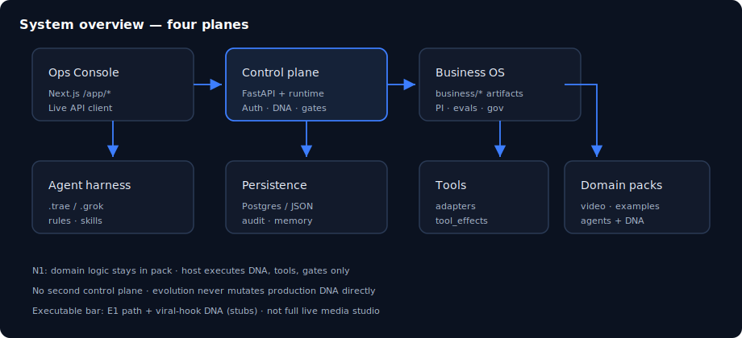

# Chapter 02: Mental model and layered architecture

> **Status:** PLAN SCAFFOLD — detailed outline for full prose in `book/user_guide/`  
> **Level:** Beginner  
> **Part:** Part I — Foundations  
> **Est. time:** 40 min  
> **Final path:** `book/user_guide/chapters/02-mental-model-and-layers.md`

## Illustration

*Figure: Mental model and layered architecture — source `assets/02-system-overview.svg`*

## Learning objectives

- Map repo folders to runtime layers
- Explain harness sync (.trae/.grok) vs runtime backend
- Trace a request: UI → API → runtime → tool → audit

## Narrative outline (to expand into full prose)

1. Layer table: starter, business, backend, frontend, generated
2. Repo map walk: backend/, frontend/, business/, rules/, scripts/
3. Request lifecycle sequence (operator click → JSON → DNA step)
4. Persistence: Postgres primary, JSON snapshot backup
5. Why evolution never mutates production DNA in place
6. Common misconception: 'second LangGraph control plane' — not here

## Hands-on labs

- [ ] From repo root, list top-level dirs and assign each to a layer
- [ ] Read docs/architecture.md end-to-end once

## Primary sources (do not invent beyond these without verifying)

- `docs/architecture.md`
- `structure.md`
- `docs/sync.md`

## Writing checklist (for full draft)

- [ ] Open with 1-paragraph “why this matters”
- [ ] Step-by-step commands that work on Windows PowerShell and bash where possible
- [ ] At least one “Expected result” block per major lab
- [ ] Explicit residual / non-claim callouts where relevant
- [ ] Cross-links to previous/next chapter
- [ ] Embed final SVG from `book/user_guide/assets/` (copied from this plan)

## Navigation

- TOC: [../TOC.md](../TOC.md)
- Plan: [../00_PLAN.md](../00_PLAN.md)
