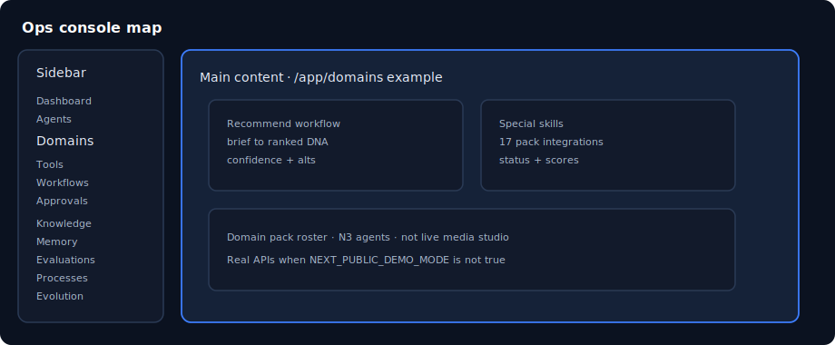

# Chapter 04: Ops console tour

> **Status:** PLAN SCAFFOLD — detailed outline for full prose in `book/user_guide/`  
> **Level:** Beginner  
> **Part:** Part I — Foundations  
> **Est. time:** 30 min  
> **Final path:** `book/user_guide/chapters/04-ops-console-tour.md`

## Illustration

*Figure: Ops console tour — source `assets/04-console-map.svg`*

## Learning objectives

- Navigate every sidebar group without dead ends
- Open Domains and recognize recommend + special skills panels
- Know where audit logs and API keys live

## Narrative outline (to expand into full prose)

1. Sidebar groups: Main, Data, Quality, Security, Admin
2. Route table: appPaths (dashboard, agents, domains, workflows, …)
3. Domains page panels deep-link
4. Permission-gated items (role-based visibility)
5. Command palette / mobile nav notes
6. Demo vs live visual cues in the UI

## Hands-on labs

- [ ] Click every Main nav item; screenshot or note empty states
- [ ] Open /app/domains and identify recommend-workflow-panel test id

## Primary sources (do not invent beyond these without verifying)

- `frontend/src/types/navigation.ts`
- `frontend/src/lib/routes/paths.ts`
- `frontend/src/app/app/[...slug]/page.tsx`

## Writing checklist (for full draft)

- [ ] Open with 1-paragraph “why this matters”
- [ ] Step-by-step commands that work on Windows PowerShell and bash where possible
- [ ] At least one “Expected result” block per major lab
- [ ] Explicit residual / non-claim callouts where relevant
- [ ] Cross-links to previous/next chapter
- [ ] Embed final SVG from `book/user_guide/assets/` (copied from this plan)

## Navigation

- TOC: [../TOC.md](../TOC.md)
- Plan: [../00_PLAN.md](../00_PLAN.md)
