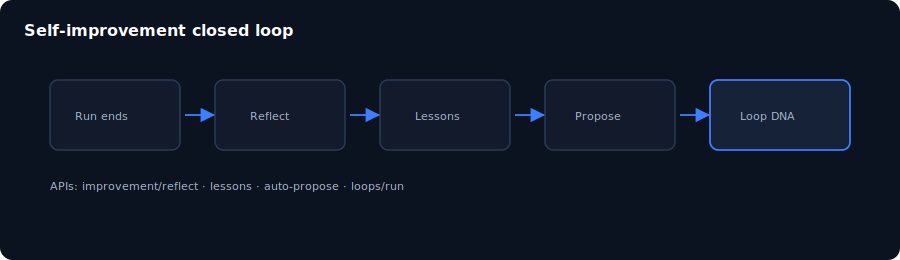

# Chapter 14: Self-improvement and loops

> **Status:** PLAN SCAFFOLD — detailed outline for full prose in `book/user_guide/`  
> **Level:** Advanced  
> **Part:** Part IV — Intelligence & improvement  
> **Est. time:** 50 min  
> **Final path:** `book/user_guide/chapters/14-self-improvement-loops.md`

## Illustration

*Figure: Self-improvement and loops — source `assets/13-self-improve.svg`*

## Learning objectives

- Run Improve pipeline steps on a completed run
- Locate lessons-learned artifacts
- Explain stop/continue criteria for loop DNA

## Narrative outline (to expand into full prose)

1. Closed loop: observe → verify → iterate
2. UI Improve: Reflect → Propose → Evaluate → Canary
3. APIs improvement/* and loops/*
4. Lesson library quality controls
5. Auto-propose sandbox variants
6. Link to self-evolving agent literature (docs mapping)

## Hands-on labs

- [ ] On a completed E1 run, execute Reflect
- [ ] GET improvement/lessons
- [ ] Read one lesson file under business/evolution/lessons-learned/

## Primary sources (do not invent beyond these without verifying)

- `docs/self-improvement-and-orchestration.md`
- `docs/usage.md (API table)`
- `backend/app/infrastructure/self_improvement/`

## Writing checklist (for full draft)

- [ ] Open with 1-paragraph “why this matters”
- [ ] Step-by-step commands that work on Windows PowerShell and bash where possible
- [ ] At least one “Expected result” block per major lab
- [ ] Explicit residual / non-claim callouts where relevant
- [ ] Cross-links to previous/next chapter
- [ ] Embed final SVG from `book/user_guide/assets/` (copied from this plan)

## Navigation

- TOC: [../TOC.md](../TOC.md)
- Plan: [../00_PLAN.md](../00_PLAN.md)
