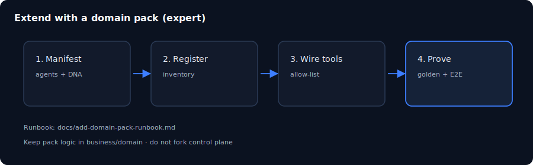

# Chapter 17: Extend DNA, agents, and packs

> **Status:** PLAN SCAFFOLD — detailed outline for full prose in `book/user_guide/`  
> **Level:** Expert  
> **Part:** Part V — Expert & production  
> **Est. time:** 90 min  
> **Final path:** `book/user_guide/chapters/17-extend-dna-agents-packs.md`

## Illustration

*Figure: Extend DNA, agents, and packs — source `assets/14-extend-pack.svg`*

## Learning objectives

- Scaffold a minimal domain pack or DNA extension
- Register tools and allow-list agents correctly
- Prove with golden task + inventory check

## Narrative outline (to expand into full prose)

1. When to extend pack vs host
2. Manifest and versioning matrix
3. Agent JSON + DNA authoring steps
4. Tool adapter stub pattern
5. inventory_check and corpus standalone checks
6. Anti-patterns: second control plane, rubber-stamp scores

## Hands-on labs

- [ ] Study example_education or example_research pack
- [ ] Draft a one-page design for your pack
- [ ] Run inventory_check on video pack for reference

## Primary sources (do not invent beyond these without verifying)

- `docs/add-domain-pack-runbook.md`
- `docs/domain-pack-versioning-matrix.md`
- `business/example_education/`
- `scripts/business/`

## Writing checklist (for full draft)

- [ ] Open with 1-paragraph “why this matters”
- [ ] Step-by-step commands that work on Windows PowerShell and bash where possible
- [ ] At least one “Expected result” block per major lab
- [ ] Explicit residual / non-claim callouts where relevant
- [ ] Cross-links to previous/next chapter
- [ ] Embed final SVG from `book/user_guide/assets/` (copied from this plan)

## Navigation

- TOC: [../TOC.md](../TOC.md)
- Plan: [../00_PLAN.md](../00_PLAN.md)
