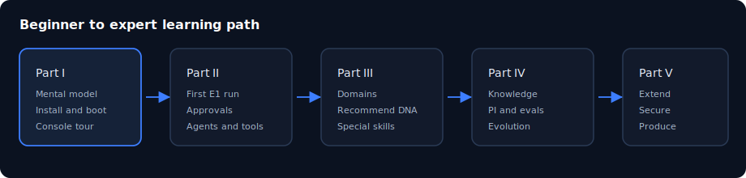

# Chapter 19: Expert playbooks and checklists

> **Status:** PLAN SCAFFOLD — detailed outline for full prose in `book/user_guide/`  
> **Level:** Expert  
> **Part:** Part V — Expert & production  
> **Est. time:** 40 min + ongoing  
> **Final path:** `book/user_guide/chapters/19-expert-playbooks-and-checklists.md`

## Illustration

*Figure: Expert playbooks and checklists — source `assets/01-learning-path.svg`*

## Learning objectives

- Use role-based daily/weekly checklists
- Know where design-phase books fit as deep reference
- Define personal mastery criteria

## Narrative outline (to expand into full prose)

1. Operator daily checklist
2. Pack author release checklist
3. Platform SRE weekly checklist
4. Mastery rubric (can teach E1, recommend, promote rules)
5. Where to go next: structure.md, design_phase books, gap analyses
6. Appendix pointers (glossary, API cheat sheet, command cheat sheet)

## Hands-on labs

- [ ] Complete mastery self-score (1–5) per rubric row
- [ ] Write one playbook for your org's top workflow

## Primary sources (do not invent beyond these without verifying)

- `reviews/e1_operator_checklist.md`
- `mark_100_verification.md`
- `book/design_phase/`
- `planning/user_guide/TOC.md`

## Writing checklist (for full draft)

- [ ] Open with 1-paragraph “why this matters”
- [ ] Step-by-step commands that work on Windows PowerShell and bash where possible
- [ ] At least one “Expected result” block per major lab
- [ ] Explicit residual / non-claim callouts where relevant
- [ ] Cross-links to previous/next chapter
- [ ] Embed final SVG from `book/user_guide/assets/` (copied from this plan)

## Navigation

- TOC: [../TOC.md](../TOC.md)
- Plan: [../00_PLAN.md](../00_PLAN.md)
